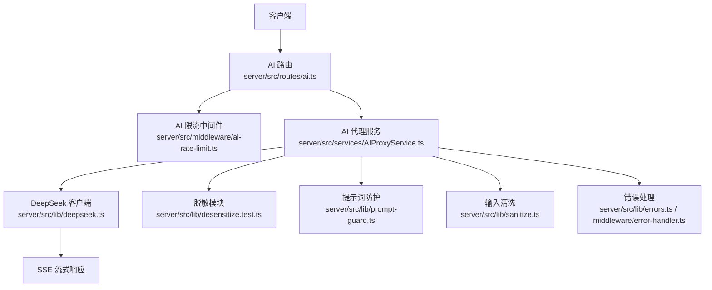
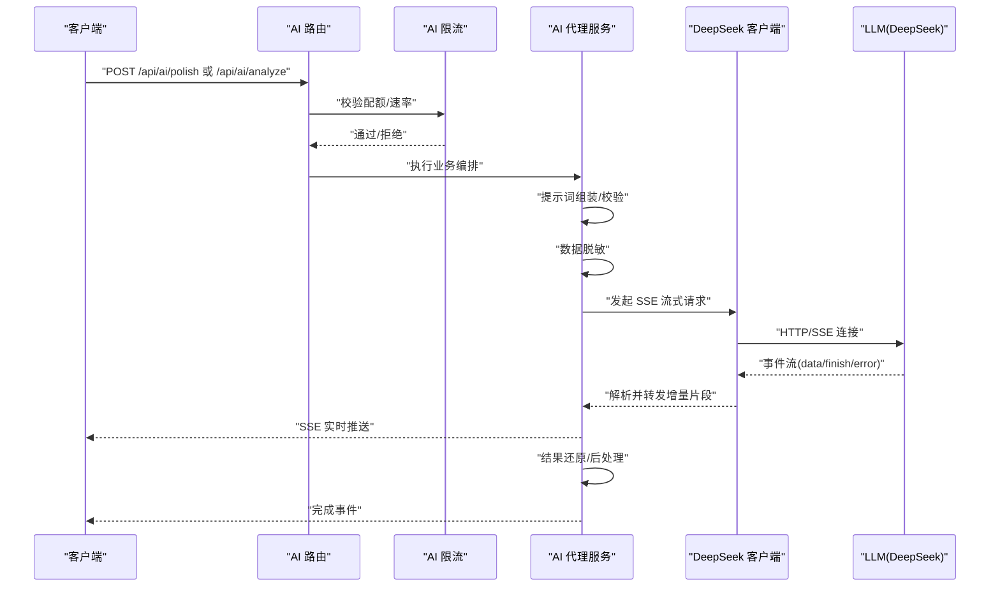
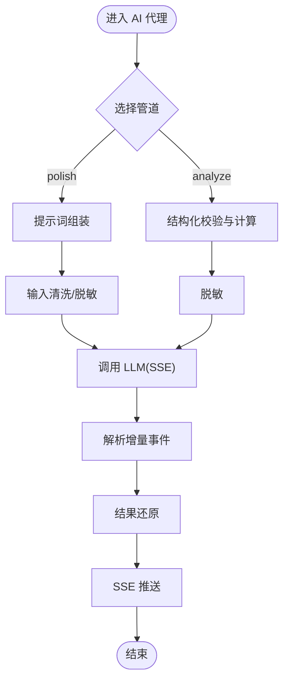
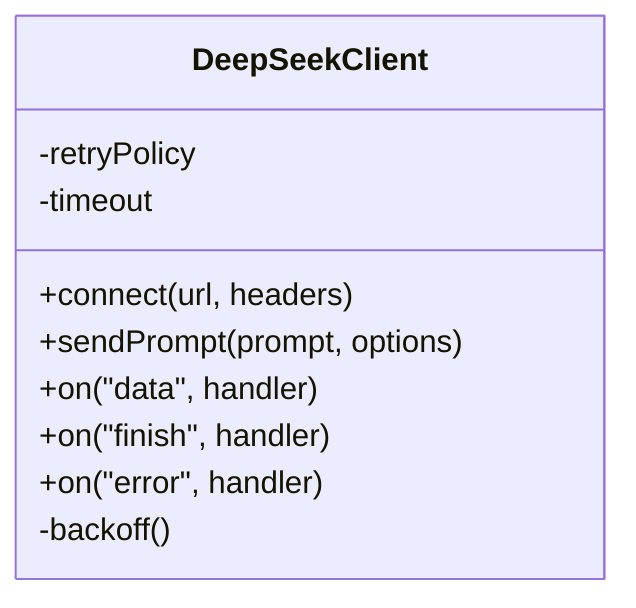
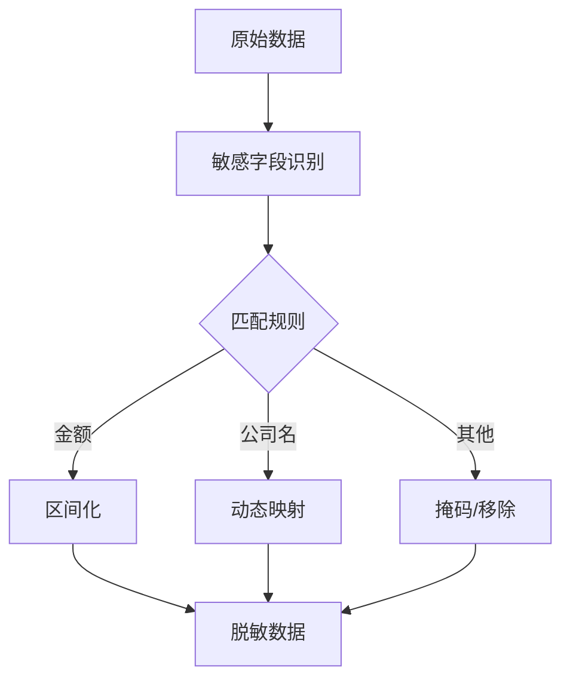
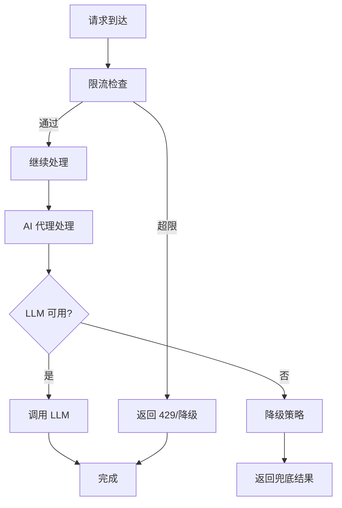
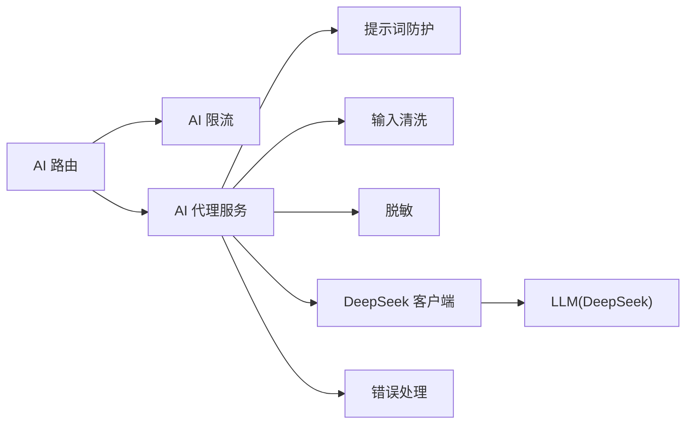

# AI集成API

<cite>
**本文引用的文件**   
- [server/src/routes/ai.ts](file://server/src/routes/ai.ts)
- [server/src/services/AIProxyService.ts](file://server/src/services/AIProxyService.ts)
- [server/src/lib/deepseek.ts](file://server/src/lib/deepseek.ts)
- [server/src/middleware/ai-rate-limit.ts](file://server/src/middleware/ai-rate-limit.ts)
- [server/src/lib/desensitize.test.ts](file://server/src/lib/desensitize.test.ts)
- [server/src/lib/prompt-guard.ts](file://server/src/lib/prompt-guard.ts)
- [server/src/lib/sanitize.ts](file://server/src/lib/sanitize.ts)
- [server/src/lib/errors.ts](file://server/src/lib/errors.ts)
- [server/src/middleware/error-handler.ts](file://server/src/middleware/error-handler.ts)
- [server/src/config/env.ts](file://server/src/config/env.ts)
- [server/scripts/ai-http-live.ts](file://server/scripts/ai-http-live.ts)
- [server/scripts/ai-pipeline-smoke.ts](file://server/scripts/ai-pipeline-smoke.ts)
- [web/src/lib/ai-stream.ts](file://web/src/lib/ai-stream.ts)
</cite>

## 目录
1. [简介](#简介)
2. [项目结构](#项目结构)
3. [核心组件](#核心组件)
4. [架构总览](#架构总览)
5. [详细组件分析](#详细组件分析)
6. [依赖关系分析](#依赖关系分析)
7. [性能考量](#性能考量)
8. [故障排查指南](#故障排查指南)
9. [结论](#结论)
10. [附录](#附录)

## 简介
本文件为 FY200 AI 集成功能的详细 API 文档，聚焦“文本润色”与“智能分析”双管道架构。系统基于 Express + Prisma + PostgreSQL + JWT + DeepSeek SSE 流式接口构建，提供统一的 AI 能力接入点，涵盖数据脱敏、LLM 调用封装、结果还原、SSE 实时传输、限流控制、错误重试与降级策略等关键能力。同时给出模型配置、提示词管理与性能调优的接口说明，以及使用限制、成本优化与最佳实践建议。

## 项目结构
AI 相关代码主要位于后端 server 层：
- 路由层：暴露 /api/ai 系列接口
- 服务层：AI 代理与业务编排
- 工具层：DeepSeek 客户端、脱敏、提示词防护、通用错误处理
- 中间件：AI 专用限流、全局错误处理、鉴权与审计
- 脚本：SSE 在线调试与冒烟测试
- 前端：SSE 客户端实现

**图示来源** 
- [server/src/routes/ai.ts](file://server/src/routes/ai.ts)
- [server/src/services/AIProxyService.ts](file://server/src/services/AIProxyService.ts)
- [server/src/lib/deepseek.ts](file://server/src/lib/deepseek.ts)
- [server/src/middleware/ai-rate-limit.ts](file://server/src/middleware/ai-rate-limit.ts)
- [server/src/lib/desensitize.test.ts](file://server/src/lib/desensitize.test.ts)
- [server/src/lib/prompt-guard.ts](file://server/src/lib/prompt-guard.ts)
- [server/src/lib/sanitize.ts](file://server/src/lib/sanitize.ts)
- [server/src/lib/errors.ts](file://server/src/lib/errors.ts)
- [server/src/middleware/error-handler.ts](file://server/src/middleware/error-handler.ts)

**章节来源**
- [server/src/routes/ai.ts](file://server/src/routes/ai.ts)
- [server/src/services/AIProxyService.ts](file://server/src/services/AIProxyService.ts)
- [server/src/lib/deepseek.ts](file://server/src/lib/deepseek.ts)
- [server/src/middleware/ai-rate-limit.ts](file://server/src/middleware/ai-rate-limit.ts)

## 核心组件
- AI 路由：统一入口，按路径区分 polish（文本润色）与 analyze（智能分析）两个管道，挂载 AI 限流中间件。
- AI 代理服务：编排双管道流程，负责参数校验、提示词组装、数据脱敏、LLM 调用、结果还原与流式输出。
- DeepSeek 客户端：封装 SSE 流式请求、事件解析、超时与重试策略。
- 脱敏模块：金额区间化、公司名动态映射等规则，确保敏感信息不出域。
- 提示词防护：白名单模板、注入检测、长度与字符集限制。
- 错误处理：标准化错误码、可观测日志、降级返回。

**章节来源**
- [server/src/routes/ai.ts](file://server/src/routes/ai.ts)
- [server/src/services/AIProxyService.ts](file://server/src/services/AIProxyService.ts)
- [server/src/lib/deepseek.ts](file://server/src/lib/deepseek.ts)
- [server/src/lib/desensitize.test.ts](file://server/src/lib/desensitize.test.ts)
- [server/src/lib/prompt-guard.ts](file://server/src/lib/prompt-guard.ts)
- [server/src/lib/errors.ts](file://server/src/lib/errors.ts)

## 架构总览
AI 双管道架构遵循“输入脱敏 → LLM 调用 → 结果还原”的闭环，SSE 用于实时增量输出。

**图示来源** 
- [server/src/routes/ai.ts](file://server/src/routes/ai.ts)
- [server/src/services/AIProxyService.ts](file://server/src/services/AIProxyService.ts)
- [server/src/lib/deepseek.ts](file://server/src/lib/deepseek.ts)
- [server/src/middleware/ai-rate-limit.ts](file://server/src/middleware/ai-rate-limit.ts)

## 详细组件分析

### AI 路由与接口定义
- 端点
  - POST /api/ai/polish：文本润色管道
  - POST /api/ai/analyze：智能分析管道
- 公共行为
  - 启用 AI 限流中间件
  - 统一 JSON 入参校验
  - 支持 SSE 流式响应
- 典型入参与出参
  - polish：包含待润色文本、风格偏好、上下文摘要等；返回增量文本片段与最终结果
  - analyze：包含结构化数据、指标维度、计算口径、分析目标等；返回结构化洞察与可视化建议

**章节来源**
- [server/src/routes/ai.ts](file://server/src/routes/ai.ts)

### AI 代理服务（双管道编排）
- 文本润色管道（polish）
  - 步骤：提示词组装 → 输入清洗 → 敏感信息脱敏 → LLM 调用 → 结果还原 → SSE 推送
- 智能分析管道（analyze）
  - 步骤：结构化数据校验 → 指标计算（同比/环比）→ 脱敏 → 提示词组装 → LLM 调用 → 结果还原 → SSE 推送
- 关键职责
  - 参数校验与默认值填充
  - 提示词模板管理（白名单、注入检测）
  - 数据脱敏策略执行
  - 流式事件解析与合并
  - 错误捕获与降级策略

**图示来源** 
- [server/src/services/AIProxyService.ts](file://server/src/services/AIProxyService.ts)
- [server/src/lib/desensitize.test.ts](file://server/src/lib/desensitize.test.ts)
- [server/src/lib/prompt-guard.ts](file://server/src/lib/prompt-guard.ts)
- [server/src/lib/sanitize.ts](file://server/src/lib/sanitize.ts)
- [server/src/lib/deepseek.ts](file://server/src/lib/deepseek.ts)

**章节来源**
- [server/src/services/AIProxyService.ts](file://server/src/services/AIProxyService.ts)

### DeepSeek 客户端（SSE 流式封装）
- 功能要点
  - 建立 HTTP/SSE 连接，设置超时与心跳
  - 解析 data/finish/error 事件
  - 重试策略：指数退避、最大重试次数、熔断阈值
  - 背压控制：避免上游写入阻塞
- 错误处理
  - 网络异常、超时、协议不匹配、服务端错误
  - 统一转换为内部错误码并上报

**图示来源** 
- [server/src/lib/deepseek.ts](file://server/src/lib/deepseek.ts)

**章节来源**
- [server/src/lib/deepseek.ts](file://server/src/lib/deepseek.ts)

### 数据脱敏规则
- 绝对金额 → 区间化（如“小于1万”“1-5万”“5-10万”等）
- 公司名 → 动态映射（根据租户/组织映射表替换为代号）
- 其他敏感字段（如联系人、电话、邮箱）按策略掩码或移除
- 脱敏与还原成对出现，保证下游 LLM 不可见原始值，上游可恢复可读性

**图示来源** 
- [server/src/lib/desensitize.test.ts](file://server/src/lib/desensitize.test.ts)

**章节来源**
- [server/src/lib/desensitize.test.ts](file://server/src/lib/desensitize.test.ts)

### 提示词管理与防护
- 白名单模板：仅允许预置模板与受控变量注入
- 注入检测：过滤恶意指令、越权操作、外部链接
- 长度与字符集限制：防止超长与非法字符导致异常
- 版本化管理：便于回滚与灰度发布

**章节来源**
- [server/src/lib/prompt-guard.ts](file://server/src/lib/prompt-guard.ts)

### 输入清洗与安全
- 去除不可见字符、HTML/JS 标签
- 规范化换行与空白
- 编码统一（UTF-8），避免乱码

**章节来源**
- [server/src/lib/sanitize.ts](file://server/src/lib/sanitize.ts)

### 限流控制与降级策略
- AI 专用限流：按用户/IP/租户维度计数，支持令牌桶/滑动窗口
- 全局错误处理：统一错误码、消息与堆栈脱敏
- 降级策略：当 LLM 不可用或超限时，返回缓存/兜底模板或延迟重试队列

**图示来源** 
- [server/src/middleware/ai-rate-limit.ts](file://server/src/middleware/ai-rate-limit.ts)
- [server/src/middleware/error-handler.ts](file://server/src/middleware/error-handler.ts)
- [server/src/lib/errors.ts](file://server/src/lib/errors.ts)

**章节来源**
- [server/src/middleware/ai-rate-limit.ts](file://server/src/middleware/ai-rate-limit.ts)
- [server/src/middleware/error-handler.ts](file://server/src/middleware/error-handler.ts)
- [server/src/lib/errors.ts](file://server/src/lib/errors.ts)

### 模型配置与环境变量
- 模型选择：通过环境变量切换不同模型或端点
- 密钥管理：从安全存储读取访问令牌
- 超时与并发：调整请求超时、并发上限与重试次数
- 日志级别：控制调试与生产环境日志粒度

**章节来源**
- [server/src/config/env.ts](file://server/src/config/env.ts)

### 前端 SSE 客户端
- 连接建立：自动重连、心跳保活
- 事件处理：增量渲染、完成事件合并、错误提示
- 用户体验：骨架屏、进度指示、取消请求

**章节来源**
- [web/src/lib/ai-stream.ts](file://web/src/lib/ai-stream.ts)

## 依赖关系分析
- 路由依赖限流中间件与服务层
- 服务层依赖脱敏、提示词防护、输入清洗与 DeepSeek 客户端
- DeepSeek 客户端依赖网络库与事件解析器
- 错误处理贯穿全链路，统一上报与展示

**图示来源** 
- [server/src/routes/ai.ts](file://server/src/routes/ai.ts)
- [server/src/services/AIProxyService.ts](file://server/src/services/AIProxyService.ts)
- [server/src/lib/deepseek.ts](file://server/src/lib/deepseek.ts)
- [server/src/middleware/ai-rate-limit.ts](file://server/src/middleware/ai-rate-limit.ts)
- [server/src/lib/prompt-guard.ts](file://server/src/lib/prompt-guard.ts)
- [server/src/lib/sanitize.ts](file://server/src/lib/sanitize.ts)
- [server/src/lib/desensitize.test.ts](file://server/src/lib/desensitize.test.ts)
- [server/src/lib/errors.ts](file://server/src/lib/errors.ts)

**章节来源**
- [server/src/routes/ai.ts](file://server/src/routes/ai.ts)
- [server/src/services/AIProxyService.ts](file://server/src/services/AIProxyService.ts)
- [server/src/lib/deepseek.ts](file://server/src/lib/deepseek.ts)

## 性能考量
- 流式传输：优先使用 SSE 增量输出，降低首字节延迟
- 批量化与缓存：对重复查询与提示词进行缓存，减少 LLM 调用
- 并发控制：限制并发请求数，避免后端过载
- 资源回收：及时关闭连接与释放内存，避免泄漏
- 监控与告警：记录 QPS、延迟、错误率与成本指标

[本节为通用指导，无需具体文件引用]

## 故障排查指南
- 常见问题
  - 429 限流：检查限流阈值与配额分配
  - 502/504 网关错误：检查 LLM 连通性与超时配置
  - 数据不一致：核对脱敏与还原逻辑是否成对
  - 提示词被拦截：检查白名单模板与注入检测规则
- 定位手段
  - 查看错误码与消息，结合 trace-id 追踪
  - 使用在线调试脚本验证 SSE 连接与事件流
  - 开启更详细的日志级别，观察关键节点耗时

**章节来源**
- [server/src/lib/errors.ts](file://server/src/lib/errors.ts)
- [server/src/middleware/error-handler.ts](file://server/src/middleware/error-handler.ts)
- [server/scripts/ai-http-live.ts](file://server/scripts/ai-http-live.ts)
- [server/scripts/ai-pipeline-smoke.ts](file://server/scripts/ai-pipeline-smoke.ts)

## 结论
FY200 AI 集成以双管道架构为核心，围绕“脱敏—LLM—还原”的安全闭环，结合 SSE 流式传输与完善的限流、错误处理与降级策略，提供了稳定、高效且可控的 AI 能力接入。通过模型配置、提示词管理与性能调优接口，可在保障数据安全的前提下，持续优化成本与体验。

[本节为总结性内容，无需具体文件引用]

## 附录

### API 参考（概览）
- POST /api/ai/polish
  - 用途：文本润色
  - 入参：文本、风格、上下文摘要
  - 出参：SSE 增量文本、最终结果
- POST /api/ai/analyze
  - 用途：智能分析
  - 入参：结构化数据、指标维度、计算口径、分析目标
  - 出参：SSE 增量洞察、最终报告与建议

[本节为概念性说明，无需具体文件引用]

### 使用限制与最佳实践
- 使用限制
  - 单租户并发与 QPS 上限
  - 单次请求大小与时长限制
  - 敏感字段强制脱敏
- 成本优化
  - 合理拆分任务，避免大段冗余文本
  - 复用提示词模板与缓存结果
  - 选择合适的模型与参数
- 最佳实践
  - 明确输入结构与约束
  - 使用最小必要权限与数据范围
  - 做好错误重试与降级预案

[本节为通用指导，无需具体文件引用]