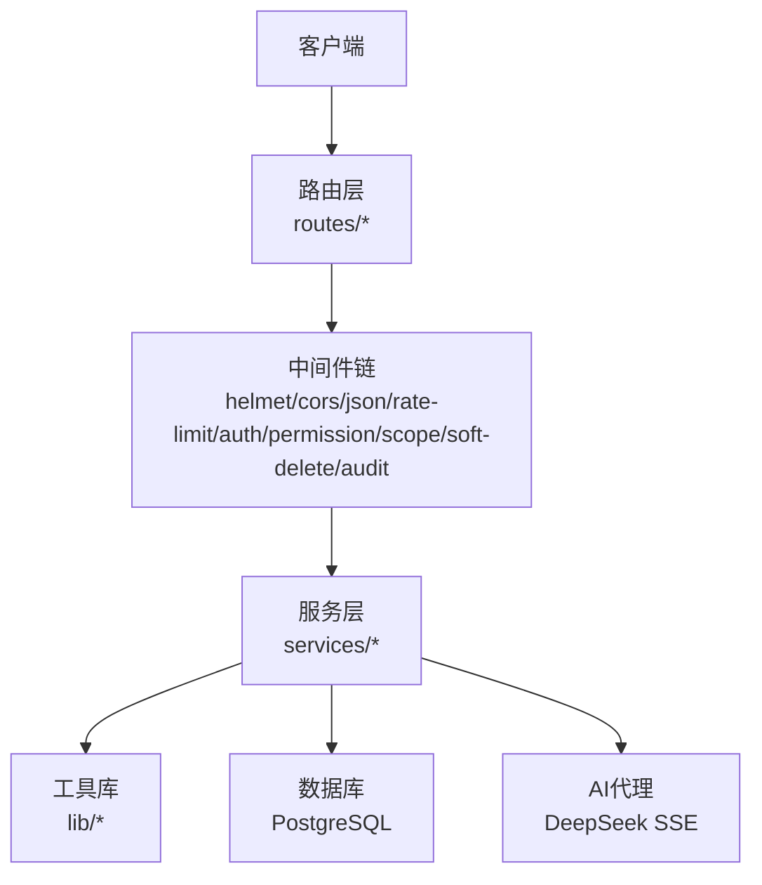
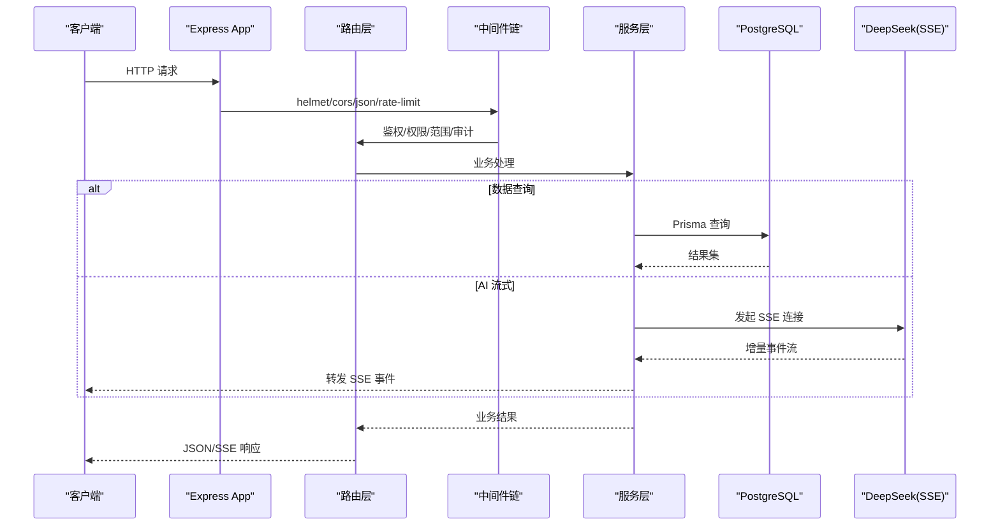
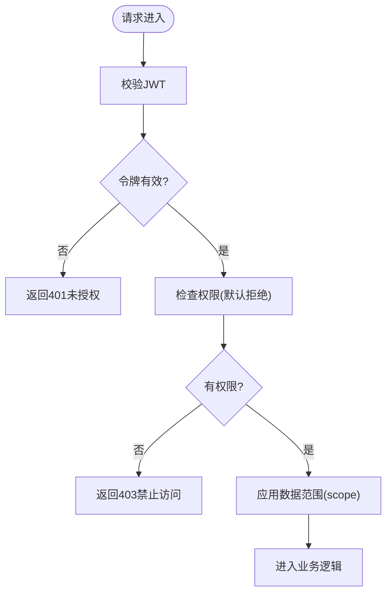
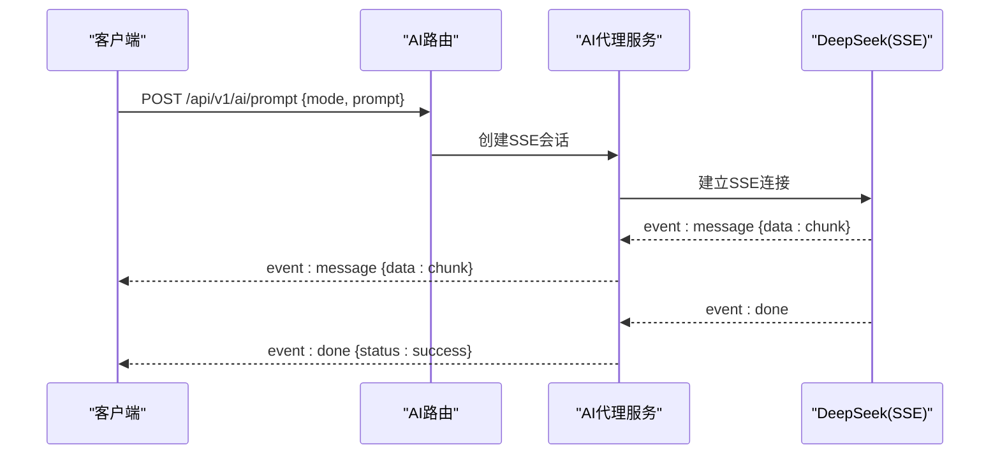
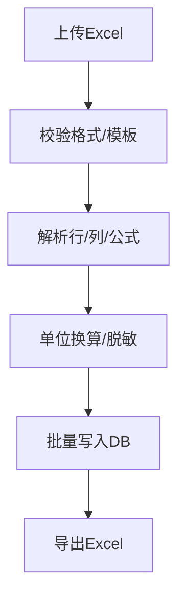
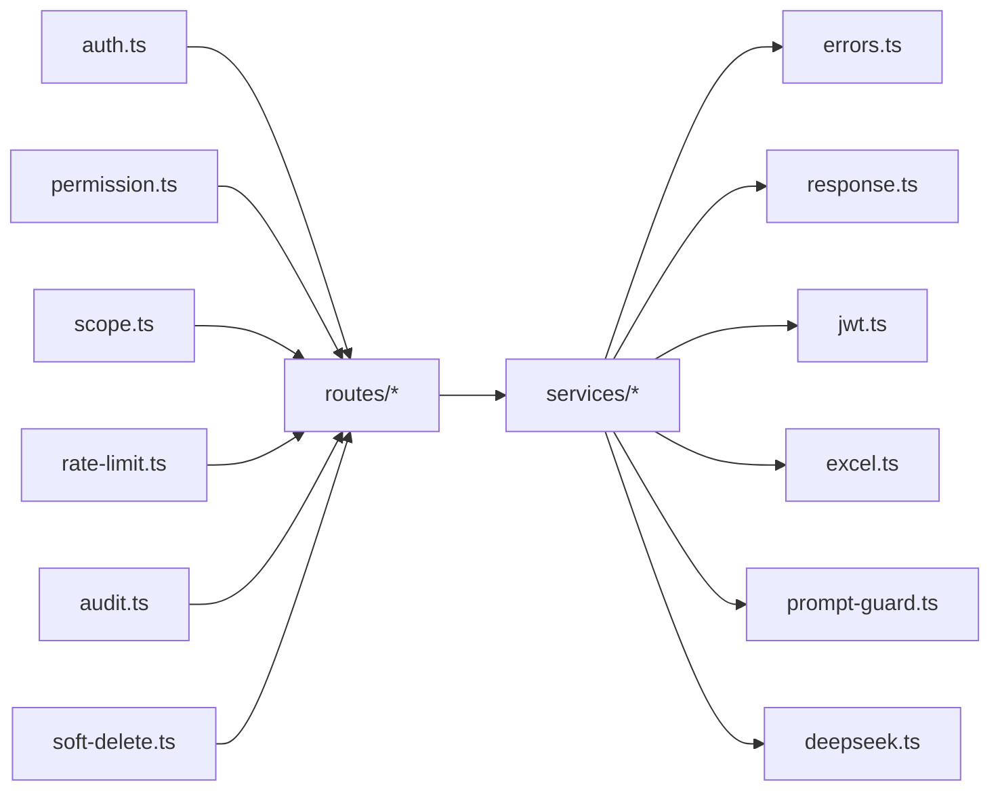

# API参考文档

<cite>
**本文引用的文件**   
- [server/src/app.ts](file://server/src/app.ts)
- [server/src/server.ts](file://server/src/server.ts)
- [server/src/routes/auth.ts](file://server/src/routes/auth.ts)
- [server/src/routes/ai.ts](file://server/src/routes/ai.ts)
- [server/src/routes/data.ts](file://server/src/routes/data.ts)
- [server/src/routes/reports.ts](file://server/src/routes/reports.ts)
- [server/src/routes/admin.ts](file://server/src/routes/admin.ts)
- [server/src/routes/dashboard.ts](file://server/src/routes/dashboard.ts)
- [server/src/routes/indicators.ts](file://server/src/routes/indicators.ts)
- [server/src/middleware/auth.ts](file://server/src/middleware/auth.ts)
- [server/src/middleware/cors.ts](file://server/src/middleware/cors.ts)
- [server/src/middleware/error-handler.ts](file://server/src/middleware/error-handler.ts)
- [server/src/middleware/rate-limit.ts](file://server/src/middleware/rate-limit.ts)
- [server/src/middleware/permission.ts](file://server/src/middleware/permission.ts)
- [server/src/middleware/scope.ts](file://server/src/middleware/scope.ts)
- [server/src/middleware/soft-delete.ts](file://server/src/middleware/soft-delete.ts)
- [server/src/middleware/audit.ts](file://server/src/middleware/audit.ts)
- [server/src/middleware/helmet.ts](file://server/src/middleware/helmet.ts)
- [server/src/middleware/trace-id.ts](file://server/src/middleware/trace-id.ts)
- [server/src/lib/errors.ts](file://server/src/lib/errors.ts)
- [server/src/lib/response.ts](file://server/src/lib/response.ts)
- [server/src/lib/jwt.ts](file://server/src/lib/jwt.ts)
- [server/src/lib/deepseek.ts](file://server/src/lib/deepseek.ts)
- [server/src/services/AIProxyService.ts](file://server/src/services/AIProxyService.ts)
- [server/src/config/env.ts](file://server/src/config/env.ts)
- [web/src/lib/api.ts](file://web/src/lib/api.ts)
- [web/src/lib/ai-stream.ts](file://web/src/lib/ai-stream.ts)
</cite>

## 目录
1. [简介](#简介)
2. [项目结构](#项目结构)
3. [核心组件](#核心组件)
4. [架构总览](#架构总览)
5. [详细组件分析](#详细组件分析)
6. [依赖关系分析](#依赖关系分析)
7. [性能考量](#性能考量)
8. [故障排查指南](#故障排查指南)
9. [结论](#结论)
10. [附录](#附录)

## 简介
本文件为 FY200 财年经营数据分析平台的全面 API 参考。平台定位“Excel进、看板/报表出”，统一单位为万元/人民币，后端技术栈为 Express 4 + Prisma 5 + PostgreSQL 15 + JWT（access 15min / refresh 7day 轮转）+ DeepSeek API（SSE 流式）。中间件执行链顺序：helmet → cors → express.json → rate-limit → auth(JWT+黑名单) → permission(默认拒绝) → scope(Prisma extension) → softDelete → audit → Service → Prisma → PostgreSQL。计算类指标使用安全公式解析（白名单算子 +-*/()，禁止 eval），同比/环比由后端实时计算不存库。AI 双管道架构：polish（文本→脱敏→LLM→还原）/ analyze（结构化→计算→脱敏→LLM→生成），脱敏规则：绝对金额→区间，公司名→动态映射。

## 项目结构
后端采用分层与按功能划分相结合的组织方式：
- routes：RESTful 路由定义（认证、AI、数据、报表、管理、看板、指标等）
- middleware：通用横切能力（鉴权、权限、限流、审计、软删除、错误处理等）
- services：业务服务层（AI代理、聚合、导入导出、报表、指标等）
- lib：工具与基础设施（JWT、响应封装、错误、日志、表达式、Excel、PromptGuard 等）
- config：环境配置
- server.ts：应用启动入口；app.ts：Express 应用装配

**图示来源**
- [server/src/app.ts](file://server/src/app.ts)
- [server/src/server.ts](file://server/src/server.ts)

**章节来源**
- [server/src/app.ts](file://server/src/app.ts)
- [server/src/server.ts](file://server/src/server.ts)

## 核心组件
- 认证与授权
  - JWT 签发与校验、刷新与黑名单机制
  - 基于角色的权限控制（默认拒绝策略）
  - 数据范围控制（scope）通过 Prisma extension 注入
- 错误与响应
  - 统一错误类型与状态码映射
  - 统一响应包装（成功/失败结构）
- 限流与安全
  - 全局与接口级限流
  - Helmet 安全头、CORS 跨域、TraceId 追踪
- AI 代理
  - 面向 DeepSeek 的 SSE 流式转发
  - 双管道：polish（文本）与 analyze（结构化）
- 数据与报表
  - Excel 导入/导出、公式规则校验、指标计算
  - 报表生成与导出

**章节来源**
- [server/src/middleware/auth.ts](file://server/src/middleware/auth.ts)
- [server/src/middleware/permission.ts](file://server/src/middleware/permission.ts)
- [server/src/middleware/scope.ts](file://server/src/middleware/scope.ts)
- [server/src/lib/errors.ts](file://server/src/lib/errors.ts)
- [server/src/lib/response.ts](file://server/src/lib/response.ts)
- [server/src/middleware/rate-limit.ts](file://server/src/middleware/rate-limit.ts)
- [server/src/middleware/helmet.ts](file://server/src/middleware/helmet.ts)
- [server/src/middleware/cors.ts](file://server/src/middleware/cors.ts)
- [server/src/lib/jwt.ts](file://server/src/lib/jwt.ts)
- [server/src/lib/deepseek.ts](file://server/src/lib/deepseek.ts)
- [server/src/services/AIProxyService.ts](file://server/src/services/AIProxyService.ts)

## 架构总览
整体调用链路从 HTTP 请求进入，经过安全与鉴权中间件后到达路由与服务层，最终访问数据库或外部 AI 服务。

**图示来源**
- [server/src/app.ts](file://server/src/app.ts)
- [server/src/middleware/auth.ts](file://server/src/middleware/auth.ts)
- [server/src/middleware/permission.ts](file://server/src/middleware/permission.ts)
- [server/src/middleware/scope.ts](file://server/src/middleware/scope.ts)
- [server/src/middleware/audit.ts](file://server/src/middleware/audit.ts)
- [server/src/services/AIProxyService.ts](file://server/src/services/AIProxyService.ts)
- [server/src/lib/deepseek.ts](file://server/src/lib/deepseek.ts)

## 详细组件分析

### 认证与鉴权（Auth & Permission）
- 登录与令牌
  - POST /api/v1/auth/login：提交用户名与密码，返回 access_token 与 refresh_token
  - POST /api/v1/auth/refresh：使用 refresh_token 换取新的 access_token
  - POST /api/v1/auth/logout：注销并加入黑名单
- 权限模型
  - 默认拒绝策略，需显式授予角色/资源权限
  - 支持基于资源的细粒度权限与数据范围（scope）

**图示来源**
- [server/src/middleware/auth.ts](file://server/src/middleware/auth.ts)
- [server/src/middleware/permission.ts](file://server/src/middleware/permission.ts)
- [server/src/middleware/scope.ts](file://server/src/middleware/scope.ts)

**章节来源**
- [server/src/routes/auth.ts](file://server/src/routes/auth.ts)
- [server/src/middleware/auth.ts](file://server/src/middleware/auth.ts)
- [server/src/middleware/permission.ts](file://server/src/middleware/permission.ts)
- [server/src/middleware/scope.ts](file://server/src/middleware/scope.ts)
- [server/src/lib/jwt.ts](file://server/src/lib/jwt.ts)

### AI 流式接口（SSE）
- 端点
  - POST /api/v1/ai/prompt：发送提示词，服务端以 SSE 流式返回增量内容
  - POST /api/v1/ai/analyze：结构化输入，经计算与脱敏后由 LLM 生成分析结果（SSE）
- 流程
  - 客户端建立 SSE 连接
  - 服务端将事件逐条转发（含进度、片段、完成、错误）
  - 支持 polish（文本）与 analyze（结构化）两种模式

**图示来源**
- [server/src/routes/ai.ts](file://server/src/routes/ai.ts)
- [server/src/services/AIProxyService.ts](file://server/src/services/AIProxyService.ts)
- [server/src/lib/deepseek.ts](file://server/src/lib/deepseek.ts)

**章节来源**
- [server/src/routes/ai.ts](file://server/src/routes/ai.ts)
- [server/src/services/AIProxyService.ts](file://server/src/services/AIProxyService.ts)
- [server/src/lib/deepseek.ts](file://server/src/lib/deepseek.ts)
- [web/src/lib/ai-stream.ts](file://web/src/lib/ai-stream.ts)

### 数据与报表（Data & Reports）
- 数据导入/导出
  - POST /api/v1/data/import：上传 Excel，解析并入库（支持模板校验与批量导入）
  - GET /api/v1/data/export：导出查询结果为 Excel
  - 限制：文件大小、列名映射、必填字段、单位换算（万元）
- 报表
  - GET /api/v1/reports/{id}：获取报表详情
  - POST /api/v1/reports/generate：根据模板与参数生成报表（异步任务）
  - GET /api/v1/reports/{taskId}/status：查询生成任务状态
  - GET /api/v1/reports/{taskId}/download：下载生成的报表文件

**图示来源**
- [server/src/routes/data.ts](file://server/src/routes/data.ts)
- [server/src/routes/reports.ts](file://server/src/routes/reports.ts)

**章节来源**
- [server/src/routes/data.ts](file://server/src/routes/data.ts)
- [server/src/routes/reports.ts](file://server/src/routes/reports.ts)

### 看板与指标（Dashboard & Indicators）
- 看板
  - GET /api/v1/dashboard：聚合关键指标（同比/环比实时计算）
- 指标
  - GET /api/v1/indicators：指标列表与维度筛选
  - GET /api/v1/indicators/{id}：指标详情与趋势

**章节来源**
- [server/src/routes/dashboard.ts](file://server/src/routes/dashboard.ts)
- [server/src/routes/indicators.ts](file://server/src/routes/indicators.ts)

### 管理端（Admin）
- 用户与权限管理
  - GET /api/v1/admin/users：用户列表
  - PUT /api/v1/admin/users/{id}/role：更新角色
  - GET /api/v1/admin/permissions：权限矩阵
- 审计与监控
  - GET /api/v1/admin/audit：审计日志查询

**章节来源**
- [server/src/routes/admin.ts](file://server/src/routes/admin.ts)

## 依赖关系分析
- 路由依赖中间件链进行安全与鉴权
- 服务层依赖工具库（错误、响应、JWT、表达式、Excel、PromptGuard）
- AI 代理依赖 DeepSeek SSE 实现流式传输
- 所有写操作受审计与软删除影响

**图示来源**
- [server/src/middleware/auth.ts](file://server/src/middleware/auth.ts)
- [server/src/middleware/permission.ts](file://server/src/middleware/permission.ts)
- [server/src/middleware/scope.ts](file://server/src/middleware/scope.ts)
- [server/src/middleware/rate-limit.ts](file://server/src/middleware/rate-limit.ts)
- [server/src/middleware/audit.ts](file://server/src/middleware/audit.ts)
- [server/src/middleware/soft-delete.ts](file://server/src/middleware/soft-delete.ts)
- [server/src/lib/errors.ts](file://server/src/lib/errors.ts)
- [server/src/lib/response.ts](file://server/src/lib/response.ts)
- [server/src/lib/jwt.ts](file://server/src/lib/jwt.ts)
- [server/src/lib/deepseek.ts](file://server/src/lib/deepseek.ts)

**章节来源**
- [server/src/app.ts](file://server/src/app.ts)
- [server/src/server.ts](file://server/src/server.ts)

## 性能考量
- 连接与并发
  - 合理设置 Node.js 进程数与线程池大小
  - 数据库连接池调优（Prisma 连接数、超时、重试）
- 缓存与计算
  - 对热点看板指标引入缓存（Redis）
  - 同比/环比计算避免重复扫描，必要时物化视图
- I/O 优化
  - 大文件导入分块处理与流式解析
  - 导出使用流式写入减少内存占用
- 限流与降级
  - 接口级限流保护后端与第三方 AI
  - AI 调用失败时快速失败与重试退避

[本节为通用指导，无需代码引用]

## 故障排查指南
- 常见错误码
  - 400：请求参数错误或校验失败
  - 401：未认证或令牌过期
  - 403：无权限访问
  - 404：资源不存在
  - 429：请求频率超限
  - 500：服务器内部错误
  - 502/503：上游服务不可用（如 DeepSeek）
- 调试技巧
  - 开启 TraceId 并在日志中贯穿全链路
  - 使用浏览器开发者工具查看 SSE 事件流
  - 检查 CORS 与 Helmet 配置是否拦截请求
  - 查看审计日志定位变更轨迹
- 常见问题
  - 导入失败：核对模板列名与必填项
  - 指标异常：确认公式白名单与单位换算
  - AI 流中断：检查网络与令牌有效期

**章节来源**
- [server/src/middleware/error-handler.ts](file://server/src/middleware/error-handler.ts)
- [server/src/lib/errors.ts](file://server/src/lib/errors.ts)
- [server/src/middleware/trace-id.ts](file://server/src/middleware/trace-id.ts)
- [server/src/middleware/cors.ts](file://server/src/middleware/cors.ts)
- [server/src/middleware/helmet.ts](file://server/src/middleware/helmet.ts)

## 结论
FY200 平台通过清晰的层次结构与严格的中间件链，提供稳定可靠的 RESTful API 与 SSE 流式 AI 能力。遵循统一的错误与响应规范、完善的鉴权与审计机制，以及安全的公式解析与脱敏策略，确保在复杂财务场景下的准确性与安全性。建议在生产环境中结合缓存、限流与监控进一步优化性能与可观测性。

[本节为总结，无需代码引用]

## 附录

### API 版本管理与兼容性
- 版本前缀：/api/v1
- 向后兼容策略
  - 新增字段保持可选且默认值明确
  - 废弃字段保留至少两个主版本
  - 破坏性变更通过新路径或新版本发布

**章节来源**
- [server/src/app.ts](file://server/src/app.ts)

### 请求/响应示例（成功与失败）
- 登录成功
  - 方法：POST
  - URL：/api/v1/auth/login
  - 请求体：{ username, password }
  - 响应体：{ access_token, refresh_token, expires_in }
- 登录失败（参数缺失）
  - 响应体：{ code, message, details }
- AI 流式
  - 方法：POST
  - URL：/api/v1/ai/prompt
  - 请求体：{ mode: "polish", prompt: "..." }
  - 事件流：event: message { data: "片段" }, event: done { status: "success" }

[本节为示例说明，无需代码引用]

### 客户端集成指南与 SDK 使用
- 基础请求
  - 在请求头携带 Authorization: Bearer <access_token>
  - 处理 401 时自动刷新令牌并重试一次
- SSE 客户端
  - 使用 EventSource 或自定义流式读取器
  - 处理断线重连与超时
- 前端 SDK
  - 封装统一请求与错误处理
  - 提供 ai-stream 工具用于 SSE 消费

**章节来源**
- [web/src/lib/api.ts](file://web/src/lib/api.ts)
- [web/src/lib/ai-stream.ts](file://web/src/lib/ai-stream.ts)

### 环境变量与配置
- 关键变量
  - DATABASE_URL：数据库连接串
  - JWT_SECRET：签名密钥
  - DEEPSEEK_API_KEY：AI 服务密钥
  - CORS_ORIGINS：允许的来源
  - RATE_LIMIT_WINDOW：限流窗口
  - RATE_LIMIT_MAX：最大请求数

**章节来源**
- [server/src/config/env.ts](file://server/src/config/env.ts)