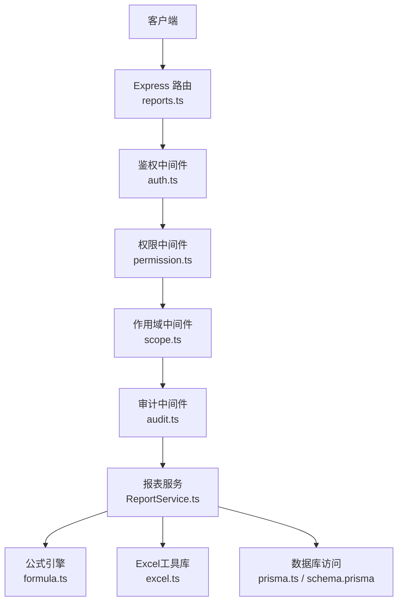
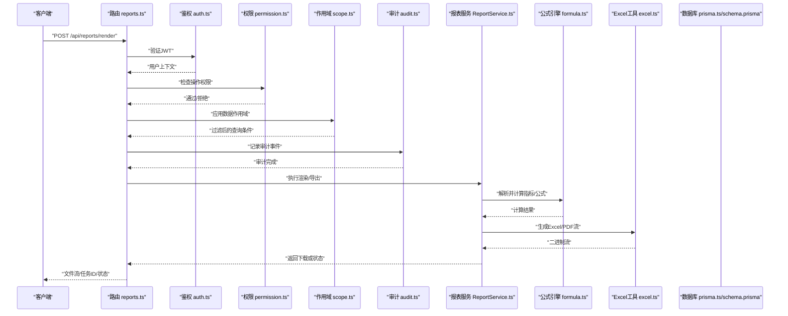
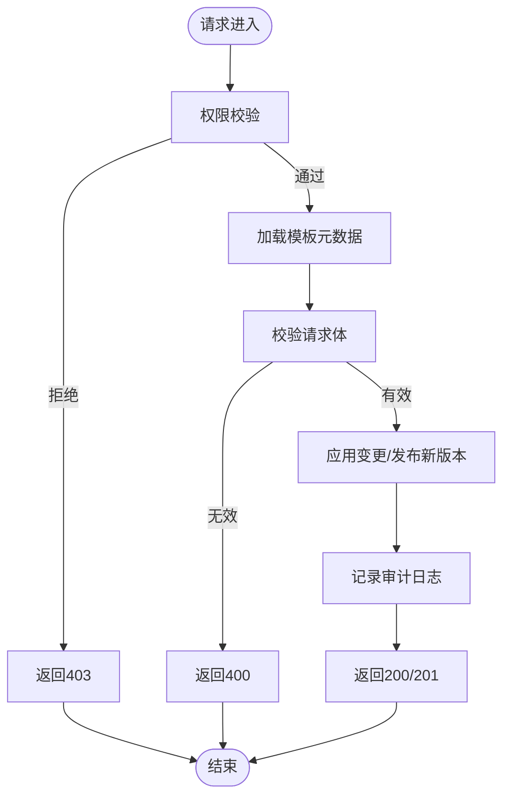
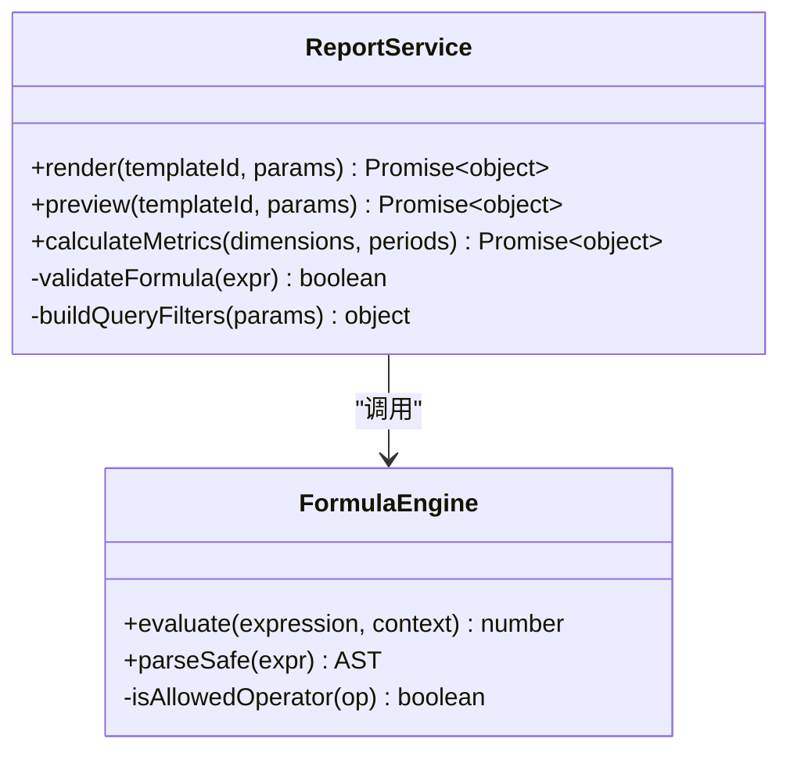
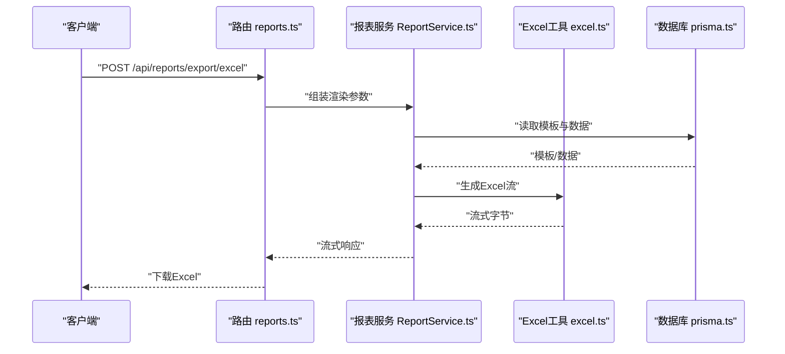
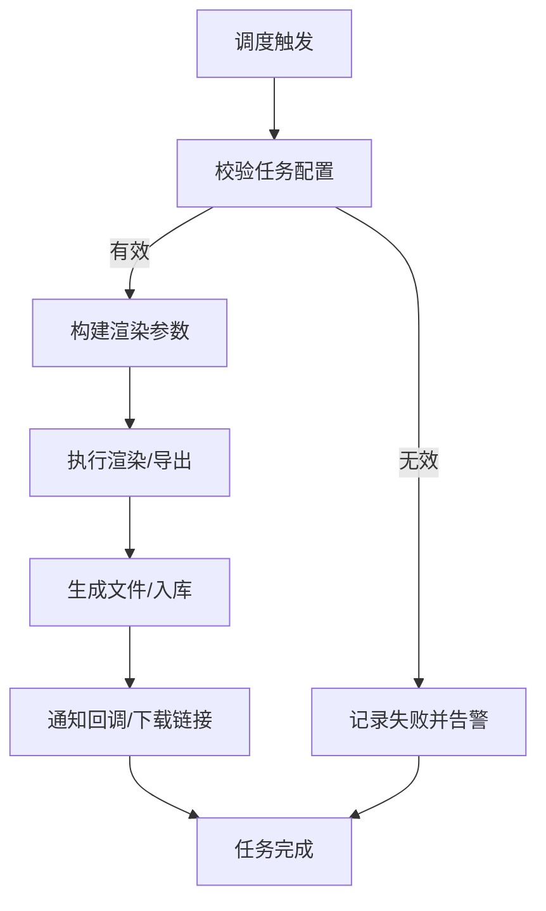
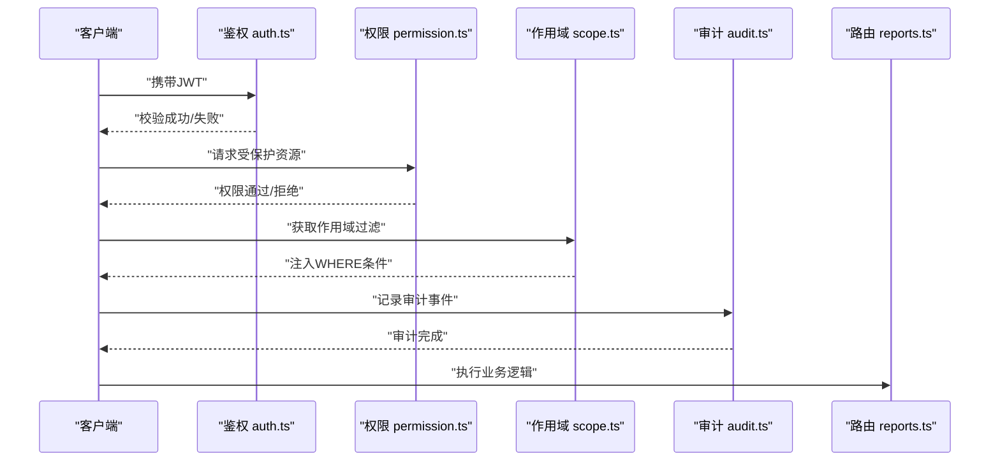
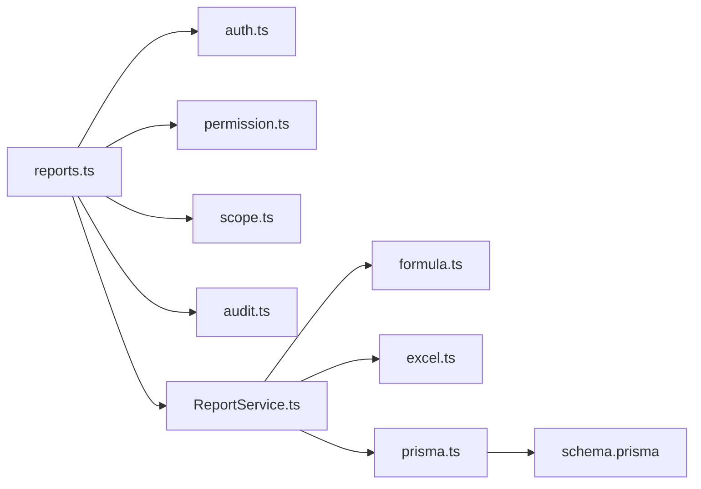

# 报表生成API

<cite>
**本文引用的文件**   
- [server/src/routes/reports.ts](file://server/src/routes/reports.ts)
- [server/src/services/ReportService.ts](file://server/src/services/ReportService.ts)
- [server/src/lib/excel.ts](file://server/src/lib/excel.ts)
- [server/src/middleware/auth.ts](file://server/src/middleware/auth.ts)
- [server/src/middleware/permission.ts](file://server/src/middleware/permission.ts)
- [server/src/middleware/scope.ts](file://server/src/middleware/scope.ts)
- [server/src/middleware/audit.ts](file://server/src/middleware/audit.ts)
- [server/src/lib/formula.ts](file://server/src/lib/formula.ts)
- [server/src/lib/prisma.ts](file://server/src/lib/prisma.ts)
- [server/prisma/schema.prisma](file://server/prisma/schema.prisma)
- [web/src/lib/report-export.ts](file://web/src/lib/report-export.ts)
</cite>

## 目录
1. [简介](#简介)
2. [项目结构](#项目结构)
3. [核心组件](#核心组件)
4. [架构总览](#架构总览)
5. [详细组件分析](#详细组件分析)
6. [依赖分析](#依赖分析)
7. [性能考虑](#性能考虑)
8. [故障排查指南](#故障排查指南)
9. [结论](#结论)
10. [附录](#附录)

## 简介
本文件为 FY200 财年经营数据分析平台的“报表生成API”完整技术文档。围绕报表模板管理、数据填充、导出格式转换（PDF、Excel）、报表调度与定时生成、批量导出、权限控制与访问审计、模板版本管理与向后兼容，以及大报表生成的性能优化与内存管理策略进行系统化说明。读者可据此快速理解接口契约、调用流程、安全与合规要求，以及生产部署注意事项。

## 项目结构
后端采用 Express 路由 + Prisma ORM + PostgreSQL 的三层架构：
- 路由层：定义 RESTful 接口，处理请求参数校验与响应封装
- 服务层：实现报表模板、指标计算、公式解析、导出编排等核心业务逻辑
- 中间件链：安全与治理（Helmet/CORS/限流/JWT鉴权/权限/作用域/软删除/审计）贯穿所有请求
- 数据层：Prisma 模型与迁移脚本，PostgreSQL 存储模板、指标、审计日志等

**图示来源** 
- [server/src/routes/reports.ts](file://server/src/routes/reports.ts)
- [server/src/middleware/auth.ts](file://server/src/middleware/auth.ts)
- [server/src/middleware/permission.ts](file://server/src/middleware/permission.ts)
- [server/src/middleware/scope.ts](file://server/src/middleware/scope.ts)
- [server/src/middleware/audit.ts](file://server/src/middleware/audit.ts)
- [server/src/services/ReportService.ts](file://server/src/services/ReportService.ts)
- [server/src/lib/formula.ts](file://server/src/lib/formula.ts)
- [server/src/lib/excel.ts](file://server/src/lib/excel.ts)
- [server/src/lib/prisma.ts](file://server/src/lib/prisma.ts)
- [server/prisma/schema.prisma](file://server/prisma/schema.prisma)

**章节来源**
- [server/src/routes/reports.ts](file://server/src/routes/reports.ts)
- [server/src/services/ReportService.ts](file://server/src/services/ReportService.ts)
- [server/src/middleware/auth.ts](file://server/src/middleware/auth.ts)
- [server/src/middleware/permission.ts](file://server/src/middleware/permission.ts)
- [server/src/middleware/scope.ts](file://server/src/middleware/scope.ts)
- [server/src/middleware/audit.ts](file://server/src/middleware/audit.ts)
- [server/src/lib/formula.ts](file://server/src/lib/formula.ts)
- [server/src/lib/excel.ts](file://server/src/lib/excel.ts)
- [server/src/lib/prisma.ts](file://server/src/lib/prisma.ts)
- [server/prisma/schema.prisma](file://server/prisma/schema.prisma)

## 核心组件
- 报表路由层：暴露模板CRUD、渲染、导出、批量导出、调度管理等REST接口
- 报表服务层：模板解析、指标聚合、公式计算、数据填充、导出编排、任务调度
- 公式引擎：基于白名单算子的安全表达式求值，支持同比/环比实时计算
- Excel工具库：单元格样式、合并、分页、图表嵌入、流式写入
- 鉴权与权限：JWT鉴权、RBAC权限、作用域过滤、审计记录
- 数据访问：Prisma ORM 与 PostgreSQL 持久化

**章节来源**
- [server/src/routes/reports.ts](file://server/src/routes/reports.ts)
- [server/src/services/ReportService.ts](file://server/src/services/ReportService.ts)
- [server/src/lib/formula.ts](file://server/src/lib/formula.ts)
- [server/src/lib/excel.ts](file://server/src/lib/excel.ts)
- [server/src/middleware/auth.ts](file://server/src/middleware/auth.ts)
- [server/src/middleware/permission.ts](file://server/src/middleware/permission.ts)
- [server/src/middleware/scope.ts](file://server/src/middleware/scope.ts)
- [server/src/middleware/audit.ts](file://server/src/middleware/audit.ts)

## 架构总览
报表生成API遵循“路由→中间件→服务→数据源”的分层设计，关键交互如下：

**图示来源** 
- [server/src/routes/reports.ts](file://server/src/routes/reports.ts)
- [server/src/middleware/auth.ts](file://server/src/middleware/auth.ts)
- [server/src/middleware/permission.ts](file://server/src/middleware/permission.ts)
- [server/src/middleware/scope.ts](file://server/src/middleware/scope.ts)
- [server/src/middleware/audit.ts](file://server/src/middleware/audit.ts)
- [server/src/services/ReportService.ts](file://server/src/services/ReportService.ts)
- [server/src/lib/formula.ts](file://server/src/lib/formula.ts)
- [server/src/lib/excel.ts](file://server/src/lib/excel.ts)
- [server/src/lib/prisma.ts](file://server/src/lib/prisma.ts)
- [server/prisma/schema.prisma](file://server/prisma/schema.prisma)

## 详细组件分析

### 报表模板管理API
- 功能范围
  - 模板创建、更新、发布、版本切换、回滚
  - 模板元数据与样式配置（页眉页脚、单位、主题、列宽、冻结行等）
  - 模板导入/导出（JSON/XLSX），用于跨环境迁移
- 接口要点
  - 路径前缀：/api/reports/templates
  - 方法：GET/POST/PUT/DELETE 及 /versions、/publish、/rollback
  - 鉴权：需具备模板管理员或编辑者角色
  - 审计：所有变更均记录操作人、时间、差异摘要
- 版本与兼容性
  - 每次发布生成新版本号；旧版本保留只读
  - 渲染时默认使用最新已发布版本，可通过参数指定版本
  - 向后兼容保证：字段名稳定、弃用字段标记、迁移脚本保障

**图示来源** 
- [server/src/routes/reports.ts](file://server/src/routes/reports.ts)
- [server/src/middleware/permission.ts](file://server/src/middleware/permission.ts)
- [server/src/middleware/audit.ts](file://server/src/middleware/audit.ts)
- [server/src/services/ReportService.ts](file://server/src/services/ReportService.ts)

**章节来源**
- [server/src/routes/reports.ts](file://server/src/routes/reports.ts)
- [server/src/services/ReportService.ts](file://server/src/services/ReportService.ts)
- [server/src/middleware/permission.ts](file://server/src/middleware/permission.ts)
- [server/src/middleware/audit.ts](file://server/src/middleware/audit.ts)

### 数据填充与指标计算API
- 功能范围
  - 按维度（公司、科目、期间、组织）聚合指标
  - 公式规则驱动的计算（加减乘除、括号、同比/环比）
  - 实时计算不落地，避免冗余存储
- 接口要点
  - 路径前缀：/api/reports/data
  - 方法：POST /render、GET /preview
  - 输入：模板ID、维度筛选、期间、公式覆盖参数
  - 输出：结构化数据表、汇总卡片、趋势序列
- 公式引擎
  - 白名单算子：+ - * / ( )
  - 禁止 eval，解析树求值，异常隔离
  - 同比/环比由后端根据期间自动推导

**图示来源** 
- [server/src/services/ReportService.ts](file://server/src/services/ReportService.ts)
- [server/src/lib/formula.ts](file://server/src/lib/formula.ts)

**章节来源**
- [server/src/services/ReportService.ts](file://server/src/services/ReportService.ts)
- [server/src/lib/formula.ts](file://server/src/lib/formula.ts)

### 导出格式转换（Excel/PDF）API
- 功能范围
  - Excel：多工作表、合并单元格、样式、冻结、分页、图表
  - PDF：页面布局、页眉页脚、水印、打印适配
  - 流式生成，避免一次性加载到内存
- 接口要点
  - 路径前缀：/api/reports/export
  - 方法：POST /excel、POST /pdf
  - 参数：templateId、data、options（样式、分页、压缩）
  - 响应：二进制流下载或任务ID（异步）
- 样式定制
  - 主题色、字体、边框、对齐、数字格式（万元/百分比）
  - 表格冻结、列宽自适应、标题行重复

**图示来源** 
- [server/src/routes/reports.ts](file://server/src/routes/reports.ts)
- [server/src/services/ReportService.ts](file://server/src/services/ReportService.ts)
- [server/src/lib/excel.ts](file://server/src/lib/excel.ts)
- [server/src/lib/prisma.ts](file://server/src/lib/prisma.ts)

**章节来源**
- [server/src/routes/reports.ts](file://server/src/routes/reports.ts)
- [server/src/services/ReportService.ts](file://server/src/services/ReportService.ts)
- [server/src/lib/excel.ts](file://server/src/lib/excel.ts)

### 报表调度与定时生成API
- 功能范围
  - 创建/更新/删除调度任务（每日/每周/每月）
  - 触发器执行、失败重试、告警通知
  - 批量导出队列管理
- 接口要点
  - 路径前缀：/api/reports/schedules
  - 方法：CRUD 及 /trigger、/status、/logs
  - 鉴权：仅管理员可管理调度
  - 审计：任务生命周期事件记录

**图示来源** 
- [server/src/routes/reports.ts](file://server/src/routes/reports.ts)
- [server/src/services/ReportService.ts](file://server/src/services/ReportService.ts)
- [server/src/middleware/audit.ts](file://server/src/middleware/audit.ts)

**章节来源**
- [server/src/routes/reports.ts](file://server/src/routes/reports.ts)
- [server/src/services/ReportService.ts](file://server/src/services/ReportService.ts)
- [server/src/middleware/audit.ts](file://server/src/middleware/audit.ts)

### 权限控制与访问审计API
- 鉴权机制
  - JWT access token（短效）+ refresh token（长效轮转）
  - 黑名单拦截失效token
- 权限模型
  - RBAC：角色（管理员、编辑者、查看者）
  - 资源级权限：模板、报表、调度任务
- 作用域控制
  - 基于组织/公司/科目的数据隔离
  - Prisma extension 注入过滤条件
- 审计记录
  - 操作人、时间、IP、资源ID、动作、结果、差异摘要

**图示来源** 
- [server/src/middleware/auth.ts](file://server/src/middleware/auth.ts)
- [server/src/middleware/permission.ts](file://server/src/middleware/permission.ts)
- [server/src/middleware/scope.ts](file://server/src/middleware/scope.ts)
- [server/src/middleware/audit.ts](file://server/src/middleware/audit.ts)
- [server/src/routes/reports.ts](file://server/src/routes/reports.ts)

**章节来源**
- [server/src/middleware/auth.ts](file://server/src/middleware/auth.ts)
- [server/src/middleware/permission.ts](file://server/src/middleware/permission.ts)
- [server/src/middleware/scope.ts](file://server/src/middleware/scope.ts)
- [server/src/middleware/audit.ts](file://server/src/middleware/audit.ts)
- [server/src/routes/reports.ts](file://server/src/routes/reports.ts)

### 前端导出集成（可选）
- 前端可直接调用后端导出接口，或使用本地库生成轻量Excel
- 推荐后端生成大报表，前端负责小样本预览与样式微调

**章节来源**
- [web/src/lib/report-export.ts](file://web/src/lib/report-export.ts)

## 依赖分析
- 模块耦合
  - 路由层依赖中间件链与报表服务
  - 报表服务依赖公式引擎、Excel工具、数据库访问
  - 中间件相互独立，职责清晰
- 外部依赖
  - PostgreSQL：主数据存储
  - Prisma：ORM与类型安全
  - JWT：身份认证
  - DeepSeek API：AI辅助（非报表核心）

**图示来源** 
- [server/src/routes/reports.ts](file://server/src/routes/reports.ts)
- [server/src/middleware/auth.ts](file://server/src/middleware/auth.ts)
- [server/src/middleware/permission.ts](file://server/src/middleware/permission.ts)
- [server/src/middleware/scope.ts](file://server/src/middleware/scope.ts)
- [server/src/middleware/audit.ts](file://server/src/middleware/audit.ts)
- [server/src/services/ReportService.ts](file://server/src/services/ReportService.ts)
- [server/src/lib/formula.ts](file://server/src/lib/formula.ts)
- [server/src/lib/excel.ts](file://server/src/lib/excel.ts)
- [server/src/lib/prisma.ts](file://server/src/lib/prisma.ts)
- [server/prisma/schema.prisma](file://server/prisma/schema.prisma)

**章节来源**
- [server/src/routes/reports.ts](file://server/src/routes/reports.ts)
- [server/src/services/ReportService.ts](file://server/src/services/ReportService.ts)
- [server/src/lib/formula.ts](file://server/src/lib/formula.ts)
- [server/src/lib/excel.ts](file://server/src/lib/excel.ts)
- [server/src/lib/prisma.ts](file://server/src/lib/prisma.ts)
- [server/prisma/schema.prisma](file://server/prisma/schema.prisma)

## 性能考虑
- 大报表生成策略
  - 流式写入：分块写入Excel/PDF，降低峰值内存
  - 分页查询：按维度分批拉取数据，避免一次性加载
  - 索引优化：对常用筛选字段建立复合索引
- 内存管理
  - 限制单次渲染的数据行数，超限返回任务ID异步处理
  - 及时释放临时对象，避免闭包引用泄漏
- 并发与限流
  - 全局速率限制，防止过载
  - 导出任务排队，避免阻塞请求线程
- 缓存与预计算
  - 热点指标短期缓存（TTL）
  - 同比/环比按需计算，避免全量预计算

[本节为通用指导，无需特定文件来源]

## 故障排查指南
- 常见问题
  - 模板渲染失败：检查模板版本、字段映射、公式语法
  - 导出超时：检查数据量、索引、服务器内存
  - 权限拒绝：确认角色、资源权限、作用域配置
  - 审计缺失：检查审计中间件是否启用
- 诊断步骤
  - 查看审计日志定位操作人与时间
  - 开启调试日志，捕获SQL与错误堆栈
  - 使用预览接口验证数据正确性
  - 逐步缩小维度范围定位问题

**章节来源**
- [server/src/middleware/audit.ts](file://server/src/middleware/audit.ts)
- [server/src/services/ReportService.ts](file://server/src/services/ReportService.ts)
- [server/src/lib/formula.ts](file://server/src/lib/formula.ts)

## 结论
FY200 报表生成API以清晰的层次结构与严格的中间件链保障安全与可观测性。通过模板版本管理、公式引擎、流式导出与调度能力，满足企业级报表需求。建议在生产环境启用限流、监控与审计，结合索引优化与分页策略确保性能与稳定性。

[本节为总结性内容，无需特定文件来源]

## 附录
- 术语
  - 模板：报表的结构与样式定义
  - 指标：可计算的财务/经营数据项
  - 公式：基于白名单算子的表达式
  - 作用域：数据访问的范围限制
- 最佳实践
  - 模板字段命名规范与版本迁移
  - 公式简洁性与可读性
  - 导出任务异步化与重试机制
  - 审计日志保留策略

[本节为补充信息，无需特定文件来源]