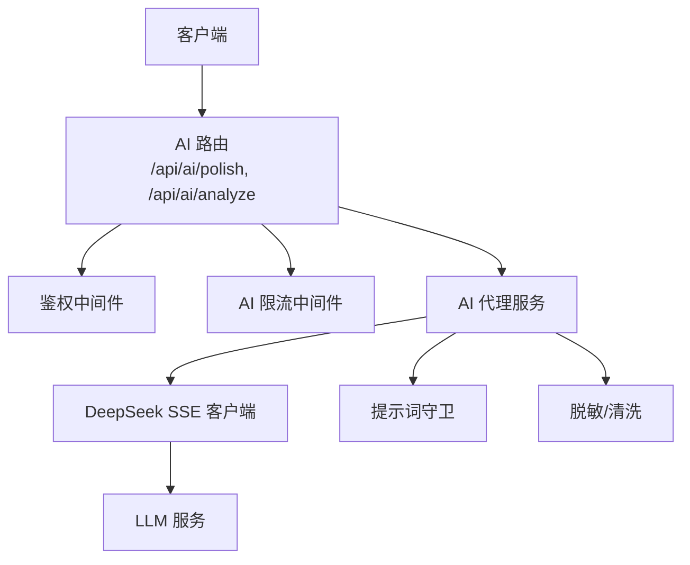
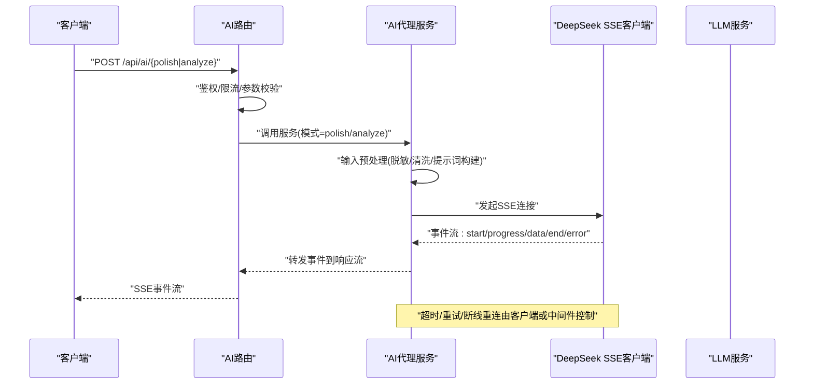
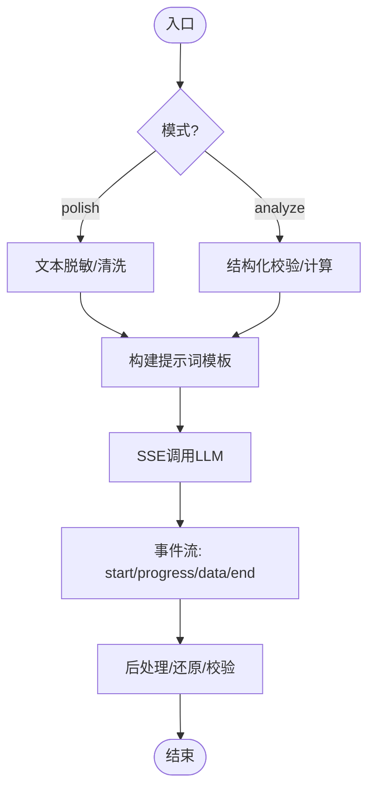
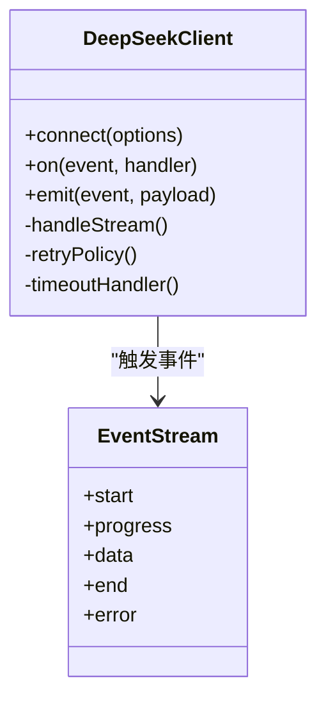
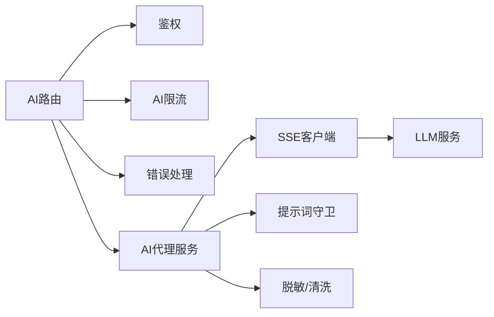

# AI智能分析接口

<cite>
**本文引用的文件**   
- [server/src/routes/ai.ts](file://server/src/routes/ai.ts)
- [server/src/services/AIProxyService.ts](file://server/src/services/AIProxyService.ts)
- [server/src/lib/deepseek.ts](file://server/src/lib/deepseek.ts)
- [server/src/middleware/ai-rate-limit.ts](file://server/src/middleware/ai-rate-limit.ts)
- [server/src/middleware/auth.ts](file://server/src/middleware/auth.ts)
- [server/src/middleware/error-handler.ts](file://server/src/middleware/error-handler.ts)
- [server/src/lib/errors.ts](file://server/src/lib/errors.ts)
- [server/src/lib/prompt-guard.ts](file://server/src/lib/prompt-guard.ts)
- [server/src/lib/sanitize.ts](file://server/src/lib/sanitize.ts)
- [server/src/config/env.ts](file://server/src/config/env.ts)
- [server/scripts/ai-http-live.ts](file://server/scripts/ai-http-live.ts)
</cite>

## 目录
1. [简介](#简介)
2. [项目结构](#项目结构)
3. [核心组件](#核心组件)
4. [架构总览](#架构总览)
5. [详细组件分析](#详细组件分析)
6. [依赖关系分析](#依赖关系分析)
7. [性能考量](#性能考量)
8. [故障排查指南](#故障排查指南)
9. [结论](#结论)
10. [附录](#附录)

## 简介
本文件为FY200 AI智能分析接口的权威API文档，聚焦SSE流式响应与双管道架构（polish文本润色、analyze结构化分析）。文档涵盖连接建立、数据传输、错误处理、数据脱敏规则（绝对金额→区间、公司名→动态映射）、安全防护机制、LLM调用配置、提示词模板与结果还原策略、流式数据处理、进度反馈与超时处理等关键主题。读者可据此快速集成前端SSE客户端并实现稳定可靠的AI分析能力。

## 项目结构
后端采用Express路由+服务层+工具库的分层设计：
- 路由层：暴露REST/SSE端点，负责鉴权、限流、参数校验与响应封装。
- 服务层：编排AI代理、计算与业务逻辑。
- 工具库：DeepSeek SSE客户端、提示词守卫、脱敏与清洗、错误定义等。
- 中间件链：安全、鉴权、权限、范围、软删除、审计、错误处理等。

图表来源
- [server/src/routes/ai.ts](file://server/src/routes/ai.ts)
- [server/src/services/AIProxyService.ts](file://server/src/services/AIProxyService.ts)
- [server/src/lib/deepseek.ts](file://server/src/lib/deepseek.ts)
- [server/src/middleware/ai-rate-limit.ts](file://server/src/middleware/ai-rate-limit.ts)
- [server/src/middleware/auth.ts](file://server/src/middleware/auth.ts)
- [server/src/lib/prompt-guard.ts](file://server/src/lib/prompt-guard.ts)
- [server/src/lib/sanitize.ts](file://server/src/lib/sanitize.ts)

章节来源
- [server/src/routes/ai.ts](file://server/src/routes/ai.ts)
- [server/src/services/AIProxyService.ts](file://server/src/services/AIProxyService.ts)
- [server/src/lib/deepseek.ts](file://server/src/lib/deepseek.ts)
- [server/src/middleware/ai-rate-limit.ts](file://server/src/middleware/ai-rate-limit.ts)
- [server/src/middleware/auth.ts](file://server/src/middleware/auth.ts)
- [server/src/lib/prompt-guard.ts](file://server/src/lib/prompt-guard.ts)
- [server/src/lib/sanitize.ts](file://server/src/lib/sanitize.ts)

## 核心组件
- AI路由：提供两个SSE端点
  - POST /api/ai/polish：文本润色管道
  - POST /api/ai/analyze：结构化分析管道
- AI代理服务：编排输入预处理、LLM调用、输出后处理与还原
- DeepSeek SSE客户端：封装SSE连接、事件订阅、重试与超时
- 中间件：鉴权、AI限流、错误处理、提示词守卫、脱敏/清洗
- 配置与环境：LLM密钥、超时、并发、重试策略等

章节来源
- [server/src/routes/ai.ts](file://server/src/routes/ai.ts)
- [server/src/services/AIProxyService.ts](file://server/src/services/AIProxyService.ts)
- [server/src/lib/deepseek.ts](file://server/src/lib/deepseek.ts)
- [server/src/middleware/ai-rate-limit.ts](file://server/src/middleware/ai-rate-limit.ts)
- [server/src/middleware/auth.ts](file://server/src/middleware/auth.ts)
- [server/src/lib/prompt-guard.ts](file://server/src/lib/prompt-guard.ts)
- [server/src/lib/sanitize.ts](file://server/src/lib/sanitize.ts)
- [server/src/config/env.ts](file://server/src/config/env.ts)

## 架构总览
整体流程遵循“请求进入→鉴权与限流→路由分发→服务编排→LLM调用→SSE推送→错误处理”的链路。SSE用于实时增量输出，支持进度事件与错误事件。

图表来源
- [server/src/routes/ai.ts](file://server/src/routes/ai.ts)
- [server/src/services/AIProxyService.ts](file://server/src/services/AIProxyService.ts)
- [server/src/lib/deepseek.ts](file://server/src/lib/deepseek.ts)

## 详细组件分析

### 路由与端点
- 端点
  - POST /api/ai/polish：文本润色
  - POST /api/ai/analyze：结构化分析
- 请求体字段（建议）
  - mode: "polish" | "analyze"
  - input: string | object（按模式不同）
  - options?: { temperature, top_p, max_tokens, timeout_ms, retry_count }
- 响应
  - Content-Type: text/event-stream
  - 事件类型：start、progress、data、end、error

章节来源
- [server/src/routes/ai.ts](file://server/src/routes/ai.ts)

### AI代理服务（双管道）
- polish管道（文本润色）
  - 输入：原始文本
  - 预处理：脱敏（金额→区间、公司名→动态映射）、清洗
  - 提示词：基于模板注入上下文与约束
  - LLM调用：SSE流式生成
  - 后处理：还原（区间→占位符、映射回公司名），格式校验
- analyze管道（结构化分析）
  - 输入：结构化数据（指标、维度、时间窗口等）
  - 预处理：数据校验、聚合计算、脱敏
  - 提示词：结构化模板（含计算口径与输出Schema）
  - LLM调用：SSE流式生成结构化片段
  - 后处理：JSON还原、Schema校验、单位统一（万元）

图表来源
- [server/src/services/AIProxyService.ts](file://server/src/services/AIProxyService.ts)
- [server/src/lib/sanitize.ts](file://server/src/lib/sanitize.ts)
- [server/src/lib/prompt-guard.ts](file://server/src/lib/prompt-guard.ts)

章节来源
- [server/src/services/AIProxyService.ts](file://server/src/services/AIProxyService.ts)

### DeepSeek SSE客户端
- 功能
  - 建立SSE连接，订阅事件
  - 支持超时、重试、断线检测
  - 将事件转换为内部流式协议并透传
- 关键行为
  - start：连接建立与任务ID
  - progress：进度百分比/阶段
  - data：增量内容片段
  - end：完成标记
  - error：错误码与消息

图表来源
- [server/src/lib/deepseek.ts](file://server/src/lib/deepseek.ts)

章节来源
- [server/src/lib/deepseek.ts](file://server/src/lib/deepseek.ts)

### 中间件与安全
- 鉴权：JWT校验与黑名单检查
- AI限流：按用户/IP/模型维度限制QPS与并发
- 错误处理：统一错误码、日志与SSE error事件
- 提示词守卫：拦截恶意/越权提示词，白名单校验
- 脱敏/清洗：金额区间化、公司名动态映射、敏感字段过滤

章节来源
- [server/src/middleware/auth.ts](file://server/src/middleware/auth.ts)
- [server/src/middleware/ai-rate-limit.ts](file://server/src/middleware/ai-rate-limit.ts)
- [server/src/middleware/error-handler.ts](file://server/src/middleware/error-handler.ts)
- [server/src/lib/prompt-guard.ts](file://server/src/lib/prompt-guard.ts)
- [server/src/lib/sanitize.ts](file://server/src/lib/sanitize.ts)
- [server/src/lib/errors.ts](file://server/src/lib/errors.ts)

### 配置与环境变量
- LLM相关：API密钥、基础URL、模型名称、超时、重试次数
- 安全相关：JWT密钥、过期时间、黑名单存储
- 性能相关：并发上限、队列长度、缓存开关
- 审计相关：操作日志开关、采样率

章节来源
- [server/src/config/env.ts](file://server/src/config/env.ts)

## 依赖关系分析
- 路由依赖鉴权、限流、错误处理中间件
- 服务依赖SSE客户端、提示词守卫、脱敏模块
- SSE客户端依赖网络与超时/重试策略
- 错误模块贯穿全链路，统一异常与日志

图表来源
- [server/src/routes/ai.ts](file://server/src/routes/ai.ts)
- [server/src/services/AIProxyService.ts](file://server/src/services/AIProxyService.ts)
- [server/src/lib/deepseek.ts](file://server/src/lib/deepseek.ts)
- [server/src/middleware/ai-rate-limit.ts](file://server/src/middleware/ai-rate-limit.ts)
- [server/src/middleware/auth.ts](file://server/src/middleware/auth.ts)
- [server/src/middleware/error-handler.ts](file://server/src/middleware/error-handler.ts)
- [server/src/lib/prompt-guard.ts](file://server/src/lib/prompt-guard.ts)
- [server/src/lib/sanitize.ts](file://server/src/lib/sanitize.ts)

## 性能考量
- 流式传输：SSE增量输出降低首字节延迟，提升用户体验
- 超时与重试：合理设置超时与指数退避，避免雪崩
- 并发与限流：按用户/模型维度限流，保护下游LLM
- 内存占用：流式处理避免大对象驻留，及时释放资源
- 缓存策略：对重复查询与提示词进行缓存（可选）

[本节为通用指导，不直接分析具体文件]

## 故障排查指南
- 连接失败
  - 检查网络可达性与证书
  - 确认API密钥与基础URL正确
  - 查看SSE客户端日志与重试计数
- 流中断
  - 检查服务端错误处理与error事件
  - 确认客户端重连逻辑与背压处理
- 超时
  - 调整timeout_ms与max_tokens
  - 评估LLM响应时间与负载
- 数据不一致
  - 检查脱敏/还原映射表一致性
  - 验证Schema校验与单位换算

章节来源
- [server/src/middleware/error-handler.ts](file://server/src/middleware/error-handler.ts)
- [server/src/lib/errors.ts](file://server/src/lib/errors.ts)
- [server/src/lib/deepseek.ts](file://server/src/lib/deepseek.ts)

## 结论
本接口通过SSE流式响应与双管道架构，实现了高效、安全的AI分析与文本润色能力。结合严格的鉴权、限流、提示词守卫与脱敏还原策略，确保在复杂业务场景下的稳定性与合规性。建议在生产环境完善监控、告警与审计，持续优化超时、重试与缓存策略。

[本节为总结性内容，不直接分析具体文件]

## 附录

### API参考
- 端点
  - POST /api/ai/polish
  - POST /api/ai/analyze
- 请求头
  - Authorization: Bearer <token>
  - Content-Type: application/json
- 请求体
  - mode: "polish" | "analyze"
  - input: string | object
  - options?: { temperature, top_p, max_tokens, timeout_ms, retry_count }
- 响应
  - Content-Type: text/event-stream
  - 事件：start、progress、data、end、error

章节来源
- [server/src/routes/ai.ts](file://server/src/routes/ai.ts)

### 数据脱敏规则
- 绝对金额→区间：如“123.45万元”替换为“[100,200)万元”
- 公司名→动态映射：真实名称替换为占位符，还原时再映射回原值
- 敏感字段过滤：邮箱、电话、身份证等按白名单过滤

章节来源
- [server/src/lib/sanitize.ts](file://server/src/lib/sanitize.ts)

### 提示词模板与结果还原
- 模板注入：上下文、约束、输出Schema、单位规范
- 还原策略：区间→占位符、映射→原值、Schema校验与修复

章节来源
- [server/src/lib/prompt-guard.ts](file://server/src/lib/prompt-guard.ts)
- [server/src/services/AIProxyService.ts](file://server/src/services/AIProxyService.ts)

### 流式数据处理与进度反馈
- 事件顺序：start → progress* → data* → end
- 进度字段：percent、stage、message
- 错误事件：code、message、recoverable

章节来源
- [server/src/lib/deepseek.ts](file://server/src/lib/deepseek.ts)

### 超时与重试策略
- 超时：请求级与服务级双重超时
- 重试：指数退避、最大重试次数、幂等键
- 断线：自动重连与状态恢复

章节来源
- [server/src/lib/deepseek.ts](file://server/src/lib/deepseek.ts)

### 安全与防护
- 鉴权：JWT访问令牌与刷新令牌轮转
- 限流：AI专用限流中间件，防刷与配额管理
- 提示词守卫：白名单算子与危险指令拦截
- 审计：关键操作记录与追踪ID

章节来源
- [server/src/middleware/auth.ts](file://server/src/middleware/auth.ts)
- [server/src/middleware/ai-rate-limit.ts](file://server/src/middleware/ai-rate-limit.ts)
- [server/src/lib/prompt-guard.ts](file://server/src/lib/prompt-guard.ts)

### 调试与测试
- 本地调试脚本：ai-http-live.ts用于模拟SSE请求与事件观察
- 单元测试：覆盖脱敏、提示词守卫、错误路径

章节来源
- [server/scripts/ai-http-live.ts](file://server/scripts/ai-http-live.ts)
- [server/src/lib/desensitize.test.ts](file://server/src/lib/desensitize.test.ts)
- [server/src/lib/prompt-guard.test.ts](file://server/src/lib/prompt-guard.test.ts)