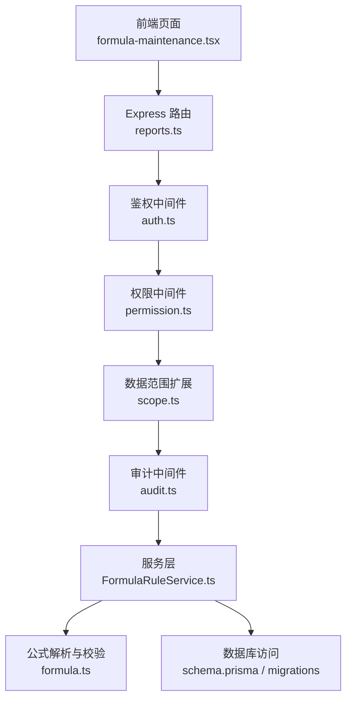
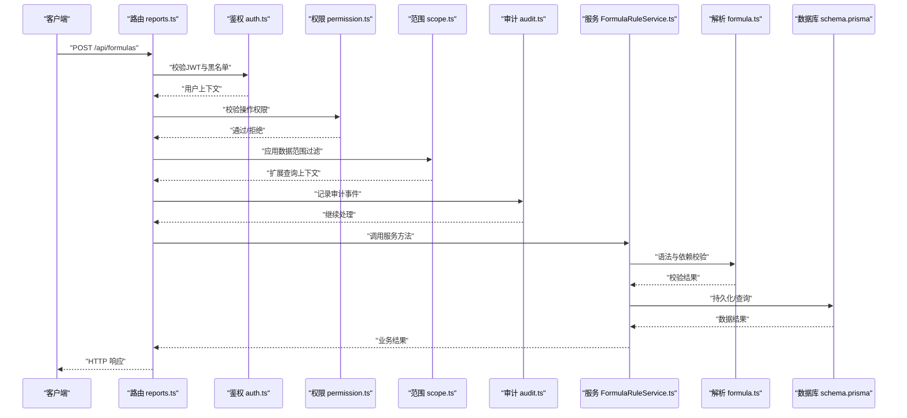
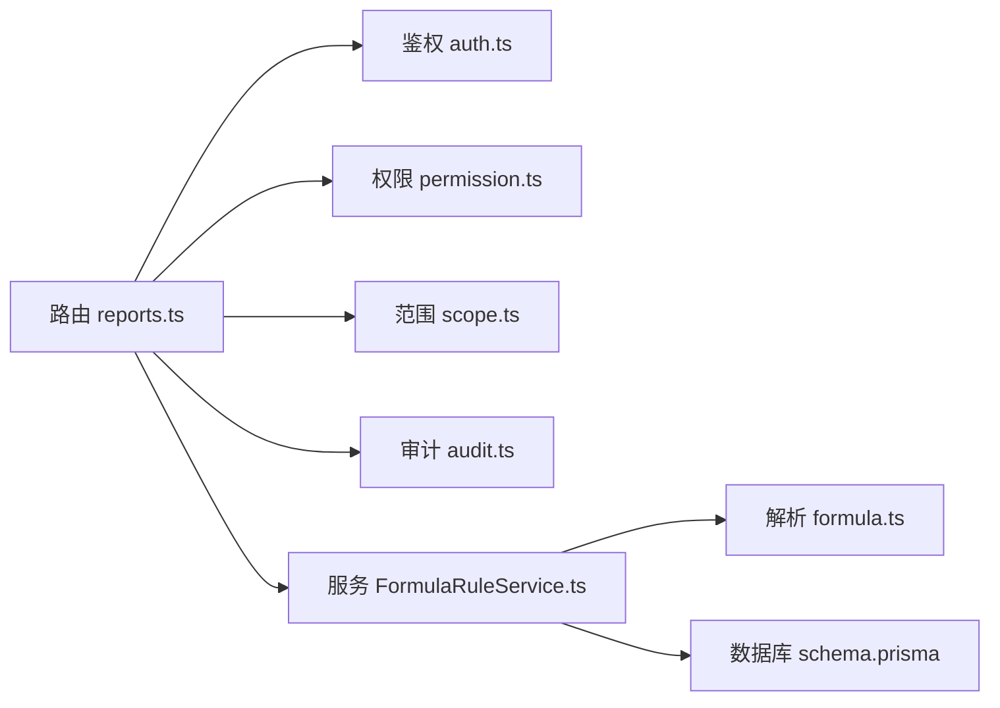

# 公式管理接口

<cite>
**本文引用的文件**   
- [server/src/lib/formula.ts](file://server/src/lib/formula.ts)
- [server/src/services/FormulaRuleService.ts](file://server/src/services/FormulaRuleService.ts)
- [server/src/middleware/audit.ts](file://server/src/middleware/audit.ts)
- [server/src/middleware/auth.ts](file://server/src/middleware/auth.ts)
- [server/src/middleware/permission.ts](file://server/src/middleware/permission.ts)
- [server/src/middleware/scope.ts](file://server/src/middleware/scope.ts)
- [server/src/middleware/error-handler.ts](file://server/src/middleware/error-handler.ts)
- [server/src/lib/errors.ts](file://server/src/lib/errors.ts)
- [server/src/lib/response.ts](file://server/src/lib/response.ts)
- [server/prisma/schema.prisma](file://server/prisma/schema.prisma)
- [server/prisma/migrations/20260722142144_add_formula_rule/migration.sql](file://server/prisma/migrations/20260722142144_add_formula_rule/migration.sql)
- [server/src/routes/reports.ts](file://server/src/routes/reports.ts)
- [web/src/pages/data/formula-maintenance.tsx](file://web/src/pages/data/formula-maintenance.tsx)
- [web/src/pages/data/formula-rule-dialog.tsx](file://web/src/pages/data/formula-rule-dialog.tsx)
- [web/src/pages/data/formula-history-dialog.tsx](file://web/src/pages/data/formula-history-dialog.tsx)
</cite>

## 目录
1. [简介](#简介)
2. [项目结构](#项目结构)
3. [核心组件](#核心组件)
4. [架构总览](#架构总览)
5. [详细组件分析](#详细组件分析)
6. [依赖关系分析](#依赖关系分析)
7. [性能考量](#性能考量)
8. [故障排查指南](#故障排查指南)
9. [结论](#结论)
10. [附录](#附录)

## 简介
本文件为 FY200 财年经营数据分析平台的“公式管理接口”API 文档，覆盖公式的创建、更新、删除与版本管理，以及公式验证规则、语法检查、依赖关系分析、模板库与预定义函数、自定义扩展机制、测试与调试、发布流程（含灰度与回滚）、审计日志与变更追踪等。平台采用 Express + Prisma + PostgreSQL 技术栈，计算类指标使用安全公式解析（白名单算子），禁止 eval；同比/环比由后端实时计算不入库。中间件执行链顺序为：helmet → cors → express.json → rate-limit → auth(JWT+黑名单) → permission(默认拒绝) → scope(Prisma extension) → softDelete → audit → Service → Prisma → PostgreSQL。

## 项目结构
与公式管理相关的代码主要分布在以下位置：
- 服务端路由与服务层：routes/reports.ts、services/FormulaRuleService.ts
- 公式解析与校验：lib/formula.ts
- 权限与审计：middleware/auth.ts、middleware/permission.ts、middleware/scope.ts、middleware/audit.ts
- 错误处理与响应封装：middleware/error-handler.ts、lib/errors.ts、lib/response.ts
- 数据模型与迁移：prisma/schema.prisma、prisma/migrations/*_add_formula_rule/migration.sql
- 前端页面：web/src/pages/data/formula-maintenance.tsx、formula-rule-dialog.tsx、formula-history-dialog.tsx

图表来源
- [server/src/routes/reports.ts](file://server/src/routes/reports.ts)
- [server/src/middleware/auth.ts](file://server/src/middleware/auth.ts)
- [server/src/middleware/permission.ts](file://server/src/middleware/permission.ts)
- [server/src/middleware/scope.ts](file://server/src/middleware/scope.ts)
- [server/src/middleware/audit.ts](file://server/src/middleware/audit.ts)
- [server/src/services/FormulaRuleService.ts](file://server/src/services/FormulaRuleService.ts)
- [server/src/lib/formula.ts](file://server/src/lib/formula.ts)
- [server/prisma/schema.prisma](file://server/prisma/schema.prisma)
- [server/prisma/migrations/20260722142144_add_formula_rule/migration.sql](file://server/prisma/migrations/20260722142144_add_formula_rule/migration.sql)

章节来源
- [server/src/routes/reports.ts](file://server/src/routes/reports.ts)
- [server/src/services/FormulaRuleService.ts](file://server/src/services/FormulaRuleService.ts)
- [server/src/lib/formula.ts](file://server/src/lib/formula.ts)
- [server/prisma/schema.prisma](file://server/prisma/schema.prisma)
- [server/prisma/migrations/20260722142144_add_formula_rule/migration.sql](file://server/prisma/migrations/20260722142144_add_formula_rule/migration.sql)

## 核心组件
- 公式解析与校验器：提供白名单算子解析、语法检查、依赖提取、安全执行环境。
- 公式规则服务：封装公式的 CRUD、版本管理、发布状态流转、依赖分析与冲突检测、模板导入导出。
- 中间件链路：鉴权、权限控制、数据范围裁剪、软删除、审计记录。
- 错误与响应：统一异常类型与 HTTP 响应封装。
- 数据模型：公式、版本、模板、审计日志等表结构与约束。

章节来源
- [server/src/lib/formula.ts](file://server/src/lib/formula.ts)
- [server/src/services/FormulaRuleService.ts](file://server/src/services/FormulaRuleService.ts)
- [server/src/middleware/auth.ts](file://server/src/middleware/auth.ts)
- [server/src/middleware/permission.ts](file://server/src/middleware/permission.ts)
- [server/src/middleware/scope.ts](file://server/src/middleware/scope.ts)
- [server/src/middleware/audit.ts](file://server/src/middleware/audit.ts)
- [server/src/lib/errors.ts](file://server/src/lib/errors.ts)
- [server/src/lib/response.ts](file://server/src/lib/response.ts)
- [server/prisma/schema.prisma](file://server/prisma/schema.prisma)

## 架构总览
公式管理接口的请求在 Express 路由中进入，依次经过鉴权、权限、数据范围、软删除、审计等中间件后到达服务层。服务层调用公式解析器进行语法与依赖校验，并通过 Prisma 访问数据库。所有写操作均被审计中间件记录，错误通过统一错误处理器返回标准响应。

图表来源
- [server/src/routes/reports.ts](file://server/src/routes/reports.ts)
- [server/src/middleware/auth.ts](file://server/src/middleware/auth.ts)
- [server/src/middleware/permission.ts](file://server/src/middleware/permission.ts)
- [server/src/middleware/scope.ts](file://server/src/middleware/scope.ts)
- [server/src/middleware/audit.ts](file://server/src/middleware/audit.ts)
- [server/src/services/FormulaRuleService.ts](file://server/src/services/FormulaRuleService.ts)
- [server/src/lib/formula.ts](file://server/src/lib/formula.ts)
- [server/prisma/schema.prisma](file://server/prisma/schema.prisma)

## 详细组件分析

### 公式解析与校验器（formula.ts）
- 功能要点
  - 白名单算子解析：仅允许 +-*/() 等基础算术与括号组合，禁止任意表达式求值。
  - 语法检查：基于词法/语法分析或正则规则集，识别非法字符、未闭合括号、非法函数名等。
  - 依赖提取：从公式中提取变量引用与下游依赖，构建依赖图用于冲突检测与影响分析。
  - 安全执行：运行时以受限环境执行，避免注入攻击。
- 复杂度与优化
  - 解析时间复杂度近似 O(n)，n 为公式长度；依赖提取可缓存结果以减少重复计算。
  - 对长公式建议分块校验与增量更新。
- 错误处理
  - 抛出结构化错误对象，包含错误码、位置信息与修复建议。

章节来源
- [server/src/lib/formula.ts](file://server/src/lib/formula.ts)

### 公式规则服务（FormulaRuleService.ts）
- 功能要点
  - CRUD：创建、读取、更新、删除公式及版本。
  - 版本管理：支持多版本并存、激活版本切换、历史版本归档。
  - 发布流程：草稿→待审→已发布→灰度→生产，支持回滚到指定版本。
  - 依赖分析：构建依赖图，检测循环依赖与冲突，提供影响范围报告。
  - 模板库：导入/导出公式模板，批量初始化与复用。
  - 测试与调试：提供沙箱测试、断点式调试、性能采样。
- 事务与一致性
  - 写操作使用事务保证版本与发布状态的原子性。
- 权限与范围
  - 结合权限与数据范围中间件，确保仅可操作授权范围内的公式。

章节来源
- [server/src/services/FormulaRuleService.ts](file://server/src/services/FormulaRuleService.ts)

### 中间件链路（auth/permission/scope/audit）
- 鉴权（auth.ts）
  - JWT 校验与黑名单检查，注入用户上下文。
- 权限（permission.ts）
  - 默认拒绝策略，按资源与动作细粒度授权。
- 数据范围（scope.ts）
  - 基于 Prisma extension 自动附加租户/组织维度过滤。
- 审计（audit.ts）
  - 记录关键操作的审计日志，包括操作人、时间、IP、变更前后快照。

章节来源
- [server/src/middleware/auth.ts](file://server/src/middleware/auth.ts)
- [server/src/middleware/permission.ts](file://server/src/middleware/permission.ts)
- [server/src/middleware/scope.ts](file://server/src/middleware/scope.ts)
- [server/src/middleware/audit.ts](file://server/src/middleware/audit.ts)

### 错误处理与响应（error-handler.ts, errors.ts, response.ts）
- 统一错误类型与消息映射，输出标准化 JSON 响应。
- 区分业务错误与系统错误，便于前端提示与监控告警。

章节来源
- [server/src/middleware/error-handler.ts](file://server/src/middleware/error-handler.ts)
- [server/src/lib/errors.ts](file://server/src/lib/errors.ts)
- [server/src/lib/response.ts](file://server/src/lib/response.ts)

### 数据模型与迁移（schema.prisma, migration.sql）
- 核心实体
  - 公式（formulas）：标识、名称、描述、内容、状态、版本、创建/更新时间等。
  - 版本（formula_versions）：版本号、内容、差异、发布状态、生效时间等。
  - 模板（formula_templates）：模板标识、名称、内容、分类、适用场景等。
  - 审计日志（audit_logs）：操作类型、资源ID、操作人、时间、IP、变更摘要等。
- 约束与索引
  - 唯一约束（如公式编码）、外键关联（版本归属公式）、索引优化查询（按状态、更新时间）。

章节来源
- [server/prisma/schema.prisma](file://server/prisma/schema.prisma)
- [server/prisma/migrations/20260722142144_add_formula_rule/migration.sql](file://server/prisma/migrations/20260722142144_add_formula_rule/migration.sql)

### 前端交互（formula-maintenance.tsx, formula-rule-dialog.tsx, formula-history-dialog.tsx）
- 公式维护页：列表展示、搜索筛选、新建/编辑/删除、版本切换、发布操作。
- 规则对话框：表单校验、语法高亮、依赖预览、冲突提示。
- 历史对话框：版本对比、回滚操作、审计轨迹查看。

章节来源
- [web/src/pages/data/formula-maintenance.tsx](file://web/src/pages/data/formula-maintenance.tsx)
- [web/src/pages/data/formula-rule-dialog.tsx](file://web/src/pages/data/formula-rule-dialog.tsx)
- [web/src/pages/data/formula-history-dialog.tsx](file://web/src/pages/data/formula-history-dialog.tsx)

## 依赖关系分析
- 组件耦合
  - 路由层依赖服务层，服务层依赖解析器与数据库访问。
  - 中间件串联形成横切关注点（鉴权、权限、范围、审计）。
- 外部依赖
  - Prisma ORM 与 PostgreSQL。
  - JWT 认证与可能的黑名单存储。
- 潜在循环依赖
  - 服务层不应反向依赖路由层；解析器应保持无状态以避免隐式耦合。

图表来源
- [server/src/routes/reports.ts](file://server/src/routes/reports.ts)
- [server/src/middleware/auth.ts](file://server/src/middleware/auth.ts)
- [server/src/middleware/permission.ts](file://server/src/middleware/permission.ts)
- [server/src/middleware/scope.ts](file://server/src/middleware/scope.ts)
- [server/src/middleware/audit.ts](file://server/src/middleware/audit.ts)
- [server/src/services/FormulaRuleService.ts](file://server/src/services/FormulaRuleService.ts)
- [server/src/lib/formula.ts](file://server/src/lib/formula.ts)
- [server/prisma/schema.prisma](file://server/prisma/schema.prisma)

章节来源
- [server/src/routes/reports.ts](file://server/src/routes/reports.ts)
- [server/src/services/FormulaRuleService.ts](file://server/src/services/FormulaRuleService.ts)
- [server/src/lib/formula.ts](file://server/src/lib/formula.ts)

## 性能考量
- 解析与校验
  - 对长公式进行分块解析与缓存，减少重复计算。
  - 依赖图构建采用增量更新，避免全量重算。
- 查询优化
  - 针对常用筛选字段建立索引（状态、更新时间、模板分类）。
  - 分页与懒加载，避免一次性加载大量公式。
- 并发与事务
  - 发布与版本切换使用短事务，降低锁竞争。
  - 读多写少场景考虑只读副本或缓存层。
- 监控与采样
  - 关键路径埋点（解析耗时、依赖分析耗时、数据库慢查询）。
  - 启用性能剖析工具定位热点。

[本节为通用指导，无需特定文件来源]

## 故障排查指南
- 常见错误
  - 鉴权失败：检查 JWT 有效性、黑名单状态与过期时间。
  - 权限不足：确认角色与资源权限配置。
  - 语法错误：根据解析器返回的位置信息修正公式。
  - 依赖冲突：查看依赖图与冲突报告，调整引用关系。
  - 发布失败：检查目标版本状态与前置条件（如依赖完整性）。
- 诊断步骤
  - 查看审计日志定位操作轨迹。
  - 启用调试模式获取详细错误堆栈。
  - 使用测试工具复现场景并逐步缩小问题范围。
  - 检查数据库约束与索引是否满足查询需求。

章节来源
- [server/src/middleware/error-handler.ts](file://server/src/middleware/error-handler.ts)
- [server/src/lib/errors.ts](file://server/src/lib/errors.ts)
- [server/src/middleware/audit.ts](file://server/src/middleware/audit.ts)

## 结论
FY200 公式管理接口通过清晰的中间件链路、严格的安全解析与完善的版本发布流程，提供了稳定可靠的公式管理能力。建议在后续迭代中持续优化解析性能、完善依赖分析能力，并增强前端可视化与调试体验，以提升整体开发效率与运维稳定性。

[本节为总结性内容，无需特定文件来源]

## 附录
- 术语说明
  - 公式：用于计算指标的表达式，遵循白名单算子与安全执行。
  - 版本：公式的不可变快照，支持多版本并存与切换。
  - 模板：可复用的公式片段或完整公式，便于批量初始化。
  - 灰度发布：先对小范围用户生效，验证后再全量发布。
  - 回滚：将已发布公式恢复到之前稳定版本。
- 最佳实践
  - 变更前进行依赖影响评估与回归测试。
  - 使用模板与命名规范提升可维护性。
  - 开启审计与监控，及时发现问题并快速恢复。

[本节为概念性内容，无需特定文件来源]