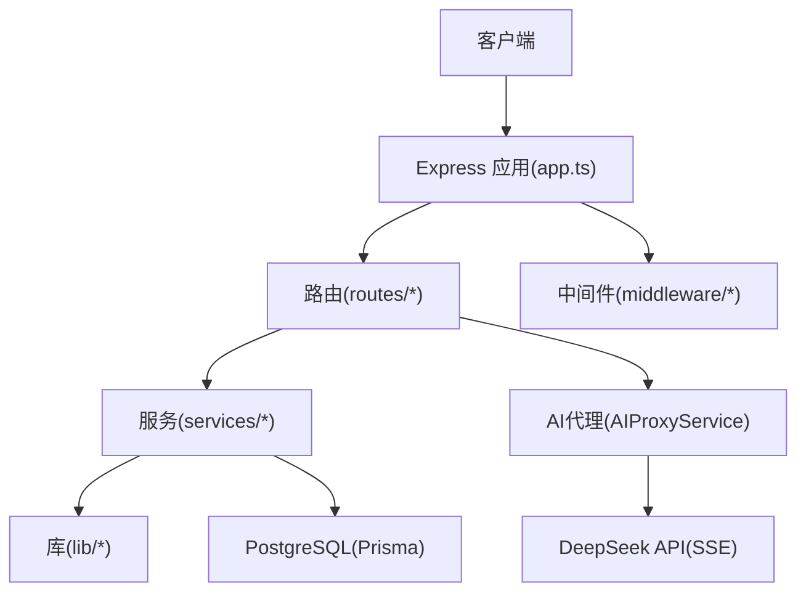
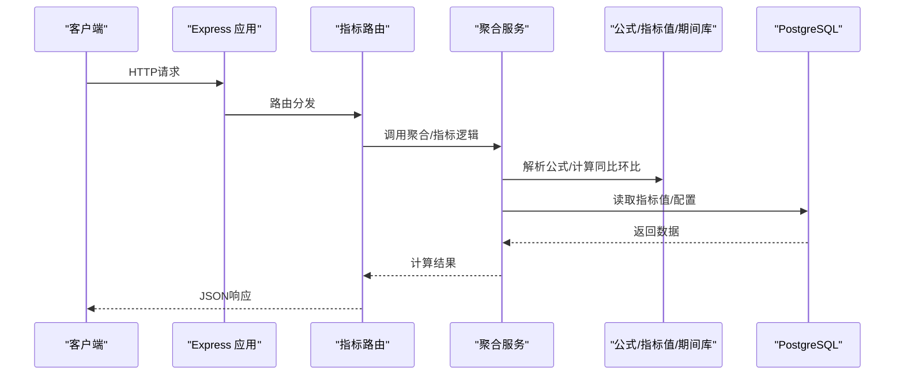
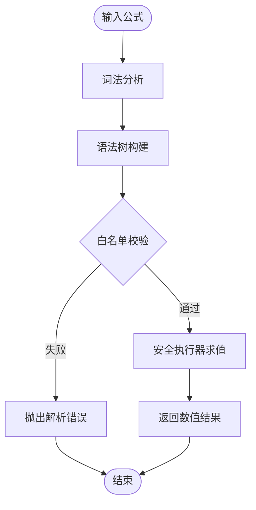
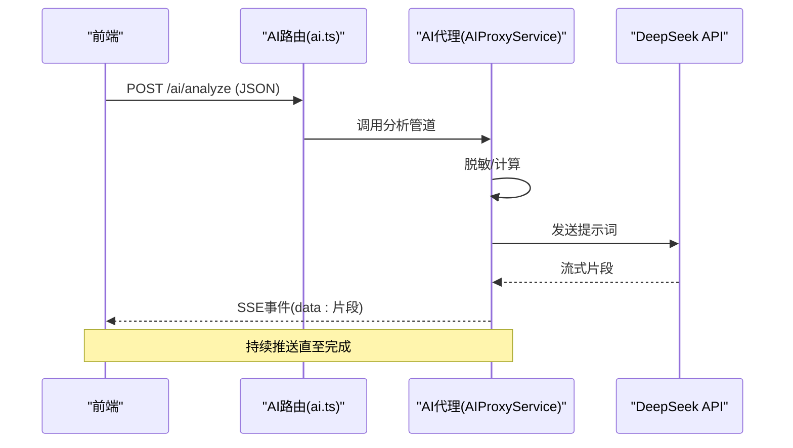
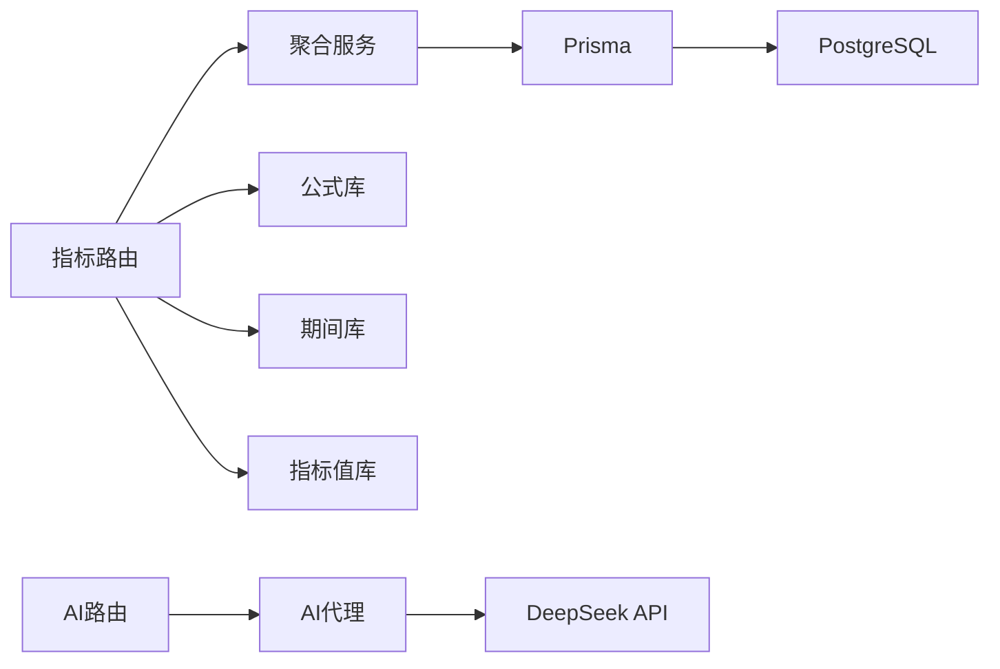

# 指标分析API

<cite>
**本文引用的文件**   
- [server/src/app.ts](file://server/src/app.ts)
- [server/src/server.ts](file://server/src/server.ts)
- [server/src/routes/indicators.ts](file://server/src/routes/indicators.ts)
- [server/src/services/AggregationService.ts](file://server/src/services/AggregationService.ts)
- [server/src/lib/formula.ts](file://server/src/lib/formula.ts)
- [server/src/lib/metric-values.ts](file://server/src/lib/metric-values.ts)
- [server/src/lib/period.ts](file://server/src/lib/period.ts)
- [server/src/routes/ai.ts](file://server/src/routes/ai.ts)
- [server/src/services/AIProxyService.ts](file://server/src/services/AIProxyService.ts)
- [server/src/middleware/auth.ts](file://server/src/middleware/auth.ts)
- [server/src/middleware/rate-limit.ts](file://server/src/middleware/rate-limit.ts)
- [server/src/middleware/error-handler.ts](file://server/src/middleware/error-handler.ts)
- [server/prisma/schema.prisma](file://server/prisma/schema.prisma)
</cite>

## 目录
1. [简介](#简介)
2. [项目结构](#项目结构)
3. [核心组件](#核心组件)
4. [架构总览](#架构总览)
5. [详细组件分析](#详细组件分析)
6. [依赖关系分析](#依赖关系分析)
7. [性能考量](#性能考量)
8. [故障排查指南](#故障排查指南)
9. [结论](#结论)
10. [附录](#附录)

## 简介
本文件为FY200指标分析系统的API文档，聚焦以下能力：
- 指标查询与多维度分析（公司、科目、期间等）
- 同比/环比实时计算与趋势分析
- 聚合计算（求和、均值、计数、极值等）
- 安全公式解析引擎与白名单算子机制
- 指标配置、自定义公式与计算规则管理
- SSE流式响应（AI分析实时数据推送）
- 性能监控与查询优化建议

系统定位：Excel进、看板/报表出，单位统一为万元/人民币。后端技术栈：Express + Prisma + PostgreSQL + JWT + DeepSeek API（SSE）。中间件执行链顺序：helmet → cors → express.json → rate-limit → auth(JWT+黑名单) → permission(默认拒绝) → scope(Prisma extension) → softDelete → audit → Service → Prisma → PostgreSQL。

## 项目结构
- server/src/app.ts：应用初始化、路由挂载、全局中间件注册
- server/src/server.ts：服务启动入口
- server/src/routes/*：HTTP路由定义（含指标、AI、认证、数据、报表等）
- server/src/services/*：业务服务层（聚合、指标、AI代理、导入、审计等）
- server/src/lib/*：通用库（公式解析、指标值处理、期间工具、JWT、错误、脱敏等）
- server/src/middleware/*：鉴权、权限、限流、审计、软删除、CORS、Helmet等
- server/prisma/schema.prisma：数据库模型与迁移

图表来源
- [server/src/app.ts](file://server/src/app.ts)
- [server/src/server.ts](file://server/src/server.ts)
- [server/src/routes/indicators.ts](file://server/src/routes/indicators.ts)
- [server/src/services/AggregationService.ts](file://server/src/services/AggregationService.ts)
- [server/src/lib/formula.ts](file://server/src/lib/formula.ts)
- [server/src/lib/metric-values.ts](file://server/src/lib/metric-values.ts)
- [server/src/lib/period.ts](file://server/src/lib/period.ts)
- [server/src/routes/ai.ts](file://server/src/routes/ai.ts)
- [server/src/services/AIProxyService.ts](file://server/src/services/AIProxyService.ts)
- [server/src/middleware/auth.ts](file://server/src/middleware/auth.ts)
- [server/src/middleware/rate-limit.ts](file://server/src/middleware/rate-limit.ts)
- [server/src/middleware/error-handler.ts](file://server/src/middleware/error-handler.ts)
- [server/prisma/schema.prisma](file://server/prisma/schema.prisma)

章节来源
- [server/src/app.ts](file://server/src/app.ts)
- [server/src/server.ts](file://server/src/server.ts)

## 核心组件
- 指标查询与多维分析：通过路由与聚合服务组合维度过滤、分组、排序与分页
- 同比/环比与趋势：基于期间工具与指标值处理进行实时计算，不持久化结果
- 安全公式解析：白名单算子（+-*/()），禁止eval，支持函数扩展点与校验
- 指标配置与规则：公式规则存储于数据库，提供CRUD接口与版本化管理
- AI分析SSE：文本/结构化双管道，脱敏→LLM→还原，流式输出

章节来源
- [server/src/routes/indicators.ts](file://server/src/routes/indicators.ts)
- [server/src/services/AggregationService.ts](file://server/src/services/AggregationService.ts)
- [server/src/lib/formula.ts](file://server/src/lib/formula.ts)
- [server/src/lib/metric-values.ts](file://server/src/lib/metric-values.ts)
- [server/src/lib/period.ts](file://server/src/lib/period.ts)
- [server/src/routes/ai.ts](file://server/src/routes/ai.ts)
- [server/src/services/AIProxyService.ts](file://server/src/services/AIProxyService.ts)

## 架构总览
整体调用链路遵循“中间件→路由→服务→库→数据库”的分层设计，AI分析采用独立代理与SSE通道。

图表来源
- [server/src/app.ts](file://server/src/app.ts)
- [server/src/routes/indicators.ts](file://server/src/routes/indicators.ts)
- [server/src/services/AggregationService.ts](file://server/src/services/AggregationService.ts)
- [server/src/lib/formula.ts](file://server/src/lib/formula.ts)
- [server/src/lib/metric-values.ts](file://server/src/lib/metric-values.ts)
- [server/src/lib/period.ts](file://server/src/lib/period.ts)
- [server/prisma/schema.prisma](file://server/prisma/schema.prisma)

## 详细组件分析

### 指标查询与多维分析API
- 功能要点
  - 支持按公司、科目、期间等多维过滤与分组
  - 支持排序、分页、字段投影
  - 支持聚合函数（sum/avg/count/min/max等）
- 典型流程
  - 路由接收参数并校验
  - 服务层构建查询条件与聚合表达式
  - 通过Prisma访问数据库，返回结构化结果
- 关键实现位置
  - 路由定义：[server/src/routes/indicators.ts](file://server/src/routes/indicators.ts)
  - 聚合服务：[server/src/services/AggregationService.ts](file://server/src/services/AggregationService.ts)
  - 指标值处理：[server/src/lib/metric-values.ts](file://server/src/lib/metric-values.ts)

章节来源
- [server/src/routes/indicators.ts](file://server/src/routes/indicators.ts)
- [server/src/services/AggregationService.ts](file://server/src/services/AggregationService.ts)
- [server/src/lib/metric-values.ts](file://server/src/lib/metric-values.ts)

### 同比/环比与趋势分析API
- 功能要点
  - 同比：同周期对比（如今年Q1 vs 去年Q1）
  - 环比：相邻周期对比（如本月 vs 上月）
  - 趋势：多期序列的滑动窗口或线性拟合
- 计算策略
  - 基于期间工具与指标值处理进行实时计算，不存库
  - 支持缺失值处理与异常值平滑
- 关键实现位置
  - 期间工具：[server/src/lib/period.ts](file://server/src/lib/period.ts)
  - 指标值处理：[server/src/lib/metric-values.ts](file://server/src/lib/metric-values.ts)
  - 聚合服务：[server/src/services/AggregationService.ts](file://server/src/services/AggregationService.ts)

章节来源
- [server/src/lib/period.ts](file://server/src/lib/period.ts)
- [server/src/lib/metric-values.ts](file://server/src/lib/metric-values.ts)
- [server/src/services/AggregationService.ts](file://server/src/services/AggregationService.ts)

### 安全公式解析引擎与白名单算子
- 设计目标
  - 防止任意代码执行（禁用eval）
  - 仅允许白名单算子与函数
  - 支持参数校验与类型检查
- 白名单算子
  - 算术：加、减、乘、除、括号
  - 可扩展：内置函数（如四舍五入、区间映射）
- 解析流程
  - 输入公式字符串 → 词法分析 → 语法树构建 → 白名单校验 → 执行器求值
- 关键实现位置
  - 公式解析：[server/src/lib/formula.ts](file://server/src/lib/formula.ts)

图表来源
- [server/src/lib/formula.ts](file://server/src/lib/formula.ts)

章节来源
- [server/src/lib/formula.ts](file://server/src/lib/formula.ts)

### 指标配置与自定义公式管理API
- 功能要点
  - 公式规则CRUD（创建、读取、更新、删除）
  - 版本管理与生效控制
  - 公式校验与预览计算
- 数据模型
  - 公式规则表、指标定义表、计算规则表
- 关键实现位置
  - 数据库模型：[server/prisma/schema.prisma](file://server/prisma/schema.prisma)
  - 公式规则服务：[server/src/services/FormulaRuleService.ts](file://server/src/services/FormulaRuleService.ts)
  - 指标服务：[server/src/services/IndicatorsService.ts](file://server/src/services/IndicatorsService.ts)

章节来源
- [server/prisma/schema.prisma](file://server/prisma/schema.prisma)
- [server/src/services/FormulaRuleService.ts](file://server/src/services/FormulaRuleService.ts)
- [server/src/services/IndicatorsService.ts](file://server/src/services/IndicatorsService.ts)

### AI分析SSE流式响应
- 双管道架构
  - polish：文本→脱敏→LLM→还原
  - analyze：结构化→计算→脱敏→LLM→生成
- 流式传输
  - 使用SSE逐块推送增量内容
  - 前端订阅事件并渲染
- 关键实现位置
  - AI路由：[server/src/routes/ai.ts](file://server/src/routes/ai.ts)
  - AI代理：[server/src/services/AIProxyService.ts](file://server/src/services/AIProxyService.ts)

图表来源
- [server/src/routes/ai.ts](file://server/src/routes/ai.ts)
- [server/src/services/AIProxyService.ts](file://server/src/services/AIProxyService.ts)

章节来源
- [server/src/routes/ai.ts](file://server/src/routes/ai.ts)
- [server/src/services/AIProxyService.ts](file://server/src/services/AIProxyService.ts)

## 依赖关系分析
- 路由依赖服务，服务依赖库与数据库
- 中间件贯穿请求生命周期，保障安全与可观测性
- AI代理独立于主业务，避免阻塞指标计算

图表来源
- [server/src/routes/indicators.ts](file://server/src/routes/indicators.ts)
- [server/src/services/AggregationService.ts](file://server/src/services/AggregationService.ts)
- [server/src/lib/formula.ts](file://server/src/lib/formula.ts)
- [server/src/lib/period.ts](file://server/src/lib/period.ts)
- [server/src/lib/metric-values.ts](file://server/src/lib/metric-values.ts)
- [server/src/routes/ai.ts](file://server/src/routes/ai.ts)
- [server/src/services/AIProxyService.ts](file://server/src/services/AIProxyService.ts)
- [server/prisma/schema.prisma](file://server/prisma/schema.prisma)

章节来源
- [server/src/app.ts](file://server/src/app.ts)
- [server/src/middleware/auth.ts](file://server/src/middleware/auth.ts)
- [server/src/middleware/rate-limit.ts](file://server/src/middleware/rate-limit.ts)
- [server/src/middleware/error-handler.ts](file://server/src/middleware/error-handler.ts)

## 性能考量
- 查询优化
  - 合理选择维度与聚合函数，避免全表扫描
  - 使用索引覆盖常用过滤字段（公司、科目、期间）
- 缓存策略
  - 对热点指标结果做短期缓存（内存或Redis）
  - 公式预览与字典类数据缓存
- 计算优化
  - 同比/环比与趋势在内存中计算，减少IO
  - 批量拉取指标值，合并多次DB访问
- 并发与限流
  - 启用rate-limit保护接口
  - 限制AI调用频率，避免LLM过载
- 监控与可观测性
  - 记录慢查询与错误堆栈
  - 暴露关键指标（QPS、延迟、错误率）

## 故障排查指南
- 常见问题
  - 公式解析失败：检查白名单算子与语法
  - 指标值为空：确认期间范围与过滤条件
  - AI流中断：检查网络与令牌有效期
- 排查步骤
  - 查看错误处理器日志
  - 验证JWT与权限
  - 检查限流与黑名单
- 关键实现位置
  - 错误处理：[server/src/middleware/error-handler.ts](file://server/src/middleware/error-handler.ts)
  - 鉴权与限流：[server/src/middleware/auth.ts](file://server/src/middleware/auth.ts), [server/src/middleware/rate-limit.ts](file://server/src/middleware/rate-limit.ts)

章节来源
- [server/src/middleware/error-handler.ts](file://server/src/middleware/error-handler.ts)
- [server/src/middleware/auth.ts](file://server/src/middleware/auth.ts)
- [server/src/middleware/rate-limit.ts](file://server/src/middleware/rate-limit.ts)

## 结论
本系统以分层架构与严格的安全策略为核心，提供灵活的指标查询、实时计算与AI分析能力。通过白名单公式解析、多维聚合与SSE流式响应，满足内部管理口径财务数据的快速分析与可视化需求。建议在高频场景引入缓存与索引优化，结合监控告警提升稳定性与可观测性。

## 附录
- 术语说明
  - 同比：与去年同期比较
  - 环比：与上一周期比较
  - 趋势：多期序列的变化形态
- 单位规范
  - 金额统一为万元/人民币
- 参考文档
  - 数据库模式：[server/prisma/schema.prisma](file://server/prisma/schema.prisma)
  - 应用初始化：[server/src/app.ts](file://server/src/app.ts)
  - 服务启动：[server/src/server.ts](file://server/src/server.ts)