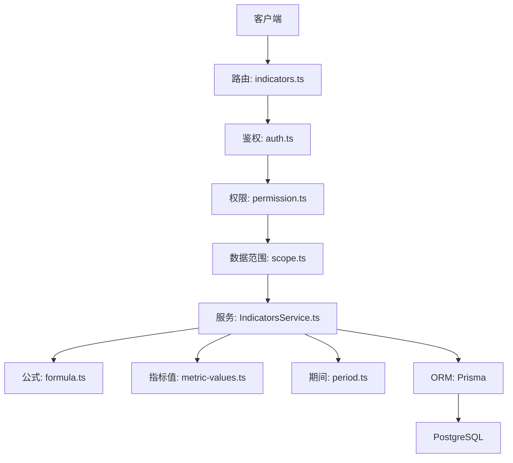
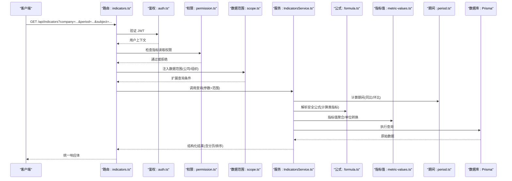
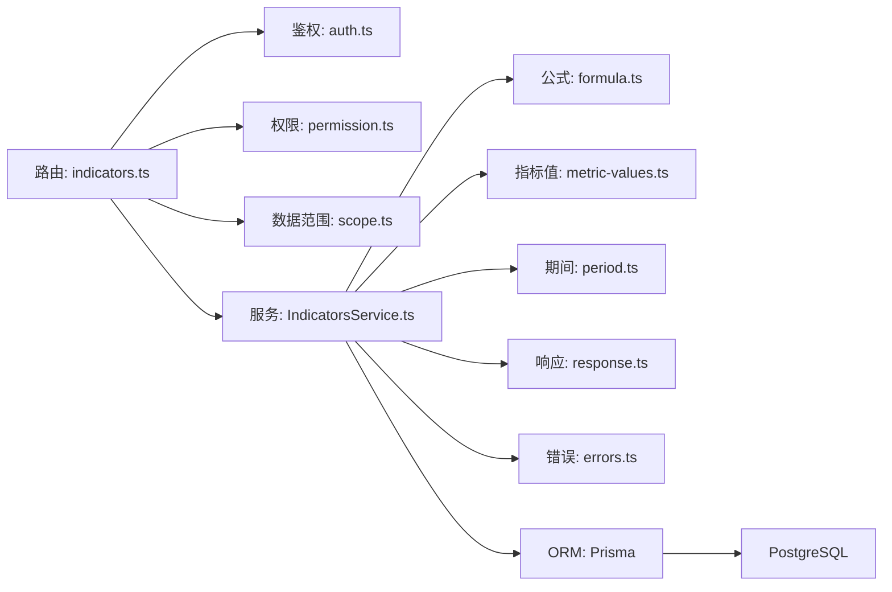

# 指标查询接口

<cite>
**本文引用的文件**   
- [server/src/routes/indicators.ts](file://server/src/routes/indicators.ts)
- [server/src/services/IndicatorsService.ts](file://server/src/services/IndicatorsService.ts)
- [server/src/middleware/auth.ts](file://server/src/middleware/auth.ts)
- [server/src/middleware/permission.ts](file://server/src/middleware/permission.ts)
- [server/src/middleware/scope.ts](file://server/src/middleware/scope.ts)
- [server/src/lib/response.ts](file://server/src/lib/response.ts)
- [server/src/lib/errors.ts](file://server/src/lib/errors.ts)
- [server/src/lib/formula.ts](file://server/src/lib/formula.ts)
- [server/src/lib/metric-values.ts](file://server/src/lib/metric-values.ts)
- [server/src/lib/period.ts](file://server/src/lib/period.ts)
- [server/prisma/schema.prisma](file://server/prisma/schema.prisma)
</cite>

## 目录
1. [简介](#简介)
2. [项目结构](#项目结构)
3. [核心组件](#核心组件)
4. [架构总览](#架构总览)
5. [详细组件分析](#详细组件分析)
6. [依赖分析](#依赖分析)
7. [性能考虑](#性能考虑)
8. [故障排查指南](#故障排查指南)
9. [结论](#结论)
10. [附录](#附录)

## 简介
本文件为 FY200 财年经营数据分析平台的“指标查询接口”API 文档，聚焦 GET /api/indicators 端点。内容涵盖：
- 请求参数与过滤条件（公司、期间、科目）
- 分页与排序选项
- 响应数据结构与字段说明（含单位转换与格式化规则）
- 权限控制与数据范围限制
- 错误处理机制
- 完整请求示例

平台定位：Excel 进、看板/报表出；单位统一为万元/人民币；计算类指标使用安全公式解析，同比/环比由后端实时计算不入库。

## 项目结构
与指标查询相关的后端代码主要位于 server 目录：
- 路由层：server/src/routes/indicators.ts
- 服务层：server/src/services/IndicatorsService.ts
- 中间件链：auth、permission、scope、soft-delete、audit 等
- 通用库：response、errors、formula、metric-values、period
- 数据模型：Prisma schema

**图示来源**
- [server/src/routes/indicators.ts](file://server/src/routes/indicators.ts)
- [server/src/middleware/auth.ts](file://server/src/middleware/auth.ts)
- [server/src/middleware/permission.ts](file://server/src/middleware/permission.ts)
- [server/src/middleware/scope.ts](file://server/src/middleware/scope.ts)
- [server/src/services/IndicatorsService.ts](file://server/src/services/IndicatorsService.ts)
- [server/src/lib/formula.ts](file://server/src/lib/formula.ts)
- [server/src/lib/metric-values.ts](file://server/src/lib/metric-values.ts)
- [server/src/lib/period.ts](file://server/src/lib/period.ts)
- [server/prisma/schema.prisma](file://server/prisma/schema.prisma)

**章节来源**
- [server/src/routes/indicators.ts](file://server/src/routes/indicators.ts)
- [server/src/services/IndicatorsService.ts](file://server/src/services/IndicatorsService.ts)
- [server/prisma/schema.prisma](file://server/prisma/schema.prisma)

## 核心组件
- 路由层：定义 GET /api/indicators，解析查询参数，调用服务层并返回统一响应。
- 服务层：实现指标查询、维度筛选（公司、期间、科目）、分页与排序、同比/环比计算、指标值聚合与单位转换。
- 中间件：JWT 鉴权、权限校验、数据范围注入（按公司/组织）、软删除过滤、审计日志。
- 工具库：安全公式解析、指标值处理、期间计算、统一响应封装、错误类型定义。

**章节来源**
- [server/src/routes/indicators.ts](file://server/src/routes/indicators.ts)
- [server/src/services/IndicatorsService.ts](file://server/src/services/IndicatorsService.ts)
- [server/src/middleware/auth.ts](file://server/src/middleware/auth.ts)
- [server/src/middleware/permission.ts](file://server/src/middleware/permission.ts)
- [server/src/middleware/scope.ts](file://server/src/middleware/scope.ts)
- [server/src/lib/response.ts](file://server/src/lib/response.ts)
- [server/src/lib/errors.ts](file://server/src/lib/errors.ts)

## 架构总览
GET /api/indicators 的请求链路如下：

**图示来源**
- [server/src/routes/indicators.ts](file://server/src/routes/indicators.ts)
- [server/src/middleware/auth.ts](file://server/src/middleware/auth.ts)
- [server/src/middleware/permission.ts](file://server/src/middleware/permission.ts)
- [server/src/middleware/scope.ts](file://server/src/middleware/scope.ts)
- [server/src/services/IndicatorsService.ts](file://server/src/services/IndicatorsService.ts)
- [server/src/lib/formula.ts](file://server/src/lib/formula.ts)
- [server/src/lib/metric-values.ts](file://server/src/lib/metric-values.ts)
- [server/src/lib/period.ts](file://server/src/lib/period.ts)
- [server/prisma/schema.prisma](file://server/prisma/schema.prisma)

## 详细组件分析

### 端点规范：GET /api/indicators
- 功能：按公司、期间、科目等维度查询指标数据，支持分页与排序，返回统一格式。
- 认证：需要有效的 JWT access token。
- 权限：需具备指标读取权限（默认拒绝，需在权限配置中显式授权）。
- 数据范围：受 scope 中间件影响，仅返回当前用户可访问的公司/组织范围数据。

#### 查询参数
- company_id: 公司ID（可选，未传则按 scope 默认范围）
- period_type: 期间类型（如 month/quarter/year），用于确定同比/环比基准
- period_value: 期间值（如 2025-01、2025-Q1、2025）
- subject_ids: 科目ID列表（可选，逗号分隔或数组）
- indicator_ids: 指标ID列表（可选，逗号分隔或数组）
- include_formula: 是否展开计算类指标（true/false）
- page: 页码（默认1）
- page_size: 每页条数（默认20，最大建议不超过200）
- sort_by: 排序字段（如 value, name, code）
- sort_order: 排序方向（asc/desc）

注意：
- 期间计算由 period.ts 提供，同比/环比在查询时实时计算，不入库。
- 计算类指标通过 formula.ts 的安全公式解析器执行，禁止 eval。
- 指标值处理与单位转换由 metric-values.ts 负责，统一单位为万元/人民币。

**章节来源**
- [server/src/routes/indicators.ts](file://server/src/routes/indicators.ts)
- [server/src/lib/period.ts](file://server/src/lib/period.ts)
- [server/src/lib/formula.ts](file://server/src/lib/formula.ts)
- [server/src/lib/metric-values.ts](file://server/src/lib/metric-values.ts)

#### 过滤条件与维度筛选
- 公司维度：company_id 精确匹配；若未传，则由 scope 中间件根据用户上下文注入默认公司范围。
- 期间维度：period_type + period_value 组合确定时间窗口；支持月/季/年三种粒度。
- 科目维度：subject_ids 多值过滤；支持树形科目展开（由前端或上层逻辑决定）。

**章节来源**
- [server/src/middleware/scope.ts](file://server/src/middleware/scope.ts)
- [server/src/services/IndicatorsService.ts](file://server/src/services/IndicatorsService.ts)

#### 分页与排序
- 分页：page、page_size 控制；服务端会返回 total、has_next 等元信息。
- 排序：sort_by、sort_order 控制；默认按指标编码升序。

**章节来源**
- [server/src/services/IndicatorsService.ts](file://server/src/services/IndicatorsService.ts)

#### 响应数据结构
统一响应体由 response.ts 封装，典型字段：
- code: 状态码（业务码）
- message: 提示信息
- data: 业务数据对象
- meta: 元数据（分页、排序、时间戳等）

data 对象包含：
- items: 指标项列表
  - id: 指标ID
  - code: 指标编码
  - name: 指标名称
  - unit: 单位（统一为万元/人民币）
  - value: 指标值（数值型，可能为空）
  - yoy: 同比增长率（百分比）
  - mom: 环比增长率（百分比）
  - formula: 计算公式（当 include_formula=true 时返回）
- pagination: 分页信息
  - page: 当前页
  - page_size: 每页大小
  - total: 总记录数
  - has_next: 是否有下一页

格式化规则：
- 金额单位统一为万元，保留两位小数
- 比率以百分比形式展示（如 12.34%）
- 空值以 null 表示，避免字符串占位

**章节来源**
- [server/src/lib/response.ts](file://server/src/lib/response.ts)
- [server/src/services/IndicatorsService.ts](file://server/src/services/IndicatorsService.ts)

#### 权限控制与数据范围
- 鉴权：auth.ts 校验 JWT，提取用户上下文（用户ID、角色、租户等）。
- 权限：permission.ts 检查是否具备指标读取权限，默认拒绝，需显式授权。
- 数据范围：scope.ts 基于用户上下文注入 Prisma 扩展，自动附加 WHERE 条件（如 company_id IN (...)）。

**章节来源**
- [server/src/middleware/auth.ts](file://server/src/middleware/auth.ts)
- [server/src/middleware/permission.ts](file://server/src/middleware/permission.ts)
- [server/src/middleware/scope.ts](file://server/src/middleware/scope.ts)

#### 错误处理机制
- 认证失败：返回 401，message 提示无效或过期令牌。
- 权限不足：返回 403，message 提示无权限。
- 参数校验失败：返回 400，message 提示具体字段错误。
- 数据不存在：返回 404，message 提示无匹配数据。
- 服务器内部错误：返回 500，message 提示系统异常。

错误对象结构：
- code: 错误码
- message: 错误描述
- details: 详细信息（可选）

**章节来源**
- [server/src/lib/errors.ts](file://server/src/lib/errors.ts)
- [server/src/lib/response.ts](file://server/src/lib/response.ts)

#### 请求示例
- 基础查询：GET /api/indicators?company_id=1&period_type=month&period_value=2025-01
- 多科目查询：GET /api/indicators?subject_ids=1001,1002&period_type=quarter&period_value=2025-Q1
- 分页排序：GET /api/indicators?page=2&page_size=10&sort_by=value&sort_order=desc
- 展开公式：GET /api/indicators?include_formula=true&period_type=year&period_value=2025

**章节来源**
- [server/src/routes/indicators.ts](file://server/src/routes/indicators.ts)

### 服务层：IndicatorsService
职责：
- 接收路由层参数与数据范围
- 构建查询条件（公司、期间、科目）
- 调用 Prisma 获取原始数据
- 计算同比/环比（基于 period.ts）
- 解析并执行安全公式（基于 formula.ts）
- 聚合指标值与单位转换（基于 metric-values.ts）
- 应用分页与排序
- 返回结构化结果

复杂度分析：
- 时间复杂度：O(n log n)（排序）+ O(k)（公式计算，k 为计算类指标数量）
- 空间复杂度：O(n)（结果集缓存）

优化机会：
- 对高频查询字段建立索引（company_id、period_type、period_value、subject_id）
- 缓存热点指标结果（Redis）
- 批量计算同比/环比，减少重复计算

**章节来源**
- [server/src/services/IndicatorsService.ts](file://server/src/services/IndicatorsService.ts)
- [server/src/lib/period.ts](file://server/src/lib/period.ts)
- [server/src/lib/formula.ts](file://server/src/lib/formula.ts)
- [server/src/lib/metric-values.ts](file://server/src/lib/metric-values.ts)

### 中间件链
- helmet：安全头设置
- cors：跨域配置
- express.json：JSON 解析
- rate-limit：速率限制
- auth：JWT 鉴权
- permission：权限校验（默认拒绝）
- scope：数据范围注入（Prisma extension）
- soft-delete：软删除过滤
- audit：审计日志
- Service：业务逻辑
- Prisma：ORM 操作
- PostgreSQL：数据库

**章节来源**
- [server/src/middleware/auth.ts](file://server/src/middleware/auth.ts)
- [server/src/middleware/permission.ts](file://server/src/middleware/permission.ts)
- [server/src/middleware/scope.ts](file://server/src/middleware/scope.ts)

### 数据模型：Prisma Schema
关键实体：
- Company：公司
- Subject：科目（支持树形结构）
- Indicator：指标（含编码、名称、单位、公式等）
- MetricValue：指标值（关联公司、期间、科目、指标）

关系：
- Company ||--o{ MetricValue : owns
- Subject ||--o{ MetricValue : contains
- Indicator ||--o{ MetricValue : records

**章节来源**
- [server/prisma/schema.prisma](file://server/prisma/schema.prisma)

## 依赖分析
组件间依赖关系如下：

**图示来源**
- [server/src/routes/indicators.ts](file://server/src/routes/indicators.ts)
- [server/src/middleware/auth.ts](file://server/src/middleware/auth.ts)
- [server/src/middleware/permission.ts](file://server/src/middleware/permission.ts)
- [server/src/middleware/scope.ts](file://server/src/middleware/scope.ts)
- [server/src/services/IndicatorsService.ts](file://server/src/services/IndicatorsService.ts)
- [server/src/lib/formula.ts](file://server/src/lib/formula.ts)
- [server/src/lib/metric-values.ts](file://server/src/lib/metric-values.ts)
- [server/src/lib/period.ts](file://server/src/lib/period.ts)
- [server/src/lib/response.ts](file://server/src/lib/response.ts)
- [server/src/lib/errors.ts](file://server/src/lib/errors.ts)
- [server/prisma/schema.prisma](file://server/prisma/schema.prisma)

**章节来源**
- [server/src/routes/indicators.ts](file://server/src/routes/indicators.ts)
- [server/src/services/IndicatorsService.ts](file://server/src/services/IndicatorsService.ts)

## 性能考虑
- 索引优化：对常用过滤字段（company_id、period_type、period_value、subject_id）建立复合索引。
- 缓存策略：对热点指标结果进行短期缓存（如 Redis），降低数据库压力。
- 批量计算：同比/环比计算尽量批量处理，避免 N+1 查询。
- 分页限制：限制 page_size 最大值，防止大结果集拖垮系统。
- 公式执行：安全公式解析器已禁用危险操作，但仍需注意复杂公式的性能开销。

[本节为通用指导，无需特定文件引用]

## 故障排查指南
常见问题与解决方案：
- 401 未认证：检查 JWT 令牌是否有效且未过期。
- 403 无权限：确认用户是否具备指标读取权限。
- 400 参数错误：检查查询参数格式是否正确（如 period_value 格式）。
- 404 数据不存在：确认公司、期间、科目是否存在且用户有访问权限。
- 500 服务器错误：查看日志，定位具体异常堆栈。

调试技巧：
- 启用详细日志（在开发环境）
- 使用 Postman/cURL 测试接口
- 检查数据库连接与权限
- 验证公式语法与数据完整性

**章节来源**
- [server/src/lib/errors.ts](file://server/src/lib/errors.ts)
- [server/src/lib/response.ts](file://server/src/lib/response.ts)

## 结论
GET /api/indicators 接口提供了灵活、安全的指标查询能力，支持多维度筛选、分页排序、单位转换与实时计算。通过严格的权限控制与数据范围限制，确保数据安全与合规。建议在生产环境中结合缓存与索引优化，提升查询性能与稳定性。

[本节为总结性内容，无需特定文件引用]

## 附录
- 术语表：
  - 指标：财务或经营关键绩效指标
  - 科目：会计科目或分析维度
  - 期间：时间窗口（月/季/年）
  - 同比：与去年同期比较
  - 环比：与上一周期比较
- 参考文档：
  - 数据库模式：server/prisma/schema.prisma
  - 安全与权限规范：docs/plans/安全与权限规范.md
  - 数据模型规范：docs/plans/数据模型规范.md

[本节为补充信息，无需特定文件引用]