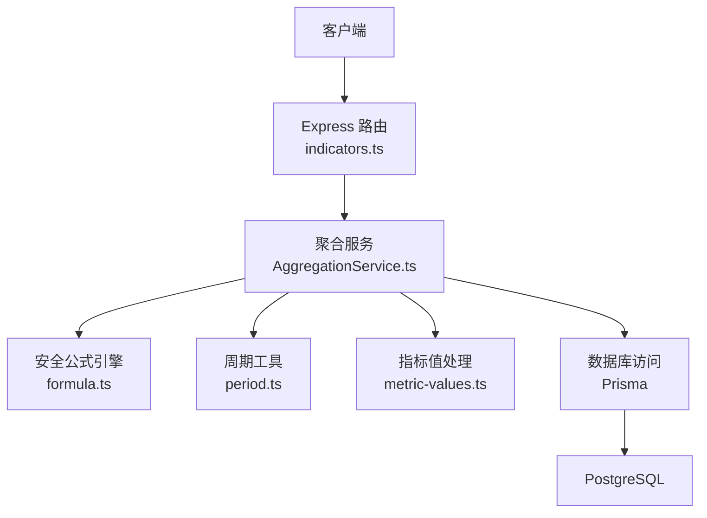
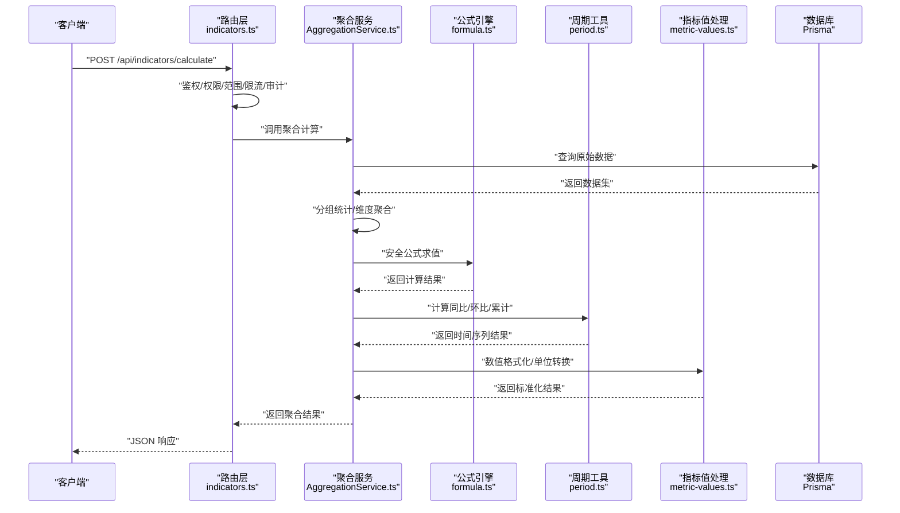
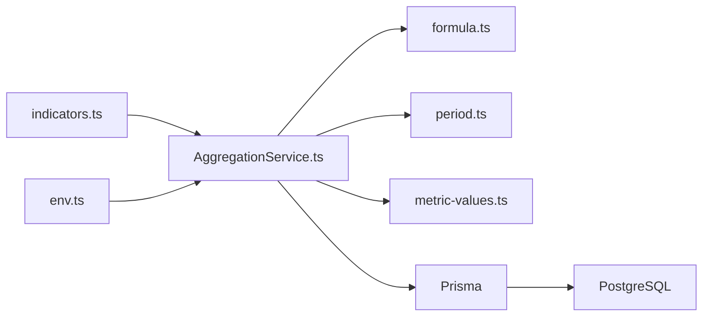

# 聚合计算接口

<cite>
**本文引用的文件**   
- [indicators.ts](file://server/src/routes/indicators.ts)
- [AggregationService.ts](file://server/src/services/AggregationService.ts)
- [formula.ts](file://server/src/lib/formula.ts)
- [period.ts](file://server/src/lib/period.ts)
- [metric-values.ts](file://server/src/lib/metric-values.ts)
- [env.ts](file://server/src/config/env.ts)
- [schema.prisma](file://server/prisma/schema.prisma)
- [20260722142144_add_formula_rule/migration.sql](file://server/prisma/migrations/20260722142144_add_formula_rule/migration.sql)
- [performance.md](file://docs/references/performance.md)
</cite>

## 目录
1. [简介](#简介)
2. [项目结构](#项目结构)
3. [核心组件](#核心组件)
4. [架构总览](#架构总览)
5. [详细组件分析](#详细组件分析)
6. [依赖关系分析](#依赖关系分析)
7. [性能考虑](#性能考虑)
8. [故障排查指南](#故障排查指南)
9. [结论](#结论)
10. [附录](#附录)

## 简介
本文件面向“FY200 财年经营数据分析平台”的聚合计算接口，重点说明 POST /api/indicators/calculate 端点的计算逻辑与使用方式。该接口支持多维度指标聚合、分组统计、同比/环比/累计等时间序列分析，以及基于安全公式解析引擎的自定义公式计算。安全公式采用白名单算子（+ - * / ( )）机制，禁止任意代码执行，确保输入公式的安全性。

## 项目结构
后端服务以 Express 路由 + Prisma ORM 为核心，结合中间件链完成鉴权、权限、范围控制、审计等能力。聚合计算相关的关键位置如下：
- 路由层：indicators.ts 暴露 /api/indicators/calculate 端点
- 服务层：AggregationService.ts 实现多维聚合、分组统计、时间序列对比与累计
- 公式引擎：formula.ts 提供安全公式解析与求值
- 周期工具：period.ts 提供同比/环比/累计的时间窗口计算
- 指标值处理：metric-values.ts 提供数值格式化、空值处理、精度控制
- 配置：env.ts 提供缓存开关、超时、并发等运行时参数
- 数据模型：schema.prisma 与迁移脚本定义指标、公式规则等表结构

图表来源
- [indicators.ts](file://server/src/routes/indicators.ts)
- [AggregationService.ts](file://server/src/services/AggregationService.ts)
- [formula.ts](file://server/src/lib/formula.ts)
- [period.ts](file://server/src/lib/period.ts)
- [metric-values.ts](file://server/src/lib/metric-values.ts)
- [schema.prisma](file://server/prisma/schema.prisma)

章节来源
- [indicators.ts](file://server/src/routes/indicators.ts)
- [AggregationService.ts](file://server/src/services/AggregationService.ts)
- [formula.ts](file://server/src/lib/formula.ts)
- [period.ts](file://server/src/lib/period.ts)
- [metric-values.ts](file://server/src/lib/metric-values.ts)
- [env.ts](file://server/src/config/env.ts)
- [schema.prisma](file://server/prisma/schema.prisma)

## 核心组件
- 路由层（indicators.ts）
  - 负责接收请求、校验入参、调用 AggregationService 并返回统一响应格式
  - 集成鉴权、权限、范围控制、限流、审计等中间件
- 聚合服务（AggregationService.ts）
  - 实现多维度聚合（按公司、部门、科目、期间等维度）
  - 分组统计（GROUP BY 语义）
  - 时间序列分析（同比、环比、累计）
  - 公式计算（通过 formula.ts 安全求值）
- 安全公式引擎（formula.ts）
  - 白名单算子：+ - * / ( )
  - 表达式解析与求值，拒绝非法字符与函数调用
- 周期工具（period.ts）
  - 计算同比/环比/累计的时间窗口
  - 支持财年、季度、月度、周度等粒度
- 指标值处理（metric-values.ts）
  - 数值格式化、空值填充、精度控制、单位换算（万元）
- 配置（env.ts）
  - 缓存开关、TTL、最大并发、超时等运行时参数

章节来源
- [indicators.ts](file://server/src/routes/indicators.ts)
- [AggregationService.ts](file://server/src/services/AggregationService.ts)
- [formula.ts](file://server/src/lib/formula.ts)
- [period.ts](file://server/src/lib/period.ts)
- [metric-values.ts](file://server/src/lib/metric-values.ts)
- [env.ts](file://server/src/config/env.ts)

## 架构总览
POST /api/indicators/calculate 的请求处理流程如下：
- 客户端发起请求，携带维度、时间范围、聚合方式、分组字段、公式等参数
- 路由层进行参数校验与鉴权
- 聚合服务根据维度与时间范围查询数据，执行分组统计
- 对需要计算的指标，调用安全公式引擎进行求值
- 根据周期工具计算同比/环比/累计
- 指标值处理模块进行格式化与单位转换
- 返回结构化结果

图表来源
- [indicators.ts](file://server/src/routes/indicators.ts)
- [AggregationService.ts](file://server/src/services/AggregationService.ts)
- [formula.ts](file://server/src/lib/formula.ts)
- [period.ts](file://server/src/lib/period.ts)
- [metric-values.ts](file://server/src/lib/metric-values.ts)
- [schema.prisma](file://server/prisma/schema.prisma)

## 详细组件分析

### 路由层：POST /api/indicators/calculate
- 功能
  - 接收聚合计算请求，包含维度、时间范围、聚合方式、分组字段、公式等
  - 校验必填字段与取值范围
  - 调用 AggregationService 执行计算
  - 返回统一 JSON 结构
- 关键入参
  - dimensions：维度数组（如公司、部门、科目、期间）
  - timeRange：时间范围（开始日期、结束日期、粒度）
  - aggregations：聚合方式（SUM、AVG、COUNT、MIN、MAX）
  - groupBy：分组字段
  - formulas：自定义公式（字符串，仅允许白名单算子）
  - compare：是否启用同比/环比/累计
- 关键出参
  - data：聚合结果集
  - meta：元信息（维度、时间范围、聚合方式、公式等）
  - errors：错误列表（如有）

章节来源
- [indicators.ts](file://server/src/routes/indicators.ts)

### 聚合服务：AggregationService
- 功能
  - 多维度聚合：按指定维度组合进行 SUM/AVG/COUNT/MIN/MAX
  - 分组统计：GROUP BY 语义，支持多级分组
  - 时间序列分析：同比、环比、累计
  - 公式计算：调用 formula.ts 进行安全求值
- 算法要点
  - 维度组合去重与排序
  - 分组键生成与哈希映射
  - 时间窗口对齐与边界处理
  - 公式求值的安全性与性能优化

章节来源
- [AggregationService.ts](file://server/src/services/AggregationService.ts)

### 安全公式引擎：formula.ts
- 功能
  - 解析用户输入的公式字符串
  - 仅允许白名单算子：+ - * / ( )
  - 构建抽象语法树并进行求值
  - 拒绝非法字符、函数调用、变量注入
- 安全策略
  - 词法分析阶段过滤非法字符
  - 语法分析阶段限制表达式结构
  - 求值阶段使用安全上下文，禁止外部函数与对象访问
- 性能优化
  - 表达式缓存（相同公式复用 AST）
  - 批量求值减少重复解析

章节来源
- [formula.ts](file://server/src/lib/formula.ts)

### 周期工具：period.ts
- 功能
  - 计算同比：与去年同期比较
  - 计算环比：与上一期比较
  - 计算累计：从年初到当前期的累计值
- 支持粒度
  - 年、季、月、周、日
- 边界处理
  - 跨年、闰年、月末对齐
  - 缺失数据的插值或占位

章节来源
- [period.ts](file://server/src/lib/period.ts)

### 指标值处理：metric-values.ts
- 功能
  - 数值格式化（保留小数、千分位分隔）
  - 空值处理（NULL、NaN、Infinity）
  - 单位换算（万元）
  - 精度控制与四舍五入
- 输出规范
  - 统一数值类型与格式
  - 错误值标记与提示

章节来源
- [metric-values.ts](file://server/src/lib/metric-values.ts)

### 配置与环境：env.ts
- 功能
  - 读取环境变量（缓存开关、TTL、并发、超时）
  - 提供默认值与校验
- 关键配置项
  - CACHE_ENABLED：是否启用缓存
  - CACHE_TTL：缓存过期时间（秒）
  - MAX_CONCURRENT：最大并发数
  - REQUEST_TIMEOUT：请求超时（毫秒）

章节来源
- [env.ts](file://server/src/config/env.ts)

### 数据模型：schema.prisma 与迁移
- 指标与公式规则
  - 指标定义表：存储指标名称、类型、单位、公式等
  - 公式规则表：存储公式版本、白名单、校验规则等
- 迁移脚本
  - 20260722142144_add_formula_rule：添加公式规则表结构与初始数据

章节来源
- [schema.prisma](file://server/prisma/schema.prisma)
- [20260722142144_add_formula_rule/migration.sql](file://server/prisma/migrations/20260722142144_add_formula_rule/migration.sql)

## 依赖关系分析
- 路由层依赖聚合服务
- 聚合服务依赖公式引擎、周期工具、指标值处理
- 所有服务依赖 Prisma 与 PostgreSQL
- 配置模块为全局共享

图表来源
- [indicators.ts](file://server/src/routes/indicators.ts)
- [AggregationService.ts](file://server/src/services/AggregationService.ts)
- [formula.ts](file://server/src/lib/formula.ts)
- [period.ts](file://server/src/lib/period.ts)
- [metric-values.ts](file://server/src/lib/metric-values.ts)
- [env.ts](file://server/src/config/env.ts)
- [schema.prisma](file://server/prisma/schema.prisma)

章节来源
- [indicators.ts](file://server/src/routes/indicators.ts)
- [AggregationService.ts](file://server/src/services/AggregationService.ts)
- [formula.ts](file://server/src/lib/formula.ts)
- [period.ts](file://server/src/lib/period.ts)
- [metric-values.ts](file://server/src/lib/metric-values.ts)
- [env.ts](file://server/src/config/env.ts)
- [schema.prisma](file://server/prisma/schema.prisma)

## 性能考虑
- 实时计算优化
  - 增量聚合：避免全量扫描，利用索引与物化视图
  - 并行计算：按维度分片并行处理
  - 结果缓存：相同参数的请求直接返回缓存结果
- 缓存机制
  - 内存缓存：LruCache 存储热点结果
  - 分布式缓存：Redis 共享缓存（可选）
  - 缓存键设计：维度+时间范围+聚合方式+公式
- 数据库优化
  - 索引策略：按维度与时间戳建立复合索引
  - 查询优化：使用窗口函数与CTE简化复杂查询
- 监控与告警
  - 慢查询日志
  - 缓存命中率监控
  - 错误率与延迟告警

章节来源
- [performance.md](file://docs/references/performance.md)
- [env.ts](file://server/src/config/env.ts)

## 故障排查指南
- 常见问题
  - 公式解析失败：检查白名单算子与语法
  - 时间范围无效：确认起止日期与粒度匹配
  - 维度缺失：检查维度字段是否存在于数据源
  - 性能问题：查看缓存命中率与慢查询日志
- 调试步骤
  - 启用详细日志
  - 逐步验证公式与查询
  - 检查缓存状态与数据库索引
- 恢复措施
  - 重置缓存
  - 回滚公式版本
  - 重建索引

章节来源
- [formula.ts](file://server/src/lib/formula.ts)
- [period.ts](file://server/src/lib/period.ts)
- [AggregationService.ts](file://server/src/services/AggregationService.ts)

## 结论
POST /api/indicators/calculate 提供了强大的聚合计算能力，支持多维度、分组统计、时间序列分析与自定义公式。安全公式引擎确保输入公式的安全性，周期工具提供灵活的同比/环比/累计计算。通过合理的性能优化与缓存机制，系统能够高效处理大规模数据查询。建议在生产环境中启用缓存与监控，确保系统稳定与高性能。

## 附录

### 计算公式语法
- 支持的算子：+ - * / ( )
- 变量引用：使用字段名作为变量（如 revenue、cost）
- 示例公式：
  - (revenue - cost) / revenue
  - (revenue + profit) * 0.1
- 注意事项：
  - 禁止函数调用与外部库
  - 变量必须存在于数据集中
  - 除零错误需处理

### 函数库
- 内置函数：无（仅支持基本算术运算）
- 扩展函数：可通过插件机制添加（需审核与安全验证）

### 使用示例
- 请求体示例：
  {
    "dimensions": ["company", "department"],
    "timeRange": {"start": "2024-01-01", "end": "2024-12-31", "granularity": "month"},
    "aggregations": ["sum", "avg"],
    "groupBy": ["company"],
    "formulas": ["(revenue - cost) / revenue"],
    "compare": ["yoy", "mom", "ytd"]
  }
- 响应体示例：
  {
    "data": [...],
    "meta": {...},
    "errors": []
  }

章节来源
- [formula.ts](file://server/src/lib/formula.ts)
- [indicators.ts](file://server/src/routes/indicators.ts)