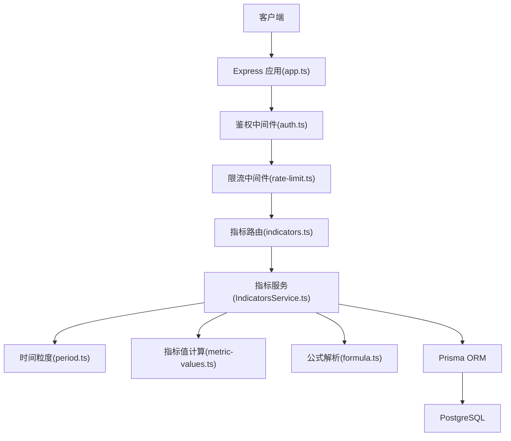
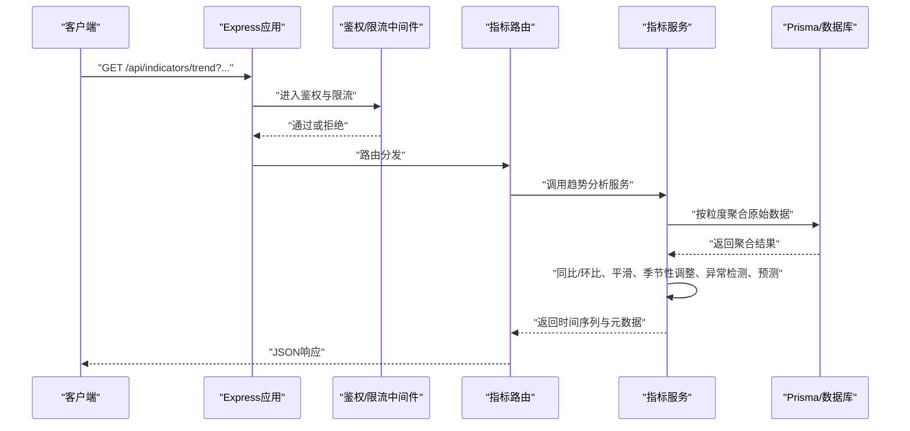
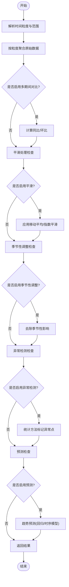
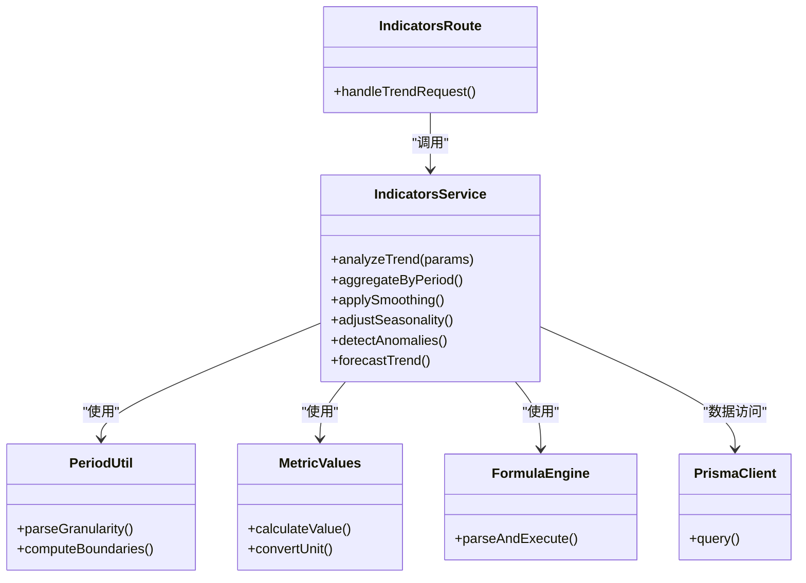

# 趋势分析接口

<cite>
**本文引用的文件**   
- [server/src/routes/indicators.ts](file://server/src/routes/indicators.ts)
- [server/src/services/IndicatorsService.ts](file://server/src/services/IndicatorsService.ts)
- [server/src/lib/period.ts](file://server/src/lib/period.ts)
- [server/src/lib/metric-values.ts](file://server/src/lib/metric-values.ts)
- [server/src/lib/formula.ts](file://server/src/lib/formula.ts)
- [server/src/middleware/auth.ts](file://server/src/middleware/auth.ts)
- [server/src/middleware/error-handler.ts](file://server/src/middleware/error-handler.ts)
- [server/src/middleware/rate-limit.ts](file://server/src/middleware/rate-limit.ts)
- [server/src/app.ts](file://server/src/app.ts)
- [web/src/components/charts/trend-chart.tsx](file://web/src/components/charts/trend-chart.tsx)
</cite>

## 目录
1. [简介](#简介)
2. [项目结构](#项目结构)
3. [核心组件](#核心组件)
4. [架构总览](#架构总览)
5. [详细组件分析](#详细组件分析)
6. [依赖关系分析](#依赖关系分析)
7. [性能考虑](#性能考虑)
8. [故障排查指南](#故障排查指南)
9. [结论](#结论)
10. [附录](#附录)

## 简介
本文件为 FY200 财年经营数据分析平台的“趋势分析接口”技术文档，聚焦 GET /api/indicators/trend 端点。该端点提供时间序列分析能力，支持多期间数据对比、趋势预测与异常检测，并覆盖时间粒度配置（日/周/月/季/年）、数据平滑处理与季节性调整。文档同时给出趋势图表数据格式、关键指标提取方法与可视化建议，以及大数据量处理的优化策略与异步计算支持说明。

## 项目结构
后端采用 Express 路由 + Prisma ORM + PostgreSQL 的架构，中间件链包含安全、鉴权、限流、权限、审计等。趋势分析相关代码主要分布在：
- 路由层：定义 /api/indicators/trend 请求入口与参数校验
- 服务层：实现时间序列聚合、同比/环比、平滑、季节性调整、异常检测与预测
- 工具库：时间粒度解析、指标值计算、公式解析与安全执行
- 前端：趋势图组件消费 API 返回的数据结构进行渲染

**图示来源** 
- [server/src/app.ts](file://server/src/app.ts)
- [server/src/routes/indicators.ts](file://server/src/routes/indicators.ts)
- [server/src/services/IndicatorsService.ts](file://server/src/services/IndicatorsService.ts)
- [server/src/lib/period.ts](file://server/src/lib/period.ts)
- [server/src/lib/metric-values.ts](file://server/src/lib/metric-values.ts)
- [server/src/lib/formula.ts](file://server/src/lib/formula.ts)

**章节来源**
- [server/src/app.ts](file://server/src/app.ts)
- [server/src/routes/indicators.ts](file://server/src/routes/indicators.ts)

## 核心组件
- 路由层（GET /api/indicators/trend）
  - 接收查询参数：指标ID、时间范围、时间粒度、对比期间、平滑窗口、季节性调整开关、异常检测阈值、预测步长等
  - 调用指标服务生成时间序列结果
- 指标服务（IndicatorsService）
  - 负责时间粒度转换、数据聚合、同比/环比计算、平滑处理、季节性调整、异常检测与趋势预测
  - 使用安全公式引擎计算派生指标
- 工具库
  - period.ts：时间粒度解析与边界计算（日/周/月/季/年）
  - metric-values.ts：指标值计算与单位换算（统一万元/人民币）
  - formula.ts：白名单算子解析与执行，禁止 eval，保障安全

**章节来源**
- [server/src/routes/indicators.ts](file://server/src/routes/indicators.ts)
- [server/src/services/IndicatorsService.ts](file://server/src/services/IndicatorsService.ts)
- [server/src/lib/period.ts](file://server/src/lib/period.ts)
- [server/src/lib/metric-values.ts](file://server/src/lib/metric-values.ts)
- [server/src/lib/formula.ts](file://server/src/lib/formula.ts)

## 架构总览
下图展示从客户端请求到数据库查询与返回结果的完整链路，包括中间件与服务的职责分工。

**图示来源** 
- [server/src/app.ts](file://server/src/app.ts)
- [server/src/middleware/auth.ts](file://server/src/middleware/auth.ts)
- [server/src/middleware/rate-limit.ts](file://server/src/middleware/rate-limit.ts)
- [server/src/routes/indicators.ts](file://server/src/routes/indicators.ts)
- [server/src/services/IndicatorsService.ts](file://server/src/services/IndicatorsService.ts)

## 详细组件分析

### 路由层：GET /api/indicators/trend
- 功能概述
  - 接收时间序列分析请求，参数包括指标ID、时间范围、粒度、对比期间、平滑窗口、季节性调整、异常检测阈值、预测步长等
  - 将请求参数传递给指标服务，并返回标准化 JSON 响应
- 关键行为
  - 参数校验与默认值设置
  - 权限与限流检查
  - 错误统一处理与状态码映射

**章节来源**
- [server/src/routes/indicators.ts](file://server/src/routes/indicators.ts)

### 指标服务：时间序列分析与算法
- 时间粒度配置
  - 支持日/周/月/季/年，基于 period.ts 解析起止时间与分组键
- 数据聚合与对比
  - 按粒度对原始数据进行聚合，支持多期间对比（如本期 vs 上期、同比、环比）
- 数据平滑处理
  - 移动平均、指数平滑等，平滑窗口由参数控制
- 季节性调整
  - 根据周期特征去除季节性影响，便于趋势识别
- 异常检测
  - 基于统计方法（如Z-Score、IQR）标记异常点，阈值可配置
- 趋势预测
  - 线性回归或简单时序模型，预测步长由参数控制
- 公式计算
  - 使用安全公式引擎计算派生指标，避免不安全执行

**图示来源** 
- [server/src/services/IndicatorsService.ts](file://server/src/services/IndicatorsService.ts)
- [server/src/lib/period.ts](file://server/src/lib/period.ts)
- [server/src/lib/metric-values.ts](file://server/src/lib/metric-values.ts)
- [server/src/lib/formula.ts](file://server/src/lib/formula.ts)

**章节来源**
- [server/src/services/IndicatorsService.ts](file://server/src/services/IndicatorsService.ts)
- [server/src/lib/period.ts](file://server/src/lib/period.ts)
- [server/src/lib/metric-values.ts](file://server/src/lib/metric-values.ts)
- [server/src/lib/formula.ts](file://server/src/lib/formula.ts)

### 前端趋势图组件：数据消费与可视化建议
- 数据消费
  - 读取服务端返回的时间序列数组、异常标记、预测区间、对比系列等字段
- 可视化建议
  - 主趋势线：折线图展示核心指标随时间变化
  - 对比系列：叠加同比/环比曲线，颜色区分
  - 异常点：高亮标记异常时间段
  - 预测区间：半透明区域表示置信区间
  - 交互：缩放、筛选粒度、切换对比期间

**章节来源**
- [web/src/components/charts/trend-chart.tsx](file://web/src/components/charts/trend-chart.tsx)

## 依赖关系分析
- 路由依赖中间件：鉴权、限流、错误处理
- 服务依赖工具库：时间粒度、指标值计算、公式解析
- 数据访问依赖 Prisma 与 PostgreSQL

**图示来源** 
- [server/src/routes/indicators.ts](file://server/src/routes/indicators.ts)
- [server/src/services/IndicatorsService.ts](file://server/src/services/IndicatorsService.ts)
- [server/src/lib/period.ts](file://server/src/lib/period.ts)
- [server/src/lib/metric-values.ts](file://server/src/lib/metric-values.ts)
- [server/src/lib/formula.ts](file://server/src/lib/formula.ts)

**章节来源**
- [server/src/routes/indicators.ts](file://server/src/routes/indicators.ts)
- [server/src/services/IndicatorsService.ts](file://server/src/services/IndicatorsService.ts)

## 性能考虑
- 大数据量处理
  - 在数据库层按粒度预聚合，减少内存占用与传输体积
  - 分页与增量加载，避免一次性返回海量数据
- 异步计算支持
  - 对于复杂预测与异常检测，可采用后台任务队列（如 BullMQ）异步执行，前端轮询或WebSocket推送结果
- 缓存策略
  - 对热点指标与固定时间窗口的结果进行短期缓存（Redis），降低重复计算
- 平滑与季节性调整
  - 滑动窗口计算尽量向数据库侧下推，减少网络往返
- 预测与异常检测
  - 限制预测步长与异常检测窗口大小，避免O(n^2)复杂度

[本节为通用性能指导，不直接分析具体文件]

## 故障排查指南
- 鉴权失败
  - 检查JWT token有效性、黑名单与权限范围
- 限流触发
  - 观察rate-limit中间件日志，确认请求频率是否超限
- 参数错误
  - 校验时间范围、粒度、平滑窗口、阈值等参数合法性
- 数据库查询慢
  - 检查索引与聚合SQL，必要时增加物化视图或预计算表
- 公式解析错误
  - 确认公式仅使用白名单算子，避免非法字符

**章节来源**
- [server/src/middleware/auth.ts](file://server/src/middleware/auth.ts)
- [server/src/middleware/rate-limit.ts](file://server/src/middleware/rate-limit.ts)
- [server/src/middleware/error-handler.ts](file://server/src/middleware/error-handler.ts)

## 结论
GET /api/indicators/trend 提供了完整的FY200趋势分析能力，涵盖时间粒度配置、多期间对比、平滑处理、季节性调整、异常检测与趋势预测。通过模块化设计与安全公式引擎，系统在准确性与安全性上得到保障。针对大数据量场景，建议结合数据库预聚合、缓存与异步计算提升性能。前端趋势图组件可直接消费结构化数据，快速构建可视化看板。

[本节为总结性内容，不直接分析具体文件]

## 附录
- 时间粒度说明
  - 日：按自然日分组
  - 周：按ISO周分组
  - 月：按自然月分组
  - 季：按季度分组
  - 年：按自然年分组
- 关键指标提取
  - 核心指标：收入、成本、利润等
  - 派生指标：通过安全公式计算比率、增长率等
- 可视化建议
  - 折线图为主，叠加对比线与异常标记
  - 预测区间以半透明区域展示
  - 交互支持缩放、筛选与切换粒度

[本节为补充信息，不直接分析具体文件]