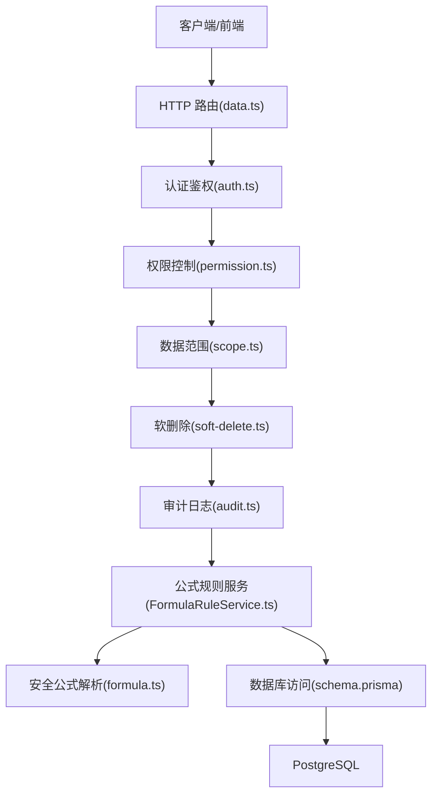
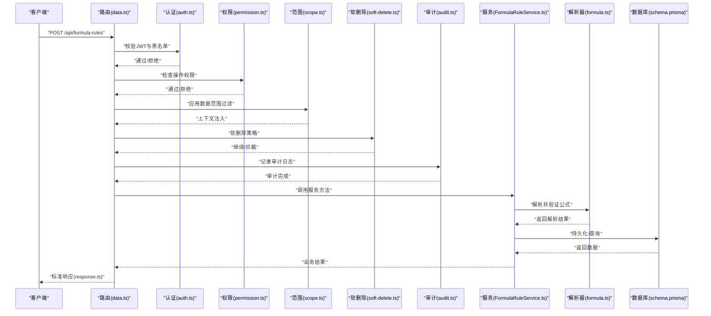
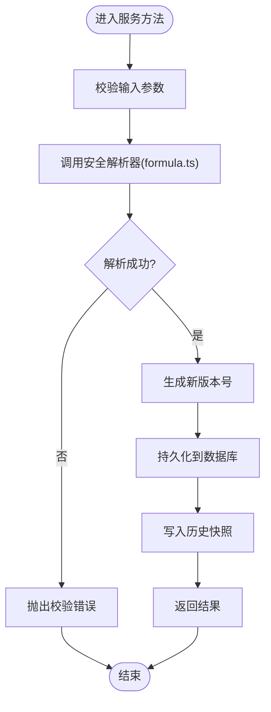
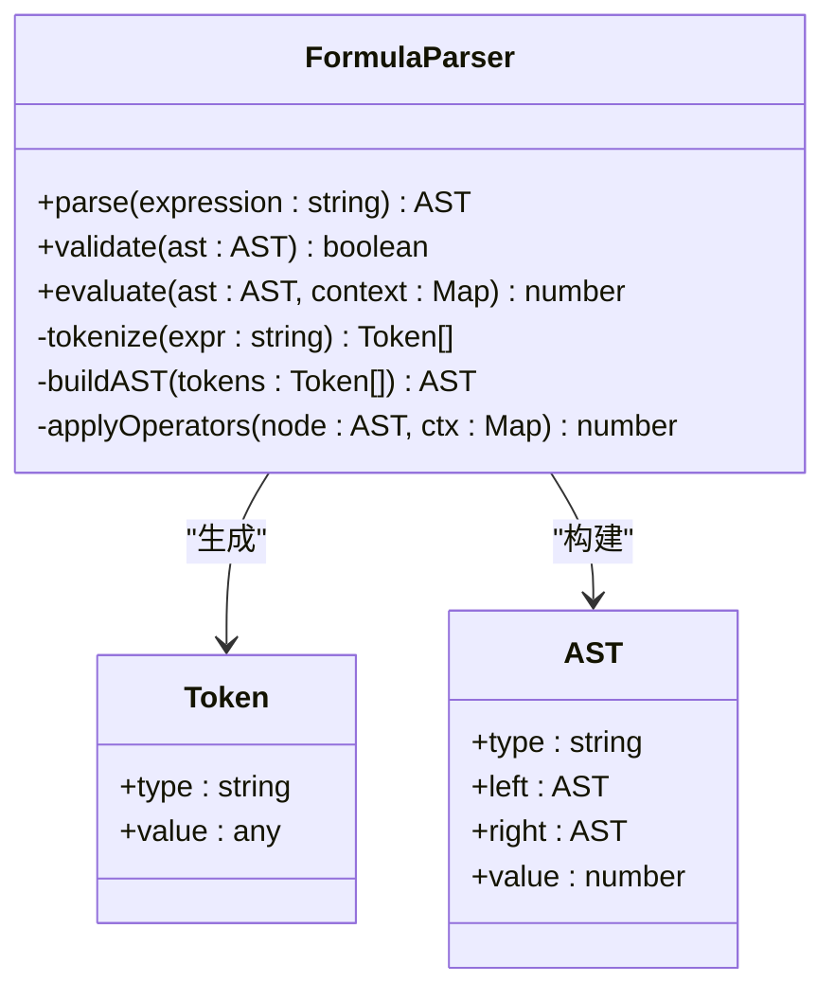
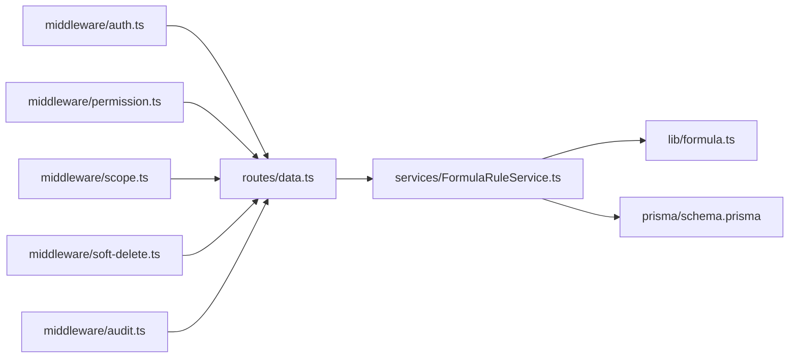

# 公式规则管理接口

<cite>
**本文引用的文件**   
- [server/src/services/FormulaRuleService.ts](file://server/src/services/FormulaRuleService.ts)
- [server/src/lib/formula.ts](file://server/src/lib/formula.ts)
- [server/src/middleware/auth.ts](file://server/src/middleware/auth.ts)
- [server/src/middleware/permission.ts](file://server/src/middleware/permission.ts)
- [server/src/middleware/scope.ts](file://server/src/middleware/scope.ts)
- [server/src/middleware/soft-delete.ts](file://server/src/middleware/soft-delete.ts)
- [server/src/middleware/audit.ts](file://server/src/middleware/audit.ts)
- [server/src/routes/data.ts](file://server/src/routes/data.ts)
- [server/prisma/schema.prisma](file://server/prisma/schema.prisma)
- [server/prisma/migrations/20260722142144_add_formula_rule/migration.sql](file://server/prisma/migrations/20260722142144_add_formula_rule/migration.sql)
- [server/src/lib/response.ts](file://server/src/lib/response.ts)
- [server/src/lib/errors.ts](file://server/src/lib/errors.ts)
- [web/src/pages/data/formula-maintenance.tsx](file://web/src/pages/data/formula-maintenance.tsx)
- [web/src/pages/data/formula-rule-dialog.tsx](file://web/src/pages/data/formula-rule-dialog.tsx)
- [web/src/pages/data/formula-history-dialog.tsx](file://web/src/pages/data/formula-history-dialog.tsx)
</cite>

## 目录
1. [简介](#简介)
2. [项目结构](#项目结构)
3. [核心组件](#核心组件)
4. [架构总览](#架构总览)
5. [详细组件分析](#详细组件分析)
6. [依赖关系分析](#依赖关系分析)
7. [性能考量](#性能考量)
8. [故障排查指南](#故障排查指南)
9. [结论](#结论)
10. [附录](#附录)

## 简介
本文件为 FY200 财年经营数据分析平台的“公式规则管理”完整 API 文档，覆盖公式规则的创建、读取、更新、删除（CRUD）、版本控制与历史追踪、安全解析器与白名单算子、语法规范、变量引用与计算优先级、验证/测试/调试工具、最佳实践与性能优化建议，以及完整的 API 调用示例与常见问题解决方案。

平台定位：Excel 进、看板/报表出；单位统一为万元/人民币。计算类指标使用安全公式解析（白名单算子 +、-、*、/、()，禁止 eval），同比/环比由后端实时计算不存库。中间件执行链顺序：helmet → cors → express.json → rate-limit → auth(JWT+黑名单) → permission(默认拒绝) → scope(Prisma extension) → softDelete → audit → Service → Prisma → PostgreSQL。

## 项目结构
围绕公式规则管理的后端实现主要位于 server 目录：
- 路由层：负责 HTTP 端点定义与参数校验
- 服务层：业务逻辑封装（CRUD、版本化、审计）
- 安全解析器：白名单算子与表达式求值
- 数据模型：Prisma schema 与迁移脚本
- 前端页面：公式维护、规则编辑、历史查看

图表来源
- [server/src/routes/data.ts](file://server/src/routes/data.ts)
- [server/src/middleware/auth.ts](file://server/src/middleware/auth.ts)
- [server/src/middleware/permission.ts](file://server/src/middleware/permission.ts)
- [server/src/middleware/scope.ts](file://server/src/middleware/scope.ts)
- [server/src/middleware/soft-delete.ts](file://server/src/middleware/soft-delete.ts)
- [server/src/middleware/audit.ts](file://server/src/middleware/audit.ts)
- [server/src/services/FormulaRuleService.ts](file://server/src/services/FormulaRuleService.ts)
- [server/src/lib/formula.ts](file://server/src/lib/formula.ts)
- [server/prisma/schema.prisma](file://server/prisma/schema.prisma)

章节来源
- [server/src/routes/data.ts](file://server/src/routes/data.ts)
- [server/src/services/FormulaRuleService.ts](file://server/src/services/FormulaRuleService.ts)
- [server/src/lib/formula.ts](file://server/src/lib/formula.ts)
- [server/prisma/schema.prisma](file://server/prisma/schema.prisma)

## 核心组件
- 公式规则服务（FormulaRuleService）：提供公式规则的 CRUD、版本化、历史查询、批量操作等能力。
- 安全公式解析器（formula.ts）：基于白名单算子的表达式解析与求值，支持 +、-、*、/、()，禁止任意代码执行。
- 路由层（data.ts）：暴露 RESTful 接口，承载请求/响应转换与错误处理。
- 中间件链：auth → permission → scope → soft-delete → audit，确保安全、权限、数据范围、软删除与审计。
- 数据模型（schema.prisma + migration）：定义公式规则实体、字段、索引与约束。

章节来源
- [server/src/services/FormulaRuleService.ts](file://server/src/services/FormulaRuleService.ts)
- [server/src/lib/formula.ts](file://server/src/lib/formula.ts)
- [server/src/routes/data.ts](file://server/src/routes/data.ts)
- [server/prisma/schema.prisma](file://server/prisma/schema.prisma)

## 架构总览
下图展示了从 HTTP 请求到数据库的完整调用链路，并标注了关键的安全与审计环节。

图表来源
- [server/src/routes/data.ts](file://server/src/routes/data.ts)
- [server/src/middleware/auth.ts](file://server/src/middleware/auth.ts)
- [server/src/middleware/permission.ts](file://server/src/middleware/permission.ts)
- [server/src/middleware/scope.ts](file://server/src/middleware/scope.ts)
- [server/src/middleware/soft-delete.ts](file://server/src/middleware/soft-delete.ts)
- [server/src/middleware/audit.ts](file://server/src/middleware/audit.ts)
- [server/src/services/FormulaRuleService.ts](file://server/src/services/FormulaRuleService.ts)
- [server/src/lib/formula.ts](file://server/src/lib/formula.ts)
- [server/prisma/schema.prisma](file://server/prisma/schema.prisma)

## 详细组件分析

### 公式规则服务（FormulaRuleService）
职责：
- 公式规则的增删改查（CRUD）
- 版本控制与历史追踪（每次变更生成新版本）
- 公式有效性校验与测试执行
- 批量导入/导出与冲突检测

关键流程：
- 创建：接收公式定义 → 解析与校验 → 生成版本号 → 写入历史 → 返回最新规则
- 读取：按 ID/编码/版本查询，支持分页与筛选
- 更新：增量更新 → 校验 → 生成新版本 → 合并历史
- 删除：软删除标记，保留历史可追溯

图表来源
- [server/src/services/FormulaRuleService.ts](file://server/src/services/FormulaRuleService.ts)
- [server/src/lib/formula.ts](file://server/src/lib/formula.ts)

章节来源
- [server/src/services/FormulaRuleService.ts](file://server/src/services/FormulaRuleService.ts)

### 安全公式解析器（formula.ts）
设计要点：
- 白名单算子：仅允许 +、-、*、/、()
- 禁止 eval 或 Function 构造，防止代码注入
- 支持数字常量、变量占位符与函数扩展点（按需）
- 计算优先级遵循数学标准（括号优先，乘除优先于加减）
- 错误分类：语法错误、类型错误、运行时异常（如除零）

图表来源
- [server/src/lib/formula.ts](file://server/src/lib/formula.ts)

章节来源
- [server/src/lib/formula.ts](file://server/src/lib/formula.ts)

### 路由层（data.ts）
职责：
- 定义公式规则相关 RESTful 端点
- 统一请求体校验与响应格式
- 错误码与消息标准化

典型端点：
- POST /api/formula-rules：创建公式规则
- GET /api/formula-rules/:id：获取单条规则详情
- PUT /api/formula-rules/:id：更新公式规则
- DELETE /api/formula-rules/:id：软删除公式规则
- GET /api/formula-rules：列表查询（分页、筛选）
- POST /api/formula-rules/:id/test：测试公式执行
- GET /api/formula-rules/:id/history：查询历史版本

章节来源
- [server/src/routes/data.ts](file://server/src/routes/data.ts)

### 中间件链（auth → permission → scope → soft-delete → audit）
- 认证（auth.ts）：JWT 校验与黑名单检查
- 权限（permission.ts）：默认拒绝，显式授权
- 范围（scope.ts）：基于租户/组织的数据隔离
- 软删除（soft-delete.ts）：逻辑删除标记
- 审计（audit.ts）：记录关键操作轨迹

章节来源
- [server/src/middleware/auth.ts](file://server/src/middleware/auth.ts)
- [server/src/middleware/permission.ts](file://server/src/middleware/permission.ts)
- [server/src/middleware/scope.ts](file://server/src/middleware/scope.ts)
- [server/src/middleware/soft-delete.ts](file://server/src/middleware/soft-delete.ts)
- [server/src/middleware/audit.ts](file://server/src/middleware/audit.ts)

### 数据模型（schema.prisma 与迁移）
- 公式规则表：包含编码、名称、表达式、版本、状态、创建/更新时间戳等
- 历史表：记录每次变更的快照，便于回溯与回滚
- 索引与约束：唯一性、外键关联、软删除标志

章节来源
- [server/prisma/schema.prisma](file://server/prisma/schema.prisma)
- [server/prisma/migrations/20260722142144_add_formula_rule/migration.sql](file://server/prisma/migrations/20260722142144_add_formula_rule/migration.sql)

### 前端交互（公式维护、规则编辑、历史查看）
- 公式维护页：列表展示、搜索、分页、状态切换
- 规则对话框：新建/编辑公式，实时校验提示
- 历史对话框：版本对比、回滚操作

章节来源
- [web/src/pages/data/formula-maintenance.tsx](file://web/src/pages/data/formula-maintenance.tsx)
- [web/src/pages/data/formula-rule-dialog.tsx](file://web/src/pages/data/formula-rule-dialog.tsx)
- [web/src/pages/data/formula-history-dialog.tsx](file://web/src/pages/data/formula-history-dialog.tsx)

## 依赖关系分析
- 路由依赖服务层，服务层依赖解析器与数据库
- 中间件贯穿所有请求，保障安全与合规
- 前端依赖后端 API，提供可视化编辑与调试体验

图表来源
- [server/src/routes/data.ts](file://server/src/routes/data.ts)
- [server/src/services/FormulaRuleService.ts](file://server/src/services/FormulaRuleService.ts)
- [server/src/lib/formula.ts](file://server/src/lib/formula.ts)
- [server/prisma/schema.prisma](file://server/prisma/schema.prisma)
- [server/src/middleware/auth.ts](file://server/src/middleware/auth.ts)
- [server/src/middleware/permission.ts](file://server/src/middleware/permission.ts)
- [server/src/middleware/scope.ts](file://server/src/middleware/scope.ts)
- [server/src/middleware/soft-delete.ts](file://server/src/middleware/soft-delete.ts)
- [server/src/middleware/audit.ts](file://server/src/middleware/audit.ts)

章节来源
- [server/src/routes/data.ts](file://server/src/routes/data.ts)
- [server/src/services/FormulaRuleService.ts](file://server/src/services/FormulaRuleService.ts)
- [server/src/lib/formula.ts](file://server/src/lib/formula.ts)
- [server/prisma/schema.prisma](file://server/prisma/schema.prisma)

## 性能考量
- 解析器优化：预编译常用表达式片段，缓存 AST；避免重复 tokenizing
- 计算优先级：严格遵循数学优先级，减少不必要的节点遍历
- 批量操作：支持批量导入/导出，降低网络往返
- 数据库索引：对编码、状态、更新时间建立索引，提升查询效率
- 内存限制：限制表达式长度与嵌套深度，防止恶意构造导致 OOM

[本节为通用指导，无需特定文件来源]

## 故障排查指南
常见错误与处理：
- 语法错误：表达式包含非法字符或未闭合括号，返回具体位置与修复建议
- 类型错误：变量未定义或类型不匹配，检查上下文映射
- 运行时异常：除零、溢出等，捕获并返回友好提示
- 权限不足：确认 JWT 有效且具备相应权限
- 数据范围限制：检查 scope 配置是否正确注入

章节来源
- [server/src/lib/errors.ts](file://server/src/lib/errors.ts)
- [server/src/lib/response.ts](file://server/src/lib/response.ts)

## 结论
FY200 公式规则管理模块以安全解析为核心，结合严格的中间件链与版本化机制，提供了稳定、可扩展的公式管理能力。通过白名单算子与禁止 eval 的策略，有效防范代码注入风险；通过历史追踪与审计日志，确保变更可追溯。建议在生产环境中启用表达式长度限制与缓存策略，以提升性能与安全性。

[本节为总结性内容，无需特定文件来源]

## 附录

### 公式语法规范
- 支持的算子：+、-、*、/、()
- 变量引用：使用占位符形式，如 ${varName}，需在上下文中提供值
- 计算优先级：括号 > 乘除 > 加减
- 数据类型：仅支持数值型运算，字符串将转换为数字或报错

### 变量引用规则
- 变量名需符合标识符规范（字母、数字、下划线，不以数字开头）
- 上下文需提供完整映射，缺失变量将触发错误
- 支持嵌套对象访问（可选扩展）

### 版本控制与历史追踪
- 每次更新生成新版本号（语义化版本或递增编号）
- 历史表保存表达式、上下文模板、执行结果摘要
- 支持版本对比与回滚操作

### 验证、测试与调试工具
- 在线测试：提交表达式与上下文，返回执行结果与耗时
- 调试模式：输出 AST 与中间步骤，便于定位问题
- 批量验证：导入 Excel 中的多行公式，批量校验并报告错误

### 最佳实践
- 保持表达式简洁，避免过深嵌套
- 使用命名清晰的变量，提高可读性
- 定期审查历史版本，清理废弃公式
- 在测试环境充分验证后再发布到生产

### API 调用示例
- 创建公式规则：POST /api/formula-rules，请求体包含编码、名称、表达式、上下文模板
- 获取规则详情：GET /api/formula-rules/:id
- 更新规则：PUT /api/formula-rules/:id，提交新表达式与上下文
- 删除规则：DELETE /api/formula-rules/:id（软删除）
- 测试公式：POST /api/formula-rules/:id/test，提交上下文与测试数据
- 查询历史：GET /api/formula-rules/:id/history

### 常见问题解决方案
- 表达式解析失败：检查语法与括号匹配，使用调试模式查看 AST
- 变量未定义：确认上下文映射是否完整
- 权限错误：检查 JWT 与权限配置
- 性能问题：优化表达式复杂度，启用缓存

[本节为补充信息，无需特定文件来源]