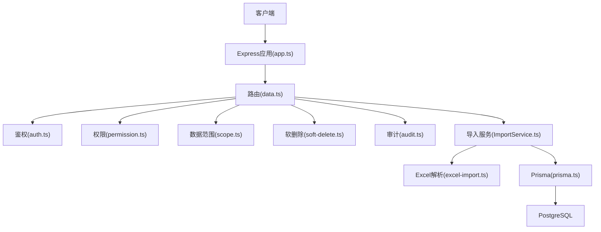
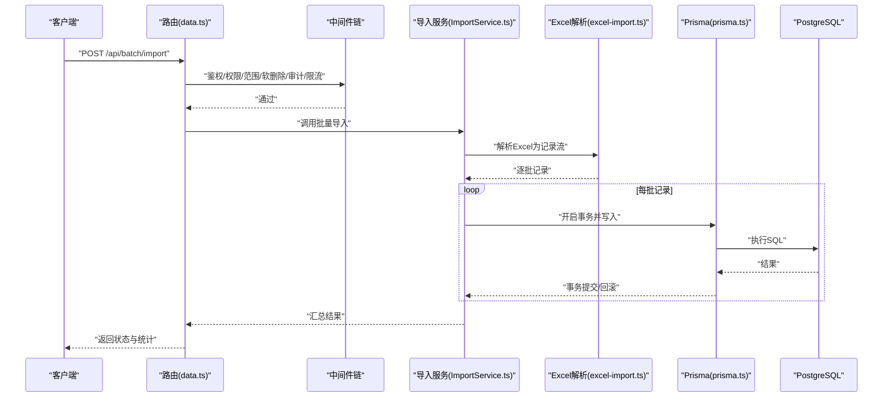
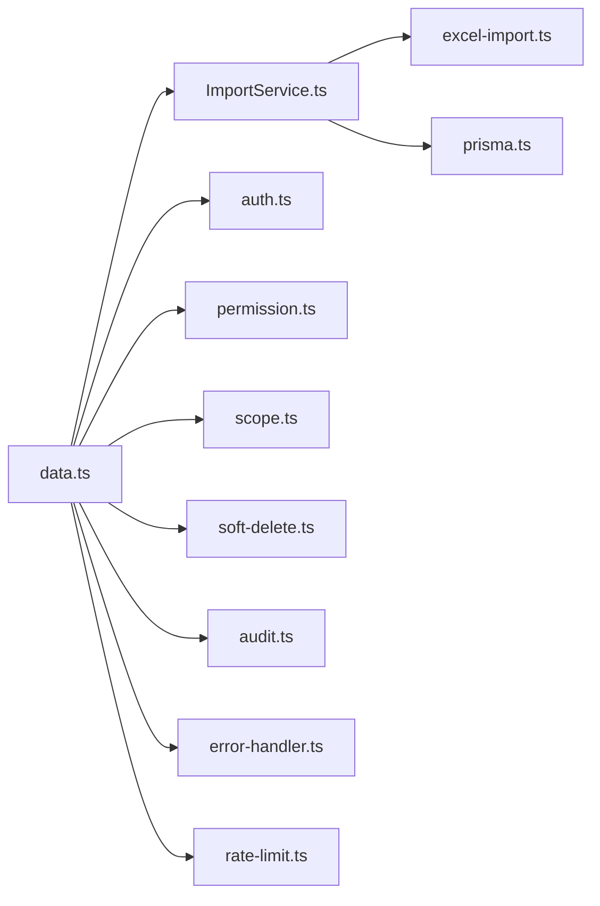

# 批量操作接口

<cite>
**本文引用的文件**   
- [server/src/routes/data.ts](file://server/src/routes/data.ts)
- [server/src/services/ImportService.ts](file://server/src/services/ImportService.ts)
- [server/src/lib/excel-import.ts](file://server/src/lib/excel-import.ts)
- [server/src/middleware/error-handler.ts](file://server/src/middleware/error-handler.ts)
- [server/src/middleware/rate-limit.ts](file://server/src/middleware/rate-limit.ts)
- [server/src/middleware/auth.ts](file://server/src/middleware/auth.ts)
- [server/src/middleware/permission.ts](file://server/src/middleware/permission.ts)
- [server/src/middleware/scope.ts](file://server/src/middleware/scope.ts)
- [server/src/middleware/soft-delete.ts](file://server/src/middleware/soft-delete.ts)
- [server/src/middleware/audit.ts](file://server/src/middleware/audit.ts)
- [server/src/lib/prisma.ts](file://server/src/lib/prisma.ts)
- [server/src/config/env.ts](file://server/src/config/env.ts)
- [server/src/lib/response.ts](file://server/src/lib/response.ts)
- [server/src/app.ts](file://server/src/app.ts)
- [server/src/server.ts](file://server/src/server.ts)
</cite>

## 目录
1. [简介](#简介)
2. [项目结构](#项目结构)
3. [核心组件](#核心组件)
4. [架构总览](#架构总览)
5. [详细组件分析](#详细组件分析)
6. [依赖关系分析](#依赖关系分析)
7. [性能考虑](#性能考虑)
8. [故障排查指南](#故障排查指南)
9. [结论](#结论)
10. [附录](#附录)

## 简介
本文件面向FY200财年经营数据分析平台的“批量操作”能力，聚焦于批量数据导入、更新与删除的HTTP端点、请求格式、事务一致性、并发与分批策略、内存管理、状态监控与错误恢复、冲突处理与回滚策略，以及大文件处理与超时配置。文档同时提供端到端的调用示例与常见问题排查方法，帮助使用者在生产环境中稳定高效地完成大批量数据处理。

## 项目结构
后端采用Express路由与服务分层：
- 路由层：负责HTTP端点定义、参数校验、鉴权与权限控制、限流等中间件编排。
- 服务层：封装业务逻辑（如批量导入、更新、删除），协调Prisma数据库访问。
- 工具库：Excel解析、响应封装、错误处理、审计、软删除等通用能力。
- 配置与环境：环境变量、数据库连接、速率限制等。

图表来源 
- [server/src/app.ts](file://server/src/app.ts)
- [server/src/routes/data.ts](file://server/src/routes/data.ts)
- [server/src/middleware/auth.ts](file://server/src/middleware/auth.ts)
- [server/src/middleware/permission.ts](file://server/src/middleware/permission.ts)
- [server/src/middleware/scope.ts](file://server/src/middleware/scope.ts)
- [server/src/middleware/soft-delete.ts](file://server/src/middleware/soft-delete.ts)
- [server/src/middleware/audit.ts](file://server/src/middleware/audit.ts)
- [server/src/services/ImportService.ts](file://server/src/services/ImportService.ts)
- [server/src/lib/excel-import.ts](file://server/src/lib/excel-import.ts)
- [server/src/lib/prisma.ts](file://server/src/lib/prisma.ts)

章节来源
- [server/src/app.ts](file://server/src/app.ts)
- [server/src/server.ts](file://server/src/server.ts)

## 核心组件
- 批量导入/更新/删除入口：数据路由中提供的批量操作端点，统一由导入服务处理。
- 导入服务：实现批量数据的解析、校验、转换、写入与事务控制。
- Excel解析器：将上传的Excel文件转换为结构化记录，支持分页/分块读取以降低内存占用。
- 中间件链：鉴权、权限、数据范围、软删除、审计、错误处理、限流等。
- 数据库访问：通过Prisma进行事务提交与回滚，确保原子性。

章节来源
- [server/src/routes/data.ts](file://server/src/routes/data.ts)
- [server/src/services/ImportService.ts](file://server/src/services/ImportService.ts)
- [server/src/lib/excel-import.ts](file://server/src/lib/excel-import.ts)
- [server/src/middleware/error-handler.ts](file://server/src/middleware/error-handler.ts)
- [server/src/middleware/rate-limit.ts](file://server/src/middleware/rate-limit.ts)
- [server/src/middleware/auth.ts](file://server/src/middleware/auth.ts)
- [server/src/middleware/permission.ts](file://server/src/middleware/permission.ts)
- [server/src/middleware/scope.ts](file://server/src/middleware/scope.ts)
- [server/src/middleware/soft-delete.ts](file://server/src/middleware/soft-delete.ts)
- [server/src/middleware/audit.ts](file://server/src/middleware/audit.ts)
- [server/src/lib/prisma.ts](file://server/src/lib/prisma.ts)

## 架构总览
批量操作的典型流程如下：
- 客户端发起批量导入/更新/删除请求（表单或JSON）。
- 中间件链依次执行鉴权、权限、范围、软删除、审计、限流。
- 路由将请求委派给导入服务。
- 导入服务解析Excel或JSON，按批次处理，使用Prisma事务保证一致性。
- 成功时返回汇总结果；失败时根据错误类型决定部分回滚或整体回滚。

图表来源 
- [server/src/routes/data.ts](file://server/src/routes/data.ts)
- [server/src/services/ImportService.ts](file://server/src/services/ImportService.ts)
- [server/src/lib/excel-import.ts](file://server/src/lib/excel-import.ts)
- [server/src/lib/prisma.ts](file://server/src/lib/prisma.ts)

## 详细组件分析

### HTTP端点与请求格式
- 批量导入
  - 路径：POST /api/batch/import
  - 内容类型：multipart/form-data（上传Excel）或 application/json（直接JSON数组）
  - 请求体字段（Excel模式）：
    - file：Excel二进制文件
    - sheetName：工作表名称（可选）
    - headers：列头映射（可选）
    - batchSize：批次大小（可选，默认值见配置）
    - concurrency：并发写入数（可选，默认值见配置）
    - conflictPolicy：冲突策略（可选：skip/update/replace）
    - dryRun：是否仅校验不写入（可选）
  - 请求体字段（JSON模式）：
    - records：对象数组，每个对象包含必填字段与可选字段
    - 其他字段同上
  - 响应体：
    - status：success/partial/failure
    - total：总记录数
    - imported：成功导入数
    - updated：成功更新数
    - skipped：跳过数
    - failed：失败数
    - errors：错误明细（可选）

- 批量更新
  - 路径：POST /api/batch/update
  - 内容类型：application/json
  - 请求体字段：
    - filter：过滤条件（用于定位待更新记录）
    - updates：更新字段映射
    - batchSize、concurrency、conflictPolicy、dryRun 同上
  - 响应体：同批量导入

- 批量删除
  - 路径：POST /api/batch/delete
  - 内容类型：application/json
  - 请求体字段：
    - filter：过滤条件（用于定位待删除记录）
    - softDelete：是否软删除（默认true）
    - batchSize、concurrency、dryRun 同上
  - 响应体：同批量导入

章节来源
- [server/src/routes/data.ts](file://server/src/routes/data.ts)
- [server/src/lib/response.ts](file://server/src/lib/response.ts)

### 事务管理与一致性
- 事务边界：导入服务对每一批记录开启数据库事务，确保该批内所有写入要么全部成功，要么全部回滚。
- 跨批一致性：若某批失败，可根据策略选择：
  - 整体回滚：终止后续批次，已提交批次不可逆（需外部补偿）。
  - 部分回滚：仅回滚失败批次，继续处理后续批次，最终返回partial状态。
- 幂等性：建议客户端在重试时携带唯一批次ID，服务端基于唯一键去重，避免重复写入。

章节来源
- [server/src/services/ImportService.ts](file://server/src/services/ImportService.ts)
- [server/src/lib/prisma.ts](file://server/src/lib/prisma.ts)

### 批量处理的性能优化
- 分批处理：
  - 通过batchSize控制每批记录数量，降低单次事务压力与锁竞争。
  - 推荐值：100~1000，视数据量与索引情况调整。
- 并发控制：
  - 通过concurrency控制并行写入任务数，避免数据库连接池耗尽。
  - 推荐值：2~8，结合数据库最大连接数与CPU核数调优。
- 内存管理：
  - Excel解析采用流式/分块读取，避免一次性加载整个文件到内存。
  - 记录对象及时释放引用，防止内存泄漏。
- I/O优化：
  - 使用Prisma批量插入/更新API减少往返次数。
  - 合理设置数据库连接池大小与超时时间。

章节来源
- [server/src/lib/excel-import.ts](file://server/src/lib/excel-import.ts)
- [server/src/services/ImportService.ts](file://server/src/services/ImportService.ts)
- [server/src/lib/prisma.ts](file://server/src/lib/prisma.ts)

### 状态监控与错误恢复
- 状态码：
  - 200：成功或部分成功（partial）
  - 400：请求参数错误
  - 401/403：鉴权/权限失败
  - 429：限流触发
  - 500：服务器内部错误
- 错误恢复：
  - 可重试错误（网络抖动、临时锁等待）：客户端指数退避重试。
  - 不可重试错误（数据校验失败、约束冲突）：修正数据后重新提交。
- 审计与追踪：
  - 每次批量操作生成审计日志，包含用户、时间、批次ID、统计结果。
  - 错误堆栈与上下文信息便于快速定位问题。

章节来源
- [server/src/middleware/error-handler.ts](file://server/src/middleware/error-handler.ts)
- [server/src/middleware/audit.ts](file://server/src/middleware/audit.ts)
- [server/src/middleware/rate-limit.ts](file://server/src/middleware/rate-limit.ts)

### 数据冲突处理与回滚策略
- 冲突策略：
  - skip：遇到冲突记录跳过，计入skipped。
  - update：尝试更新冲突记录，成功计入updated。
  - replace：先删除再插入，可能影响关联数据，需谨慎使用。
- 回滚策略：
  - 单批失败：回滚该批，继续后续批次（partial）。
  - 全局失败：终止处理，回滚已提交批次（需补偿机制）。

章节来源
- [server/src/services/ImportService.ts](file://server/src/services/ImportService.ts)

### 大文件处理与超时配置
- 文件大小限制：
  - 建议在网关或中间件层限制最大文件大小（如50MB）。
  - Excel解析启用流式读取，避免OOM。
- 超时配置：
  - 请求超时：根据数据量设置合理的HTTP超时（如30s~5min）。
  - 数据库超时：设置查询与事务超时，防止长事务阻塞。
  - 连接池超时：避免连接长时间占用。

章节来源
- [server/src/config/env.ts](file://server/src/config/env.ts)
- [server/src/lib/excel-import.ts](file://server/src/lib/excel-import.ts)

### 完整调用示例
- Excel批量导入
  - 使用curl或前端FormData上传file与参数。
  - 示例步骤：
    - 准备Excel文件，确保首行为列头。
    - 设置headers映射列名与字段名。
    - 指定batchSize=500，concurrency=4。
    - 提交请求并监控响应status与errors。
- JSON批量更新
  - 构造records数组，每条记录包含主键与更新字段。
  - 指定filter与updates，执行批量更新。
- JSON批量删除
  - 构造filter定位待删除记录。
  - 指定softDelete=true进行软删除。

章节来源
- [server/src/routes/data.ts](file://server/src/routes/data.ts)
- [server/src/lib/response.ts](file://server/src/lib/response.ts)

## 依赖关系分析

图表来源 
- [server/src/routes/data.ts](file://server/src/routes/data.ts)
- [server/src/services/ImportService.ts](file://server/src/services/ImportService.ts)
- [server/src/lib/excel-import.ts](file://server/src/lib/excel-import.ts)
- [server/src/lib/prisma.ts](file://server/src/lib/prisma.ts)
- [server/src/middleware/auth.ts](file://server/src/middleware/auth.ts)
- [server/src/middleware/permission.ts](file://server/src/middleware/permission.ts)
- [server/src/middleware/scope.ts](file://server/src/middleware/scope.ts)
- [server/src/middleware/soft-delete.ts](file://server/src/middleware/soft-delete.ts)
- [server/src/middleware/audit.ts](file://server/src/middleware/audit.ts)
- [server/src/middleware/error-handler.ts](file://server/src/middleware/error-handler.ts)
- [server/src/middleware/rate-limit.ts](file://server/src/middleware/rate-limit.ts)

章节来源
- [server/src/routes/data.ts](file://server/src/routes/data.ts)
- [server/src/services/ImportService.ts](file://server/src/services/ImportService.ts)

## 性能考虑
- 分批与并发：
  - 根据数据规模与数据库负载动态调整batchSize与concurrency。
  - 监控数据库连接池使用率与慢查询日志。
- 索引与查询：
  - 为高频过滤字段建立索引，提升filter效率。
  - 避免全表扫描与复杂计算在热路径上。
- 内存与GC：
  - 流式解析Excel，及时释放对象引用。
  - 避免在循环中创建大对象。
- 超时与限流：
  - 合理设置HTTP与数据库超时，防止资源被长期占用。
  - 使用限流保护系统免受突发流量冲击。

[本节为通用指导，无需特定文件来源]

## 故障排查指南
- 常见错误与处理：
  - 400参数错误：检查请求体字段与类型，确认必填项齐全。
  - 401/403鉴权失败：确认JWT有效且具备相应权限。
  - 429限流：降低请求频率或申请更高配额。
  - 500服务器错误：查看错误处理器日志与审计记录。
- 调试步骤：
  - 启用dryRun模式验证数据格式与规则。
  - 逐步缩小batchSize与concurrency定位瓶颈。
  - 检查数据库锁与慢查询日志。
- 恢复策略：
  - 针对可重试错误实施指数退避重试。
  - 对于数据冲突，修正数据后重新提交。

章节来源
- [server/src/middleware/error-handler.ts](file://server/src/middleware/error-handler.ts)
- [server/src/middleware/audit.ts](file://server/src/middleware/audit.ts)
- [server/src/middleware/rate-limit.ts](file://server/src/middleware/rate-limit.ts)

## 结论
FY200批量操作接口通过清晰的路由与服务分层、严格的中间件链、健壮的导入服务与Excel解析器，以及Prisma事务保障，实现了高可靠、高性能的大批量数据处理能力。通过合理的分批、并发、内存管理与超时配置，结合完善的错误恢复与审计追踪，可在生产环境中稳定支撑财务数据的批量导入、更新与删除需求。

[本节为总结，无需特定文件来源]

## 附录
- 环境变量参考：
  - DATABASE_URL：数据库连接字符串
  - RATE_LIMIT_WINDOW：限流窗口
  - RATE_LIMIT_MAX：最大请求数
  - EXCEL_MAX_SIZE：Excel最大文件大小
  - BATCH_DEFAULT_SIZE：默认批次大小
  - CONCURRENCY_DEFAULT：默认并发数
- 最佳实践：
  - 始终使用dryRun预验证数据。
  - 为关键业务字段建立唯一索引以避免冲突。
  - 定期清理审计日志与错误记录。

章节来源
- [server/src/config/env.ts](file://server/src/config/env.ts)