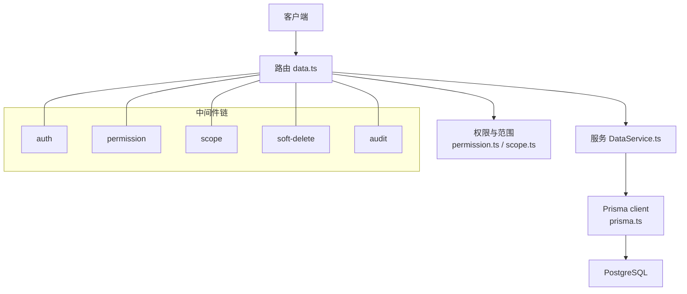
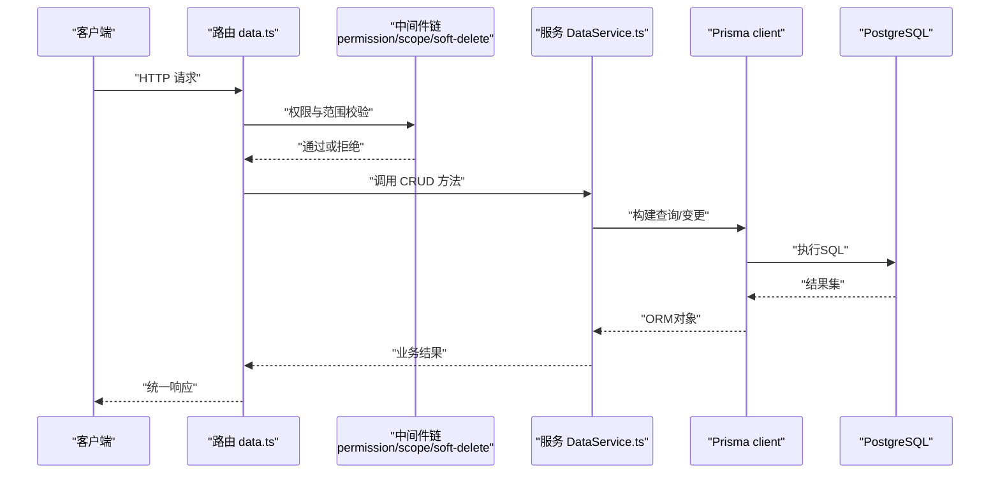
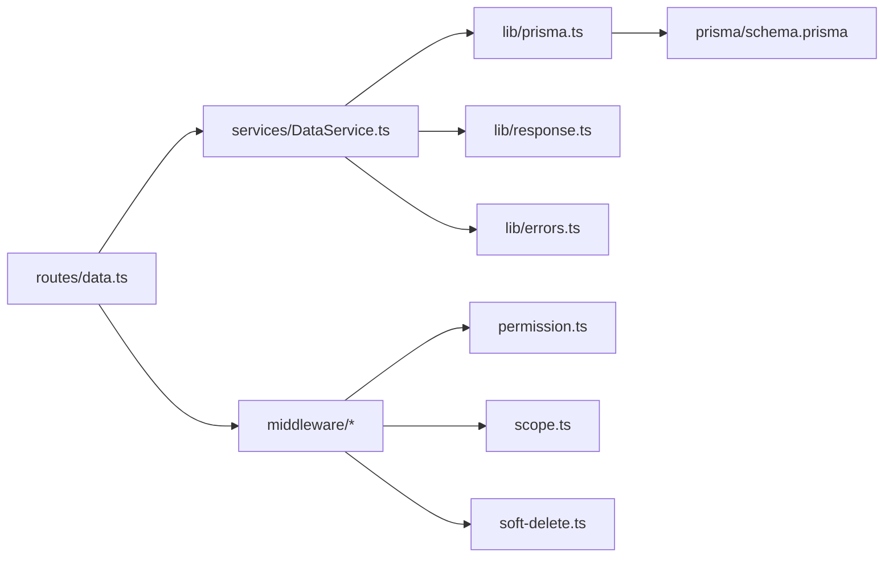

# 数据CRUD接口

<cite>
**本文引用的文件**   
- [server/src/routes/data.ts](file://server/src/routes/data.ts)
- [server/src/services/DataService.ts](file://server/src/services/DataService.ts)
- [server/src/middleware/scope.ts](file://server/src/middleware/scope.ts)
- [server/src/middleware/soft-delete.ts](file://server/src/middleware/soft-delete.ts)
- [server/src/middleware/permission.ts](file://server/src/middleware/permission.ts)
- [server/src/lib/response.ts](file://server/src/lib/response.ts)
- [server/src/lib/errors.ts](file://server/src/lib/errors.ts)
- [server/src/lib/prisma.ts](file://server/src/lib/prisma.ts)
- [server/prisma/schema.prisma](file://server/prisma/schema.prisma)
</cite>

## 目录
1. [简介](#简介)
2. [项目结构](#项目结构)
3. [核心组件](#核心组件)
4. [架构总览](#架构总览)
5. [详细组件分析](#详细组件分析)
6. [依赖关系分析](#依赖关系分析)
7. [性能考虑](#性能考虑)
8. [故障排查指南](#故障排查指南)
9. [结论](#结论)
10. [附录](#附录)

## 简介
本文件为 FY200 财年经营数据分析平台的数据 CRUD 接口文档，覆盖 GET /api/data、POST /api/data、PUT /api/data/:id、DELETE /api/data/:id 等端点。文档重点说明：
- 查询参数支持：分页、排序、过滤
- 批量操作与软删除机制
- 数据范围控制（scope）的实现原理与使用方法
- 数据校验规则、字段映射与业务逻辑验证
- 权限控制与数据隔离机制
- 性能优化建议与大数据量查询最佳实践
- 完整的请求响应示例与错误码说明

后端技术栈与中间件执行链顺序（节选）：Express + Prisma + PostgreSQL；中间件顺序为 helmet → cors → express.json → rate-limit → auth(JWT+黑名单) → permission(默认拒绝) → scope(Prisma extension) → softDelete → audit → Service → Prisma → PostgreSQL。

## 项目结构
数据CRUD相关代码主要位于 server/src 下的 routes、services、middleware 与 prisma schema 中：
- 路由层：server/src/routes/data.ts
- 服务层：server/src/services/DataService.ts
- 中间件：scope、soft-delete、permission、response、errors
- 数据库模型：server/prisma/schema.prisma

图表来源
- [server/src/routes/data.ts](file://server/src/routes/data.ts)
- [server/src/services/DataService.ts](file://server/src/services/DataService.ts)
- [server/src/middleware/scope.ts](file://server/src/middleware/scope.ts)
- [server/src/middleware/soft-delete.ts](file://server/src/middleware/soft-delete.ts)
- [server/src/middleware/permission.ts](file://server/src/middleware/permission.ts)
- [server/src/lib/prisma.ts](file://server/src/lib/prisma.ts)

章节来源
- [server/src/routes/data.ts](file://server/src/routes/data.ts)
- [server/src/services/DataService.ts](file://server/src/services/DataService.ts)
- [server/prisma/schema.prisma](file://server/prisma/schema.prisma)

## 核心组件
- 路由层（data.ts）：定义 REST 端点，解析查询参数，调用服务层方法，统一返回格式。
- 服务层（DataService.ts）：封装增删改查、批量操作、过滤/排序/分页、软删除、范围控制注入等核心业务逻辑。
- 中间件：
  - permission.ts：基于角色的访问控制，默认拒绝，需显式放行。
  - scope.ts：通过 Prisma extension 注入当前用户的数据范围（如公司、组织、指标维度）。
  - soft-delete.ts：将 DELETE 转换为标记 isDeleted=true 的软删除。
- 响应与错误：response.ts 提供统一响应体；errors.ts 定义错误码与异常处理。
- 数据模型：schema.prisma 定义实体、关联、索引与约束。

章节来源
- [server/src/routes/data.ts](file://server/src/routes/data.ts)
- [server/src/services/DataService.ts](file://server/src/services/DataService.ts)
- [server/src/middleware/permission.ts](file://server/src/middleware/permission.ts)
- [server/src/middleware/scope.ts](file://server/src/middleware/scope.ts)
- [server/src/middleware/soft-delete.ts](file://server/src/middleware/soft-delete.ts)
- [server/src/lib/response.ts](file://server/src/lib/response.ts)
- [server/src/lib/errors.ts](file://server/src/lib/errors.ts)
- [server/prisma/schema.prisma](file://server/prisma/schema.prisma)

## 架构总览
数据CRUD的请求生命周期如下：
- 客户端发起 HTTP 请求到 /api/data*
- 路由层解析路径与查询参数，进入中间件链
- 权限校验通过后，scope 中间件通过 Prisma extension 注入 where 条件
- 软删除中间件拦截 DELETE 并转为更新 isDeleted
- 服务层实现具体业务逻辑（校验、计算、聚合、事务）
- Prisma 生成 SQL 并执行于 PostgreSQL
- 统一响应包装与错误码标准化

图表来源
- [server/src/routes/data.ts](file://server/src/routes/data.ts)
- [server/src/services/DataService.ts](file://server/src/services/DataService.ts)
- [server/src/middleware/scope.ts](file://server/src/middleware/scope.ts)
- [server/src/middleware/soft-delete.ts](file://server/src/middleware/soft-delete.ts)
- [server/src/lib/prisma.ts](file://server/src/lib/prisma.ts)

## 详细组件分析

### 路由层：/api/data
- GET /api/data：列表查询，支持分页、排序、过滤、字段选择、导出开关等。
- POST /api/data：新增单条记录，支持批量创建（数组）。
- PUT /api/data/:id：更新指定记录，支持部分更新与批量更新（可选）。
- DELETE /api/data/:id：软删除指定记录，支持批量删除（可选）。

查询参数约定（GET）：
- 分页：page、pageSize（默认值由服务端设定）
- 排序：sortField、sortOrder（asc/desc）
- 过滤：按字段名传递键值对，支持多值与范围查询
- 字段选择：fields（逗号分隔）
- 其他：export（true/false）、format（csv/json）

请求示例（GET）：
- 路径：/api/data?page=1&pageSize=20&sortField=createdAt&sortOrder=desc&status=active&company_id=1
- 响应：包含 data、total、page、pageSize、hasNext、hasPrev 等元信息

请求示例（POST）：
- 请求体：单条对象或对象数组
- 响应：成功返回创建后的记录或记录集合

请求示例（PUT）：
- 路径：/api/data/:id
- 请求体：需要更新的字段
- 响应：返回更新后的记录

请求示例（DELETE）：
- 路径：/api/data/:id
- 响应：返回被软删除的记录（isDeleted=true）

章节来源
- [server/src/routes/data.ts](file://server/src/routes/data.ts)

### 服务层：DataService
职责：
- 接收路由层参数并进行输入校验与规范化
- 组合过滤、排序、分页、字段投影
- 调用 Prisma 进行数据读写
- 处理事务与并发冲突
- 组装统一响应体

关键方法（概念性描述）：
- list(params)：返回列表与分页元信息
- create(payload)：创建单条或批量创建
- update(id, payload)：更新单条或部分更新
- delete(id)：软删除
- batchCreate(items)：批量创建
- batchUpdate(ids, payload)：批量更新
- batchDelete(ids)：批量软删除

章节来源
- [server/src/services/DataService.ts](file://server/src/services/DataService.ts)

### 中间件：权限、范围与软删除
- permission.ts：默认拒绝策略，需在路由中显式授权；支持角色与资源级权限。
- scope.ts：通过 Prisma extension 注入 where 条件，实现数据隔离（如 company_id、org_scope、subject_id）。
- soft-delete.ts：拦截 DELETE，将 isDeleted 标记为 true，并在查询中自动排除已删除记录。

章节来源
- [server/src/middleware/permission.ts](file://server/src/middleware/permission.ts)
- [server/src/middleware/scope.ts](file://server/src/middleware/scope.ts)
- [server/src/middleware/soft-delete.ts](file://server/src/middleware/soft-delete.ts)

### 数据模型与约束
- 实体字段：主键、时间戳、状态、关联外键、审计字段（createdBy、updatedBy）
- 索引：常用查询字段建立复合索引以提升性能
- 约束：唯一性、非空、外键约束
- 软删除：isDeleted 布尔字段，配合中间件与查询扩展

章节来源
- [server/prisma/schema.prisma](file://server/prisma/schema.prisma)

### 数据校验与字段映射
- 输入校验：类型检查、必填项、枚举值、范围限制、正则匹配
- 字段映射：前端字段名与服务端字段名的映射转换
- 业务验证：跨字段一致性、关联存在性、权限范围内的数据有效性

章节来源
- [server/src/services/DataService.ts](file://server/src/services/DataService.ts)
- [server/src/lib/response.ts](file://server/src/lib/response.ts)
- [server/src/lib/errors.ts](file://server/src/lib/errors.ts)

### 权限控制与数据隔离
- 权限模型：基于角色的访问控制（RBAC），默认拒绝，按需放行
- 数据隔离：通过 scope 中间件注入 where 条件，确保用户只能访问其范围内的数据
- 审计追踪：记录操作人、时间、IP、变更前后值（可选）

章节来源
- [server/src/middleware/permission.ts](file://server/src/middleware/permission.ts)
- [server/src/middleware/scope.ts](file://server/src/middleware/scope.ts)
- [server/src/middleware/audit.ts](file://server/src/middleware/audit.ts)

### 软删除机制
- 删除行为：DELETE 不物理删除，而是设置 isDeleted=true
- 查询行为：所有查询自动附加 isDeleted=false 条件
- 恢复功能：可通过专用接口恢复（可选）
- 清理策略：定期清理历史软删除记录（可选）

章节来源
- [server/src/middleware/soft-delete.ts](file://server/src/middleware/soft-delete.ts)
- [server/prisma/schema.prisma](file://server/prisma/schema.prisma)

### 批量操作
- 批量创建：支持数组传入，事务保证一致性
- 批量更新：支持多记录部分更新
- 批量删除：支持多记录软删除
- 错误处理：部分失败时回滚或返回详细错误信息

章节来源
- [server/src/services/DataService.ts](file://server/src/services/DataService.ts)

### 数据范围控制（scope）实现原理
- 原理：通过 Prisma extension 在查询前注入 where 条件
- 使用方式：在中间件中根据当前用户上下文生成范围条件
- 效果：确保数据隔离，防止越权访问

章节来源
- [server/src/middleware/scope.ts](file://server/src/middleware/scope.ts)
- [server/src/lib/prisma.ts](file://server/src/lib/prisma.ts)

## 依赖关系分析

图表来源
- [server/src/routes/data.ts](file://server/src/routes/data.ts)
- [server/src/services/DataService.ts](file://server/src/services/DataService.ts)
- [server/src/middleware/permission.ts](file://server/src/middleware/permission.ts)
- [server/src/middleware/scope.ts](file://server/src/middleware/scope.ts)
- [server/src/middleware/soft-delete.ts](file://server/src/middleware/soft-delete.ts)
- [server/src/lib/prisma.ts](file://server/src/lib/prisma.ts)
- [server/prisma/schema.prisma](file://server/prisma/schema.prisma)
- [server/src/lib/response.ts](file://server/src/lib/response.ts)
- [server/src/lib/errors.ts](file://server/src/lib/errors.ts)

章节来源
- [server/src/routes/data.ts](file://server/src/routes/data.ts)
- [server/src/services/DataService.ts](file://server/src/services/DataService.ts)
- [server/src/middleware/scope.ts](file://server/src/middleware/scope.ts)
- [server/src/middleware/soft-delete.ts](file://server/src/middleware/soft-delete.ts)
- [server/src/middleware/permission.ts](file://server/src/middleware/permission.ts)
- [server/src/lib/prisma.ts](file://server/src/lib/prisma.ts)
- [server/prisma/schema.prisma](file://server/prisma/schema.prisma)
- [server/src/lib/response.ts](file://server/src/lib/response.ts)
- [server/src/lib/errors.ts](file://server/src/lib/errors.ts)

## 性能考虑
- 分页查询：合理设置 pageSize，避免过大页大小导致内存压力
- 索引优化：为常用过滤字段建立索引，复合索引提升排序性能
- 字段投影：仅返回必要字段，减少数据传输量
- 缓存策略：热点数据可引入 Redis 缓存
- 连接池：配置 Prisma 连接池大小，避免数据库连接耗尽
- 异步处理：批量操作使用事务与批处理，减少往返次数
- 监控告警：慢查询日志与性能指标监控

[本节为通用指导，无需特定文件引用]

## 故障排查指南
常见错误与处理：
- 权限不足：检查 permission 中间件配置与用户角色
- 数据范围错误：确认 scope 中间件是否正确注入 where 条件
- 软删除问题：检查 isDeleted 字段与查询扩展
- 数据校验失败：查看 errors.ts 中的错误码与消息
- 数据库连接问题：检查 prisma.ts 配置与数据库状态

章节来源
- [server/src/lib/errors.ts](file://server/src/lib/errors.ts)
- [server/src/lib/response.ts](file://server/src/lib/response.ts)
- [server/src/middleware/permission.ts](file://server/src/middleware/permission.ts)
- [server/src/middleware/scope.ts](file://server/src/middleware/scope.ts)
- [server/src/middleware/soft-delete.ts](file://server/src/middleware/soft-delete.ts)
- [server/src/lib/prisma.ts](file://server/src/lib/prisma.ts)

## 结论
FY200 数据CRUD接口通过清晰的分层架构、严格的权限控制、灵活的范围控制与软删除机制，提供了安全、高效、易用的数据管理能力。遵循本文档的最佳实践，可有效提升系统稳定性与性能。

[本节为总结性内容，无需特定文件引用]

## 附录

### API端点速查表
| 方法 | 路径 | 描述 | 主要参数 | 响应体 |
|------|------|------|----------|--------|
| GET | /api/data | 列表查询 | page, pageSize, sortField, sortOrder, 过滤参数 | {data, total, page, pageSize} |
| POST | /api/data | 新增记录 | 单条对象或数组 | {data} |
| PUT | /api/data/:id | 更新记录 | id, 更新字段 | {data} |
| DELETE | /api/data/:id | 软删除记录 | id | {data} |

### 错误码参考
- 400：请求参数错误
- 401：未认证
- 403：权限不足
- 404：资源不存在
- 409：数据冲突
- 500：服务器内部错误

章节来源
- [server/src/lib/errors.ts](file://server/src/lib/errors.ts)
- [server/src/lib/response.ts](file://server/src/lib/response.ts)