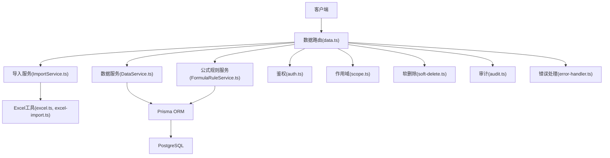
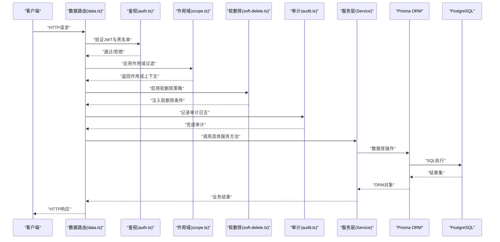
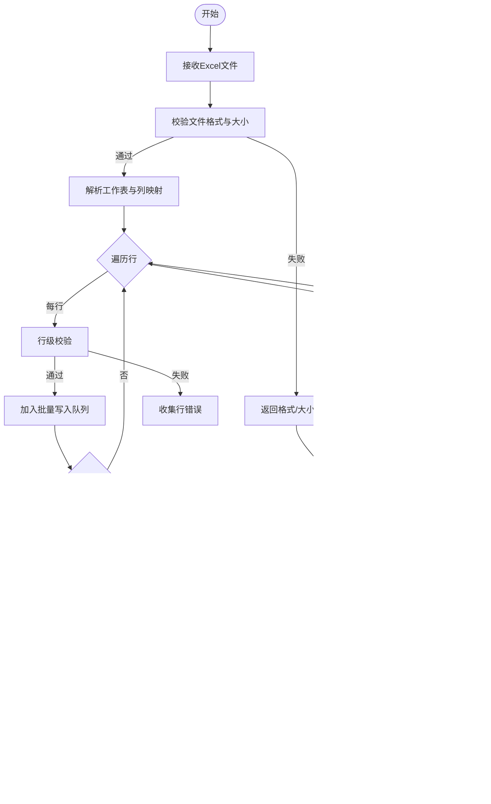
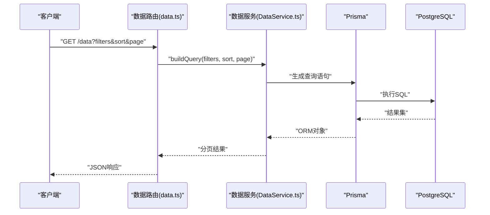
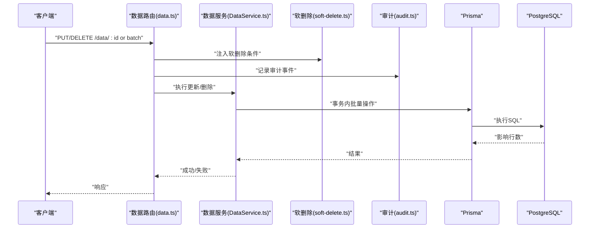
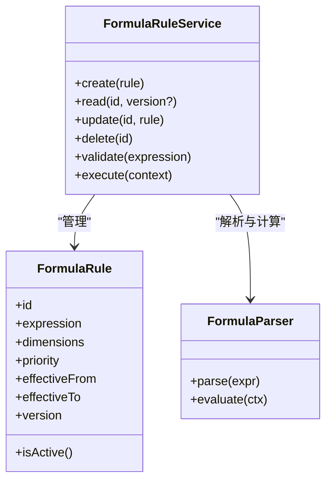
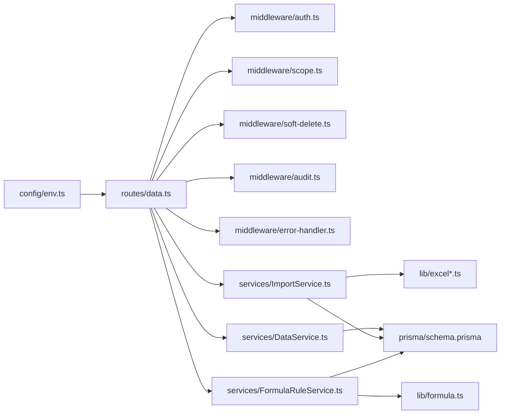

# 数据管理API

<cite>
**本文引用的文件**   
- [server/src/routes/data.ts](file://server/src/routes/data.ts)
- [server/src/services/ImportService.ts](file://server/src/services/ImportService.ts)
- [server/src/lib/excel-import.ts](file://server/src/lib/excel-import.ts)
- [server/src/lib/excel.ts](file://server/src/lib/excel.ts)
- [server/src/services/DataService.ts](file://server/src/services/DataService.ts)
- [server/src/middleware/error-handler.ts](file://server/src/middleware/error-handler.ts)
- [server/src/middleware/auth.ts](file://server/src/middleware/auth.ts)
- [server/src/middleware/scope.ts](file://server/src/middleware/scope.ts)
- [server/src/middleware/soft-delete.ts](file://server/src/middleware/soft-delete.ts)
- [server/src/middleware/audit.ts](file://server/src/middleware/audit.ts)
- [server/src/lib/formula.ts](file://server/src/lib/formula.ts)
- [server/src/services/FormulaRuleService.ts](file://server/src/services/FormulaRuleService.ts)
- [server/prisma/schema.prisma](file://server/prisma/schema.prisma)
- [server/src/config/env.ts](file://server/src/config/env.ts)
</cite>

## 目录
1. [简介](#简介)
2. [项目结构](#项目结构)
3. [核心组件](#核心组件)
4. [架构总览](#架构总览)
5. [详细组件分析](#详细组件分析)
6. [依赖关系分析](#依赖关系分析)
7. [性能考虑](#性能考虑)
8. [故障排查指南](#故障排查指南)
9. [结论](#结论)
10. [附录](#附录)

## 简介
本文件为FY200数据管理模块的完整API文档，覆盖Excel文件上传、数据导入、数据查询、数据更新与删除等接口；说明文件上传格式要求、大小限制与批量处理能力；给出数据校验规则、错误处理与事务管理机制；提供数据导入模板与批量操作最佳实践；详细说明公式规则的CRUD接口与数据版本控制；并包含性能优化建议与大数据量处理注意事项。

## 项目结构
数据管理相关代码主要位于后端服务中：
- 路由层：统一暴露REST API（数据导入、查询、更新、删除、公式规则等）
- 服务层：封装业务逻辑（导入、数据处理、公式规则管理等）
- 工具库：Excel解析、公式解析与安全计算、错误响应等
- 中间件：鉴权、权限、作用域、软删除、审计、错误处理等
- 数据模型：Prisma Schema定义实体与字段

图表来源
- [server/src/routes/data.ts](file://server/src/routes/data.ts)
- [server/src/services/ImportService.ts](file://server/src/services/ImportService.ts)
- [server/src/services/DataService.ts](file://server/src/services/DataService.ts)
- [server/src/services/FormulaRuleService.ts](file://server/src/services/FormulaRuleService.ts)
- [server/src/lib/excel.ts](file://server/src/lib/excel.ts)
- [server/src/lib/excel-import.ts](file://server/src/lib/excel-import.ts)
- [server/src/middleware/auth.ts](file://server/src/middleware/auth.ts)
- [server/src/middleware/scope.ts](file://server/src/middleware/scope.ts)
- [server/src/middleware/soft-delete.ts](file://server/src/middleware/soft-delete.ts)
- [server/src/middleware/audit.ts](file://server/src/middleware/audit.ts)
- [server/src/middleware/error-handler.ts](file://server/src/middleware/error-handler.ts)
- [server/prisma/schema.prisma](file://server/prisma/schema.prisma)

章节来源
- [server/src/routes/data.ts](file://server/src/routes/data.ts)
- [server/src/services/ImportService.ts](file://server/src/services/ImportService.ts)
- [server/src/services/DataService.ts](file://server/src/services/DataService.ts)
- [server/src/services/FormulaRuleService.ts](file://server/src/services/FormulaRuleService.ts)
- [server/src/lib/excel.ts](file://server/src/lib/excel.ts)
- [server/src/lib/excel-import.ts](file://server/src/lib/excel-import.ts)
- [server/src/middleware/auth.ts](file://server/src/middleware/auth.ts)
- [server/src/middleware/scope.ts](file://server/src/middleware/scope.ts)
- [server/src/middleware/soft-delete.ts](file://server/src/middleware/soft-delete.ts)
- [server/src/middleware/audit.ts](file://server/src/middleware/audit.ts)
- [server/src/middleware/error-handler.ts](file://server/src/middleware/error-handler.ts)
- [server/prisma/schema.prisma](file://server/prisma/schema.prisma)

## 核心组件
- 数据路由(data.ts)：集中定义数据导入、查询、更新、删除以及公式规则管理的HTTP端点，串联鉴权、作用域、软删除、审计等中间件。
- 导入服务(ImportService.ts)：负责Excel文件解析、行级校验、批量写入、事务回滚与结果汇总。
- 数据服务(DataService.ts)：封装数据的CRUD、分页、过滤、排序与聚合查询。
- 公式规则服务(FormulaRuleService.ts)：提供公式规则的CRUD、版本管理与执行校验。
- Excel工具(excel.ts, excel-import.ts)：提供工作表读取、列映射、类型转换与批量处理。
- 公式解析(formula.ts)：安全公式解析与计算，仅允许白名单算子。
- 中间件链：auth → permission → scope → softDelete → audit → Service → Prisma → PostgreSQL。

章节来源
- [server/src/routes/data.ts](file://server/src/routes/data.ts)
- [server/src/services/ImportService.ts](file://server/src/services/ImportService.ts)
- [server/src/services/DataService.ts](file://server/src/services/DataService.ts)
- [server/src/services/FormulaRuleService.ts](file://server/src/services/FormulaRuleService.ts)
- [server/src/lib/excel.ts](file://server/src/lib/excel.ts)
- [server/src/lib/excel-import.ts](file://server/src/lib/excel-import.ts)
- [server/src/lib/formula.ts](file://server/src/lib/formula.ts)
- [server/src/middleware/auth.ts](file://server/src/middleware/auth.ts)
- [server/src/middleware/scope.ts](file://server/src/middleware/scope.ts)
- [server/src/middleware/soft-delete.ts](file://server/src/middleware/soft-delete.ts)
- [server/src/middleware/audit.ts](file://server/src/middleware/audit.ts)

## 架构总览
数据管理API的请求处理流程遵循统一的中间件链，确保安全性、可追溯性与一致性。

图表来源
- [server/src/routes/data.ts](file://server/src/routes/data.ts)
- [server/src/middleware/auth.ts](file://server/src/middleware/auth.ts)
- [server/src/middleware/scope.ts](file://server/src/middleware/scope.ts)
- [server/src/middleware/soft-delete.ts](file://server/src/middleware/soft-delete.ts)
- [server/src/middleware/audit.ts](file://server/src/middleware/audit.ts)
- [server/prisma/schema.prisma](file://server/prisma/schema.prisma)

## 详细组件分析

### Excel文件上传与数据导入
- 支持的文件格式：.xlsx/.xls（以实际解析库为准），建议优先使用.xlsx以提升性能与兼容性。
- 文件大小限制：由服务器配置与中间件共同决定，建议在路由或上传中间件中设置上限（例如单文件不超过指定MB）。
- 批量处理能力：按行解析，支持分批写入与事务回滚；失败行可单独记录，不影响成功行提交。
- 数据校验规则：必填字段、数据类型、枚举值、范围约束、唯一性校验、跨行依赖校验等。
- 错误处理：逐行校验失败时返回明细错误列表；整体失败时进行事务回滚并返回错误原因。
- 事务机制：导入过程使用数据库事务，保证原子性；部分失败可配置为“全部回滚”或“跳过失败行继续”。

图表来源
- [server/src/routes/data.ts](file://server/src/routes/data.ts)
- [server/src/services/ImportService.ts](file://server/src/services/ImportService.ts)
- [server/src/lib/excel-import.ts](file://server/src/lib/excel-import.ts)
- [server/src/lib/excel.ts](file://server/src/lib/excel.ts)

章节来源
- [server/src/routes/data.ts](file://server/src/routes/data.ts)
- [server/src/services/ImportService.ts](file://server/src/services/ImportService.ts)
- [server/src/lib/excel-import.ts](file://server/src/lib/excel-import.ts)
- [server/src/lib/excel.ts](file://server/src/lib/excel.ts)

### 数据查询接口
- 分页：支持page、pageSize参数，默认分页大小与最大限制需明确。
- 过滤：支持按维度（如公司、科目、期间）与指标值范围过滤。
- 排序：支持多字段排序，避免无索引排序导致性能问题。
- 聚合：对数值型指标进行求和、平均、计数等聚合，注意单位统一为万元。
- 作用域：基于scope中间件自动注入组织/公司维度过滤条件。

图表来源
- [server/src/routes/data.ts](file://server/src/routes/data.ts)
- [server/src/services/DataService.ts](file://server/src/services/DataService.ts)
- [server/prisma/schema.prisma](file://server/prisma/schema.prisma)

章节来源
- [server/src/routes/data.ts](file://server/src/routes/data.ts)
- [server/src/services/DataService.ts](file://server/src/services/DataService.ts)

### 数据更新与删除接口
- 更新：支持单条与批量更新，需携带必要字段与幂等键；更新前进行权限与作用域校验。
- 删除：采用软删除策略，标记删除状态而非物理删除；支持批量软删除。
- 事务：批量更新/删除在事务内执行，确保一致性。
- 审计：所有变更记录审计日志，便于追踪与回溯。

图表来源
- [server/src/routes/data.ts](file://server/src/routes/data.ts)
- [server/src/services/DataService.ts](file://server/src/services/DataService.ts)
- [server/src/middleware/soft-delete.ts](file://server/src/middleware/soft-delete.ts)
- [server/src/middleware/audit.ts](file://server/src/middleware/audit.ts)
- [server/prisma/schema.prisma](file://server/prisma/schema.prisma)

章节来源
- [server/src/routes/data.ts](file://server/src/routes/data.ts)
- [server/src/services/DataService.ts](file://server/src/services/DataService.ts)
- [server/src/middleware/soft-delete.ts](file://server/src/middleware/soft-delete.ts)
- [server/src/middleware/audit.ts](file://server/src/middleware/audit.ts)

### 公式规则CRUD与版本控制
- CRUD接口：创建、读取、更新、删除公式规则；每条规则包含表达式、适用维度、优先级与生效时间。
- 版本控制：每次更新生成新版本，保留历史版本用于回溯与对比；查询时可指定版本或获取最新有效版本。
- 安全解析：仅允许白名单算子（加减乘除与括号），禁止eval；运行时进行语法与语义校验。
- 执行与缓存：计算类指标实时计算，不存库；必要时引入缓存提升性能。

图表来源
- [server/src/services/FormulaRuleService.ts](file://server/src/services/FormulaRuleService.ts)
- [server/src/lib/formula.ts](file://server/src/lib/formula.ts)
- [server/prisma/schema.prisma](file://server/prisma/schema.prisma)

章节来源
- [server/src/services/FormulaRuleService.ts](file://server/src/services/FormulaRuleService.ts)
- [server/src/lib/formula.ts](file://server/src/lib/formula.ts)
- [server/prisma/schema.prisma](file://server/prisma/schema.prisma)

### 数据导入模板与批量操作最佳实践
- 模板规范：首行为列名映射，第二行起为数据行；必填字段不可为空，日期格式统一为YYYY-MM-DD，金额单位为万元。
- 列映射：支持自定义列名映射，缺失列需提示；重复列名需去重或报错。
- 批量策略：分批次写入（如每批500行），失败行记录错误详情，成功行提交事务。
- 幂等性：导入任务支持幂等键，避免重复导入；同一批次内重复行需去重。
- 进度反馈：长耗时导入应返回任务ID与进度查询接口，前端轮询或SSE推送。

章节来源
- [server/src/services/ImportService.ts](file://server/src/services/ImportService.ts)
- [server/src/lib/excel-import.ts](file://server/src/lib/excel-import.ts)
- [server/src/lib/excel.ts](file://server/src/lib/excel.ts)

## 依赖关系分析
- 路由依赖中间件：鉴权、权限、作用域、软删除、审计、错误处理。
- 服务依赖工具库：Excel解析、公式解析、错误响应。
- 服务依赖ORM：Prisma访问PostgreSQL。
- 环境变量：从env.ts加载配置（如数据库连接、限流、文件大小限制等）。

图表来源
- [server/src/routes/data.ts](file://server/src/routes/data.ts)
- [server/src/middleware/auth.ts](file://server/src/middleware/auth.ts)
- [server/src/middleware/scope.ts](file://server/src/middleware/scope.ts)
- [server/src/middleware/soft-delete.ts](file://server/src/middleware/soft-delete.ts)
- [server/src/middleware/audit.ts](file://server/src/middleware/audit.ts)
- [server/src/middleware/error-handler.ts](file://server/src/middleware/error-handler.ts)
- [server/src/services/ImportService.ts](file://server/src/services/ImportService.ts)
- [server/src/services/DataService.ts](file://server/src/services/DataService.ts)
- [server/src/services/FormulaRuleService.ts](file://server/src/services/FormulaRuleService.ts)
- [server/src/lib/excel.ts](file://server/src/lib/excel.ts)
- [server/src/lib/excel-import.ts](file://server/src/lib/excel-import.ts)
- [server/src/lib/formula.ts](file://server/src/lib/formula.ts)
- [server/prisma/schema.prisma](file://server/prisma/schema.prisma)
- [server/src/config/env.ts](file://server/src/config/env.ts)

章节来源
- [server/src/routes/data.ts](file://server/src/routes/data.ts)
- [server/src/middleware/auth.ts](file://server/src/middleware/auth.ts)
- [server/src/middleware/scope.ts](file://server/src/middleware/scope.ts)
- [server/src/middleware/soft-delete.ts](file://server/src/middleware/soft-delete.ts)
- [server/src/middleware/audit.ts](file://server/src/middleware/audit.ts)
- [server/src/middleware/error-handler.ts](file://server/src/middleware/error-handler.ts)
- [server/src/services/ImportService.ts](file://server/src/services/ImportService.ts)
- [server/src/services/DataService.ts](file://server/src/services/DataService.ts)
- [server/src/services/FormulaRuleService.ts](file://server/src/services/FormulaRuleService.ts)
- [server/src/lib/excel.ts](file://server/src/lib/excel.ts)
- [server/src/lib/excel-import.ts](file://server/src/lib/excel-import.ts)
- [server/src/lib/formula.ts](file://server/src/lib/formula.ts)
- [server/prisma/schema.prisma](file://server/prisma/schema.prisma)
- [server/src/config/env.ts](file://server/src/config/env.ts)

## 性能考虑
- 导入性能：
  - 使用流式解析大文件，避免一次性加载到内存。
  - 分批写入（如500行/批），减少单次事务体积。
  - 预建索引：对常用过滤字段（公司、科目、期间）建立索引。
- 查询性能：
  - 分页与投影：只返回必要字段，避免全表扫描。
  - 排序字段加索引，避免无索引排序。
  - 聚合查询尽量下推到数据库层。
- 公式计算：
  - 缓存热点公式结果，降低重复计算开销。
  - 严格限制算子白名单，避免复杂表达式导致的性能退化。
- 并发与限流：
  - 合理设置rate-limit，防止恶意请求拖垮服务。
  - 长耗时任务异步化，返回任务ID供进度查询。

[本节为通用指导，不直接分析具体文件]

## 故障排查指南
- 常见错误：
  - 文件格式/大小错误：检查上传中间件与路由限制。
  - 列映射失败：核对模板列名与映射配置。
  - 校验失败：查看行级错误明细，定位问题数据。
  - 事务回滚：检查外键约束、唯一约束与业务规则。
- 调试步骤：
  - 启用审计日志，追踪请求链路。
  - 查看错误处理器输出，定位异常堆栈。
  - 检查数据库锁与慢查询日志。
- 恢复策略：
  - 导入失败时保留错误明细，支持重试特定行。
  - 软删除数据可通过恢复接口还原。

章节来源
- [server/src/middleware/error-handler.ts](file://server/src/middleware/error-handler.ts)
- [server/src/middleware/audit.ts](file://server/src/middleware/audit.ts)
- [server/src/middleware/soft-delete.ts](file://server/src/middleware/soft-delete.ts)

## 结论
FY200数据管理模块以Express+Prisma为核心，结合严格的中间件链与事务机制，提供了健壮的Excel导入、数据CRUD与公式规则管理能力。通过分批导入、索引优化与缓存策略，可有效支撑大数据量场景。建议在生产环境完善限流、监控与告警，确保系统稳定与可观测性。

[本节为总结，不直接分析具体文件]

## 附录
- 环境变量关键项：数据库连接、限流阈值、文件大小限制、JWT密钥等，详见配置文件。
- 数据模型字段：参见Prisma Schema，包含实体定义、关系与约束。
- 导入模板示例：参考项目文档中的模板样例，确保列名与格式一致。

章节来源
- [server/src/config/env.ts](file://server/src/config/env.ts)
- [server/prisma/schema.prisma](file://server/prisma/schema.prisma)