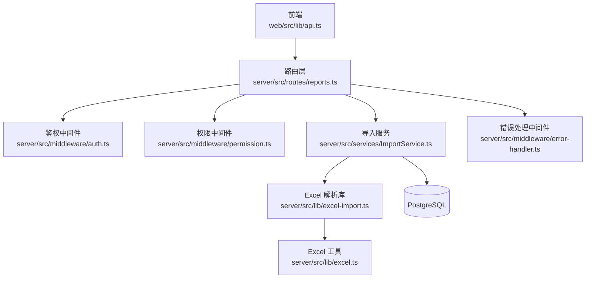
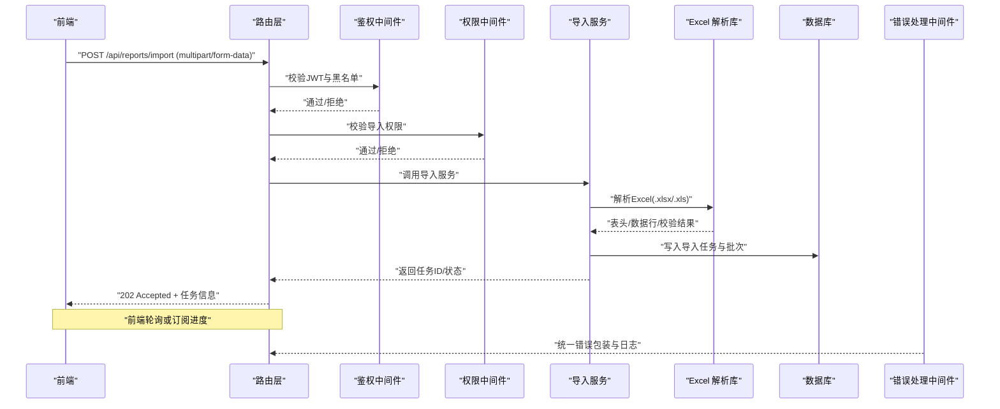
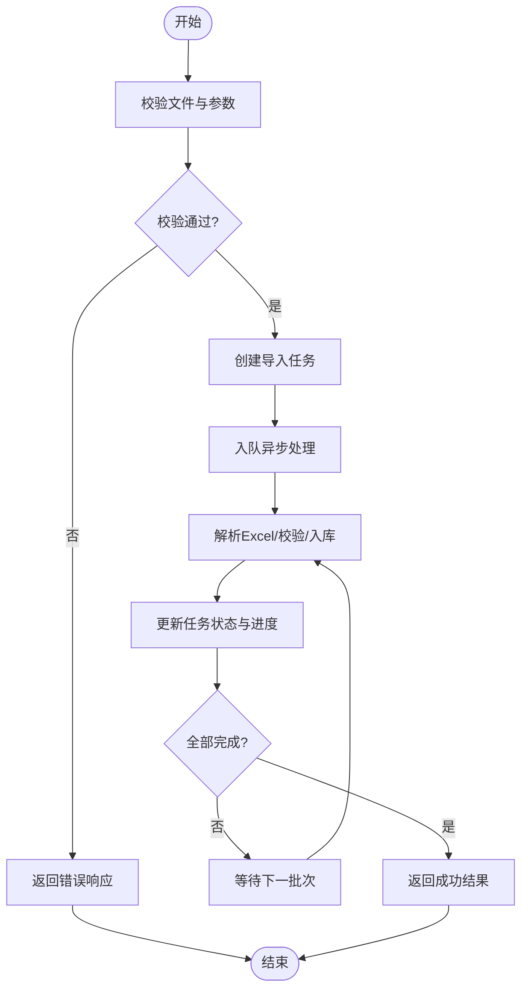
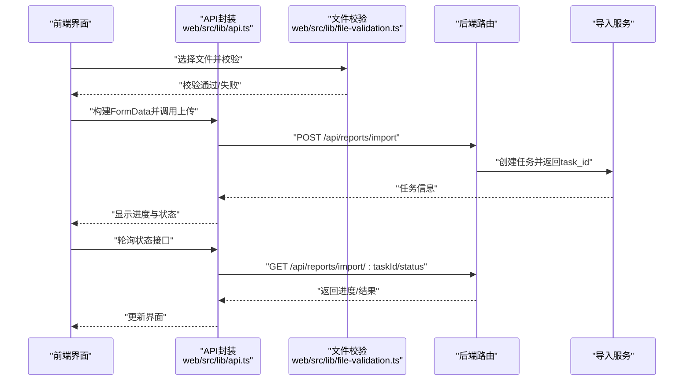

# 文件上传接口

<cite>
**本文引用的文件**   
- [server/src/routes/reports.ts](file://server/src/routes/reports.ts)
- [server/src/services/ImportService.ts](file://server/src/services/ImportService.ts)
- [server/src/lib/excel-import.ts](file://server/src/lib/excel-import.ts)
- [server/src/lib/excel.ts](file://server/src/lib/excel.ts)
- [server/src/middleware/error-handler.ts](file://server/src/middleware/error-handler.ts)
- [server/src/middleware/auth.ts](file://server/src/middleware/auth.ts)
- [server/src/middleware/permission.ts](file://server/src/middleware/permission.ts)
- [server/src/config/env.ts](file://server/src/config/env.ts)
- [web/src/lib/file-validation.ts](file://web/src/lib/file-validation.ts)
- [web/src/lib/api.ts](file://web/src/lib/api.ts)
</cite>

## 目录
1. [简介](#简介)
2. [项目结构](#项目结构)
3. [核心组件](#核心组件)
4. [架构总览](#架构总览)
5. [详细组件分析](#详细组件分析)
6. [依赖关系分析](#依赖关系分析)
7. [性能考虑](#性能考虑)
8. [故障排查指南](#故障排查指南)
9. [结论](#结论)
10. [附录](#附录)

## 简介
本文件为 FY200 项目的“Excel 文件上传”接口文档，聚焦于 Excel 数据导入的 HTTP 端点、请求与响应格式、文件格式与大小限制、批量处理能力、校验与安全策略、错误处理机制、异步处理与进度跟踪，以及前端调用示例与最佳实践。该能力支撑“Excel 进、看板/报表出”的核心业务流，确保财务数据的准确性与可追溯性。

## 项目结构
后端采用 Express + Prisma + PostgreSQL，中间件链顺序固定：helmet → cors → express.json → rate-limit → auth(JWT+黑名单) → permission(默认拒绝) → scope(Prisma extension) → softDelete → audit → Service → Prisma → PostgreSQL。Excel 导入相关代码主要分布在路由层、服务层与工具库中；前端提供文件校验与 API 调用封装。

**图表来源**
- [server/src/routes/reports.ts](file://server/src/routes/reports.ts)
- [server/src/middleware/auth.ts](file://server/src/middleware/auth.ts)
- [server/src/middleware/permission.ts](file://server/src/middleware/permission.ts)
- [server/src/services/ImportService.ts](file://server/src/services/ImportService.ts)
- [server/src/lib/excel-import.ts](file://server/src/lib/excel-import.ts)
- [server/src/lib/excel.ts](file://server/src/lib/excel.ts)
- [server/src/middleware/error-handler.ts](file://server/src/middleware/error-handler.ts)

**章节来源**
- [server/src/routes/reports.ts](file://server/src/routes/reports.ts)
- [server/src/services/ImportService.ts](file://server/src/services/ImportService.ts)
- [server/src/lib/excel-import.ts](file://server/src/lib/excel-import.ts)
- [server/src/lib/excel.ts](file://server/src/lib/excel.ts)
- [server/src/middleware/error-handler.ts](file://server/src/middleware/error-handler.ts)
- [server/src/middleware/auth.ts](file://server/src/middleware/auth.ts)
- [server/src/middleware/permission.ts](file://server/src/middleware/permission.ts)

## 核心组件
- 路由层：定义 Excel 上传的 HTTP 端点，负责接收 multipart/form-data 请求、参数校验、鉴权与权限控制，并委派给服务层处理。
- 服务层（ImportService）：编排导入流程，包括文件落盘或内存读取、格式与内容校验、批量拆分、异步任务调度、结果聚合与状态管理。
- Excel 解析库（excel-import / excel）：统一解析 .xlsx/.xls，提取表头与数据行，进行类型推断、空值处理、公式安全评估等。
- 错误处理中间件：统一捕获异常、格式化错误响应、记录审计日志。
- 鉴权与权限中间件：基于 JWT 的身份认证与基于角色的访问控制（RBAC），默认拒绝未授权访问。
- 配置与环境变量：文件大小限制、允许的 MIME 类型、并发与队列参数等。

**章节来源**
- [server/src/routes/reports.ts](file://server/src/routes/reports.ts)
- [server/src/services/ImportService.ts](file://server/src/services/ImportService.ts)
- [server/src/lib/excel-import.ts](file://server/src/lib/excel-import.ts)
- [server/src/lib/excel.ts](file://server/src/lib/excel.ts)
- [server/src/middleware/error-handler.ts](file://server/src/middleware/error-handler.ts)
- [server/src/middleware/auth.ts](file://server/src/middleware/auth.ts)
- [server/src/middleware/permission.ts](file://server/src/middleware/permission.ts)
- [server/src/config/env.ts](file://server/src/config/env.ts)

## 架构总览
下图展示了从前端发起上传到后端解析入库的完整链路，包含鉴权、权限、解析、异步处理与错误处理的关键节点。

**图表来源**
- [server/src/routes/reports.ts](file://server/src/routes/reports.ts)
- [server/src/middleware/auth.ts](file://server/src/middleware/auth.ts)
- [server/src/middleware/permission.ts](file://server/src/middleware/permission.ts)
- [server/src/services/ImportService.ts](file://server/src/services/ImportService.ts)
- [server/src/lib/excel-import.ts](file://server/src/lib/excel-import.ts)
- [server/src/middleware/error-handler.ts](file://server/src/middleware/error-handler.ts)

## 详细组件分析

### HTTP 端点与请求/响应规范
- 端点：POST /api/reports/import
- 方法：POST
- Content-Type：multipart/form-data
- 表单字段：
  - file：Excel 文件（支持 .xlsx、.xls）
  - sheetName：可选，指定工作表名称（不传则取第一个工作表）
  - dryRun：可选，布尔值，仅校验不入库（用于预览）
  - batchId：可选，用于关联同一批次的多个分片
- 请求体大小限制：默认 10MB（可通过环境变量调整）
- 成功响应（202 Accepted）：
  - task_id：任务标识
  - status：pending/processing/success/failed
  - message：提示信息
  - progress：当前进度（百分比或阶段描述）
- 失败响应（4xx/5xx）：
  - code：错误码
  - message：人类可读的错误说明
  - details：可选，结构化错误详情（如字段级校验失败）

**章节来源**
- [server/src/routes/reports.ts](file://server/src/routes/reports.ts)
- [server/src/config/env.ts](file://server/src/config/env.ts)

### 文件格式与大小限制
- 支持的扩展名：.xlsx、.xls
- 允许的 MIME 类型：application/vnd.openxmlformats-officedocument.spreadsheetml.sheet（.xlsx）、application/vnd.ms-excel（.xls）
- 文件大小限制：默认 10MB，超过将返回“大小超限”错误
- 文件名与路径校验：禁止包含危险字符与路径穿越序列

**章节来源**
- [server/src/lib/excel-import.ts](file://server/src/lib/excel-import.ts)
- [server/src/lib/excel.ts](file://server/src/lib/excel.ts)
- [server/src/config/env.ts](file://server/src/config/env.ts)

### 文件验证规则与安全性
- 基础校验：
  - 扩展名与 MIME 类型一致性检查
  - 文件大小限制
  - 文件是否为空或损坏
- 内容校验：
  - 表头存在性与命名规范
  - 必填列完整性
  - 数据类型推断与转换（数值、日期、文本）
  - 重复行检测与去重策略
  - 公式安全评估（白名单算子，禁止 eval）
- 安全策略：
  - 输入脱敏与转义
  - 资源配额与速率限制
  - 审计日志记录（谁、何时、上传了什么）

**章节来源**
- [server/src/lib/excel-import.ts](file://server/src/lib/excel-import.ts)
- [server/src/lib/excel.ts](file://server/src/lib/excel.ts)
- [server/src/middleware/error-handler.ts](file://server/src/middleware/error-handler.ts)

### 异步处理与进度跟踪
- 异步模型：
  - 路由层立即返回任务 ID 与初始状态
  - 后台任务队列消费并执行解析、校验、入库
- 进度跟踪：
  - GET /api/reports/import/:taskId/status
  - 返回状态、进度百分比、阶段描述、错误堆栈（失败时）
- 批量处理：
  - 支持大文件分片上传与合并
  - 每批次独立校验与入库，失败不影响其他批次
  - 支持断点续传与重试

**图表来源**
- [server/src/services/ImportService.ts](file://server/src/services/ImportService.ts)
- [server/src/lib/excel-import.ts](file://server/src/lib/excel-import.ts)

**章节来源**
- [server/src/services/ImportService.ts](file://server/src/services/ImportService.ts)
- [server/src/lib/excel-import.ts](file://server/src/lib/excel-import.ts)

### 错误处理机制
- 常见错误：
  - 格式错误：不支持的文件类型、损坏的 Excel、表头缺失
  - 大小超限：超过最大允许大小
  - 权限不足：未登录或无导入权限
  - 业务校验失败：必填项缺失、数据类型不匹配、重复行过多
- 错误响应结构：
  - code：错误码（如 FILE_INVALID、SIZE_EXCEEDED、UNAUTHORIZED、VALIDATION_FAILED）
  - message：错误描述
  - details：可选，字段级错误列表
- 日志与审计：
  - 所有错误均记录审计日志，便于追踪与排障

**章节来源**
- [server/src/middleware/error-handler.ts](file://server/src/middleware/error-handler.ts)
- [server/src/middleware/auth.ts](file://server/src/middleware/auth.ts)
- [server/src/middleware/permission.ts](file://server/src/middleware/permission.ts)

### 前端调用示例与最佳实践
- 基本上传：
  - 使用 FormData 构造请求，包含 file、sheetName、dryRun 等字段
  - 设置正确的 Content-Type（multipart/form-data）
- 进度跟踪：
  - 获取 task_id 后轮询状态接口，或实现 SSE/WebSocket 订阅
  - 根据状态展示用户反馈（进行中、成功、失败）
- 错误处理：
  - 区分网络错误与业务错误
  - 对格式错误提示具体字段与修复建议
  - 对权限不足引导用户申请权限或重新登录

**图表来源**
- [web/src/lib/api.ts](file://web/src/lib/api.ts)
- [web/src/lib/file-validation.ts](file://web/src/lib/file-validation.ts)
- [server/src/routes/reports.ts](file://server/src/routes/reports.ts)
- [server/src/services/ImportService.ts](file://server/src/services/ImportService.ts)

**章节来源**
- [web/src/lib/api.ts](file://web/src/lib/api.ts)
- [web/src/lib/file-validation.ts](file://web/src/lib/file-validation.ts)

## 依赖关系分析
- 路由层依赖鉴权与权限中间件，确保只有合法用户具备相应权限才能触发导入流程。
- 服务层依赖 Excel 解析库进行数据提取与校验，并与数据库交互以持久化任务与结果。
- 错误处理中间件位于中间件链末端，统一捕获并格式化所有异常。

**图表来源**
- [server/src/routes/reports.ts](file://server/src/routes/reports.ts)
- [server/src/middleware/auth.ts](file://server/src/middleware/auth.ts)
- [server/src/middleware/permission.ts](file://server/src/middleware/permission.ts)
- [server/src/services/ImportService.ts](file://server/src/services/ImportService.ts)
- [server/src/lib/excel-import.ts](file://server/src/lib/excel-import.ts)
- [server/src/middleware/error-handler.ts](file://server/src/middleware/error-handler.ts)

**章节来源**
- [server/src/routes/reports.ts](file://server/src/routes/reports.ts)
- [server/src/services/ImportService.ts](file://server/src/services/ImportService.ts)
- [server/src/lib/excel-import.ts](file://server/src/lib/excel-import.ts)
- [server/src/middleware/error-handler.ts](file://server/src/middleware/error-handler.ts)

## 性能考虑
- 大文件处理：建议使用分片上传与并行解析，避免阻塞主线程。
- 内存管理：流式解析 Excel，减少内存占用。
- 数据库写入：批量插入与事务控制，提升吞吐并保证一致性。
- 缓存与重试：对失败的批次进行指数退避重试，避免雪崩。

## 故障排查指南
- 常见问题：
  - 文件无法解析：检查扩展名与 MIME 类型是否一致，确认文件未损坏。
  - 大小超限：调整服务器配置或客户端压缩文件。
  - 权限不足：确认用户已登录且具备导入权限。
  - 校验失败：查看 details 中的字段级错误，修正数据后再试。
- 日志定位：
  - 查看错误处理中间件的审计日志，结合 task_id 追踪问题。
  - 前端控制台与网络面板检查请求与响应。

**章节来源**
- [server/src/middleware/error-handler.ts](file://server/src/middleware/error-handler.ts)
- [server/src/middleware/auth.ts](file://server/src/middleware/auth.ts)
- [server/src/middleware/permission.ts](file://server/src/middleware/permission.ts)

## 结论
FY200 的文件上传接口以稳健的中间件链、严格的校验与安全策略、灵活的异步处理与进度跟踪为核心，支撑了“Excel 进、看板/报表出”的业务目标。通过合理的前端调用与错误处理最佳实践，可显著提升用户体验与系统稳定性。

## 附录
- 环境变量参考：
  - MAX_FILE_SIZE：最大文件大小（字节）
  - ALLOWED_MIME_TYPES：允许的 MIME 类型列表
  - QUEUE_CONCURRENCY：并发任务数
- 测试建议：
  - 覆盖正常、边界与异常用例（空文件、超大文件、非法类型、权限不足）
  - 模拟高并发与失败场景，验证重试与回滚机制