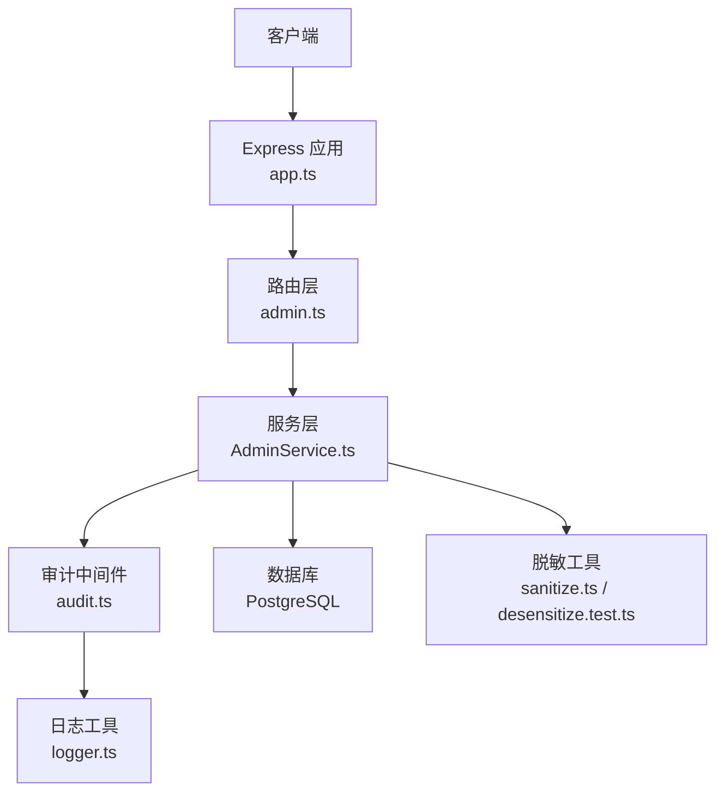
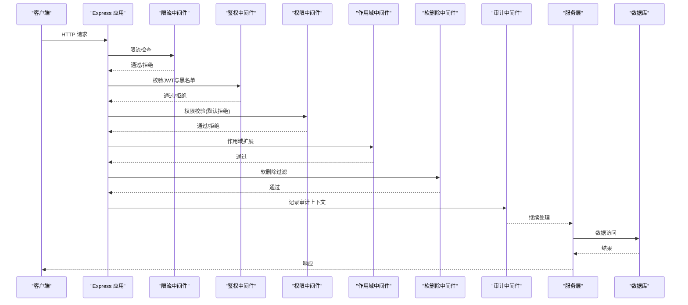
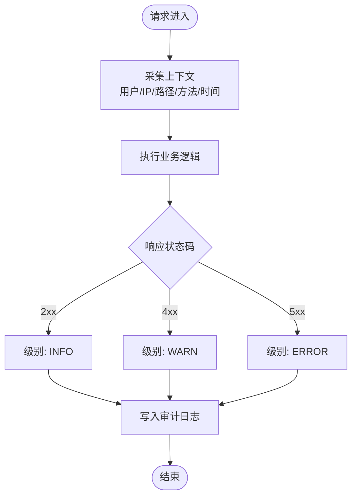
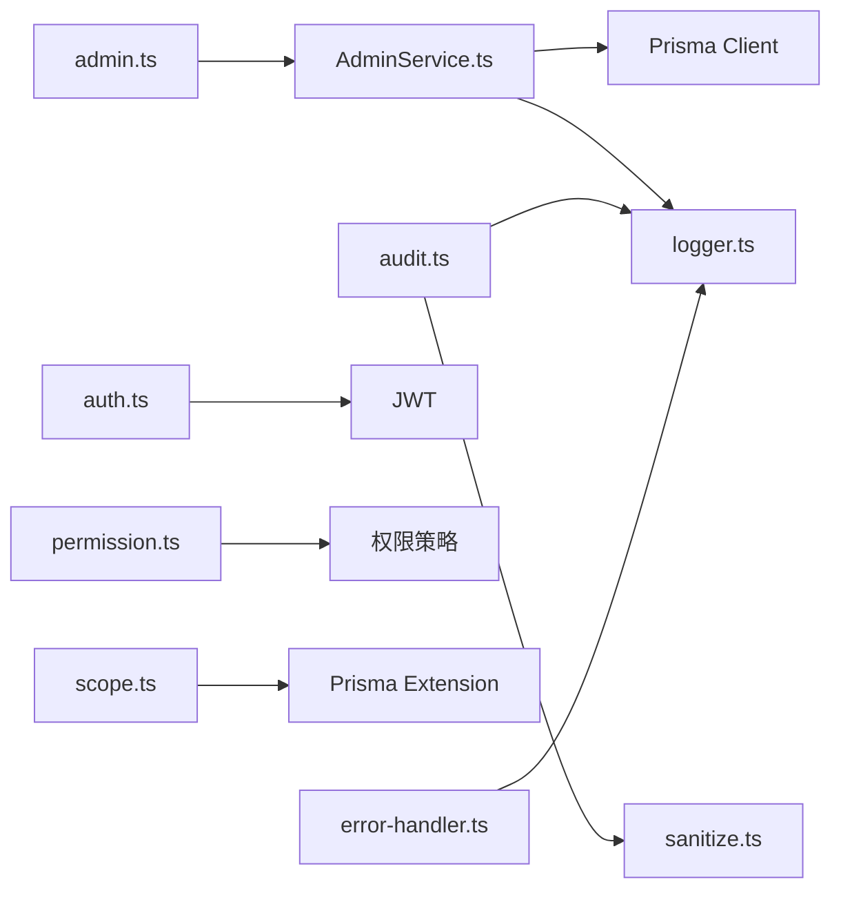

# 审计日志API

<cite>
**本文引用的文件**   
- [server/src/middleware/audit.ts](file://server/src/middleware/audit.ts)
- [server/src/lib/logger.ts](file://server/src/lib/logger.ts)
- [server/src/lib/desensitize.test.ts](file://server/src/lib/desensitize.test.ts)
- [server/src/lib/sanitize.ts](file://server/src/lib/sanitize.ts)
- [server/prisma/schema.prisma](file://server/prisma/schema.prisma)
- [server/prisma/init-audit.sql](file://server/prisma/init-audit.sql)
- [server/src/app.ts](file://server/src/app.ts)
- [server/src/server.ts](file://server/src/server.ts)
- [server/src/middleware/auth.ts](file://server/src/middleware/auth.ts)
- [server/src/middleware/permission.ts](file://server/src/middleware/permission.ts)
- [server/src/middleware/scope.ts](file://server/src/middleware/scope.ts)
- [server/src/middleware/rate-limit.ts](file://server/src/middleware/rate-limit.ts)
- [server/src/middleware/error-handler.ts](file://server/src/middleware/error-handler.ts)
- [server/src/routes/admin.ts](file://server/src/routes/admin.ts)
- [server/src/services/AdminService.ts](file://server/src/services/AdminService.ts)
</cite>

## 目录
1. [简介](#简介)
2. [项目结构](#项目结构)
3. [核心组件](#核心组件)
4. [架构总览](#架构总览)
5. [详细组件分析](#详细组件分析)
6. [依赖关系分析](#依赖关系分析)
7. [性能考量](#性能考量)
8. [故障排查指南](#故障排查指南)
9. [结论](#结论)
10. [附录](#附录)

## 简介
本文件为“审计日志管理”的完整API文档，覆盖操作日志的查询、筛选与导出；定义日志级别（INFO/WARN/ERROR）与内容结构；提供用户操作追踪、系统事件记录与安全审计日志的查询接口；包含日志统计分析、趋势分析与异常告警能力说明；阐述存储策略、归档机制与清理策略；并明确敏感信息脱敏处理与访问权限控制。

后端技术栈：Express 4 + Prisma 5 + PostgreSQL 15 + JWT（access 15min + refresh 7day 轮转）。中间件执行链顺序：helmet → cors → express.json → rate-limit → auth(JWT+黑名单) → permission(默认拒绝) → scope(Prisma extension) → softDelete → audit → Service → Prisma → PostgreSQL。

## 项目结构
审计日志相关代码主要分布在以下位置：
- 中间件层：审计记录、鉴权、权限、范围、限流、错误处理等
- 服务层：管理员与审计相关的业务逻辑
- 数据层：Prisma Schema 与初始化SQL
- 工具层：日志输出、脱敏与清洗
- 应用入口：路由注册与服务启动

图表来源
- [server/src/app.ts](file://server/src/app.ts)
- [server/src/routes/admin.ts](file://server/src/routes/admin.ts)
- [server/src/services/AdminService.ts](file://server/src/services/AdminService.ts)
- [server/src/middleware/audit.ts](file://server/src/middleware/audit.ts)
- [server/src/lib/logger.ts](file://server/src/lib/logger.ts)
- [server/src/lib/sanitize.ts](file://server/src/lib/sanitize.ts)
- [server/src/lib/desensitize.test.ts](file://server/src/lib/desensitize.test.ts)

章节来源
- [server/src/app.ts](file://server/src/app.ts)
- [server/src/server.ts](file://server/src/server.ts)

## 核心组件
- 审计中间件：在请求生命周期中捕获关键上下文（用户、IP、路径、方法、耗时、状态码、错误摘要），按级别写入审计日志。
- 日志工具：统一格式化、分级输出与可选持久化（由上层决定）。
- 脱敏与清洗：对敏感字段进行掩码、区间化或映射替换，确保不泄露隐私。
- 数据模型：通过 Prisma Schema 与初始化SQL定义审计表结构与索引。
- 管理接口：基于管理员权限暴露查询、筛选、导出与分析接口。

章节来源
- [server/src/middleware/audit.ts](file://server/src/middleware/audit.ts)
- [server/src/lib/logger.ts](file://server/src/lib/logger.ts)
- [server/src/lib/sanitize.ts](file://server/src/lib/sanitize.ts)
- [server/src/lib/desensitize.test.ts](file://server/src/lib/desensitize.test.ts)
- [server/prisma/schema.prisma](file://server/prisma/schema.prisma)
- [server/prisma/init-audit.sql](file://server/prisma/init-audit.sql)

## 架构总览
审计日志从请求进入开始，贯穿鉴权、权限、作用域、软删除、审计记录到服务调用与数据库访问的全链路。

图表来源
- [server/src/app.ts](file://server/src/app.ts)
- [server/src/middleware/rate-limit.ts](file://server/src/middleware/rate-limit.ts)
- [server/src/middleware/auth.ts](file://server/src/middleware/auth.ts)
- [server/src/middleware/permission.ts](file://server/src/middleware/permission.ts)
- [server/src/middleware/scope.ts](file://server/src/middleware/scope.ts)
- [server/src/middleware/audit.ts](file://server/src/middleware/audit.ts)

## 详细组件分析

### 审计中间件（audit.ts）
- 职责：在请求进入时采集上下文（用户标识、租户/组织、IP、User-Agent、请求路径与方法、时间戳、TraceId），在响应结束时记录耗时与状态码，并在异常时记录错误摘要。
- 级别判定：根据HTTP状态码与业务错误分类为 INFO/WARN/ERROR。
- 输出：调用日志工具进行格式化与持久化（由上层配置决定）。
- 性能：异步非阻塞记录，避免影响主流程。

图表来源
- [server/src/middleware/audit.ts](file://server/src/middleware/audit.ts)

章节来源
- [server/src/middleware/audit.ts](file://server/src/middleware/audit.ts)

### 日志工具（logger.ts）
- 功能：统一日志格式、分级输出、结构化字段（traceId、userId、action、level、message、meta）。
- 可扩展性：支持控制台输出、文件输出与远程收集（由上层集成）。
- 性能：批量写入与异步落盘，降低IO开销。

章节来源
- [server/src/lib/logger.ts](file://server/src/lib/logger.ts)

### 脱敏与清洗（sanitize.ts / desensitize.test.ts）
- 规则：手机号、邮箱、身份证号、银行卡号、绝对金额等进行掩码或区间化处理；公司名动态映射；URL参数与JSON体中的敏感键值自动清洗。
- 适用场景：审计日志入库前、对外导出前、AI管道输入输出。
- 可配置：白名单字段、映射表、脱敏策略开关。

章节来源
- [server/src/lib/sanitize.ts](file://server/src/lib/sanitize.ts)
- [server/src/lib/desensitize.test.ts](file://server/src/lib/desensitize.test.ts)

### 数据模型与初始化（schema.prisma / init-audit.sql）
- 审计表字段建议：id、trace_id、user_id、tenant_id、ip、user_agent、method、path、status_code、level、action、message、meta(JSON)、created_at。
- 索引：按 created_at、user_id、level、path、trace_id 建立索引以支撑查询与统计。
- 初始化：通过 init-audit.sql 创建表结构与初始索引。

章节来源
- [server/prisma/schema.prisma](file://server/prisma/schema.prisma)
- [server/prisma/init-audit.sql](file://server/prisma/init-audit.sql)

### 管理接口（admin.ts / AdminService.ts）
- 权限：仅管理员角色可访问，默认拒绝策略，需显式授权。
- 能力：
  - 查询列表：支持分页、排序、多条件筛选（时间范围、用户、路径、级别、状态码、关键字）。
  - 详情查看：按ID获取单条审计记录。
  - 导出：CSV/Excel 导出，含脱敏后的数据。
  - 统计：按天/周/月统计各级别数量、Top路径、Top用户、错误率趋势。
  - 告警：阈值触发（如错误率突增、特定用户高频失败）推送通知。

章节来源
- [server/src/routes/admin.ts](file://server/src/routes/admin.ts)
- [server/src/services/AdminService.ts](file://server/src/services/AdminService.ts)

## 依赖关系分析
- 中间件依赖：auth、permission、scope、rate-limit、error-handler 共同保障安全与稳定性。
- 服务依赖：AdminService 依赖 Prisma 与日志工具，审计中间件依赖 logger 与脱敏工具。
- 外部依赖：PostgreSQL、JWT、可选远程日志收集器。

图表来源
- [server/src/routes/admin.ts](file://server/src/routes/admin.ts)
- [server/src/services/AdminService.ts](file://server/src/services/AdminService.ts)
- [server/src/middleware/audit.ts](file://server/src/middleware/audit.ts)
- [server/src/lib/logger.ts](file://server/src/lib/logger.ts)
- [server/src/lib/sanitize.ts](file://server/src/lib/sanitize.ts)
- [server/src/middleware/auth.ts](file://server/src/middleware/auth.ts)
- [server/src/middleware/permission.ts](file://server/src/middleware/permission.ts)
- [server/src/middleware/scope.ts](file://server/src/middleware/scope.ts)
- [server/src/middleware/error-handler.ts](file://server/src/middleware/error-handler.ts)

章节来源
- [server/src/app.ts](file://server/src/app.ts)
- [server/src/server.ts](file://server/src/server.ts)

## 性能考量
- 异步非阻塞：审计记录采用异步写入，避免阻塞主线程。
- 批量落盘：日志工具支持批量写入，减少IO次数。
- 索引优化：为常用查询字段建立复合索引，提升筛选与统计效率。
- 采样策略：高吞吐场景可对低级别日志进行采样，保留关键错误全量记录。
- 脱敏成本：脱敏规则应轻量高效，避免复杂正则与频繁对象拷贝。

[本节为通用指导，无需引用具体文件]

## 故障排查指南
- 常见问题：
  - 审计记录缺失：检查中间件链是否启用、日志工具是否配置正确、数据库连接是否正常。
  - 敏感信息泄露：确认脱敏规则生效、导出前是否再次清洗。
  - 查询缓慢：检查索引是否命中、筛选条件是否合理、分页大小是否过大。
  - 权限不足：确认管理员角色与权限策略配置。
- 定位步骤：
  - 使用 traceId 串联请求链路。
  - 查看错误处理器输出的错误摘要。
  - 核对鉴权与权限中间件的返回。
  - 验证数据库索引与慢查询日志。

章节来源
- [server/src/middleware/error-handler.ts](file://server/src/middleware/error-handler.ts)
- [server/src/middleware/auth.ts](file://server/src/middleware/auth.ts)
- [server/src/middleware/permission.ts](file://server/src/middleware/permission.ts)

## 结论
审计日志体系通过中间件链与工具库协同，实现了全链路可观测、安全可控、高性能的记录与查询能力。结合脱敏、权限与索引优化，既能满足合规要求，又能支撑运营与运维的高效分析。建议在后续迭代中完善告警策略与可视化看板，进一步提升异常发现与处置效率。

[本节为总结，无需引用具体文件]

## 附录

### API 规范（审计日志管理）
- 基础路径：/api/admin/audit
- 认证：JWT（access 15min + refresh 7day 轮转），需管理员角色
- 通用响应：{ code, message, data }

- 查询列表
  - 方法：GET
  - 路径：/api/admin/audit/logs
  - 查询参数：
    - page, pageSize：分页
    - startTime, endTime：时间范围
    - userId：用户ID
    - level：INFO/WARN/ERROR
    - path：请求路径（模糊匹配）
    - statusCode：状态码
    - keyword：关键字（message/meta）
  - 返回：分页结果数组

- 查看详情
  - 方法：GET
  - 路径：/api/admin/audit/logs/:id
  - 返回：单条审计记录

- 导出
  - 方法：GET
  - 路径：/api/admin/audit/logs/export
  - 查询参数：同查询列表
  - 返回：CSV/Excel 二进制流（已脱敏）

- 统计分析
  - 方法：GET
  - 路径：/api/admin/audit/stats
  - 查询参数：
    - granularity：day/week/month
    - startTime, endTime：时间范围
  - 返回：聚合指标（总数、各级别计数、错误率、Top路径、Top用户）

- 趋势分析
  - 方法：GET
  - 路径：/api/admin/audit/trends
  - 查询参数：
    - interval：hour/day/week
    - startTime, endTime：时间范围
  - 返回：时间序列数据（每分钟/每天/每周的错误率、请求量）

- 异常告警
  - 方法：POST
  - 路径：/api/admin/audit/alerts
  - 请求体：{ rule: { metric, threshold, window }, notify: { channel, target } }
  - 返回：告警规则ID与状态

### 日志级别与内容结构
- 级别：
  - INFO：正常业务流程
  - WARN：潜在风险或异常但可恢复
  - ERROR：严重错误或失败
- 内容结构：
  - id：主键
  - traceId：链路追踪ID
  - userId：操作者ID
  - tenantId：租户/组织ID
  - ip：客户端IP
  - userAgent：浏览器/客户端信息
  - method：HTTP方法
  - path：请求路径
  - statusCode：HTTP状态码
  - level：日志级别
  - action：动作描述（如登录、导出、删除）
  - message：人类可读消息
  - meta：结构化元数据（JSON）
  - createdAt：记录时间

### 存储策略、归档与清理
- 存储：PostgreSQL，按表分区（按月）便于归档与清理。
- 归档：将历史数据迁移至冷存储（如对象存储或归档库），保留原始索引。
- 清理：定期删除超过保留期的数据，释放空间。
- 备份：定期快照与异地备份，确保数据安全。

### 敏感信息脱敏与访问权限
- 脱敏：手机号、身份证、银行卡、金额等字段在入库与导出前自动脱敏。
- 权限：仅管理员可访问审计接口，支持细粒度权限控制（按模块/资源）。
- 审计：所有审计接口的访问本身也应被审计，形成闭环。

[本节为补充说明，无需引用具体文件]