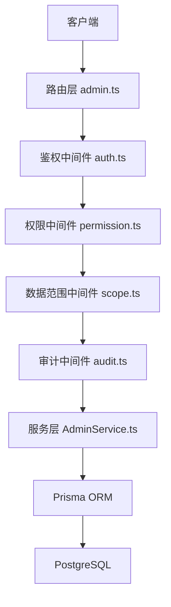
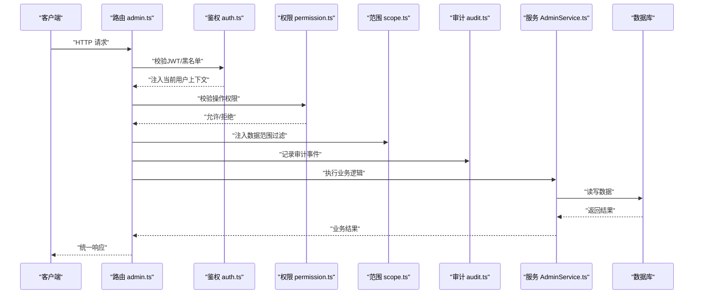
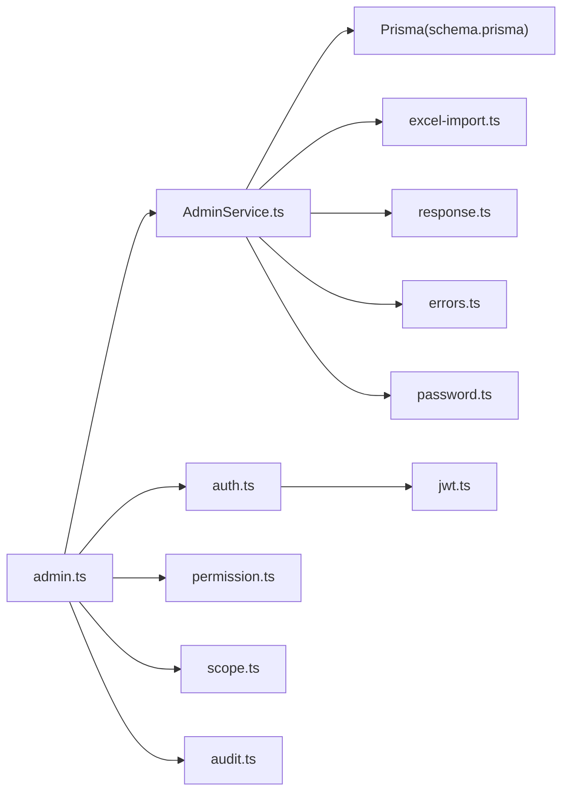

# 用户管理API

<cite>
**本文引用的文件**   
- [server/src/routes/admin.ts](file://server/src/routes/admin.ts)
- [server/src/services/AdminService.ts](file://server/src/services/AdminService.ts)
- [server/src/middleware/auth.ts](file://server/src/middleware/auth.ts)
- [server/src/middleware/permission.ts](file://server/src/middleware/permission.ts)
- [server/src/middleware/scope.ts](file://server/src/middleware/scope.ts)
- [server/src/middleware/audit.ts](file://server/src/middleware/audit.ts)
- [server/src/lib/jwt.ts](file://server/src/lib/jwt.ts)
- [server/src/lib/password.ts](file://server/src/lib/password.ts)
- [server/src/lib/excel-import.ts](file://server/src/lib/excel-import.ts)
- [server/src/lib/response.ts](file://server/src/lib/response.ts)
- [server/src/lib/errors.ts](file://server/src/lib/errors.ts)
- [server/prisma/schema.prisma](file://server/prisma/schema.prisma)
</cite>

## 目录
1. [简介](#简介)
2. [项目结构](#项目结构)
3. [核心组件](#核心组件)
4. [架构总览](#架构总览)
5. [详细组件分析](#详细组件分析)
6. [依赖分析](#依赖分析)
7. [性能考虑](#性能考虑)
8. [故障排查指南](#故障排查指南)
9. [结论](#结论)
10. [附录](#附录)

## 简介
本文件为“用户管理API”的权威文档，覆盖用户CRUD、状态管理（启用/禁用）、密码重置、角色分配、批量操作与导入导出、搜索过滤分页、权限继承与数据范围控制、审计日志与安全验证等。后端采用 Express + Prisma + PostgreSQL，认证使用JWT（access短期+refresh长期轮转），中间件链顺序严格：helmet → cors → express.json → rate-limit → auth(JWT+黑名单) → permission(默认拒绝) → scope(Prisma extension) → softDelete → audit → Service → Prisma → PostgreSQL。

## 项目结构
用户管理相关代码主要分布在以下位置：
- 路由层：admin.ts（管理员接口入口）
- 服务层：AdminService.ts（用户业务逻辑）
- 中间件：auth.ts、permission.ts、scope.ts、audit.ts（鉴权、授权、数据范围、审计）
- 工具库：jwt.ts、password.ts、excel-import.ts、response.ts、errors.ts
- 数据模型：schema.prisma（用户、角色、组织、审计等表结构）

图表来源
- [server/src/routes/admin.ts](file://server/src/routes/admin.ts)
- [server/src/middleware/auth.ts](file://server/src/middleware/auth.ts)
- [server/src/middleware/permission.ts](file://server/src/middleware/permission.ts)
- [server/src/middleware/scope.ts](file://server/src/middleware/scope.ts)
- [server/src/middleware/audit.ts](file://server/src/middleware/audit.ts)
- [server/src/services/AdminService.ts](file://server/src/services/AdminService.ts)
- [server/prisma/schema.prisma](file://server/prisma/schema.prisma)

章节来源
- [server/src/routes/admin.ts](file://server/src/routes/admin.ts)
- [server/src/services/AdminService.ts](file://server/src/services/AdminService.ts)
- [server/prisma/schema.prisma](file://server/prisma/schema.prisma)

## 核心组件
- 路由层（admin.ts）
  - 暴露用户管理的REST端点：创建、更新、删除、查询、批量操作、导入导出、状态切换、密码重置、角色分配等。
  - 统一错误响应格式与分页封装。
- 服务层（AdminService.ts）
  - 实现用户CRUD、状态管理、密码重置、角色分配、批量导入/导出、搜索过滤分页、权限继承与数据范围计算。
  - 调用Prisma进行数据访问，并记录审计事件。
- 中间件
  - auth.ts：JWT校验、黑名单检查、上下文注入（当前用户）。
  - permission.ts：基于角色的权限判定（默认拒绝，显式放行）。
  - scope.ts：通过Prisma扩展注入数据范围（如按组织/公司隔离）。
  - audit.ts：记录关键操作的审计日志（谁、何时、做了什么、影响范围）。
- 工具库
  - jwt.ts：签发/校验JWT、刷新令牌轮转。
  - password.ts：密码哈希与校验。
  - excel-import.ts：Excel导入解析与校验。
  - response.ts：统一响应包装。
  - errors.ts：标准化错误类型与消息。
- 数据模型（schema.prisma）
  - 用户、角色、组织、审计日志等实体定义及关系。

章节来源
- [server/src/routes/admin.ts](file://server/src/routes/admin.ts)
- [server/src/services/AdminService.ts](file://server/src/services/AdminService.ts)
- [server/src/middleware/auth.ts](file://server/src/middleware/auth.ts)
- [server/src/middleware/permission.ts](file://server/src/middleware/permission.ts)
- [server/src/middleware/scope.ts](file://server/src/middleware/scope.ts)
- [server/src/middleware/audit.ts](file://server/src/middleware/audit.ts)
- [server/src/lib/jwt.ts](file://server/src/lib/jwt.ts)
- [server/src/lib/password.ts](file://server/src/lib/password.ts)
- [server/src/lib/excel-import.ts](file://server/src/lib/excel-import.ts)
- [server/src/lib/response.ts](file://server/src/lib/response.ts)
- [server/src/lib/errors.ts](file://server/src/lib/errors.ts)
- [server/prisma/schema.prisma](file://server/prisma/schema.prisma)

## 架构总览
用户管理请求的典型处理流程如下：

图表来源
- [server/src/routes/admin.ts](file://server/src/routes/admin.ts)
- [server/src/middleware/auth.ts](file://server/src/middleware/auth.ts)
- [server/src/middleware/permission.ts](file://server/src/middleware/permission.ts)
- [server/src/middleware/scope.ts](file://server/src/middleware/scope.ts)
- [server/src/middleware/audit.ts](file://server/src/middleware/audit.ts)
- [server/src/services/AdminService.ts](file://server/src/services/AdminService.ts)

## 详细组件分析

### 用户CRUD接口
- 创建用户
  - 方法/路径：POST /api/admin/users
  - 功能：创建新用户，设置基础信息、初始角色、组织归属、状态（默认启用或禁用）。
  - 输入校验：必填字段、邮箱唯一性、密码强度。
  - 输出：用户对象（不含敏感字段）。
  - 权限：需要管理员角色或特定用户管理权限。
  - 审计：记录创建事件（操作人、时间、目标用户ID）。
- 更新用户
  - 方法/路径：PUT /api/admin/users/:id
  - 功能：更新用户基本信息、角色、组织、状态等。
  - 输入校验：字段合法性、变更冲突检测。
  - 输出：更新后的用户对象。
  - 权限：需具备修改用户权限。
  - 审计：记录变更前后差异。
- 删除用户
  - 方法/路径：DELETE /api/admin/users/:id
  - 功能：软删除用户（保留审计轨迹）。
  - 权限：需具备删除用户权限。
  - 审计：记录删除事件。
- 查询用户
  - 方法/路径：GET /api/admin/users
  - 功能：支持搜索、过滤、排序、分页。
  - 参数：关键词、角色、组织、状态、页码、每页条数。
  - 输出：分页结果（列表+总数）。
  - 权限：需具备查看用户权限。
  - 审计：记录查询行为（可选）。

章节来源
- [server/src/routes/admin.ts](file://server/src/routes/admin.ts)
- [server/src/services/AdminService.ts](file://server/src/services/AdminService.ts)
- [server/src/lib/response.ts](file://server/src/lib/response.ts)
- [server/src/lib/errors.ts](file://server/src/lib/errors.ts)

### 用户状态管理（启用/禁用）
- 切换状态
  - 方法/路径：PATCH /api/admin/users/:id/status
  - 功能：将用户状态在“启用/禁用”之间切换。
  - 权限：需具备用户状态管理权限。
  - 审计：记录状态变更原因与操作人。
- 批量状态切换
  - 方法/路径：PATCH /api/admin/users/batch/status
  - 功能：对多个用户同时启用或禁用。
  - 输入：用户ID列表与目标状态。
  - 权限：同单条状态切换。
  - 审计：记录批量操作摘要。

章节来源
- [server/src/routes/admin.ts](file://server/src/routes/admin.ts)
- [server/src/services/AdminService.ts](file://server/src/services/AdminService.ts)
- [server/src/middleware/audit.ts](file://server/src/middleware/audit.ts)

### 密码重置
- 强制重置
  - 方法/路径：POST /api/admin/users/:id/reset-password
  - 功能：管理员为用户生成一次性重置链接或临时密码。
  - 安全：重置链接有效期短，使用后失效；临时密码首次登录强制修改。
  - 权限：需具备密码重置权限。
  - 审计：记录重置触发人与原因。
- 用户自助重置
  - 方法/路径：POST /api/auth/reset-password
  - 功能：用户凭邮箱验证码完成密码重置。
  - 安全：验证码时效、频率限制、IP限流。
  - 审计：记录重置尝试与成功事件。

章节来源
- [server/src/routes/auth.ts](file://server/src/routes/auth.ts)
- [server/src/services/AuthService.ts](file://server/src/services/AuthService.ts)
- [server/src/lib/password.ts](file://server/src/lib/password.ts)
- [server/src/middleware/rate-limit.ts](file://server/src/middleware/rate-limit.ts)

### 用户角色分配
- 分配/移除角色
  - 方法/路径：PUT /api/admin/users/:id/roles
  - 功能：为用户添加或移除角色。
  - 权限：需具备角色管理权限。
  - 审计：记录角色变更详情。
- 角色继承机制
  - 说明：用户最终权限由直接角色与所属组织/公司的角色继承组合决定；系统提供权限合并策略（去重、优先级）。
  - 数据范围：结合scope中间件，按组织/公司维度过滤可访问数据。

章节来源
- [server/src/services/AdminService.ts](file://server/src/services/AdminService.ts)
- [server/src/middleware/scope.ts](file://server/src/middleware/scope.ts)
- [server/prisma/schema.prisma](file://server/prisma/schema.prisma)

### 批量用户操作与导入导出
- 批量操作
  - 方法/路径：POST /api/admin/users/batch
  - 功能：批量创建、更新、删除、状态切换等。
  - 输入：JSON数组，包含每条操作的目标与参数。
  - 事务：批量操作尽量在同一事务中执行，保证一致性。
  - 审计：记录批次ID、操作摘要、失败明细。
- 导入用户
  - 方法/路径：POST /api/admin/users/import
  - 功能：上传Excel文件，解析并导入用户数据。
  - 校验：模板校验、重复检测、必填项校验、角色映射。
  - 输出：导入结果（成功/失败统计与错误明细）。
  - 审计：记录导入批次与结果。
- 导出用户
  - 方法/路径：GET /api/admin/users/export
  - 功能：根据筛选条件导出用户列表为Excel。
  - 权限：需具备导出权限。
  - 审计：记录导出条件与操作人。

章节来源
- [server/src/routes/admin.ts](file://server/src/routes/admin.ts)
- [server/src/services/AdminService.ts](file://server/src/services/AdminService.ts)
- [server/src/lib/excel-import.ts](file://server/src/lib/excel-import.ts)
- [server/src/middleware/audit.ts](file://server/src/middleware/audit.ts)

### 用户搜索、过滤与分页
- 搜索与过滤
  - 参数：用户名/邮箱模糊匹配、角色、组织、状态、创建时间范围等。
  - 排序：支持按创建时间、更新时间、名称等字段排序。
  - 分页：page、pageSize，返回total与list。
- 性能优化
  - 索引：对用户常用查询字段建立索引（邮箱、组织ID、状态等）。
  - 缓存：热点查询可引入Redis缓存（可选）。
  - 分页：避免深分页，推荐游标分页（可选）。

章节来源
- [server/src/services/AdminService.ts](file://server/src/services/AdminService.ts)
- [server/prisma/schema.prisma](file://server/prisma/schema.prisma)

### 权限继承机制与数据范围控制
- 权限继承
  - 用户直接角色与组织/公司角色合并，遵循优先级规则（更具体的角色优先）。
  - 权限粒度：菜单、按钮、数据操作（读/写/删/导出）。
- 数据范围
  - 通过scope中间件注入Prisma扩展，自动附加WHERE条件（如org_id、company_id）。
  - 支持跨组织数据可见性配置（如上级组织可见下级数据）。

章节来源
- [server/src/middleware/scope.ts](file://server/src/middleware/scope.ts)
- [server/src/middleware/permission.ts](file://server/src/middleware/permission.ts)
- [server/prisma/schema.prisma](file://server/prisma/schema.prisma)

### 审计日志与安全验证
- 审计日志
  - 记录内容：操作人、时间、IP、动作、资源ID、变更前后值、结果。
  - 存储：独立审计表，支持检索与导出。
  - 脱敏：敏感字段（如密码、手机号）脱敏展示。
- 安全验证
  - JWT：access短期、refresh长期轮转；黑名单拦截已注销会话。
  - 密码：强哈希算法，禁止明文存储。
  - 限流：接口级限流，防止暴力破解与滥用。
  - CORS/Helmet：浏览器安全头与跨域策略。

章节来源
- [server/src/middleware/audit.ts](file://server/src/middleware/audit.ts)
- [server/src/middleware/auth.ts](file://server/src/middleware/auth.ts)
- [server/src/lib/jwt.ts](file://server/src/lib/jwt.ts)
- [server/src/lib/password.ts](file://server/src/lib/password.ts)
- [server/src/middleware/cors.ts](file://server/src/middleware/cors.ts)
- [server/src/middleware/helmet.ts](file://server/src/middleware/helmet.ts)
- [server/src/middleware/rate-limit.ts](file://server/src/middleware/rate-limit.ts)

## 依赖分析
用户管理模块的关键依赖关系如下：

图表来源
- [server/src/routes/admin.ts](file://server/src/routes/admin.ts)
- [server/src/services/AdminService.ts](file://server/src/services/AdminService.ts)
- [server/src/middleware/auth.ts](file://server/src/middleware/auth.ts)
- [server/src/middleware/permission.ts](file://server/src/middleware/permission.ts)
- [server/src/middleware/scope.ts](file://server/src/middleware/scope.ts)
- [server/src/middleware/audit.ts](file://server/src/middleware/audit.ts)
- [server/src/lib/jwt.ts](file://server/src/lib/jwt.ts)
- [server/src/lib/password.ts](file://server/src/lib/password.ts)
- [server/src/lib/excel-import.ts](file://server/src/lib/excel-import.ts)
- [server/src/lib/response.ts](file://server/src/lib/response.ts)
- [server/src/lib/errors.ts](file://server/src/lib/errors.ts)
- [server/prisma/schema.prisma](file://server/prisma/schema.prisma)

章节来源
- [server/src/routes/admin.ts](file://server/src/routes/admin.ts)
- [server/src/services/AdminService.ts](file://server/src/services/AdminService.ts)
- [server/prisma/schema.prisma](file://server/prisma/schema.prisma)

## 性能考虑
- 数据库层面
  - 为高频查询字段建立索引（邮箱、组织ID、状态、创建时间）。
  - 避免N+1查询，使用Prisma关联预加载。
  - 分页查询建议使用limit/offset或游标分页。
- 应用层面
  - 批量操作使用事务减少往返次数。
  - 导入导出采用流式处理，避免内存峰值过高。
  - 热点数据可引入缓存（如Redis），注意失效策略。
- 安全与稳定性
  - 接口限流与熔断保护。
  - 大文件导入分片与重试机制。

[本节为通用指导，不直接分析具体文件]

## 故障排查指南
- 常见问题
  - 权限不足：检查permission中间件配置与用户角色。
  - 数据不可见：确认scope中间件的数据范围是否正确注入。
  - 导入失败：核对Excel模板、必填字段、角色映射。
  - 密码重置失败：检查验证码有效性、限流策略、邮箱服务。
- 调试建议
  - 开启审计日志，定位操作链路。
  - 使用统一错误响应格式，快速定位错误码与消息。
  - 检查JWT黑名单与刷新令牌轮转状态。

章节来源
- [server/src/middleware/permission.ts](file://server/src/middleware/permission.ts)
- [server/src/middleware/scope.ts](file://server/src/middleware/scope.ts)
- [server/src/lib/excel-import.ts](file://server/src/lib/excel-import.ts)
- [server/src/lib/response.ts](file://server/src/lib/response.ts)
- [server/src/lib/errors.ts](file://server/src/lib/errors.ts)
- [server/src/middleware/audit.ts](file://server/src/middleware/audit.ts)

## 结论
用户管理API围绕Express路由与Prisma服务构建，通过严格的中间件链保障鉴权、授权、数据范围与审计。覆盖CRUD、状态管理、密码重置、角色分配、批量操作与导入导出、搜索过滤分页、权限继承与数据范围控制等核心能力。建议在高频场景下进一步优化索引与缓存策略，确保系统在高并发下的稳定与性能。

[本节为总结性内容，不直接分析具体文件]

## 附录
- 术语说明
  - 数据范围：按组织/公司维度限制用户可访问的数据集合。
  - 权限继承：用户直接角色与组织/公司角色合并后的最终权限。
  - 审计日志：记录关键操作的完整轨迹，用于合规与问题定位。
- 最佳实践
  - 所有用户操作必须经过权限校验与审计记录。
  - 批量操作使用事务保证一致性。
  - 导入导出遵循模板规范与错误反馈机制。

[本节为补充说明，不直接分析具体文件]