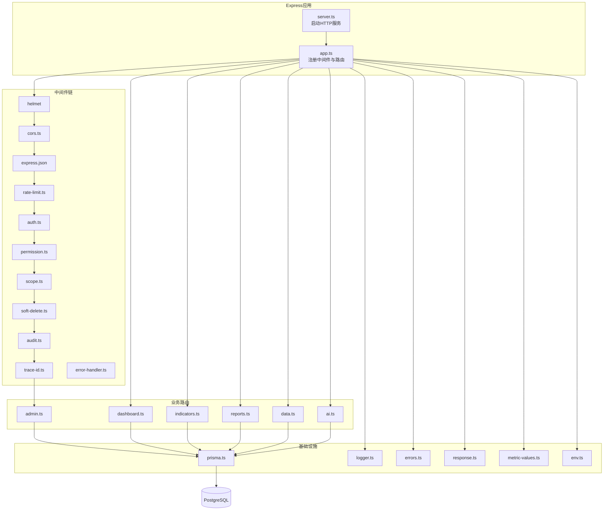
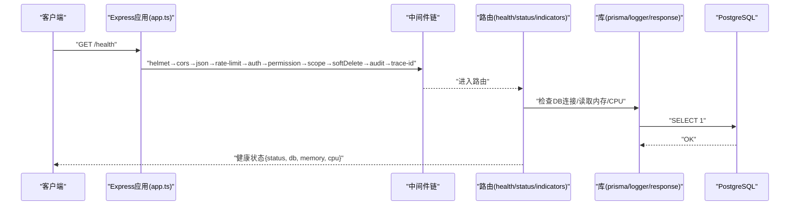
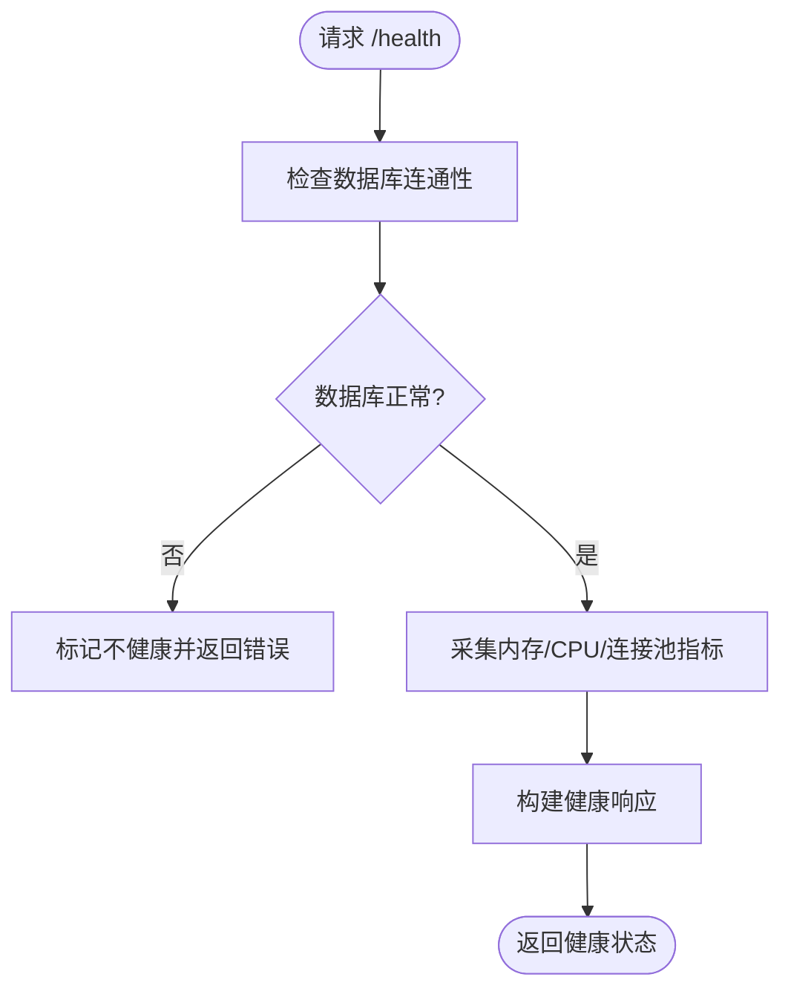
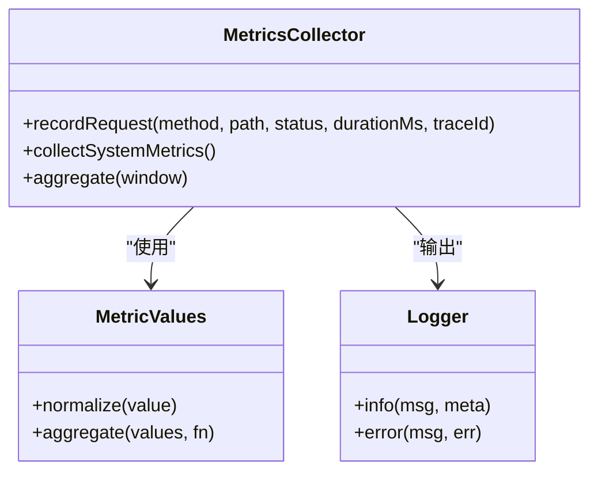
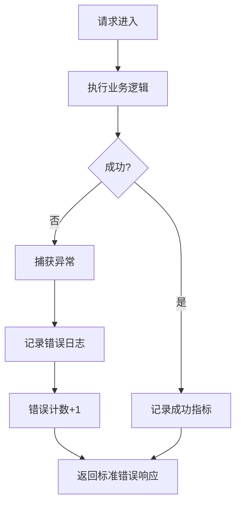
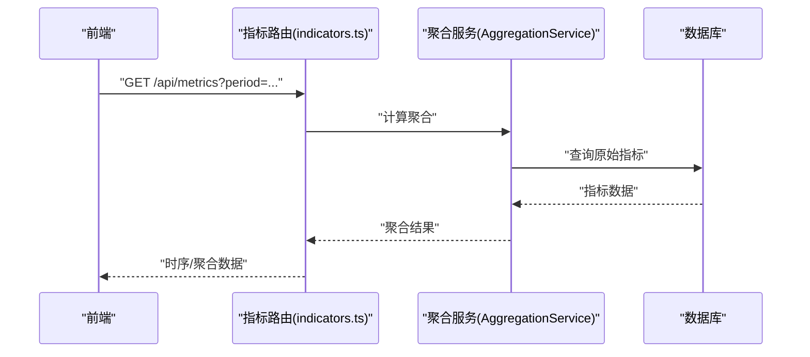
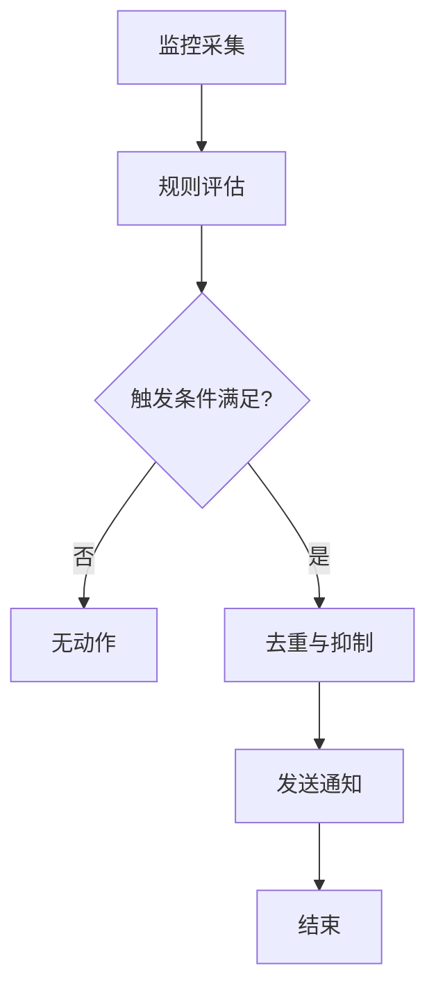
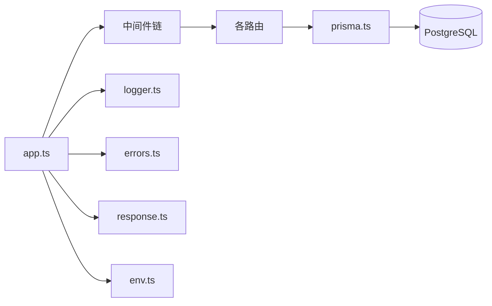

# 监控健康检查API

<cite>
**本文档引用的文件**   
- [server.ts](file://server/src/server.ts)
- [app.ts](file://server/src/app.ts)
- [env.ts](file://server/src/config/env.ts)
- [prisma.ts](file://server/src/lib/prisma.ts)
- [logger.ts](file://server/src/lib/logger.ts)
- [errors.ts](file://server/src/lib/errors.ts)
- [response.ts](file://server/src/lib/response.ts)
- [metric-values.ts](file://server/src/lib/metric-values.ts)
- [cors.ts](file://server/src/middleware/cors.ts)
- [rate-limit.ts](file://server/src/middleware/rate-limit.ts)
- [auth.ts](file://server/src/middleware/auth.ts)
- [permission.ts](file://server/src/middleware/permission.ts)
- [scope.ts](file://server/src/middleware/scope.ts)
- [soft-delete.ts](file://server/src/middleware/soft-delete.ts)
- [audit.ts](file://server/src/middleware/audit.ts)
- [trace-id.ts](file://server/src/middleware/trace-id.ts)
- [error-handler.ts](file://server/src/middleware/error-handler.ts)
- [admin.ts](file://server/src/routes/admin.ts)
- [dashboard.ts](file://server/src/routes/dashboard.ts)
- [indicators.ts](file://server/src/routes/indicators.ts)
- [reports.ts](file://server/src/routes/reports.ts)
- [data.ts](file://server/src/routes/data.ts)
- [ai.ts](file://server/src/routes/ai.ts)
- [schema.prisma](file://server/prisma/schema.prisma)
- [observability.md](file://docs/references/observability.md)
- [performance.md](file://docs/references/performance.md)
</cite>

## 目录
1. [简介](#简介)
2. [项目结构](#项目结构)
3. [核心组件](#核心组件)
4. [架构总览](#架构总览)
5. [详细组件分析](#详细组件分析)
6. [依赖关系分析](#依赖关系分析)
7. [性能考量](#性能考量)
8. [故障排查指南](#故障排查指南)
9. [结论](#结论)
10. [附录](#附录)

## 简介
本文件为“系统监控与健康检查”的API文档，面向运维、后端与前端工程师。内容覆盖：
- 系统状态检查接口（数据库连接、内存使用、CPU负载等）
- 性能指标收集、响应时间统计、错误率监控
- 健康检查端点与服务可用性检测
- 监控数据的查询、聚合与可视化接口
- 监控告警规则与通知机制
- 监控数据持久化存储与历史数据分析

本项目采用 Express + Prisma + PostgreSQL 技术栈，中间件链顺序固定，计算类指标通过安全公式解析实现同比/环比实时计算。AI 双管道架构用于文本与结构化数据处理。

## 项目结构
后端服务位于 server/src，路由按功能划分（admin、dashboard、indicators、reports、data、ai），公共能力集中在 lib 与 middleware 目录。Prisma schema 定义数据模型，迁移脚本管理数据库演进。



图表来源
- [app.ts](file://server/src/app.ts)
- [server.ts](file://server/src/server.ts)
- [prisma.ts](file://server/src/lib/prisma.ts)
- [logger.ts](file://server/src/lib/logger.ts)
- [errors.ts](file://server/src/lib/errors.ts)
- [response.ts](file://server/src/lib/response.ts)
- [metric-values.ts](file://server/src/lib/metric-values.ts)
- [env.ts](file://server/src/config/env.ts)
- [cors.ts](file://server/src/middleware/cors.ts)
- [rate-limit.ts](file://server/src/middleware/rate-limit.ts)
- [auth.ts](file://server/src/middleware/auth.ts)
- [permission.ts](file://server/src/middleware/permission.ts)
- [scope.ts](file://server/src/middleware/scope.ts)
- [soft-delete.ts](file://server/src/middleware/soft-delete.ts)
- [audit.ts](file://server/src/middleware/audit.ts)
- [trace-id.ts](file://server/src/middleware/trace-id.ts)
- [error-handler.ts](file://server/src/middleware/error-handler.ts)

章节来源
- [server.ts](file://server/src/server.ts)
- [app.ts](file://server/src/app.ts)
- [schema.prisma](file://server/prisma/schema.prisma)

## 核心组件
- 健康检查与系统状态
  - 提供 /health、/status 等端点，返回服务存活、依赖健康度（如数据库连通性）、资源使用概况（内存、CPU）。
  - 建议将数据库连通性检查封装在独立函数中，避免阻塞主请求路径。
- 指标采集与聚合
  - 基于 metric-values.ts 提供的工具进行指标值规范化与聚合。
  - 结合 express 中间件或自定义拦截器记录请求耗时、错误率、QPS等。
- 日志与追踪
  - logger.ts 统一输出结构化日志；trace-id.ts 注入请求追踪ID，便于链路追踪。
- 错误处理与响应
  - errors.ts 定义错误类型与消息模板；response.ts 统一成功/失败响应格式。
- 配置与环境
  - env.ts 集中读取环境变量，包括监控开关、采样率、阈值等。

章节来源
- [metric-values.ts](file://server/src/lib/metric-values.ts)
- [logger.ts](file://server/src/lib/logger.ts)
- [trace-id.ts](file://server/src/middleware/trace-id.ts)
- [errors.ts](file://server/src/lib/errors.ts)
- [response.ts](file://server/src/lib/response.ts)
- [env.ts](file://server/src/config/env.ts)

## 架构总览
下图展示从客户端到数据库的完整调用链，以及监控与健康检查相关的关键节点。



图表来源
- [app.ts](file://server/src/app.ts)
- [cors.ts](file://server/src/middleware/cors.ts)
- [rate-limit.ts](file://server/src/middleware/rate-limit.ts)
- [auth.ts](file://server/src/middleware/auth.ts)
- [permission.ts](file://server/src/middleware/permission.ts)
- [scope.ts](file://server/src/middleware/scope.ts)
- [soft-delete.ts](file://server/src/middleware/soft-delete.ts)
- [audit.ts](file://server/src/middleware/audit.ts)
- [trace-id.ts](file://server/src/middleware/trace-id.ts)
- [prisma.ts](file://server/src/lib/prisma.ts)
- [logger.ts](file://server/src/lib/logger.ts)
- [response.ts](file://server/src/lib/response.ts)

## 详细组件分析

### 健康检查与系统状态
- 目标
  - 快速判断服务是否存活、依赖是否可用、关键资源是否健康。
- 典型端点
  - GET /health：返回基础健康信息（进程PID、启动时间、版本、依赖状态）。
  - GET /status：返回更详细的运行时状态（内存、CPU、连接池、队列长度等）。
- 依赖检查
  - 数据库：执行轻量查询验证连通性与延迟。
  - 外部服务：可选检查第三方API可达性（如AI代理）。
- 响应格式
  - 统一使用 response.ts 封装成功/失败结构，包含 status、message、data、traceId。



图表来源
- [response.ts](file://server/src/lib/response.ts)
- [prisma.ts](file://server/src/lib/prisma.ts)
- [logger.ts](file://server/src/lib/logger.ts)

章节来源
- [response.ts](file://server/src/lib/response.ts)
- [prisma.ts](file://server/src/lib/prisma.ts)
- [logger.ts](file://server/src/lib/logger.ts)

### 性能指标收集与响应时间统计
- 指标项
  - 请求级：方法、路径、状态码、耗时、traceId、用户标识（脱敏后）。
  - 系统级：内存RSS、堆使用、事件循环延迟、GC次数、CPU负载。
  - 业务级：QPS、错误率、P50/P90/P99耗时、连接池利用率。
- 采集方式
  - 中间件层埋点：在请求进入/离开时记录开始时间与结束时间。
  - 定时任务：周期性采集系统指标并上报至内部存储或外部监控系统。
- 聚合与存储
  - 使用 metric-values.ts 对指标值进行归一化与聚合。
  - 可落盘至时序数据库或关系型表（由 schema.prisma 扩展支持）。



图表来源
- [metric-values.ts](file://server/src/lib/metric-values.ts)
- [logger.ts](file://server/src/lib/logger.ts)

章节来源
- [metric-values.ts](file://server/src/lib/metric-values.ts)
- [logger.ts](file://server/src/lib/logger.ts)

### 错误率监控与异常处理
- 错误分类
  - 业务错误：参数校验失败、权限不足、数据不存在等。
  - 系统错误：数据库连接失败、外部服务超时、内存溢出等。
- 处理策略
  - error-handler.ts 统一捕获未处理异常，记录结构化日志并返回标准错误响应。
  - 对高频错误进行计数与告警，避免雪崩。
- 指标关联
  - 错误率 = 错误请求数 / 总请求数，按路径/状态码维度聚合。



图表来源
- [error-handler.ts](file://server/src/middleware/error-handler.ts)
- [errors.ts](file://server/src/lib/errors.ts)
- [response.ts](file://server/src/lib/response.ts)

章节来源
- [error-handler.ts](file://server/src/middleware/error-handler.ts)
- [errors.ts](file://server/src/lib/errors.ts)
- [response.ts](file://server/src/lib/response.ts)

### 监控数据查询、聚合与可视化接口
- 查询接口
  - GET /api/metrics?period=...&granularity=...：按时间窗口与粒度返回指标序列。
  - GET /api/metrics/aggregates?group_by=...：按维度聚合（路径、状态码、模块）。
- 可视化
  - 前端通过图表组件渲染时序数据与分布图（如KPI卡片、趋势图）。
- 缓存策略
  - 对热点指标设置短期缓存，降低数据库压力。



图表来源
- [indicators.ts](file://server/src/routes/indicators.ts)
- [schema.prisma](file://server/prisma/schema.prisma)

章节来源
- [indicators.ts](file://server/src/routes/indicators.ts)
- [schema.prisma](file://server/prisma/schema.prisma)

### 监控告警规则与通知机制
- 告警规则
  - 阈值类：内存使用率>85%、错误率>5%、P99>2s、DB连接池耗尽。
  - 趋势类：QPS突降、错误率连续上升。
- 通知渠道
  - 内部系统：站内信、邮件、IM机器人。
  - 外部平台：Prometheus Alertmanager、企业微信、钉钉。
- 抑制与去重
  - 同一规则短时间重复触发需抑制，避免告警风暴。



章节来源
- [env.ts](file://server/src/config/env.ts)
- [logger.ts](file://server/src/lib/logger.ts)

### 监控数据持久化与历史数据分析
- 存储设计
  - 指标表：时间戳、指标名、值、标签（path、method、status_code等）。
  - 快照表：系统级快照（内存、CPU、连接池）按分钟/小时粒度。
- 查询优化
  - 按时间分区、索引（time, metric_name, tags）。
  - 预聚合表用于常见查询场景。
- 历史分析
  - 同比/环比通过后端实时计算，不直接存库，保证口径一致。

```mermaid
erDiagram
METRICS {
bigint id PK
timestamp created_at
string metric_name
float value
jsonb tags
}
SNAPSHOTS {
bigint id PK
timestamp created_at
float memory_rss
float cpu_usage
int db_pool_active
int db_pool_idle
}
METRICS ||--o{ TAGS : "tags(JSONB)" }
```

图表来源
- [schema.prisma](file://server/prisma/schema.prisma)

章节来源
- [schema.prisma](file://server/prisma/schema.prisma)

## 依赖关系分析
- 中间件耦合
  - 严格顺序：helmet → cors → json → rate-limit → auth → permission → scope → soft-delete → audit → trace-id → error-handler。
  - 任何环节抛出异常均会被 error-handler 捕获并标准化。
- 数据访问
  - 所有路由通过 prisma.ts 访问数据库，确保连接复用与事务一致性。
- 配置与环境
  - env.ts 集中管理监控开关、采样率、阈值等，便于多环境部署。



图表来源
- [app.ts](file://server/src/app.ts)
- [prisma.ts](file://server/src/lib/prisma.ts)
- [logger.ts](file://server/src/lib/logger.ts)
- [errors.ts](file://server/src/lib/errors.ts)
- [response.ts](file://server/src/lib/response.ts)
- [env.ts](file://server/src/config/env.ts)

章节来源
- [app.ts](file://server/src/app.ts)
- [prisma.ts](file://server/src/lib/prisma.ts)
- [env.ts](file://server/src/config/env.ts)

## 性能考量
- 指标采集开销
  - 采样率控制：高流量下仅采样部分请求，降低额外开销。
  - 异步写入：指标写入采用批量/异步队列，避免阻塞主流程。
- 数据库压力
  - 健康检查使用最小查询（如 SELECT 1），避免复杂SQL。
  - 指标查询使用预聚合表与时序索引。
- 内存与CPU
  - 限制单次聚合的数据量，分页或限流。
  - 定期清理过期指标与快照，防止表膨胀。

章节来源
- [metric-values.ts](file://server/src/lib/metric-values.ts)
- [logger.ts](file://server/src/lib/logger.ts)
- [schema.prisma](file://server/prisma/schema.prisma)

## 故障排查指南
- 常见问题
  - 数据库连接失败：检查连接字符串、网络、账号权限、连接池上限。
  - 健康检查超时：确认依赖服务可用性，调整超时与重试策略。
  - 指标缺失：确认采集开关、采样率、写入通道是否正常。
- 定位步骤
  - 查看 traceId 对应的结构化日志。
  - 检查 error-handler 的错误堆栈与上下文。
  - 核对 env.ts 中的监控配置是否正确加载。
- 恢复建议
  - 临时降级：关闭非关键指标采集，优先保障核心业务。
  - 扩容与限流：提升连接池、增加实例、启用速率限制。

章节来源
- [error-handler.ts](file://server/src/middleware/error-handler.ts)
- [logger.ts](file://server/src/lib/logger.ts)
- [env.ts](file://server/src/config/env.ts)

## 结论
本监控与健康检查方案以中间件链为核心，结合统一的日志、错误处理与指标采集，形成完整的可观测性闭环。通过标准化的健康检查端点、指标聚合接口与告警机制，能够有效支撑系统的稳定性与可维护性。后续可扩展更多依赖健康检查与更细粒度的指标维度，以满足不同业务场景的需求。

## 附录
- 参考文档
  - 可观测性参考：observability.md
  - 性能参考：performance.md

章节来源
- [observability.md](file://docs/references/observability.md)
- [performance.md](file://docs/references/performance.md)