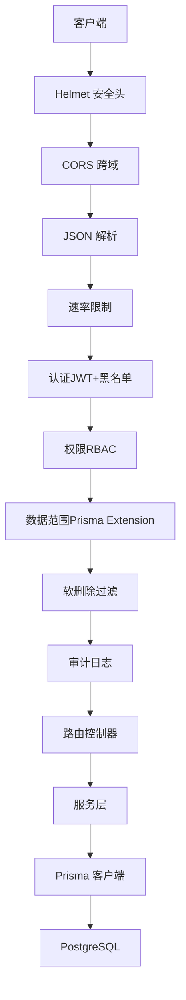
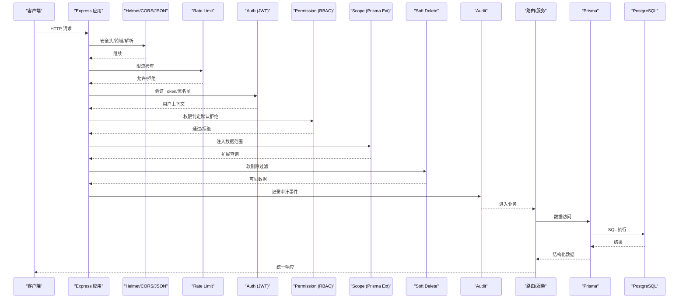
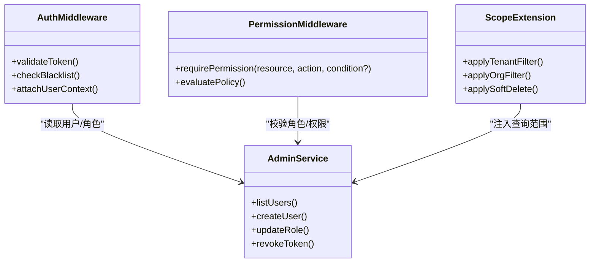
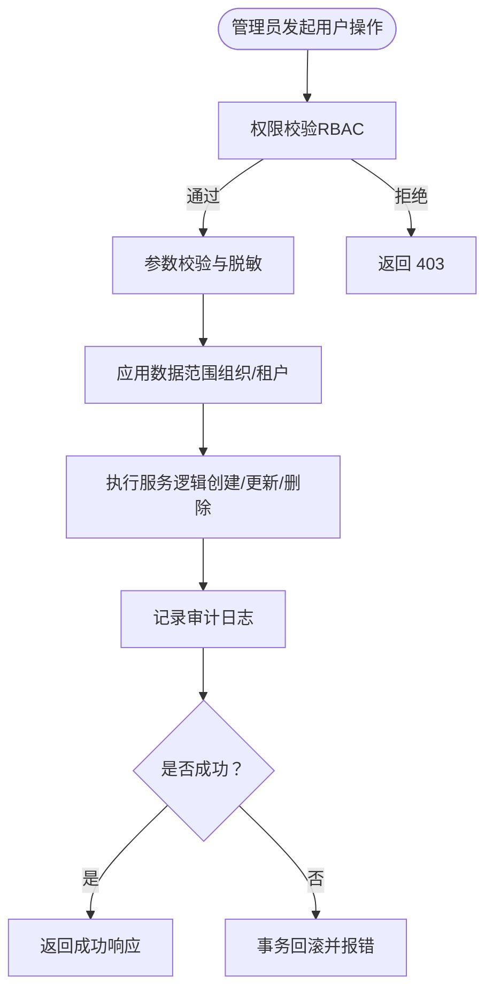
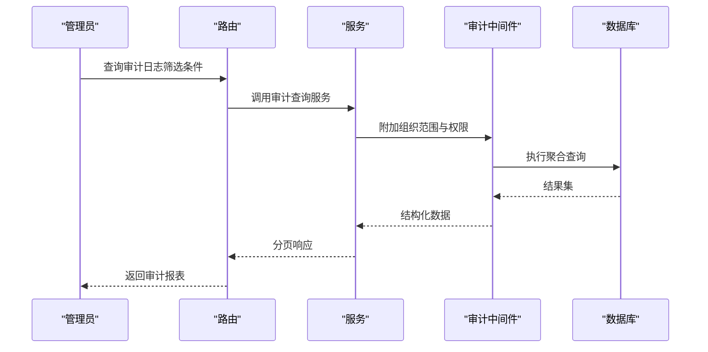
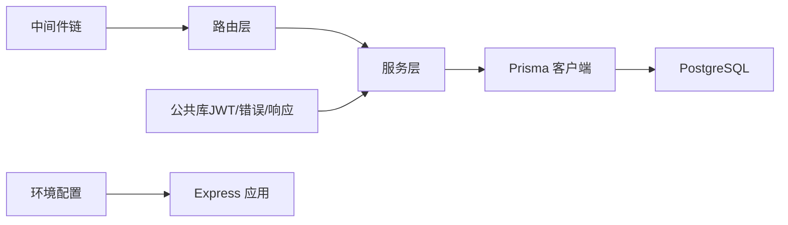

# 管理后台API

<cite>
**本文引用的文件**   
- [server/src/app.ts](file://server/src/app.ts)
- [server/src/server.ts](file://server/src/server.ts)
- [server/src/routes/admin.ts](file://server/src/routes/admin.ts)
- [server/src/routes/auth.ts](file://server/src/routes/auth.ts)
- [server/src/middleware/auth.ts](file://server/src/middleware/auth.ts)
- [server/src/middleware/permission.ts](file://server/src/middleware/permission.ts)
- [server/src/middleware/scope.ts](file://server/src/middleware/scope.ts)
- [server/src/middleware/audit.ts](file://server/src/middleware/audit.ts)
- [server/src/middleware/rate-limit.ts](file://server/src/middleware/rate-limit.ts)
- [server/src/middleware/cors.ts](file://server/src/middleware/cors.ts)
- [server/src/middleware/helmet.ts](file://server/src/middleware/helmet.ts)
- [server/src/lib/jwt.ts](file://server/src/lib/jwt.ts)
- [server/src/lib/errors.ts](file://server/src/lib/errors.ts)
- [server/src/lib/response.ts](file://server/src/lib/response.ts)
- [server/src/services/AdminService.ts](file://server/src/services/AdminService.ts)
- [server/src/services/AuthService.ts](file://server/src/services/AuthService.ts)
- [server/prisma/schema.prisma](file://server/prisma/schema.prisma)
- [server/src/config/env.ts](file://server/src/config/env.ts)
</cite>

## 目录
1. [简介](#简介)
2. [项目结构](#项目结构)
3. [核心组件](#核心组件)
4. [架构总览](#架构总览)
5. [详细组件分析](#详细组件分析)
6. [依赖关系分析](#依赖关系分析)
7. [性能考量](#性能考量)
8. [故障排查指南](#故障排查指南)
9. [结论](#结论)
10. [附录](#附录)

## 简介
本文件为 FY200 管理后台的完整 API 文档，覆盖用户管理、角色与权限（RBAC）、系统配置、审计日志、系统监控与健康检查、数据备份恢复、批量操作与系统维护工具接口。文档同时说明 RBAC 权限模型与权限继承机制、安全控制与防滥用策略，以及审计日志的查询与分析能力。

后端技术栈：Express 4 + Prisma 5 + PostgreSQL 15 + JWT（access 15min + refresh 7day 轮转）+ DeepSeek API（SSE 流式）。中间件执行链顺序：helmet → cors → express.json → rate-limit → auth(JWT+黑名单) → permission(默认拒绝) → scope(Prisma extension) → softDelete → audit → Service → Prisma → PostgreSQL。

## 项目结构
- 路由层：按功能划分 routes（admin、auth、dashboard、data、indicators、reports、ai）。
- 中间件层：安全与通用能力（helmet、cors、rate-limit、auth、permission、scope、soft-delete、audit、trace-id）。
- 服务层：业务逻辑封装（AdminService、AuthService、ImportService、ReportService 等）。
- 数据访问：Prisma Schema 定义与迁移，PostgreSQL 持久化。
- 配置与环境：环境变量加载与校验。
- 公共库：JWT、错误处理、响应封装、指标值计算、脱敏与公式解析等。

**图表来源** 
- [server/src/app.ts](file://server/src/app.ts)
- [server/src/server.ts](file://server/src/server.ts)
- [server/src/middleware/helmet.ts](file://server/src/middleware/helmet.ts)
- [server/src/middleware/cors.ts](file://server/src/middleware/cors.ts)
- [server/src/middleware/rate-limit.ts](file://server/src/middleware/rate-limit.ts)
- [server/src/middleware/auth.ts](file://server/src/middleware/auth.ts)
- [server/src/middleware/permission.ts](file://server/src/middleware/permission.ts)
- [server/src/middleware/scope.ts](file://server/src/middleware/scope.ts)
- [server/src/middleware/soft-delete.ts](file://server/src/middleware/soft-delete.ts)
- [server/src/middleware/audit.ts](file://server/src/middleware/audit.ts)

**章节来源**
- [server/src/app.ts](file://server/src/app.ts)
- [server/src/server.ts](file://server/src/server.ts)

## 核心组件
- 认证与授权
  - JWT 签发与刷新、黑名单校验、过期时间管理。
  - RBAC 权限模型：基于角色的访问控制，支持资源-动作-条件判断，默认拒绝。
  - 数据范围（Scope）：通过 Prisma Extension 注入租户/组织维度过滤。
- 审计与可观测性
  - 全量审计日志记录（谁、何时、对何资源、做了什么变更）。
  - 健康检查与基础监控指标暴露。
- 安全与防护
  - Helmet 安全头、CORS、速率限制、输入校验与脱敏。
- 数据与导入导出
  - Excel 导入/导出、批量操作、事务保障。
- 配置与环境
  - 环境变量集中管理，敏感信息隔离。

**章节来源**
- [server/src/lib/jwt.ts](file://server/src/lib/jwt.ts)
- [server/src/middleware/auth.ts](file://server/src/middleware/auth.ts)
- [server/src/middleware/permission.ts](file://server/src/middleware/permission.ts)
- [server/src/middleware/scope.ts](file://server/src/middleware/scope.ts)
- [server/src/middleware/audit.ts](file://server/src/middleware/audit.ts)
- [server/src/lib/response.ts](file://server/src/lib/response.ts)
- [server/src/lib/errors.ts](file://server/src/lib/errors.ts)

## 架构总览
下图展示管理后台请求从进入 Express 到数据库落盘的完整链路，体现中间件链与职责边界。

**图表来源** 
- [server/src/app.ts](file://server/src/app.ts)
- [server/src/middleware/auth.ts](file://server/src/middleware/auth.ts)
- [server/src/middleware/permission.ts](file://server/src/middleware/permission.ts)
- [server/src/middleware/scope.ts](file://server/src/middleware/scope.ts)
- [server/src/middleware/audit.ts](file://server/src/middleware/audit.ts)

## 详细组件分析

### 认证与鉴权（JWT + RBAC）
- 登录与令牌
  - 登录接口返回 access token（短效）与 refresh token（长效），支持刷新轮换。
  - 黑名单机制用于强制下线或安全事件处置。
- RBAC 权限模型
  - 角色-资源-动作三元组，支持条件表达式（如组织范围、时间窗口）。
  - 默认拒绝策略：未显式授权的请求一律拒绝。
  - 权限继承：子角色继承父角色权限，支持叠加与覆盖规则。
- 数据范围（Scope）
  - 通过 Prisma Extension 自动注入 where 条件，实现多租户/组织隔离。
  - 结合软删除，确保仅返回有效且可见的数据。

**图表来源** 
- [server/src/middleware/auth.ts](file://server/src/middleware/auth.ts)
- [server/src/middleware/permission.ts](file://server/src/middleware/permission.ts)
- [server/src/middleware/scope.ts](file://server/src/middleware/scope.ts)
- [server/src/services/AdminService.ts](file://server/src/services/AdminService.ts)

**章节来源**
- [server/src/middleware/auth.ts](file://server/src/middleware/auth.ts)
- [server/src/middleware/permission.ts](file://server/src/middleware/permission.ts)
- [server/src/middleware/scope.ts](file://server/src/middleware/scope.ts)
- [server/src/lib/jwt.ts](file://server/src/lib/jwt.ts)
- [server/src/services/AuthService.ts](file://server/src/services/AuthService.ts)

### 用户与角色管理（Admin）
- 用户管理
  - 列表查询、创建、更新、禁用/启用、重置密码、分配角色。
  - 批量导入/导出用户，支持模板校验与错误回滚。
- 角色与权限
  - 角色 CRUD、权限集合编辑、继承关系配置。
  - 权限矩阵可视化与冲突检测。
- 会话与令牌
  - 查看在线会话、强制下线、令牌吊销。

**图表来源** 
- [server/src/routes/admin.ts](file://server/src/routes/admin.ts)
- [server/src/services/AdminService.ts](file://server/src/services/AdminService.ts)
- [server/src/middleware/permission.ts](file://server/src/middleware/permission.ts)
- [server/src/middleware/scope.ts](file://server/src/middleware/scope.ts)
- [server/src/middleware/audit.ts](file://server/src/middleware/audit.ts)

**章节来源**
- [server/src/routes/admin.ts](file://server/src/routes/admin.ts)
- [server/src/services/AdminService.ts](file://server/src/services/AdminService.ts)

### 系统配置与开关
- 全局配置项
  - 功能开关、阈值、策略参数（如限流阈值、审计级别、导入大小限制）。
- 动态配置
  - 运行时热更新（需权限与审计），支持灰度发布与回滚。
- 配置版本化
  - 变更记录与对比，支持一键回滚。

**章节来源**
- [server/src/config/env.ts](file://server/src/config/env.ts)
- [server/src/middleware/audit.ts](file://server/src/middleware/audit.ts)

### 审计日志查询与分析
- 审计事件
  - 记录操作人、时间、IP、UA、资源类型、资源ID、动作、前后快照摘要、影响行数。
- 查询与分析
  - 多维筛选（时间、操作人、资源类型、动作、组织范围）。
  - 分页、排序、导出 CSV/Excel。
  - 异常聚合与告警（高频失败、越权尝试、批量删除等）。
- 合规与留存
  - 保留策略、归档与压缩、只读副本。

**图表来源** 
- [server/src/middleware/audit.ts](file://server/src/middleware/audit.ts)
- [server/src/services/AdminService.ts](file://server/src/services/AdminService.ts)

**章节来源**
- [server/src/middleware/audit.ts](file://server/src/middleware/audit.ts)

### 系统监控、性能指标与健康检查
- 健康检查
  - /health 端点返回服务状态、依赖（数据库、缓存、外部服务）可用性。
- 性能指标
  - 暴露关键指标（QPS、延迟分布、错误率、连接池使用率、内存/CPU）。
- 诊断信息
  - 慢查询统计、中间件耗时、请求追踪 ID。

**章节来源**
- [server/src/app.ts](file://server/src/app.ts)
- [server/src/lib/response.ts](file://server/src/lib/response.ts)

### 数据备份与恢复
- 备份
  - 全量/增量备份、定时任务、对象存储归档。
- 恢复
  - 按时间点恢复、一致性校验、回滚预案。
- 验证
  - 备份完整性校验、恢复演练报告。

**章节来源**
- [server/src/services/AdminService.ts](file://server/src/services/AdminService.ts)

### 批量操作与维护工具
- 批量导入/导出
  - Excel 模板校验、分片上传、并发控制、错误明细下载。
- 批量更新/删除
  - 事务保障、幂等键、进度跟踪与中断恢复。
- 系统维护
  - 索引重建、统计信息更新、缓存预热、锁清理。

**章节来源**
- [server/src/services/AdminService.ts](file://server/src/services/AdminService.ts)

### 安全控制与防滥用机制
- 认证与授权
  - JWT 短效访问令牌 + 长时刷新令牌轮换；黑名单强制下线。
  - RBAC 默认拒绝，最小权限原则。
- 输入与输出
  - 严格校验、白名单算子、脱敏输出（金额区间、公司名映射）。
- 限流与熔断
  - 接口级/用户级限流，异常熔断与降级。
- 审计与追溯
  - 全量审计、不可篡改存储、异常行为告警。

**章节来源**
- [server/src/middleware/auth.ts](file://server/src/middleware/auth.ts)
- [server/src/middleware/permission.ts](file://server/src/middleware/permission.ts)
- [server/src/middleware/rate-limit.ts](file://server/src/middleware/rate-limit.ts)
- [server/src/middleware/audit.ts](file://server/src/middleware/audit.ts)
- [server/src/lib/jwt.ts](file://server/src/lib/jwt.ts)

## 依赖关系分析
- 模块耦合
  - 路由依赖服务，服务依赖 Prisma，中间件贯穿请求生命周期。
- 外部依赖
  - PostgreSQL、JWT、DeepSeek API（SSE 流式）。
- 潜在循环依赖
  - 通过分层与接口抽象避免循环引用。

**图表来源** 
- [server/src/app.ts](file://server/src/app.ts)
- [server/src/server.ts](file://server/src/server.ts)
- [server/src/lib/jwt.ts](file://server/src/lib/jwt.ts)
- [server/src/lib/response.ts](file://server/src/lib/response.ts)
- [server/src/lib/errors.ts](file://server/src/lib/errors.ts)

**章节来源**
- [server/src/app.ts](file://server/src/app.ts)
- [server/src/server.ts](file://server/src/server.ts)

## 性能考量
- 查询优化
  - 合理使用索引、分页与投影、避免 N+1 查询。
- 缓存策略
  - 热点数据缓存、失效策略与一致性保证。
- 异步与并发
  - 批量操作分片、背压控制、超时与重试。
- 资源监控
  - 连接池水位、GC 与内存峰值、慢查询告警。

[本节为通用指导，不直接分析具体文件]

## 故障排查指南
- 常见问题定位
  - 认证失败：检查 JWT 签名、过期时间、黑名单。
  - 权限拒绝：确认角色-资源-动作配置与继承关系。
  - 数据不可见：核查 Scope 注入与软删除过滤。
  - 审计缺失：确认审计中间件挂载与写入权限。
- 日志与追踪
  - 使用 trace-id 串联请求链路，结合审计日志定位问题。
- 快速修复
  - 临时放开限流、降级非核心功能、回滚配置变更。

**章节来源**
- [server/src/lib/errors.ts](file://server/src/lib/errors.ts)
- [server/src/middleware/auth.ts](file://server/src/middleware/auth.ts)
- [server/src/middleware/permission.ts](file://server/src/middleware/permission.ts)
- [server/src/middleware/audit.ts](file://server/src/middleware/audit.ts)

## 结论
FY200 管理后台以清晰的中间件链与分层架构实现了安全的认证授权、严格的 RBAC 权限模型、完善的审计与可观测性，并提供数据备份恢复、批量操作与系统维护工具。建议在生产环境中强化监控告警、定期演练恢复流程，并持续优化查询与缓存策略以提升稳定性与性能。

[本节为总结，不直接分析具体文件]

## 附录

### API 概览（管理后台）
- 认证
  - 登录、刷新令牌、登出、令牌黑名单管理。
- 用户与角色
  - 用户 CRUD、角色 CRUD、权限矩阵、继承配置、批量导入/导出。
- 系统配置
  - 配置项 CRUD、版本化与回滚、动态热更新。
- 审计日志
  - 查询、筛选、导出、异常聚合与告警。
- 监控与健康
  - 健康检查、指标暴露、诊断信息。
- 备份与恢复
  - 备份任务、恢复流程、校验与演练。
- 批量与维护
  - 批量导入/导出、批量更新/删除、索引重建、缓存预热。

[本节为概念性概述，不直接分析具体文件]

### 数据模型（节选）
- 用户、角色、权限、审计日志、配置项等实体关系由 Prisma Schema 定义。

**章节来源**
- [server/prisma/schema.prisma](file://server/prisma/schema.prisma)