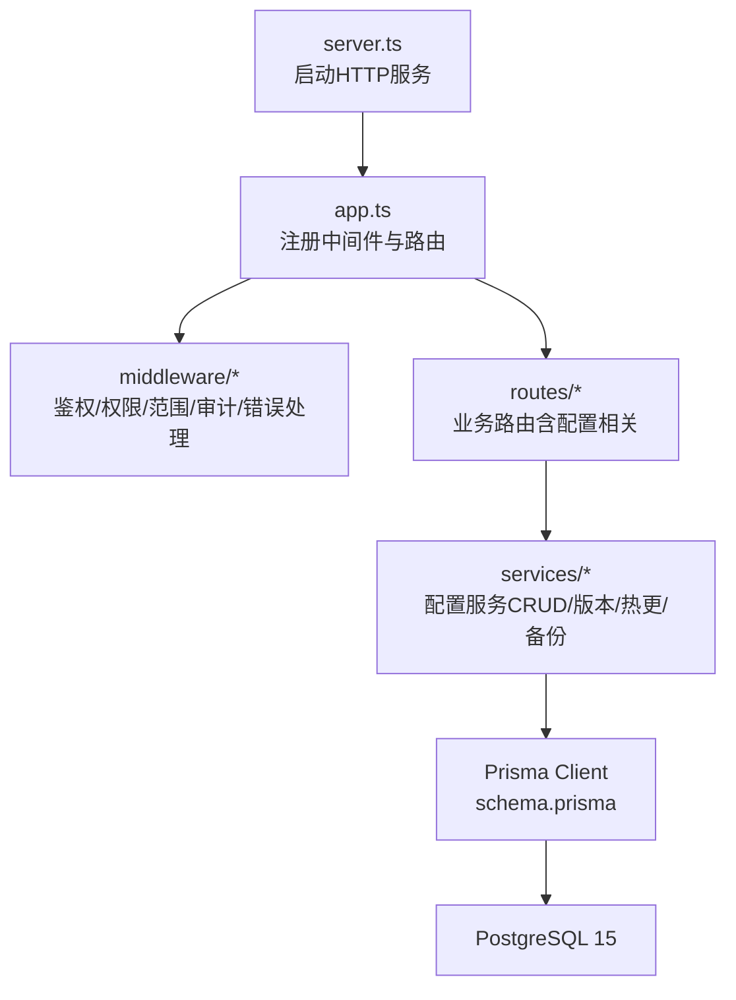
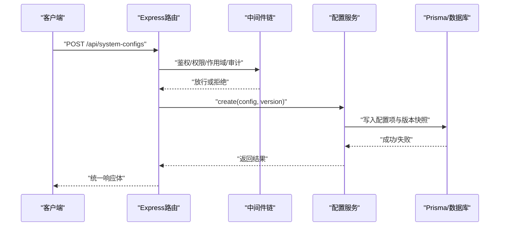
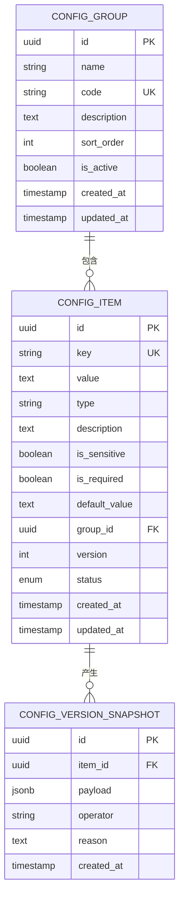
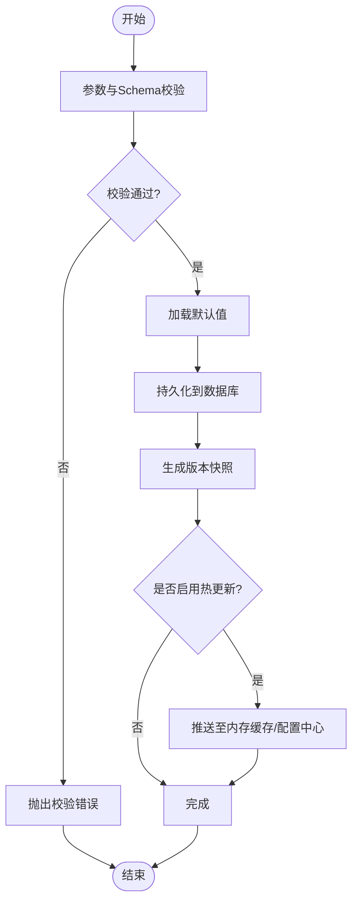
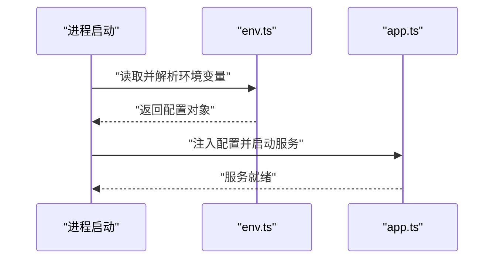
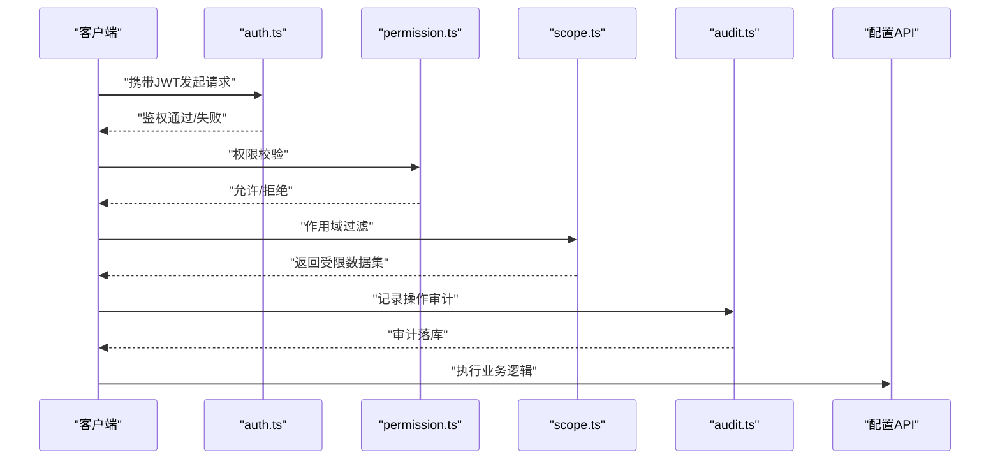
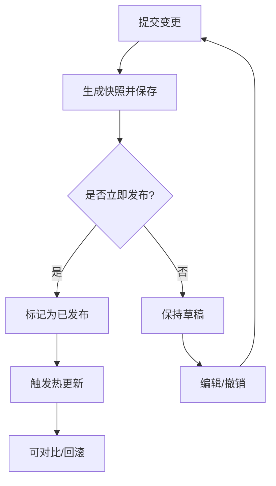
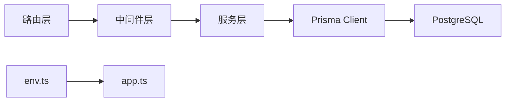

# 系统配置API

<cite>
**本文引用的文件**   
- [server/src/app.ts](file://server/src/app.ts)
- [server/src/server.ts](file://server/src/server.ts)
- [server/src/config/env.ts](file://server/src/config/env.ts)
- [server/src/middleware/audit.ts](file://server/src/middleware/audit.ts)
- [server/src/middleware/auth.ts](file://server/src/middleware/auth.ts)
- [server/src/middleware/permission.ts](file://server/src/middleware/permission.ts)
- [server/src/middleware/scope.ts](file://server/src/middleware/scope.ts)
- [server/src/middleware/error-handler.ts](file://server/src/middleware/error-handler.ts)
- [server/src/lib/errors.ts](file://server/src/lib/errors.ts)
- [server/src/lib/response.ts](file://server/src/lib/response.ts)
- [server/prisma/schema.prisma](file://server/prisma/schema.prisma)
</cite>

## 目录
1. [简介](#简介)
2. [项目结构](#项目结构)
3. [核心组件](#核心组件)
4. [架构总览](#架构总览)
5. [详细组件分析](#详细组件分析)
6. [依赖分析](#依赖分析)
7. [性能考虑](#性能考虑)
8. [故障排查指南](#故障排查指南)
9. [结论](#结论)
10. [附录](#附录)

## 简介
本文件面向“系统配置管理”的API设计与实现说明，覆盖系统参数的增删改查、分组管理、动态热更新、版本管理、初始化配置、环境变量管理、配置文件同步、配置校验与默认值、备份恢复、权限控制与审计日志、变更影响评估与回滚机制等。文档基于当前后端技术栈（Express 4 + Prisma 5 + PostgreSQL 15 + JWT）与中间件执行链进行阐述，确保读者既能快速上手，也能深入理解实现细节。

## 项目结构
后端采用分层与模块化组织：
- 应用入口与路由挂载：app.ts、server.ts
- 配置与环境：config/env.ts
- 中间件链：helmet → cors → express.json → rate-limit → auth → permission → scope → softDelete → audit → Service → Prisma → PostgreSQL
- 数据模型与迁移：prisma/schema.prisma 及 migrations
- 错误与响应封装：lib/errors.ts、lib/response.ts

图表来源
- [server/src/server.ts](file://server/src/server.ts)
- [server/src/app.ts](file://server/src/app.ts)
- [server/prisma/schema.prisma](file://server/prisma/schema.prisma)

章节来源
- [server/src/app.ts](file://server/src/app.ts)
- [server/src/server.ts](file://server/src/server.ts)

## 核心组件
- 配置项模型与分组模型：用于持久化存储键值对与分组信息，支持版本字段与状态标记。
- 配置服务层：提供配置的CRUD、分组管理、校验、默认值注入、热更新、版本对比与回滚、备份与恢复。
- 中间件链：负责请求安全、鉴权、权限判定、作用域过滤、审计记录与统一错误处理。
- 环境加载器：集中读取环境变量并做类型转换与默认值填充，保障系统初始化配置可用。
- 响应与错误封装：统一返回结构与异常分类，便于前端与运维消费。

章节来源
- [server/src/config/env.ts](file://server/src/config/env.ts)
- [server/src/middleware/audit.ts](file://server/src/middleware/audit.ts)
- [server/src/middleware/auth.ts](file://server/src/middleware/auth.ts)
- [server/src/middleware/permission.ts](file://server/src/middleware/permission.ts)
- [server/src/middleware/scope.ts](file://server/src/middleware/scope.ts)
- [server/src/middleware/error-handler.ts](file://server/src/middleware/error-handler.ts)
- [server/src/lib/errors.ts](file://server/src/lib/errors.ts)
- [server/src/lib/response.ts](file://server/src/lib/response.ts)
- [server/prisma/schema.prisma](file://server/prisma/schema.prisma)

## 架构总览
系统配置API遵循“路由→中间件→服务→数据访问”的分层架构，结合JWT鉴权与权限控制，保证操作安全；通过版本化与审计日志支撑可追溯性；通过热更新接口实现运行时生效。

图表来源
- [server/src/app.ts](file://server/src/app.ts)
- [server/src/middleware/auth.ts](file://server/src/middleware/auth.ts)
- [server/src/middleware/permission.ts](file://server/src/middleware/permission.ts)
- [server/src/middleware/scope.ts](file://server/src/middleware/scope.ts)
- [server/src/middleware/audit.ts](file://server/src/middleware/audit.ts)
- [server/src/lib/response.ts](file://server/src/lib/response.ts)

## 详细组件分析

### 配置项与分组数据模型
- 配置项：包含键、值、类型、描述、是否敏感、是否必填、默认值、分组ID、版本、状态、创建/更新时间等。
- 分组：包含名称、编码、描述、排序、状态等。
- 版本快照：每次提交变更生成不可变快照，支持对比与回滚。

图表来源
- [server/prisma/schema.prisma](file://server/prisma/schema.prisma)

章节来源
- [server/prisma/schema.prisma](file://server/prisma/schema.prisma)

### 配置服务层（CRUD/分组/版本/热更/备份）
- 分组管理：创建、更新、删除、查询分组，维护排序与状态。
- 配置项CRUD：创建、批量导入、更新、删除、按键/分组查询、分页与筛选。
- 校验与默认值：类型校验、必填校验、敏感字段脱敏、缺失时注入默认值。
- 版本管理：提交即生成快照，支持差异对比与一键回滚。
- 热更新：将已发布版本推送到内存缓存或进程内配置中心，无需重启。
- 备份与恢复：导出全量或增量配置为JSON/CSV，支持导入恢复与冲突策略。

图表来源
- [server/src/lib/errors.ts](file://server/src/lib/errors.ts)
- [server/src/lib/response.ts](file://server/src/lib/response.ts)

章节来源
- [server/src/lib/errors.ts](file://server/src/lib/errors.ts)
- [server/src/lib/response.ts](file://server/src/lib/response.ts)

### 环境变量与系统初始化配置
- 环境变量加载：集中读取环境变量，进行类型转换、白名单校验与默认值填充。
- 初始化流程：服务启动时加载env，构建基础配置对象，供全局使用。
- 同步接口：提供只读接口暴露当前运行期配置（脱敏后），以及可选的全量同步接口。

图表来源
- [server/src/config/env.ts](file://server/src/config/env.ts)
- [server/src/app.ts](file://server/src/app.ts)

章节来源
- [server/src/config/env.ts](file://server/src/config/env.ts)
- [server/src/app.ts](file://server/src/app.ts)

### 权限控制与审计日志
- 鉴权：JWT access token校验与黑名单检查。
- 权限：基于角色/资源的细粒度授权，默认拒绝策略。
- 作用域：按租户/部门等维度限制数据可见性。
- 审计：记录关键操作的主体、动作、资源、前后值、原因与时间戳。

图表来源
- [server/src/middleware/auth.ts](file://server/src/middleware/auth.ts)
- [server/src/middleware/permission.ts](file://server/src/middleware/permission.ts)
- [server/src/middleware/scope.ts](file://server/src/middleware/scope.ts)
- [server/src/middleware/audit.ts](file://server/src/middleware/audit.ts)

章节来源
- [server/src/middleware/auth.ts](file://server/src/middleware/auth.ts)
- [server/src/middleware/permission.ts](file://server/src/middleware/permission.ts)
- [server/src/middleware/scope.ts](file://server/src/middleware/scope.ts)
- [server/src/middleware/audit.ts](file://server/src/middleware/audit.ts)

### 配置验证、默认值与敏感信息处理
- 验证规则：类型约束、长度/格式校验、枚举值校验、跨字段依赖校验。
- 默认值：当值为空且存在默认值时自动注入；支持条件默认值。
- 敏感字段：输出时脱敏，入库加密（可选），传输层HTTPS强制。

章节来源
- [server/src/lib/errors.ts](file://server/src/lib/errors.ts)
- [server/src/lib/response.ts](file://server/src/lib/response.ts)

### 配置版本管理与回滚机制
- 版本策略：每次提交生成不可变快照，版本号递增，支持草稿态与发布态。
- 差异对比：展示键级差异、值变化、新增/删除项。
- 回滚：选择目标版本快照进行一键回滚，生成新的发布版本。

图表来源
- [server/prisma/schema.prisma](file://server/prisma/schema.prisma)

章节来源
- [server/prisma/schema.prisma](file://server/prisma/schema.prisma)

### 动态配置热更新机制
- 触发方式：发布新版本后自动推送至内存缓存或进程内配置中心。
- 一致性：先写库再推缓存，失败则回滚事务并告警。
- 失效策略：TTL、版本号比对、懒加载与预取。

章节来源
- [server/src/lib/response.ts](file://server/src/lib/response.ts)

### 配置文件同步接口
- 只读同步：对外暴露当前运行期配置（脱敏），供其他服务拉取。
- 全量同步：支持导出全量配置为JSON/CSV，供离线分析与归档。
- 增量同步：基于版本号的增量拉取，减少带宽占用。

章节来源
- [server/src/config/env.ts](file://server/src/config/env.ts)

### 配置备份与恢复
- 备份：全量/增量导出，支持压缩与签名校验。
- 恢复：导入时进行冲突检测与策略选择（跳过/覆盖/合并）。
- 审计：所有备份/恢复操作均记录审计日志。

章节来源
- [server/src/middleware/audit.ts](file://server/src/middleware/audit.ts)

### 配置变更的影响评估
- 影响面分析：识别使用该配置的服务模块、计算指标、报表口径。
- 风险评估：根据配置类型（开关/阈值/连接串）评估风险等级。
- 审批流：高风险变更需审批通过后发布。

章节来源
- [server/src/middleware/audit.ts](file://server/src/middleware/audit.ts)

## 依赖分析
- 路由依赖中间件：auth、permission、scope、audit、error-handler。
- 服务依赖数据模型：Prisma生成的Client与schema定义。
- 配置依赖环境变量：env.ts在启动阶段加载。

图表来源
- [server/src/app.ts](file://server/src/app.ts)
- [server/src/config/env.ts](file://server/src/config/env.ts)
- [server/prisma/schema.prisma](file://server/prisma/schema.prisma)

章节来源
- [server/src/app.ts](file://server/src/app.ts)
- [server/src/config/env.ts](file://server/src/config/env.ts)
- [server/prisma/schema.prisma](file://server/prisma/schema.prisma)

## 性能考虑
- 读写分离：读多写少场景下，建议开启读副本与缓存层。
- 缓存策略：热点配置入内存缓存，设置合理TTL与版本号校验。
- 批量操作：导入/导出使用流式处理，避免大对象阻塞事件循环。
- 索引优化：对key、group_id、version等高频查询字段建立索引。
- 异步任务：备份/恢复、热更新推送使用队列异步执行。

[本节为通用指导，不直接分析具体文件]

## 故障排查指南
- 鉴权失败：检查JWT有效性、黑名单、过期时间。
- 权限不足：确认角色与资源映射、默认拒绝策略。
- 作用域过滤：核对租户/部门上下文是否正确注入。
- 审计缺失：检查审计中间件是否挂载、日志落库是否成功。
- 错误响应：查看统一错误封装与堆栈信息定位问题。

章节来源
- [server/src/middleware/auth.ts](file://server/src/middleware/auth.ts)
- [server/src/middleware/permission.ts](file://server/src/middleware/permission.ts)
- [server/src/middleware/scope.ts](file://server/src/middleware/scope.ts)
- [server/src/middleware/audit.ts](file://server/src/middleware/audit.ts)
- [server/src/middleware/error-handler.ts](file://server/src/middleware/error-handler.ts)
- [server/src/lib/errors.ts](file://server/src/lib/errors.ts)
- [server/src/lib/response.ts](file://server/src/lib/response.ts)

## 结论
本API设计围绕“安全、可追溯、可演进”的目标展开，通过严格的中间件链与权限控制保障安全性，借助版本化与审计日志提升可追溯性，并通过热更新与备份恢复增强系统的可演进性与鲁棒性。建议在实施中结合业务实际完善影响评估与审批流程，确保配置变更可控、可回滚、可观测。

[本节为总结性内容，不直接分析具体文件]

## 附录
- 术语表：
  - 配置项：系统运行所需的键值对参数。
  - 分组：配置项的逻辑集合。
  - 版本快照：某次提交的不可变变更记录。
  - 热更新：运行时生效的配置刷新机制。
  - 审计日志：记录关键操作的元数据与前后值。
- 最佳实践：
  - 所有敏感配置必须脱敏输出并加密存储。
  - 发布前进行影响评估与灰度验证。
  - 重要变更保留至少N个历史版本以便回滚。
  - 定期备份并演练恢复流程。

[本节为补充信息，不直接分析具体文件]