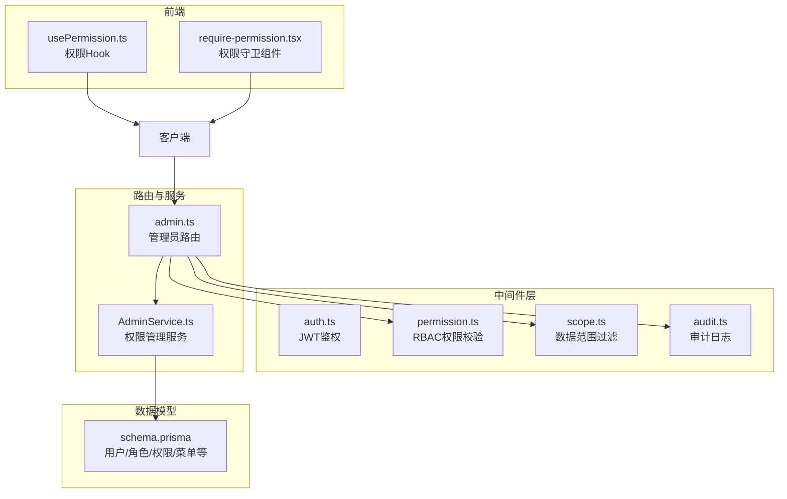
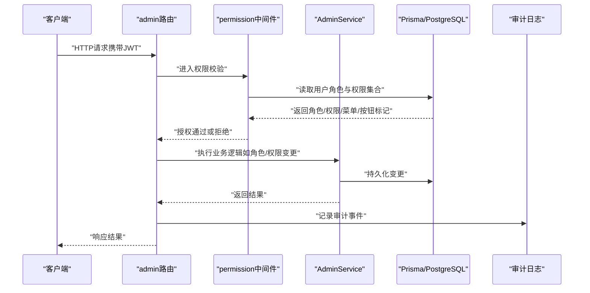
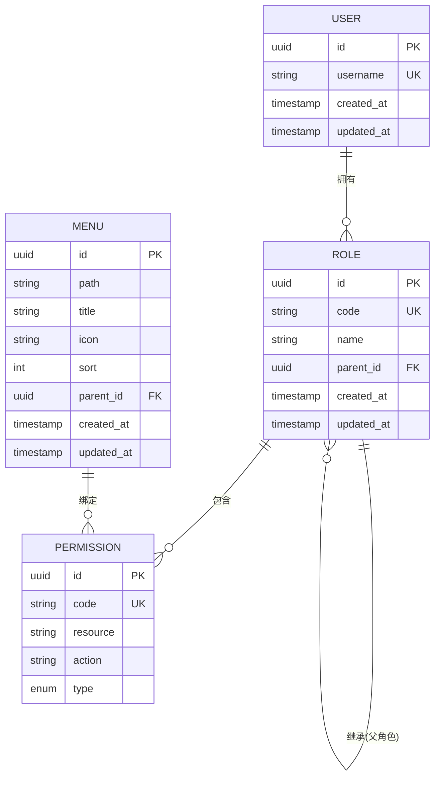
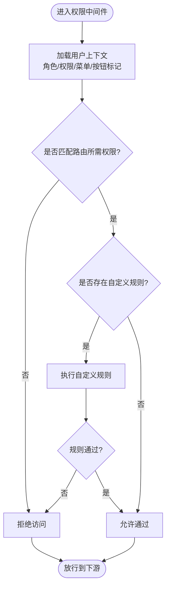
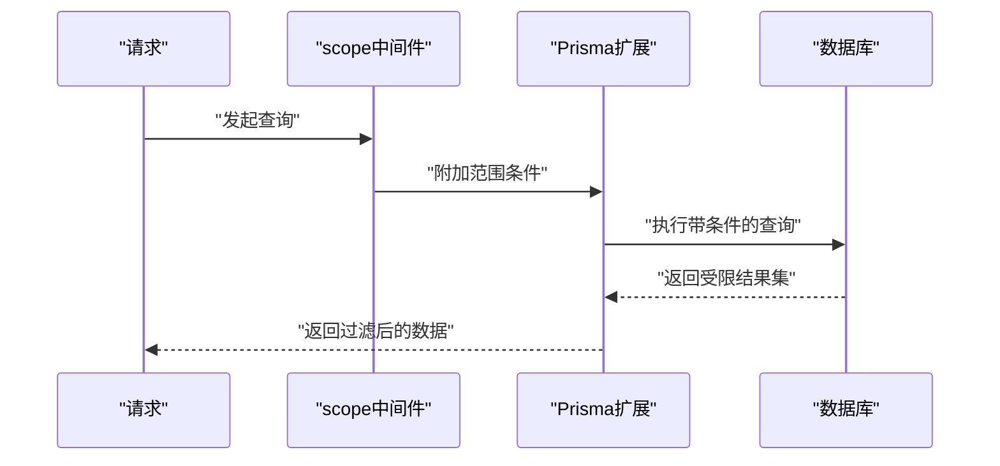
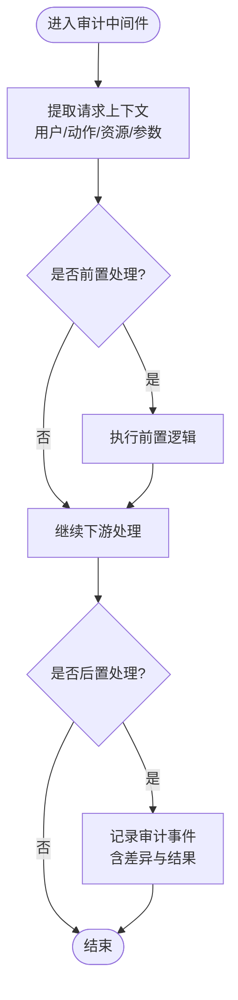
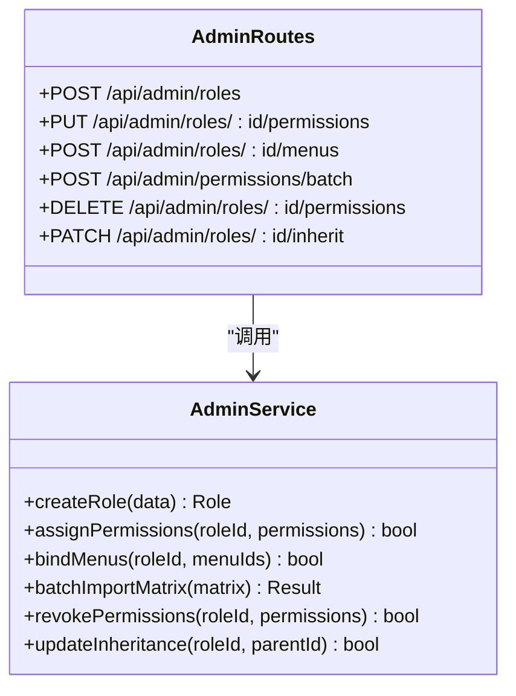
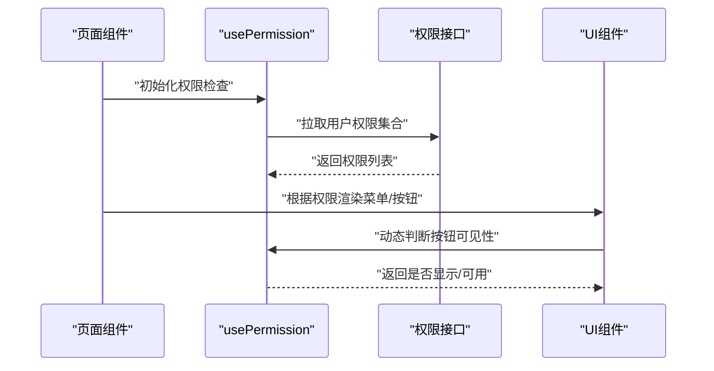
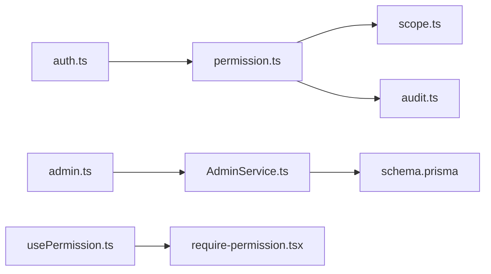

# 角色权限API

<cite>
**本文引用的文件**   
- [server/src/middleware/permission.ts](file://server/src/middleware/permission.ts)
- [server/src/middleware/auth.ts](file://server/src/middleware/auth.ts)
- [server/src/middleware/scope.ts](file://server/src/middleware/scope.ts)
- [server/src/middleware/audit.ts](file://server/src/middleware/audit.ts)
- [server/src/routes/admin.ts](file://server/src/routes/admin.ts)
- [server/src/services/AdminService.ts](file://server/src/services/AdminService.ts)
- [server/src/lib/jwt.ts](file://server/src/lib/jwt.ts)
- [server/src/lib/errors.ts](file://server/src/lib/errors.ts)
- [server/src/lib/response.ts](file://server/src/lib/response.ts)
- [server/prisma/schema.prisma](file://server/prisma/schema.prisma)
- [web/src/hooks/usePermission.ts](file://web/src/hooks/usePermission.ts)
- [web/src/components/layout/require-permission.tsx](file://web/src/components/layout/require-permission.tsx)
</cite>

## 目录
1. [简介](#简介)
2. [项目结构](#项目结构)
3. [核心组件](#核心组件)
4. [架构总览](#架构总览)
5. [详细组件分析](#详细组件分析)
6. [依赖关系分析](#依赖关系分析)
7. [性能考量](#性能考量)
8. [故障排查指南](#故障排查指南)
9. [结论](#结论)
10. [附录](#附录)

## 简介
本文件为“角色权限管理”的完整API文档，围绕RBAC（基于角色的访问控制）模型，覆盖角色创建、权限分配、权限继承、菜单权限、按钮权限、数据权限控制机制，以及权限验证中间件使用、自定义权限规则实现、权限矩阵管理与批量配置接口。同时说明权限缓存策略与实时更新机制，并给出权限变更审计追踪与安全控制要点。

后端技术栈：Express 4 + Prisma 5 + PostgreSQL 15 + JWT（access 15分钟 + refresh 7天轮转）。中间件执行链顺序：helmet → cors → express.json → rate-limit → auth(JWT+黑名单) → permission(默认拒绝) → scope(Prisma extension) → softDelete → audit → Service → Prisma → PostgreSQL。

## 项目结构
与权限相关的核心代码分布在以下位置：
- 中间件层：鉴权、权限校验、数据范围、审计
- 路由与服务层：管理员接口、权限相关服务
- 数据模型：Prisma schema定义权限相关实体
- 前端：权限Hook与组件封装，用于菜单/按钮级控制

图表来源
- [server/src/middleware/auth.ts](file://server/src/middleware/auth.ts)
- [server/src/middleware/permission.ts](file://server/src/middleware/permission.ts)
- [server/src/middleware/scope.ts](file://server/src/middleware/scope.ts)
- [server/src/middleware/audit.ts](file://server/src/middleware/audit.ts)
- [server/src/routes/admin.ts](file://server/src/routes/admin.ts)
- [server/src/services/AdminService.ts](file://server/src/services/AdminService.ts)
- [server/prisma/schema.prisma](file://server/prisma/schema.prisma)
- [web/src/hooks/usePermission.ts](file://web/src/hooks/usePermission.ts)
- [web/src/components/layout/require-permission.tsx](file://web/src/components/layout/require-permission.tsx)

章节来源
- [server/src/middleware/auth.ts](file://server/src/middleware/auth.ts)
- [server/src/middleware/permission.ts](file://server/src/middleware/permission.ts)
- [server/src/middleware/scope.ts](file://server/src/middleware/scope.ts)
- [server/src/middleware/audit.ts](file://server/src/middleware/audit.ts)
- [server/src/routes/admin.ts](file://server/src/routes/admin.ts)
- [server/src/services/AdminService.ts](file://server/src/services/AdminService.ts)
- [server/prisma/schema.prisma](file://server/prisma/schema.prisma)
- [web/src/hooks/usePermission.ts](file://web/src/hooks/usePermission.ts)
- [web/src/components/layout/require-permission.tsx](file://web/src/components/layout/require-permission.tsx)

## 核心组件
- 鉴权中间件（auth）：解析JWT、校验签名与过期时间、维护黑名单，将用户上下文注入请求对象。
- 权限中间件（permission）：默认拒绝策略，按资源标识与操作类型进行RBAC校验，支持菜单/按钮/数据权限标记。
- 数据范围中间件（scope）：通过Prisma扩展对查询结果进行租户/组织/部门维度过滤。
- 审计中间件（audit）：记录关键操作的主体、动作、资源、结果与差异，便于追溯。
- 管理员路由与服务（admin + AdminService）：提供角色、权限、菜单、数据范围的CRUD与批量配置接口。
- 前端权限能力（usePermission + require-permission）：在页面与组件层面做菜单与按钮级显隐控制。

章节来源
- [server/src/middleware/auth.ts](file://server/src/middleware/auth.ts)
- [server/src/middleware/permission.ts](file://server/src/middleware/permission.ts)
- [server/src/middleware/scope.ts](file://server/src/middleware/scope.ts)
- [server/src/middleware/audit.ts](file://server/src/middleware/audit.ts)
- [server/src/routes/admin.ts](file://server/src/routes/admin.ts)
- [server/src/services/AdminService.ts](file://server/src/services/AdminService.ts)
- [web/src/hooks/usePermission.ts](file://web/src/hooks/usePermission.ts)
- [web/src/components/layout/require-permission.tsx](file://web/src/components/layout/require-permission.tsx)

## 架构总览
权限校验的整体流程如下：

图表来源
- [server/src/routes/admin.ts](file://server/src/routes/admin.ts)
- [server/src/middleware/permission.ts](file://server/src/middleware/permission.ts)
- [server/src/services/AdminService.ts](file://server/src/services/AdminService.ts)
- [server/prisma/schema.prisma](file://server/prisma/schema.prisma)
- [server/src/middleware/audit.ts](file://server/src/middleware/audit.ts)

## 详细组件分析

### RBAC权限模型与数据模型
- 角色（Role）：抽象一组权限集合，支持层级继承（父角色→子角色）。
- 权限（Permission）：细粒度操作标识，如“菜单:查看”、“按钮:编辑”。
- 菜单（Menu）：导航树节点，绑定权限标识，用于前端菜单渲染。
- 用户-角色-权限关联：用户可拥有多个角色，角色可包含多个权限；支持继承聚合。

图表来源
- [server/prisma/schema.prisma](file://server/prisma/schema.prisma)

章节来源
- [server/prisma/schema.prisma](file://server/prisma/schema.prisma)

### 权限验证中间件（permission）
- 默认拒绝策略：未显式授权的请求一律拒绝。
- 校验维度：
  - 菜单权限：根据当前用户角色聚合的菜单标识决定是否展示入口。
  - 按钮权限：根据操作标识决定按钮是否可用。
  - 数据权限：结合scope中间件，按组织/部门/公司维度过滤数据。
- 自定义规则：可在中间件中注册规则函数，按业务场景扩展判断逻辑。

图表来源
- [server/src/middleware/permission.ts](file://server/src/middleware/permission.ts)

章节来源
- [server/src/middleware/permission.ts](file://server/src/middleware/permission.ts)

### 数据范围中间件（scope）
- 通过Prisma扩展注入where条件，限制查询结果的数据范围。
- 常见范围：租户ID、组织ID、部门ID、公司ID等。
- 与权限联动：不同角色/岗位对应不同的数据范围策略。

图表来源
- [server/src/middleware/scope.ts](file://server/src/middleware/scope.ts)

章节来源
- [server/src/middleware/scope.ts](file://server/src/middleware/scope.ts)

### 审计中间件（audit）
- 记录关键操作的主体、动作、资源、结果与差异。
- 支持敏感字段脱敏输出，避免泄露。
- 与权限变更联动：角色/权限/菜单变更均生成审计事件。

图表来源
- [server/src/middleware/audit.ts](file://server/src/middleware/audit.ts)

章节来源
- [server/src/middleware/audit.ts](file://server/src/middleware/audit.ts)

### 管理员路由与服务（admin + AdminService）
- 管理员路由暴露权限相关API端点，包括角色、权限、菜单、用户-角色分配的CRUD与批量操作。
- AdminService封装权限业务逻辑：
  - 角色创建与继承设置
  - 权限分配与撤销
  - 菜单绑定与排序
  - 批量导入权限矩阵
  - 权限变更触发缓存失效与审计事件

图表来源
- [server/src/routes/admin.ts](file://server/src/routes/admin.ts)
- [server/src/services/AdminService.ts](file://server/src/services/AdminService.ts)

章节来源
- [server/src/routes/admin.ts](file://server/src/routes/admin.ts)
- [server/src/services/AdminService.ts](file://server/src/services/AdminService.ts)

### 前端权限能力（usePermission + require-permission）
- usePermission Hook：从本地状态或接口获取用户权限集合，提供hasPermission/isVisible等方法。
- require-permission组件：在组件级别根据权限控制渲染与交互，常用于按钮显隐与禁用。

图表来源
- [web/src/hooks/usePermission.ts](file://web/src/hooks/usePermission.ts)
- [web/src/components/layout/require-permission.tsx](file://web/src/components/layout/require-permission.tsx)

章节来源
- [web/src/hooks/usePermission.ts](file://web/src/hooks/usePermission.ts)
- [web/src/components/layout/require-permission.tsx](file://web/src/components/layout/require-permission.tsx)

## 依赖关系分析
- 中间件依赖：
  - permission依赖auth提供的用户上下文（角色/权限/菜单/按钮标记）。
  - scope依赖Prisma扩展注入where条件。
  - audit依赖错误与响应工具进行标准化输出与脱敏。
- 路由与服务依赖：
  - admin路由依赖AdminService进行权限相关业务处理。
  - AdminService依赖Prisma与数据库进行持久化。
- 前端依赖：
  - usePermission依赖权限接口与本地状态管理。
  - require-permission依赖usePermission进行权限判断。

图表来源
- [server/src/middleware/auth.ts](file://server/src/middleware/auth.ts)
- [server/src/middleware/permission.ts](file://server/src/middleware/permission.ts)
- [server/src/middleware/scope.ts](file://server/src/middleware/scope.ts)
- [server/src/middleware/audit.ts](file://server/src/middleware/audit.ts)
- [server/src/routes/admin.ts](file://server/src/routes/admin.ts)
- [server/src/services/AdminService.ts](file://server/src/services/AdminService.ts)
- [server/prisma/schema.prisma](file://server/prisma/schema.prisma)
- [web/src/hooks/usePermission.ts](file://web/src/hooks/usePermission.ts)
- [web/src/components/layout/require-permission.tsx](file://web/src/components/layout/require-permission.tsx)

章节来源
- [server/src/middleware/auth.ts](file://server/src/middleware/auth.ts)
- [server/src/middleware/permission.ts](file://server/src/middleware/permission.ts)
- [server/src/middleware/scope.ts](file://server/src/middleware/scope.ts)
- [server/src/middleware/audit.ts](file://server/src/middleware/audit.ts)
- [server/src/routes/admin.ts](file://server/src/routes/admin.ts)
- [server/src/services/AdminService.ts](file://server/src/services/AdminService.ts)
- [server/prisma/schema.prisma](file://server/prisma/schema.prisma)
- [web/src/hooks/usePermission.ts](file://web/src/hooks/usePermission.ts)
- [web/src/components/layout/require-permission.tsx](file://web/src/components/layout/require-permission.tsx)

## 性能考量
- 权限缓存策略：
  - 建议对用户角色与权限集合进行短期缓存（内存或Redis），降低频繁查询数据库的压力。
  - 缓存键设计：以用户ID或会话ID为维度，附带版本戳以便失效控制。
- 实时权限更新机制：
  - 权限变更时主动失效相关缓存键，确保后续请求获取最新权限。
  - 对于高频读场景，可采用懒加载与预取策略，减少首屏延迟。
- 数据范围优化：
  - scope中间件应在Prisma层尽早注入where条件，避免全表扫描。
  - 针对大数据量查询，配合索引与分页策略提升性能。

[本节为通用指导，不直接分析具体文件]

## 故障排查指南
- 常见问题与定位：
  - 权限拒绝（403）：检查permission中间件的资源与操作标识是否匹配；确认用户角色与权限是否正确分配。
  - 数据范围异常：检查scope中间件的条件注入是否正确；确认用户上下文中的组织/部门信息是否完整。
  - 审计缺失：检查audit中间件是否被正确挂载；确认敏感字段脱敏规则是否符合预期。
- 错误处理：
  - 统一错误响应格式，便于前端解析与提示。
  - 记录详细错误日志，包含请求ID、用户ID、资源与操作、失败原因。

章节来源
- [server/src/lib/errors.ts](file://server/src/lib/errors.ts)
- [server/src/lib/response.ts](file://server/src/lib/response.ts)

## 结论
本权限体系以RBAC为核心，结合菜单、按钮与数据权限的多维控制，提供了完整的角色创建、权限分配、继承与批量配置能力。通过中间件链实现默认拒绝、安全校验与审计追踪，保障系统的安全性与可追溯性。前端通过Hook与组件封装，简化权限控制的使用复杂度。建议在高频场景引入权限缓存与实时失效机制，进一步提升性能与一致性。

[本节为总结性内容，不直接分析具体文件]

## 附录
- JWT与鉴权：
  - access token有效期短（15分钟），refresh token有效期长（7天），支持轮转与黑名单管理。
  - 鉴权中间件负责解析与校验，确保请求合法性。

章节来源
- [server/src/lib/jwt.ts](file://server/src/lib/jwt.ts)
- [server/src/middleware/auth.ts](file://server/src/middleware/auth.ts)