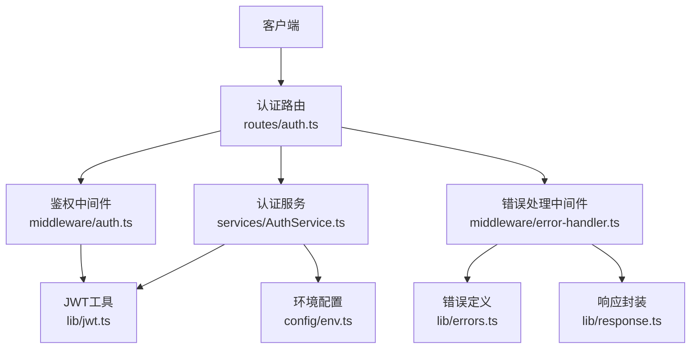
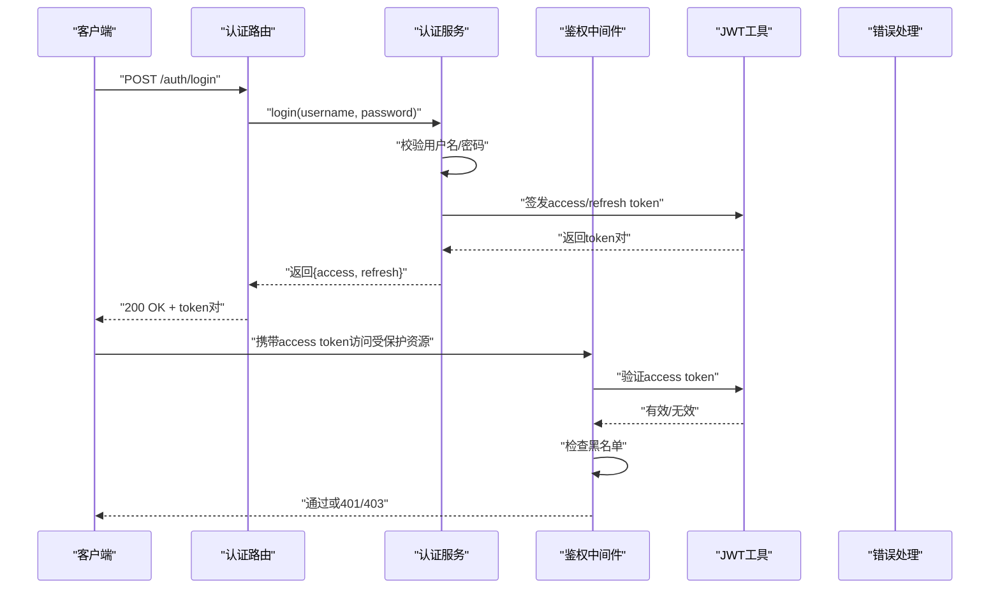
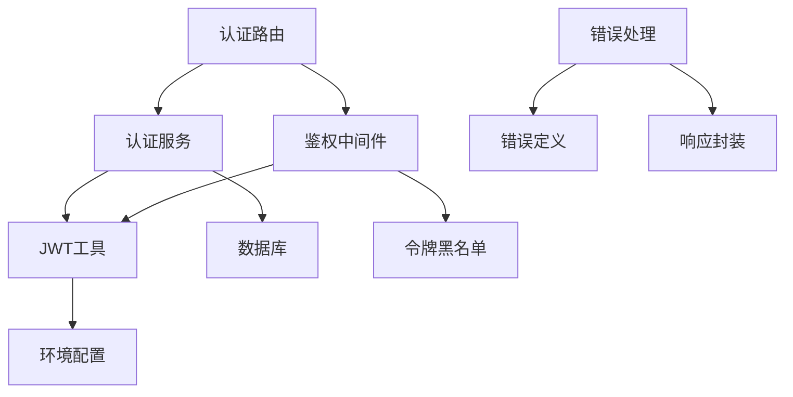

# 认证API

<cite>
**本文引用的文件**   
- [server/src/routes/auth.ts](file://server/src/routes/auth.ts)
- [server/src/services/AuthService.ts](file://server/src/services/AuthService.ts)
- [server/src/middleware/auth.ts](file://server/src/middleware/auth.ts)
- [server/src/lib/jwt.ts](file://server/src/lib/jwt.ts)
- [server/src/config/env.ts](file://server/src/config/env.ts)
- [server/src/lib/errors.ts](file://server/src/lib/errors.ts)
- [server/src/lib/response.ts](file://server/src/lib/response.ts)
- [server/src/middleware/error-handler.ts](file://server/src/middleware/error-handler.ts)
- [web/src/stores/authStore.ts](file://web/src/stores/authStore.ts)
- [web/src/hooks/useAuth.ts](file://web/src/hooks/useAuth.ts)
- [web/src/pages/login/index.tsx](file://web/src/pages/login/index.tsx)
</cite>

## 目录
1. [简介](#简介)
2. [项目结构](#项目结构)
3. [核心组件](#核心组件)
4. [架构总览](#架构总览)
5. [详细组件分析](#详细组件分析)
6. [依赖关系分析](#依赖关系分析)
7. [性能考虑](#性能考虑)
8. [故障排查指南](#故障排查指南)
9. [结论](#结论)
10. [附录](#附录)

## 简介
本文件为FY200认证系统的API文档，覆盖用户登录、登出、令牌刷新等全部认证相关接口。系统采用JWT双令牌机制：access token有效期15分钟，refresh token有效期7天；支持令牌黑名单与轮转策略，确保会话安全与用户体验的平衡。中间件执行链顺序为：helmet → cors → express.json → rate-limit → auth(JWT+黑名单) → permission(默认拒绝) → scope(Prisma extension) → softDelete → audit → Service → Prisma → PostgreSQL。

## 项目结构
认证功能由路由层、服务层、中间件与工具库共同实现：
- 路由层：定义认证相关HTTP端点
- 服务层：封装认证业务逻辑（校验、签发、刷新、登出）
- 中间件：鉴权、权限、范围、审计等
- 工具库：JWT签发/验证、错误处理、响应封装、环境变量配置



**图表来源** 
- [server/src/routes/auth.ts](file://server/src/routes/auth.ts)
- [server/src/services/AuthService.ts](file://server/src/services/AuthService.ts)
- [server/src/middleware/auth.ts](file://server/src/middleware/auth.ts)
- [server/src/lib/jwt.ts](file://server/src/lib/jwt.ts)
- [server/src/config/env.ts](file://server/src/config/env.ts)
- [server/src/middleware/error-handler.ts](file://server/src/middleware/error-handler.ts)
- [server/src/lib/errors.ts](file://server/src/lib/errors.ts)
- [server/src/lib/response.ts](file://server/src/lib/response.ts)

**章节来源**
- [server/src/routes/auth.ts](file://server/src/routes/auth.ts)
- [server/src/services/AuthService.ts](file://server/src/services/AuthService.ts)
- [server/src/middleware/auth.ts](file://server/src/middleware/auth.ts)
- [server/src/lib/jwt.ts](file://server/src/lib/jwt.ts)
- [server/src/config/env.ts](file://server/src/config/env.ts)
- [server/src/middleware/error-handler.ts](file://server/src/middleware/error-handler.ts)
- [server/src/lib/errors.ts](file://server/src/lib/errors.ts)
- [server/src/lib/response.ts](file://server/src/lib/response.ts)

## 核心组件
- 认证路由：提供登录、登出、刷新令牌等HTTP端点
- 认证服务：实现密码校验、令牌签发与刷新、黑名单管理、会话控制
- 鉴权中间件：解析并验证access token，检查黑名单，注入用户上下文
- JWT工具：生成/解码JWT，设置过期时间，签名算法与密钥管理
- 错误处理：统一错误码、错误消息与响应格式
- 响应封装：标准化成功/失败响应结构

**章节来源**
- [server/src/routes/auth.ts](file://server/src/routes/auth.ts)
- [server/src/services/AuthService.ts](file://server/src/services/AuthService.ts)
- [server/src/middleware/auth.ts](file://server/src/middleware/auth.ts)
- [server/src/lib/jwt.ts](file://server/src/lib/jwt.ts)
- [server/src/lib/errors.ts](file://server/src/lib/errors.ts)
- [server/src/lib/response.ts](file://server/src/lib/response.ts)

## 架构总览
下图展示认证请求从客户端到服务层的完整调用链，包括鉴权中间件与错误处理流程。



**图表来源** 
- [server/src/routes/auth.ts](file://server/src/routes/auth.ts)
- [server/src/services/AuthService.ts](file://server/src/services/AuthService.ts)
- [server/src/middleware/auth.ts](file://server/src/middleware/auth.ts)
- [server/src/lib/jwt.ts](file://server/src/lib/jwt.ts)
- [server/src/middleware/error-handler.ts](file://server/src/middleware/error-handler.ts)

## 详细组件分析

### 认证路由（/auth）
- POST /auth/login：用户登录，返回access与refresh token
- POST /auth/logout：用户登出，将当前refresh token加入黑名单
- POST /auth/refresh：使用refresh token刷新access token

请求参数验证：
- 登录：用户名、密码必填，长度与格式校验
- 登出：需携带有效的access token（用于识别当前会话）
- 刷新：需携带有效的refresh token

响应格式：
- 成功：{ code: 200, data: { access_token, refresh_token } }
- 失败：{ code: 错误码, message: "错误描述", details: {} }

错误处理：
- 用户名不存在：401 Unauthorized
- 密码错误：401 Unauthorized
- 令牌过期：401 Unauthorized
- 令牌被吊销：403 Forbidden

**章节来源**
- [server/src/routes/auth.ts](file://server/src/routes/auth.ts)
- [server/src/lib/response.ts](file://server/src/lib/response.ts)
- [server/src/lib/errors.ts](file://server/src/lib/errors.ts)

### 认证服务（AuthService）
核心职责：
- 用户凭证校验：查询数据库，验证用户名与密码哈希
- 令牌签发：生成15分钟过期的access token与7天过期的refresh token
- 令牌刷新：验证refresh token有效性，签发新的access token
- 黑名单管理：将登出的refresh token加入黑名单，防止重用
- 会话控制：维护用户会话状态，支持多设备登录限制

数据流：
1. 登录：接收凭证 → 校验用户 → 签发令牌 → 返回结果
2. 刷新：接收refresh token → 验证有效性 → 检查黑名单 → 签发新access token
3. 登出：接收access token → 提取refresh token → 加入黑名单 → 返回成功

复杂度分析：
- 用户查询：O(1)（索引优化）
- 令牌验证：O(1)（JWT无状态验证）
- 黑名单检查：O(log n)（有序集合）或O(1)（哈希表）

**章节来源**
- [server/src/services/AuthService.ts](file://server/src/services/AuthService.ts)
- [server/src/lib/jwt.ts](file://server/src/lib/jwt.ts)

### 鉴权中间件（auth）
功能说明：
- 解析请求头中的Authorization字段
- 验证access token签名与过期时间
- 检查令牌是否在黑名单中
- 将用户信息注入请求上下文

执行时机：在路由处理器之前执行，确保所有受保护路由都有鉴权保护。

错误处理：
- 缺少Authorization头：401 Unauthorized
- 令牌无效：401 Unauthorized  
- 令牌已过期：401 Unauthorized
- 令牌在黑名单中：403 Forbidden

**章节来源**
- [server/src/middleware/auth.ts](file://server/src/middleware/auth.ts)
- [server/src/lib/jwt.ts](file://server/src/lib/jwt.ts)

### JWT工具（jwt.ts）
实现要点：
- 使用HS256算法进行签名
- access token：15分钟过期，包含用户ID、角色、权限等信息
- refresh token：7天过期，包含用户ID、会话ID、创建时间等
- 支持令牌扩展：可添加自定义声明字段
- 密钥管理：从环境变量读取，支持主备密钥轮换

安全性考虑：
- 密钥长度至少256位
- 定期轮换密钥
- 禁止在token中存储敏感信息
- 支持令牌撤销机制

**章节来源**
- [server/src/lib/jwt.ts](file://server/src/lib/jwt.ts)
- [server/src/config/env.ts](file://server/src/config/env.ts)

### 错误处理（errors.ts & error-handler.ts）
错误分类：
- 认证错误：401 Unauthorized（凭证无效、令牌过期）
- 授权错误：403 Forbidden（权限不足、令牌被吊销）
- 业务错误：400 Bad Request（参数验证失败）
- 服务器错误：500 Internal Server Error（内部异常）

响应格式标准化：
```json
{
  "code": 401,
  "message": "用户名或密码错误",
  "details": {
    "field": "password",
    "reason": "invalid_credentials"
  }
}
```

**章节来源**
- [server/src/lib/errors.ts](file://server/src/lib/errors.ts)
- [server/src/middleware/error-handler.ts](file://server/src/middleware/error-handler.ts)
- [server/src/lib/response.ts](file://server/src/lib/response.ts)

## 依赖关系分析
认证模块的依赖关系如下：



**图表来源** 
- [server/src/routes/auth.ts](file://server/src/routes/auth.ts)
- [server/src/services/AuthService.ts](file://server/src/services/AuthService.ts)
- [server/src/middleware/auth.ts](file://server/src/middleware/auth.ts)
- [server/src/lib/jwt.ts](file://server/src/lib/jwt.ts)
- [server/src/lib/errors.ts](file://server/src/lib/errors.ts)
- [server/src/lib/response.ts](file://server/src/lib/response.ts)
- [server/src/config/env.ts](file://server/src/config/env.ts)

**章节来源**
- [server/src/routes/auth.ts](file://server/src/routes/auth.ts)
- [server/src/services/AuthService.ts](file://server/src/services/AuthService.ts)
- [server/src/middleware/auth.ts](file://server/src/middleware/auth.ts)
- [server/src/lib/jwt.ts](file://server/src/lib/jwt.ts)

## 性能考虑
- 令牌验证：JWT无状态验证，无需数据库查询，性能优异
- 黑名单检查：建议使用Redis等内存数据库，支持高并发访问
- 密码验证：使用bcrypt等安全哈希算法，注意计算开销
- 连接池：数据库连接池配置合理，避免连接泄漏
- 缓存策略：用户信息缓存，减少重复查询

优化建议：
- 实现令牌预取机制，在access token过期前自动刷新
- 使用连接池监控，及时发现连接问题
- 异步处理非关键操作，如审计日志记录

## 故障排查指南
常见问题及解决方案：

1. 登录失败
   - 检查用户名是否存在
   - 验证密码是否正确
   - 查看数据库连接状态
   - 检查密码哈希算法一致性

2. 令牌过期
   - 确认客户端是否正确存储和传递access token
   - 实现自动刷新机制
   - 检查服务器时间同步

3. 令牌被拒绝
   - 检查令牌是否在黑名单中
   - 验证令牌签名是否有效
   - 确认密钥配置正确

4. 权限错误
   - 检查用户角色和权限配置
   - 验证权限中间件配置
   - 确认路由权限设置

调试技巧：
- 启用详细日志记录
- 使用Postman测试API端点
- 检查浏览器开发者工具的Network面板
- 查看服务器错误日志

**章节来源**
- [server/src/middleware/error-handler.ts](file://server/src/middleware/error-handler.ts)
- [server/src/lib/errors.ts](file://server/src/lib/errors.ts)

## 结论
FY200认证系统采用现代化的JWT双令牌机制，提供了安全的身份验证和授权功能。通过合理的中间件设计、完善的错误处理和清晰的API文档，确保了系统的可维护性和可扩展性。建议在生产环境中实施以下最佳实践：

- 使用HTTPS传输所有认证相关请求
- 定期轮换JWT密钥
- 实施速率限制防止暴力破解
- 监控认证失败率和安全事件
- 实施多因素认证增强安全性

## 附录

### API端点参考

#### 用户登录
- 端点：POST /auth/login
- 请求体：
  ```json
  {
    "username": "string",
    "password": "string"
  }
  ```
- 成功响应：
  ```json
  {
    "code": 200,
    "data": {
      "access_token": "string",
      "refresh_token": "string",
      "expires_in": 900
    }
  }
  ```
- 错误响应：
  ```json
  {
    "code": 401,
    "message": "用户名或密码错误",
    "details": {
      "field": "password",
      "reason": "invalid_credentials"
    }
  }
  ```

#### 用户登出
- 端点：POST /auth/logout
- 请求头：Authorization: Bearer <access_token>
- 成功响应：
  ```json
  {
    "code": 200,
    "message": "登出成功"
  }
  ```

#### 刷新令牌
- 端点：POST /auth/refresh
- 请求体：
  ```json
  {
    "refresh_token": "string"
  }
  ```
- 成功响应：
  ```json
  {
    "code": 200,
    "data": {
      "access_token": "string",
      "expires_in": 900
    }
  }
  ```

### 客户端集成指南

#### React应用集成
使用authStore管理认证状态：
- 存储令牌到localStorage或sessionStorage
- 实现拦截器自动附加Authorization头
- 处理401响应自动刷新令牌
- 实现令牌过期检测

#### Vue应用集成
使用useAuth钩子：
- 响应式认证状态管理
- 自动路由守卫
- 权限控制组件
- 令牌生命周期管理

### 安全最佳实践

#### 令牌安全
- 使用HTTPS传输令牌
- 设置适当的Cookie属性（HttpOnly, Secure, SameSite）
- 实现令牌绑定IP或设备指纹
- 定期轮换密钥

#### 密码安全
- 使用bcrypt等安全哈希算法
- 实施密码强度验证
- 支持密码重置功能
- 记录登录尝试次数

#### 会话管理
- 实现会话超时机制
- 支持单设备登录限制
- 提供强制登出功能
- 监控异常登录行为

**章节来源**
- [web/src/stores/authStore.ts](file://web/src/stores/authStore.ts)
- [web/src/hooks/useAuth.ts](file://web/src/hooks/useAuth.ts)
- [web/src/pages/login/index.tsx](file://web/src/pages/login/index.tsx)
- [server/src/config/env.ts](file://server/src/config/env.ts)