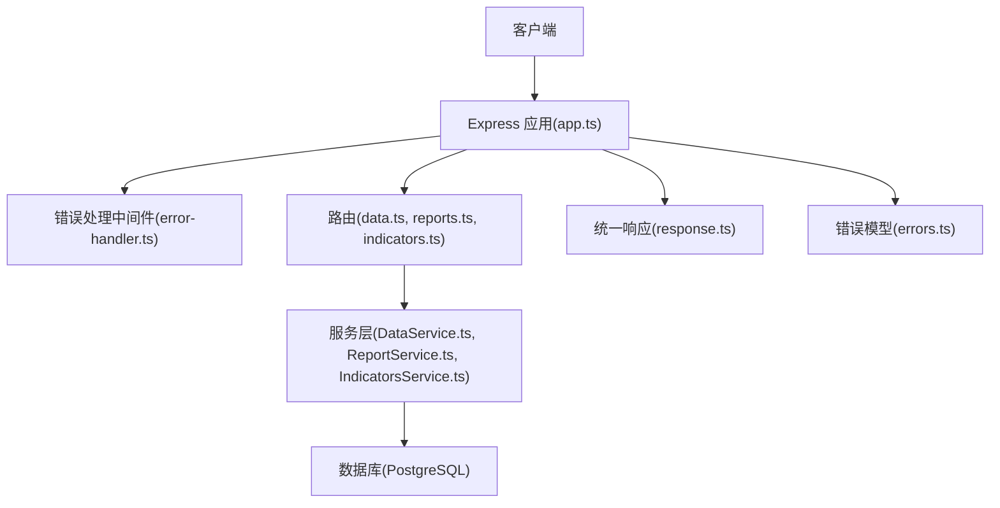
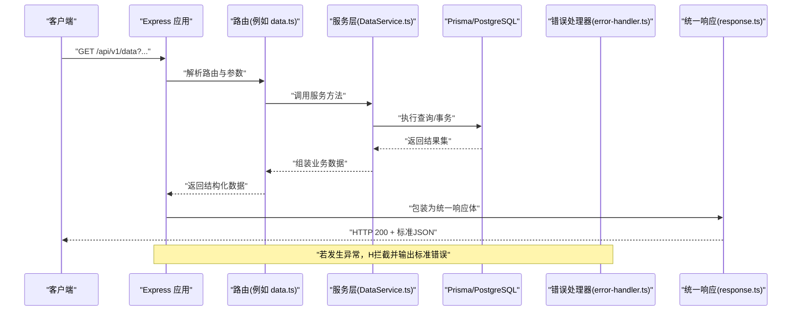
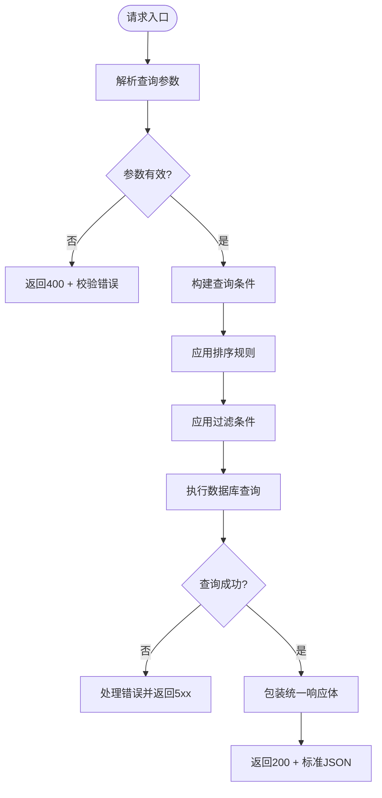
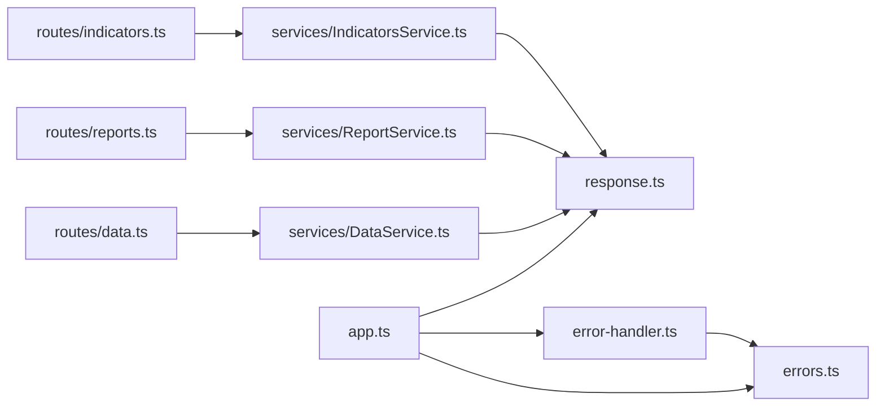

# 通用数据格式

<cite>
**本文引用的文件**   
- [server/src/lib/response.ts](file://server/src/lib/response.ts)
- [server/src/lib/errors.ts](file://server/src/lib/errors.ts)
- [server/src/middleware/error-handler.ts](file://server/src/middleware/error-handler.ts)
- [server/src/app.ts](file://server/src/app.ts)
- [server/src/routes/data.ts](file://server/src/routes/data.ts)
- [server/src/routes/reports.ts](file://server/src/routes/reports.ts)
- [server/src/routes/indicators.ts](file://server/src/routes/indicators.ts)
- [server/src/services/DataService.ts](file://server/src/services/DataService.ts)
- [server/src/services/ReportService.ts](file://server/src/services/ReportService.ts)
- [server/src/services/IndicatorsService.ts](file://server/src/services/IndicatorsService.ts)
- [web/src/lib/api.ts](file://web/src/lib/api.ts)
- [web/src/components/data-table/pagination.tsx](file://web/src/components/data-table/pagination.tsx)
</cite>

## 目录
1. [简介](#简介)
2. [项目结构](#项目结构)
3. [核心组件](#核心组件)
4. [架构总览](#架构总览)
5. [详细组件分析](#详细组件分析)
6. [依赖关系分析](#依赖关系分析)
7. [性能考虑](#性能考虑)
8. [故障排查指南](#故障排查指南)
9. [结论](#结论)
10. [附录](#附录)

## 简介
本规范定义 FY200 API 的通用数据格式与错误处理约定，覆盖统一响应体、分页结构、排序规则、过滤条件、错误码与异常类型、请求参数校验与默认值、API 版本管理与向后兼容、HTTP 状态码语义以及客户端集成最佳实践。目标是让前后端在接口契约上保持一致，降低集成成本并提升可维护性。

## 项目结构
FY200 后端采用 Express + Prisma + PostgreSQL，中间件链顺序为 helmet → cors → express.json → rate-limit → auth → permission → scope → softDelete → audit → Service → Prisma → PostgreSQL。通用响应封装位于 lib/response.ts，错误模型与抛出逻辑位于 lib/errors.ts，全局错误处理位于 middleware/error-handler.ts。各业务路由通过 routes/* 暴露，服务层 services/* 负责业务编排与数据访问。前端通过 web/src/lib/api.ts 发起请求并使用统一的错误处理策略。

图表来源
- [server/src/app.ts](file://server/src/app.ts)
- [server/src/middleware/error-handler.ts](file://server/src/middleware/error-handler.ts)
- [server/src/lib/response.ts](file://server/src/lib/response.ts)
- [server/src/lib/errors.ts](file://server/src/lib/errors.ts)
- [server/src/routes/data.ts](file://server/src/routes/data.ts)
- [server/src/routes/reports.ts](file://server/src/routes/reports.ts)
- [server/src/routes/indicators.ts](file://server/src/routes/indicators.ts)
- [server/src/services/DataService.ts](file://server/src/services/DataService.ts)
- [server/src/services/ReportService.ts](file://server/src/services/ReportService.ts)
- [server/src/services/IndicatorsService.ts](file://server/src/services/IndicatorsService.ts)

章节来源
- [server/src/app.ts](file://server/src/app.ts)
- [server/src/middleware/error-handler.ts](file://server/src/middleware/error-handler.ts)
- [server/src/lib/response.ts](file://server/src/lib/response.ts)
- [server/src/lib/errors.ts](file://server/src/lib/errors.ts)

## 核心组件
- 统一响应体：所有成功响应遵循一致的 JSON 结构，包含数据、分页元信息（如适用）、时间戳与追踪标识等。
- 错误模型：定义标准错误对象结构与错误码分类，便于前端一致化处理。
- 全局错误处理：捕获未处理异常与验证错误，输出标准化错误响应。
- 分页与排序：列表接口统一返回分页元信息与数据数组，支持页码、每页条数、排序字段与方向。
- 过滤条件：查询参数命名与类型约束明确，支持多条件组合与空值处理。

章节来源
- [server/src/lib/response.ts](file://server/src/lib/response.ts)
- [server/src/lib/errors.ts](file://server/src/lib/errors.ts)
- [server/src/middleware/error-handler.ts](file://server/src/middleware/error-handler.ts)

## 架构总览
下图展示一次典型的数据查询请求从客户端到数据库的调用链，以及统一响应与错误处理的介入点。

图表来源
- [server/src/app.ts](file://server/src/app.ts)
- [server/src/routes/data.ts](file://server/src/routes/data.ts)
- [server/src/services/DataService.ts](file://server/src/services/DataService.ts)
- [server/src/middleware/error-handler.ts](file://server/src/middleware/error-handler.ts)
- [server/src/lib/response.ts](file://server/src/lib/response.ts)

## 详细组件分析

### 统一响应格式
- 成功响应结构
  - code: 业务状态码（成功为固定值）
  - message: 人类可读消息
  - data: 业务数据（对象或数组）
  - pagination: 分页元信息（仅列表接口返回）
  - meta: 扩展元信息（可选，如时间戳、追踪ID）
- 分页结构
  - page: 当前页（从1开始）
  - pageSize: 每页条数
  - total: 总记录数
  - totalPages: 总页数
  - hasNext: 是否有下一页
  - hasPrev: 是否有上一页
- 排序规则
  - sort: 排序字段名
  - order: 排序方向（asc/desc）
- 过滤条件
  - 使用查询参数传递，键名与类型在路由或服务层明确定义
  - 空值与默认值在服务层处理，避免脏数据进入查询

章节来源
- [server/src/lib/response.ts](file://server/src/lib/response.ts)
- [server/src/routes/data.ts](file://server/src/routes/data.ts)
- [server/src/services/DataService.ts](file://server/src/services/DataService.ts)

### 错误处理与错误码
- 错误对象结构
  - code: 错误码（字符串或数字，建议字符串以区分领域）
  - message: 错误消息（用户可见）
  - details: 附加信息（可选，如字段级校验失败详情）
  - traceId: 追踪标识（用于日志定位）
- 错误码分类
  - 客户端错误（4xx）：参数校验失败、权限不足、资源不存在等
  - 服务端错误（5xx）：内部异常、第三方服务不可用、数据库连接失败等
  - 业务错误（自定义）：按模块划分，如 DATA_001、REPORT_001
- 异常类型
  - 参数校验异常：由输入校验器抛出
  - 权限异常：认证/授权失败
  - 业务异常：业务规则不满足
  - 系统异常：未预期错误
- 全局错误处理
  - 捕获未处理异常，输出标准错误响应
  - 记录结构化日志，包含请求上下文与堆栈（脱敏后）

章节来源
- [server/src/lib/errors.ts](file://server/src/lib/errors.ts)
- [server/src/middleware/error-handler.ts](file://server/src/middleware/error-handler.ts)

### 请求参数验证与数据类型约束
- 验证规则
  - 必填字段、类型、范围、格式（如日期、邮箱、URL）
  - 枚举值限制（如状态、类型）
  - 数组长度与元素类型
- 默认值处理
  - 分页默认值：page=1, pageSize=20
  - 排序默认值：sort=id, order=desc
  - 过滤条件默认值：空值表示不过滤
- 校验失败响应
  - HTTP 400
  - 错误码：VALIDATION_ERROR
  - details: 字段级错误详情

章节来源
- [server/src/routes/data.ts](file://server/src/routes/data.ts)
- [server/src/services/DataService.ts](file://server/src/services/DataService.ts)

### 分页、排序与过滤实现流程

图表来源
- [server/src/routes/data.ts](file://server/src/routes/data.ts)
- [server/src/services/DataService.ts](file://server/src/services/DataService.ts)
- [server/src/lib/response.ts](file://server/src/lib/response.ts)

### API 版本管理与向后兼容
- 版本策略
  - URL 路径前缀：/api/v1、/api/v2
  - 头部协商：Accept-Version（可选）
- 兼容性保证
  - 新增字段必须可选，不得破坏现有客户端
  - 废弃字段保留至少两个大版本
  - 变更需文档化并提供迁移指南
- 路由组织
  - 按版本拆分路由文件或使用版本控制器

章节来源
- [server/src/routes/data.ts](file://server/src/routes/data.ts)
- [server/src/routes/reports.ts](file://server/src/routes/reports.ts)
- [server/src/routes/indicators.ts](file://server/src/routes/indicators.ts)

### HTTP 状态码使用规范
- 2xx 成功
  - 200 OK：常规成功
  - 201 Created：创建成功
  - 204 No Content：删除成功无响应体
- 4xx 客户端错误
  - 400 Bad Request：参数校验失败
  - 401 Unauthorized：未认证
  - 403 Forbidden：权限不足
  - 404 Not Found：资源不存在
- 5xx 服务端错误
  - 500 Internal Server Error：内部异常
  - 502 Bad Gateway：上游服务错误
  - 503 Service Unavailable：服务不可用

章节来源
- [server/src/middleware/error-handler.ts](file://server/src/middleware/error-handler.ts)

### 客户端集成最佳实践
- 请求封装
  - 统一 baseURL、超时、重试策略
  - 自动附加认证头与追踪ID
- 错误处理
  - 根据 HTTP 状态码与错误码分类处理
  - 用户友好提示与日志上报
  - 重试与降级策略
- 分页与排序
  - 前端表格组件绑定分页与排序状态
  - 防抖与节流优化查询频率

章节来源
- [web/src/lib/api.ts](file://web/src/lib/api.ts)
- [web/src/components/data-table/pagination.tsx](file://web/src/components/data-table/pagination.tsx)

## 依赖关系分析

图表来源
- [server/src/app.ts](file://server/src/app.ts)
- [server/src/lib/response.ts](file://server/src/lib/response.ts)
- [server/src/lib/errors.ts](file://server/src/lib/errors.ts)
- [server/src/middleware/error-handler.ts](file://server/src/middleware/error-handler.ts)
- [server/src/routes/data.ts](file://server/src/routes/data.ts)
- [server/src/routes/reports.ts](file://server/src/routes/reports.ts)
- [server/src/routes/indicators.ts](file://server/src/routes/indicators.ts)
- [server/src/services/DataService.ts](file://server/src/services/DataService.ts)
- [server/src/services/ReportService.ts](file://server/src/services/ReportService.ts)
- [server/src/services/IndicatorsService.ts](file://server/src/services/IndicatorsService.ts)

## 性能考虑
- 分页查询：避免全表扫描，合理使用索引
- 排序与过滤：限制复杂表达式，优先使用数据库原生能力
- 缓存策略：热点数据缓存（Redis），注意失效策略
- 异步处理：长耗时任务使用队列与异步处理
- 监控指标：QPS、延迟、错误率、数据库慢查询

## 故障排查指南
- 常见问题
  - 参数校验失败：检查请求参数类型与必填项
  - 权限不足：确认用户角色与资源权限
  - 数据库连接失败：检查连接配置与网络
  - 第三方服务超时：调整超时与重试策略
- 调试技巧
  - 启用详细日志与追踪ID
  - 使用 Postman/curl 复现问题
  - 查看数据库慢查询日志
- 恢复措施
  - 重启服务（临时）
  - 回滚代码或配置
  - 扩容或降级

## 结论
本规范定义了 FY200 API 的统一数据格式与错误处理机制，确保前后端协作高效、稳定。通过标准化的响应体、错误码、分页排序过滤规则，以及严格的 HTTP 语义与版本管理策略，为系统的可扩展性与可维护性奠定基础。建议团队在开发中严格遵循本规范，并在变更时保持向后兼容。

## 附录
- 术语表
  - 统一响应体：标准化的成功响应结构
  - 错误码：用于标识错误类型的唯一标识符
  - 分页元信息：描述分页状态的附加数据
  - 追踪ID：用于请求链路追踪的唯一标识
- 参考实现
  - 后端：lib/response.ts、lib/errors.ts、middleware/error-handler.ts
  - 前端：web/src/lib/api.ts、web/src/components/data-table/pagination.tsx