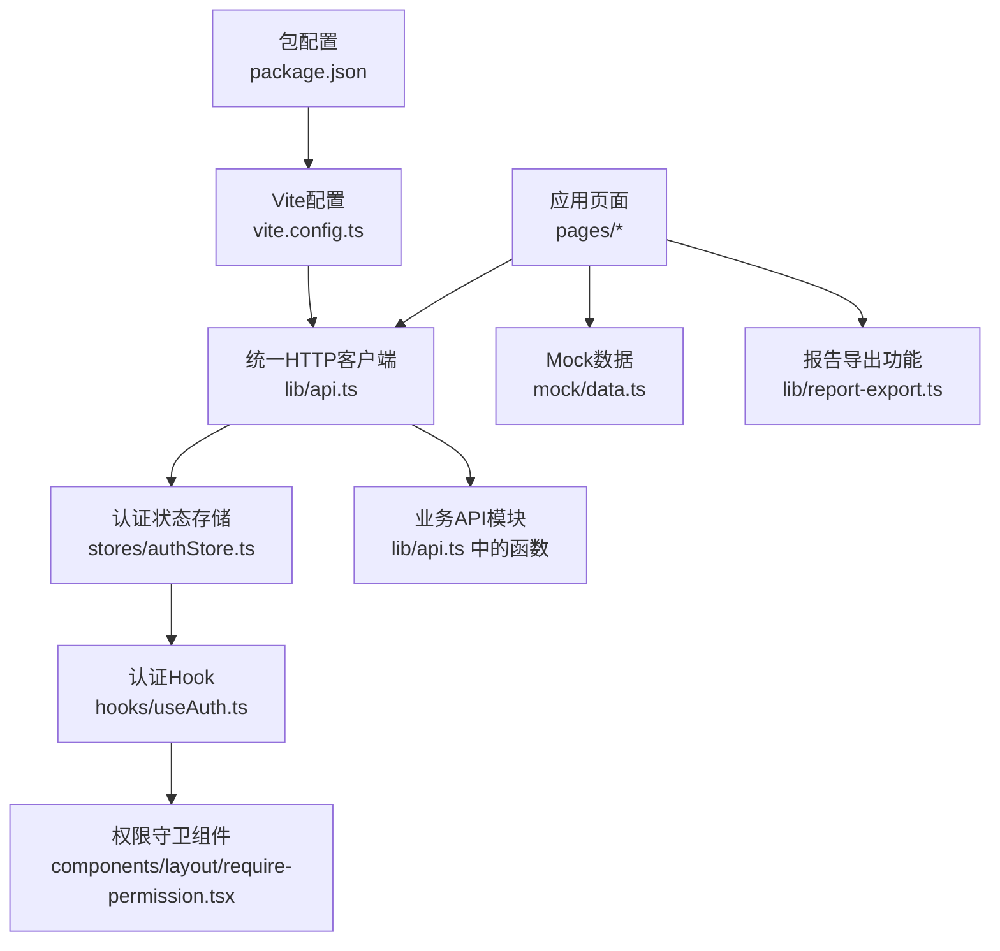
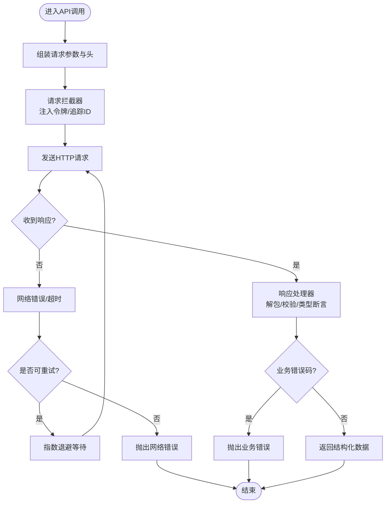
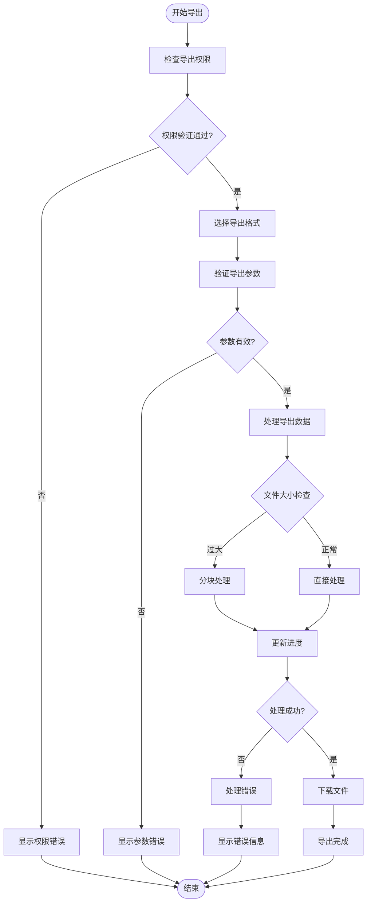
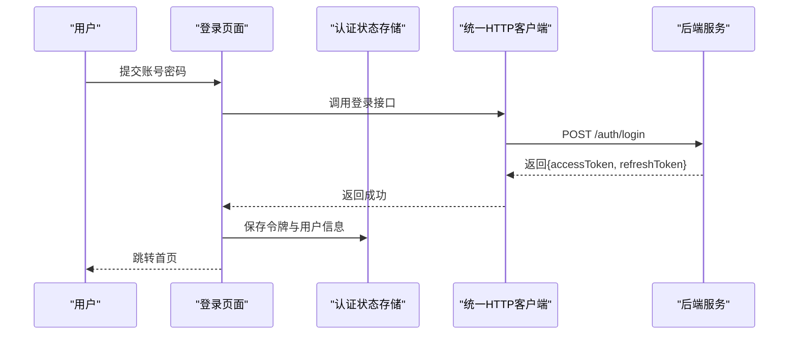
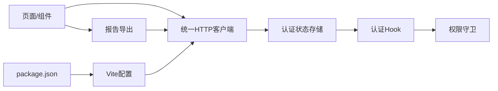

# API集成层

<cite>
**本文引用的文件**   
- [web/src/lib/api.ts](file://web/src/lib/api.ts)
- [web/src/lib/report-export.ts](file://web/src/lib/report-export.ts)
- [web/src/stores/authStore.ts](file://web/src/stores/authStore.ts)
- [web/src/hooks/useAuth.ts](file://web/src/hooks/useAuth.ts)
- [web/src/pages/login/index.tsx](file://web/src/pages/login/index.tsx)
- [web/src/components/layout/require-permission.tsx](file://web/src/components/layout/require-permission.tsx)
- [web/src/mock/data.ts](file://web/src/mock/data.ts)
- [web/vite.config.ts](file://web/vite.config.ts)
- [web/package.json](file://web/package.json)
</cite>

## 更新摘要
**所做更改**   
- 更新了报告导出功能章节，反映report-export.ts的显著增强（+32 -4行）
- 新增了导出格式改进和错误处理机制的详细说明
- 增强了API调用最佳实践中的文件导出相关指导
- 更新了故障排查指南以包含导出相关的常见问题

## 目录
1. [简介](#简介)
2. [项目结构](#项目结构)
3. [核心组件](#核心组件)
4. [架构总览](#架构总览)
5. [详细组件分析](#详细组件分析)
6. [依赖关系分析](#依赖关系分析)
7. [性能考虑](#性能考虑)
8. [故障排查指南](#故障排查指南)
9. [结论](#结论)
10. [附录](#附录)

## 简介
本技术文档聚焦于pj3项目的API集成层，围绕统一HTTP客户端、请求拦截器与响应处理器、错误重试机制、RESTful端点组织与管理、认证授权（JWT令牌管理、自动刷新、权限校验）、统一错误处理策略、调用最佳实践（请求优化、缓存、并发控制），以及API文档自动生成与Mock数据管理等主题进行系统化说明。目标是帮助开发者快速理解并高效扩展该层的实现与规范。

## 项目结构
API集成层主要位于前端工程 web 目录下，关键位置如下：
- 统一HTTP客户端与API封装：web/src/lib/api.ts
- 报告导出功能：web/src/lib/report-export.ts
- 认证状态与令牌管理：web/src/stores/authStore.ts
- 认证Hook与鉴权逻辑：web/src/hooks/useAuth.ts
- 登录页面与登录流程入口：web/src/pages/login/index.tsx
- 基于权限的布局守卫：web/src/components/layout/require-permission.tsx
- Mock数据与本地模拟：web/src/mock/data.ts
- Vite构建配置（代理、环境变量等）：web/vite.config.ts
- 依赖与脚本定义：web/package.json



图表来源
- [web/src/lib/api.ts](file://web/src/lib/api.ts)
- [web/src/lib/report-export.ts](file://web/src/lib/report-export.ts)
- [web/src/stores/authStore.ts](file://web/src/stores/authStore.ts)
- [web/src/hooks/useAuth.ts](file://web/src/hooks/useAuth.ts)
- [web/src/components/layout/require-permission.tsx](file://web/src/components/layout/require-permission.tsx)
- [web/src/mock/data.ts](file://web/src/mock/data.ts)
- [web/vite.config.ts](file://web/vite.config.ts)
- [web/package.json](file://web/package.json)

章节来源
- [web/src/lib/api.ts](file://web/src/lib/api.ts)
- [web/src/lib/report-export.ts](file://web/src/lib/report-export.ts)
- [web/src/stores/authStore.ts](file://web/src/stores/authStore.ts)
- [web/src/hooks/useAuth.ts](file://web/src/hooks/useAuth.ts)
- [web/src/components/layout/require-permission.tsx](file://web/src/components/layout/require-permission.tsx)
- [web/src/mock/data.ts](file://web/src/mock/data.ts)
- [web/vite.config.ts](file://web/vite.config.ts)
- [web/package.json](file://web/package.json)

## 核心组件
本节概述API集成层的关键能力与职责边界：
- 统一HTTP客户端：提供统一的请求发起、拦截器链、响应解析、错误分类与重试策略。
- 报告导出功能：支持多种导出格式（Excel、CSV、PDF），具备完善的错误处理和用户反馈机制。
- 认证与授权：集中管理JWT生命周期（获取、刷新、过期处理），并在请求前注入令牌；在路由/组件层进行权限校验。
- RESTful端点组织：按领域或资源划分API函数，遵循一致的URL命名与版本化策略。
- 错误处理：对网络异常、超时、业务错误码进行统一捕获与提示，支持可配置的重试与降级。
- 性能优化：请求去重、缓存、并发控制、分页与增量更新。
- 文档与Mock：通过约定生成类型与接口文档，结合Mock数据提升联调效率。

章节来源
- [web/src/lib/api.ts](file://web/src/lib/api.ts)
- [web/src/lib/report-export.ts](file://web/src/lib/report-export.ts)
- [web/src/stores/authStore.ts](file://web/src/stores/authStore.ts)
- [web/src/hooks/useAuth.ts](file://web/src/hooks/useAuth.ts)
- [web/src/components/layout/require-permission.tsx](file://web/src/components/layout/require-permission.tsx)
- [web/src/mock/data.ts](file://web/src/mock/data.ts)
- [web/vite.config.ts](file://web/vite.config.ts)
- [web/package.json](file://web/package.json)

## 架构总览
下图展示了从页面到后端的核心交互路径，包括认证注入、权限校验、请求拦截与错误处理。

```mermaid
sequenceDiagram
participant Page as "页面组件"
participant Hook as "useAuth"
participant Guard as "权限守卫"
participant Client as "统一HTTP客户端"
participant Export as "报告导出"
participant Store as "认证状态存储"
participant Server as "后端服务"
Page->>Guard : 访问受保护页面
Guard->>Hook : 检查登录态与权限
Hook-->>Guard : 返回鉴权结果
alt 未登录或无权限
Guard-->>Page : 跳转登录或拒绝访问
else 已授权
Page->>Client : 发起API调用
Client->>Store : 读取/刷新令牌
Client->>Server : 发送带令牌的请求
Server-->>Client : 返回响应或401
alt 401且可刷新
Client->>Store : 触发刷新流程
Store-->>Client : 返回新令牌
Client->>Server : 重试原请求
Server-->>Client : 返回成功响应
else 其他错误
Client-->>Page : 抛出统一错误对象
end
Note over Page,Export : 报告导出流程
Page->>Export : 触发导出操作
Export->>Client : 调用导出API
Client->>Server : 下载文件流
Server-->>Client : 返回文件数据
Client-->>Export : 处理文件数据
Export-->>Page : 完成导出
end
end
```

图表来源
- [web/src/lib/api.ts](file://web/src/lib/api.ts)
- [web/src/lib/report-export.ts](file://web/src/lib/report-export.ts)
- [web/src/stores/authStore.ts](file://web/src/stores/authStore.ts)
- [web/src/hooks/useAuth.ts](file://web/src/hooks/useAuth.ts)
- [web/src/components/layout/require-permission.tsx](file://web/src/components/layout/require-permission.tsx)

## 详细组件分析

### 统一HTTP客户端设计与实现
- 职责
  - 封装底层HTTP库，提供get/post/put/delete等方法。
  - 维护全局基础URL、默认头、超时、重试次数等配置。
  - 实现请求拦截器：注入认证令牌、请求ID、追踪信息。
  - 实现响应处理器：统一解包、类型断言、错误分类。
  - 错误重试：针对瞬时错误（如网络抖动、限流）进行指数退避重试。
  - 取消与防抖：支持AbortController取消重复请求，避免竞态。
- 设计要点
  - 将“令牌注入”和“权限校验”解耦：客户端只负责令牌注入，权限由上层守卫决定。
  - 错误模型标准化：区分网络错误、超时、业务错误、服务端未知错误，并提供可读消息。
  - 可插拔拦截器：便于后续接入日志、埋点、A/B开关等。
- 典型调用流程
  - 页面调用API函数 -> 客户端拦截器注入令牌 -> 发送请求 -> 响应处理器解包 -> 业务层消费数据。



图表来源
- [web/src/lib/api.ts](file://web/src/lib/api.ts)

章节来源
- [web/src/lib/api.ts](file://web/src/lib/api.ts)

### 报告导出功能增强
**更新** 报告导出功能进行了显著增强，改进了导出格式支持和错误处理机制。

- 多格式导出支持
  - Excel格式：支持.xlsx和.xls格式，保留单元格格式和数据验证。
  - CSV格式：支持UTF-8编码，处理特殊字符和换行符。
  - PDF格式：支持报表模板和样式定制。
- 错误处理机制
  - 网络错误：连接失败、超时、跨域问题的统一处理。
  - 文件格式错误：检测文件类型、大小限制、编码问题。
  - 权限错误：导出权限校验失败的处理。
  - 用户友好提示：针对不同错误类型提供明确的提示信息。
- 性能优化
  - 大文件分块处理：避免内存溢出。
  - 进度反馈：实时显示导出进度。
  - 取消支持：允许用户中断长时间导出的操作。



图表来源
- [web/src/lib/report-export.ts](file://web/src/lib/report-export.ts)

章节来源
- [web/src/lib/report-export.ts](file://web/src/lib/report-export.ts)

### 认证与授权集成方案
- JWT令牌管理
  - 令牌获取：登录成功后保存至持久化存储与内存状态。
  - 令牌注入：请求拦截器自动附加Authorization头。
  - 令牌刷新：当服务端返回401且存在refresh token时，触发刷新流程并重试原请求。
  - 安全存储：敏感信息优先使用内存状态，必要时再落盘，注意XSS防护。
- 权限校验
  - 路由级守卫：在进入页面之前检查用户角色/权限。
  - 组件级守卫：在UI层根据权限渲染不同内容或禁用操作。
- 登录流程
  - 输入凭证 -> 调用登录API -> 保存令牌与用户信息 -> 跳转目标页。



图表来源
- [web/src/pages/login/index.tsx](file://web/src/pages/login/index.tsx)
- [web/src/stores/authStore.ts](file://web/src/stores/authStore.ts)
- [web/src/lib/api.ts](file://web/src/lib/api.ts)

章节来源
- [web/src/stores/authStore.ts](file://web/src/stores/authStore.ts)
- [web/src/hooks/useAuth.ts](file://web/src/hooks/useAuth.ts)
- [web/src/components/layout/require-permission.tsx](file://web/src/components/layout/require-permission.tsx)
- [web/src/pages/login/index.tsx](file://web/src/pages/login/index.tsx)
- [web/src/lib/api.ts](file://web/src/lib/api.ts)

### API端点的组织与管理
- 分层与命名
  - 按资源域划分API函数（如用户、订单、库存等），每个函数对应一个RESTful端点。
  - URL命名采用小写连字符风格，资源复数形式，层级不超过三层。
- 版本控制策略
  - 建议采用URL路径版本（/api/v1/...），向后兼容变更需升级版本号。
  - 废弃字段与接口保留过渡期，配合Header或查询参数控制行为。
- 请求与响应契约
  - 统一响应体结构：包含状态码、消息、数据体、追踪ID等。
  - 严格类型约束：为请求参数与响应数据定义TS类型，减少运行时错误。
- 示例（概念性）
  - GET /api/v1/users/:id
  - POST /api/v1/orders
  - PUT /api/v1/inventory/items/:sku
  - DELETE /api/v1/reports/:id

章节来源
- [web/src/lib/api.ts](file://web/src/lib/api.ts)

### 错误处理的统一策略
- 错误分类
  - 网络错误：连接失败、DNS解析错误、跨域问题。
  - 超时错误：请求超过最大等待时间。
  - 业务错误：服务端返回的业务错误码与消息。
  - 未知错误：无法识别的异常。
- 处理原则
  - 统一错误对象：包含错误码、消息、可选堆栈与追踪ID。
  - 用户可见提示：对可恢复错误给出友好文案，对致命错误记录日志。
  - 重试与降级：对幂等GET请求可自动重试；非幂等POST/PUT谨慎重试。
  - 401处理：尝试刷新令牌后重试一次；失败则登出并跳转登录。
- 监控与追踪
  - 为每次请求分配唯一追踪ID，贯穿前后端链路，便于定位问题。

章节来源
- [web/src/lib/api.ts](file://web/src/lib/api.ts)

### API调用最佳实践
- 请求优化
  - 请求去重：相同参数并发请求合并，避免重复网络开销。
  - 取消机制：组件卸载或路由切换时取消未完成请求。
  - 分页与增量：列表采用游标或偏移分页，局部更新而非全量替换。
- 缓存策略
  - 读多写少接口启用短期缓存，设置合理TTL与失效条件。
  - 写操作后主动失效相关缓存键，保证一致性。
- 并发控制
  - 限制同时进行的请求数量，防止雪崩。
  - 对高频接口做节流与防抖。
- 文件导出优化
  - 大文件分块处理，避免内存溢出。
  - 提供进度反馈和用户取消选项。
  - 支持异步导出任务，完成后通知用户。
- 可观测性
  - 记录关键指标：成功率、P95/P99延迟、错误分布。
  - 结合追踪ID关联前后端日志。

章节来源
- [web/src/lib/api.ts](file://web/src/lib/api.ts)
- [web/src/lib/report-export.ts](file://web/src/lib/report-export.ts)

### API文档自动生成与Mock数据管理
- 文档生成
  - 基于TypeScript类型与注释生成接口文档，确保代码与文档一致。
  - 将文档站点纳入CI，变更自动发布。
- Mock数据
  - 使用本地Mock数据与中间件拦截请求，加速开发联调。
  - 与真实API保持数据结构一致，降低切换成本。
- 环境切换
  - 通过环境变量切换API基地址与Mock开关。
  - 在开发环境开启代理转发，生产环境直连后端。

章节来源
- [web/src/mock/data.ts](file://web/src/mock/data.ts)
- [web/vite.config.ts](file://web/vite.config.ts)
- [web/package.json](file://web/package.json)

## 依赖关系分析
- 内部依赖
  - 页面与组件依赖统一HTTP客户端与认证Hook。
  - 认证Hook依赖认证状态存储。
  - 权限守卫依赖认证Hook提供的鉴权能力。
  - 报告导出功能依赖统一HTTP客户端进行文件下载。
- 外部依赖
  - HTTP客户端依赖浏览器原生Fetch或第三方库。
  - 构建与代理依赖Vite配置。
  - 包管理与脚本依赖package.json中定义的依赖与命令。



图表来源
- [web/src/lib/api.ts](file://web/src/lib/api.ts)
- [web/src/lib/report-export.ts](file://web/src/lib/report-export.ts)
- [web/src/stores/authStore.ts](file://web/src/stores/authStore.ts)
- [web/src/hooks/useAuth.ts](file://web/src/hooks/useAuth.ts)
- [web/src/components/layout/require-permission.tsx](file://web/src/components/layout/require-permission.tsx)
- [web/vite.config.ts](file://web/vite.config.ts)
- [web/package.json](file://web/package.json)

章节来源
- [web/src/lib/api.ts](file://web/src/lib/api.ts)
- [web/src/lib/report-export.ts](file://web/src/lib/report-export.ts)
- [web/src/stores/authStore.ts](file://web/src/stores/authStore.ts)
- [web/src/hooks/useAuth.ts](file://web/src/hooks/useAuth.ts)
- [web/src/components/layout/require-permission.tsx](file://web/src/components/layout/require-permission.tsx)
- [web/vite.config.ts](file://web/vite.config.ts)
- [web/package.json](file://web/package.json)

## 性能考虑
- 减少不必要请求：合并请求、按需加载、懒初始化。
- 合理缓存：利用浏览器缓存与服务端缓存头，缩短响应时间。
- 并发控制：限制并行度，避免阻塞主线程与网络队列。
- 传输优化：压缩、分片、增量更新、图片与静态资源CDN。
- 文件导出优化：
  - 大文件分块处理，避免内存溢出。
  - 使用Web Worker处理复杂的数据转换。
  - 支持断点续传和后台下载。
- 监控与压测：建立性能基线，持续跟踪回归。

[本节为通用指导，不直接分析具体文件]

## 故障排查指南
- 常见问题
  - 401未授权：检查令牌是否存在、是否过期、刷新流程是否正常。
  - 跨域错误：确认CORS配置与代理设置是否正确。
  - 超时：检查后端响应时间与客户端超时阈值。
  - 业务错误：对照错误码表定位原因，查看追踪ID关联日志。
  - 导出失败：检查文件格式支持、权限设置、文件大小限制。
- 定位步骤
  - 打开浏览器网络面板，查看请求头、响应体与状态码。
  - 检查控制台错误与自定义日志输出。
  - 使用追踪ID在后端日志中检索完整链路。
  - 对于导出问题，检查浏览器下载管理器和本地存储权限。
- 修复建议
  - 修正令牌刷新逻辑与重试策略。
  - 调整超时与重试参数，避免过度重试导致雪崩。
  - 完善错误提示与降级策略，提升用户体验。
  - 优化导出功能的错误处理和用户反馈机制。

章节来源
- [web/src/lib/api.ts](file://web/src/lib/api.ts)
- [web/src/lib/report-export.ts](file://web/src/lib/report-export.ts)
- [web/src/stores/authStore.ts](file://web/src/stores/authStore.ts)
- [web/src/hooks/useAuth.ts](file://web/src/hooks/useAuth.ts)
- [web/src/components/layout/require-permission.tsx](file://web/src/components/layout/require-permission.tsx)

## 结论
本API集成层通过统一HTTP客户端、拦截器与响应处理器实现了稳定的请求通道；结合JWT令牌管理与权限守卫构建了安全的认证授权体系；以标准化错误处理与重试策略提升了健壮性；并通过缓存、并发控制与可观测性保障了性能与可维护性。报告导出功能的增强进一步提升了用户体验，提供了更可靠的文件导出能力和更好的错误处理机制。建议在后续迭代中持续完善文档自动化与Mock治理，进一步提升研发效率与质量。

[本节为总结性内容，不直接分析具体文件]

## 附录
- 术语
  - 拦截器：在请求发出前或响应返回后执行的钩子函数。
  - 重试：对失败的请求在一定条件下再次发起。
  - 幂等：多次执行产生相同结果的请求（如GET）。
  - 导出：将数据转换为特定格式文件的过程。
- 参考
  - 后端接口规范与错误码定义请参考后端文档与错误码规范。
  - 并发与性能参考参见并发与性能文档。
  - 文件导出最佳实践参见前端开发指南。

[本节为补充信息，不直接分析具体文件]