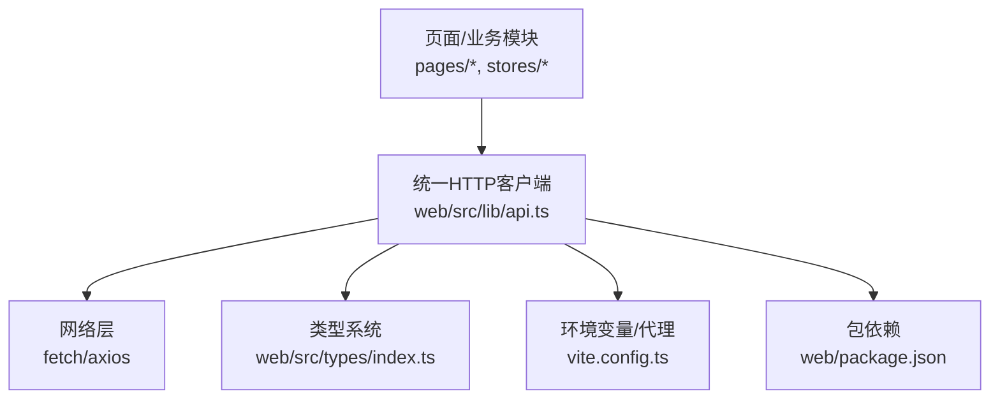
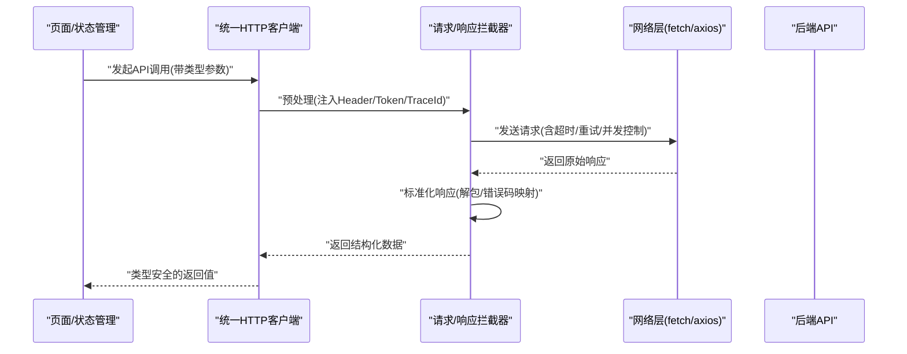
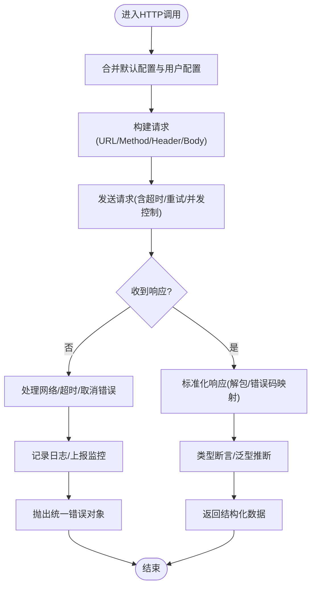
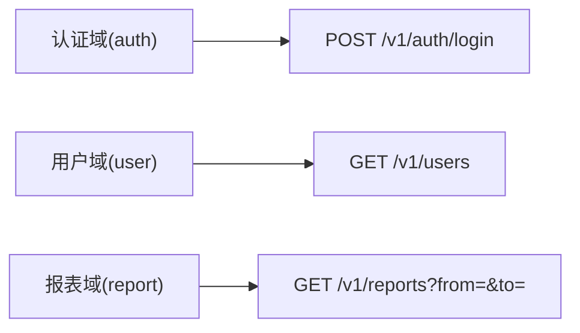
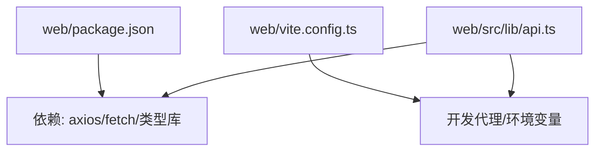

# HTTP客户端设计

<cite>
**本文引用的文件**   
- [web/src/lib/api.ts](file://web/src/lib/api.ts)
- [web/src/types/index.ts](file://web/src/types/index.ts)
- [web/package.json](file://web/package.json)
- [web/vite.config.ts](file://web/vite.config.ts)
- [web/src/pages/login/index.tsx](file://web/src/pages/login/index.tsx)
- [web/src/stores/authStore.ts](file://web/src/stores/authStore.ts)
</cite>

## 目录
1. [简介](#简介)
2. [项目结构](#项目结构)
3. [核心组件](#核心组件)
4. [架构总览](#架构总览)
5. [详细组件分析](#详细组件分析)
6. [依赖分析](#依赖分析)
7. [性能考虑](#性能考虑)
8. [故障排查指南](#故障排查指南)
9. [结论](#结论)
10. [附录](#附录)

## 简介
本文件面向pj3项目的HTTP客户端设计与实现，聚焦统一HTTP客户端的架构与核心能力：基于原生fetch或axios的请求封装、请求拦截器配置、响应数据标准化处理、RESTful API组织管理、版本控制策略、高级配置（超时、重试、并发控制）、TypeScript类型系统集成、错误处理与日志记录、以及性能监控等横切关注点。文档同时提供使用示例路径与最佳实践建议，帮助开发者以类型安全的方式调用API。

## 项目结构
本项目为前端应用，HTTP相关代码集中在lib层与类型定义中，并在页面与状态管理中消费。关键位置如下：
- web/src/lib/api.ts：统一HTTP客户端与API端点组织
- web/src/types/index.ts：全局类型定义（用于API入参与返回类型）
- web/package.json：运行时依赖（如axios/fetch环境）
- web/vite.config.ts：开发代理与构建配置（影响URL前缀与环境变量）
- web/src/pages/login/index.tsx：登录页面对HTTP客户端的使用示例
- web/src/stores/authStore.ts：认证状态管理与HTTP调用集成

图表来源
- [web/src/lib/api.ts](file://web/src/lib/api.ts)
- [web/src/types/index.ts](file://web/src/types/index.ts)
- [web/vite.config.ts](file://web/vite.config.ts)
- [web/package.json](file://web/package.json)

章节来源
- [web/src/lib/api.ts](file://web/src/lib/api.ts)
- [web/src/types/index.ts](file://web/src/types/index.ts)
- [web/package.json](file://web/package.json)
- [web/vite.config.ts](file://web/vite.config.ts)

## 核心组件
- 统一HTTP客户端
  - 职责：封装底层网络库（fetch或axios），提供一致的请求/响应接口；集中处理请求头、鉴权、超时、重试、错误转换、响应标准化。
  - 典型能力：
    - 请求拦截器：注入Token、追踪ID、基础URL、Content-Type等
    - 响应拦截器：统一解包业务数据、错误码映射、类型断言辅助
    - 配置项：超时、重试次数、退避策略、并发限制
- API端点组织
  - 按领域/资源划分模块，遵循RESTful命名约定，统一版本前缀
  - 导出类型安全的函数式API，绑定入参与返回类型
- 类型系统集成
  - 通过泛型与联合类型约束入参与返回结构，确保编译期类型安全
- 横切关注点
  - 错误处理：网络异常、业务错误码、超时、取消、重复提交防护
  - 日志记录：请求/响应摘要、耗时、状态码、错误堆栈
  - 性能监控：上报关键指标（P95/P99、失败率、重试率）

章节来源
- [web/src/lib/api.ts](file://web/src/lib/api.ts)
- [web/src/types/index.ts](file://web/src/types/index.ts)

## 架构总览
下图展示从页面到后端API的完整调用链路，包括拦截器、标准化处理与类型系统协作。

图表来源
- [web/src/lib/api.ts](file://web/src/lib/api.ts)
- [web/src/pages/login/index.tsx](file://web/src/pages/login/index.tsx)
- [web/src/stores/authStore.ts](file://web/src/stores/authStore.ts)

## 详细组件分析

### 统一HTTP客户端（api.ts）
- 设计要点
  - 基于fetch或axios的统一封装，对外暴露get/post/put/delete等方法
  - 内置请求拦截器：自动附加鉴权信息、公共头、追踪ID、基础URL
  - 内置响应拦截器：统一解包业务体、错误码归一化、类型断言辅助
  - 配置中心：集中管理超时、重试、退避、并发限制、取消令牌
- 关键流程
  - 请求阶段：校验入参 -> 合并默认配置 -> 注入Header -> 发送
  - 响应阶段：解析响应 -> 业务错误码判断 -> 标准化返回 -> 类型断言
  - 错误阶段：网络错误/超时/取消/业务错误分类处理 -> 日志与监控上报
- 使用方式
  - 在页面或状态管理中直接调用类型安全的API函数
  - 支持传入自定义配置覆盖默认行为（如超时、重试）

图表来源
- [web/src/lib/api.ts](file://web/src/lib/api.ts)

章节来源
- [web/src/lib/api.ts](file://web/src/lib/api.ts)

### API端点组织与RESTful规范
- 命名约定
  - 资源名词复数形式，动词用HTTP方法表达
  - 查询参数使用小写下划线或kebab-case，保持前后端一致
- 版本控制
  - URL前缀包含版本号（如/v1），便于向后兼容与灰度发布
- 模块化
  - 按领域拆分模块（如auth、user、report），每个模块导出类型安全的函数
- 示例路径
  - 登录接口：在登录页面中调用认证相关API
  - 认证状态：在状态管理中缓存Token并复用HTTP客户端

图表来源
- [web/src/pages/login/index.tsx](file://web/src/pages/login/index.tsx)
- [web/src/stores/authStore.ts](file://web/src/stores/authStore.ts)

章节来源
- [web/src/pages/login/index.tsx](file://web/src/pages/login/index.tsx)
- [web/src/stores/authStore.ts](file://web/src/stores/authStore.ts)

### TypeScript类型系统集成
- 类型安全API
  - 通过泛型约束入参与返回结构，避免运行时类型错误
  - 将后端契约映射为TS类型，保证IDE智能提示与编译期检查
- 统一响应类型
  - 定义标准响应包装类型，包含状态码、消息、数据体
- 错误类型
  - 定义业务错误码与网络错误类型，便于分支处理与日志上报

章节来源
- [web/src/types/index.ts](file://web/src/types/index.ts)

### 请求配置选项（超时、重试、并发控制）
- 超时设置
  - 全局默认超时与单请求覆盖，避免长时间阻塞
- 重试机制
  - 可配置最大重试次数与退避策略（指数退避/抖动）
  - 仅对幂等请求启用重试，防止副作用放大
- 并发控制
  - 限制同一时间并发请求数量，保护服务端与前端渲染性能
- 取消与去重
  - 支持AbortController取消请求
  - 相同请求去重，减少重复网络开销

章节来源
- [web/src/lib/api.ts](file://web/src/lib/api.ts)

### 错误处理、日志记录与性能监控
- 错误处理
  - 区分网络错误、超时、取消、业务错误码
  - 统一错误对象结构，便于UI提示与埋点
- 日志记录
  - 记录请求摘要（URL、方法、耗时、状态码）、错误堆栈与上下文
  - 敏感字段脱敏，避免泄露隐私
- 性能监控
  - 上报关键指标：成功率、失败率、P95/P99延迟、重试率
  - 结合浏览器Performance API或自定义埋点

章节来源
- [web/src/lib/api.ts](file://web/src/lib/api.ts)

### 使用示例（常见操作模式）
- GET请求
  - 在页面或状态管理中调用列表查询API，传入分页与筛选参数
- POST请求
  - 在登录页调用认证接口，携带用户名与密码，成功后保存Token
- PUT请求
  - 更新资源时调用更新接口，附带资源ID与变更字段
- DELETE请求
  - 删除资源时调用删除接口，确认权限与二次提示

章节来源
- [web/src/pages/login/index.tsx](file://web/src/pages/login/index.tsx)
- [web/src/stores/authStore.ts](file://web/src/stores/authStore.ts)

## 依赖分析
- 运行时依赖
  - axios或fetch：根据package.json与构建配置选择
  - 类型定义：TS类型与第三方库类型声明
- 构建与代理
  - Vite代理：开发环境下转发API请求至后端，避免跨域问题
  - 环境变量：BASE_URL、超时、重试等开关与阈值

图表来源
- [web/package.json](file://web/package.json)
- [web/vite.config.ts](file://web/vite.config.ts)
- [web/src/lib/api.ts](file://web/src/lib/api.ts)

章节来源
- [web/package.json](file://web/package.json)
- [web/vite.config.ts](file://web/vite.config.ts)

## 性能考虑
- 合理设置超时与重试，避免雪崩效应
- 启用请求去重与并发限制，降低峰值压力
- 使用懒加载与按需引入，减少首屏体积
- 对大列表采用分页与虚拟滚动，减轻渲染负担
- 利用浏览器缓存与ETag/If-None-Match，减少重复传输

[本节为通用指导，不直接分析具体文件]

## 故障排查指南
- 常见问题定位
  - 401未授权：检查Token是否过期或刷新逻辑是否正确
  - 403无权限：核对权限模型与角色分配
  - 5xx服务端错误：查看服务端日志与错误码映射
  - 超时：检查网络状况与服务端响应时间
- 调试技巧
  - 开启请求/响应日志，观察Header与Body
  - 使用浏览器Network面板与Performance面板定位瓶颈
  - 在拦截器中打印TraceId，关联前后端日志
- 恢复策略
  - 对幂等请求启用重试与退避
  - 对非幂等请求进行去重与防抖
  - 提供降级与离线模式，提升用户体验

章节来源
- [web/src/lib/api.ts](file://web/src/lib/api.ts)

## 结论
本HTTP客户端通过统一的封装与拦截器机制，实现了类型安全、可观测、可配置的API调用能力。配合RESTful规范与版本控制策略，能够有效支撑多域业务的稳定演进。建议在后续迭代中持续完善错误码体系、监控埋点与性能优化，以提升整体质量与可维护性。

[本节为总结性内容，不直接分析具体文件]

## 附录
- 最佳实践清单
  - 所有API调用均通过统一客户端发起，禁止绕过拦截器
  - 严格使用TS类型约束，避免any与隐式类型断言
  - 对敏感信息进行脱敏，避免日志泄露
  - 对长耗时操作提供取消与进度反馈
  - 定期审查错误码与监控指标，持续改进

[本节为补充说明，不直接分析具体文件]