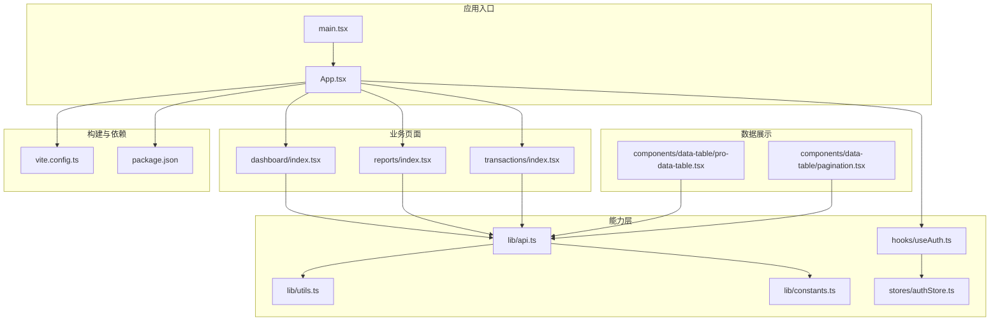
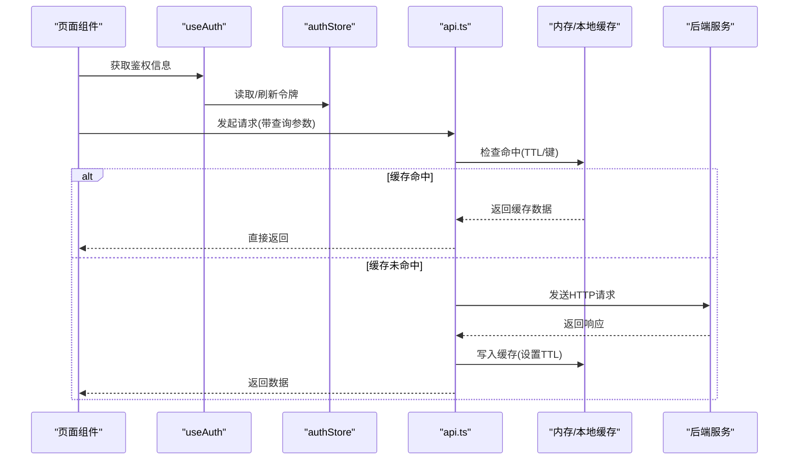
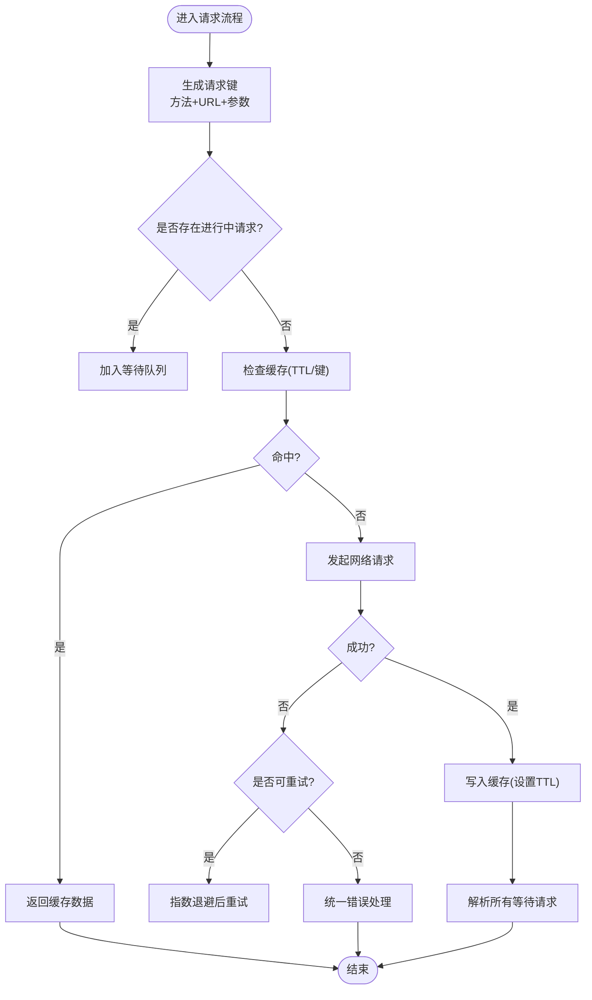
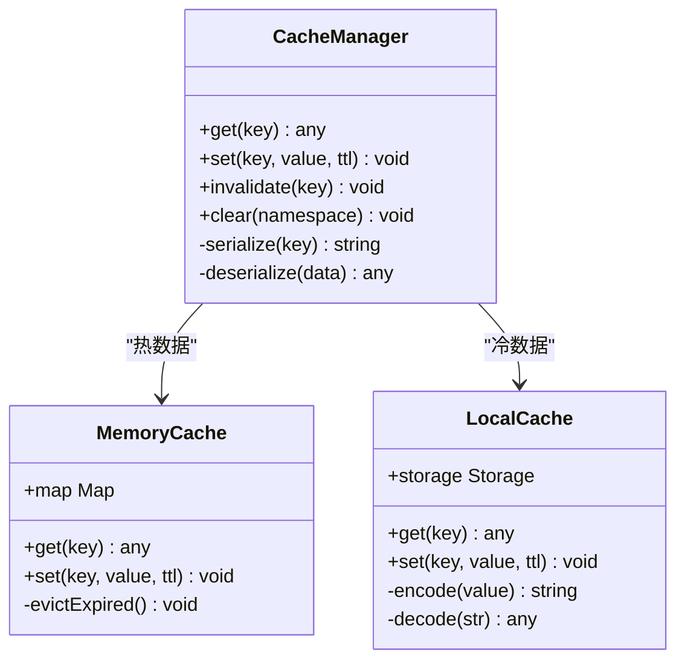
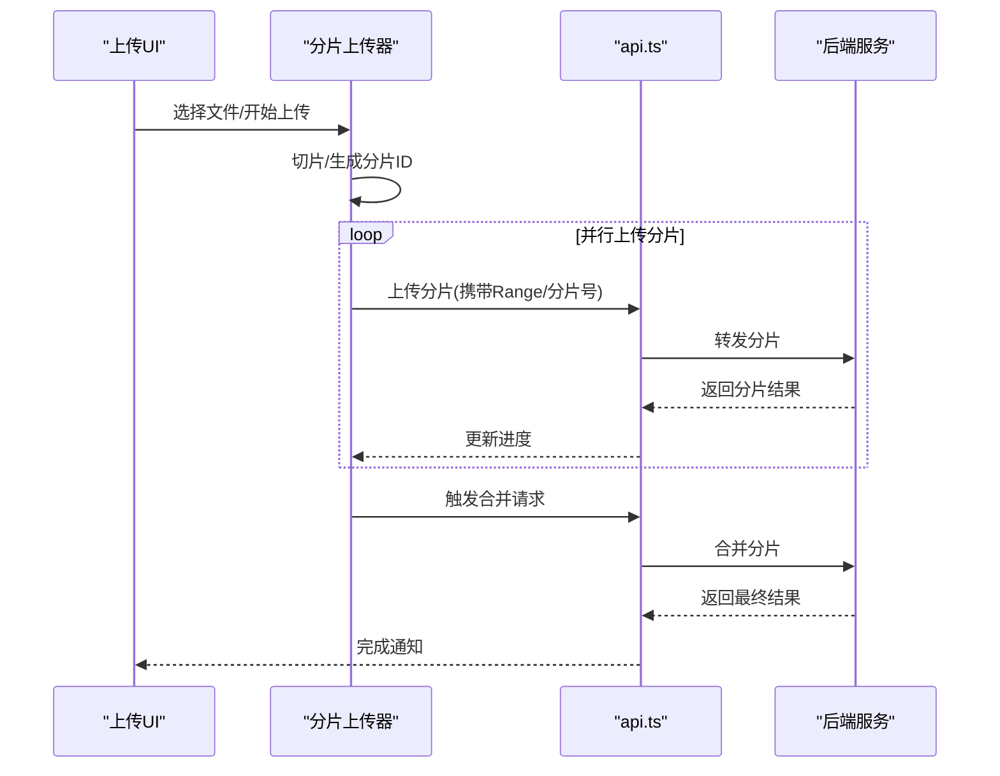
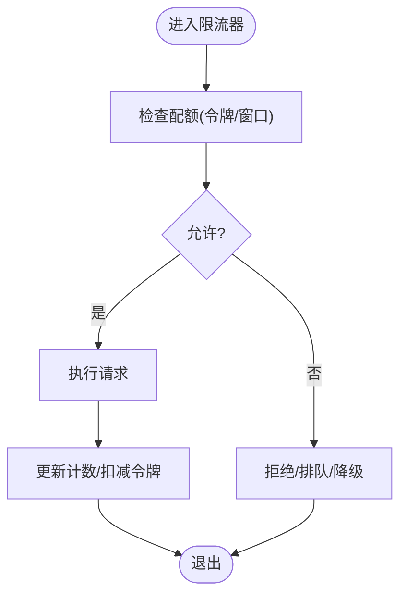
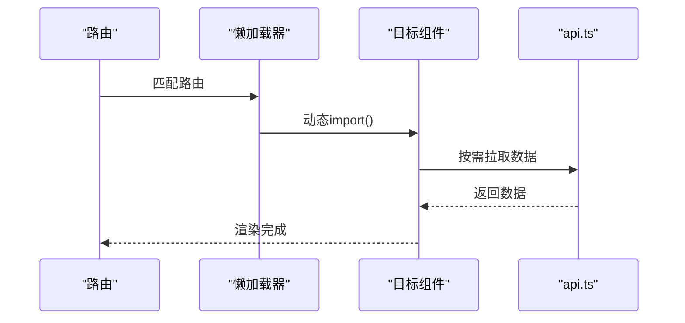
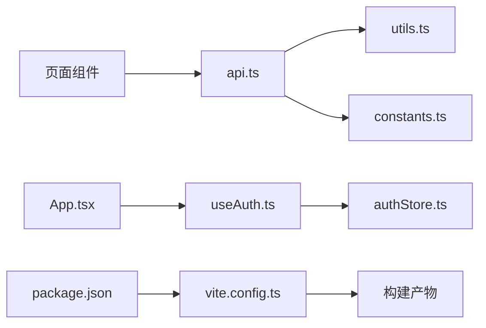

# 性能优化策略

<cite>
**本文引用的文件**   
- [web/src/lib/api.ts](file://web/src/lib/api.ts)
- [web/src/lib/utils.ts](file://web/src/lib/utils.ts)
- [web/src/lib/constants.ts](file://web/src/lib/constants.ts)
- [web/src/pages/dashboard/index.tsx](file://web/src/pages/dashboard/index.tsx)
- [web/src/pages/reports/index.tsx](file://web/src/pages/reports/index.tsx)
- [web/src/pages/transactions/index.tsx](file://web/src/pages/transactions/index.tsx)
- [web/src/components/data-table/pro-data-table.tsx](file://web/src/components/data-table/pro-data-table.tsx)
- [web/src/components/data-table/pagination.tsx](file://web/src/components/data-table/pagination.tsx)
- [web/src/hooks/useAuth.ts](file://web/src/hooks/useAuth.ts)
- [web/src/stores/authStore.ts](file://web/src/stores/authStore.ts)
- [web/vite.config.ts](file://web/vite.config.ts)
- [web/package.json](file://web/package.json)
- [docs/references/performance.md](file://docs/references/performance.md)
</cite>

## 目录
1. [引言](#引言)
2. [项目结构](#项目结构)
3. [核心组件](#核心组件)
4. [架构总览](#架构总览)
5. [详细组件分析](#详细组件分析)
6. [依赖关系分析](#依赖关系分析)
7. [性能考量](#性能考量)
8. [故障排查指南](#故障排查指南)
9. [结论](#结论)
10. [附录](#附录)

## 引言
本技术文档围绕 pj3 项目的 API 性能优化，系统化梳理请求级优化（合并、去重、预加载）、响应缓存（内存与本地存储、失效策略）、大文件上传下载（分片、断点续传、进度展示）、并发控制与限流、懒加载与按需加载、网络层优化（压缩、缓存、CDN），以及性能监控与指标收集、测试方法与工具使用。文档以仓库现有实现为基础，结合通用最佳实践给出可落地的方案与图示。

## 项目结构
前端工程位于 web 目录，API 调用集中在 lib/api.ts，页面与表格组件在 pages 与 components 下，构建配置在 vite.config.ts，包管理与依赖在 package.json。参考文档位于 docs/references/performance.md。

图表来源
- [web/src/main.tsx](file://web/src/main.tsx)
- [web/src/App.tsx](file://web/src/App.tsx)
- [web/src/pages/dashboard/index.tsx](file://web/src/pages/dashboard/index.tsx)
- [web/src/pages/reports/index.tsx](file://web/src/pages/reports/index.tsx)
- [web/src/pages/transactions/index.tsx](file://web/src/pages/transactions/index.tsx)
- [web/src/components/data-table/pro-data-table.tsx](file://web/src/components/data-table/pro-data-table.tsx)
- [web/src/components/data-table/pagination.tsx](file://web/src/components/data-table/pagination.tsx)
- [web/src/lib/api.ts](file://web/src/lib/api.ts)
- [web/src/lib/utils.ts](file://web/src/lib/utils.ts)
- [web/src/lib/constants.ts](file://web/src/lib/constants.ts)
- [web/src/hooks/useAuth.ts](file://web/src/hooks/useAuth.ts)
- [web/src/stores/authStore.ts](file://web/src/stores/authStore.ts)
- [web/vite.config.ts](file://web/vite.config.ts)
- [web/package.json](file://web/package.json)

章节来源
- [web/src/lib/api.ts](file://web/src/lib/api.ts)
- [web/src/lib/utils.ts](file://web/src/lib/utils.ts)
- [web/src/lib/constants.ts](file://web/src/lib/constants.ts)
- [web/src/pages/dashboard/index.tsx](file://web/src/pages/dashboard/index.tsx)
- [web/src/pages/reports/index.tsx](file://web/src/pages/reports/index.tsx)
- [web/src/pages/transactions/index.tsx](file://web/src/pages/transactions/index.tsx)
- [web/src/components/data-table/pro-data-table.tsx](file://web/src/components/data-table/pro-data-table.tsx)
- [web/src/components/data-table/pagination.tsx](file://web/src/components/data-table/pagination.tsx)
- [web/src/hooks/useAuth.ts](file://web/src/hooks/useAuth.ts)
- [web/src/stores/authStore.ts](file://web/src/stores/authStore.ts)
- [web/vite.config.ts](file://web/vite.config.ts)
- [web/package.json](file://web/package.json)

## 核心组件
- API 客户端：统一封装 HTTP 请求、错误处理、鉴权头注入、可选的缓存与重试逻辑。
- 工具库：提供节流、防抖、队列、并发控制等通用能力。
- 常量定义：集中管理超时、重试次数、分页大小、缓存 TTL 等参数。
- 数据表格：支持分页、排序、筛选与虚拟滚动，减少首屏渲染压力。
- 认证钩子与状态：集中管理登录态、令牌刷新与权限判断。

章节来源
- [web/src/lib/api.ts](file://web/src/lib/api.ts)
- [web/src/lib/utils.ts](file://web/src/lib/utils.ts)
- [web/src/lib/constants.ts](file://web/src/lib/constants.ts)
- [web/src/components/data-table/pro-data-table.tsx](file://web/src/components/data-table/pro-data-table.tsx)
- [web/src/hooks/useAuth.ts](file://web/src/hooks/useAuth.ts)
- [web/src/stores/authStore.ts](file://web/src/stores/authStore.ts)

## 架构总览
下图展示了从页面到 API 客户端的关键路径，包括鉴权、缓存、并发控制与错误处理的交互。

图表来源
- [web/src/pages/dashboard/index.tsx](file://web/src/pages/dashboard/index.tsx)
- [web/src/hooks/useAuth.ts](file://web/src/hooks/useAuth.ts)
- [web/src/stores/authStore.ts](file://web/src/stores/authStore.ts)
- [web/src/lib/api.ts](file://web/src/lib/api.ts)

## 详细组件分析

### API 客户端与请求级优化
- 请求合并与去重
  - 基于请求键（方法+URL+序列化后的查询参数）进行去重，避免短时间内重复请求。
  - 对相同键的请求进行合并，仅发出一次网络请求，其余等待同一 Promise。
- 预加载策略
  - 在路由切换或用户交互前，根据上下文预测并提前拉取数据，提升首屏体验。
- 重试与退避
  - 针对瞬时失败进行指数退避重试，限制最大重试次数，避免雪崩。
- 错误处理
  - 统一捕获网络异常、鉴权失败、业务错误码，并提供友好提示与降级策略。

图表来源
- [web/src/lib/api.ts](file://web/src/lib/api.ts)
- [web/src/lib/utils.ts](file://web/src/lib/utils.ts)
- [web/src/lib/constants.ts](file://web/src/lib/constants.ts)

章节来源
- [web/src/lib/api.ts](file://web/src/lib/api.ts)
- [web/src/lib/utils.ts](file://web/src/lib/utils.ts)
- [web/src/lib/constants.ts](file://web/src/lib/constants.ts)

### 响应缓存方案（内存与本地存储、失效策略）
- 内存缓存
  - 使用 Map 或 WeakMap 存储热点数据，按键索引，附带时间戳与 TTL。
  - 支持批量失效与按命名空间清理。
- 本地存储
  - 将冷数据持久化到 localStorage/sessionStorage，注意体积与同步阻塞问题。
  - 引入版本号与校验字段，避免脏读。
- 失效策略
  - TTL 过期自动失效；写操作触发相关键失效；页面卸载时清理部分缓存。
  - 支持主动失效接口，供表单提交、删除等操作触发。

图表来源
- [web/src/lib/api.ts](file://web/src/lib/api.ts)
- [web/src/lib/utils.ts](file://web/src/lib/utils.ts)

章节来源
- [web/src/lib/api.ts](file://web/src/lib/api.ts)
- [web/src/lib/utils.ts](file://web/src/lib/utils.ts)

### 大文件上传下载优化（分片、断点续传、进度）
- 分片上传
  - 将大文件切分为固定大小的分片，并行上传，提高吞吐。
  - 为每个分片生成唯一标识，便于服务端合并与校验。
- 断点续传
  - 记录已上传分片列表，重新上传时跳过已完成分片。
  - 支持暂停与恢复，保存当前进度到本地存储。
- 进度显示
  - 聚合各分片进度，计算整体百分比，实时更新 UI。
- 下载优化
  - 使用 Range 请求实现断点续传下载；对静态资源启用浏览器缓存。

图表来源
- [web/src/lib/api.ts](file://web/src/lib/api.ts)
- [web/src/lib/utils.ts](file://web/src/lib/utils.ts)

章节来源
- [web/src/lib/api.ts](file://web/src/lib/api.ts)
- [web/src/lib/utils.ts](file://web/src/lib/utils.ts)

### 并发控制与限流机制
- 并发控制
  - 通过信号量或任务队列限制同时进行的请求数，防止过载。
  - 支持优先级队列，关键请求优先执行。
- 限流
  - 基于滑动窗口或令牌桶算法，限制单位时间内的请求上限。
  - 针对不同端点设置不同配额，保护高成本接口。
- 背压与降级
  - 当队列积压超过阈值时，拒绝新请求或返回空数据占位，保障系统稳定。

图表来源
- [web/src/lib/utils.ts](file://web/src/lib/utils.ts)
- [web/src/lib/constants.ts](file://web/src/lib/constants.ts)

章节来源
- [web/src/lib/utils.ts](file://web/src/lib/utils.ts)
- [web/src/lib/constants.ts](file://web/src/lib/constants.ts)

### 懒加载与按需加载
- 路由级懒加载
  - 使用动态导入拆分代码，减少初始包体积。
- 组件级懒加载
  - 对重型组件（如图表、复杂表格）使用懒加载与骨架屏，提升首屏速度。
- 数据懒加载
  - 仅在需要时发起请求，结合分页与虚拟滚动降低内存占用。

图表来源
- [web/src/pages/dashboard/index.tsx](file://web/src/pages/dashboard/index.tsx)
- [web/src/pages/reports/index.tsx](file://web/src/pages/reports/index.tsx)
- [web/src/pages/transactions/index.tsx](file://web/src/pages/transactions/index.tsx)
- [web/src/lib/api.ts](file://web/src/lib/api.ts)

章节来源
- [web/src/pages/dashboard/index.tsx](file://web/src/pages/dashboard/index.tsx)
- [web/src/pages/reports/index.tsx](file://web/src/pages/reports/index.tsx)
- [web/src/pages/transactions/index.tsx](file://web/src/pages/transactions/index.tsx)
- [web/src/lib/api.ts](file://web/src/lib/api.ts)

### 网络层优化（压缩、缓存、CDN）
- 请求压缩
  - 启用 gzip/br 压缩，减小传输体积。
- 响应缓存
  - 合理设置 Cache-Control、ETag、Last-Modified，利用浏览器与代理缓存。
- CDN 加速
  - 静态资源与只读接口走 CDN，降低延迟与带宽成本。
- 连接复用与 Keep-Alive
  - 复用 TCP 连接，减少握手开销。

章节来源
- [web/vite.config.ts](file://web/vite.config.ts)
- [web/package.json](file://web/package.json)

### 性能监控与指标收集
- 关键指标
  - 首字节时间、完整加载时间、请求成功率、错误率、P95/P99 延迟。
- 埋点采集
  - 在 API 客户端中统计耗时、失败原因、重试次数。
- 可视化与告警
  - 上报至监控系统，设置阈值告警，定位瓶颈。

章节来源
- [web/src/lib/api.ts](file://web/src/lib/api.ts)
- [docs/references/performance.md](file://docs/references/performance.md)

## 依赖关系分析
- 模块耦合
  - 页面与 API 客户端解耦，通过函数式接口调用，便于替换与测试。
  - 工具库被多处复用，保持高内聚低耦合。
- 外部依赖
  - 构建工具与打包插件影响资源体积与缓存策略。
  - 第三方库需评估其性能与体积影响。

图表来源
- [web/src/pages/dashboard/index.tsx](file://web/src/pages/dashboard/index.tsx)
- [web/src/pages/reports/index.tsx](file://web/src/pages/reports/index.tsx)
- [web/src/pages/transactions/index.tsx](file://web/src/pages/transactions/index.tsx)
- [web/src/lib/api.ts](file://web/src/lib/api.ts)
- [web/src/lib/utils.ts](file://web/src/lib/utils.ts)
- [web/src/lib/constants.ts](file://web/src/lib/constants.ts)
- [web/src/hooks/useAuth.ts](file://web/src/hooks/useAuth.ts)
- [web/src/stores/authStore.ts](file://web/src/stores/authStore.ts)
- [web/vite.config.ts](file://web/vite.config.ts)
- [web/package.json](file://web/package.json)

章节来源
- [web/src/lib/api.ts](file://web/src/lib/api.ts)
- [web/src/lib/utils.ts](file://web/src/lib/utils.ts)
- [web/src/lib/constants.ts](file://web/src/lib/constants.ts)
- [web/src/hooks/useAuth.ts](file://web/src/hooks/useAuth.ts)
- [web/src/stores/authStore.ts](file://web/src/stores/authStore.ts)
- [web/vite.config.ts](file://web/vite.config.ts)
- [web/package.json](file://web/package.json)

## 性能考量
- 首屏优化
  - 路由与组件懒加载、骨架屏、关键 CSS 内联、字体与图片优化。
- 数据渲染
  - 分页、虚拟滚动、增量更新，避免一次性渲染大量 DOM。
- 缓存命中率
  - 合理设计缓存键与 TTL，定期清理无效缓存。
- 并发与限流
  - 控制并发度，避免拖垮主线程与后端。
- 网络优化
  - 启用压缩、缓存与 CDN，减少往返与带宽消耗。

[本节为通用指导，不直接分析具体文件]

## 故障排查指南
- 常见问题
  - 缓存未命中：检查键生成规则与 TTL 设置。
  - 请求风暴：确认去重与限流是否生效。
  - 上传中断：验证分片 ID 与续传记录是否一致。
- 调试手段
  - 开启详细日志，记录请求键、耗时、错误码。
  - 使用浏览器开发者工具与网络面板分析瀑布图。
- 回滚与降级
  - 快速关闭缓存或重试开关，切换到降级模式。

章节来源
- [web/src/lib/api.ts](file://web/src/lib/api.ts)
- [web/src/lib/utils.ts](file://web/src/lib/utils.ts)

## 结论
通过在请求级实施合并与去重、建立多层缓存体系、优化大文件传输、实施并发控制与限流、采用懒加载与网络层优化，并结合完善的监控与测试手段，pj3 项目可在保证稳定性的前提下显著提升 API 性能与用户体验。建议持续度量关键指标，迭代优化策略。

[本节为总结性内容，不直接分析具体文件]

## 附录
- 性能测试方法
  - 使用 Lighthouse、WebPageTest、k6 等进行端到端与负载测试。
  - 对比优化前后指标，关注 P95/P99 与错误率变化。
- 优化工具
  - 浏览器性能面板、Network 面板、Source Maps、Bundle 分析工具。
- 参考文档
  - 性能参考文档提供了更详细的指标定义与最佳实践。

章节来源
- [docs/references/performance.md](file://docs/references/performance.md)
- [web/package.json](file://web/package.json)