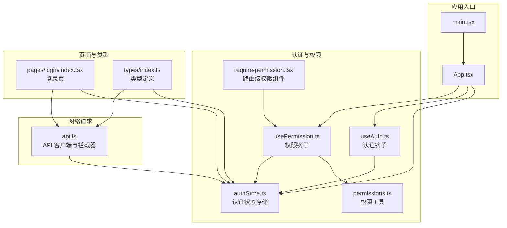
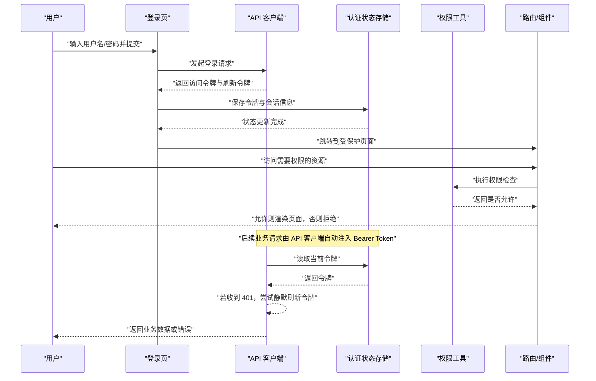
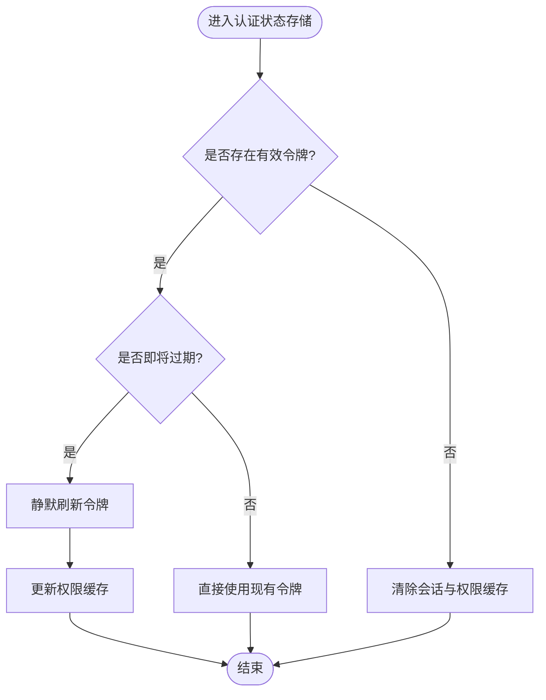
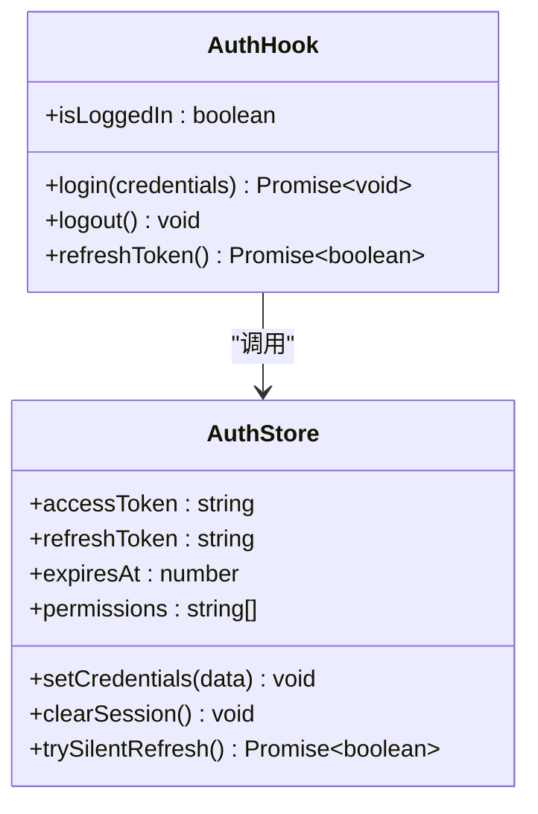
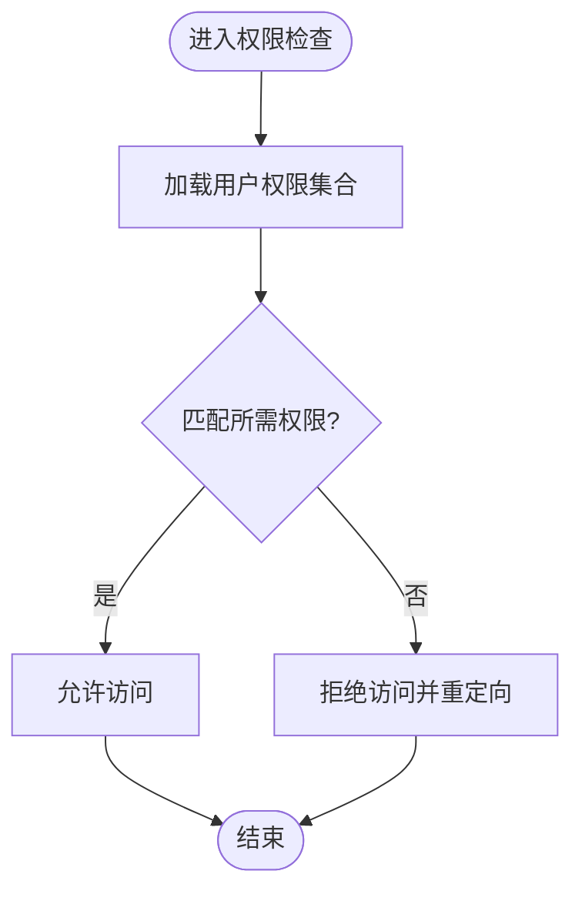
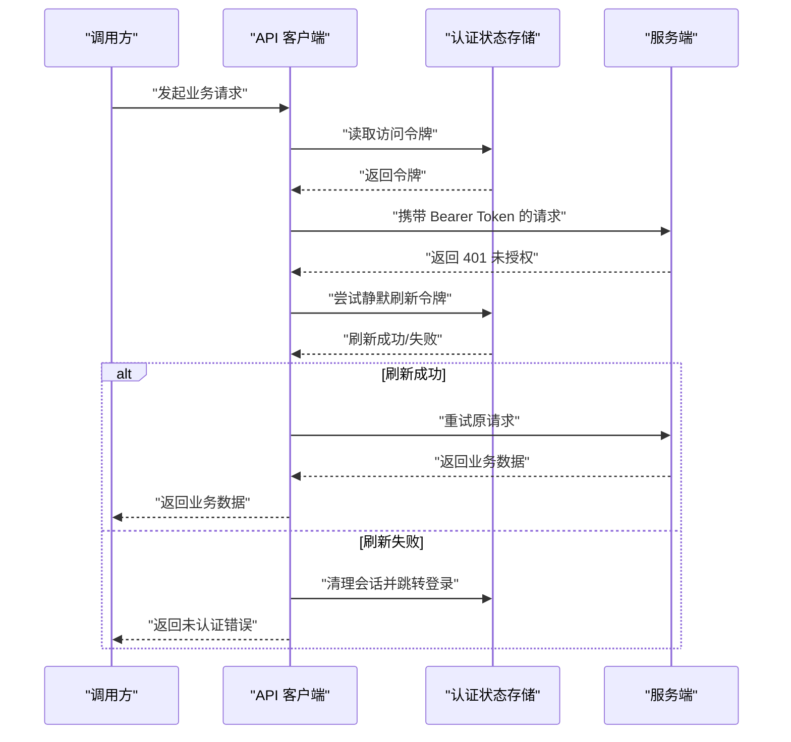
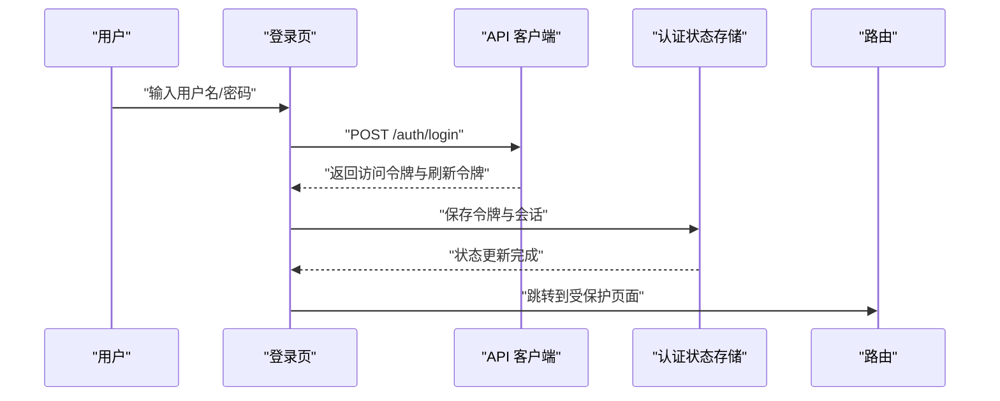
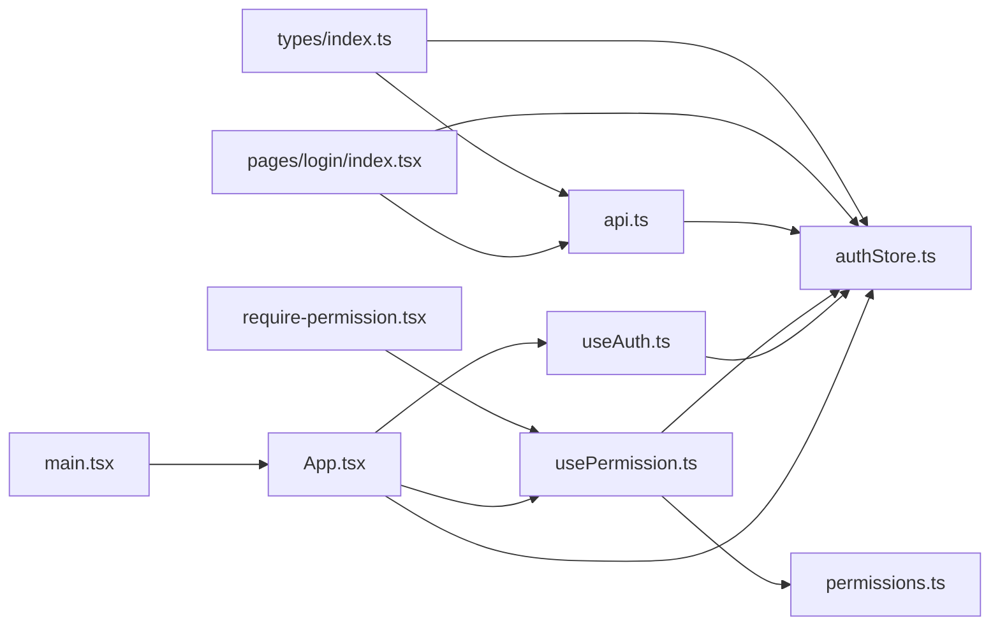

# 认证授权集成

<cite>
**本文引用的文件**   
- [web/src/stores/authStore.ts](file://web/src/stores/authStore.ts)
- [web/src/hooks/useAuth.ts](file://web/src/hooks/useAuth.ts)
- [web/src/hooks/usePermission.ts](file://web/src/hooks/usePermission.ts)
- [web/src/lib/api.ts](file://web/src/lib/api.ts)
- [web/src/lib/permissions.ts](file://web/src/lib/permissions.ts)
- [web/src/components/layout/require-permission.tsx](file://web/src/components/layout/require-permission.tsx)
- [web/src/pages/login/index.tsx](file://web/src/pages/login/index.tsx)
- [web/src/types/index.ts](file://web/src/types/index.ts)
- [web/src/App.tsx](file://web/src/App.tsx)
- [web/src/main.tsx](file://web/src/main.tsx)
</cite>

## 目录
1. [简介](#简介)
2. [项目结构](#项目结构)
3. [核心组件](#核心组件)
4. [架构总览](#架构总览)
5. [详细组件分析](#详细组件分析)
6. [依赖关系分析](#依赖关系分析)
7. [性能考虑](#性能考虑)
8. [故障排查指南](#故障排查指南)
9. [结论](#结论)
10. [附录](#附录)

## 简介
本技术文档聚焦于 pj3 项目的认证与授权集成方案，围绕 JWT 令牌的完整生命周期管理、认证状态维护、请求头自动注入、多层次权限校验、令牌刷新策略以及登出流程等主题展开。文档旨在帮助开发者快速理解并正确扩展前端的鉴权体系，确保在复杂业务场景下的安全性与可维护性。

## 项目结构
前端采用 React + TypeScript 技术栈，认证相关能力主要分布在以下模块：
- 状态存储层：集中管理用户会话、令牌及权限缓存
- 钩子层：封装认证与权限判断的常用逻辑
- API 层：统一网络请求拦截与认证信息注入
- 路由与页面：登录入口、受保护页面与布局级权限控制
- 类型定义：统一的认证与权限数据结构

图表来源
- [web/src/main.tsx](file://web/src/main.tsx)
- [web/src/App.tsx](file://web/src/App.tsx)
- [web/src/stores/authStore.ts](file://web/src/stores/authStore.ts)
- [web/src/hooks/useAuth.ts](file://web/src/hooks/useAuth.ts)
- [web/src/hooks/usePermission.ts](file://web/src/hooks/usePermission.ts)
- [web/src/lib/permissions.ts](file://web/src/lib/permissions.ts)
- [web/src/lib/api.ts](file://web/src/lib/api.ts)
- [web/src/components/layout/require-permission.tsx](file://web/src/components/layout/require-permission.tsx)
- [web/src/pages/login/index.tsx](file://web/src/pages/login/index.tsx)
- [web/src/types/index.ts](file://web/src/types/index.ts)

章节来源
- [web/src/main.tsx](file://web/src/main.tsx)
- [web/src/App.tsx](file://web/src/App.tsx)
- [web/src/stores/authStore.ts](file://web/src/stores/authStore.ts)
- [web/src/hooks/useAuth.ts](file://web/src/hooks/useAuth.ts)
- [web/src/hooks/usePermission.ts](file://web/src/hooks/usePermission.ts)
- [web/src/lib/permissions.ts](file://web/src/lib/permissions.ts)
- [web/src/lib/api.ts](file://web/src/lib/api.ts)
- [web/src/components/layout/require-permission.tsx](file://web/src/components/layout/require-permission.tsx)
- [web/src/pages/login/index.tsx](file://web/src/pages/login/index.tsx)
- [web/src/types/index.ts](file://web/src/types/index.ts)

## 核心组件
本节对认证与授权相关的核心模块进行概览说明，重点包括职责边界与交互方式。

- 认证状态存储（authStore）
  - 负责用户会话、JWT 访问令牌、刷新令牌、过期时间戳、权限缓存等持久化与内存状态管理
  - 提供登录、登出、刷新令牌、设置权限、清除状态等方法
  - 与本地存储（如 localStorage/sessionStorage）交互以维持跨会话状态

- 认证钩子（useAuth）
  - 暴露当前认证状态、登录方法、登出方法、刷新令牌方法等
  - 内部调用 authStore 的方法，并在必要时触发 UI 更新或路由跳转

- 权限钩子（usePermission）
  - 基于当前用户权限集合进行资源级或操作级判断
  - 支持角色、菜单、按钮等多粒度权限检查

- 权限工具（permissions.ts）
  - 提供权限匹配算法、权限合并、权限降级策略等通用逻辑

- API 客户端（api.ts）
  - 统一封装 HTTP 请求，自动附加 Bearer Token
  - 处理 401/403 响应，触发静默刷新或引导重新登录
  - 可选签名验证与安全传输配置

- 路由级权限组件（require-permission.tsx）
  - 在渲染受保护页面之前进行权限校验，未通过则重定向或显示无权限提示

- 登录页（pages/login/index.tsx）
  - 收集用户凭据，调用后端认证接口，成功后保存令牌与会话信息

- 类型定义（types/index.ts）
  - 定义用户、令牌、权限、API 响应等统一类型

章节来源
- [web/src/stores/authStore.ts](file://web/src/stores/authStore.ts)
- [web/src/hooks/useAuth.ts](file://web/src/hooks/useAuth.ts)
- [web/src/hooks/usePermission.ts](file://web/src/hooks/usePermission.ts)
- [web/src/lib/permissions.ts](file://web/src/lib/permissions.ts)
- [web/src/lib/api.ts](file://web/src/lib/api.ts)
- [web/src/components/layout/require-permission.tsx](file://web/src/components/layout/require-permission.tsx)
- [web/src/pages/login/index.tsx](file://web/src/pages/login/index.tsx)
- [web/src/types/index.ts](file://web/src/types/index.ts)

## 架构总览
下图展示了认证授权的整体数据流与控制流，涵盖登录、令牌获取与刷新、权限校验、请求拦截与响应处理。

图表来源
- [web/src/pages/login/index.tsx](file://web/src/pages/login/index.tsx)
- [web/src/lib/api.ts](file://web/src/lib/api.ts)
- [web/src/stores/authStore.ts](file://web/src/stores/authStore.ts)
- [web/src/lib/permissions.ts](file://web/src/lib/permissions.ts)
- [web/src/components/layout/require-permission.tsx](file://web/src/components/layout/require-permission.tsx)

## 详细组件分析

### 认证状态存储（authStore）
- 职责
  - 管理用户会话、访问令牌、刷新令牌、过期时间戳、权限集合
  - 提供登录、登出、刷新令牌、设置权限、清除状态等原子操作
  - 与本地存储同步，保证刷新后状态一致
- 关键流程
  - 登录：接收后端返回的令牌，计算过期时间，写入存储，触发状态更新
  - 刷新：使用刷新令牌换取新访问令牌，更新过期时间与权限缓存
  - 登出：清空所有敏感信息与权限缓存，必要时清理本地存储
- 并发与冲突
  - 刷新令牌时避免重复刷新，采用队列或锁机制
  - 多标签页场景下，监听存储变更事件实现状态同步
- 安全建议
  - 将访问令牌设置为短期有效，刷新令牌长期有效但需定期轮换
  - 敏感字段加密存储，限制存储范围（sessionStorage vs localStorage）

图表来源
- [web/src/stores/authStore.ts](file://web/src/stores/authStore.ts)

章节来源
- [web/src/stores/authStore.ts](file://web/src/stores/authStore.ts)

### 认证钩子（useAuth）
- 职责
  - 对外暴露认证状态与方法，简化组件中的认证逻辑
  - 封装登录、登出、刷新令牌等操作，统一错误处理与跳转
- 典型用法
  - 在页面或布局中调用登录方法，成功后导航到目标页面
  - 在需要刷新令牌的地方调用刷新方法，失败则引导重新登录
- 与存储层的关系
  - 直接调用 authStore 的方法，保持单一数据源

图表来源
- [web/src/hooks/useAuth.ts](file://web/src/hooks/useAuth.ts)
- [web/src/stores/authStore.ts](file://web/src/stores/authStore.ts)

章节来源
- [web/src/hooks/useAuth.ts](file://web/src/hooks/useAuth.ts)
- [web/src/stores/authStore.ts](file://web/src/stores/authStore.ts)

### 权限钩子与工具（usePermission / permissions.ts）
- 职责
  - 提供细粒度的权限判断，支持角色、菜单、按钮级别
  - 封装权限合并、覆盖、降级策略
- 常见模式
  - 组件内使用 usePermission 进行条件渲染
  - 路由级使用 require-permission 组件进行前置校验
- 权限模型
  - 基于资源与动作的二维模型（如 resource:action）
  - 支持继承与组合，便于扩展

图表来源
- [web/src/hooks/usePermission.ts](file://web/src/hooks/usePermission.ts)
- [web/src/lib/permissions.ts](file://web/src/lib/permissions.ts)
- [web/src/components/layout/require-permission.tsx](file://web/src/components/layout/require-permission.tsx)

章节来源
- [web/src/hooks/usePermission.ts](file://web/src/hooks/usePermission.ts)
- [web/src/lib/permissions.ts](file://web/src/lib/permissions.ts)
- [web/src/components/layout/require-permission.tsx](file://web/src/components/layout/require-permission.tsx)

### API 客户端与认证注入（api.ts）
- 职责
  - 统一封装 HTTP 请求，自动添加 Bearer Token
  - 处理 401/403 响应，触发刷新或登出
  - 可选签名验证与安全传输配置
- 自动注入流程
  - 请求前从认证状态存储读取令牌并添加到请求头
  - 若令牌即将过期，可在发送前预刷新
- 响应处理
  - 401：尝试静默刷新；失败则清理状态并跳转登录
  - 403：根据权限策略提示无权限或降级展示
- 安全传输
  - 强制 HTTPS
  - 可选请求体签名与防重放机制

图表来源
- [web/src/lib/api.ts](file://web/src/lib/api.ts)
- [web/src/stores/authStore.ts](file://web/src/stores/authStore.ts)

章节来源
- [web/src/lib/api.ts](file://web/src/lib/api.ts)
- [web/src/stores/authStore.ts](file://web/src/stores/authStore.ts)

### 登录流程（pages/login/index.tsx）
- 职责
  - 收集用户凭据，调用认证接口，保存令牌与会话
  - 成功后跳转至首页或上次访问页面
- 安全要点
  - 防止凭据泄露，提交后清空输入框
  - 记录最小必要日志，避免敏感信息落盘

图表来源
- [web/src/pages/login/index.tsx](file://web/src/pages/login/index.tsx)
- [web/src/lib/api.ts](file://web/src/lib/api.ts)
- [web/src/stores/authStore.ts](file://web/src/stores/authStore.ts)

章节来源
- [web/src/pages/login/index.tsx](file://web/src/pages/login/index.tsx)
- [web/src/lib/api.ts](file://web/src/lib/api.ts)
- [web/src/stores/authStore.ts](file://web/src/stores/authStore.ts)

### 类型定义（types/index.ts）
- 职责
  - 统一定义用户、令牌、权限、API 响应等类型
  - 为认证与权限逻辑提供强类型保障
- 建议
  - 将敏感字段标记为可选或仅在运行时存在
  - 明确区分只读与可写字段，避免误改

章节来源
- [web/src/types/index.ts](file://web/src/types/index.ts)

## 依赖关系分析
下图展示了认证授权相关模块之间的依赖关系，有助于识别耦合点与潜在循环依赖。

图表来源
- [web/src/main.tsx](file://web/src/main.tsx)
- [web/src/App.tsx](file://web/src/App.tsx)
- [web/src/stores/authStore.ts](file://web/src/stores/authStore.ts)
- [web/src/hooks/useAuth.ts](file://web/src/hooks/useAuth.ts)
- [web/src/hooks/usePermission.ts](file://web/src/hooks/usePermission.ts)
- [web/src/lib/permissions.ts](file://web/src/lib/permissions.ts)
- [web/src/lib/api.ts](file://web/src/lib/api.ts)
- [web/src/components/layout/require-permission.tsx](file://web/src/components/layout/require-permission.tsx)
- [web/src/pages/login/index.tsx](file://web/src/pages/login/index.tsx)
- [web/src/types/index.ts](file://web/src/types/index.ts)

章节来源
- [web/src/main.tsx](file://web/src/main.tsx)
- [web/src/App.tsx](file://web/src/App.tsx)
- [web/src/stores/authStore.ts](file://web/src/stores/authStore.ts)
- [web/src/hooks/useAuth.ts](file://web/src/hooks/useAuth.ts)
- [web/src/hooks/usePermission.ts](file://web/src/hooks/usePermission.ts)
- [web/src/lib/permissions.ts](file://web/src/lib/permissions.ts)
- [web/src/lib/api.ts](file://web/src/lib/api.ts)
- [web/src/components/layout/require-permission.tsx](file://web/src/components/layout/require-permission.tsx)
- [web/src/pages/login/index.tsx](file://web/src/pages/login/index.tsx)
- [web/src/types/index.ts](file://web/src/types/index.ts)

## 性能考虑
- 令牌刷新策略
  - 静默刷新：在请求前检测过期阈值，提前刷新以减少 401 抖动
  - 批量刷新：对短时间内多次 401 的请求合并刷新，避免重复网络开销
  - 冲突处理：使用队列或锁避免并发刷新导致的令牌覆盖
- 权限缓存
  - 将权限集合缓存于内存与本地存储，减少重复计算
  - 在用户切换或权限变更后主动失效缓存
- 网络优化
  - 合理设置超时与重试次数，避免雪崩效应
  - 对高频小请求进行合并与去抖

[本节为通用指导，不直接分析具体文件]

## 故障排查指南
- 常见问题
  - 登录后仍被重定向到登录页：检查令牌是否成功保存、过期时间是否正确、路由守卫是否放行
  - 频繁 401：确认刷新令牌是否可用、刷新接口是否正常、并发刷新是否导致覆盖
  - 权限不生效：核对权限模型与后端返回的权限集合是否一致、权限缓存是否及时更新
- 定位步骤
  - 查看认证状态存储中的令牌与会话信息
  - 检查 API 客户端的请求头是否包含 Bearer Token
  - 观察权限钩子的返回值与路由级权限组件的重定向行为
- 恢复措施
  - 清理本地存储并重新登录
  - 重置权限缓存并重新拉取
  - 调整刷新阈值与重试策略

章节来源
- [web/src/stores/authStore.ts](file://web/src/stores/authStore.ts)
- [web/src/lib/api.ts](file://web/src/lib/api.ts)
- [web/src/hooks/usePermission.ts](file://web/src/hooks/usePermission.ts)
- [web/src/components/layout/require-permission.tsx](file://web/src/components/layout/require-permission.tsx)

## 结论
pj3 的认证授权体系以认证状态存储为核心，结合认证钩子、权限钩子与 API 客户端拦截器，实现了端到端的令牌生命周期管理与多层次权限防护。通过合理的刷新策略与缓存机制，系统在安全性与性能之间取得平衡。建议在后续迭代中持续完善并发刷新、跨标签页同步与更细粒度的权限模型，以提升用户体验与系统健壮性。

[本节为总结性内容，不直接分析具体文件]

## 附录
- 最佳实践清单
  - 使用短期访问令牌与长期刷新令牌
  - 在请求前预刷新，减少 401 抖动
  - 统一错误处理与用户提示
  - 严格限制本地存储范围与生命周期
  - 对所有敏感操作进行二次确认与审计日志
- 参考流程图
  - 登录与令牌获取
  - 静默刷新与重试
  - 权限校验与路由保护

[本节为概念性内容，不直接分析具体文件]