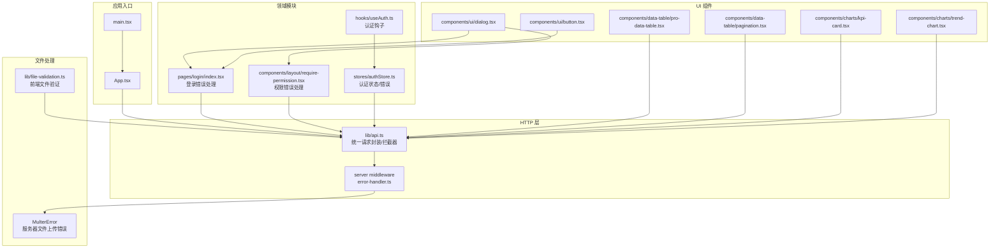
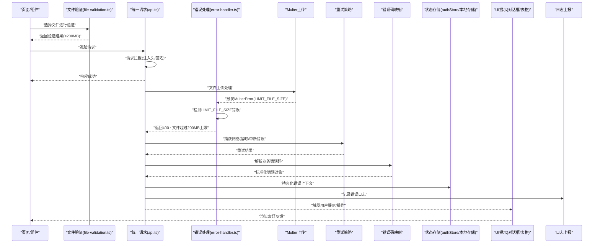
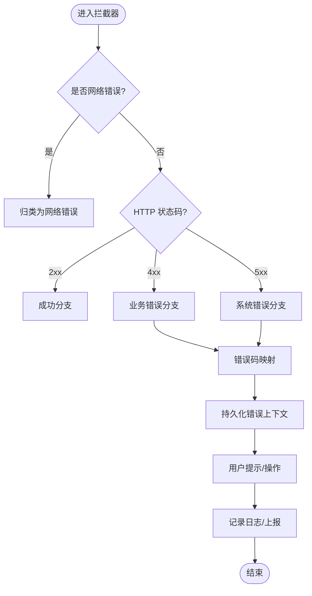
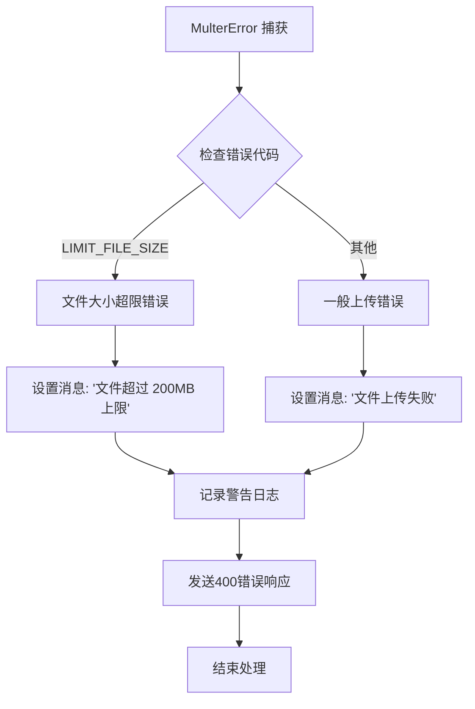
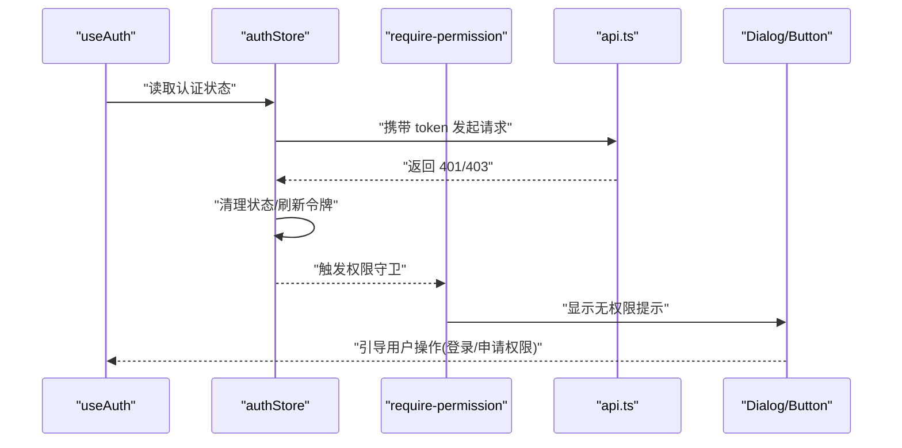
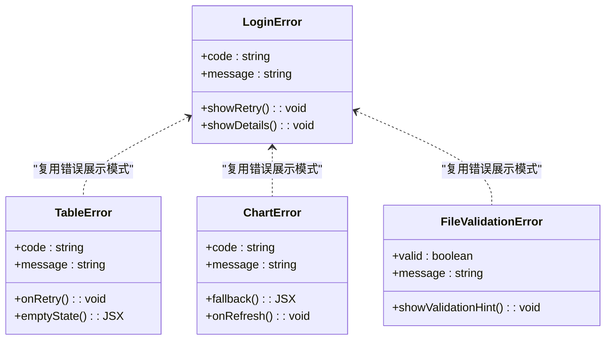
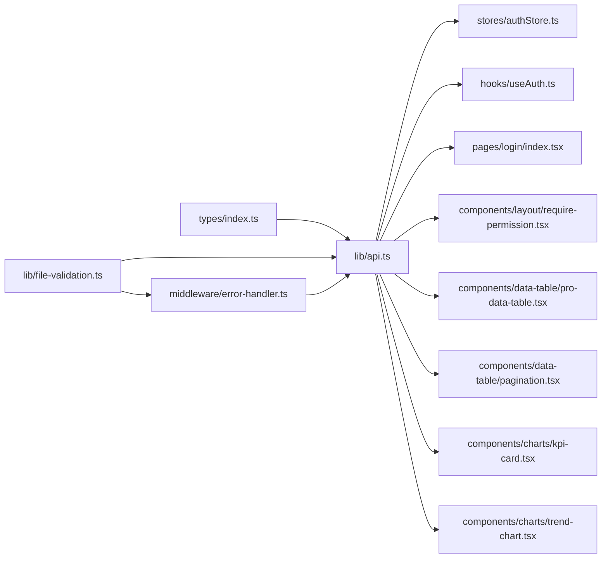

# 错误处理机制

<cite>
**本文引用的文件**   
- [web/src/lib/api.ts](file://web/src/lib/api.ts)
- [web/src/types/index.ts](file://web/src/types/index.ts)
- [web/src/pages/login/index.tsx](file://web/src/pages/login/index.tsx)
- [web/src/stores/authStore.ts](file://web/src/stores/authStore.ts)
- [web/src/hooks/useAuth.ts](file://web/src/hooks/useAuth.ts)
- [web/src/components/layout/require-permission.tsx](file://web/src/components/layout/require-permission.tsx)
- [web/src/components/ui/dialog.tsx](file://web/src/components/ui/dialog.tsx)
- [web/src/components/ui/button.tsx](file://web/src/components/ui/button.tsx)
- [web/src/components/data-table/pro-data-table.tsx](file://web/src/components/data-table/pro-data-table.tsx)
- [web/src/components/data-table/pagination.tsx](file://web/src/components/data-table/pagination.tsx)
- [web/src/components/charts/kpi-card.tsx](file://web/src/components/charts/kpi-card.tsx)
- [web/src/components/charts/trend-chart.tsx](file://web/src/components/charts/trend-chart.tsx)
- [web/src/App.tsx](file://web/src/App.tsx)
- [web/src/main.tsx](file://web/src/main.tsx)
- [web/vite.config.ts](file://web/vite.config.ts)
- [web/package.json](file://web/package.json)
- [server/src/middleware/error-handler.ts](file://server/src/middleware/error-handler.ts)
- [web/src/lib/file-validation.ts](file://web/src/lib/file-validation.ts)
- [web/src/lib/__tests__/file-validation.test.ts](file://web/src/lib/__tests__/file-validation.test.ts)
</cite>

## 更新摘要
**所做更改**
- 更新了文件上传错误处理部分，反映新的200MB文件大小限制
- 增强了前后端文件验证和错误处理的完整流程说明
- 添加了MulterError处理的具体实现细节
- 更新了前端文件验证与后端错误响应的对应关系

## 目录
1. [引言](#引言)
2. [项目结构](#项目结构)
3. [核心组件](#核心组件)
4. [架构总览](#架构总览)
5. [详细组件分析](#详细组件分析)
6. [依赖关系分析](#依赖关系分析)
7. [性能考虑](#性能考虑)
8. [故障排查指南](#故障排查指南)
9. [结论](#结论)
10. [附录](#附录)

## 引言
本技术文档围绕 pj3 项目的错误处理机制，系统化阐述统一的错误分类、拦截与上报策略，覆盖网络错误、业务错误与系统错误的全链路处理。重点说明请求失败重试、错误码映射、用户友好提示、错误状态持久化与恢复、日志记录与上报方案，以及自定义错误类型定义与使用规范。同时提供面向实际场景的示例路径与流程图，帮助开发者快速落地并持续优化错误处理体验与性能。

**更新** 本次更新特别关注了文件上传错误处理机制，包括前后端200MB文件大小限制的完整实现。

## 项目结构
本项目为前端应用（Vite + React）配合后端服务（Express），错误处理相关能力主要分布在以下位置：
- HTTP 客户端与统一拦截器：位于 web/src/lib/api.ts
- 全局错误类型与常量：位于 web/src/types/index.ts
- 文件验证与上传处理：位于 web/src/lib/file-validation.ts
- 服务器错误处理中间件：位于 server/src/middleware/error-handler.ts
- 页面级错误展示与交互：登录页、权限校验组件、数据表格等
- 状态管理与认证流程：authStore、useAuth
- 构建与打包配置：vite.config.ts、package.json

**图表来源**
- [web/src/main.tsx](file://web/src/main.tsx)
- [web/src/App.tsx](file://web/src/App.tsx)
- [web/src/lib/api.ts](file://web/src/lib/api.ts)
- [server/src/middleware/error-handler.ts](file://server/src/middleware/error-handler.ts)
- [web/src/lib/file-validation.ts](file://web/src/lib/file-validation.ts)
- [web/src/pages/login/index.tsx](file://web/src/pages/login/index.tsx)
- [web/src/stores/authStore.ts](file://web/src/stores/authStore.ts)
- [web/src/hooks/useAuth.ts](file://web/src/hooks/useAuth.ts)
- [web/src/components/layout/require-permission.tsx](file://web/src/components/layout/require-permission.tsx)
- [web/src/components/ui/dialog.tsx](file://web/src/components/ui/dialog.tsx)
- [web/src/components/ui/button.tsx](file://web/src/components/ui/button.tsx)
- [web/src/components/data-table/pro-data-table.tsx](file://web/src/components/data-table/pro-data-table.tsx)
- [web/src/components/data-table/pagination.tsx](file://web/src/components/data-table/pagination.tsx)
- [web/src/components/charts/kpi-card.tsx](file://web/src/components/charts/kpi-card.tsx)
- [web/src/components/charts/trend-chart.tsx](file://web/src/components/charts/trend-chart.tsx)

章节来源
- [web/src/main.tsx](file://web/src/main.tsx)
- [web/src/App.tsx](file://web/src/App.tsx)
- [web/src/lib/api.ts](file://web/src/lib/api.ts)
- [server/src/middleware/error-handler.ts](file://server/src/middleware/error-handler.ts)
- [web/src/lib/file-validation.ts](file://web/src/lib/file-validation.ts)
- [web/src/types/index.ts](file://web/src/types/index.ts)

## 核心组件
- 统一请求封装与拦截器（api.ts）
  - 负责所有网络请求的统一入口，集中实现请求头注入、响应拦截、错误分类、重试策略、错误码映射与用户提示。
- 全局错误类型与常量（types/index.ts）
  - 定义错误枚举、错误码规范、国际化键值约定及通用错误数据结构。
- 文件验证与上传处理（file-validation.ts）
  - 前端第一道文件校验，支持200MB大小限制和Excel格式验证。
- 服务器错误处理中间件（error-handler.ts）
  - 全局错误捕获，包含MulterError处理和200MB文件大小限制错误。
- 认证与权限错误处理（authStore.ts、useAuth.ts、require-permission.tsx）
  - 在认证失败、令牌过期、权限不足等场景下，进行状态清理、跳转与提示。
- 页面与组件级错误展示（login/index.tsx、pro-data-table.tsx、kpi-card.tsx、trend-chart.tsx 等）
  - 将统一错误信息转化为友好的 UI 反馈，支持重试、刷新、空态展示等。

**更新** 新增了文件验证与服务器错误处理中间件的核心组件说明。

章节来源
- [web/src/lib/api.ts](file://web/src/lib/api.ts)
- [web/src/types/index.ts](file://web/src/types/index.ts)
- [web/src/lib/file-validation.ts](file://web/src/lib/file-validation.ts)
- [server/src/middleware/error-handler.ts](file://server/src/middleware/error-handler.ts)
- [web/src/stores/authStore.ts](file://web/src/stores/authStore.ts)
- [web/src/hooks/useAuth.ts](file://web/src/hooks/useAuth.ts)
- [web/src/components/layout/require-permission.tsx](file://web/src/components/layout/require-permission.tsx)
- [web/src/pages/login/index.tsx](file://web/src/pages/login/index.tsx)
- [web/src/components/data-table/pro-data-table.tsx](file://web/src/components/data-table/pro-data-table.tsx)
- [web/src/components/charts/kpi-card.tsx](file://web/src/components/charts/kpi-card.tsx)
- [web/src/components/charts/trend-chart.tsx](file://web/src/components/charts/trend-chart.tsx)

## 架构总览
下图展示了从页面发起请求到错误处理的完整链路，包括拦截器、重试、错误码映射、持久化与上报，特别突出了文件上传错误的处理流程。

**图表来源**
- [web/src/lib/api.ts](file://web/src/lib/api.ts)
- [web/src/lib/file-validation.ts](file://web/src/lib/file-validation.ts)
- [server/src/middleware/error-handler.ts](file://server/src/middleware/error-handler.ts)
- [web/src/stores/authStore.ts](file://web/src/stores/authStore.ts)
- [web/src/components/ui/dialog.tsx](file://web/src/components/ui/dialog.tsx)
- [web/src/components/data-table/pro-data-table.tsx](file://web/src/components/data-table/pro-data-table.tsx)

## 详细组件分析

### 统一请求封装与拦截器（api.ts）
- 职责
  - 统一封装 fetch/axios 调用，集中管理请求头、鉴权、超时、取消、重试、错误分类与映射。
- 关键流程
  - 请求拦截：注入 token、traceId、语言环境等。
  - 响应拦截：区分网络错误、HTTP 状态码、业务错误码；对可重试错误执行指数退避或固定间隔重试。
  - 错误码映射：将后端错误码映射为前端标准错误对象，包含 code、message、retryable、recoverable 等字段。
  - 用户提示：根据错误类型触发 Toast、Dialog、表格空态等。
  - 持久化：将错误上下文（如 lastError、errorCount、lastRetryAt）写入 localStorage/sessionStorage。
  - 上报：聚合错误日志，批量上报至监控平台。
- 重试策略
  - 仅对幂等且安全的请求启用重试（GET、HEAD、OPTIONS）。
  - 针对网络抖动、超时、5xx 错误进行有限次重试，避免雪崩。
  - 结合去抖与节流，防止高频重试导致资源浪费。
- 错误分类
  - 网络错误：连接失败、超时、跨域、CORS、证书问题。
  - 业务错误：后端返回的业务错误码（如参数校验失败、权限不足、数据不存在）。
  - 系统错误：未知异常、JSON 解析失败、运行时错误。

**图表来源**
- [web/src/lib/api.ts](file://web/src/lib/api.ts)

章节来源
- [web/src/lib/api.ts](file://web/src/lib/api.ts)

### 文件验证与上传处理（file-validation.ts）
- 职责
  - 前端第一道文件校验，确保文件格式和大小符合规范要求。
- 关键特性
  - 支持 .xlsx 和 .xls 格式的 Excel 文件验证。
  - 实现200MB文件大小限制，与后端Multer配置保持一致。
  - 提供详细的错误消息，指导用户正确选择文件。
- 验证流程
  - 检查文件扩展名是否为允许的Excel格式。
  - 验证文件大小是否不超过200MB限制。
  - 返回标准化的验证结果对象。

**更新** 文件大小限制已从之前的50MB更新为200MB，以支持ERP大账龄报表等大数据量场景。

章节来源
- [web/src/lib/file-validation.ts](file://web/src/lib/file-validation.ts)
- [web/src/lib/__tests__/file-validation.test.ts](file://web/src/lib/__tests__/file-validation.test.ts)

### 服务器错误处理中间件（error-handler.ts）
- 职责
  - 全局错误捕获和处理，统一错误响应格式。
- 关键特性
  - AppError处理：根据httpStatus级别记录不同级别的日志。
  - MulterError处理：专门处理文件上传错误，特别是LIMIT_FILE_SIZE错误。
  - ZodError处理：参数校验失败的统一处理。
  - Prisma错误处理：数据库特定错误的映射。
  - 未知异常处理：安全地记录堆栈信息。
- 文件上传错误处理
  - 检测MulterError类型和LIMIT_FILE_SIZE代码。
  - 返回友好的中文错误消息："文件超过 200MB 上限"。
  - 记录警告级别日志，便于问题追踪。

**更新** 新增了对MulterError的专门处理，特别是200MB文件大小限制的错误消息。

**图表来源**
- [server/src/middleware/error-handler.ts](file://server/src/middleware/error-handler.ts)

章节来源
- [server/src/middleware/error-handler.ts](file://server/src/middleware/error-handler.ts)

### 全局错误类型与常量（types/index.ts）
- 职责
  - 定义错误枚举、错误码规范、国际化键值约定、通用错误数据结构。
- 关键点
  - 错误码分层：网络层、业务层、系统层分别定义前缀，便于定位。
  - 国际化键：统一以 i18n key 形式组织，便于多语言切换。
  - 结构化错误对象：包含 code、message、details、retryable、recoverable、timestamp 等。

章节来源
- [web/src/types/index.ts](file://web/src/types/index.ts)

### 认证与权限错误处理（authStore.ts、useAuth.ts、require-permission.tsx）
- 认证失败
  - 清除本地认证状态与敏感缓存，跳转到登录页，提示重新登录。
- 令牌过期
  - 自动刷新令牌（若支持），失败则强制登出并提示。
- 权限不足
  - 显示无权限提示，限制访问受保护页面或功能。

**图表来源**
- [web/src/hooks/useAuth.ts](file://web/src/hooks/useAuth.ts)
- [web/src/stores/authStore.ts](file://web/src/stores/authStore.ts)
- [web/src/components/layout/require-permission.tsx](file://web/src/components/layout/require-permission.tsx)
- [web/src/lib/api.ts](file://web/src/lib/api.ts)
- [web/src/components/ui/dialog.tsx](file://web/src/components/ui/dialog.tsx)
- [web/src/components/ui/button.tsx](file://web/src/components/ui/button.tsx)

章节来源
- [web/src/stores/authStore.ts](file://web/src/stores/authStore.ts)
- [web/src/hooks/useAuth.ts](file://web/src/hooks/useAuth.ts)
- [web/src/components/layout/require-permission.tsx](file://web/src/components/layout/require-permission.tsx)

### 页面与组件级错误展示（登录页、数据表格、图表等）
- 登录页（login/index.tsx）
  - 将认证错误转换为友好提示，支持重试按钮与错误详情展开。
- 数据表格（pro-data-table.tsx、pagination.tsx）
  - 列表加载失败时显示空态与重试；分页失败时局部刷新。
- 图表（kpi-card.tsx、trend-chart.tsx）
  - 指标计算失败时降级展示占位图，并提供"刷新"操作。
- 文件导入组件
  - 集成文件验证错误处理，显示具体的验证失败原因。

**图表来源**
- [web/src/pages/login/index.tsx](file://web/src/pages/login/index.tsx)
- [web/src/components/data-table/pro-data-table.tsx](file://web/src/components/data-table/pro-data-table.tsx)
- [web/src/components/data-table/pagination.tsx](file://web/src/components/data-table/pagination.tsx)
- [web/src/components/charts/kpi-card.tsx](file://web/src/components/charts/kpi-card.tsx)
- [web/src/components/charts/trend-chart.tsx](file://web/src/components/charts/trend-chart.tsx)
- [web/src/lib/file-validation.ts](file://web/src/lib/file-validation.ts)

章节来源
- [web/src/pages/login/index.tsx](file://web/src/pages/login/index.tsx)
- [web/src/components/data-table/pro-data-table.tsx](file://web/src/components/data-table/pro-data-table.tsx)
- [web/src/components/data-table/pagination.tsx](file://web/src/components/data-table/pagination.tsx)
- [web/src/components/charts/kpi-card.tsx](file://web/src/components/charts/kpi-card.tsx)
- [web/src/components/charts/trend-chart.tsx](file://web/src/components/charts/trend-chart.tsx)

## 依赖关系分析
- 模块耦合
  - api.ts 作为中心枢纽，被各页面与组件通过 hooks 或 store 间接调用。
  - types/index.ts 为错误类型与常量的单一事实来源，降低重复定义。
  - authStore.ts 与 useAuth.ts 协同维护认证状态与错误上下文。
  - file-validation.ts 与 error-handler.ts 形成前后端文件验证的一致性。
- 外部依赖
  - 构建工具（Vite）与包管理（package.json）影响开发体验与运行环境。
  - Multer库用于处理文件上传，与前端验证形成双重保障。

**图表来源**
- [web/src/types/index.ts](file://web/src/types/index.ts)
- [web/src/lib/api.ts](file://web/src/lib/api.ts)
- [web/src/stores/authStore.ts](file://web/src/stores/authStore.ts)
- [web/src/hooks/useAuth.ts](file://web/src/hooks/useAuth.ts)
- [web/src/pages/login/index.tsx](file://web/src/pages/login/index.tsx)
- [web/src/components/layout/require-permission.tsx](file://web/src/components/layout/require-permission.tsx)
- [web/src/components/data-table/pro-data-table.tsx](file://web/src/components/data-table/pro-data-table.tsx)
- [web/src/components/data-table/pagination.tsx](file://web/src/components/data-table/pagination.tsx)
- [web/src/components/charts/kpi-card.tsx](file://web/src/components/charts/kpi-card.tsx)
- [web/src/components/charts/trend-chart.tsx](file://web/src/components/charts/trend-chart.tsx)
- [web/src/lib/file-validation.ts](file://web/src/lib/file-validation.ts)
- [server/src/middleware/error-handler.ts](file://server/src/middleware/error-handler.ts)

章节来源
- [web/src/types/index.ts](file://web/src/types/index.ts)
- [web/src/lib/api.ts](file://web/src/lib/api.ts)
- [web/src/stores/authStore.ts](file://web/src/stores/authStore.ts)
- [web/src/hooks/useAuth.ts](file://web/src/hooks/useAuth.ts)
- [web/src/pages/login/index.tsx](file://web/src/pages/login/index.tsx)
- [web/src/components/layout/require-permission.tsx](file://web/src/components/layout/require-permission.tsx)
- [web/src/components/data-table/pro-data-table.tsx](file://web/src/components/data-table/pro-data-table.tsx)
- [web/src/components/data-table/pagination.tsx](file://web/src/components/data-table/pagination.tsx)
- [web/src/components/charts/kpi-card.tsx](file://web/src/components/charts/kpi-card.tsx)
- [web/src/components/charts/trend-chart.tsx](file://web/src/components/charts/trend-chart.tsx)
- [web/src/lib/file-validation.ts](file://web/src/lib/file-validation.ts)
- [server/src/middleware/error-handler.ts](file://server/src/middleware/error-handler.ts)

## 性能考虑
- 重试控制
  - 限制最大重试次数与间隔，采用指数退避与抖动，避免风暴效应。
  - 对非幂等请求禁用自动重试，必要时由用户显式触发。
- 错误聚合与上报
  - 合并相同错误，设置上报阈值与采样率，减少网络开销。
  - 异步上报，避免阻塞主线程。
- UI 降级
  - 图表与表格在错误时展示轻量占位，减少重排与重绘。
- 内存与存储
  - 错误上下文持久化需限制大小与过期时间，避免 localStorage 膨胀。
- 并发与取消
  - 使用 AbortController 取消过时请求，避免竞态条件与无用渲染。
- 文件验证优化
  - 前端即时验证避免不必要的网络请求。
  - 大文件验证采用流式处理，减少内存占用。

**更新** 新增了文件验证优化的性能考虑，强调前端即时验证的重要性。

## 故障排查指南
- 常见问题
  - 网络错误：检查代理、跨域、证书与 DNS；确认超时与重试配置。
  - 业务错误：核对错误码映射表与后端契约；验证入参与鉴权。
  - 系统错误：查看控制台堆栈与上报日志；复现步骤与浏览器版本。
  - 文件上传错误：检查文件大小是否超过200MB限制，确认文件格式是否正确。
- 定位方法
  - 通过错误上下文中的 traceId、timestamp、url、method、headers 快速定位。
  - 使用浏览器 Network 面板与 Application 面板检查请求与本地存储。
  - 检查MulterError日志，确认文件大小限制配置。
- 恢复建议
  - 对可恢复错误提供"重试"与"刷新"操作；对不可恢复错误给出明确指引。
  - 对于文件上传错误，指导用户压缩文件或分批次上传。

**更新** 新增了文件上传相关的故障排查指南。

章节来源
- [web/src/lib/api.ts](file://web/src/lib/api.ts)
- [server/src/middleware/error-handler.ts](file://server/src/middleware/error-handler.ts)
- [web/src/stores/authStore.ts](file://web/src/stores/authStore.ts)
- [web/src/components/ui/dialog.tsx](file://web/src/components/ui/dialog.tsx)

## 结论
通过统一的请求封装与拦截器、标准化的错误类型与映射、完善的重试与持久化机制、友好的用户提示与日志上报，pj3 项目在错误处理方面实现了高内聚、低耦合与可扩展的设计。特别在文件上传错误处理方面，通过前后端双重验证（前端200MB限制 + 后端MulterError处理），确保了用户体验的一致性和系统的稳定性。建议在后续迭代中持续完善错误码体系与国际化文案，并结合监控平台建立告警与回溯闭环，进一步提升用户体验与稳定性。

**更新** 强调了文件上传错误处理的双重验证机制对系统稳定性的贡献。

## 附录

### 自定义错误类型定义与使用指南
- 错误码规范
  - 分层前缀：NET_（网络）、BUS_（业务）、SYS_（系统）。
  - 唯一性与可读性：按模块划分，避免冲突。
- 错误信息国际化
  - 使用 i18n key 组织消息，统一在 types/index.ts 中声明。
- 使用方式
  - 在 api.ts 的错误映射处新增映射规则。
  - 在页面/组件中根据错误 code 选择不同展示策略。

章节来源
- [web/src/types/index.ts](file://web/src/types/index.ts)
- [web/src/lib/api.ts](file://web/src/lib/api.ts)

### 文件上传错误处理最佳实践
- 前端验证
  - 使用validateExcelFile函数进行即时验证。
  - 提供清晰的错误消息，指导用户正确操作。
- 后端处理
  - 利用MulterError捕获文件上传异常。
  - 返回标准化的错误响应格式。
- 用户体验
  - 实时显示文件大小和格式验证结果。
  - 提供明确的错误修复建议。

**新增** 文件上传错误处理的最佳实践指南。

章节来源
- [web/src/lib/file-validation.ts](file://web/src/lib/file-validation.ts)
- [server/src/middleware/error-handler.ts](file://server/src/middleware/error-handler.ts)

### 实际代码示例（路径引用）
- 登录失败重试与提示
  - [web/src/pages/login/index.tsx](file://web/src/pages/login/index.tsx)
- 权限不足处理与跳转
  - [web/src/components/layout/require-permission.tsx](file://web/src/components/layout/require-permission.tsx)
- 表格加载失败与分页错误
  - [web/src/components/data-table/pro-data-table.tsx](file://web/src/components/data-table/pro-data-table.tsx)
  - [web/src/components/data-table/pagination.tsx](file://web/src/components/data-table/pagination.tsx)
- 图表指标计算失败与降级
  - [web/src/components/charts/kpi-card.tsx](file://web/src/components/charts/kpi-card.tsx)
  - [web/src/components/charts/trend-chart.tsx](file://web/src/components/charts/trend-chart.tsx)
- 认证状态与错误上下文
  - [web/src/stores/authStore.ts](file://web/src/stores/authStore.ts)
  - [web/src/hooks/useAuth.ts](file://web/src/hooks/useAuth.ts)
- 文件验证与上传错误处理
  - [web/src/lib/file-validation.ts](file://web/src/lib/file-validation.ts)
  - [server/src/middleware/error-handler.ts](file://server/src/middleware/error-handler.ts)
  - [web/src/lib/__tests__/file-validation.test.ts](file://web/src/lib/__tests__/file-validation.test.ts)

**更新** 新增了文件验证与上传错误处理的代码示例路径。