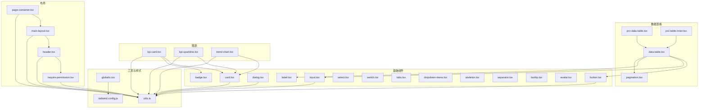
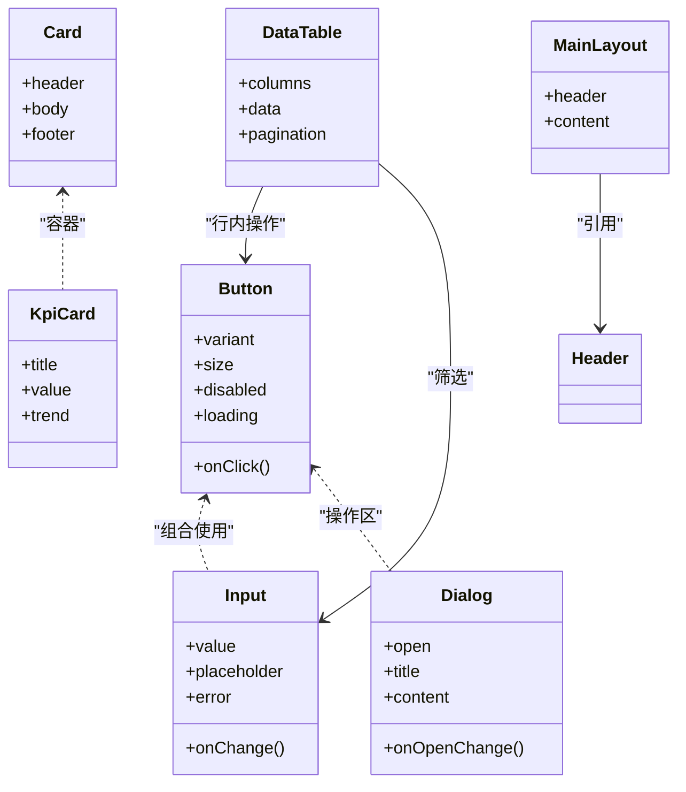
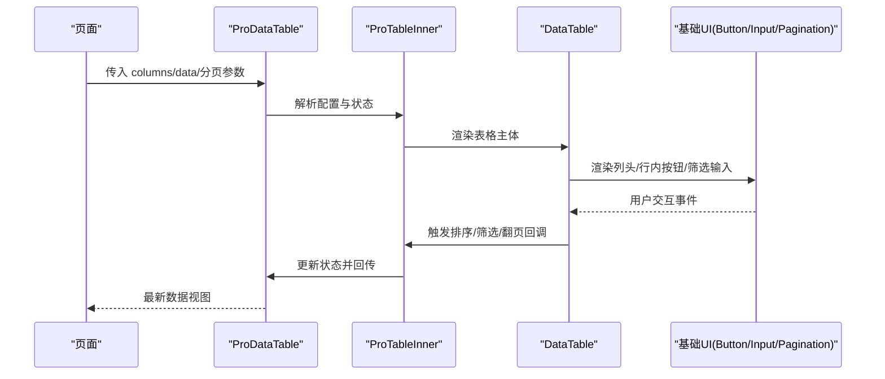
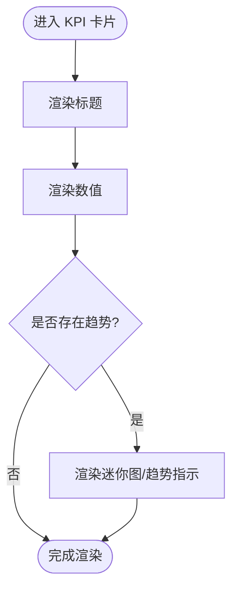
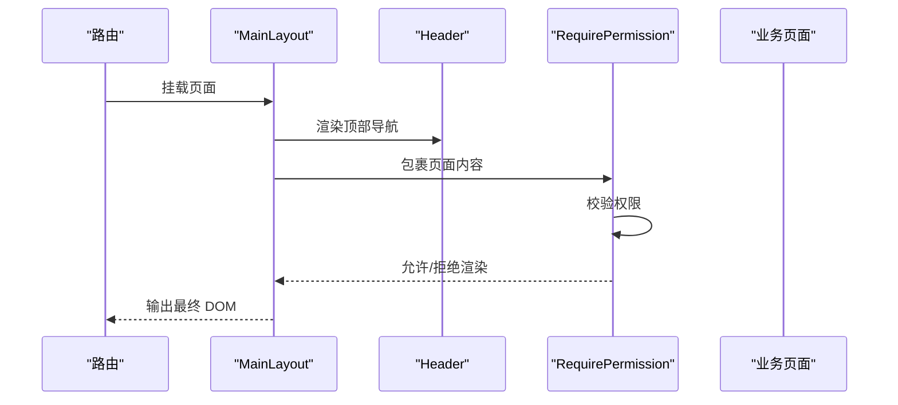
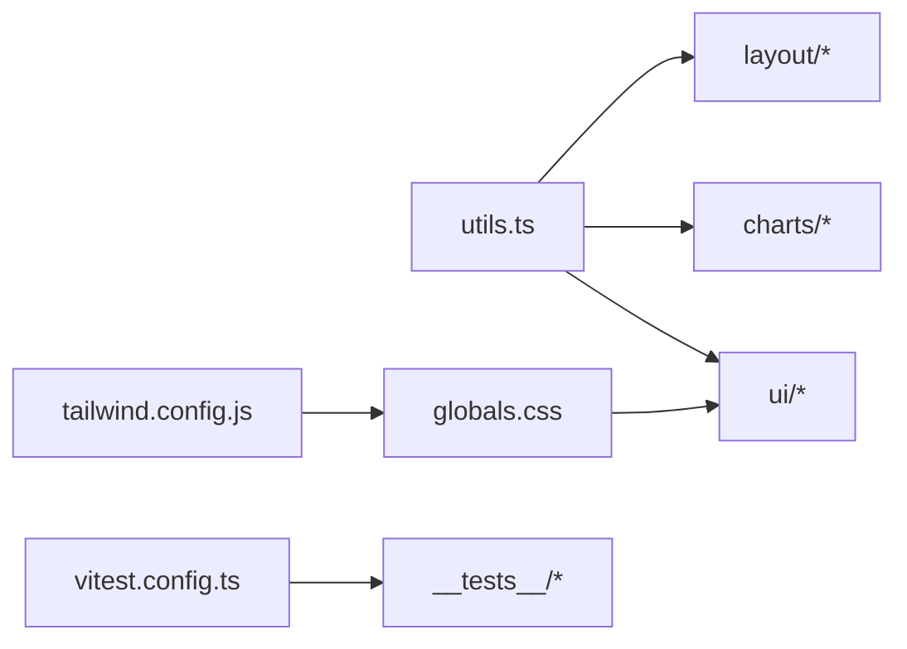

# UI组件库

<cite>
**本文引用的文件**   
- [web/src/components/ui/button.tsx](file://web/src/components/ui/button.tsx)
- [web/src/components/ui/input.tsx](file://web/src/components/ui/input.tsx)
- [web/src/components/ui/dialog.tsx](file://web/src/components/ui/dialog.tsx)
- [web/src/components/ui/card.tsx](file://web/src/components/ui/card.tsx)
- [web/src/components/ui/badge.tsx](file://web/src/components/ui/badge.tsx)
- [web/src/components/ui/avatar.tsx](file://web/src/components/ui/avatar.tsx)
- [web/src/components/ui/label.tsx](file://web/src/components/ui/label.tsx)
- [web/src/components/ui/select.tsx](file://web/src/components/ui/select.tsx)
- [web/src/components/ui/switch.tsx](file://web/src/components/ui/switch.tsx)
- [web/src/components/ui/tabs.tsx](file://web/src/components/ui/tabs.tsx)
- [web/src/components/ui/dropdown-menu.tsx](file://web/src/components/ui/dropdown-menu.tsx)
- [web/src/components/ui/skeleton.tsx](file://web/src/components/ui/skeleton.tsx)
- [web/src/components/ui/separator.tsx](file://web/src/components/ui/separator.tsx)
- [web/src/components/ui/tooltip.tsx](file://web/src/components/ui/tooltip.tsx)
- [web/src/components/data-table/data-table.tsx](file://web/src/components/data-table/data-table.tsx)
- [web/src/components/data-table/pro-data-table.tsx](file://web/src/components/data-table/pro-data-table.tsx)
- [web/src/components/data-table/pagination.tsx](file://web/src/components/data-table/pagination.tsx)
- [web/src/components/data-table/pro-table-inner.tsx](file://web/src/components/data-table/pro-table-inner.tsx)
- [web/src/components/charts/kpi-card.tsx](file://web/src/components/charts/kpi-card.tsx)
- [web/src/components/charts/kpi-sparkline.tsx](file://web/src/components/charts/kpi-sparkline.tsx)
- [web/src/components/charts/trend-chart.tsx](file://web/src/components/charts/trend-chart.tsx)
- [web/src/components/layout/header.tsx](file://web/src/components/layout/header.tsx)
- [web/src/components/layout/main-layout.tsx](file://web/src/components/layout/main-layout.tsx)
- [web/src/components/layout/page-container.tsx](file://web/src/components/layout/page-container.tsx)
- [web/src/components/layout/require-permission.tsx](file://web/src/components/layout/require-permission.tsx)
- [web/src/hooks/useAuth.ts](file://web/src/hooks/useAuth.ts)
- [web/src/hooks/usePermission.ts](file://web/src/hooks/usePermission.ts)
- [web/src/lib/utils.ts](file://web/src/lib/utils.ts)
- [web/src/lib/constants.ts](file://web/src/lib/constants.ts)
- [web/src/styles/globals.css](file://web/src/styles/globals.css)
- [web/tailwind.config.js](file://web/tailwind.config.js)
- [web/postcss.config.js](file://web/postcss.config.js)
- [web/vitest.config.ts](file://web/vitest.config.ts)
- [web/src/test/setup.ts](file://web/src/test/setup.ts)
- [web/src/components/data-table/__tests__/data-table.test.tsx](file://web/src/components/data-table/__tests__/data-table.test.tsx)
- [web/src/components/layout/__tests__/require-permission.test.tsx](file://web/src/components/layout/__tests__/require-permission.test.tsx)
- [web/src/hooks/__tests__/usePermission.test.tsx](file://web/src/hooks/__tests__/usePermission.test.tsx)
</cite>

## 目录
1. [简介](#简介)
2. [项目结构](#项目结构)
3. [核心组件](#核心组件)
4. [架构总览](#架构总览)
5. [详细组件分析](#详细组件分析)
6. [依赖关系分析](#依赖关系分析)
7. [性能考虑](#性能考虑)
8. [故障排查指南](#故障排查指南)
9. [结论](#结论)
10. [附录](#附录)

## 简介
本文件为 pj3 项目的 UI 组件库文档，聚焦于基于 Tailwind CSS 构建的基础与业务级 UI 组件体系。内容涵盖按钮、输入框、对话框、卡片等基础组件，以及数据表格、图表、布局等高级组件；详细说明属性配置、事件处理、样式定制选项与设计原则（可复用性、可访问性、响应式）；提供主题定制机制（颜色系统、字体规范、间距标准）说明；介绍测试策略与质量保证措施；并给出性能优化技巧与浏览器兼容性建议。

## 项目结构
UI 组件位于 web/src/components 下，按功能域组织：
- ui：基础原子组件（Button、Input、Dialog、Card 等）
- data-table：数据展示与交互（表格、分页、高级表格）
- charts：指标与趋势可视化（KPI 卡片、迷你图、趋势图）
- layout：页面级布局与权限控制（Header、MainLayout、PageContainer、RequirePermission）

图示来源
- [web/src/components/ui/button.tsx](file://web/src/components/ui/button.tsx)
- [web/src/components/ui/input.tsx](file://web/src/components/ui/input.tsx)
- [web/src/components/ui/dialog.tsx](file://web/src/components/ui/dialog.tsx)
- [web/src/components/ui/card.tsx](file://web/src/components/ui/card.tsx)
- [web/src/components/ui/label.tsx](file://web/src/components/ui/label.tsx)
- [web/src/components/ui/select.tsx](file://web/src/components/ui/select.tsx)
- [web/src/components/ui/switch.tsx](file://web/src/components/ui/switch.tsx)
- [web/src/components/ui/tabs.tsx](file://web/src/components/ui/tabs.tsx)
- [web/src/components/ui/dropdown-menu.tsx](file://web/src/components/ui/dropdown-menu.tsx)
- [web/src/components/ui/skeleton.tsx](file://web/src/components/ui/skeleton.tsx)
- [web/src/components/ui/separator.tsx](file://web/src/components/ui/separator.tsx)
- [web/src/components/ui/tooltip.tsx](file://web/src/components/ui/tooltip.tsx)
- [web/src/components/ui/avatar.tsx](file://web/src/components/ui/avatar.tsx)
- [web/src/components/ui/badge.tsx](file://web/src/components/ui/badge.tsx)
- [web/src/components/data-table/data-table.tsx](file://web/src/components/data-table/data-table.tsx)
- [web/src/components/data-table/pro-data-table.tsx](file://web/src/components/data-table/pro-data-table.tsx)
- [web/src/components/data-table/pro-table-inner.tsx](file://web/src/components/data-table/pro-table-inner.tsx)
- [web/src/components/data-table/pagination.tsx](file://web/src/components/data-table/pagination.tsx)
- [web/src/components/charts/kpi-card.tsx](file://web/src/components/charts/kpi-card.tsx)
- [web/src/components/charts/kpi-sparkline.tsx](file://web/src/components/charts/kpi-sparkline.tsx)
- [web/src/components/charts/trend-chart.tsx](file://web/src/components/charts/trend-chart.tsx)
- [web/src/components/layout/header.tsx](file://web/src/components/layout/header.tsx)
- [web/src/components/layout/main-layout.tsx](file://web/src/components/layout/main-layout.tsx)
- [web/src/components/layout/page-container.tsx](file://web/src/components/layout/page-container.tsx)
- [web/src/components/layout/require-permission.tsx](file://web/src/components/layout/require-permission.tsx)
- [web/src/lib/utils.ts](file://web/src/lib/utils.ts)
- [web/src/styles/globals.css](file://web/src/styles/globals.css)
- [web/tailwind.config.js](file://web/tailwind.config.js)

章节来源
- [web/src/components/ui/button.tsx](file://web/src/components/ui/button.tsx)
- [web/src/components/ui/input.tsx](file://web/src/components/ui/input.tsx)
- [web/src/components/ui/dialog.tsx](file://web/src/components/ui/dialog.tsx)
- [web/src/components/ui/card.tsx](file://web/src/components/ui/card.tsx)
- [web/src/components/data-table/data-table.tsx](file://web/src/components/data-table/data-table.tsx)
- [web/src/components/charts/kpi-card.tsx](file://web/src/components/charts/kpi-card.tsx)
- [web/src/components/layout/main-layout.tsx](file://web/src/components/layout/main-layout.tsx)
- [web/src/lib/utils.ts](file://web/src/lib/utils.ts)
- [web/src/styles/globals.css](file://web/src/styles/globals.css)
- [web/tailwind.config.js](file://web/tailwind.config.js)

## 核心组件
本节概述基础 UI 组件的职责与使用要点，强调可复用性与可访问性。

- 按钮 Button
  - 职责：触发操作，支持多种变体（主按钮、次按钮、危险、幽灵等）、尺寸与禁用态。
  - 关键属性：类型、尺寸、是否禁用、加载状态、图标位置、点击回调等。
  - 可访问性：语义化标签、键盘可达、ARIA 描述。
  - 样式定制：通过 Tailwind 类名覆盖或组合不同变体。
  - 参考实现路径：[web/src/components/ui/button.tsx](file://web/src/components/ui/button.tsx)

- 输入框 Input
  - 职责：文本输入，支持占位符、只读、禁用、错误提示、前缀/后缀等。
  - 关键属性：值、默认值、变更回调、校验提示、类型、大小写约束等。
  - 可访问性：关联 Label、错误信息 aria-describedby。
  - 参考实现路径：[web/src/components/ui/input.tsx](file://web/src/components/ui/input.tsx)

- 标签 Label
  - 职责：为表单控件提供可读的可见或屏幕阅读器友好的标签。
  - 参考实现路径：[web/src/components/ui/label.tsx](file://web/src/components/ui/label.tsx)

- 选择器 Select
  - 职责：下拉选择，支持单选/多选、搜索、分组、受控与非受控模式。
  - 参考实现路径：[web/src/components/ui/select.tsx](file://web/src/components/ui/select.tsx)

- 开关 Switch
  - 职责：布尔值切换，常用于设置项。
  - 参考实现路径：[web/src/components/ui/switch.tsx](file://web/src/components/ui/switch.tsx)

- 标签页 Tabs
  - 职责：分区内容切换，支持键盘导航与无障碍角色。
  - 参考实现路径：[web/src/components/ui/tabs.tsx](file://web/src/components/ui/tabs.tsx)

- 下拉菜单 Dropdown Menu
  - 职责：上下文操作入口，支持焦点管理与 ESC 关闭。
  - 参考实现路径：[web/src/components/ui/dropdown-menu.tsx](file://web/src/components/ui/dropdown-menu.tsx)

- 骨架屏 Skeleton
  - 职责：加载占位，提升感知性能。
  - 参考实现路径：[web/src/components/ui/skeleton.tsx](file://web/src/components/ui/skeleton.tsx)

- 分隔线 Separator
  - 职责：视觉分隔，保持版面节奏。
  - 参考实现路径：[web/src/components/ui/separator.tsx](file://web/src/components/ui/separator.tsx)

- 提示 Tooltip
  - 职责：轻量提示，延迟显示与定位。
  - 参考实现路径：[web/src/components/ui/tooltip.tsx](file://web/src/components/ui/tooltip.tsx)

- 头像 Avatar
  - 职责：用户头像展示，支持占位与降级。
  - 参考实现路径：[web/src/components/ui/avatar.tsx](file://web/src/components/ui/avatar.tsx)

- 徽章 Badge
  - 职责：状态标记、计数、标签。
  - 参考实现路径：[web/src/components/ui/badge.tsx](file://web/src/components/ui/badge.tsx)

- 对话框 Dialog
  - 职责：模态交互，包含标题、内容、操作区，管理焦点与遮罩。
  - 参考实现路径：[web/src/components/ui/dialog.tsx](file://web/src/components/ui/dialog.tsx)

- 卡片 Card
  - 职责：内容容器，用于聚合信息块。
  - 参考实现路径：[web/src/components/ui/card.tsx](file://web/src/components/ui/card.tsx)

章节来源
- [web/src/components/ui/button.tsx](file://web/src/components/ui/button.tsx)
- [web/src/components/ui/input.tsx](file://web/src/components/ui/input.tsx)
- [web/src/components/ui/label.tsx](file://web/src/components/ui/label.tsx)
- [web/src/components/ui/select.tsx](file://web/src/components/ui/select.tsx)
- [web/src/components/ui/switch.tsx](file://web/src/components/ui/switch.tsx)
- [web/src/components/ui/tabs.tsx](file://web/src/components/ui/tabs.tsx)
- [web/src/components/ui/dropdown-menu.tsx](file://web/src/components/ui/dropdown-menu.tsx)
- [web/src/components/ui/skeleton.tsx](file://web/src/components/ui/skeleton.tsx)
- [web/src/components/ui/separator.tsx](file://web/src/components/ui/separator.tsx)
- [web/src/components/ui/tooltip.tsx](file://web/src/components/ui/tooltip.tsx)
- [web/src/components/ui/avatar.tsx](file://web/src/components/ui/avatar.tsx)
- [web/src/components/ui/badge.tsx](file://web/src/components/ui/badge.tsx)
- [web/src/components/ui/dialog.tsx](file://web/src/components/ui/dialog.tsx)
- [web/src/components/ui/card.tsx](file://web/src/components/ui/card.tsx)

## 架构总览
UI 组件库采用“原子 + 复合”的分层设计：
- 原子层：ui/* 提供最小粒度的交互与展示单元
- 复合层：data-table、charts、layout 组合原子组件形成业务场景能力
- 工具层：lib/utils.ts 提供通用工具函数，styles/globals.css 与 tailwind.config.js 定义全局样式与设计令牌

图示来源
- [web/src/components/ui/button.tsx](file://web/src/components/ui/button.tsx)
- [web/src/components/ui/input.tsx](file://web/src/components/ui/input.tsx)
- [web/src/components/ui/dialog.tsx](file://web/src/components/ui/dialog.tsx)
- [web/src/components/ui/card.tsx](file://web/src/components/ui/card.tsx)
- [web/src/components/data-table/data-table.tsx](file://web/src/components/data-table/data-table.tsx)
- [web/src/components/charts/kpi-card.tsx](file://web/src/components/charts/kpi-card.tsx)
- [web/src/components/layout/main-layout.tsx](file://web/src/components/layout/main-layout.tsx)

## 详细组件分析

### 数据表格 Data Table
数据表格是复杂复合组件，封装列定义、排序、筛选、分页与导出等能力，内部由基础组件组合而成。

图示来源
- [web/src/components/data-table/pro-data-table.tsx](file://web/src/components/data-table/pro-data-table.tsx)
- [web/src/components/data-table/pro-table-inner.tsx](file://web/src/components/data-table/pro-table-inner.tsx)
- [web/src/components/data-table/data-table.tsx](file://web/src/components/data-table/data-table.tsx)
- [web/src/components/data-table/pagination.tsx](file://web/src/components/data-table/pagination.tsx)
- [web/src/components/ui/button.tsx](file://web/src/components/ui/button.tsx)
- [web/src/components/ui/input.tsx](file://web/src/components/ui/input.tsx)

章节来源
- [web/src/components/data-table/data-table.tsx](file://web/src/components/data-table/data-table.tsx)
- [web/src/components/data-table/pro-data-table.tsx](file://web/src/components/data-table/pro-data-table.tsx)
- [web/src/components/data-table/pro-table-inner.tsx](file://web/src/components/data-table/pro-table-inner.tsx)
- [web/src/components/data-table/pagination.tsx](file://web/src/components/data-table/pagination.tsx)

### 指标卡片 KPI Card
KPI 卡片聚合标题、数值与趋势信息，常与迷你图或趋势图组合呈现。

图示来源
- [web/src/components/charts/kpi-card.tsx](file://web/src/components/charts/kpi-card.tsx)
- [web/src/components/charts/kpi-sparkline.tsx](file://web/src/components/charts/kpi-sparkline.tsx)
- [web/src/components/charts/trend-chart.tsx](file://web/src/components/charts/trend-chart.tsx)
- [web/src/components/ui/card.tsx](file://web/src/components/ui/card.tsx)
- [web/src/components/ui/badge.tsx](file://web/src/components/ui/badge.tsx)

章节来源
- [web/src/components/charts/kpi-card.tsx](file://web/src/components/charts/kpi-card.tsx)
- [web/src/components/charts/kpi-sparkline.tsx](file://web/src/components/charts/kpi-sparkline.tsx)
- [web/src/components/charts/trend-chart.tsx](file://web/src/components/charts/trend-chart.tsx)
- [web/src/components/ui/card.tsx](file://web/src/components/ui/card.tsx)
- [web/src/components/ui/badge.tsx](file://web/src/components/ui/badge.tsx)

### 布局 Layout
布局组件负责页面整体结构与导航区域，结合权限控制实现路由级保护。

图示来源
- [web/src/components/layout/main-layout.tsx](file://web/src/components/layout/main-layout.tsx)
- [web/src/components/layout/header.tsx](file://web/src/components/layout/header.tsx)
- [web/src/components/layout/require-permission.tsx](file://web/src/components/layout/require-permission.tsx)

章节来源
- [web/src/components/layout/main-layout.tsx](file://web/src/components/layout/main-layout.tsx)
- [web/src/components/layout/header.tsx](file://web/src/components/layout/header.tsx)
- [web/src/components/layout/require-permission.tsx](file://web/src/components/layout/require-permission.tsx)

### 可访问性最佳实践
- 语义化标签：优先使用原生元素（button、input、select、dialog 等），确保正确的 ARIA 角色与状态。
- 键盘可达：所有交互均可通过 Tab/Enter/Space/Arrow 键操作，焦点顺序符合阅读逻辑。
- 屏幕阅读器：为图标、图片提供 alt/aria-label；为错误信息提供 aria-describedby。
- 对比度与色彩：遵循 WCAG 对比度要求，不单独以颜色传达状态。
- 参考实现路径：
  - [web/src/components/ui/button.tsx](file://web/src/components/ui/button.tsx)
  - [web/src/components/ui/input.tsx](file://web/src/components/ui/input.tsx)
  - [web/src/components/ui/dialog.tsx](file://web/src/components/ui/dialog.tsx)
  - [web/src/components/ui/tabs.tsx](file://web/src/components/ui/tabs.tsx)
  - [web/src/components/ui/dropdown-menu.tsx](file://web/src/components/ui/dropdown-menu.tsx)

章节来源
- [web/src/components/ui/button.tsx](file://web/src/components/ui/button.tsx)
- [web/src/components/ui/input.tsx](file://web/src/components/ui/input.tsx)
- [web/src/components/ui/dialog.tsx](file://web/src/components/ui/dialog.tsx)
- [web/src/components/ui/tabs.tsx](file://web/src/components/ui/tabs.tsx)
- [web/src/components/ui/dropdown-menu.tsx](file://web/src/components/ui/dropdown-menu.tsx)

## 依赖关系分析
- 组件耦合
  - 复合组件（如 ProDataTable、KpiCard）依赖基础组件（Button、Input、Card、Badge）。
  - 布局组件依赖权限钩子与工具函数。
- 外部依赖
  - Tailwind CSS 提供原子化样式；PostCSS 进行编译；Vitest 提供测试运行环境。
- 潜在循环
  - 当前分层清晰，未发现直接循环依赖；需避免在基础组件中反向引入复合组件。

图示来源
- [web/src/lib/utils.ts](file://web/src/lib/utils.ts)
- [web/tailwind.config.js](file://web/tailwind.config.js)
- [web/src/styles/globals.css](file://web/src/styles/globals.css)
- [web/vitest.config.ts](file://web/vitest.config.ts)

章节来源
- [web/src/lib/utils.ts](file://web/src/lib/utils.ts)
- [web/tailwind.config.js](file://web/tailwind.config.js)
- [web/src/styles/globals.css](file://web/src/styles/globals.css)
- [web/vitest.config.ts](file://web/vitest.config.ts)

## 性能考虑
- 列表与大数据
  - 虚拟滚动：对长列表启用虚拟化以减少重排与回流。
  - 分页与懒加载：服务端分页、按需加载详情。
- 渲染优化
  - React.memo/useMemo/useCallback：对频繁更新的组件与回调进行缓存。
  - 条件渲染：仅在必要时渲染复杂子树。
- 资源与网络
  - 图片与图标：使用 SVG 与雪碧图，开启压缩与缓存。
  - 代码分割：路由级与组件级懒加载。
- 样式与主题
  - 使用 Tailwind 原子类减少自定义 CSS 体积。
  - 主题变量集中管理，避免运行时计算样式。
- 可观测性
  - 埋点关键交互与错误边界，监控首屏与交互耗时。

[本节为通用指导，无需具体文件来源]

## 故障排查指南
- 常见问题
  - 样式未生效：检查 Tailwind 配置与 PostCSS 插件链；确认类名未被清理。
  - 表单不可用：核对 label 与 input 的 htmlFor/for 关联；检查受控状态是否正确同步。
  - 对话框焦点丢失：确认打开时焦点移入、关闭后恢复；验证遮罩与返回行为。
  - 表格排序/筛选无效：检查列定义与数据字段映射；确认回调是否更新状态。
- 调试建议
  - 使用浏览器开发者工具检查 ARIA 属性与焦点顺序。
  - 利用 Vitest 断言关键交互与渲染结果。
- 相关测试文件
  - [web/src/components/data-table/__tests__/data-table.test.tsx](file://web/src/components/data-table/__tests__/data-table.test.tsx)
  - [web/src/components/layout/__tests__/require-permission.test.tsx](file://web/src/components/layout/__tests__/require-permission.test.tsx)
  - [web/src/hooks/__tests__/usePermission.test.tsx](file://web/src/hooks/__tests__/usePermission.test.tsx)
  - [web/src/test/setup.ts](file://web/src/test/setup.ts)
  - [web/vitest.config.ts](file://web/vitest.config.ts)

章节来源
- [web/src/components/data-table/__tests__/data-table.test.tsx](file://web/src/components/data-table/__tests__/data-table.test.tsx)
- [web/src/components/layout/__tests__/require-permission.test.tsx](file://web/src/components/layout/__tests__/require-permission.test.tsx)
- [web/src/hooks/__tests__/usePermission.test.tsx](file://web/src/hooks/__tests__/usePermission.test.tsx)
- [web/src/test/setup.ts](file://web/src/test/setup.ts)
- [web/vitest.config.ts](file://web/vitest.config.ts)

## 结论
本 UI 组件库以 Tailwind CSS 为基础，构建了从原子到复合的完整体系。通过清晰的职责划分、良好的可访问性与响应式设计，配合完善的测试与性能优化策略，能够满足复杂业务场景下的稳定交付需求。建议在后续迭代中持续完善主题令牌、扩展国际化与深色模式支持，并加强自动化测试覆盖率。

[本节为总结性内容，无需具体文件来源]

## 附录

### 主题定制机制（设计令牌）
- 颜色系统
  - 在 tailwind.config.js 中扩展 color 命名空间，统一品牌色、中性色与语义色。
  - 在 globals.css 中定义 CSS 变量，供运行时动态切换主题。
- 字体规范
  - 通过 Tailwind 的 fontFamily 配置统一字族、字号阶梯与行高。
- 间距标准
  - 使用统一的 spacing scale，保证边距与内边距的一致性。
- 参考文件
  - [web/tailwind.config.js](file://web/tailwind.config.js)
  - [web/src/styles/globals.css](file://web/src/styles/globals.css)

章节来源
- [web/tailwind.config.js](file://web/tailwind.config.js)
- [web/src/styles/globals.css](file://web/src/styles/globals.css)

### 常用示例与组合
- 表单场景
  - 使用 Label + Input + Error 提示，结合 Button 提交。
  - 参考路径：[web/src/components/ui/label.tsx](file://web/src/components/ui/label.tsx)、[web/src/components/ui/input.tsx](file://web/src/components/ui/input.tsx)、[web/src/components/ui/button.tsx](file://web/src/components/ui/button.tsx)
- 数据看板
  - 使用 KpiCard 聚合指标，搭配 Badge 标注状态，使用 Tabs 切换维度。
  - 参考路径：[web/src/components/charts/kpi-card.tsx](file://web/src/components/charts/kpi-card.tsx)、[web/src/components/ui/badge.tsx](file://web/src/components/ui/badge.tsx)、[web/src/components/ui/tabs.tsx](file://web/src/components/ui/tabs.tsx)
- 数据报表
  - 使用 ProDataTable 承载筛选、排序、分页与导出。
  - 参考路径：[web/src/components/data-table/pro-data-table.tsx](file://web/src/components/data-table/pro-data-table.tsx)、[web/src/components/data-table/pagination.tsx](file://web/src/components/data-table/pagination.tsx)
- 页面布局
  - 使用 MainLayout 包裹 Header 与页面内容，并通过 RequirePermission 控制可见性。
  - 参考路径：[web/src/components/layout/main-layout.tsx](file://web/src/components/layout/main-layout.tsx)、[web/src/components/layout/header.tsx](file://web/src/components/layout/header.tsx)、[web/src/components/layout/require-permission.tsx](file://web/src/components/layout/require-permission.tsx)

[本节为概念性示例，无需具体文件来源]

### 测试策略与质量保证
- 单元测试
  - 针对交互与渲染进行断言，覆盖正常与异常分支。
  - 参考：[web/src/components/data-table/__tests__/data-table.test.tsx](file://web/src/components/data-table/__tests__/data-table.test.tsx)
- 集成测试
  - 模拟权限流程与页面渲染，确保端到端一致性。
  - 参考：[web/src/components/layout/__tests__/require-permission.test.tsx](file://web/src/components/layout/__tests__/require-permission.test.tsx)、[web/src/hooks/__tests__/usePermission.test.tsx](file://web/src/hooks/__tests__/usePermission.test.tsx)
- 测试环境
  - 使用 Vitest 与 setup 脚本初始化测试环境。
  - 参考：[web/vitest.config.ts](file://web/vitest.config.ts)、[web/src/test/setup.ts](file://web/src/test/setup.ts)

章节来源
- [web/src/components/data-table/__tests__/data-table.test.tsx](file://web/src/components/data-table/__tests__/data-table.test.tsx)
- [web/src/components/layout/__tests__/require-permission.test.tsx](file://web/src/components/layout/__tests__/require-permission.test.tsx)
- [web/src/hooks/__tests__/usePermission.test.tsx](file://web/src/hooks/__tests__/usePermission.test.tsx)
- [web/vitest.config.ts](file://web/vitest.config.ts)
- [web/src/test/setup.ts](file://web/src/test/setup.ts)

### 浏览器兼容性
- 现代浏览器：Chrome、Edge、Firefox、Safari 最新版本。
- 特性建议：
  - 使用 ESNext 语法时需转译；Tailwind 与 PostCSS 已内置兼容处理。
  - 对于旧版 IE 不支持的特性，建议使用 Polyfill 或降级方案。
- 参考文件
  - [web/postcss.config.js](file://web/postcss.config.js)
  - [web/tailwind.config.js](file://web/tailwind.config.js)

章节来源
- [web/postcss.config.js](file://web/postcss.config.js)
- [web/tailwind.config.js](file://web/tailwind.config.js)