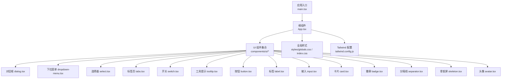
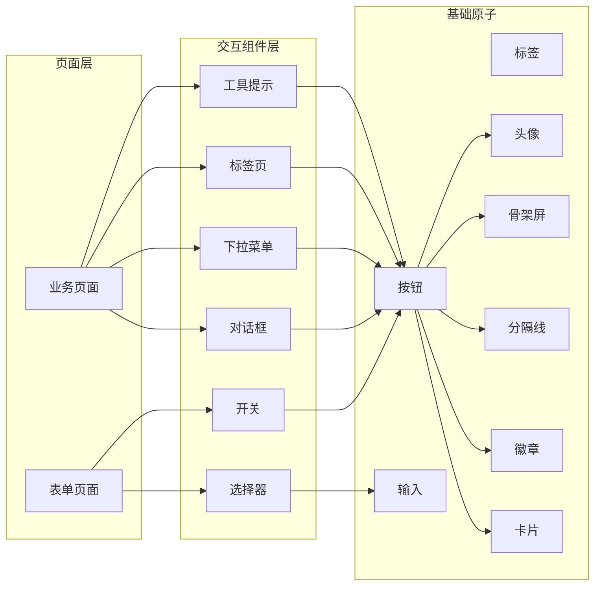
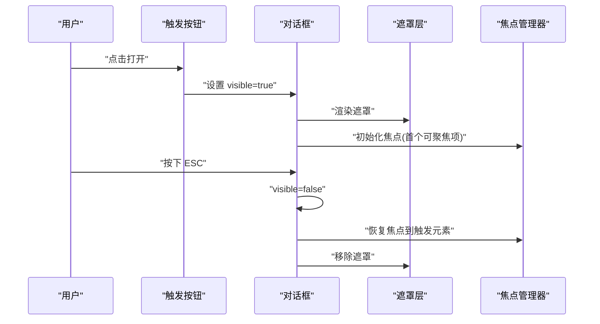
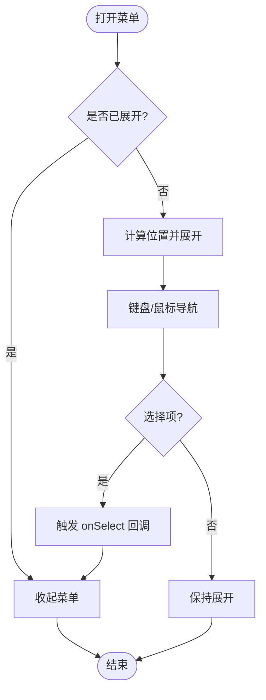
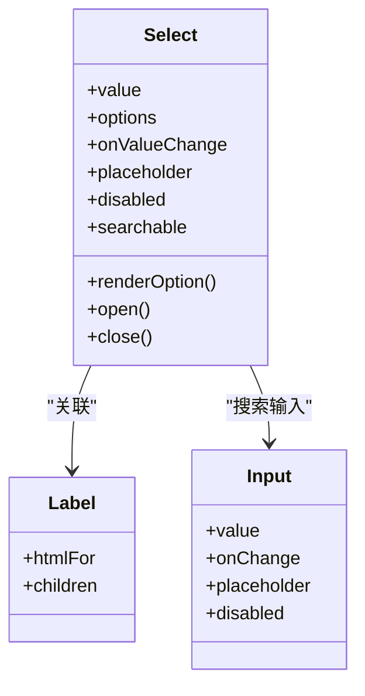
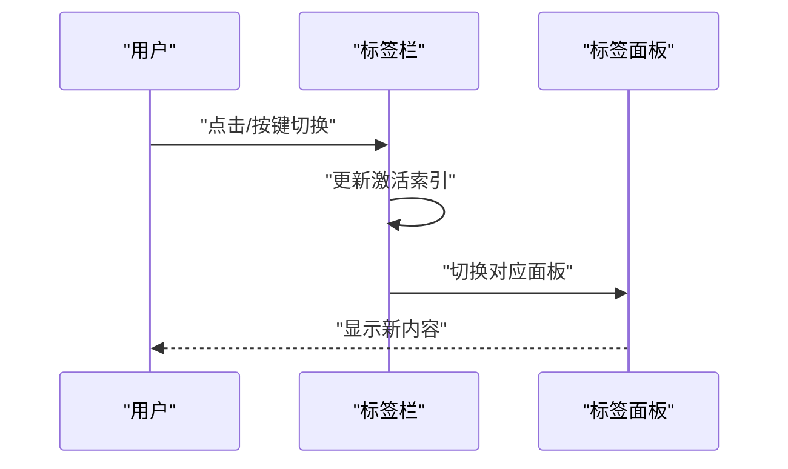
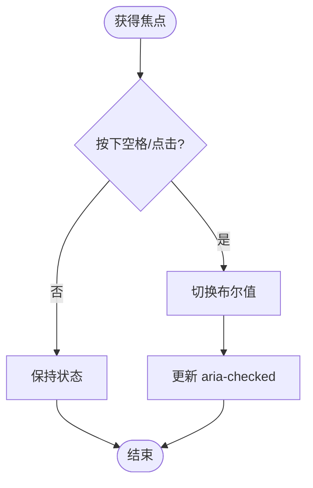
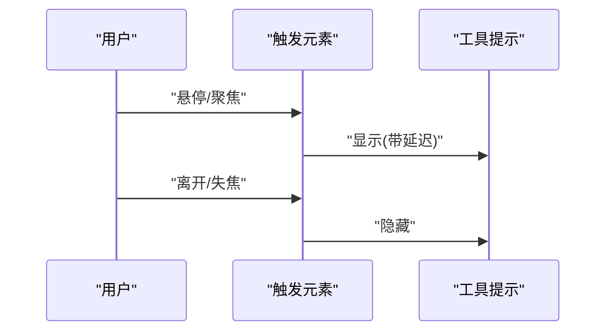
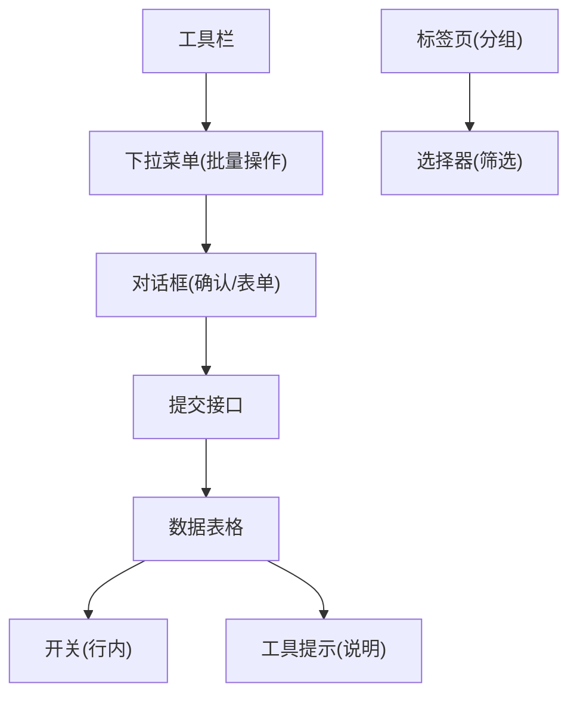
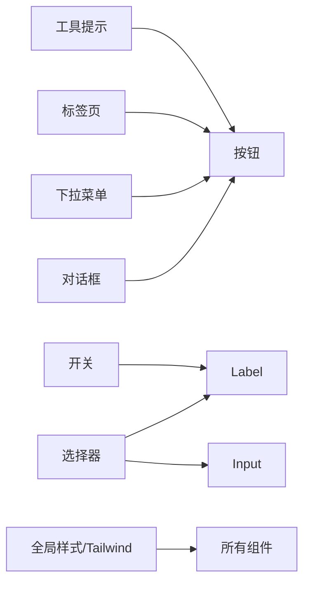

# 交互组件

<cite>
**本文引用的文件**   
- [dialog.tsx](file://web/src/components/ui/dialog.tsx)
- [dropdown-menu.tsx](file://web/src/components/ui/dropdown-menu.tsx)
- [select.tsx](file://web/src/components/ui/select.tsx)
- [tabs.tsx](file://web/src/components/ui/tabs.tsx)
- [switch.tsx](file://web/src/components/ui/switch.tsx)
- [tooltip.tsx](file://web/src/components/ui/tooltip.tsx)
- [button.tsx](file://web/src/components/ui/button.tsx)
- [label.tsx](file://web/src/components/ui/label.tsx)
- [input.tsx](file://web/src/components/ui/input.tsx)
- [card.tsx](file://web/src/components/ui/card.tsx)
- [badge.tsx](file://web/src/components/ui/badge.tsx)
- [separator.tsx](file://web/src/components/ui/separator.tsx)
- [skeleton.tsx](file://web/src/components/ui/skeleton.tsx)
- [avatar.tsx](file://web/src/components/ui/avatar.tsx)
- [App.tsx](file://web/src/App.tsx)
- [main.tsx](file://web/src/main.tsx)
- [globals.css](file://web/src/styles/globals.css)
- [index.css](file://web/src/index.css)
- [tailwind.config.js](file://web/tailwind.config.js)
</cite>

## 目录
1. [简介](#简介)
2. [项目结构](#项目结构)
3. [核心组件](#核心组件)
4. [架构总览](#架构总览)
5. [详细组件分析](#详细组件分析)
6. [依赖关系分析](#依赖关系分析)
7. [性能考虑](#性能考虑)
8. [故障排查指南](#故障排查指南)
9. [结论](#结论)
10. [附录](#附录)

## 简介
本文件面向 pj3 项目的交互组件，聚焦对话框、下拉菜单、选择器、标签页、开关、工具提示等基础 UI 组件。文档从实现原理、状态管理、事件处理与用户交互流程出发，系统阐述各组件的动画与过渡效果（如遮罩、展开收起）、可访问性（焦点管理、键盘操作、ARIA 属性）、主题与样式覆盖方法，并提供复杂业务场景下的组合使用示例与性能优化建议。目标是帮助开发者快速理解并高质量地使用这些组件。

## 项目结构
交互组件位于 web/src/components/ui 目录下，遵循“按功能拆分”的组织方式；全局样式通过 Tailwind CSS 配置与全局 CSS 文件注入；应用入口在 main.tsx 与 App.tsx。

图表来源
- [main.tsx](file://web/src/main.tsx)
- [App.tsx](file://web/src/App.tsx)
- [dialog.tsx](file://web/src/components/ui/dialog.tsx)
- [dropdown-menu.tsx](file://web/src/components/ui/dropdown-menu.tsx)
- [select.tsx](file://web/src/components/ui/select.tsx)
- [tabs.tsx](file://web/src/components/ui/tabs.tsx)
- [switch.tsx](file://web/src/components/ui/switch.tsx)
- [tooltip.tsx](file://web/src/components/ui/tooltip.tsx)
- [button.tsx](file://web/src/components/ui/button.tsx)
- [label.tsx](file://web/src/components/ui/label.tsx)
- [input.tsx](file://web/src/components/ui/input.tsx)
- [card.tsx](file://web/src/components/ui/card.tsx)
- [badge.tsx](file://web/src/components/ui/badge.tsx)
- [separator.tsx](file://web/src/components/ui/separator.tsx)
- [skeleton.tsx](file://web/src/components/ui/skeleton.tsx)
- [avatar.tsx](file://web/src/components/ui/avatar.tsx)
- [globals.css](file://web/src/styles/globals.css)
- [index.css](file://web/src/index.css)
- [tailwind.config.js](file://web/tailwind.config.js)

章节来源
- [main.tsx](file://web/src/main.tsx)
- [App.tsx](file://web/src/App.tsx)
- [globals.css](file://web/src/styles/globals.css)
- [index.css](file://web/src/index.css)
- [tailwind.config.js](file://web/tailwind.config.js)

## 核心组件
本节概述各交互组件的职责与典型用法要点：
- 对话框：承载模态内容，提供遮罩、焦点捕获、ESC 关闭、点击外部关闭等能力。
- 下拉菜单：悬浮式命令列表，支持键盘导航与焦点环。
- 选择器：受控或无状态的选择控件，支持单选/多选、搜索过滤等扩展。
- 标签页：多面板切换容器，维护激活态与键盘左右切换。
- 开关：布尔值切换控件，具备键盘空格切换与无障碍语义。
- 工具提示：延迟显示的辅助说明，跟随触发元素定位。

章节来源
- [dialog.tsx](file://web/src/components/ui/dialog.tsx)
- [dropdown-menu.tsx](file://web/src/components/ui/dropdown-menu.tsx)
- [select.tsx](file://web/src/components/ui/select.tsx)
- [tabs.tsx](file://web/src/components/ui/tabs.tsx)
- [switch.tsx](file://web/src/components/ui/switch.tsx)
- [tooltip.tsx](file://web/src/components/ui/tooltip.tsx)

## 架构总览
交互组件采用“轻量原子 + 组合模式”的架构：每个组件负责单一职责，通过 props 暴露状态与回调，由上层页面或容器组件进行受控管理。样式基于 Tailwind CSS，通过类名组合与自定义主题变量实现统一风格。

图表来源
- [dialog.tsx](file://web/src/components/ui/dialog.tsx)
- [dropdown-menu.tsx](file://web/src/components/ui/dropdown-menu.tsx)
- [select.tsx](file://web/src/components/ui/select.tsx)
- [tabs.tsx](file://web/src/components/ui/tabs.tsx)
- [switch.tsx](file://web/src/components/ui/switch.tsx)
- [tooltip.tsx](file://web/src/components/ui/tooltip.tsx)
- [button.tsx](file://web/src/components/ui/button.tsx)
- [label.tsx](file://web/src/components/ui/label.tsx)
- [input.tsx](file://web/src/components/ui/input.tsx)
- [card.tsx](file://web/src/components/ui/card.tsx)
- [badge.tsx](file://web/src/components/ui/badge.tsx)
- [separator.tsx](file://web/src/components/ui/separator.tsx)
- [skeleton.tsx](file://web/src/components/ui/skeleton.tsx)
- [avatar.tsx](file://web/src/components/ui/avatar.tsx)

## 详细组件分析

### 对话框（Dialog）
- 状态管理
  - 可见性：通常由父组件通过受控 prop 控制显示/隐藏。
  - 焦点管理：打开时聚焦到首个可交互元素，关闭后恢复焦点。
  - 遮罩层：用于拦截背景交互并承载 ESC 关闭逻辑。
- 事件处理
  - 键盘：ESC 关闭、Tab 循环焦点。
  - 鼠标：点击遮罩关闭、内部按钮触发回调。
- 动画与过渡
  - 遮罩淡入淡出、内容缩放/位移进入退出。
  - 通过 CSS 过渡或动画库驱动，结合渲染时机避免闪烁。
- 可访问性
  - role="dialog"、aria-modal="true"、aria-labelledby 指向标题。
  - 焦点陷阱与返回焦点策略。
- 使用要点
  - 将业务表单或确认信息放入对话框主体。
  - 通过受控模式与父级状态同步，确保多次打开行为一致。

图表来源
- [dialog.tsx](file://web/src/components/ui/dialog.tsx)
- [button.tsx](file://web/src/components/ui/button.tsx)

章节来源
- [dialog.tsx](file://web/src/components/ui/dialog.tsx)
- [button.tsx](file://web/src/components/ui/button.tsx)

### 下拉菜单（Dropdown Menu）
- 状态管理
  - 展开/收起：由受控 prop 或内部状态维护。
  - 选中项：可选受控，便于与表单联动。
- 事件处理
  - 键盘：上下箭头移动焦点、回车确认、Esc 关闭。
  - 鼠标：点击选项触发回调、点击外部关闭。
- 动画与过渡
  - 展开收起使用高度/透明度过渡，避免布局抖动。
- 可访问性
  - role="menu"/role="menuitem"、aria-expanded、aria-activedescendant。
  - 焦点环与 Tab 顺序合理。
- 使用要点
  - 与按钮组合作为触发器，菜单定位需考虑视口边界。

图表来源
- [dropdown-menu.tsx](file://web/src/components/ui/dropdown-menu.tsx)
- [button.tsx](file://web/src/components/ui/button.tsx)

章节来源
- [dropdown-menu.tsx](file://web/src/components/ui/dropdown-menu.tsx)
- [button.tsx](file://web/src/components/ui/button.tsx)

### 选择器（Select）
- 状态管理
  - 值：受控或内部状态，支持单选/多选。
  - 搜索：本地过滤或远程加载。
- 事件处理
  - 键盘：上下选择、回车确认、Esc 关闭。
  - 鼠标：点击选项、点击外部关闭。
- 动画与过渡
  - 下拉面板展开收起过渡，列表项高亮平滑。
- 可访问性
  - role="combobox"、aria-expanded、aria-activedescendant、aria-controls。
  - 与 Label 关联，提升可读性。
- 使用要点
  - 大数据量时使用虚拟滚动或分页加载。
  - 与表单校验联动，展示错误状态。

图表来源
- [select.tsx](file://web/src/components/ui/select.tsx)
- [label.tsx](file://web/src/components/ui/label.tsx)
- [input.tsx](file://web/src/components/ui/input.tsx)

章节来源
- [select.tsx](file://web/src/components/ui/select.tsx)
- [label.tsx](file://web/src/components/ui/label.tsx)
- [input.tsx](file://web/src/components/ui/input.tsx)

### 标签页（Tabs）
- 状态管理
  - 激活索引：受控或内部状态，支持禁用项。
  - 方向键：左右切换，循环或边界停止。
- 事件处理
  - 键盘：左右切换、Home/End 跳转首尾。
  - 鼠标：点击切换。
- 动画与过渡
  - 面板切换使用淡入淡出或滑动过渡。
- 可访问性
  - role="tablist"/role="tab"/role="tabpanel"、aria-selected、aria-controls。
- 使用要点
  - 长内容面板按需懒加载，减少初始渲染成本。

图表来源
- [tabs.tsx](file://web/src/components/ui/tabs.tsx)

章节来源
- [tabs.tsx](file://web/src/components/ui/tabs.tsx)

### 开关（Switch）
- 状态管理
  - 布尔值：受控或内部状态，支持禁用。
- 事件处理
  - 键盘：空格切换、Tab 进出。
  - 鼠标：点击切换。
- 动画与过渡
  - 滑块位移与颜色变化过渡。
- 可访问性
  - role="switch"、aria-checked、aria-label。
- 使用要点
  - 与 Label 绑定，明确用途。

图表来源
- [switch.tsx](file://web/src/components/ui/switch.tsx)
- [label.tsx](file://web/src/components/ui/label.tsx)

章节来源
- [switch.tsx](file://web/src/components/ui/switch.tsx)
- [label.tsx](file://web/src/components/ui/label.tsx)

### 工具提示（Tooltip）
- 状态管理
  - 显隐：hover/focus 触发，支持延迟显示与防抖。
  - 定位：相对触发元素计算位置，避免溢出。
- 事件处理
  - 鼠标：enter/leave 控制显隐。
  - 键盘：focus 显示，blur 隐藏。
- 动画与过渡
  - 淡入淡出与轻微位移过渡。
- 可访问性
  - role="tooltip"、aria-describedby 关联触发元素。
- 使用要点
  - 文本简短明确，避免遮挡关键内容。

图表来源
- [tooltip.tsx](file://web/src/components/ui/tooltip.tsx)
- [button.tsx](file://web/src/components/ui/button.tsx)

章节来源
- [tooltip.tsx](file://web/src/components/ui/tooltip.tsx)
- [button.tsx](file://web/src/components/ui/button.tsx)

### 组合使用示例（复杂业务场景）
- 数据表格中的批量操作
  - 行内使用开关控制启用/停用，配合工具提示说明影响范围。
  - 顶部工具栏使用下拉菜单执行批量删除、导出等操作。
  - 重要操作通过对话框二次确认，包含表单与错误提示。
- 表单编辑
  - 选择器用于筛选条件，标签页分组不同字段区块。
  - 提交前弹出对话框汇总变更，确认后调用接口并刷新。

图表来源
- [switch.tsx](file://web/src/components/ui/switch.tsx)
- [tooltip.tsx](file://web/src/components/ui/tooltip.tsx)
- [dropdown-menu.tsx](file://web/src/components/ui/dropdown-menu.tsx)
- [dialog.tsx](file://web/src/components/ui/dialog.tsx)
- [tabs.tsx](file://web/src/components/ui/tabs.tsx)
- [select.tsx](file://web/src/components/ui/select.tsx)

## 依赖关系分析
- 组件间耦合
  - 对话框依赖按钮作为触发器；下拉菜单与按钮组合；选择器与标签、输入组合；标签页与按钮组合；开关与标签组合；工具提示与任意可交互元素组合。
- 样式依赖
  - 全局样式与 Tailwind 配置决定主题色、圆角、阴影、间距等视觉规范。
- 外部依赖
  - 若使用第三方动画库或定位库，需在配置中声明并在组件中引入。

图表来源
- [dialog.tsx](file://web/src/components/ui/dialog.tsx)
- [dropdown-menu.tsx](file://web/src/components/ui/dropdown-menu.tsx)
- [select.tsx](file://web/src/components/ui/select.tsx)
- [tabs.tsx](file://web/src/components/ui/tabs.tsx)
- [switch.tsx](file://web/src/components/ui/switch.tsx)
- [tooltip.tsx](file://web/src/components/ui/tooltip.tsx)
- [button.tsx](file://web/src/components/ui/button.tsx)
- [label.tsx](file://web/src/components/ui/label.tsx)
- [input.tsx](file://web/src/components/ui/input.tsx)
- [globals.css](file://web/src/styles/globals.css)
- [index.css](file://web/src/index.css)
- [tailwind.config.js](file://web/tailwind.config.js)

章节来源
- [tailwind.config.js](file://web/tailwind.config.js)
- [globals.css](file://web/src/styles/globals.css)
- [index.css](file://web/src/index.css)

## 性能考虑
- 渲染优化
  - 对大型列表（选择器、下拉菜单）使用虚拟滚动或分页加载。
  - 标签页面板按需懒加载，避免一次性渲染大量 DOM。
- 事件与动画
  - 使用 requestAnimationFrame 或 CSS transition 减少重排重绘。
  - 为频繁触发的 hover/focus 添加节流/防抖。
- 内存与焦点
  - 对话框关闭后及时清理监听器与定时器，释放焦点陷阱。
  - 避免在高频回调中创建新对象，复用计算结果。
- 可访问性与体验
  - 合理的延迟显示工具提示，避免误触。
  - 为键盘用户提供清晰的焦点指示与反馈。

[本节为通用指导，不直接分析具体文件]

## 故障排查指南
- 对话框无法关闭
  - 检查可见性状态是否被父组件正确更新。
  - 确认 ESC 事件监听是否被移除或阻止冒泡。
- 下拉菜单定位异常
  - 检查视口边界计算与滚动容器上下文。
  - 确认 z-index 层级未被其他元素覆盖。
- 选择器搜索无效
  - 核对 options 数据结构与过滤逻辑。
  - 确认受控 value 与 onChange 同步。
- 标签页切换卡顿
  - 评估面板内容复杂度，考虑懒加载或分片渲染。
- 开关状态不同步
  - 确认受控模式下父组件 state 更新与 UI 同步。
- 工具提示不显示
  - 检查触发元素的可见性与可聚焦性。
  - 确认延迟与防抖参数设置合理。

章节来源
- [dialog.tsx](file://web/src/components/ui/dialog.tsx)
- [dropdown-menu.tsx](file://web/src/components/ui/dropdown-menu.tsx)
- [select.tsx](file://web/src/components/ui/select.tsx)
- [tabs.tsx](file://web/src/components/ui/tabs.tsx)
- [switch.tsx](file://web/src/components/ui/switch.tsx)
- [tooltip.tsx](file://web/src/components/ui/tooltip.tsx)

## 结论
pj3 的交互组件以轻量原子与组合模式为核心，通过受控状态、完善的键盘与无障碍支持、以及流畅的过渡动画，提供了稳定且可扩展的用户体验。在实际项目中，建议优先采用受控模式管理状态，结合 Tailwind 主题与全局样式实现一致的视觉风格，并通过懒加载与虚拟化等手段保障性能。

[本节为总结，不直接分析具体文件]

## 附录
- 主题与样式覆盖
  - 通过 Tailwind 配置文件定义品牌色、圆角、阴影等设计令牌。
  - 在全局 CSS 中补充组件特定样式，注意优先级与命名空间。
- 最佳实践清单
  - 始终为可交互元素提供明确的语义与标签。
  - 为复杂操作增加二次确认与成功/失败反馈。
  - 对大数据量组件实施分页或虚拟滚动。
  - 在移动端关注触摸目标尺寸与手势冲突。

章节来源
- [tailwind.config.js](file://web/tailwind.config.js)
- [globals.css](file://web/src/styles/globals.css)
- [index.css](file://web/src/index.css)