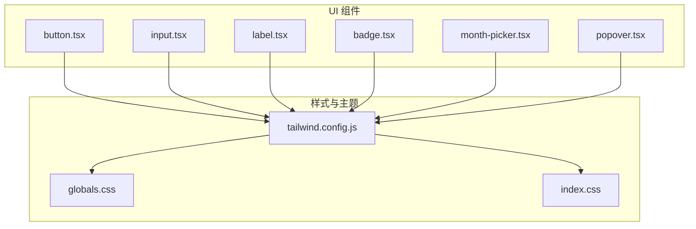
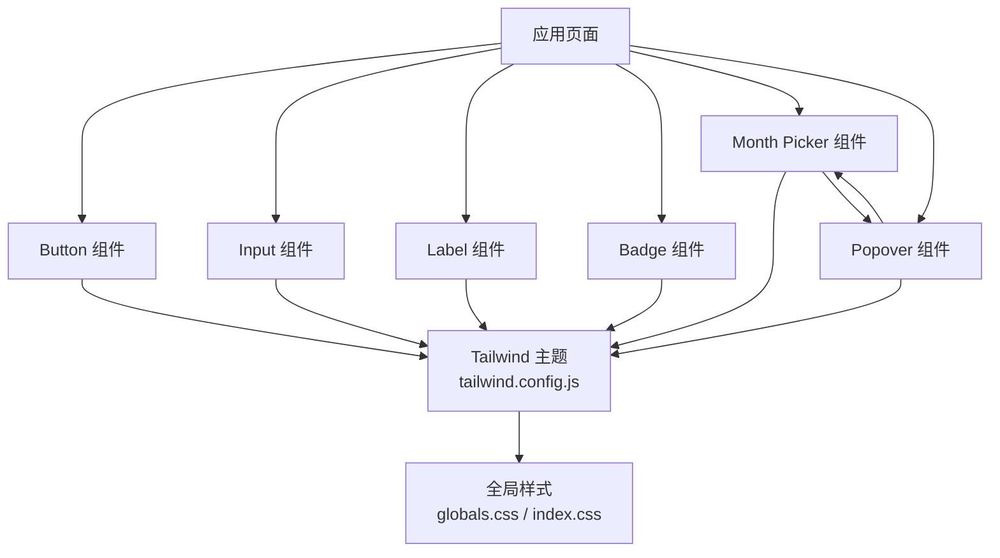
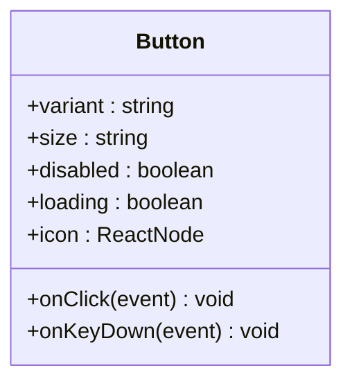
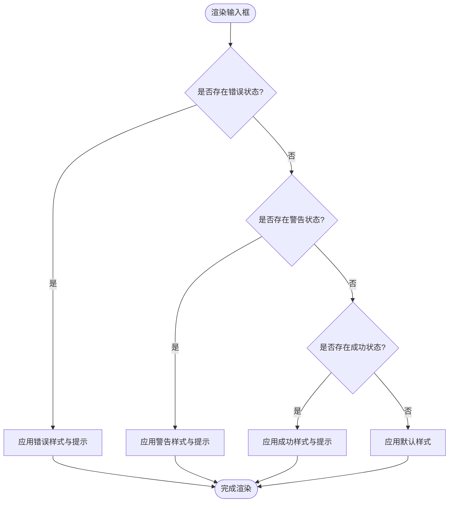
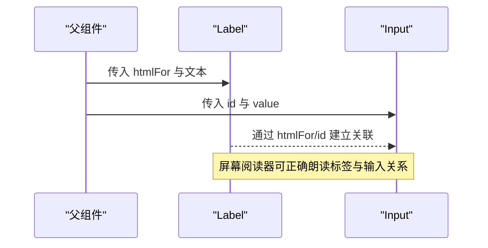
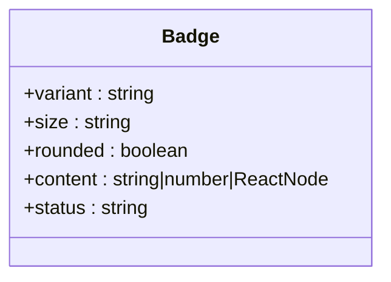
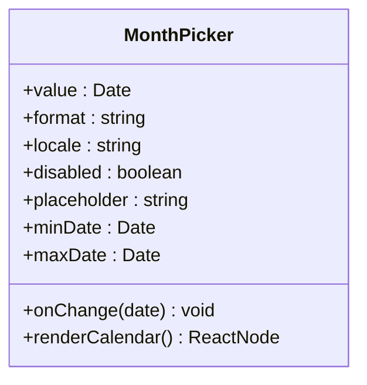
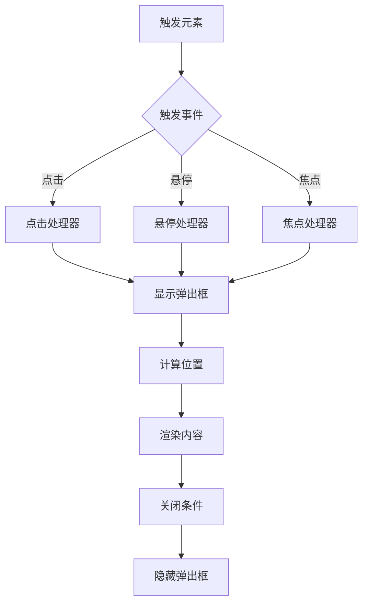
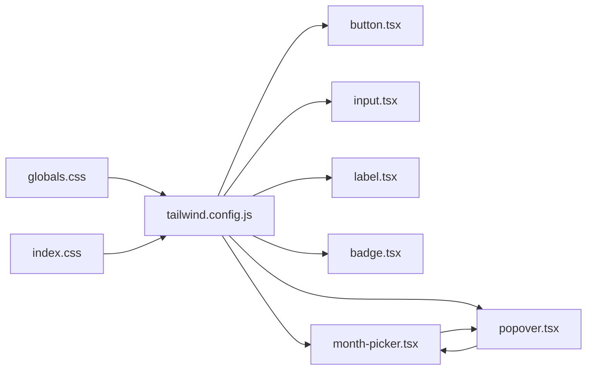

# 基础UI组件

<cite>
**本文引用的文件**   
- [button.tsx](file://web/src/components/ui/button.tsx)
- [input.tsx](file://web/src/components/ui/input.tsx)
- [label.tsx](file://web/src/components/ui/label.tsx)
- [badge.tsx](file://web/src/components/ui/badge.tsx)
- [month-picker.tsx](file://web/src/components/ui/month-picker.tsx)
- [popover.tsx](file://web/src/components/ui/popover.tsx)
- [tailwind.config.js](file://web/tailwind.config.js)
- [globals.css](file://web/src/styles/globals.css)
- [index.css](file://web/src/index.css)
</cite>

## 更新摘要
**变更内容**   
- 新增月份选择器组件文档，包含日期选择、格式化、国际化支持
- 新增弹出框组件文档，包含定位策略、触发方式、内容管理
- 增强表单交互能力说明，整合新的日期选择和弹出功能
- 更新组件架构图，反映新增的交互组件

## 目录
1. [简介](#简介)
2. [项目结构](#项目结构)
3. [核心组件](#核心组件)
4. [架构总览](#架构总览)
5. [详细组件分析](#详细组件分析)
6. [新增组件详解](#新增组件详解)
7. [依赖分析](#依赖分析)
8. [性能考虑](#性能考虑)
9. [故障排查指南](#故障排查指南)
10. [结论](#结论)
11. [附录](#附录)

## 简介
本文件面向pj3项目的Web前端，聚焦于基础UI组件库的实现与使用。内容覆盖按钮、输入框、标签、徽章等核心组件以及新增的月份选择器和弹出框组件的Props配置、样式变体、尺寸规格、状态管理、可访问性实现、主题定制机制（基于Tailwind CSS），以及最佳实践与常见陷阱。文档旨在帮助开发者快速上手并稳定扩展这些基础组件。

## 项目结构
基础UI组件位于 web/src/components/ui 目录下，采用按功能划分的组织方式；样式通过 Tailwind CSS 进行主题化与变体控制，全局样式入口在 src/styles/globals.css 与 src/index.css。新增的月份选择器和弹出框组件进一步增强了表单交互能力。

图表来源
- [button.tsx:1-200](file://web/src/components/ui/button.tsx#L1-L200)
- [input.tsx:1-200](file://web/src/components/ui/input.tsx#L1-L200)
- [label.tsx:1-200](file://web/src/components/ui/label.tsx#L1-L200)
- [badge.tsx:1-200](file://web/src/components/ui/badge.tsx#L1-L200)
- [month-picker.tsx:1-200](file://web/src/components/ui/month-picker.tsx#L1-L200)
- [popover.tsx:1-200](file://web/src/components/ui/popover.tsx#L1-L200)
- [tailwind.config.js:1-200](file://web/tailwind.config.js#L1-L200)
- [globals.css:1-200](file://web/src/styles/globals.css#L1-L200)
- [index.css:1-200](file://web/src/index.css#L1-L200)

章节来源
- [button.tsx:1-200](file://web/src/components/ui/button.tsx#L1-L200)
- [input.tsx:1-200](file://web/src/components/ui/input.tsx#L1-L200)
- [label.tsx:1-200](file://web/src/components/ui/label.tsx#L1-L200)
- [badge.tsx:1-200](file://web/src/components/ui/badge.tsx#L1-L200)
- [month-picker.tsx:1-200](file://web/src/components/ui/month-picker.tsx#L1-L200)
- [popover.tsx:1-200](file://web/src/components/ui/popover.tsx#L1-L200)
- [tailwind.config.js:1-200](file://web/tailwind.config.js#L1-L200)
- [globals.css:1-200](file://web/src/styles/globals.css#L1-L200)
- [index.css:1-200](file://web/src/index.css#L1-L200)

## 核心组件
本节概述各组件的职责与能力边界：
- 按钮：提供多种样式变体（如主操作、次要、描边）、尺寸规格、禁用态、加载态、图标支持、键盘交互与可访问性属性。
- 输入框：支持文本输入、占位符、只读、禁用、大小与对齐、错误/警告/成功状态提示、前缀/后缀插槽、表单关联。
- 标签：用于描述输入控件的可访问性标签，支持视觉隐藏与屏幕阅读器可见。
- 徽章：展示状态或计数信息，支持类型与颜色变体、尺寸与形状控制。
- 月份选择器：提供直观的月份选择界面，支持日期格式化、国际化、范围选择等功能。
- 弹出框：提供灵活的弹出层功能，支持多种触发方式、定位策略和内容管理。

章节来源
- [button.tsx:1-200](file://web/src/components/ui/button.tsx#L1-L200)
- [input.tsx:1-200](file://web/src/components/ui/input.tsx#L1-L200)
- [label.tsx:1-200](file://web/src/components/ui/label.tsx#L1-L200)
- [badge.tsx:1-200](file://web/src/components/ui/badge.tsx#L1-L200)
- [month-picker.tsx:1-200](file://web/src/components/ui/month-picker.tsx#L1-L200)
- [popover.tsx:1-200](file://web/src/components/ui/popover.tsx#L1-L200)

## 架构总览
基础组件遵循"受控 + 无侵入"的设计原则：
- 样式层：通过 Tailwind CSS 类名组合实现变体与响应式；主题色、圆角、阴影等在 tailwind.config.js 中集中定义。
- 行为层：React Props 驱动渲染与交互；可选的受控模式由外部状态管理。
- 可访问性：语义化HTML元素、ARIA属性、焦点管理与键盘导航。
- 交互层：新增的弹出框和月份选择器提供了丰富的用户交互能力。

图表来源
- [button.tsx:1-200](file://web/src/components/ui/button.tsx#L1-L200)
- [input.tsx:1-200](file://web/src/components/ui/input.tsx#L1-L200)
- [label.tsx:1-200](file://web/src/components/ui/label.tsx#L1-L200)
- [badge.tsx:1-200](file://web/src/components/ui/badge.tsx#L1-L200)
- [month-picker.tsx:1-200](file://web/src/components/ui/month-picker.tsx#L1-L200)
- [popover.tsx:1-200](file://web/src/components/ui/popover.tsx#L1-L200)
- [tailwind.config.js:1-200](file://web/tailwind.config.js#L1-L200)
- [globals.css:1-200](file://web/src/styles/globals.css#L1-L200)
- [index.css:1-200](file://web/src/index.css#L1-L200)

## 详细组件分析

### 按钮 Button
- 职责：触发操作，承载文本、图标与加载指示。
- 关键特性：
  - 样式变体：主操作、次要、描边、危险等。
  - 尺寸：默认、小、大。
  - 状态：禁用、加载、激活。
  - 可访问性：role、aria-*、键盘事件、焦点样式。
  - 组合：可与图标组件组合使用。

图表来源
- [button.tsx:1-200](file://web/src/components/ui/button.tsx#L1-L200)

使用示例路径（不含代码）
- 主操作按钮：[button.tsx:1-200](file://web/src/components/ui/button.tsx#L1-L200)
- 次要按钮：[button.tsx:1-200](file://web/src/components/ui/button.tsx#L1-L200)
- 描边按钮：[button.tsx:1-200](file://web/src/components/ui/button.tsx#L1-L200)
- 带图标的按钮：[button.tsx:1-200](file://web/src/components/ui/button.tsx#L1-L200)
- 加载态按钮：[button.tsx:1-200](file://web/src/components/ui/button.tsx#L1-L200)
- 禁用态按钮：[button.tsx:1-200](file://web/src/components/ui/button.tsx#L1-L200)

可访问性要点
- 使用原生 button 语义，确保键盘可聚焦与回车/空格触发。
- 为图标按钮提供 aria-label。
- 加载态时设置 aria-busy 与禁用交互。

主题定制建议
- 在 tailwind.config.js 中扩展 color、radius、shadow 以统一风格。
- 通过 variant 映射到不同 Tailwind 类集合，便于维护。

章节来源
- [button.tsx:1-200](file://web/src/components/ui/button.tsx#L1-L200)
- [tailwind.config.js:1-200](file://web/tailwind.config.js#L1-L200)

### 输入框 Input
- 职责：接收用户文本输入，支持验证反馈与前/后缀。
- 关键特性：
  - 基础属性：value、placeholder、readOnly、disabled、type、name、id。
  - 尺寸与布局：大小、宽度、对齐、内边距。
  - 状态：错误、警告、成功、聚焦、禁用。
  - 辅助：前缀/后缀插槽、图标、清除按钮。
  - 可访问性：与 Label 关联、aria-invalid、aria-describedby。

图表来源
- [input.tsx:1-200](file://web/src/components/ui/input.tsx#L1-L200)

使用示例路径（不含代码）
- 基本输入框：[input.tsx:1-200](file://web/src/components/ui/input.tsx#L1-L200)
- 错误状态输入框：[input.tsx:1-200](file://web/src/components/ui/input.tsx#L1-L200)
- 带前缀/后缀的输入框：[input.tsx:1-200](file://web/src/components/ui/input.tsx#L1-L200)
- 只读与禁用输入框：[input.tsx:1-200](file://web/src/components/ui/input.tsx#L1-L200)

可访问性要点
- 使用 id 与 label htmlFor 建立关联。
- 错误时设置 aria-invalid="true" 并通过 aria-describedby 指向提示信息。
- 保持清晰的焦点样式与键盘导航顺序。

主题定制建议
- 将输入框边框、背景、字体、圆角纳入主题变量，保证一致性。
- 通过状态类名切换颜色与边框，避免硬编码。

章节来源
- [input.tsx:1-200](file://web/src/components/ui/input.tsx#L1-L200)
- [label.tsx:1-200](file://web/src/components/ui/label.tsx#L1-L200)
- [tailwind.config.js:1-200](file://web/tailwind.config.js#L1-L200)

### 标签 Label
- 职责：为输入控件提供可访问性标签与视觉说明。
- 关键特性：
  - 与输入框通过 htmlFor/id 关联。
  - 支持视觉隐藏但屏幕阅读器可读的标签模式。
  - 支持错误/禁用等状态的样式联动。

图表来源
- [label.tsx:1-200](file://web/src/components/ui/label.tsx#L1-L200)
- [input.tsx:1-200](file://web/src/components/ui/input.tsx#L1-L200)

使用示例路径（不含代码）
- 基础标签：[label.tsx:1-200](file://web/src/components/ui/label.tsx#L1-L200)
- 与输入框关联：[label.tsx:1-200](file://web/src/components/ui/label.tsx#L1-L200)

可访问性要点
- 始终为可交互控件提供标签。
- 避免仅用 placeholder 作为唯一标签。

章节来源
- [label.tsx:1-200](file://web/src/components/ui/label.tsx#L1-L200)
- [input.tsx:1-200](file://web/src/components/ui/input.tsx#L1-L200)

### 徽章 Badge
- 职责：展示状态、计数或简短信息。
- 关键特性：
  - 类型与颜色：成功、警告、危险、信息、中性等。
  - 尺寸与形状：小/默认/大，圆角/胶囊。
  - 内容：文本、图标、数字。
  - 可访问性：role/status、aria-live 区域更新计数。

图表来源
- [badge.tsx:1-200](file://web/src/components/ui/badge.tsx#L1-L200)

使用示例路径（不含代码）
- 成功徽章：[badge.tsx:1-200](file://web/src/components/ui/badge.tsx#L1-L200)
- 警告徽章：[badge.tsx:1-200](file://web/src/components/ui/badge.tsx#L1-L200)
- 危险徽章：[badge.tsx:1-200](file://web/src/components/ui/badge.tsx#L1-L200)
- 计数徽章：[badge.tsx:1-200](file://web/src/components/ui/badge.tsx#L1-L200)

可访问性要点
- 动态计数的徽章建议使用 aria-live 告知屏幕阅读器。
- 纯装饰性徽章应设置 aria-hidden="true"。

主题定制建议
- 在 tailwind.config.js 中定义语义化颜色与尺寸比例，便于统一调整。

章节来源
- [badge.tsx:1-200](file://web/src/components/ui/badge.tsx#L1-L200)
- [tailwind.config.js:1-200](file://web/tailwind.config.js#L1-L200)

## 新增组件详解

### 月份选择器 MonthPicker
- 职责：提供直观的月份选择界面，支持日期格式化和国际化。
- 关键特性：
  - 日期选择：支持单月选择、月份范围选择。
  - 格式化：支持多种日期格式输出。
  - 国际化：支持多语言日期显示。
  - 状态管理：受控与非受控模式。
  - 可访问性：键盘导航、屏幕阅读器支持。

图表来源
- [month-picker.tsx:1-200](file://web/src/components/ui/month-picker.tsx#L1-L200)

使用示例路径（不含代码）
- 基本月份选择器：[month-picker.tsx:1-200](file://web/src/components/ui/month-picker.tsx#L1-L200)
- 带格式的月份选择器：[month-picker.tsx:1-200](file://web/src/components/ui/month-picker.tsx#L1-L200)
- 范围选择月份选择器：[month-picker.tsx:1-200](file://web/src/components/ui/month-picker.tsx#L1-L200)
- 国际化月份选择器：[month-picker.tsx:1-200](file://web/src/components/ui/month-picker.tsx#L1-L200)

可访问性要点
- 支持键盘导航（方向键移动、回车确认）。
- 为日历网格添加适当的 ARIA 标签。
- 确保焦点管理和屏幕阅读器兼容性。

主题定制建议
- 通过 Tailwind 类名自定义日历样式。
- 支持深色模式和主题切换。

章节来源
- [month-picker.tsx:1-200](file://web/src/components/ui/month-picker.tsx#L1-L200)
- [tailwind.config.js:1-200](file://web/tailwind.config.js#L1-L200)

### 弹出框 Popover
- 职责：提供灵活的弹出层功能，支持多种触发方式和定位策略。
- 关键特性：
  - 触发方式：点击、悬停、焦点触发。
  - 定位策略：自动定位、手动定位、边界检测。
  - 内容管理：支持任意 React 节点作为内容。
  - 动画效果：平滑的显示/隐藏动画。
  - 可访问性：焦点管理、键盘导航、屏幕阅读器支持。

图表来源
- [popover.tsx:1-200](file://web/src/components/ui/popover.tsx#L1-L200)

使用示例路径（不含代码）
- 点击触发的弹出框：[popover.tsx:1-200](file://web/src/components/ui/popover.tsx#L1-L200)
- 悬停触发的弹出框：[popover.tsx:1-200](file://web/src/components/ui/popover.tsx#L1-L200)
- 自定义内容的弹出框：[popover.tsx:1-200](file://web/src/components/ui/popover.tsx#L1-L200)
- 带动画的弹出框：[popover.tsx:1-200](file://web/src/components/ui/popover.tsx#L1-L200)

可访问性要点
- 正确的焦点管理，确保 Tab 键导航。
- 使用 aria-haspopup 和 aria-expanded 属性。
- 支持 Escape 键关闭弹出框。
- 为复杂内容提供适当的 ARIA 角色。

主题定制建议
- 支持自定义动画和过渡效果。
- 可通过 CSS 变量控制弹出框样式。

章节来源
- [popover.tsx:1-200](file://web/src/components/ui/popover.tsx#L1-L200)
- [tailwind.config.js:1-200](file://web/tailwind.config.js#L1-L200)

## 依赖分析
- 组件对 Tailwind 的依赖：所有基础组件通过 Tailwind 类名实现样式，主题集中在 tailwind.config.js。
- 全局样式：globals.css 与 index.css 提供基础重置与全局变量。
- 组件间耦合：低耦合，通过 props 传递数据与行为；Label 与 Input 通过 HTML 语义关联；MonthPicker 与 Popover 可以组合使用。

图表来源
- [tailwind.config.js:1-200](file://web/tailwind.config.js#L1-L200)
- [globals.css:1-200](file://web/src/styles/globals.css#L1-L200)
- [index.css:1-200](file://web/src/index.css#L1-L200)
- [button.tsx:1-200](file://web/src/components/ui/button.tsx#L1-L200)
- [input.tsx:1-200](file://web/src/components/ui/input.tsx#L1-L200)
- [label.tsx:1-200](file://web/src/components/ui/label.tsx#L1-L200)
- [badge.tsx:1-200](file://web/src/components/ui/badge.tsx#L1-L200)
- [month-picker.tsx:1-200](file://web/src/components/ui/month-picker.tsx#L1-L200)
- [popover.tsx:1-200](file://web/src/components/ui/popover.tsx#L1-L200)

章节来源
- [tailwind.config.js:1-200](file://web/tailwind.config.js#L1-L200)
- [globals.css:1-200](file://web/src/styles/globals.css#L1-L200)
- [index.css:1-200](file://web/src/index.css#L1-L200)

## 性能考虑
- 避免不必要的重渲染：对频繁变化的状态使用 memo 或拆分子组件。
- 减少类名拼接开销：将常用变体合并为预定义类集合。
- 懒加载与按需引入：在大项目中可按需引入组件以减少首屏体积。
- 图标与图片资源：使用 SVG 内联或 sprite，减少请求次数。
- 弹出框优化：使用虚拟滚动处理大量内容，避免阻塞主线程。
- 月份选择器优化：缓存日历渲染结果，避免重复计算。

## 故障排查指南
- 样式未生效
  - 检查 Tailwind 是否已正确安装与配置，确认 tailwind.config.js 包含必要的路径扫描。
  - 确认全局样式文件已被引入。
- 可访问性问题
  - 确认输入框与标签通过 id/htmlFor 正确关联。
  - 为图标按钮添加 aria-label，为动态内容添加 aria-live。
  - 确保弹出框和月份选择器的键盘导航正常工作。
- 键盘交互异常
  - 确保按钮使用原生 button 元素，监听键盘事件并阻止默认行为。
  - 自定义焦点样式，确保焦点可见。
  - 检查弹出框的焦点陷阱是否正确实现。
- 主题不一致
  - 将颜色、圆角、阴影等纳入主题变量，避免在组件中硬编码。
- 弹出框定位问题
  - 检查容器的定位上下文，确保正确的 z-index 层级。
  - 验证边界检测和自动定位逻辑。
- 月份选择器问题
  - 确认日期格式化和本地化配置正确。
  - 检查日历渲染性能和内存使用情况。

章节来源
- [tailwind.config.js:1-200](file://web/tailwind.config.js#L1-L200)
- [globals.css:1-200](file://web/src/styles/globals.css#L1-L200)
- [index.css:1-200](file://web/src/index.css#L1-L200)
- [button.tsx:1-200](file://web/src/components/ui/button.tsx#L1-L200)
- [input.tsx:1-200](file://web/src/components/ui/input.tsx#L1-L200)
- [label.tsx:1-200](file://web/src/components/ui/label.tsx#L1-L200)
- [badge.tsx:1-200](file://web/src/components/ui/badge.tsx#L1-L200)
- [month-picker.tsx:1-200](file://web/src/components/ui/month-picker.tsx#L1-L200)
- [popover.tsx:1-200](file://web/src/components/ui/popover.tsx#L1-L200)

## 结论
基础UI组件通过统一的 Tailwind 主题与清晰的 Props 接口，提供了可扩展、可访问且易于维护的前端构建块。新增的月份选择器和弹出框组件进一步增强了表单交互能力，为用户提供了更丰富的交互体验。建议在团队内制定一致的变体命名与状态规范，结合自动化测试与可访问性审计，持续提升质量与体验。

## 附录
- 主题定制清单
  - 颜色：主色、辅色、语义色（成功/警告/危险/信息）。
  - 尺寸：字号、行高、间距、圆角、阴影。
  - 变体：按钮 variant、输入框状态、徽章类型。
  - 动画：弹出框动画、过渡效果、微交互。
- 最佳实践
  - 优先使用语义化HTML元素。
  - 为所有可交互元素提供键盘支持与焦点样式。
  - 将样式与主题集中管理，避免分散硬编码。
  - 合理使用弹出框和月份选择器，避免过度使用影响用户体验。
- 常见陷阱
  - 仅用 placeholder 替代标签。
  - 忽略加载态与禁用态的可访问性处理。
  - 过度嵌套导致样式优先级冲突。
  - 弹出框定位不当导致遮挡重要内容。
  - 月份选择器国际化配置错误。