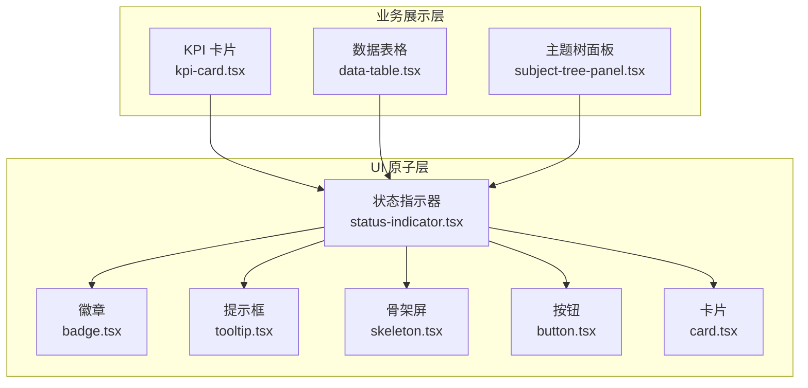
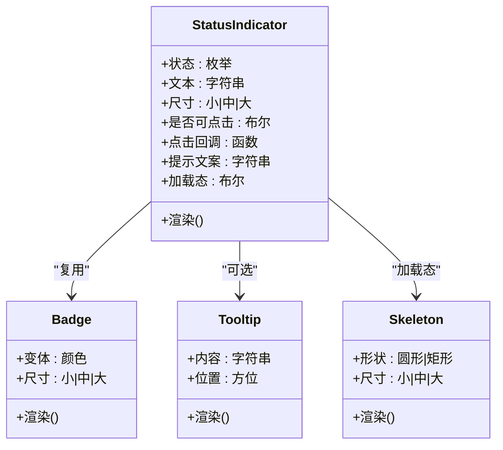
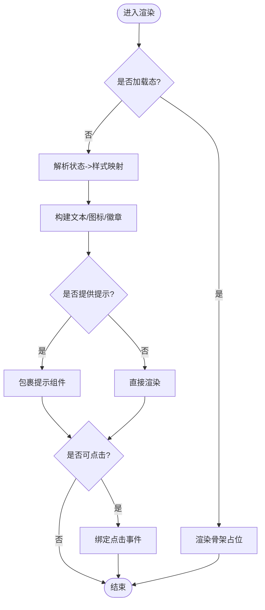
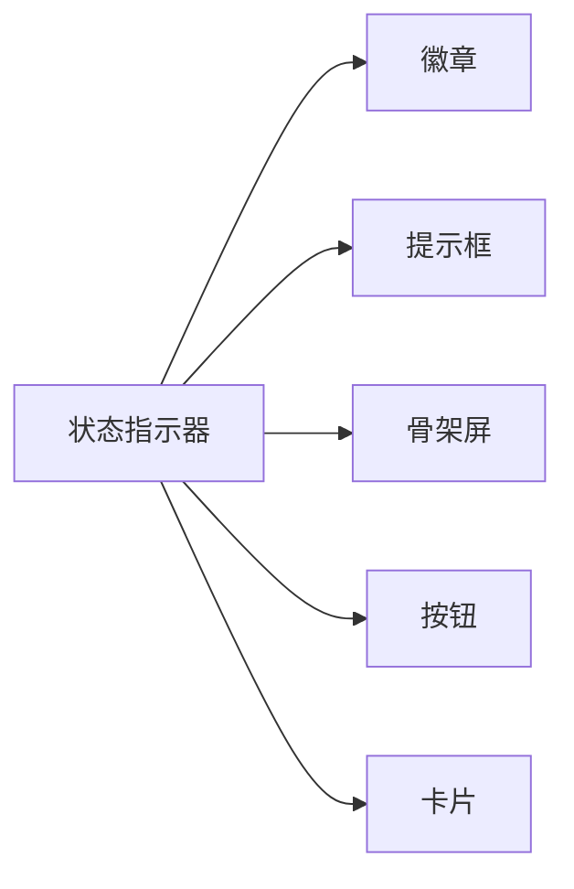

# 状态指示器组件

<cite>
**本文引用的文件**   
- [status-indicator.tsx](file://web/src/components/ui/status-indicator.tsx)
- [badge.tsx](file://web/src/components/ui/badge.tsx)
- [button.tsx](file://web/src/components/ui/button.tsx)
- [card.tsx](file://web/src/components/ui/card.tsx)
- [tooltip.tsx](file://web/src/components/ui/tooltip.tsx)
- [skeleton.tsx](file://web/src/components/ui/skeleton.tsx)
- [kpi-card.tsx](file://web/src/components/charts/kpi-card.tsx)
- [data-table.tsx](file://web/src/components/data-table/data-table.tsx)
- [subject-tree-panel.tsx](file://web/src/components/subject-tree/subject-tree-panel.tsx)
</cite>

## 目录
1. [简介](#简介)
2. [项目结构](#项目结构)
3. [核心组件](#核心组件)
4. [架构总览](#架构总览)
5. [详细组件分析](#详细组件分析)
6. [依赖分析](#依赖分析)
7. [性能考虑](#性能考虑)
8. [故障排查指南](#故障排查指南)
9. [结论](#结论)
10. [附录](#附录)

## 简介
本文件聚焦于“状态指示器”这一通用 UI 能力，围绕其在仓库中的实现与使用进行系统化说明。内容涵盖：
- 组件职责与边界
- 数据模型与状态语义
- 渲染策略与可访问性
- 与其他基础组件的协作关系
- 在业务页面中的典型用法
- 常见问题与优化建议

目标读者包括前端开发者、UI 工程师以及需要集成或扩展该能力的产品与测试人员。

## 项目结构
状态指示器位于 UI 原子组件层，主要文件为 status-indicator.tsx；同时广泛复用 badge、tooltip、skeleton 等基础组件，并在图表、表格、树面板等业务组件中被消费。

图示来源
- [status-indicator.tsx](file://web/src/components/ui/status-indicator.tsx)
- [badge.tsx](file://web/src/components/ui/badge.tsx)
- [tooltip.tsx](file://web/src/components/ui/tooltip.tsx)
- [skeleton.tsx](file://web/src/components/ui/skeleton.tsx)
- [button.tsx](file://web/src/components/ui/button.tsx)
- [card.tsx](file://web/src/components/ui/card.tsx)
- [kpi-card.tsx](file://web/src/components/charts/kpi-card.tsx)
- [data-table.tsx](file://web/src/components/data-table/data-table.tsx)
- [subject-tree-panel.tsx](file://web/src/components/subject-tree/subject-tree-panel.tsx)

章节来源
- [status-indicator.tsx](file://web/src/components/ui/status-indicator.tsx)
- [badge.tsx](file://web/src/components/ui/badge.tsx)
- [tooltip.tsx](file://web/src/components/ui/tooltip.tsx)
- [skeleton.tsx](file://web/src/components/ui/skeleton.tsx)
- [button.tsx](file://web/src/components/ui/button.tsx)
- [card.tsx](file://web/src/components/ui/card.tsx)
- [kpi-card.tsx](file://web/src/components/charts/kpi-card.tsx)
- [data-table.tsx](file://web/src/components/data-table/data-table.tsx)
- [subject-tree-panel.tsx](file://web/src/components/subject-tree/subject-tree-panel.tsx)

## 核心组件
- 组件定位
  - 提供统一的状态可视化表达（如成功、失败、进行中、待处理、未知等）
  - 支持文本标签、颜色语义、尺寸与交互态的可配置化
  - 与 tooltip 联动提供无障碍辅助信息
  - 在加载态下以 skeleton 占位呈现，避免布局抖动

- 关键能力
  - 状态枚举映射到视觉样式（颜色、图标、动画）
  - 可选的点击行为（例如跳转详情、打开对话框）
  - 响应式尺寸适配（小/中/大）
  - 可组合性：作为 Badge 的增强封装，也可独立使用

- 设计原则
  - 单一职责：仅负责状态表达与轻量交互
  - 可测试性：通过 props 暴露稳定契约，便于单元测试
  - 可访问性：遵循 ARIA 规范，提供语义化标签与键盘导航支持

章节来源
- [status-indicator.tsx](file://web/src/components/ui/status-indicator.tsx)
- [badge.tsx](file://web/src/components/ui/badge.tsx)
- [tooltip.tsx](file://web/src/components/ui/tooltip.tsx)
- [skeleton.tsx](file://web/src/components/ui/skeleton.tsx)

## 架构总览
状态指示器处于 UI 原子层，向上被业务组件消费，向下依赖基础 UI 组件完成具体渲染。

图示来源
- [status-indicator.tsx](file://web/src/components/ui/status-indicator.tsx)
- [badge.tsx](file://web/src/components/ui/badge.tsx)
- [tooltip.tsx](file://web/src/components/ui/tooltip.tsx)
- [skeleton.tsx](file://web/src/components/ui/skeleton.tsx)

## 详细组件分析

### 状态指示器（StatusIndicator）
- 职责
  - 将抽象状态转换为一致的视觉表达
  - 提供可配置的交互与提示
  - 在加载态下提供骨架占位，保证布局稳定性

- 输入属性（Props）
  - 状态：用于决定颜色与图标
  - 文本：显示在指示器上的短文本
  - 尺寸：控制整体大小
  - 是否可点击：控制交互开关
  - 点击回调：点击时触发的动作
  - 提示文案：配合 tooltip 提供辅助信息
  - 加载态：切换至骨架屏模式

- 渲染流程

图示来源
- [status-indicator.tsx](file://web/src/components/ui/status-indicator.tsx)
- [tooltip.tsx](file://web/src/components/ui/tooltip.tsx)
- [skeleton.tsx](file://web/src/components/ui/skeleton.tsx)
- [badge.tsx](file://web/src/components/ui/badge.tsx)

- 可访问性与国际化
  - 使用语义化标签与 aria-* 属性
  - 文本与提示文案应支持 i18n 替换
  - 键盘可达性与焦点管理

- 错误处理
  - 对非法状态值进行兜底渲染
  - 对缺失必要属性给出开发期警告
  - 对异步点击回调进行 try/catch 保护

章节来源
- [status-indicator.tsx](file://web/src/components/ui/status-indicator.tsx)
- [tooltip.tsx](file://web/src/components/ui/tooltip.tsx)
- [skeleton.tsx](file://web/src/components/ui/skeleton.tsx)
- [badge.tsx](file://web/src/components/ui/badge.tsx)

### 在业务组件中的使用
- KPI 卡片
  - 在指标项旁展示运行状态，结合 tooltip 解释含义
  - 点击可展开详情面板或跳转到相关报表

- 数据表格
  - 在行内展示记录状态列，支持筛选与排序
  - 点击状态可触发批量操作或查看日志

- 主题树面板
  - 在节点旁显示同步/就绪状态，帮助快速定位异常节点
  - 加载态使用骨架屏减少闪烁

章节来源
- [kpi-card.tsx](file://web/src/components/charts/kpi-card.tsx)
- [data-table.tsx](file://web/src/components/data-table/data-table.tsx)
- [subject-tree-panel.tsx](file://web/src/components/subject-tree/subject-tree-panel.tsx)

## 依赖分析
- 内部依赖
  - 基础 UI：badge、tooltip、skeleton、button、card
  - 样式系统：基于 Tailwind 的类名组合与主题变量
- 外部依赖
  - React 生态：hooks、事件系统与上下文
- 耦合度
  - 低耦合：通过 props 暴露稳定接口，便于替换实现
  - 高内聚：状态到样式的映射逻辑集中在组件内

图示来源
- [status-indicator.tsx](file://web/src/components/ui/status-indicator.tsx)
- [badge.tsx](file://web/src/components/ui/badge.tsx)
- [tooltip.tsx](file://web/src/components/ui/tooltip.tsx)
- [skeleton.tsx](file://web/src/components/ui/skeleton.tsx)
- [button.tsx](file://web/src/components/ui/button.tsx)
- [card.tsx](file://web/src/components/ui/card.tsx)

章节来源
- [status-indicator.tsx](file://web/src/components/ui/status-indicator.tsx)
- [badge.tsx](file://web/src/components/ui/badge.tsx)
- [tooltip.tsx](file://web/src/components/ui/tooltip.tsx)
- [skeleton.tsx](file://web/src/components/ui/skeleton.tsx)
- [button.tsx](file://web/src/components/ui/button.tsx)
- [card.tsx](file://web/src/components/ui/card.tsx)

## 性能考虑
- 渲染优化
  - 使用 memo 或 React.memo 包裹状态指示器，避免父级重渲染导致不必要的更新
  - 将状态映射表提升到模块级常量，减少重复计算
- 交互优化
  - 点击回调使用防抖/节流，避免高频触发
  - 大型列表中使用虚拟滚动，减少 DOM 数量
- 资源优化
  - 图标与图片按需加载与缓存
  - 骨架屏仅在首屏或长列表首屏启用，后续懒加载

[本节为通用指导，不直接分析具体文件]

## 故障排查指南
- 症状：状态颜色不正确
  - 检查传入的状态值是否在映射表中
  - 确认主题变量未被覆盖
- 症状：点击无响应
  - 检查是否设置了可点击标志与回调
  - 确认外层容器未拦截事件
- 症状：提示不显示
  - 检查 tooltip 的可见条件与挂载点
  - 确认无障碍属性是否正确设置
- 症状：加载态布局抖动
  - 为骨架屏设置固定宽高或使用 aspect-ratio
  - 确保占位元素与真实内容尺寸一致

章节来源
- [status-indicator.tsx](file://web/src/components/ui/status-indicator.tsx)
- [tooltip.tsx](file://web/src/components/ui/tooltip.tsx)
- [skeleton.tsx](file://web/src/components/ui/skeleton.tsx)

## 结论
状态指示器作为统一的视觉表达层，有效降低了各业务组件在状态展示上的差异与维护成本。通过稳定的 Props 契约、良好的可访问性与可扩展的设计，它能够在复杂场景中保持一致的用户体验。建议在新增业务场景时优先复用该组件，并遵循既定的状态语义与交互约定。

[本节为总结性内容，不直接分析具体文件]

## 附录
- 最佳实践
  - 明确定义状态枚举与文案，避免自由文本
  - 为所有状态提供 tooltip 说明，提升可理解性
  - 在表格与列表中统一尺寸与对齐方式
- 扩展建议
  - 支持自定义状态映射与主题
  - 增加动画过渡与微交互
  - 提供无障碍读屏优化与键盘导航增强

[本节为补充信息，不直接分析具体文件]