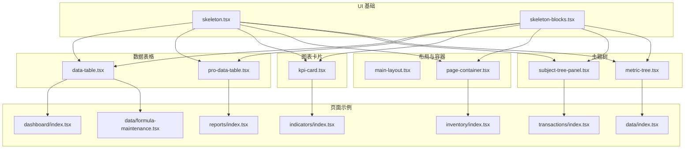
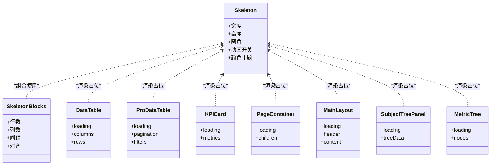
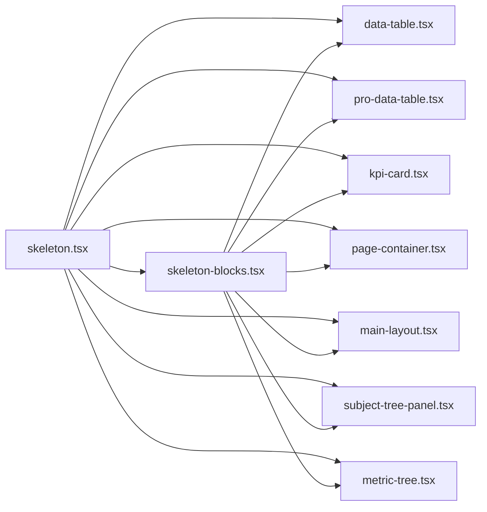

# 骨架屏加载组件

<cite>
**本文引用的文件**   
- [skeleton.tsx](file://web/src/components/ui/skeleton.tsx)
- [skeleton-blocks.tsx](file://web/src/components/ui/skeleton-blocks.tsx)
- [data-table.tsx](file://web/src/components/data-table/data-table.tsx)
- [pro-data-table.tsx](file://web/src/components/data-table/pro-data-table.tsx)
- [kpi-card.tsx](file://web/src/components/charts/kpi-card.tsx)
- [main-layout.tsx](file://web/src/components/layout/main-layout.tsx)
- [page-container.tsx](file://web/src/components/layout/page-container.tsx)
- [subject-tree-panel.tsx](file://web/src/components/subject-tree/subject-tree-panel.tsx)
- [metric-tree.tsx](file://web/src/components/subject-tree/metric-tree.tsx)
- [index.tsx](file://web/src/pages/dashboard/index.tsx)
- [index.tsx](file://web/src/pages/reports/index.tsx)
- [index.tsx](file://web/src/pages/indicators/index.tsx)
- [index.tsx](file://web/src/pages/inventory/index.tsx)
- [index.tsx](file://web/src/pages/transactions/index.tsx)
- [index.tsx](file://web/src/pages/data/index.tsx)
- [index.tsx](file://web/src/pages/data/formula-maintenance.tsx)
</cite>

## 目录
1. [简介](#简介)
2. [项目结构](#项目结构)
3. [核心组件](#核心组件)
4. [架构总览](#架构总览)
5. [详细组件分析](#详细组件分析)
6. [依赖关系分析](#依赖关系分析)
7. [性能考量](#性能考量)
8. [故障排查指南](#故障排查指南)
9. [结论](#结论)
10. [附录](#附录)

## 简介
本文件围绕“骨架屏加载组件”进行系统化文档化，聚焦于 UI 层的骨架屏能力与在数据表格、卡片、页面容器等场景中的集成方式。目标是为开发者提供清晰的使用指引、实现原理说明、性能优化建议以及常见问题排查方法，帮助在数据异步加载时提升用户感知体验。

## 项目结构
骨架屏相关代码位于 web 前端工程内，主要分布在以下位置：
- 基础骨架屏组件：ui 层
- 组合式骨架屏块：用于复杂布局占位
- 业务组件集成点：数据表格、图表卡片、页面容器、主题树面板等
- 页面级使用示例：多个页面在数据加载阶段展示骨架屏

图示来源
- [skeleton.tsx](file://web/src/components/ui/skeleton.tsx)
- [skeleton-blocks.tsx](file://web/src/components/ui/skeleton-blocks.tsx)
- [data-table.tsx](file://web/src/components/data-table/data-table.tsx)
- [pro-data-table.tsx](file://web/src/components/data-table/pro-data-table.tsx)
- [kpi-card.tsx](file://web/src/components/charts/kpi-card.tsx)
- [main-layout.tsx](file://web/src/components/layout/main-layout.tsx)
- [page-container.tsx](file://web/src/components/layout/page-container.tsx)
- [subject-tree-panel.tsx](file://web/src/components/subject-tree/subject-tree-panel.tsx)
- [metric-tree.tsx](file://web/src/components/subject-tree/metric-tree.tsx)
- [index.tsx](file://web/src/pages/dashboard/index.tsx)
- [index.tsx](file://web/src/pages/reports/index.tsx)
- [index.tsx](file://web/src/pages/indicators/index.tsx)
- [index.tsx](file://web/src/pages/inventory/index.tsx)
- [index.tsx](file://web/src/pages/transactions/index.tsx)
- [index.tsx](file://web/src/pages/data/index.tsx)
- [index.tsx](file://web/src/pages/data/formula-maintenance.tsx)

章节来源
- [skeleton.tsx](file://web/src/components/ui/skeleton.tsx)
- [skeleton-blocks.tsx](file://web/src/components/ui/skeleton-blocks.tsx)
- [data-table.tsx](file://web/src/components/data-table/data-table.tsx)
- [pro-data-table.tsx](file://web/src/components/data-table/pro-data-table.tsx)
- [kpi-card.tsx](file://web/src/components/charts/kpi-card.tsx)
- [main-layout.tsx](file://web/src/components/layout/main-layout.tsx)
- [page-container.tsx](file://web/src/components/layout/page-container.tsx)
- [subject-tree-panel.tsx](file://web/src/components/subject-tree/subject-tree-panel.tsx)
- [metric-tree.tsx](file://web/src/components/subject-tree/metric-tree.tsx)
- [index.tsx](file://web/src/pages/dashboard/index.tsx)
- [index.tsx](file://web/src/pages/reports/index.tsx)
- [index.tsx](file://web/src/pages/indicators/index.tsx)
- [index.tsx](file://web/src/pages/inventory/index.tsx)
- [index.tsx](file://web/src/pages/transactions/index.tsx)
- [index.tsx](file://web/src/pages/data/index.tsx)
- [index.tsx](file://web/src/pages/data/formula-maintenance.tsx)

## 核心组件
- 基础骨架屏（Skeleton）
  - 职责：提供最小粒度的骨架占位元素，支持尺寸、形状、动画等配置，作为其他骨架屏的原子能力。
  - 典型用法：在数据未就绪时渲染占位块，数据到达后替换为真实内容。
  - 关键特性：可配置宽高、圆角、是否循环动画；可与 Tailwind 样式配合快速定制外观。
  - 参考路径：[skeleton.tsx](file://web/src/components/ui/skeleton.tsx)

- 组合骨架屏块（Skeleton Blocks）
  - 职责：将多个基础骨架屏按常见布局组合，如列表项、卡片头部、段落行等，减少重复拼装。
  - 典型用法：在表格、卡片、表单等区域直接插入组合骨架屏，快速覆盖大面积占位。
  - 关键特性：内置多行/多列布局，支持数量、间距、对齐等参数。
  - 参考路径：[skeleton-blocks.tsx](file://web/src/components/ui/skeleton-blocks.tsx)

- 数据表格骨架屏集成
  - 职责：在表格数据请求期间显示行列骨架屏，保持表格结构与列宽稳定。
  - 典型用法：当 loading 状态为真时，渲染表格骨架屏；数据返回后切换为真实表格。
  - 关键特性：与分页、排序、筛选等交互解耦，骨架屏仅负责视觉占位。
  - 参考路径：[data-table.tsx](file://web/src/components/data-table/data-table.tsx)、[pro-data-table.tsx](file://web/src/components/data-table/pro-data-table.tsx)

- 图表卡片骨架屏集成
  - 职责：在指标卡片或迷你图表数据未就绪时，以卡片骨架屏替代图表渲染。
  - 典型用法：根据指标加载状态切换骨架屏与真实图表。
  - 关键特性：保持卡片尺寸一致，避免布局抖动。
  - 参考路径：[kpi-card.tsx](file://web/src/components/charts/kpi-card.tsx)

- 页面容器与布局骨架屏
  - 职责：在页面级或布局级展示骨架屏，适用于首屏或大区块加载。
  - 典型用法：在路由进入或全局数据初始化阶段，通过 page-container 或 main-layout 包裹骨架屏。
  - 关键特性：与权限校验、导航、面包屑等布局逻辑协同，不影响功能流程。
  - 参考路径：[page-container.tsx](file://web/src/components/layout/page-container.tsx)、[main-layout.tsx](file://web/src/components/layout/main-layout.tsx)

- 主题树与指标树骨架屏集成
  - 职责：在树形结构数据未就绪时，以层级骨架屏展示节点占位。
  - 典型用法：在 subject-tree-panel 和 metric-tree 中根据数据加载状态切换骨架屏。
  - 关键特性：保持树形缩进与层级关系，避免展开/折叠时的布局跳动。
  - 参考路径：[subject-tree-panel.tsx](file://web/src/components/subject-tree/subject-tree-panel.tsx)、[metric-tree.tsx](file://web/src/components/subject-tree/metric-tree.tsx)

章节来源
- [skeleton.tsx](file://web/src/components/ui/skeleton.tsx)
- [skeleton-blocks.tsx](file://web/src/components/ui/skeleton-blocks.tsx)
- [data-table.tsx](file://web/src/components/data-table/data-table.tsx)
- [pro-data-table.tsx](file://web/src/components/data-table/pro-data-table.tsx)
- [kpi-card.tsx](file://web/src/components/charts/kpi-card.tsx)
- [page-container.tsx](file://web/src/components/layout/page-container.tsx)
- [main-layout.tsx](file://web/src/components/layout/main-layout.tsx)
- [subject-tree-panel.tsx](file://web/src/components/subject-tree/subject-tree-panel.tsx)
- [metric-tree.tsx](file://web/src/components/subject-tree/metric-tree.tsx)

## 架构总览
骨架屏体系采用“原子 + 组合 + 集成”的分层设计：
- 原子层：基础骨架屏提供最小可用单元
- 组合层：组合骨架屏块封装常用布局模式
- 集成层：在各业务组件中按需引入，结合数据加载状态控制显隐

图示来源
- [skeleton.tsx](file://web/src/components/ui/skeleton.tsx)
- [skeleton-blocks.tsx](file://web/src/components/ui/skeleton-blocks.tsx)
- [data-table.tsx](file://web/src/components/data-table/data-table.tsx)
- [pro-data-table.tsx](file://web/src/components/data-table/pro-data-table.tsx)
- [kpi-card.tsx](file://web/src/components/charts/kpi-card.tsx)
- [page-container.tsx](file://web/src/components/layout/page-container.tsx)
- [main-layout.tsx](file://web/src/components/layout/main-layout.tsx)
- [subject-tree-panel.tsx](file://web/src/components/subject-tree/subject-tree-panel.tsx)
- [metric-tree.tsx](file://web/src/components/subject-tree/metric-tree.tsx)

## 详细组件分析

### 基础骨架屏（Skeleton）
- 设计要点
  - 作为原子组件，关注单一职责：渲染一个带样式的占位矩形
  - 通过 props 控制尺寸、圆角、动画与主题色，便于在不同上下文中复用
  - 与 CSS 动画结合，提供平滑的闪烁效果，增强加载感知
- 使用建议
  - 优先在数据未就绪且需要保持布局稳定的区域使用
  - 避免在高频更新的数据区域长时间显示，以免干扰用户操作
- 参考路径
  - [skeleton.tsx](file://web/src/components/ui/skeleton.tsx)

章节来源
- [skeleton.tsx](file://web/src/components/ui/skeleton.tsx)

### 组合骨架屏块（Skeleton Blocks）
- 设计要点
  - 将多个基础骨架屏按行/列排列，形成常见的列表、卡片、段落等布局
  - 暴露行数、列数、间距等参数，适配不同密度与屏幕尺寸
- 使用建议
  - 在表格、列表、仪表盘卡片等区域直接使用，减少样板代码
  - 根据数据量动态调整行数，尽量贴近真实数据的视觉密度
- 参考路径
  - [skeleton-blocks.tsx](file://web/src/components/ui/skeleton-blocks.tsx)

章节来源
- [skeleton-blocks.tsx](file://web/src/components/ui/skeleton-blocks.tsx)

### 数据表格骨架屏集成
- 设计要点
  - 在 loading 状态下渲染表格骨架屏，保持表头与列宽不变
  - 与分页、排序、筛选等交互解耦，骨架屏仅负责视觉占位
- 使用建议
  - 合理设置骨架屏的行数，避免过多导致渲染开销
  - 在大数据集场景下，考虑虚拟滚动与骨架屏的组合策略
- 参考路径
  - [data-table.tsx](file://web/src/components/data-table/data-table.tsx)
  - [pro-data-table.tsx](file://web/src/components/data-table/pro-data-table.tsx)

章节来源
- [data-table.tsx](file://web/src/components/data-table/data-table.tsx)
- [pro-data-table.tsx](file://web/src/components/data-table/pro-data-table.tsx)

### 图表卡片骨架屏集成
- 设计要点
  - 在指标卡片或迷你图表数据未就绪时，以卡片骨架屏替代图表渲染
  - 保持卡片尺寸一致，避免布局抖动
- 使用建议
  - 针对不同类型指标，选择匹配的骨架屏模板（单值、趋势、迷你图）
  - 在数据频繁更新的场景，降低骨架屏刷新频率，避免闪烁
- 参考路径
  - [kpi-card.tsx](file://web/src/components/charts/kpi-card.tsx)

章节来源
- [kpi-card.tsx](file://web/src/components/charts/kpi-card.tsx)

### 页面容器与布局骨架屏
- 设计要点
  - 在页面级或布局级展示骨架屏，适用于首屏或大区块加载
  - 与权限校验、导航、面包屑等布局逻辑协同，不影响功能流程
- 使用建议
  - 在路由进入或全局数据初始化阶段，通过 page-container 或 main-layout 包裹骨架屏
  - 对长页面采用分块骨架屏，逐步替换为真实内容，提升首屏感知
- 参考路径
  - [page-container.tsx](file://web/src/components/layout/page-container.tsx)
  - [main-layout.tsx](file://web/src/components/layout/main-layout.tsx)

章节来源
- [page-container.tsx](file://web/src/components/layout/page-container.tsx)
- [main-layout.tsx](file://web/src/components/layout/main-layout.tsx)

### 主题树与指标树骨架屏集成
- 设计要点
  - 在树形结构数据未就绪时，以层级骨架屏展示节点占位
  - 保持树形缩进与层级关系，避免展开/折叠时的布局跳动
- 使用建议
  - 根据树的深度与分支数量，合理设置骨架屏节点数
  - 在懒加载场景下，仅在可见区域渲染骨架屏，减少不必要的计算
- 参考路径
  - [subject-tree-panel.tsx](file://web/src/components/subject-tree/subject-tree-panel.tsx)
  - [metric-tree.tsx](file://web/src/components/subject-tree/metric-tree.tsx)

章节来源
- [subject-tree-panel.tsx](file://web/src/components/subject-tree/subject-tree-panel.tsx)
- [metric-tree.tsx](file://web/src/components/subject-tree/metric-tree.tsx)

### 页面级使用示例
- 仪表盘页面：在指标与图表区域使用骨架屏，等待数据返回后替换
- 报表页面：在表格与统计区块使用骨架屏，保证首屏稳定
- 指标维护页面：在公式与指标列表中使用骨架屏，提升编辑体验
- 库存与交易页面：在列表与详情区块使用骨架屏，改善加载感知
- 数据管理页面：在元数据与配置区块使用骨架屏，确保一致性

参考路径
- [index.tsx](file://web/src/pages/dashboard/index.tsx)
- [index.tsx](file://web/src/pages/reports/index.tsx)
- [index.tsx](file://web/src/pages/indicators/index.tsx)
- [index.tsx](file://web/src/pages/inventory/index.tsx)
- [index.tsx](file://web/src/pages/transactions/index.tsx)
- [index.tsx](file://web/src/pages/data/index.tsx)
- [index.tsx](file://web/src/pages/data/formula-maintenance.tsx)

章节来源
- [index.tsx](file://web/src/pages/dashboard/index.tsx)
- [index.tsx](file://web/src/pages/reports/index.tsx)
- [index.tsx](file://web/src/pages/indicators/index.tsx)
- [index.tsx](file://web/src/pages/inventory/index.tsx)
- [index.tsx](file://web/src/pages/transactions/index.tsx)
- [index.tsx](file://web/src/pages/data/index.tsx)
- [index.tsx](file://web/src/pages/data/formula-maintenance.tsx)

## 依赖关系分析
骨架屏组件的依赖关系呈现清晰的单向依赖：
- 基础骨架屏不依赖上层业务组件
- 组合骨架屏块依赖基础骨架屏
- 业务组件（表格、卡片、布局、树）依赖基础或组合骨架屏
- 页面级组件依赖业务组件，间接使用骨架屏

图示来源
- [skeleton.tsx](file://web/src/components/ui/skeleton.tsx)
- [skeleton-blocks.tsx](file://web/src/components/ui/skeleton-blocks.tsx)
- [data-table.tsx](file://web/src/components/data-table/data-table.tsx)
- [pro-data-table.tsx](file://web/src/components/data-table/pro-data-table.tsx)
- [kpi-card.tsx](file://web/src/components/charts/kpi-card.tsx)
- [page-container.tsx](file://web/src/components/layout/page-container.tsx)
- [main-layout.tsx](file://web/src/components/layout/main-layout.tsx)
- [subject-tree-panel.tsx](file://web/src/components/subject-tree/subject-tree-panel.tsx)
- [metric-tree.tsx](file://web/src/components/subject-tree/metric-tree.tsx)

章节来源
- [skeleton.tsx](file://web/src/components/ui/skeleton.tsx)
- [skeleton-blocks.tsx](file://web/src/components/ui/skeleton-blocks.tsx)
- [data-table.tsx](file://web/src/components/data-table/data-table.tsx)
- [pro-data-table.tsx](file://web/src/components/data-table/pro-data-table.tsx)
- [kpi-card.tsx](file://web/src/components/charts/kpi-card.tsx)
- [page-container.tsx](file://web/src/components/layout/page-container.tsx)
- [main-layout.tsx](file://web/src/components/layout/main-layout.tsx)
- [subject-tree-panel.tsx](file://web/src/components/subject-tree/subject-tree-panel.tsx)
- [metric-tree.tsx](file://web/src/components/subject-tree/metric-tree.tsx)

## 性能考量
- 渲染成本
  - 骨架屏本身轻量，但在大量节点同时渲染时仍会产生 DOM 压力
  - 建议在大数据集场景下限制骨架屏行数，或使用虚拟滚动
- 动画开销
  - 闪烁动画会带来额外的重绘与回流，建议在低端设备上关闭或降低频率
- 条件渲染
  - 仅在 loading 状态为真时渲染骨架屏，避免无谓的更新
- 局部更新
  - 对于长页面，采用分块骨架屏，逐步替换为真实内容，减少一次性渲染压力
- 缓存策略
  - 对已加载过的数据进行缓存，减少重复请求与骨架屏出现次数

## 故障排查指南
- 骨架屏不消失
  - 检查数据加载完成后的状态切换逻辑是否正确
  - 确认 loading 状态是否在数据返回后被置为 false
- 布局抖动
  - 确保骨架屏与真实内容的尺寸一致，避免替换时发生重排
  - 在表格与树结构中，固定列宽与层级缩进
- 动画卡顿
  - 在低端设备或大数据集场景下，尝试关闭动画或降低刷新频率
- 内存占用过高
  - 避免在不可见区域保留大量骨架屏节点，必要时卸载或隐藏
- 与第三方库冲突
  - 检查样式与动画是否与外部库存在冲突，必要时隔离样式作用域

## 结论
骨架屏加载组件通过“原子 + 组合 + 集成”的分层设计，为数据异步加载提供了稳定、一致的视觉占位方案。在实际项目中，应结合数据流与页面结构选择合适的骨架屏策略，兼顾用户体验与性能表现。通过合理的状态管理、样式设计与渲染优化，可以在复杂业务场景中有效降低加载带来的负面感知。

## 附录
- 使用清单
  - 在数据未就绪的区域统一使用骨架屏
  - 根据数据量与屏幕尺寸调整骨架屏密度
  - 在低端设备上谨慎使用动画
  - 对长页面采用分块骨架屏，逐步替换真实内容
- 最佳实践
  - 保持骨架屏与真实内容的尺寸一致
  - 避免在高频更新区域长时间显示骨架屏
  - 结合缓存策略减少重复请求与骨架屏出现次数