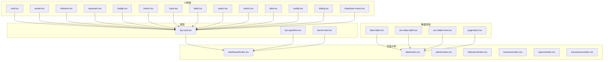
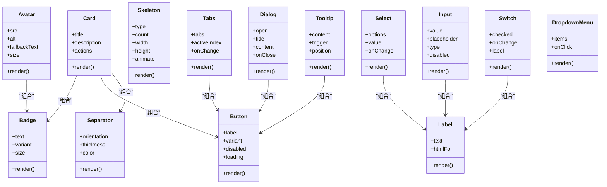
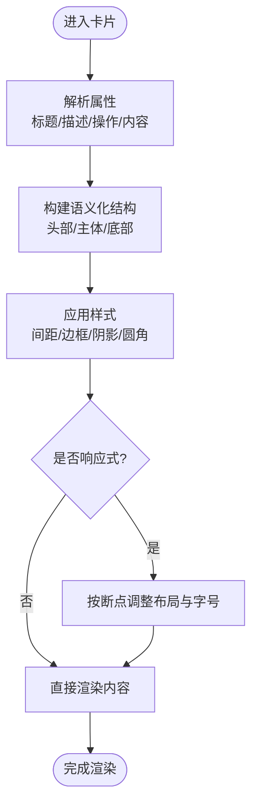
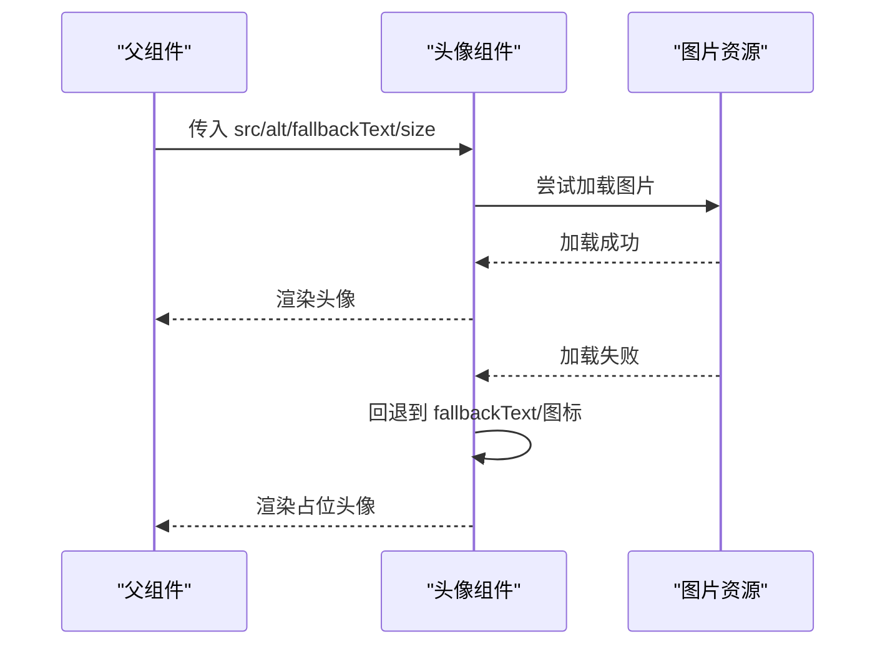
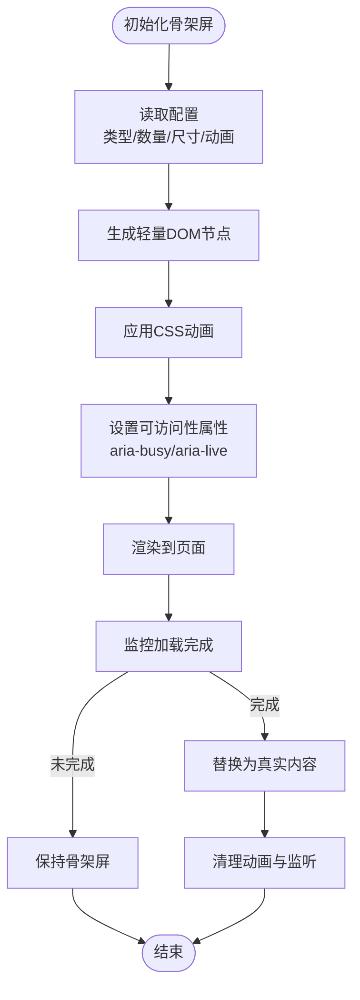
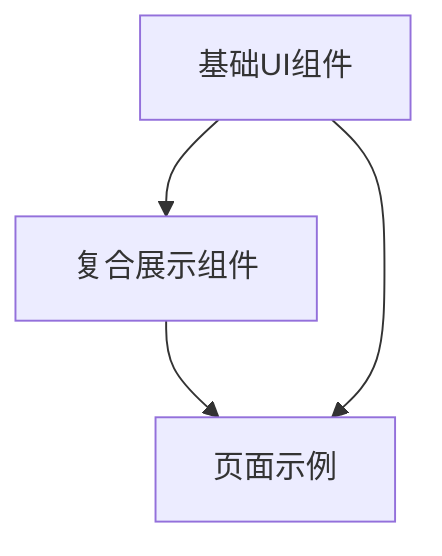

# 展示组件

<cite>
**本文引用的文件**   
- [card.tsx](file://web/src/components/ui/card.tsx)
- [avatar.tsx](file://web/src/components/ui/avatar.tsx)
- [skeleton.tsx](file://web/src/components/ui/skeleton.tsx)
- [separator.tsx](file://web/src/components/ui/separator.tsx)
- [badge.tsx](file://web/src/components/ui/badge.tsx)
- [button.tsx](file://web/src/components/ui/button.tsx)
- [input.tsx](file://web/src/components/ui/input.tsx)
- [label.tsx](file://web/src/components/ui/label.tsx)
- [select.tsx](file://web/src/components/ui/select.tsx)
- [switch.tsx](file://web/src/components/ui/switch.tsx)
- [tabs.tsx](file://web/src/components/ui/tabs.tsx)
- [tooltip.tsx](file://web/src/components/ui/tooltip.tsx)
- [dialog.tsx](file://web/src/components/ui/dialog.tsx)
- [dropdown-menu.tsx](file://web/src/components/ui/dropdown-menu.tsx)
- [kpi-card.tsx](file://web/src/components/charts/kpi-card.tsx)
- [kpi-sparkline.tsx](file://web/src/components/charts/kpi-sparkline.tsx)
- [trend-chart.tsx](file://web/src/components/charts/trend-chart.tsx)
- [data-table.tsx](file://web/src/components/data-table/data-table.tsx)
- [pro-data-table.tsx](file://web/src/components/data-table/pro-data-table.tsx)
- [pro-table-inner.tsx](file://web/src/components/data-table/pro-table-inner.tsx)
- [pagination.tsx](file://web/src/components/data-table/pagination.tsx)
- [index.tsx](file://web/src/pages/dashboard/index.tsx)
- [index.tsx](file://web/src/pages/data/index.tsx)
- [index.tsx](file://web/src/pages/admin/index.tsx)
- [index.tsx](file://web/src/pages/indicators/index.tsx)
- [index.tsx](file://web/src/pages/inventory/index.tsx)
- [index.tsx](file://web/src/pages/reports/index.tsx)
- [index.tsx](file://web/src/pages/transactions/index.tsx)
- [globals.css](file://web/src/styles/globals.css)
- [tailwind.config.js](file://web/tailwind.config.js)
</cite>

## 目录
1. [简介](#简介)
2. [项目结构](#项目结构)
3. [核心组件](#核心组件)
4. [架构总览](#架构总览)
5. [详细组件分析](#详细组件分析)
6. [依赖分析](#依赖分析)
7. [性能考虑](#性能考虑)
8. [故障排查指南](#故障排查指南)
9. [结论](#结论)
10. [附录](#附录)

## 简介
本文件面向pj3项目的“数据展示”类UI组件，聚焦卡片、头像、骨架屏、分隔线等基础展示能力，并扩展到徽章、按钮、输入、标签、选择、开关、选项卡、提示框、对话框、下拉菜单以及图表与表格等高级展示组件。文档从设计理念、实现细节、数据绑定机制、内容渲染方式、样式定制、响应式布局、可访问性、主题扩展、性能优化与内存管理等方面进行全面说明，并提供丰富的使用示例与最佳实践。

## 项目结构
本项目采用按功能域组织的前端工程结构：
- UI基础组件位于 web/src/components/ui，提供卡片、头像、骨架屏、分隔线等通用展示元素。
- 图表与表格位于 web/src/components/charts 与 web/src/components/data-table，用于复杂数据的可视化与结构化呈现。
- 页面级示例位于 web/src/pages，演示如何组合上述组件构建业务场景。
- 全局样式与主题配置位于 web/src/styles 与 web/tailwind.config.js。

图示来源
- [card.tsx:1-200](file://web/src/components/ui/card.tsx#L1-L200)
- [avatar.tsx:1-200](file://web/src/components/ui/avatar.tsx#L1-L200)
- [skeleton.tsx:1-200](file://web/src/components/ui/skeleton.tsx#L1-L200)
- [separator.tsx:1-200](file://web/src/components/ui/separator.tsx#L1-L200)
- [badge.tsx:1-200](file://web/src/components/ui/badge.tsx#L1-L200)
- [button.tsx:1-200](file://web/src/components/ui/button.tsx#L1-L200)
- [input.tsx:1-200](file://web/src/components/ui/input.tsx#L1-L200)
- [label.tsx:1-200](file://web/src/components/ui/label.tsx#L1-L200)
- [select.tsx:1-200](file://web/src/components/ui/select.tsx#L1-L200)
- [switch.tsx:1-200](file://web/src/components/ui/switch.tsx#L1-L200)
- [tabs.tsx:1-200](file://web/src/components/ui/tabs.tsx#L1-L200)
- [tooltip.tsx:1-200](file://web/src/components/ui/tooltip.tsx#L1-L200)
- [dialog.tsx:1-200](file://web/src/components/ui/dialog.tsx#L1-L200)
- [dropdown-menu.tsx:1-200](file://web/src/components/ui/dropdown-menu.tsx#L1-L200)
- [kpi-card.tsx:1-200](file://web/src/components/charts/kpi-card.tsx#L1-L200)
- [kpi-sparkline.tsx:1-200](file://web/src/components/charts/kpi-sparkline.tsx#L1-L200)
- [trend-chart.tsx:1-200](file://web/src/components/charts/trend-chart.tsx#L1-L200)
- [data-table.tsx:1-200](file://web/src/components/data-table/data-table.tsx#L1-L200)
- [pro-data-table.tsx:1-200](file://web/src/components/data-table/pro-data-table.tsx#L1-L200)
- [pro-table-inner.tsx:1-200](file://web/src/components/data-table/pro-table-inner.tsx#L1-L200)
- [pagination.tsx:1-200](file://web/src/components/data-table/pagination.tsx#L1-L200)
- [index.tsx](file://web/src/pages/dashboard/index.tsx)
- [index.tsx](file://web/src/pages/data/index.tsx)
- [index.tsx](file://web/src/pages/admin/index.tsx)
- [index.tsx](file://web/src/pages/indicators/index.tsx)
- [index.tsx](file://web/src/pages/inventory/index.tsx)
- [index.tsx](file://web/src/pages/reports/index.tsx)
- [index.tsx](file://web/src/pages/transactions/index.tsx)

章节来源
- [card.tsx:1-200](file://web/src/components/ui/card.tsx#L1-L200)
- [avatar.tsx:1-200](file://web/src/components/ui/avatar.tsx#L1-L200)
- [skeleton.tsx:1-200](file://web/src/components/ui/skeleton.tsx#L1-L200)
- [separator.tsx:1-200](file://web/src/components/ui/separator.tsx#L1-L200)
- [badge.tsx:1-200](file://web/src/components/ui/badge.tsx#L1-L200)
- [button.tsx:1-200](file://web/src/components/ui/button.tsx#L1-L200)
- [input.tsx:1-200](file://web/src/components/ui/input.tsx#L1-L200)
- [label.tsx:1-200](file://web/src/components/ui/label.tsx#L1-L200)
- [select.tsx:1-200](file://web/src/components/ui/select.tsx#L1-L200)
- [switch.tsx:1-200](file://web/src/components/ui/switch.tsx#L1-L200)
- [tabs.tsx:1-200](file://web/src/components/ui/tabs.tsx#L1-L200)
- [tooltip.tsx:1-200](file://web/src/components/ui/tooltip.tsx#L1-L200)
- [dialog.tsx:1-200](file://web/src/components/ui/dialog.tsx#L1-L200)
- [dropdown-menu.tsx:1-200](file://web/src/components/ui/dropdown-menu.tsx#L1-L200)
- [kpi-card.tsx:1-200](file://web/src/components/charts/kpi-card.tsx#L1-L200)
- [kpi-sparkline.tsx:1-200](file://web/src/components/charts/kpi-sparkline.tsx#L1-L200)
- [trend-chart.tsx:1-200](file://web/src/components/charts/trend-chart.tsx#L1-L200)
- [data-table.tsx:1-200](file://web/src/components/data-table/data-table.tsx#L1-L200)
- [pro-data-table.tsx:1-200](file://web/src/components/data-table/pro-data-table.tsx#L1-L200)
- [pro-table-inner.tsx:1-200](file://web/src/components/data-table/pro-table-inner.tsx#L1-L200)
- [pagination.tsx:1-200](file://web/src/components/data-table/pagination.tsx#L1-L200)
- [index.tsx](file://web/src/pages/dashboard/index.tsx)
- [index.tsx](file://web/src/pages/data/index.tsx)
- [index.tsx](file://web/src/pages/admin/index.tsx)
- [index.tsx](file://web/src/pages/indicators/index.tsx)
- [index.tsx](file://web/src/pages/inventory/index.tsx)
- [index.tsx](file://web/src/pages/reports/index.tsx)
- [index.tsx](file://web/src/pages/transactions/index.tsx)

## 核心组件
本节聚焦数据展示的核心基础组件：卡片、头像、骨架屏、分隔线，并补充徽章、按钮、输入、标签、选择、开关、选项卡、提示框、对话框、下拉菜单等常用展示与交互组件的设计要点。

- 卡片（Card）
  - 职责：承载标题、描述、操作区与内容的容器，支持阴影、圆角、内边距等视觉层级。
  - 数据绑定：通过属性传入标题、副标题、内容节点、操作按钮等；支持插槽或children扩展。
  - 渲染策略：语义化div结构，结合Tailwind原子类控制间距、边框、背景与阴影。
  - 响应式：基于断点调整内边距、字号与布局方向（如横竖切换）。
  - 可访问性：为重要区域设置aria-label或role，确保键盘导航与屏幕阅读器友好。
  - 主题定制：通过CSS变量或Tailwind配置覆盖颜色、圆角、阴影等。

- 头像（Avatar）
  - 职责：展示用户或实体的图像标识，支持占位符与降级文本。
  - 数据绑定：src、alt、fallbackText、尺寸、形状等属性。
  - 渲染策略：img+onError回退到文本或图标；圆形裁剪与尺寸缩放。
  - 响应式：根据屏幕尺寸动态调整尺寸与字体大小。
  - 可访问性：alt文本必须准确描述图像含义；必要时添加aria-describedby关联说明。
  - 主题定制：可通过CSS变量定义默认色板与占位符样式。

- 骨架屏（Skeleton）
  - 职责：在数据加载期间提供占位动画，提升感知性能。
  - 数据绑定：类型（行、块、圆形）、数量、宽度/高度、动画时长等。
  - 渲染策略：轻量DOM节点+CSS动画；避免重排重绘的过度开销。
  - 性能考量：按需生成、延迟显示、合并相邻骨架节点、减少动画帧率。
  - 可访问性：使用aria-busy和aria-live告知加载状态；隐藏装饰性骨架节点给辅助技术。
  - 主题定制：颜色、圆角、动画曲线均可通过配置覆盖。

- 分隔线（Separator）
  - 职责：视觉分割区块，增强信息层次。
  - 数据绑定：方向（水平/垂直）、厚度、颜色、间距。
  - 渲染策略：最小化DOM，优先使用伪元素或单节点实现。
  - 可访问性：作为装饰元素时设置aria-hidden="true"。
  - 主题定制：通过CSS变量或Tailwind类名快速替换。

- 徽章（Badge）
  - 职责：状态、计数、标签等轻量标记。
  - 数据绑定：文本、变体（成功/警告/错误/中性）、尺寸。
  - 渲染策略：span或button（可点击），配合颜色与圆角。
  - 可访问性：当表达状态时，使用aria-live或role="status"。

- 按钮（Button）
  - 职责：触发操作的入口，支持多种形态与禁用态。
  - 数据绑定：文本、图标、变体、尺寸、禁用、加载态。
  - 渲染策略：button原生元素，保证键盘与焦点行为。
  - 可访问性：aria-disabled、aria-label、focus-visible样式。

- 输入（Input）
  - 职责：采集用户文本或数值。
  - 数据绑定：value、placeholder、类型、禁用、只读、校验状态。
  - 渲染策略：input原生元素，包裹label与提示信息。
  - 可访问性：for/id关联label，aria-invalid与aria-describedby。

- 标签（Label）
  - 职责：表单控件的可见说明。
  - 数据绑定：文本、关联控件id。
  - 渲染策略：label原生元素，支持点击聚焦目标控件。

- 选择（Select）
  - 职责：从选项中单选或多选。
  - 数据绑定：options、value、onChange、多选模式。
  - 渲染策略：select原生或自定义下拉，保持键盘导航一致。
  - 可访问性：aria-expanded、aria-controls、role="listbox"等。

- 开关（Switch）
  - 职责：布尔值切换控件。
  - 数据绑定：checked、onChange、禁用、标签。
  - 渲染策略：checkbox封装，提供视觉反馈。
  - 可访问性：aria-checked、aria-labelledby。

- 选项卡（Tabs）
  - 职责：分组内容切换。
  - 数据绑定：tabs数组、activeIndex、onChange。
  - 渲染策略：tablist/tab/tabpanel结构，ARIA角色完整。
  - 可访问性：键盘左右切换、焦点管理。

- 提示框（Tooltip）
  - 职责：悬停或聚焦时显示简短说明。
  - 数据绑定：文本、触发方式、位置。
  - 渲染策略：绝对定位浮层，延迟显示与防抖。
  - 可访问性：aria-describedby关联。

- 对话框（Dialog）
  - 职责：模态窗口承载重要交互。
  - 数据绑定：打开/关闭、标题、内容、确认/取消。
  - 渲染策略：焦点陷阱、ESC关闭、遮罩点击关闭。
  - 可访问性：role="dialog"、aria-modal、aria-labelledby。

- 下拉菜单（Dropdown Menu）
  - 职责：提供一组相关操作。
  - 数据绑定：items、onClick、禁用项、分隔符。
  - 渲染策略：列表项集合，键盘上下导航。
  - 可访问性：role="menu"、aria-haspopup、aria-expanded。

章节来源
- [card.tsx:1-200](file://web/src/components/ui/card.tsx#L1-L200)
- [avatar.tsx:1-200](file://web/src/components/ui/avatar.tsx#L1-L200)
- [skeleton.tsx:1-200](file://web/src/components/ui/skeleton.tsx#L1-L200)
- [separator.tsx:1-200](file://web/src/components/ui/separator.tsx#L1-L200)
- [badge.tsx:1-200](file://web/src/components/ui/badge.tsx#L1-L200)
- [button.tsx:1-200](file://web/src/components/ui/button.tsx#L1-L200)
- [input.tsx:1-200](file://web/src/components/ui/input.tsx#L1-L200)
- [label.tsx:1-200](file://web/src/components/ui/label.tsx#L1-L200)
- [select.tsx:1-200](file://web/src/components/ui/select.tsx#L1-L200)
- [switch.tsx:1-200](file://web/src/components/ui/switch.tsx#L1-L200)
- [tabs.tsx:1-200](file://web/src/components/ui/tabs.tsx#L1-L200)
- [tooltip.tsx:1-200](file://web/src/components/ui/tooltip.tsx#L1-L200)
- [dialog.tsx:1-200](file://web/src/components/ui/dialog.tsx#L1-L200)
- [dropdown-menu.tsx:1-200](file://web/src/components/ui/dropdown-menu.tsx#L1-L200)

## 架构总览
展示组件体系以“基础UI + 复合图表/表格 + 页面编排”分层组织：
- 基础UI层：提供卡片、头像、骨架屏、分隔线等原子能力，强调可复用与可定制。
- 复合展示层：KPI卡片、趋势图、迷你折线图等将基础UI组合为业务友好的展示单元。
- 数据表格层：数据表、专业数据表、分页器构成结构化数据展示方案。
- 页面编排层：各页面示例组合上述组件，形成完整的业务视图。

图示来源
- [card.tsx:1-200](file://web/src/components/ui/card.tsx#L1-L200)
- [avatar.tsx:1-200](file://web/src/components/ui/avatar.tsx#L1-L200)
- [skeleton.tsx:1-200](file://web/src/components/ui/skeleton.tsx#L1-L200)
- [separator.tsx:1-200](file://web/src/components/ui/separator.tsx#L1-L200)
- [badge.tsx:1-200](file://web/src/components/ui/badge.tsx#L1-L200)
- [button.tsx:1-200](file://web/src/components/ui/button.tsx#L1-L200)
- [input.tsx:1-200](file://web/src/components/ui/input.tsx#L1-L200)
- [label.tsx:1-200](file://web/src/components/ui/label.tsx#L1-L200)
- [select.tsx:1-200](file://web/src/components/ui/select.tsx#L1-L200)
- [switch.tsx:1-200](file://web/src/components/ui/switch.tsx#L1-L200)
- [tabs.tsx:1-200](file://web/src/components/ui/tabs.tsx#L1-L200)
- [tooltip.tsx:1-200](file://web/src/components/ui/tooltip.tsx#L1-L200)
- [dialog.tsx:1-200](file://web/src/components/ui/dialog.tsx#L1-L200)
- [dropdown-menu.tsx:1-200](file://web/src/components/ui/dropdown-menu.tsx#L1-L200)

## 详细组件分析

### 卡片（Card）
- 设计理念：作为内容容器，强调清晰的视觉层级与良好的可读性，支持标题、描述、操作区与内容区的灵活组合。
- 数据绑定机制：通过属性注入标题、副标题、内容节点与操作按钮；支持children插槽进行自由扩展。
- 内容渲染方式：语义化div结构，内部按区域划分（头部、主体、底部），利用Tailwind原子类控制间距、边框、背景与阴影。
- 样式定制选项：通过CSS变量或Tailwind配置覆盖颜色、圆角、阴影、内边距；支持暗色模式适配。
- 响应式设计：在小屏下自动缩减内边距与字号，在大屏下增加留白与分区；支持横向/纵向布局切换。
- 可访问性：为关键区域设置aria-label或role；确保焦点顺序合理，键盘可操作。
- 性能与内存：避免不必要的重渲染，使用React.memo或类似手段缓存静态子树；懒加载长内容。

图示来源
- [card.tsx:1-200](file://web/src/components/ui/card.tsx#L1-L200)

章节来源
- [card.tsx:1-200](file://web/src/components/ui/card.tsx#L1-L200)

### 头像（Avatar）
- 设计理念：提供统一的图像标识展示，具备占位符与降级文本能力，确保弱网或图片不可用时仍可识别。
- 数据绑定机制：src、alt、fallbackText、尺寸、形状等属性；支持事件回调（点击、加载失败）。
- 内容渲染方式：优先渲染img，失败时回退到文本或图标；圆形裁剪与尺寸缩放。
- 样式定制选项：通过CSS变量定义默认色板与占位符样式；支持不同尺寸与形状。
- 响应式设计：根据屏幕尺寸动态调整尺寸与字体大小，避免溢出与模糊。
- 可访问性：alt文本必须准确描述图像含义；必要时添加aria-describedby关联说明。
- 性能与内存：预加载常用头像；对大图进行压缩与懒加载；避免重复请求。

图示来源
- [avatar.tsx:1-200](file://web/src/components/ui/avatar.tsx#L1-L200)

章节来源
- [avatar.tsx:1-200](file://web/src/components/ui/avatar.tsx#L1-L200)

### 骨架屏（Skeleton）
- 设计理念：在数据未就绪时提供占位动画，降低等待焦虑，提升感知性能。
- 数据绑定机制：类型（行、块、圆形）、数量、宽度/高度、动画时长、是否循环等。
- 内容渲染方式：轻量DOM节点+CSS动画；避免复杂结构与重计算。
- 样式定制选项：颜色、圆角、动画曲线、闪烁效果均可配置。
- 响应式设计：根据容器宽度自适应骨架条长度与数量。
- 可访问性：使用aria-busy与aria-live告知加载状态；隐藏装饰性骨架节点给辅助技术。
- 性能与内存：按需生成骨架节点；合并相邻骨架节点以减少DOM；限制动画帧率；在组件卸载时清理定时器与事件监听。

图示来源
- [skeleton.tsx:1-200](file://web/src/components/ui/skeleton.tsx#L1-L200)

章节来源
- [skeleton.tsx:1-200](file://web/src/components/ui/skeleton.tsx#L1-L200)

### 分隔线（Separator）
- 设计理念：以最小代价提供视觉分割，增强信息层次与阅读节奏。
- 数据绑定机制：方向（水平/垂直）、厚度、颜色、间距。
- 内容渲染方式：最小化DOM，优先使用伪元素或单节点实现。
- 样式定制选项：通过CSS变量或Tailwind类名快速替换。
- 可访问性：作为装饰元素时设置aria-hidden="true"。
- 性能与内存：几乎无额外开销，适合大量使用。

章节来源
- [separator.tsx:1-200](file://web/src/components/ui/separator.tsx#L1-L200)

### 徽章（Badge）
- 设计理念：轻量标记状态、计数或标签，强调高对比度与易识别。
- 数据绑定机制：文本、变体（成功/警告/错误/中性）、尺寸。
- 内容渲染方式：span或button（可点击），配合颜色与圆角。
- 可访问性：当表达状态时，使用aria-live或role="status"。
- 样式定制选项：通过CSS变量或Tailwind配置覆盖颜色与尺寸。

章节来源
- [badge.tsx:1-200](file://web/src/components/ui/badge.tsx#L1-L200)

### 按钮（Button）
- 设计理念：统一的操作入口，支持多种形态与禁用态，确保一致的交互体验。
- 数据绑定机制：文本、图标、变体、尺寸、禁用、加载态。
- 内容渲染方式：button原生元素，保证键盘与焦点行为。
- 可访问性：aria-disabled、aria-label、focus-visible样式。
- 样式定制选项：通过CSS变量或Tailwind配置覆盖颜色、圆角、阴影。

章节来源
- [button.tsx:1-200](file://web/src/components/ui/button.tsx#L1-L200)

### 输入（Input）
- 设计理念：采集用户文本或数值，提供清晰的提示与校验反馈。
- 数据绑定机制：value、placeholder、类型、禁用、只读、校验状态。
- 内容渲染方式：input原生元素，包裹label与提示信息。
- 可访问性：for/id关联label，aria-invalid与aria-describedby。
- 样式定制选项：通过CSS变量或Tailwind配置覆盖边框、颜色、圆角。

章节来源
- [input.tsx:1-200](file://web/src/components/ui/input.tsx#L1-L200)

### 标签（Label）
- 设计理念：表单控件的可见说明，提升可用性。
- 数据绑定机制：文本、关联控件id。
- 内容渲染方式：label原生元素，支持点击聚焦目标控件。
- 可访问性：确保关联正确，便于屏幕阅读器朗读。

章节来源
- [label.tsx:1-200](file://web/src/components/ui/label.tsx#L1-L200)

### 选择（Select）
- 设计理念：从选项中单选或多选，保持键盘导航一致。
- 数据绑定机制：options、value、onChange、多选模式。
- 内容渲染方式：select原生或自定义下拉，保持ARIA角色完整。
- 可访问性：aria-expanded、aria-controls、role="listbox"等。
- 样式定制选项：通过CSS变量或Tailwind配置覆盖外观。

章节来源
- [select.tsx:1-200](file://web/src/components/ui/select.tsx#L1-L200)

### 开关（Switch）
- 设计理念：布尔值切换控件，提供直观的视觉反馈。
- 数据绑定机制：checked、onChange、禁用、标签。
- 内容渲染方式：checkbox封装，提供视觉反馈。
- 可访问性：aria-checked、aria-labelledby。
- 样式定制选项：通过CSS变量或Tailwind配置覆盖轨道与滑块样式。

章节来源
- [switch.tsx:1-200](file://web/src/components/ui/switch.tsx#L1-L200)

### 选项卡（Tabs）
- 设计理念：分组内容切换，提升信息密度与导航效率。
- 数据绑定机制：tabs数组、activeIndex、onChange。
- 内容渲染方式：tablist/tab/tabpanel结构，ARIA角色完整。
- 可访问性：键盘左右切换、焦点管理。
- 样式定制选项：通过CSS变量或Tailwind配置覆盖激活态与分隔线。

章节来源
- [tabs.tsx:1-200](file://web/src/components/ui/tabs.tsx#L1-L200)

### 提示框（Tooltip）
- 设计理念：悬停或聚焦时显示简短说明，不干扰主流程。
- 数据绑定机制：文本、触发方式、位置。
- 内容渲染方式：绝对定位浮层，延迟显示与防抖。
- 可访问性：aria-describedby关联。
- 样式定制选项：通过CSS变量或Tailwind配置覆盖背景、圆角、阴影。

章节来源
- [tooltip.tsx:1-200](file://web/src/components/ui/tooltip.tsx#L1-L200)

### 对话框（Dialog）
- 设计理念：模态窗口承载重要交互，阻断后台操作。
- 数据绑定机制：打开/关闭、标题、内容、确认/取消。
- 内容渲染方式：焦点陷阱、ESC关闭、遮罩点击关闭。
- 可访问性：role="dialog"、aria-modal、aria-labelledby。
- 样式定制选项：通过CSS变量或Tailwind配置覆盖遮罩、圆角、阴影。

章节来源
- [dialog.tsx:1-200](file://web/src/components/ui/dialog.tsx#L1-L200)

### 下拉菜单（Dropdown Menu）
- 设计理念：提供一组相关操作，保持键盘导航一致。
- 数据绑定机制：items、onClick、禁用项、分隔符。
- 内容渲染方式：列表项集合，键盘上下导航。
- 可访问性：role="menu"、aria-haspopup、aria-expanded。
- 样式定制选项：通过CSS变量或Tailwind配置覆盖背景、边框、阴影。

章节来源
- [dropdown-menu.tsx:1-200](file://web/src/components/ui/dropdown-menu.tsx#L1-L200)

### 图表与表格（复合展示）
- KPI卡片（KPI Card）
  - 职责：聚合关键指标，包含数值、趋势、时间范围与迷你图。
  - 数据绑定：指标名称、当前值、变化百分比、时间范围、数据序列。
  - 渲染策略：组合卡片、头像、徽章、迷你折线图与分隔线。
  - 可访问性：为数值与趋势提供aria-label与aria-live更新。
  - 性能：使用虚拟滚动与增量更新，避免全量重绘。

- 迷你折线（KPI Sparkline）
  - 职责：展示短期趋势，简洁直观。
  - 数据绑定：数据序列、颜色、宽度、高度、平滑度。
  - 渲染策略：轻量SVG或Canvas绘制，按需更新路径。
  - 性能：路径计算缓存与节流更新。

- 趋势图（Trend Chart）
  - 职责：展示长期趋势与对比，支持多系列与交互。
  - 数据绑定：数据集、坐标轴、图例、交互事件。
  - 渲染策略：高性能绘图库集成，按需渲染与懒加载。
  - 可访问性：提供数据摘要与键盘导航。

- 数据表（Data Table）
  - 职责：结构化数据展示，支持排序、筛选、分页。
  - 数据绑定：列定义、数据源、分页参数、排序与筛选状态。
  - 渲染策略：虚拟滚动、惰性加载、批量更新。
  - 可访问性：表格语义化、行列标题关联、键盘导航。

- 专业数据表（Pro Data Table）
  - 职责：增强版数据表，支持复杂列、行操作、导出。
  - 数据绑定：列配置、行操作、导出选项、搜索与过滤。
  - 渲染策略：组件组合与高阶封装，保持性能与可扩展性。
  - 可访问性：ARIA角色与键盘导航完善。

- 分页器（Pagination）
  - 职责：控制数据页码与每页数量。
  - 数据绑定：总记录数、当前页、每页数量、跳转。
  - 渲染策略：轻量DOM，事件委托减少监听器。
  - 可访问性：aria-current、aria-label明确页码状态。

章节来源
- [kpi-card.tsx:1-200](file://web/src/components/charts/kpi-card.tsx#L1-L200)
- [kpi-sparkline.tsx:1-200](file://web/src/components/charts/kpi-sparkline.tsx#L1-L200)
- [trend-chart.tsx:1-200](file://web/src/components/charts/trend-chart.tsx#L1-L200)
- [data-table.tsx:1-200](file://web/src/components/data-table/data-table.tsx#L1-L200)
- [pro-data-table.tsx:1-200](file://web/src/components/data-table/pro-data-table.tsx#L1-L200)
- [pro-table-inner.tsx:1-200](file://web/src/components/data-table/pro-table-inner.tsx#L1-L200)
- [pagination.tsx:1-200](file://web/src/components/data-table/pagination.tsx#L1-L200)

## 依赖分析
展示组件依赖关系清晰，基础UI被复合展示与页面编排广泛复用：
- 基础UI层：卡片、头像、骨架屏、分隔线、徽章、按钮、输入、标签、选择、开关、选项卡、提示框、对话框、下拉菜单。
- 复合展示层：KPI卡片、迷你折线、趋势图、数据表、专业数据表、分页器。
- 页面编排层：仪表盘、数据、管理员、指标、库存、报告、交易等页面。

图示来源
- [card.tsx:1-200](file://web/src/components/ui/card.tsx#L1-L200)
- [avatar.tsx:1-200](file://web/src/components/ui/avatar.tsx#L1-L200)
- [skeleton.tsx:1-200](file://web/src/components/ui/skeleton.tsx#L1-L200)
- [separator.tsx:1-200](file://web/src/components/ui/separator.tsx#L1-L200)
- [badge.tsx:1-200](file://web/src/components/ui/badge.tsx#L1-L200)
- [button.tsx:1-200](file://web/src/components/ui/button.tsx#L1-L200)
- [input.tsx:1-200](file://web/src/components/ui/input.tsx#L1-L200)
- [label.tsx:1-200](file://web/src/components/ui/label.tsx#L1-L200)
- [select.tsx:1-200](file://web/src/components/ui/select.tsx#L1-L200)
- [switch.tsx:1-200](file://web/src/components/ui/switch.tsx#L1-L200)
- [tabs.tsx:1-200](file://web/src/components/ui/tabs.tsx#L1-L200)
- [tooltip.tsx:1-200](file://web/src/components/ui/tooltip.tsx#L1-L200)
- [dialog.tsx:1-200](file://web/src/components/ui/dialog.tsx#L1-L200)
- [dropdown-menu.tsx:1-200](file://web/src/components/ui/dropdown-menu.tsx#L1-L200)
- [kpi-card.tsx:1-200](file://web/src/components/charts/kpi-card.tsx#L1-L200)
- [kpi-sparkline.tsx:1-200](file://web/src/components/charts/kpi-sparkline.tsx#L1-L200)
- [trend-chart.tsx:1-200](file://web/src/components/charts/trend-chart.tsx#L1-L200)
- [data-table.tsx:1-200](file://web/src/components/data-table/data-table.tsx#L1-L200)
- [pro-data-table.tsx:1-200](file://web/src/components/data-table/pro-data-table.tsx#L1-L200)
- [pro-table-inner.tsx:1-200](file://web/src/components/data-table/pro-table-inner.tsx#L1-L200)
- [pagination.tsx:1-200](file://web/src/components/data-table/pagination.tsx#L1-L200)
- [index.tsx](file://web/src/pages/dashboard/index.tsx)
- [index.tsx](file://web/src/pages/data/index.tsx)
- [index.tsx](file://web/src/pages/admin/index.tsx)
- [index.tsx](file://web/src/pages/indicators/index.tsx)
- [index.tsx](file://web/src/pages/inventory/index.tsx)
- [index.tsx](file://web/src/pages/reports/index.tsx)
- [index.tsx](file://web/src/pages/transactions/index.tsx)

章节来源
- [card.tsx:1-200](file://web/src/components/ui/card.tsx#L1-L200)
- [avatar.tsx:1-200](file://web/src/components/ui/avatar.tsx#L1-L200)
- [skeleton.tsx:1-200](file://web/src/components/ui/skeleton.tsx#L1-L200)
- [separator.tsx:1-200](file://web/src/components/ui/separator.tsx#L1-L200)
- [badge.tsx:1-200](file://web/src/components/ui/badge.tsx#L1-L200)
- [button.tsx:1-200](file://web/src/components/ui/button.tsx#L1-L200)
- [input.tsx:1-200](file://web/src/components/ui/input.tsx#L1-L200)
- [label.tsx:1-200](file://web/src/components/ui/label.tsx#L1-L200)
- [select.tsx:1-200](file://web/src/components/ui/select.tsx#L1-L200)
- [switch.tsx:1-200](file://web/src/components/ui/switch.tsx#L1-L200)
- [tabs.tsx:1-200](file://web/src/components/ui/tabs.tsx#L1-L200)
- [tooltip.tsx:1-200](file://web/src/components/ui/tooltip.tsx#L1-L200)
- [dialog.tsx:1-200](file://web/src/components/ui/dialog.tsx#L1-L200)
- [dropdown-menu.tsx:1-200](file://web/src/components/ui/dropdown-menu.tsx#L1-L200)
- [kpi-card.tsx:1-200](file://web/src/components/charts/kpi-card.tsx#L1-L200)
- [kpi-sparkline.tsx:1-200](file://web/src/components/charts/kpi-sparkline.tsx#L1-L200)
- [trend-chart.tsx:1-200](file://web/src/components/charts/trend-chart.tsx#L1-L200)
- [data-table.tsx:1-200](file://web/src/components/data-table/data-table.tsx#L1-L200)
- [pro-data-table.tsx:1-200](file://web/src/components/data-table/pro-data-table.tsx#L1-L200)
- [pro-table-inner.tsx:1-200](file://web/src/components/data-table/pro-table-inner.tsx#L1-L200)
- [pagination.tsx:1-200](file://web/src/components/data-table/pagination.tsx#L1-L200)
- [index.tsx](file://web/src/pages/dashboard/index.tsx)
- [index.tsx](file://web/src/pages/data/index.tsx)
- [index.tsx](file://web/src/pages/admin/index.tsx)
- [index.tsx](file://web/src/pages/indicators/index.tsx)
- [index.tsx](file://web/src/pages/inventory/index.tsx)
- [index.tsx](file://web/src/pages/reports/index.tsx)
- [index.tsx](file://web/src/pages/transactions/index.tsx)

## 性能考虑
- 骨架屏优化
  - 按需生成：仅在需要时创建骨架节点，避免一次性生成过多DOM。
  - 合并相邻节点：将连续的骨架条合并为更少的节点，减少重排重绘。
  - 限制动画帧率：降低动画频率，减少GPU压力。
  - 及时清理：组件卸载时移除定时器与事件监听，防止内存泄漏。
- 列表与表格优化
  - 虚拟滚动：仅渲染可视区域内的行，降低DOM数量。
  - 惰性加载：分页或滚动到底部时再加载下一页数据。
  - 增量更新：仅更新变化的单元格或行，避免整表重渲染。
- 图表优化
  - 路径缓存：对折线路径进行缓存，避免重复计算。
  - 节流更新：高频数据更新时使用节流或采样策略。
  - Canvas/SVG选择：大数据集优先Canvas，小数据集优先SVG以提升交互性。
- 内存管理
  - 避免闭包引用大对象：在事件回调中释放不必要引用。
  - 使用WeakMap/WeakRef：缓存大型对象但不阻止垃圾回收。
  - 组件拆分：将大组件拆分为小组件，提高局部更新效率。

[本节为通用性能指导，无需特定文件来源]

## 故障排查指南
- 骨架屏不消失
  - 检查数据加载完成信号是否正确触发替换逻辑。
  - 确认组件卸载时是否清理了定时器与事件监听。
- 头像无法显示
  - 验证src路径与跨域策略；检查onError回退逻辑。
  - 确认alt文本与降级文本是否合理。
- 表格卡顿
  - 启用虚拟滚动与惰性加载；检查是否有整表重渲染。
  - 优化列渲染函数，避免在每次渲染中创建新对象。
- 图表渲染异常
  - 检查数据格式与边界条件；确认路径计算缓存是否失效。
  - 在高并发更新场景下引入节流或采样。
- 可访问性问题
  - 核对ARIA角色与属性是否正确设置。
  - 使用屏幕阅读器测试键盘导航与焦点顺序。

章节来源
- [skeleton.tsx:1-200](file://web/src/components/ui/skeleton.tsx#L1-L200)
- [avatar.tsx:1-200](file://web/src/components/ui/avatar.tsx#L1-L200)
- [data-table.tsx:1-200](file://web/src/components/data-table/data-table.tsx#L1-L200)
- [kpi-sparkline.tsx:1-200](file://web/src/components/charts/kpi-sparkline.tsx#L1-L200)
- [trend-chart.tsx:1-200](file://web/src/components/charts/trend-chart.tsx#L1-L200)

## 结论
pj3项目的展示组件体系以基础UI为核心，通过组合与扩展形成丰富的复合展示能力。卡片、头像、骨架屏、分隔线等组件在设计上强调语义化、可访问性与响应式适配；在实现上注重性能与内存管理，提供灵活的样式定制与主题扩展方法。结合图表与表格组件，能够高效呈现复杂数据结构，满足多样化业务需求。建议在实际项目中遵循本文的最佳实践，持续优化用户体验与系统性能。

[本节为总结性内容，无需特定文件来源]

## 附录
- 主题定制与样式扩展
  - 使用CSS变量定义全局色板、圆角、阴影与间距，便于一键换肤。
  - 基于Tailwind配置扩展自定义类名，统一管理组件样式。
  - 支持暗色模式与高对比度主题，确保在不同环境下的一致性。
- 响应式断点与布局
  - 定义移动端、平板、桌面端的断点策略，确保布局自适应。
  - 使用弹性布局与网格布局，简化复杂排版。
- 可访问性清单
  - 所有交互元素具备键盘可达性与焦点管理。
  - 为状态变化提供aria-live提示，帮助屏幕阅读器播报。
  - 为图像与图标提供准确的alt或aria-label。

章节来源
- [globals.css:1-200](file://web/src/styles/globals.css#L1-L200)
- [tailwind.config.js:1-200](file://web/tailwind.config.js#L1-L200)