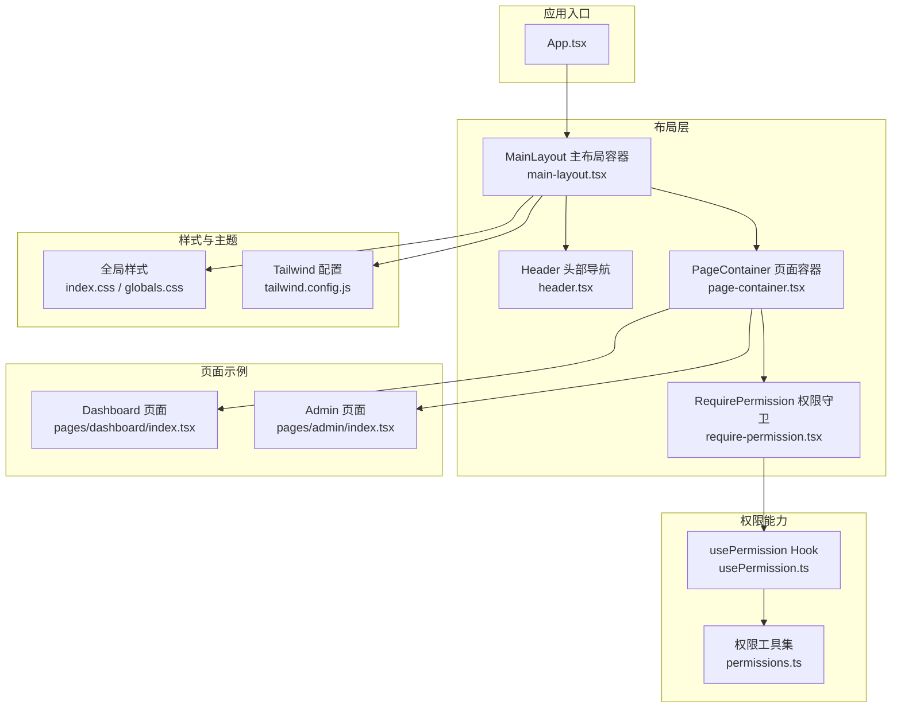
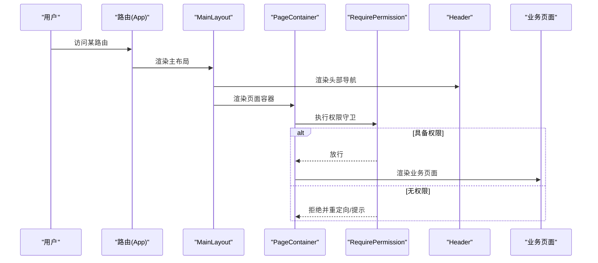
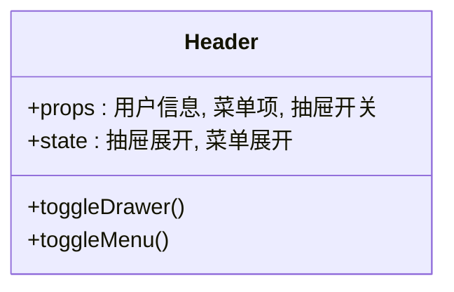
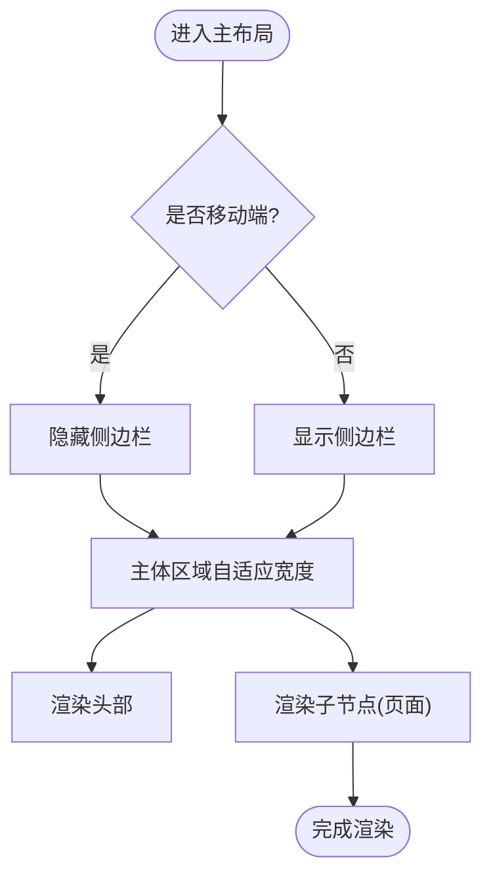
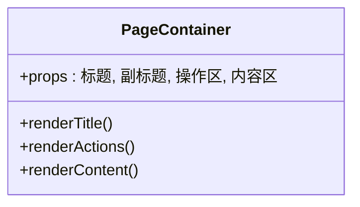
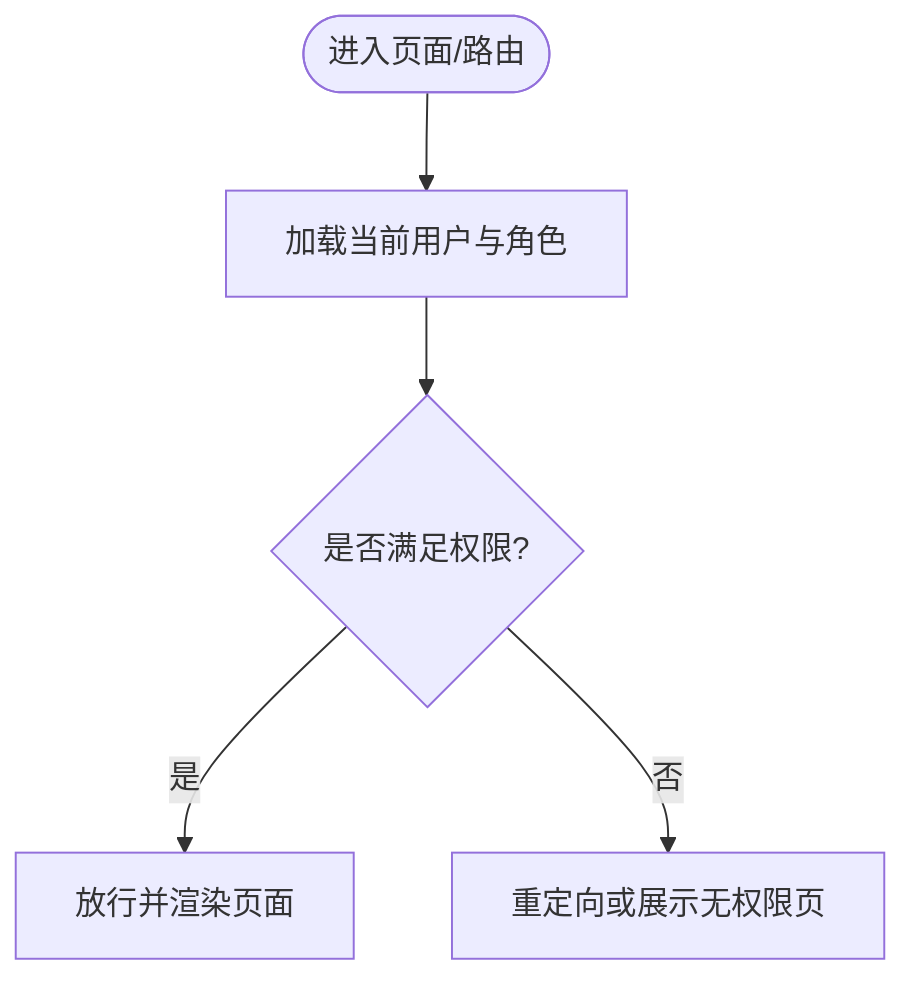
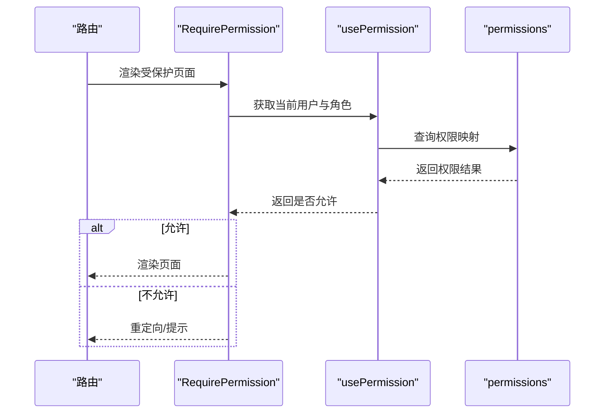
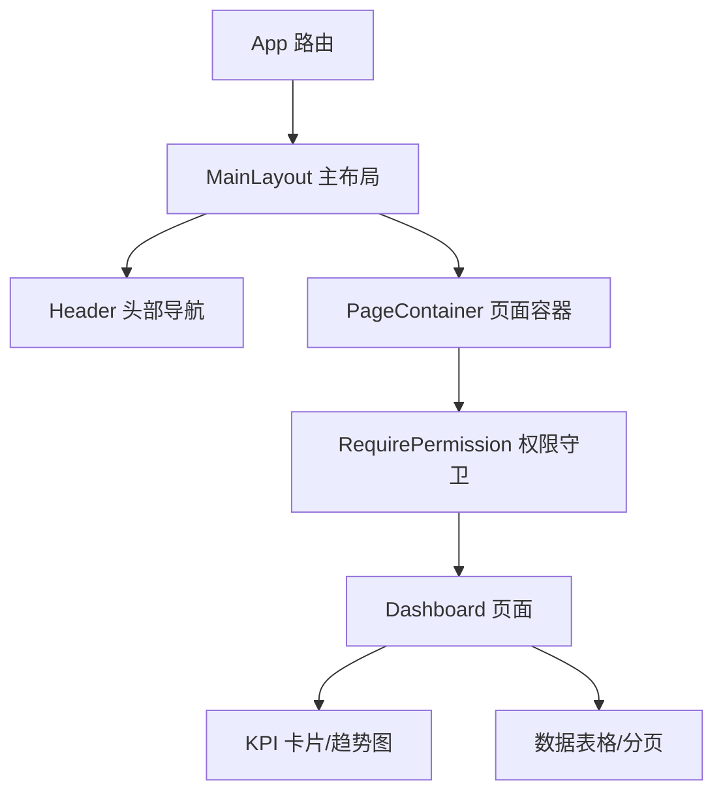
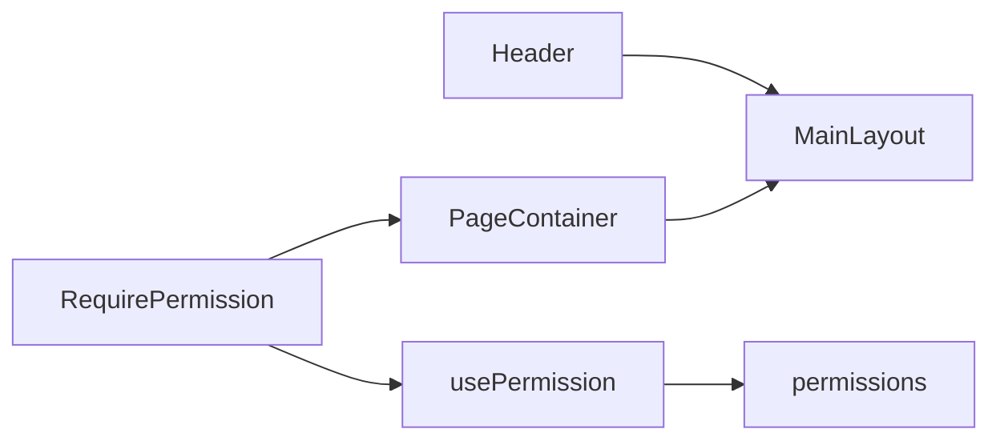

# 布局组件

<cite>
**本文引用的文件**   
- [header.tsx](file://web/src/components/layout/header.tsx)
- [main-layout.tsx](file://web/src/components/layout/main-layout.tsx)
- [page-container.tsx](file://web/src/components/layout/page-container.tsx)
- [require-permission.tsx](file://web/src/components/layout/require-permission.tsx)
- [usePermission.ts](file://web/src/hooks/usePermission.ts)
- [permissions.ts](file://web/src/lib/permissions.ts)
- [App.tsx](file://web/src/App.tsx)
- [index.css](file://web/src/index.css)
- [globals.css](file://web/src/styles/globals.css)
- [tailwind.config.js](file://web/tailwind.config.js)
- [dashboard/index.tsx](file://web/src/pages/dashboard/index.tsx)
- [admin/index.tsx](file://web/src/pages/admin/index.tsx)
- [data-table.tsx](file://web/src/components/data-table/data-table.tsx)
- [pagination.tsx](file://web/src/components/data-table/pagination.tsx)
- [pro-data-table.tsx](file://web/src/components/data-table/pro-data-table.tsx)
- [pro-table-inner.tsx](file://web/src/components/data-table/pro-table-inner.tsx)
- [kpi-card.tsx](file://web/src/components/charts/kpi-card.tsx)
- [kpi-sparkline.tsx](file://web/src/components/charts/kpi-sparkline.tsx)
- [trend-chart.tsx](file://web/src/components/charts/trend-chart.tsx)
</cite>

## 目录
1. [简介](#简介)
2. [项目结构](#项目结构)
3. [核心组件](#核心组件)
4. [架构总览](#架构总览)
5. [详细组件分析](#详细组件分析)
6. [依赖关系分析](#依赖关系分析)
7. [性能考虑](#性能考虑)
8. [故障排查指南](#故障排查指南)
9. [结论](#结论)
10. [附录](#附录)

## 简介
本文件围绕 pj3 项目的页面布局系统，系统性梳理头部导航、主布局容器、页面容器与权限控制组件的职责分工、组合方式与扩展点。文档同时覆盖响应式布局实现原理（移动端适配、断点处理、弹性布局）、基于角色的路由级访问控制模式、复杂页面的嵌套示例、性能优化策略（懒加载、虚拟滚动等）以及测试与调试方法，帮助读者快速掌握并高效使用布局体系。

## 项目结构
布局相关代码集中在 web/src/components/layout 目录，配合 hooks 与 lib 中的权限能力，形成“布局 + 权限”的解耦组合。页面通过 App 路由挂载到主布局，再由页面容器承载业务内容。

图表来源
- [App.tsx](file://web/src/App.tsx)
- [header.tsx](file://web/src/components/layout/header.tsx)
- [main-layout.tsx](file://web/src/components/layout/main-layout.tsx)
- [page-container.tsx](file://web/src/components/layout/page-container.tsx)
- [require-permission.tsx](file://web/src/components/layout/require-permission.tsx)
- [usePermission.ts](file://web/src/hooks/usePermission.ts)
- [permissions.ts](file://web/src/lib/permissions.ts)
- [index.css](file://web/src/index.css)
- [globals.css](file://web/src/styles/globals.css)
- [tailwind.config.js](file://web/tailwind.config.js)
- [dashboard/index.tsx](file://web/src/pages/dashboard/index.tsx)
- [admin/index.tsx](file://web/src/pages/admin/index.tsx)

章节来源
- [App.tsx](file://web/src/App.tsx)
- [header.tsx](file://web/src/components/layout/header.tsx)
- [main-layout.tsx](file://web/src/components/layout/main-layout.tsx)
- [page-container.tsx](file://web/src/components/layout/page-container.tsx)
- [require-permission.tsx](file://web/src/components/layout/require-permission.tsx)
- [usePermission.ts](file://web/src/hooks/usePermission.ts)
- [permissions.ts](file://web/src/lib/permissions.ts)
- [index.css](file://web/src/index.css)
- [globals.css](file://web/src/styles/globals.css)
- [tailwind.config.js](file://web/tailwind.config.js)
- [dashboard/index.tsx](file://web/src/pages/dashboard/index.tsx)
- [admin/index.tsx](file://web/src/pages/admin/index.tsx)

## 核心组件
- Header 头部导航：提供品牌标识、用户信息、菜单入口与移动端抽屉开关；负责顶部固定定位与响应式折叠。
- MainLayout 主布局容器：组织 Header 与侧边栏（如有）、主体区域与页脚；管理整体间距、背景与滚动行为。
- PageContainer 页面容器：统一页面内边距、标题区、操作区与内容区的排版；提供可复用的页面骨架。
- RequirePermission 权限守卫：在路由或页面级别进行角色/权限校验，未授权时重定向或展示占位。

职责边界
- Header 仅关注导航交互与状态展示，不感知业务数据。
- MainLayout 专注布局结构与尺寸控制，不处理具体业务逻辑。
- PageContainer 聚焦页面级排版与通用区块，不包含业务渲染。
- RequirePermission 作为横切关注点，屏蔽权限细节，向上暴露声明式 API。

章节来源
- [header.tsx](file://web/src/components/layout/header.tsx)
- [main-layout.tsx](file://web/src/components/layout/main-layout.tsx)
- [page-container.tsx](file://web/src/components/layout/page-container.tsx)
- [require-permission.tsx](file://web/src/components/layout/require-permission.tsx)

## 架构总览
布局系统采用“容器 + 守卫 + 页面”的分层设计：App 将路由映射到页面，页面被包裹在 MainLayout 中，MainLayout 内部包含 Header 与 PageContainer，PageContainer 再按需嵌入 RequirePermission 以完成路由级权限控制。

图表来源
- [App.tsx](file://web/src/App.tsx)
- [main-layout.tsx](file://web/src/components/layout/main-layout.tsx)
- [page-container.tsx](file://web/src/components/layout/page-container.tsx)
- [require-permission.tsx](file://web/src/components/layout/require-permission.tsx)
- [header.tsx](file://web/src/components/layout/header.tsx)

## 详细组件分析

### Header 头部导航
- 功能要点
  - 品牌与标题展示
  - 用户信息与下拉菜单
  - 移动端抽屉开关
  - 响应式折叠（小屏隐藏次要项）
- 交互与状态
  - 抽屉展开/收起状态
  - 用户菜单展开/收起状态
- 响应式策略
  - 使用 Tailwind 断点控制显示/隐藏
  - 在小屏幕下切换为抽屉式导航
- 可复用性
  - 支持插槽传入自定义菜单项
  - 支持主题色与高度定制

图表来源
- [header.tsx](file://web/src/components/layout/header.tsx)

章节来源
- [header.tsx](file://web/src/components/layout/header.tsx)

### MainLayout 主布局容器
- 功能要点
  - 组织 Header、侧边栏（可选）、主体内容与页脚
  - 管理整体间距、背景、滚动区域
  - 提供全屏/退出全屏等辅助能力
- 布局策略
  - Flex 纵向布局：Header 固定高度，主体自适应剩余空间
  - 侧边栏与主体横向排列，支持折叠
- 响应式策略
  - 小屏隐藏侧边栏，主体全宽
  - 大屏恢复双栏布局
- 可扩展点
  - 通过 props 注入自定义 Header/Footer
  - 通过 children 注入任意页面内容

图表来源
- [main-layout.tsx](file://web/src/components/layout/main-layout.tsx)

章节来源
- [main-layout.tsx](file://web/src/components/layout/main-layout.tsx)

### PageContainer 页面容器
- 功能要点
  - 统一页面内边距与最大宽度
  - 提供标题区、操作区与内容区三段式结构
  - 内置卡片化背景与阴影风格
- 使用方式
  - 包裹业务页面，自动获得一致的视觉与间距
  - 支持传入副标题、操作按钮组等
- 响应式策略
  - 小屏减少内边距，提升可用空间
  - 标题与操作区在小屏堆叠显示

图表来源
- [page-container.tsx](file://web/src/components/layout/page-container.tsx)

章节来源
- [page-container.tsx](file://web/src/components/layout/page-container.tsx)

### RequirePermission 权限守卫
- 设计模式
  - 高阶组件/Hook 混合：既可作为组件包裹路由，也可在页面内调用 Hook 判断
- 权限模型
  - 基于角色与权限码的组合判定
  - 支持白名单与黑名单两种策略
- 路由级控制
  - 在路由渲染前拦截，未授权时重定向至登录或 403
- 错误体验
  - 提供友好的占位与提示信息
  - 支持开发环境打印诊断日志

图表来源
- [require-permission.tsx](file://web/src/components/layout/require-permission.tsx)
- [usePermission.ts](file://web/src/hooks/usePermission.ts)
- [permissions.ts](file://web/src/lib/permissions.ts)

章节来源
- [require-permission.tsx](file://web/src/components/layout/require-permission.tsx)
- [usePermission.ts](file://web/src/hooks/usePermission.ts)
- [permissions.ts](file://web/src/lib/permissions.ts)

### 响应式布局实现原理
- 断点与网格
  - 基于 Tailwind 断点控制不同屏幕下的布局策略
  - 通过栅格与间距变量保证一致性
- 弹性布局
  - 使用 Flex 主轴与交叉轴组合，实现 Header 固定、主体自适应
  - 侧边栏与主体通过 flex-shrink 与 overflow 控制滚动
- 移动端适配
  - 小屏隐藏次要元素，优先保留关键导航
  - 触摸友好的点击区域与字号
- 主题与深色模式
  - 通过 CSS 变量与 Tailwind 插件统一管理

章节来源
- [tailwind.config.js](file://web/tailwind.config.js)
- [index.css](file://web/src/index.css)
- [globals.css](file://web/src/styles/globals.css)

### 权限控制组件的设计模式
- 声明式守卫
  - 在路由或页面外层包裹 RequirePermission，声明所需角色/权限
- 组合式 Hook
  - usePermission 暴露 hasPermission 等方法，供页面内条件渲染
- 集中式权限表
  - permissions.ts 维护角色与权限映射，便于审计与扩展
- 路由级拦截
  - 在路由渲染前进行权限检查，避免无效渲染

图表来源
- [require-permission.tsx](file://web/src/components/layout/require-permission.tsx)
- [usePermission.ts](file://web/src/hooks/usePermission.ts)
- [permissions.ts](file://web/src/lib/permissions.ts)

章节来源
- [require-permission.tsx](file://web/src/components/layout/require-permission.tsx)
- [usePermission.ts](file://web/src/hooks/usePermission.ts)
- [permissions.ts](file://web/src/lib/permissions.ts)

### 完整布局嵌套示例
以下示例展示如何组合 Header、MainLayout、PageContainer 与 RequirePermission，构建一个需要管理员权限的数据看板页面。

图表来源
- [App.tsx](file://web/src/App.tsx)
- [main-layout.tsx](file://web/src/components/layout/main-layout.tsx)
- [header.tsx](file://web/src/components/layout/header.tsx)
- [page-container.tsx](file://web/src/components/layout/page-container.tsx)
- [require-permission.tsx](file://web/src/components/layout/require-permission.tsx)
- [dashboard/index.tsx](file://web/src/pages/dashboard/index.tsx)
- [kpi-card.tsx](file://web/src/components/charts/kpi-card.tsx)
- [kpi-sparkline.tsx](file://web/src/components/charts/kpi-sparkline.tsx)
- [trend-chart.tsx](file://web/src/components/charts/trend-chart.tsx)
- [data-table.tsx](file://web/src/components/data-table/data-table.tsx)
- [pagination.tsx](file://web/src/components/data-table/pagination.tsx)

章节来源
- [dashboard/index.tsx](file://web/src/pages/dashboard/index.tsx)
- [admin/index.tsx](file://web/src/pages/admin/index.tsx)
- [kpi-card.tsx](file://web/src/components/charts/kpi-card.tsx)
- [kpi-sparkline.tsx](file://web/src/components/charts/kpi-sparkline.tsx)
- [trend-chart.tsx](file://web/src/components/charts/trend-chart.tsx)
- [data-table.tsx](file://web/src/components/data-table/data-table.tsx)
- [pagination.tsx](file://web/src/components/data-table/pagination.tsx)
- [pro-data-table.tsx](file://web/src/components/data-table/pro-data-table.tsx)
- [pro-table-inner.tsx](file://web/src/components/data-table/pro-table-inner.tsx)

## 依赖关系分析
- 组件耦合
  - MainLayout 依赖 Header 与 PageContainer，低耦合高内聚
  - RequirePermission 依赖 usePermission 与 permissions，权限逻辑集中
- 外部依赖
  - Tailwind 用于响应式与主题
  - 路由框架用于挂载布局与权限守卫
- 潜在循环
  - 布局与页面之间通过 children 传递，避免直接相互引用

图表来源
- [header.tsx](file://web/src/components/layout/header.tsx)
- [main-layout.tsx](file://web/src/components/layout/main-layout.tsx)
- [page-container.tsx](file://web/src/components/layout/page-container.tsx)
- [require-permission.tsx](file://web/src/components/layout/require-permission.tsx)
- [usePermission.ts](file://web/src/hooks/usePermission.ts)
- [permissions.ts](file://web/src/lib/permissions.ts)

章节来源
- [header.tsx](file://web/src/components/layout/header.tsx)
- [main-layout.tsx](file://web/src/components/layout/main-layout.tsx)
- [page-container.tsx](file://web/src/components/layout/page-container.tsx)
- [require-permission.tsx](file://web/src/components/layout/require-permission.tsx)
- [usePermission.ts](file://web/src/hooks/usePermission.ts)
- [permissions.ts](file://web/src/lib/permissions.ts)

## 性能考虑
- 懒加载与代码分割
  - 对大型页面与图表组件使用动态导入，降低首屏体积
- 列表与表格优化
  - 大数据量场景启用虚拟滚动（如 pro-data-table 内部封装）
  - 分页与增量加载结合，减少一次性渲染压力
- 缓存与去抖
  - 对频繁触发的窗口尺寸变化做防抖处理
  - 对接口数据进行短期缓存，避免重复请求
- 渲染优化
  - 合理使用 React.memo 与 useMemo，减少不必要的重渲染
  - 图片与图标资源按需加载与压缩

章节来源
- [pro-data-table.tsx](file://web/src/components/data-table/pro-data-table.tsx)
- [pro-table-inner.tsx](file://web/src/components/data-table/pro-table-inner.tsx)
- [data-table.tsx](file://web/src/components/data-table/data-table.tsx)
- [pagination.tsx](file://web/src/components/data-table/pagination.tsx)
- [kpi-card.tsx](file://web/src/components/charts/kpi-card.tsx)
- [kpi-sparkline.tsx](file://web/src/components/charts/kpi-sparkline.tsx)
- [trend-chart.tsx](file://web/src/components/charts/trend-chart.tsx)

## 故障排查指南
- 权限问题
  - 现象：页面空白或重定向到登录
  - 排查：确认用户角色与权限映射是否正确；查看权限守卫日志
  - 参考路径：[require-permission.tsx](file://web/src/components/layout/require-permission.tsx)、[usePermission.ts](file://web/src/hooks/usePermission.ts)、[permissions.ts](file://web/src/lib/permissions.ts)
- 布局错位
  - 现象：Header 遮挡内容或侧边栏重叠
  - 排查：检查 z-index、padding-top 与 overflow 设置；核对 Tailwind 断点
  - 参考路径：[main-layout.tsx](file://web/src/components/layout/main-layout.tsx)、[index.css](file://web/src/index.css)、[globals.css](file://web/src/styles/globals.css)、[tailwind.config.js](file://web/tailwind.config.js)
- 移动端异常
  - 现象：抽屉无法打开或菜单溢出
  - 排查：检查事件绑定与遮罩层级；确认小屏断点样式
  - 参考路径：[header.tsx](file://web/src/components/layout/header.tsx)
- 表格卡顿
  - 现象：大数据量导致滚动卡顿
  - 排查：确认是否启用虚拟滚动与分页；减少每行渲染复杂度
  - 参考路径：[pro-data-table.tsx](file://web/src/components/data-table/pro-data-table.tsx)、[pagination.tsx](file://web/src/components/data-table/pagination.tsx)

章节来源
- [require-permission.tsx](file://web/src/components/layout/require-permission.tsx)
- [usePermission.ts](file://web/src/hooks/usePermission.ts)
- [permissions.ts](file://web/src/lib/permissions.ts)
- [main-layout.tsx](file://web/src/components/layout/main-layout.tsx)
- [index.css](file://web/src/index.css)
- [globals.css](file://web/src/styles/globals.css)
- [tailwind.config.js](file://web/tailwind.config.js)
- [header.tsx](file://web/src/components/layout/header.tsx)
- [pro-data-table.tsx](file://web/src/components/data-table/pro-data-table.tsx)
- [pagination.tsx](file://web/src/components/data-table/pagination.tsx)

## 结论
pj3 的布局组件以清晰的职责划分与良好的组合性为基础，借助 Tailwind 的响应式能力与权限守卫的声明式 API，实现了稳定、可扩展且易维护的页面布局体系。通过合理的性能优化与完善的测试/调试手段，可在复杂业务场景中保持优秀的用户体验与开发效率。

## 附录
- 最佳实践
  - 在路由层统一包裹 MainLayout，确保全局一致
  - 使用 PageContainer 规范页面骨架，减少重复样式
  - 通过 RequirePermission 声明式控制访问，避免分散判断
  - 大数据列表优先使用虚拟滚动与分页
- 常用断点参考
  - 小屏：隐藏侧边栏与次要菜单，增大触控区域
  - 中屏：适度缩减内边距，保持可读性
  - 大屏：充分利用空间，展示更多列与图表