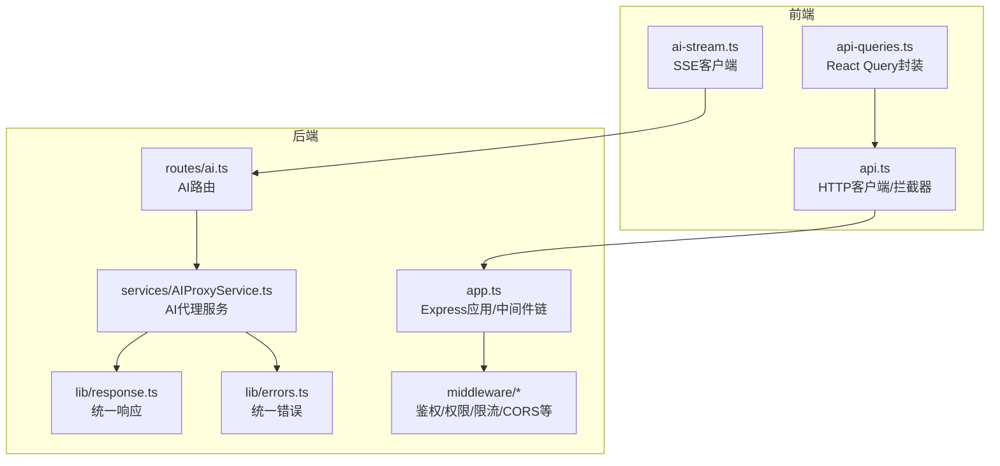
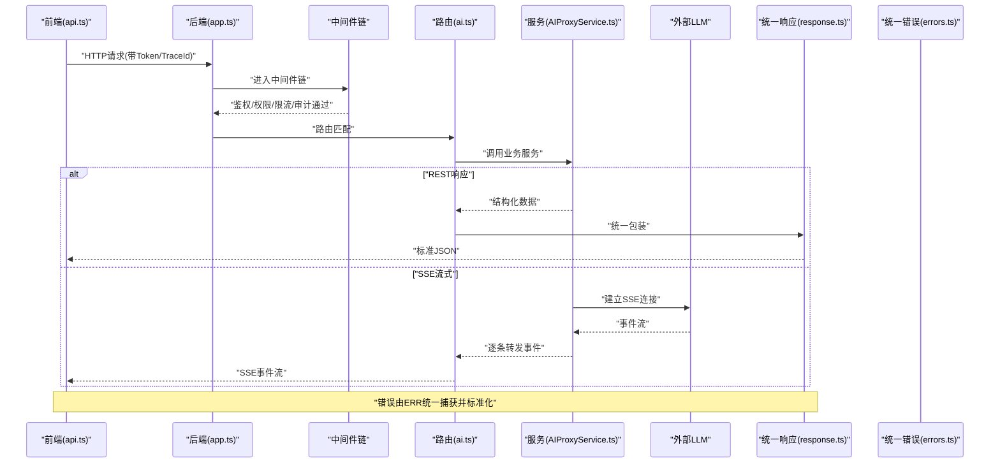
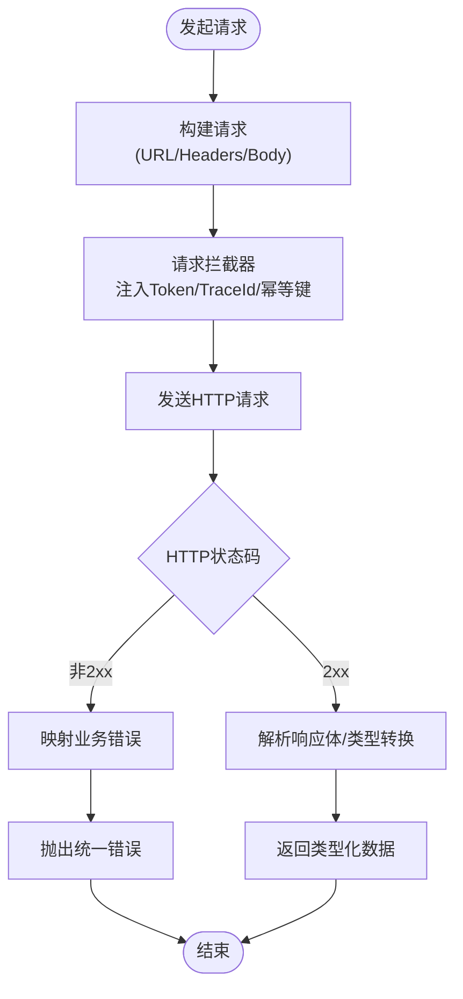
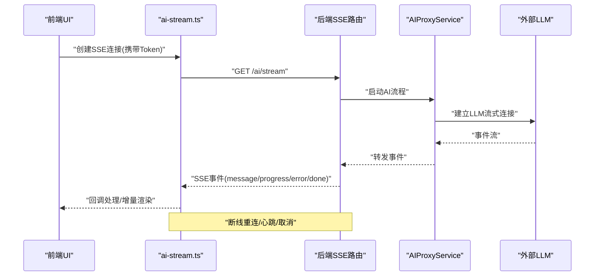
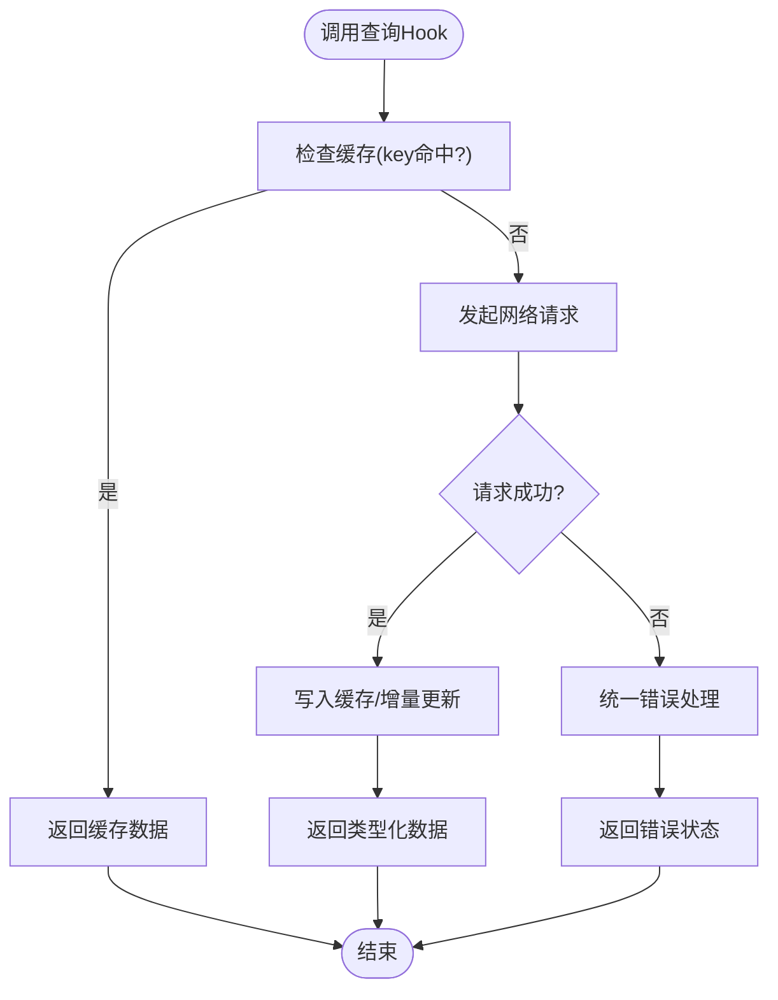
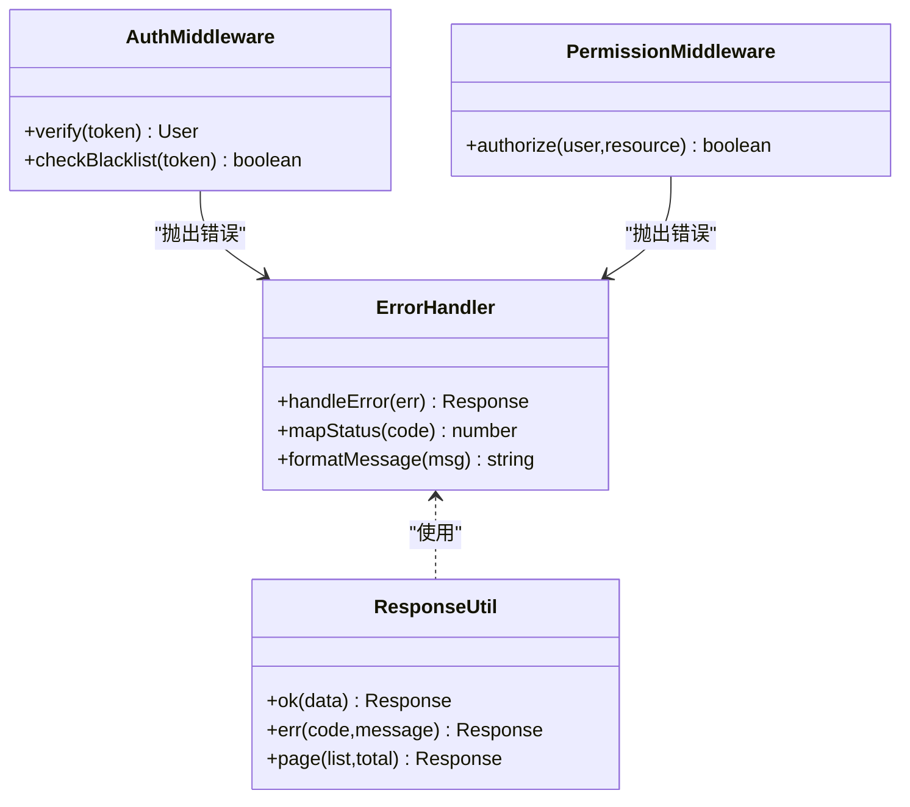
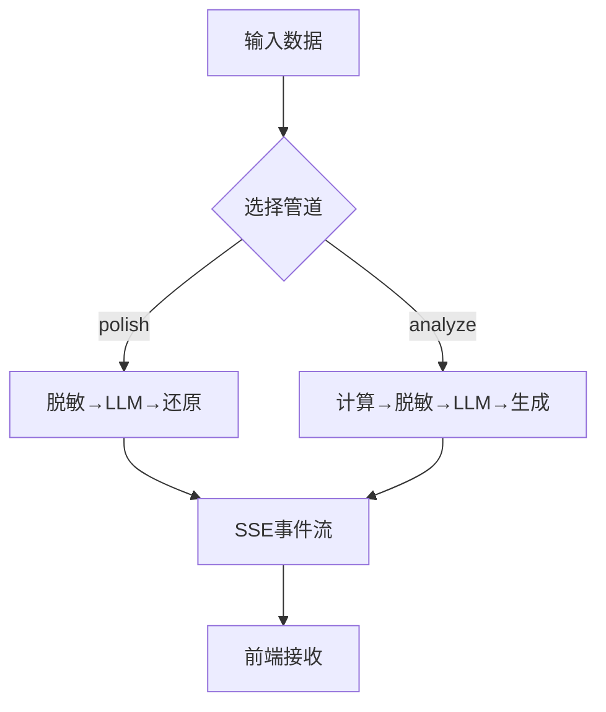
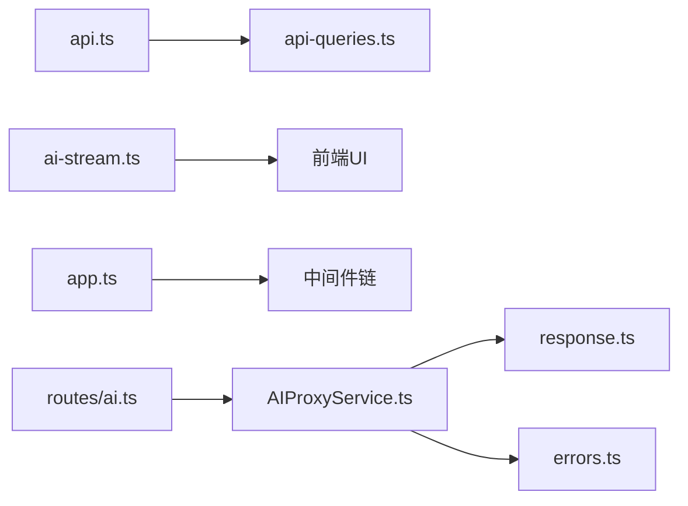

# API集成

<cite>
**本文引用的文件**
- [web/src/lib/api.ts](file://web/src/lib/api.ts)
- [web/src/lib/ai-stream.ts](file://web/src/lib/ai-stream.ts)
- [web/src/hooks/api-queries.ts](file://web/src/hooks/api-queries.ts)
- [server/src/app.ts](file://server/src/app.ts)
- [server/src/middleware/error-handler.ts](file://server/src/middleware/error-handler.ts)
- [server/src/middleware/auth.ts](file://server/src/middleware/auth.ts)
- [server/src/middleware/cors.ts](file://server/src/middleware/cors.ts)
- [server/src/middleware/rate-limit.ts](file://server/src/middleware/rate-limit.ts)
- [server/src/middleware/permission.ts](file://server/src/middleware/permission.ts)
- [server/src/middleware/scope.ts](file://server/src/middleware/scope.ts)
- [server/src/middleware/soft-delete.ts](file://server/src/middleware/soft-delete.ts)
- [server/src/middleware/audit.ts](file://server/src/middleware/audit.ts)
- [server/src/middleware/trace-id.ts](file://server/src/middleware/trace-id.ts)
- [server/src/routes/ai.ts](file://server/src/routes/ai.ts)
- [server/src/services/AIProxyService.ts](file://server/src/services/AIProxyService.ts)
- [server/src/lib/response.ts](file://server/src/lib/response.ts)
- [server/src/lib/errors.ts](file://server/src/lib/errors.ts)
- [server/src/config/env.ts](file://server/src/config/env.ts)
</cite>

## 目录
1. [简介](#简介)
2. [项目结构](#项目结构)
3. [核心组件](#核心组件)
4. [架构总览](#架构总览)
5. [详细组件分析](#详细组件分析)
6. [依赖关系分析](#依赖关系分析)
7. [性能考量](#性能考量)
8. [故障排查指南](#故障排查指南)
9. [结论](#结论)
10. [附录](#附录)

## 简介
本文件面向FY200前端API集成，系统性阐述客户端HTTP请求封装、拦截器与响应处理器、统一错误处理、RESTful调用模式、参数序列化与类型安全、SSE流式响应（AI实时数据）、查询缓存策略（预取、增量更新、失效），以及最佳实践（重试、超时、异常处理）和调试与监控方法。文档同时结合后端中间件链路与AI代理服务的实现，帮助读者从端到端理解数据流转与可靠性保障。

## 项目结构
前端API相关代码集中在以下模块：
- HTTP客户端与拦截器：web/src/lib/api.ts
- SSE流式客户端：web/src/lib/ai-stream.ts
- React Query钩子封装：web/src/hooks/api-queries.ts
- 后端应用入口与中间件链：server/src/app.ts
- AI路由与服务：server/src/routes/ai.ts、server/src/services/AIProxyService.ts
- 统一响应与错误：server/src/lib/response.ts、server/src/lib/errors.ts
- 鉴权、权限、限流、CORS等中间件：server/src/middleware/*

**图表来源**
- [web/src/lib/api.ts](file://web/src/lib/api.ts)
- [web/src/lib/ai-stream.ts](file://web/src/lib/ai-stream.ts)
- [web/src/hooks/api-queries.ts](file://web/src/hooks/api-queries.ts)
- [server/src/app.ts](file://server/src/app.ts)
- [server/src/routes/ai.ts](file://server/src/routes/ai.ts)
- [server/src/services/AIProxyService.ts](file://server/src/services/AIProxyService.ts)
- [server/src/lib/response.ts](file://server/src/lib/response.ts)
- [server/src/lib/errors.ts](file://server/src/lib/errors.ts)
- [server/src/middleware/cors.ts](file://server/src/middleware/cors.ts)
- [server/src/middleware/rate-limit.ts](file://server/src/middleware/rate-limit.ts)
- [server/src/middleware/auth.ts](file://server/src/middleware/auth.ts)
- [server/src/middleware/permission.ts](file://server/src/middleware/permission.ts)
- [server/src/middleware/scope.ts](file://server/src/middleware/scope.ts)
- [server/src/middleware/soft-delete.ts](file://server/src/middleware/soft-delete.ts)
- [server/src/middleware/audit.ts](file://server/src/middleware/audit.ts)
- [server/src/middleware/trace-id.ts](file://server/src/middleware/trace-id.ts)

**章节来源**
- [server/src/app.ts](file://server/src/app.ts)
- [server/src/middleware/cors.ts](file://server/src/middleware/cors.ts)
- [server/src/middleware/rate-limit.ts](file://server/src/middleware/rate-limit.ts)
- [server/src/middleware/auth.ts](file://server/src/middleware/auth.ts)
- [server/src/middleware/permission.ts](file://server/src/middleware/permission.ts)
- [server/src/middleware/scope.ts](file://server/src/middleware/scope.ts)
- [server/src/middleware/soft-delete.ts](file://server/src/middleware/soft-delete.ts)
- [server/src/middleware/audit.ts](file://server/src/middleware/audit.ts)
- [server/src/middleware/trace-id.ts](file://server/src/middleware/trace-id.ts)

## 核心组件
- HTTP客户端与拦截器（api.ts）
  - 负责基础URL、默认头、请求拦截（注入Token、TraceId、幂等键等）、响应拦截（状态码归一化、业务错误映射、类型转换）。
  - 支持GET/POST/PUT/DELETE等REST方法封装，提供统一的错误抛出与成功数据提取。
- SSE流式客户端（ai-stream.ts）
  - 基于EventSource或Fetch流式读取，解析服务端SSE事件，按事件类型分发回调，支持断线重连、心跳检测、进度与错误事件。
- React Query封装（api-queries.ts）
  - 将REST/SSE能力封装为可复用的查询与变更钩子，内置缓存、去重、预取、增量更新、失效策略与乐观更新。

**章节来源**
- [web/src/lib/api.ts](file://web/src/lib/api.ts)
- [web/src/lib/ai-stream.ts](file://web/src/lib/ai-stream.ts)
- [web/src/hooks/api-queries.ts](file://web/src/hooks/api-queries.ts)

## 架构总览
前端通过api.ts发起REST请求，经拦截器处理后由浏览器网络栈发送至后端Express服务；后端中间件链依次执行（helmet→cors→express.json→rate-limit→auth→permission→scope→softDelete→audit→Service→Prisma→PostgreSQL）。AI功能通过routes/ai.ts暴露SSE接口，由AIProxyService转发至外部LLM并流式返回。统一响应与错误在response.ts与errors.ts中集中处理。

**图表来源**
- [web/src/lib/api.ts](file://web/src/lib/api.ts)
- [server/src/app.ts](file://server/src/app.ts)
- [server/src/middleware/auth.ts](file://server/src/middleware/auth.ts)
- [server/src/middleware/permission.ts](file://server/src/middleware/permission.ts)
- [server/src/middleware/rate-limit.ts](file://server/src/middleware/rate-limit.ts)
- [server/src/middleware/cors.ts](file://server/src/middleware/cors.ts)
- [server/src/middleware/audit.ts](file://server/src/middleware/audit.ts)
- [server/src/routes/ai.ts](file://server/src/routes/ai.ts)
- [server/src/services/AIProxyService.ts](file://server/src/services/AIProxyService.ts)
- [server/src/lib/response.ts](file://server/src/lib/response.ts)
- [server/src/lib/errors.ts](file://server/src/lib/errors.ts)

## 详细组件分析

### HTTP客户端与拦截器（api.ts）
- 请求拦截器
  - 自动附加JWT访问令牌到Authorization头，避免重复登录态丢失。
  - 注入TraceId用于全链路追踪，便于前后端问题定位。
  - 对幂等请求（如GET）生成或复用幂等键，防止重复提交。
  - 根据Content-Type设置请求体序列化方式（application/json等）。
- 响应处理器
  - 统一解析HTTP状态码，将非2xx转换为业务错误对象。
  - 对业务错误码进行映射，输出可读的错误消息与上下文。
  - 对成功响应进行数据解包与类型校验（配合TypeScript类型定义）。
- REST调用模式
  - 提供get/post/put/delete等方法，支持路径参数、查询参数、请求体与分页参数。
  - 参数序列化遵循RFC规范，数组与对象按约定编码。
- 类型安全保证
  - 使用泛型约束返回值类型，确保调用方获得强类型数据结构。
  - 与后端schema对齐，减少运行时不一致风险。

**图表来源**
- [web/src/lib/api.ts](file://web/src/lib/api.ts)

**章节来源**
- [web/src/lib/api.ts](file://web/src/lib/api.ts)

### SSE流式客户端（ai-stream.ts）
- 连接建立
  - 使用EventSource或Fetch流式读取，建立与服务端SSE端点的连接。
  - 支持自定义头部（如Authorization）与超时控制。
- 事件处理
  - 解析事件类型（如message、progress、error、done），分派对应回调。
  - 支持增量渲染与滚动优化，避免UI卡顿。
- 断线重连
  - 监听连接关闭与错误事件，按指数退避策略重连。
  - 支持心跳检测，长时间无数据时主动断开并重连。
- 错误与取消
  - 统一错误事件上报，包含错误码与消息。
  - 提供取消连接的能力，避免内存泄漏。

**图表来源**
- [web/src/lib/ai-stream.ts](file://web/src/lib/ai-stream.ts)
- [server/src/routes/ai.ts](file://server/src/routes/ai.ts)
- [server/src/services/AIProxyService.ts](file://server/src/services/AIProxyService.ts)

**章节来源**
- [web/src/lib/ai-stream.ts](file://web/src/lib/ai-stream.ts)
- [server/src/routes/ai.ts](file://server/src/routes/ai.ts)
- [server/src/services/AIProxyService.ts](file://server/src/services/AIProxyService.ts)

### React Query封装（api-queries.ts）
- 查询缓存
  - 基于key的缓存管理，支持过期时间、后台刷新、预取与去重。
  - 提供select函数对数据进行轻量级选择与派生计算。
- 增量更新
  - 使用invalidateQueries与setQueryData实现局部更新，避免全量刷新。
  - 支持乐观更新与回滚，提升交互体验。
- 失效机制
  - 在写操作成功后触发相关key失效，保证数据一致性。
  - 支持条件失效与批量失效。
- 类型安全
  - 与API返回类型对齐，确保hooks返回值具备完整类型信息。

**图表来源**
- [web/src/hooks/api-queries.ts](file://web/src/hooks/api-queries.ts)
- [web/src/lib/api.ts](file://web/src/lib/api.ts)

**章节来源**
- [web/src/hooks/api-queries.ts](file://web/src/hooks/api-queries.ts)

### 后端中间件链与统一错误处理
- 中间件顺序
  - helmet → cors → express.json → rate-limit → auth(JWT+黑名单) → permission(默认拒绝) → scope(Prisma扩展) → softDelete → audit → Service → Prisma → PostgreSQL。
- 统一错误
  - errors.ts定义业务错误类型与消息模板，error-handler.ts捕获未处理异常并返回标准格式。
- 统一响应
  - response.ts封装成功与失败响应结构，确保前后端契约一致。

**图表来源**
- [server/src/middleware/error-handler.ts](file://server/src/middleware/error-handler.ts)
- [server/src/lib/response.ts](file://server/src/lib/response.ts)
- [server/src/lib/errors.ts](file://server/src/lib/errors.ts)
- [server/src/middleware/auth.ts](file://server/src/middleware/auth.ts)
- [server/src/middleware/permission.ts](file://server/src/middleware/permission.ts)

**章节来源**
- [server/src/app.ts](file://server/src/app.ts)
- [server/src/middleware/error-handler.ts](file://server/src/middleware/error-handler.ts)
- [server/src/lib/response.ts](file://server/src/lib/response.ts)
- [server/src/lib/errors.ts](file://server/src/lib/errors.ts)
- [server/src/middleware/auth.ts](file://server/src/middleware/auth.ts)
- [server/src/middleware/permission.ts](file://server/src/middleware/permission.ts)

### AI代理服务（AIProxyService.ts）
- 双管道架构
  - polish管道：文本输入→脱敏→LLM→还原，适用于文本润色场景。
  - analyze管道：结构化数据→计算→脱敏→LLM→生成，适用于数据分析场景。
- 脱敏规则
  - 绝对金额→区间，公司名→动态映射，确保敏感信息不泄露。
- 流式转发
  - 将LLM事件流逐条转发给前端，保持低延迟与高吞吐。

**图表来源**
- [server/src/services/AIProxyService.ts](file://server/src/services/AIProxyService.ts)

**章节来源**
- [server/src/services/AIProxyService.ts](file://server/src/services/AIProxyService.ts)

## 依赖关系分析
- 前端依赖
  - api.ts依赖浏览器网络API与TypeScript类型系统。
  - ai-stream.ts依赖EventSource/Fetch与SSE协议。
  - api-queries.ts依赖React Query库与api.ts封装。
- 后端依赖
  - app.ts依赖Express与中间件。
  - routes/ai.ts依赖AIProxyService。
  - AIProxyService依赖外部LLM与内部脱敏/计算逻辑。
  - 统一响应与错误模块被各层共享。

**图表来源**
- [web/src/lib/api.ts](file://web/src/lib/api.ts)
- [web/src/hooks/api-queries.ts](file://web/src/hooks/api-queries.ts)
- [web/src/lib/ai-stream.ts](file://web/src/lib/ai-stream.ts)
- [server/src/app.ts](file://server/src/app.ts)
- [server/src/routes/ai.ts](file://server/src/routes/ai.ts)
- [server/src/services/AIProxyService.ts](file://server/src/services/AIProxyService.ts)
- [server/src/lib/response.ts](file://server/src/lib/response.ts)
- [server/src/lib/errors.ts](file://server/src/lib/errors.ts)

**章节来源**
- [web/src/lib/api.ts](file://web/src/lib/api.ts)
- [web/src/hooks/api-queries.ts](file://web/src/hooks/api-queries.ts)
- [web/src/lib/ai-stream.ts](file://web/src/lib/ai-stream.ts)
- [server/src/app.ts](file://server/src/app.ts)
- [server/src/routes/ai.ts](file://server/src/routes/ai.ts)
- [server/src/services/AIProxyService.ts](file://server/src/services/AIProxyService.ts)
- [server/src/lib/response.ts](file://server/src/lib/response.ts)
- [server/src/lib/errors.ts](file://server/src/lib/errors.ts)

## 性能考量
- 请求合并与去重
  - 利用React Query的staleTime与refetchOnWindowFocus减少重复请求。
- 缓存策略
  - 合理设置过期时间与后台刷新，平衡新鲜度与性能。
- 流式传输
  - SSE降低首字节延迟，适合AI实时输出。
- 网络优化
  - 启用Gzip/Brotli压缩，减少传输体积。
- 资源释放
  - 及时取消未使用的SSE连接与请求，避免内存泄漏。

[本节为通用指导，无需引用具体文件]

## 故障排查指南
- 常见问题
  - 鉴权失败：检查Token是否有效、是否在黑名单。
  - 权限不足：确认用户角色与资源权限配置。
  - 限流触发：查看rate-limit配置与请求频率。
  - CORS错误：核对跨域配置与Origin白名单。
- 调试技巧
  - 使用TraceId串联前后端日志，快速定位问题。
  - 开启详细日志与错误堆栈，记录请求参数与响应体。
  - 使用浏览器开发者工具观察网络请求与SSE事件。
- 监控方法
  - 收集关键指标：请求成功率、延迟分布、错误率、SSE连接数。
  - 设置告警阈值，及时发现异常波动。

**章节来源**
- [server/src/middleware/auth.ts](file://server/src/middleware/auth.ts)
- [server/src/middleware/permission.ts](file://server/src/middleware/permission.ts)
- [server/src/middleware/rate-limit.ts](file://server/src/middleware/rate-limit.ts)
- [server/src/middleware/cors.ts](file://server/src/middleware/cors.ts)
- [server/src/middleware/trace-id.ts](file://server/src/middleware/trace-id.ts)
- [server/src/middleware/error-handler.ts](file://server/src/middleware/error-handler.ts)

## 结论
FY200前端API集成通过统一的HTTP客户端、SSE流式客户端与React Query封装，构建了稳定、高效、类型安全的API调用体系。后端中间件链与统一错误处理确保了安全性与可观测性。AI双管道架构与SSE流式传输为实时智能分析提供了坚实基础。建议在生产环境中持续优化缓存策略、监控指标与错误处理，以提升用户体验与系统稳定性。

[本节为总结内容，无需引用具体文件]

## 附录
- 最佳实践清单
  - 始终设置合理的超时与重试策略。
  - 对敏感数据进行脱敏处理。
  - 使用TraceId进行全链路追踪。
  - 定期清理无效缓存与连接。
  - 编写单元测试与集成测试覆盖关键路径。

[本节为补充内容，无需引用具体文件]