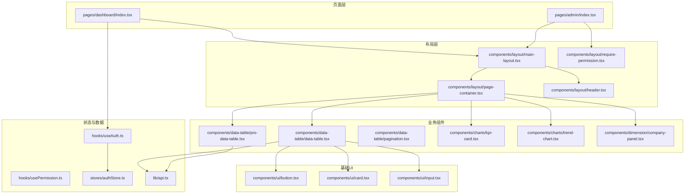
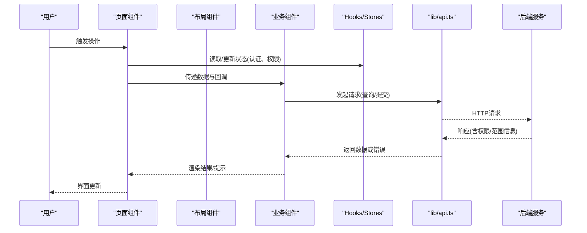
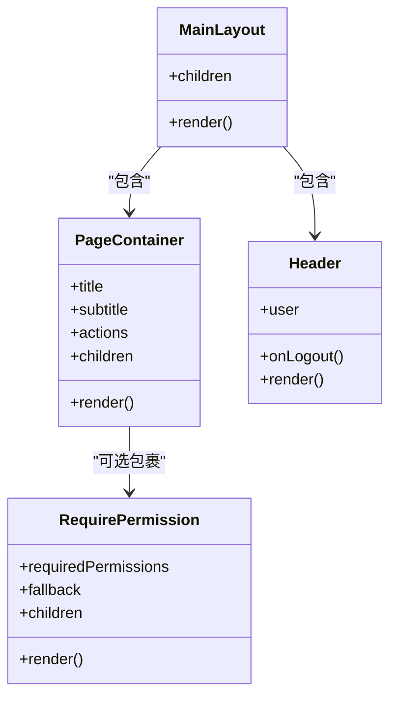
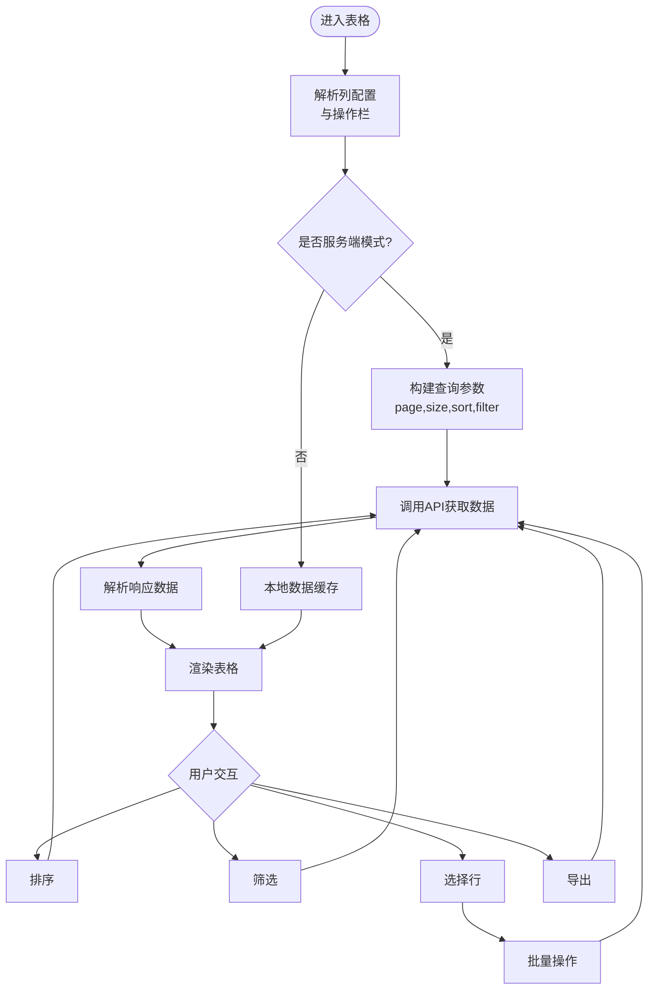
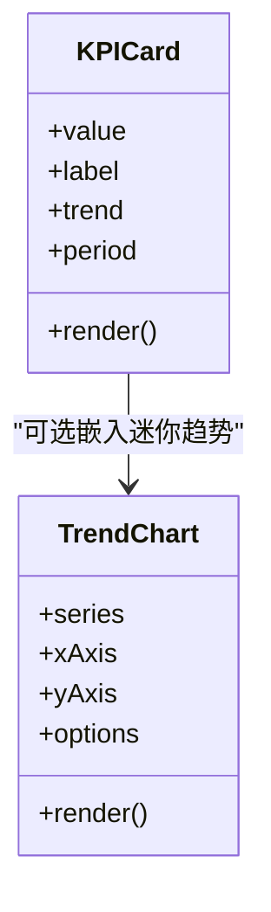
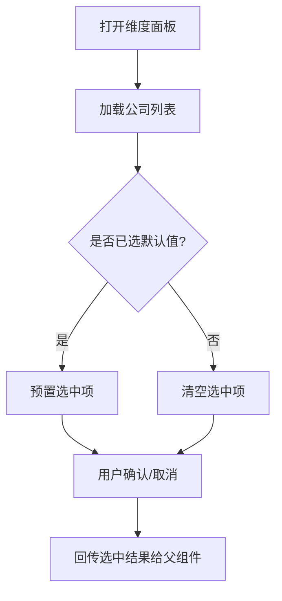
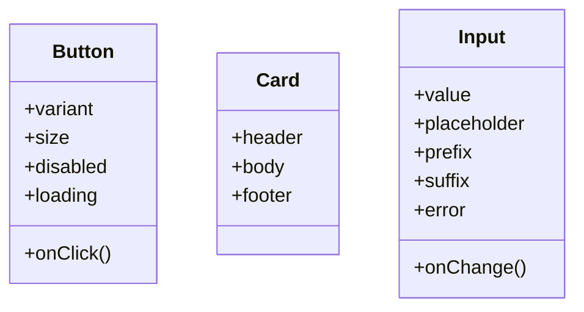
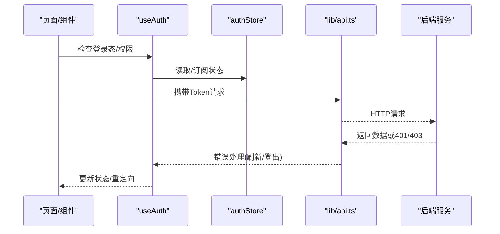
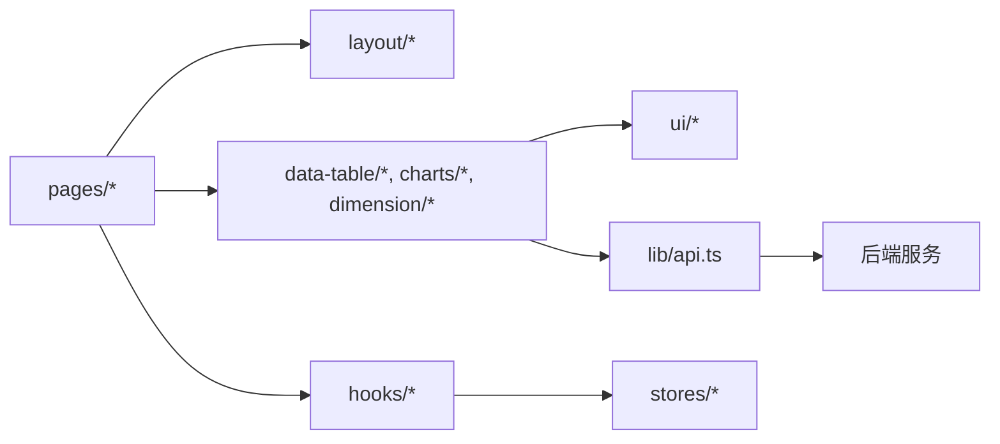

# React组件架构

<cite>
**本文引用的文件**   
- [web/src/App.tsx](file://web/src/App.tsx)
- [web/src/main.tsx](file://web/src/main.tsx)
- [web/src/components/layout/main-layout.tsx](file://web/src/components/layout/main-layout.tsx)
- [web/src/components/layout/page-container.tsx](file://web/src/components/layout/page-container.tsx)
- [web/src/components/layout/header.tsx](file://web/src/components/layout/header.tsx)
- [web/src/components/layout/require-permission.tsx](file://web/src/components/layout/require-permission.tsx)
- [web/src/components/ui/button.tsx](file://web/src/components/ui/button.tsx)
- [web/src/components/ui/card.tsx](file://web/src/components/ui/card.tsx)
- [web/src/components/ui/input.tsx](file://web/src/components/ui/input.tsx)
- [web/src/components/data-table/data-table.tsx](file://web/src/components/data-table/data-table.tsx)
- [web/src/components/data-table/pro-data-table.tsx](file://web/src/components/data-table/pro-data-table.tsx)
- [web/src/components/data-table/pagination.tsx](file://web/src/components/data-table/pagination.tsx)
- [web/src/components/charts/kpi-card.tsx](file://web/src/components/charts/kpi-card.tsx)
- [web/src/components/charts/trend-chart.tsx](file://web/src/components/charts/trend-chart.tsx)
- [web/src/components/dimension/company-panel.tsx](file://web/src/components/dimension/company-panel.tsx)
- [web/src/hooks/useAuth.ts](file://web/src/hooks/useAuth.ts)
- [web/src/hooks/usePermission.ts](file://web/src/hooks/usePermission.ts)
- [web/src/stores/authStore.ts](file://web/src/stores/authStore.ts)
- [web/src/lib/api.ts](file://web/src/lib/api.ts)
- [web/src/pages/dashboard/index.tsx](file://web/src/pages/dashboard/index.tsx)
- [web/src/pages/admin/index.tsx](file://web/src/pages/admin/index.tsx)
</cite>

## 目录
1. [简介](#简介)
2. [项目结构](#项目结构)
3. [核心组件](#核心组件)
4. [架构总览](#架构总览)
5. [详细组件分析](#详细组件分析)
6. [依赖关系分析](#依赖关系分析)
7. [性能考量](#性能考量)
8. [故障排查指南](#故障排查指南)
9. [结论](#结论)
10. [附录](#附录)

## 简介
本文件面向FY200前端React工程，系统化阐述组件分层设计、职责划分、可复用模式与通信机制，覆盖基础UI组件、业务组件与页面组件的组织方式；并给出布局策略（MainLayout、PageContainer等）、命名规范、文件组织、Props接口设计规范以及开发最佳实践（性能优化、错误处理、测试策略）。文档同时结合后端中间件链与数据流，帮助读者理解前后端协作边界。

## 项目结构
前端采用按功能域划分的目录结构：
- components/ui：基础UI原子组件（按钮、卡片、输入框等）
- components/data-table：表格与分页等数据展示组件
- components/charts：图表与KPI展示组件
- components/dimension：维度选择面板（如公司维度）
- components/layout：全局布局与权限控制容器
- hooks：状态与能力封装（鉴权、权限）
- stores：全局状态（如认证状态）
- lib：API请求、工具函数、常量
- pages：页面级组件（仪表盘、管理、报表等）

图示来源
- [web/src/App.tsx](file://web/src/App.tsx)
- [web/src/main.tsx](file://web/src/main.tsx)
- [web/src/components/layout/main-layout.tsx](file://web/src/components/layout/main-layout.tsx)
- [web/src/components/layout/page-container.tsx](file://web/src/components/layout/page-container.tsx)
- [web/src/components/layout/header.tsx](file://web/src/components/layout/header.tsx)
- [web/src/components/layout/require-permission.tsx](file://web/src/components/layout/require-permission.tsx)
- [web/src/components/data-table/data-table.tsx](file://web/src/components/data-table/data-table.tsx)
- [web/src/components/data-table/pro-data-table.tsx](file://web/src/components/data-table/pro-data-table.tsx)
- [web/src/components/data-table/pagination.tsx](file://web/src/components/data-table/pagination.tsx)
- [web/src/components/charts/kpi-card.tsx](file://web/src/components/charts/kpi-card.tsx)
- [web/src/components/charts/trend-chart.tsx](file://web/src/components/charts/trend-chart.tsx)
- [web/src/components/dimension/company-panel.tsx](file://web/src/components/dimension/company-panel.tsx)
- [web/src/hooks/useAuth.ts](file://web/src/hooks/useAuth.ts)
- [web/src/hooks/usePermission.ts](file://web/src/hooks/usePermission.ts)
- [web/src/stores/authStore.ts](file://web/src/stores/authStore.ts)
- [web/src/lib/api.ts](file://web/src/lib/api.ts)
- [web/src/pages/dashboard/index.tsx](file://web/src/pages/dashboard/index.tsx)
- [web/src/pages/admin/index.tsx](file://web/src/pages/admin/index.tsx)

章节来源
- [web/src/App.tsx](file://web/src/App.tsx)
- [web/src/main.tsx](file://web/src/main.tsx)

## 核心组件
- 基础UI组件（button、card、input等）
  - 职责：提供无业务语义的原子化交互与样式，保证一致性与可组合性。
  - 设计要点：受控与非受控两种形态、统一主题变量、无障碍属性、键盘可达性。
- 业务组件（data-table、charts、dimension等）
  - 职责：封装领域内常见交互与展示逻辑，对外暴露稳定Props接口。
  - 设计要点：数据与渲染解耦、分页/筛选/排序由配置驱动、图表通过数据契约抽象。
- 页面组件（dashboard、admin等）
  - 职责：编排布局、聚合业务组件、协调数据获取与用户操作。
  - 设计要点：最小化副作用、集中式错误处理、清晰的加载态与空态。

章节来源
- [web/src/components/ui/button.tsx](file://web/src/components/ui/button.tsx)
- [web/src/components/ui/card.tsx](file://web/src/components/ui/card.tsx)
- [web/src/components/ui/input.tsx](file://web/src/components/ui/input.tsx)
- [web/src/components/data-table/data-table.tsx](file://web/src/components/data-table/data-table.tsx)
- [web/src/components/data-table/pro-data-table.tsx](file://web/src/components/data-table/pro-data-table.tsx)
- [web/src/components/charts/kpi-card.tsx](file://web/src/components/charts/kpi-card.tsx)
- [web/src/components/charts/trend-chart.tsx](file://web/src/components/charts/trend-chart.tsx)
- [web/src/pages/dashboard/index.tsx](file://web/src/pages/dashboard/index.tsx)
- [web/src/pages/admin/index.tsx](file://web/src/pages/admin/index.tsx)

## 架构总览
整体遵循“页面层 → 布局层 → 业务组件层 → 基础UI层”的分层模型，状态集中在hooks与stores中，数据访问统一经lib/api.ts。

图示来源
- [web/src/pages/dashboard/index.tsx](file://web/src/pages/dashboard/index.tsx)
- [web/src/components/layout/main-layout.tsx](file://web/src/components/layout/main-layout.tsx)
- [web/src/components/data-table/pro-data-table.tsx](file://web/src/components/data-table/pro-data-table.tsx)
- [web/src/hooks/useAuth.ts](file://web/src/hooks/useAuth.ts)
- [web/src/stores/authStore.ts](file://web/src/stores/authStore.ts)
- [web/src/lib/api.ts](file://web/src/lib/api.ts)

## 详细组件分析

### 布局组件：MainLayout与PageContainer
- MainLayout负责应用外壳（头部、侧边、主内容区），承载路由与全局导航。
- PageContainer为页面级容器，提供统一的标题、面包屑、间距与内容包裹。
- Header提供用户信息与快捷入口，结合useAuth与authStore实现登录态展示。
- RequirePermission用于页面级权限守卫，基于角色/权限码进行拦截。

图示来源
- [web/src/components/layout/main-layout.tsx](file://web/src/components/layout/main-layout.tsx)
- [web/src/components/layout/page-container.tsx](file://web/src/components/layout/page-container.tsx)
- [web/src/components/layout/header.tsx](file://web/src/components/layout/header.tsx)
- [web/src/components/layout/require-permission.tsx](file://web/src/components/layout/require-permission.tsx)

章节来源
- [web/src/components/layout/main-layout.tsx](file://web/src/components/layout/main-layout.tsx)
- [web/src/components/layout/page-container.tsx](file://web/src/components/layout/page-container.tsx)
- [web/src/components/layout/header.tsx](file://web/src/components/layout/header.tsx)
- [web/src/components/layout/require-permission.tsx](file://web/src/components/layout/require-permission.tsx)

### 数据表格：Data-Table与Pro Data-Table
- DataTable提供基础列定义、行渲染、选择与分页能力。
- ProDataTable在DataTable之上扩展高级特性：服务端分页/排序/筛选、批量操作、导出、自定义单元格。
- Pagination封装页码控件，支持大小切换与跳转。

图示来源
- [web/src/components/data-table/data-table.tsx](file://web/src/components/data-table/data-table.tsx)
- [web/src/components/data-table/pro-data-table.tsx](file://web/src/components/data-table/pro-data-table.tsx)
- [web/src/components/data-table/pagination.tsx](file://web/src/components/data-table/pagination.tsx)
- [web/src/lib/api.ts](file://web/src/lib/api.ts)

章节来源
- [web/src/components/data-table/data-table.tsx](file://web/src/components/data-table/data-table.tsx)
- [web/src/components/data-table/pro-data-table.tsx](file://web/src/components/data-table/pro-data-table.tsx)
- [web/src/components/data-table/pagination.tsx](file://web/src/components/data-table/pagination.tsx)

### 图表与KPI：KPI Card与Trend Chart
- KPI Card用于关键指标展示，支持数值、趋势箭头、对比周期。
- Trend Chart用于时间序列趋势可视化，支持多系列、缩放与交互。

图示来源
- [web/src/components/charts/kpi-card.tsx](file://web/src/components/charts/kpi-card.tsx)
- [web/src/components/charts/trend-chart.tsx](file://web/src/components/charts/trend-chart.tsx)

章节来源
- [web/src/components/charts/kpi-card.tsx](file://web/src/components/charts/kpi-card.tsx)
- [web/src/components/charts/trend-chart.tsx](file://web/src/components/charts/trend-chart.tsx)

### 维度面板：Company Panel
- CompanyPanel提供公司维度选择、多选、搜索与默认值设置，常用于数据过滤上下文。

图示来源
- [web/src/components/dimension/company-panel.tsx](file://web/src/components/dimension/company-panel.tsx)

章节来源
- [web/src/components/dimension/company-panel.tsx](file://web/src/components/dimension/company-panel.tsx)

### 基础UI组件：Button、Card、Input
- Button：统一样式与状态（loading、disabled），支持图标与尺寸变体。
- Card：通用卡片容器，支持头部、内容、底部插槽。
- Input：文本输入，支持占位符、前缀/后缀、校验提示。

图示来源
- [web/src/components/ui/button.tsx](file://web/src/components/ui/button.tsx)
- [web/src/components/ui/card.tsx](file://web/src/components/ui/card.tsx)
- [web/src/components/ui/input.tsx](file://web/src/components/ui/input.tsx)

章节来源
- [web/src/components/ui/button.tsx](file://web/src/components/ui/button.tsx)
- [web/src/components/ui/card.tsx](file://web/src/components/ui/card.tsx)
- [web/src/components/ui/input.tsx](file://web/src/components/ui/input.tsx)

### 鉴权与权限：useAuth、RequirePermission
- useAuth封装登录态、令牌刷新与登出流程，配合authStore持久化。
- RequirePermission作为高阶组件，依据权限码决定是否渲染子树。

图示来源
- [web/src/hooks/useAuth.ts](file://web/src/hooks/useAuth.ts)
- [web/src/stores/authStore.ts](file://web/src/stores/authStore.ts)
- [web/src/lib/api.ts](file://web/src/lib/api.ts)
- [web/src/components/layout/require-permission.tsx](file://web/src/components/layout/require-permission.tsx)

章节来源
- [web/src/hooks/useAuth.ts](file://web/src/hooks/useAuth.ts)
- [web/src/stores/authStore.ts](file://web/src/stores/authStore.ts)
- [web/src/components/layout/require-permission.tsx](file://web/src/components/layout/require-permission.tsx)

## 依赖关系分析
- 页面组件依赖布局与业务组件，业务组件依赖基础UI与API库。
- 状态与权限通过hooks与store横向贯穿，避免页面直接耦合存储实现。
- API层统一封装请求、错误与重试策略，屏蔽后端中间件差异。

图示来源
- [web/src/pages/dashboard/index.tsx](file://web/src/pages/dashboard/index.tsx)
- [web/src/pages/admin/index.tsx](file://web/src/pages/admin/index.tsx)
- [web/src/components/layout/main-layout.tsx](file://web/src/components/layout/main-layout.tsx)
- [web/src/components/data-table/pro-data-table.tsx](file://web/src/components/data-table/pro-data-table.tsx)
- [web/src/components/charts/kpi-card.tsx](file://web/src/components/charts/kpi-card.tsx)
- [web/src/hooks/useAuth.ts](file://web/src/hooks/useAuth.ts)
- [web/src/stores/authStore.ts](file://web/src/stores/authStore.ts)
- [web/src/lib/api.ts](file://web/src/lib/api.ts)

章节来源
- [web/src/lib/api.ts](file://web/src/lib/api.ts)
- [web/src/stores/authStore.ts](file://web/src/stores/authStore.ts)

## 性能考量
- 组件粒度与惰性加载
  - 将大体积图表与表格按需懒加载，减少首屏包体。
  - 使用React.lazy与Suspense对页面与重型组件进行拆分。
- 渲染优化
  - 对列表与表格启用虚拟滚动与增量更新，避免全量重渲染。
  - 使用memo/React.memo包裹纯展示组件，减少不必要的re-render。
- 数据获取
  - 服务端分页、排序与筛选，避免一次性拉取海量数据。
  - 合理缓存与去抖/节流，降低重复请求与抖动。
- 图表性能
  - 大数据集下使用降采样与增量绘制，限制动画帧率。
  - 图表实例复用与销毁时机管理，防止内存泄漏。
- 网络与错误
  - 统一错误边界与降级策略，失败时显示友好提示与重试入口。
  - 对敏感接口增加超时与重试上限，避免雪崩。

[本节为通用指导，不直接分析具体文件]

## 故障排查指南
- 鉴权问题
  - 现象：频繁401/403或登录后仍被拦截。
  - 排查：检查useAuth刷新逻辑、token有效期、后端JWT黑名单与scope中间件。
- 表格数据异常
  - 现象：分页错乱、排序无效、筛选不生效。
  - 排查：确认服务端分页参数映射、排序字段白名单、筛选条件序列化。
- 图表不更新
  - 现象：数据变化但视图未刷新。
  - 排查：检查数据引用变更、key变化、图表实例更新方法调用。
- 权限守卫误拦
  - 现象：有权限却显示空白或重定向。
  - 排查：核对权限码映射、后端permission中间件返回值、前端权限判断逻辑。

章节来源
- [web/src/hooks/useAuth.ts](file://web/src/hooks/useAuth.ts)
- [web/src/components/layout/require-permission.tsx](file://web/src/components/layout/require-permission.tsx)
- [web/src/components/data-table/pro-data-table.tsx](file://web/src/components/data-table/pro-data-table.tsx)
- [web/src/lib/api.ts](file://web/src/lib/api.ts)

## 结论
FY200前端采用清晰的分层架构与稳定的组件契约，使基础UI、业务组件与页面组件各司其职、可组合且易维护。通过统一的API封装与权限体系，保障了跨模块的一致性与安全性。建议在后续迭代中持续完善类型契约、单元测试与性能监控，进一步提升交付质量与运行稳定性。

[本节为总结性内容，不直接分析具体文件]

## 附录

### 组件命名规范
- 文件命名：小写短横线（kebab-case），如 data-table.tsx、pro-data-table.tsx。
- 组件命名：大驼峰（PascalCase），如 DataTable、ProDataTable、KPICard。
- 目录组织：按功能域分组（ui、data-table、charts、dimension、layout）。

### Props接口设计规范
- 单一职责：每个Props仅表达一个关注点，避免巨型接口。
- 可选与必填：明确区分required与optional，提供默认值。
- 类型安全：使用TypeScript严格类型，禁止any，必要时使用联合类型。
- 回调约定：事件回调以on开头，参数为标准化对象（如{ id, action }）。

### 文件组织结构
- components：按功能域分文件夹，每个组件独立文件，配套测试与样式。
- hooks：按能力划分（useAuth、usePermission等），保持幂等与可测试。
- stores：单一状态源，避免分散状态导致不一致。
- lib：工具与API封装，保持无副作用与可移植性。
- pages：页面级组件，尽量薄，只编排布局与数据流。

### 组件间通信机制
- 父子通信：Props与回调（受控组件模式）。
- 兄弟通信：提升状态至共同父组件或通过Context。
- 跨层级通信：Context或轻量状态库（当前使用store+hooks）。
- 异步数据：通过API层统一封装，组件仅消费Promise/状态。

### 页面布局策略
- MainLayout：应用外壳，承载Header、Sider与Outlet。
- PageContainer：页面容器，统一标题、操作区与内容区。
- RequirePermission：页面级权限守卫，确保最小权限可见。

### 开发最佳实践
- 性能优化
  - 列表虚拟化、图表降采样、组件懒加载、React.memo。
- 错误处理
  - 统一错误边界、用户友好提示、可重试与降级。
- 测试策略
  - 单元测试：组件行为与Hooks逻辑（Jest/Vitest）。
  - 集成测试：页面流程与API交互（Mock后端）。
  - 回归测试：关键路径自动化用例。

[本节为通用指导，不直接分析具体文件]