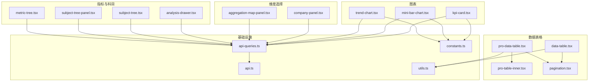
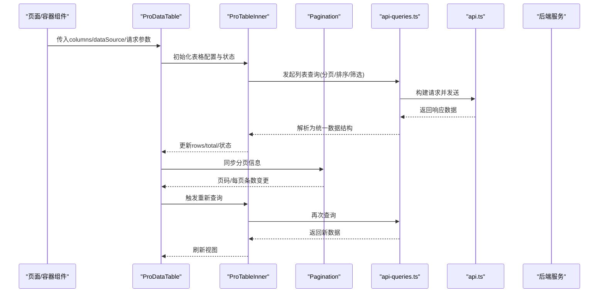
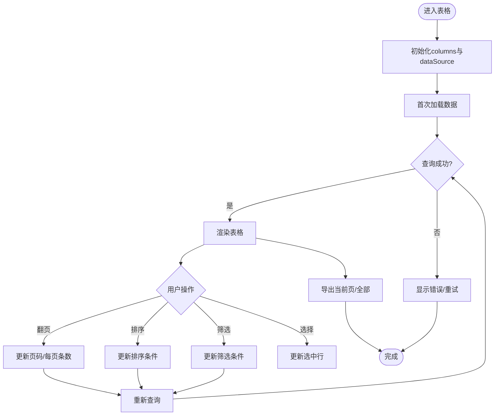
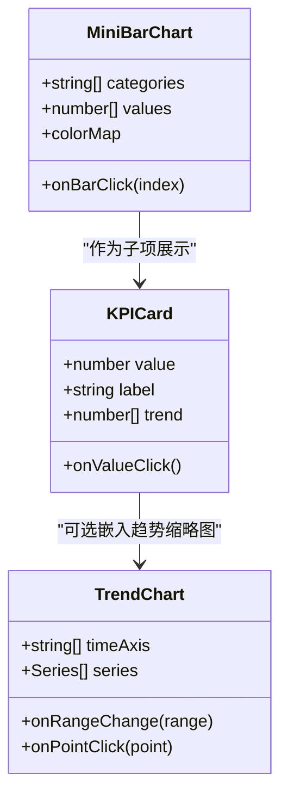
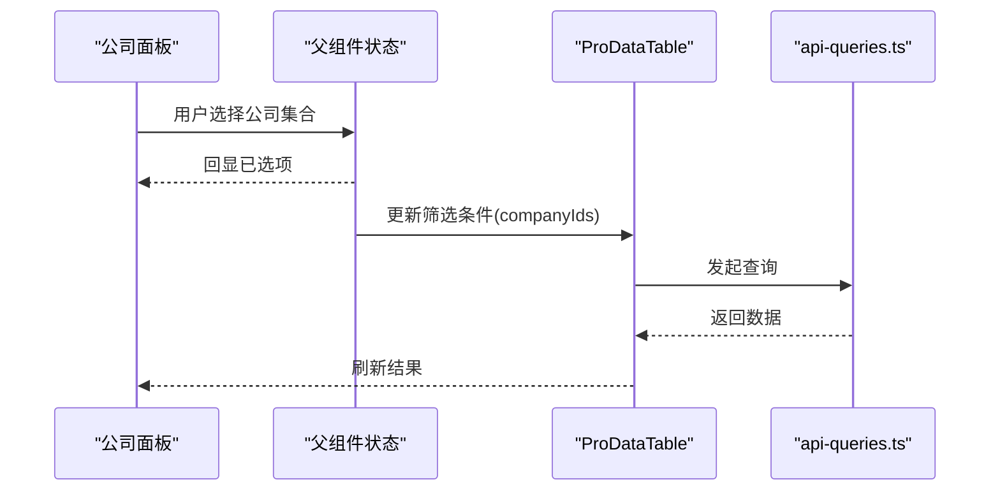
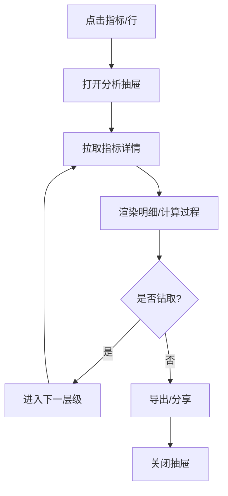
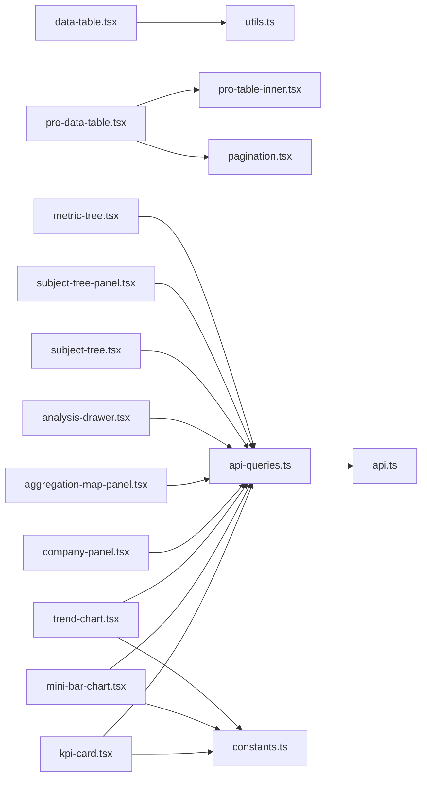

# 业务组件模块

<cite>
**本文引用的文件**
- [data-table.tsx](file://web/src/components/data-table/data-table.tsx)
- [pro-data-table.tsx](file://web/src/components/data-table/pro-data-table.tsx)
- [pro-table-inner.tsx](file://web/src/components/data-table/pro-table-inner.tsx)
- [pagination.tsx](file://web/src/components/data-table/pagination.tsx)
- [kpi-card.tsx](file://web/src/components/charts/kpi-card.tsx)
- [mini-bar-chart.tsx](file://web/src/components/charts/mini-bar-chart.tsx)
- [trend-chart.tsx](file://web/src/components/charts/trend-chart.tsx)
- [company-panel.tsx](file://web/src/components/dimension/company-panel.tsx)
- [aggregation-map-panel.tsx](file://web/src/components/dimension/aggregation-map-panel.tsx)
- [analysis-drawer.tsx](file://web/src/components/indicators/analysis-drawer.tsx)
- [subject-tree.tsx](file://web/src/components/subject-tree/subject-tree.tsx)
- [subject-tree-panel.tsx](file://web/src/components/subject-tree/subject-tree-panel.tsx)
- [metric-tree.tsx](file://web/src/components/subject-tree/metric-tree.tsx)
- [api-queries.ts](file://web/src/hooks/api-queries.ts)
- [api.ts](file://web/src/lib/api.ts)
- [constants.ts](file://web/src/lib/constants.ts)
- [utils.ts](file://web/src/lib/utils.ts)
</cite>

## 目录
1. [简介](#简介)
2. [项目结构](#项目结构)
3. [核心组件](#核心组件)
4. [架构总览](#架构总览)
5. [详细组件分析](#详细组件分析)
6. [依赖关系分析](#依赖关系分析)
7. [性能考量](#性能考量)
8. [故障排查指南](#故障排查指南)
9. [结论](#结论)
10. [附录](#附录)

## 简介
本文件面向FY200项目的业务组件模块，聚焦以下能力：
- 数据表格组件（Data-Table、ProDataTable）的高级功能：分页、排序、筛选、批量操作与导出。
- 图表组件（KPI卡片、迷你柱状图、趋势图）的数据绑定与交互逻辑。
- 维度选择组件（公司面板、聚合映射面板）的业务逻辑与用户交互。
- 指标分析抽屉与科目树组件的业务场景与实现方式。
- 组件间数据传递机制、状态管理策略与错误处理模式。
- 实际业务场景的使用示例与集成指南。

## 项目结构
业务组件位于前端 web 目录的 src/components 下，按功能域划分：
- data-table：通用与增强型数据表格
- charts：KPI卡片、迷你柱状图、趋势图
- dimension：公司面板、聚合映射面板
- indicators：指标分析抽屉
- subject-tree：科目树与度量树
- ui：基础UI原子组件
- hooks 与 lib：API查询封装、常量、工具函数等

**图示来源**
- [data-table.tsx](file://web/src/components/data-table/data-table.tsx)
- [pro-data-table.tsx](file://web/src/components/data-table/pro-data-table.tsx)
- [pro-table-inner.tsx](file://web/src/components/data-table/pro-table-inner.tsx)
- [pagination.tsx](file://web/src/components/data-table/pagination.tsx)
- [kpi-card.tsx](file://web/src/components/charts/kpi-card.tsx)
- [mini-bar-chart.tsx](file://web/src/components/charts/mini-bar-chart.tsx)
- [trend-chart.tsx](file://web/src/components/charts/trend-chart.tsx)
- [company-panel.tsx](file://web/src/components/dimension/company-panel.tsx)
- [aggregation-map-panel.tsx](file://web/src/components/dimension/aggregation-map-panel.tsx)
- [analysis-drawer.tsx](file://web/src/components/indicators/analysis-drawer.tsx)
- [subject-tree.tsx](file://web/src/components/subject-tree/subject-tree.tsx)
- [subject-tree-panel.tsx](file://web/src/components/subject-tree/subject-tree-panel.tsx)
- [metric-tree.tsx](file://web/src/components/subject-tree/metric-tree.tsx)
- [api-queries.ts](file://web/src/hooks/api-queries.ts)
- [api.ts](file://web/src/lib/api.ts)
- [constants.ts](file://web/src/lib/constants.ts)
- [utils.ts](file://web/src/lib/utils.ts)

**章节来源**
- [data-table.tsx](file://web/src/components/data-table/data-table.tsx)
- [pro-data-table.tsx](file://web/src/components/data-table/pro-data-table.tsx)
- [pro-table-inner.tsx](file://web/src/components/data-table/pro-table-inner.tsx)
- [pagination.tsx](file://web/src/components/data-table/pagination.tsx)
- [kpi-card.tsx](file://web/src/components/charts/kpi-card.tsx)
- [mini-bar-chart.tsx](file://web/src/components/charts/mini-bar-chart.tsx)
- [trend-chart.tsx](file://web/src/components/charts/trend-chart.tsx)
- [company-panel.tsx](file://web/src/components/dimension/company-panel.tsx)
- [aggregation-map-panel.tsx](file://web/src/components/dimension/aggregation-map-panel.tsx)
- [analysis-drawer.tsx](file://web/src/components/indicators/analysis-drawer.tsx)
- [subject-tree.tsx](file://web/src/components/subject-tree/subject-tree.tsx)
- [subject-tree-panel.tsx](file://web/src/components/subject-tree/subject-tree-panel.tsx)
- [metric-tree.tsx](file://web/src/components/subject-tree/metric-tree.tsx)
- [api-queries.ts](file://web/src/hooks/api-queries.ts)
- [api.ts](file://web/src/lib/api.ts)
- [constants.ts](file://web/src/lib/constants.ts)
- [utils.ts](file://web/src/lib/utils.ts)

## 核心组件
- Data-Table：轻量级表格，支持列定义、行渲染、基础事件回调。
- ProDataTable：在Data-Table基础上扩展分页、排序、筛选、批量选择、导出等高级能力。
- Pagination：分页控件，提供页码切换、每页条数设置、跳转等交互。
- KPI卡片：展示关键指标数值、同比/环比、趋势缩略图。
- 迷你柱状图：用于局部数据分布或对比。
- 趋势图：时间序列趋势展示，支持缩放与交互。
- 公司面板：公司维度选择、多选、搜索、全选/反选。
- 聚合映射面板：将维度值映射到聚合规则（如求和、平均）。
- 指标分析抽屉：侧边抽屉，承载指标明细、钻取、计算过程与结果。
- 科目树/度量树：层级化科目/度量选择与过滤，支持展开/折叠、勾选。

**章节来源**
- [data-table.tsx](file://web/src/components/data-table/data-table.tsx)
- [pro-data-table.tsx](file://web/src/components/data-table/pro-data-table.tsx)
- [pro-table-inner.tsx](file://web/src/components/data-table/pro-table-inner.tsx)
- [pagination.tsx](file://web/src/components/data-table/pagination.tsx)
- [kpi-card.tsx](file://web/src/components/charts/kpi-card.tsx)
- [mini-bar-chart.tsx](file://web/src/components/charts/mini-bar-chart.tsx)
- [trend-chart.tsx](file://web/src/components/charts/trend-chart.tsx)
- [company-panel.tsx](file://web/src/components/dimension/company-panel.tsx)
- [aggregation-map-panel.tsx](file://web/src/components/dimension/aggregation-map-panel.tsx)
- [analysis-drawer.tsx](file://web/src/components/indicators/analysis-drawer.tsx)
- [subject-tree.tsx](file://web/src/components/subject-tree/subject-tree.tsx)
- [subject-tree-panel.tsx](file://web/src/components/subject-tree/subject-tree-panel.tsx)
- [metric-tree.tsx](file://web/src/components/subject-tree/metric-tree.tsx)

## 架构总览
组件通过统一的API查询层获取数据，结合本地状态进行交互；图表与表格共享同一份数据模型，保证一致性。

**图示来源**
- [pro-data-table.tsx](file://web/src/components/data-table/pro-data-table.tsx)
- [pro-table-inner.tsx](file://web/src/components/data-table/pro-table-inner.tsx)
- [pagination.tsx](file://web/src/components/data-table/pagination.tsx)
- [api-queries.ts](file://web/src/hooks/api-queries.ts)
- [api.ts](file://web/src/lib/api.ts)

**章节来源**
- [pro-data-table.tsx](file://web/src/components/data-table/pro-data-table.tsx)
- [pro-table-inner.tsx](file://web/src/components/data-table/pro-table-inner.tsx)
- [pagination.tsx](file://web/src/components/data-table/pagination.tsx)
- [api-queries.ts](file://web/src/hooks/api-queries.ts)
- [api.ts](file://web/src/lib/api.ts)

## 详细组件分析

### 数据表格（Data-Table / ProDataTable）
- 能力边界
  - Data-Table：列定义、单元格渲染、行点击/选中事件、基础样式。
  - ProDataTable：在Data-Table之上增加分页、排序、筛选、批量选择、导出、加载态、错误态。
- 数据流
  - 外部传入columns与dataSource；内部维护当前页、排序条件、筛选条件、选中行集合。
  - 用户交互触发查询参数变化，调用API查询接口，更新rows与total。
- 分页
  - 使用Pagination组件，支持页码切换、每页条数修改、快速跳转。
- 排序与筛选
  - 列头点击触发排序；筛选器输入后防抖触发查询。
- 批量操作
  - 行多选框联动全选；批量按钮启用条件基于选中行数。
- 错误处理
  - 网络异常、空数据、字段缺失等统一提示与降级展示。

**图示来源**
- [data-table.tsx](file://web/src/components/data-table/data-table.tsx)
- [pro-data-table.tsx](file://web/src/components/data-table/pro-data-table.tsx)
- [pro-table-inner.tsx](file://web/src/components/data-table/pro-table-inner.tsx)
- [pagination.tsx](file://web/src/components/data-table/pagination.tsx)

**章节来源**
- [data-table.tsx](file://web/src/components/data-table/data-table.tsx)
- [pro-data-table.tsx](file://web/src/components/data-table/pro-data-table.tsx)
- [pro-table-inner.tsx](file://web/src/components/data-table/pro-table-inner.tsx)
- [pagination.tsx](file://web/src/components/data-table/pagination.tsx)

### 图表组件（KPI卡片、迷你柱状图、趋势图）
- 数据绑定
  - KPI卡片：value、label、同比/环比、趋势数据数组。
  - 迷你柱状图：categories与values对应，支持颜色映射。
  - 趋势图：时间轴与多系列数据，支持缩放与tooltip。
- 交互逻辑
  - 点击KPI可跳转到明细页或打开分析抽屉。
  - 柱状图支持hover高亮、点击筛选。
  - 趋势图支持区域选择、时间范围切换。
- 错误处理
  - 空数据占位、单位格式化、异常值平滑处理。

**图示来源**
- [kpi-card.tsx](file://web/src/components/charts/kpi-card.tsx)
- [mini-bar-chart.tsx](file://web/src/components/charts/mini-bar-chart.tsx)
- [trend-chart.tsx](file://web/src/components/charts/trend-chart.tsx)

**章节来源**
- [kpi-card.tsx](file://web/src/components/charts/kpi-card.tsx)
- [mini-bar-chart.tsx](file://web/src/components/charts/mini-bar-chart.tsx)
- [trend-chart.tsx](file://web/src/components/charts/trend-chart.tsx)

### 维度选择组件（公司面板、聚合映射面板）
- 公司面板
  - 支持搜索、多选、全选/反选、已选计数。
  - 与表格筛选联动，选择后自动刷新数据。
- 聚合映射面板
  - 将维度值映射到聚合规则（如求和、平均、计数）。
  - 支持保存映射模板，便于复用。

**图示来源**
- [company-panel.tsx](file://web/src/components/dimension/company-panel.tsx)
- [aggregation-map-panel.tsx](file://web/src/components/dimension/aggregation-map-panel.tsx)
- [pro-data-table.tsx](file://web/src/components/data-table/pro-data-table.tsx)
- [api-queries.ts](file://web/src/hooks/api-queries.ts)

**章节来源**
- [company-panel.tsx](file://web/src/components/dimension/company-panel.tsx)
- [aggregation-map-panel.tsx](file://web/src/components/dimension/aggregation-map-panel.tsx)

### 指标分析抽屉与科目树
- 指标分析抽屉
  - 从KPI或表格行点击进入，展示指标明细、计算过程、钻取路径。
  - 支持导出PDF/Excel、分享快照。
- 科目树/度量树
  - 层级结构展示科目与度量，支持展开/折叠、勾选过滤。
  - 与表格/图表联动，选择后刷新视图。

**图示来源**
- [analysis-drawer.tsx](file://web/src/components/indicators/analysis-drawer.tsx)
- [subject-tree.tsx](file://web/src/components/subject-tree/subject-tree.tsx)
- [subject-tree-panel.tsx](file://web/src/components/subject-tree/subject-tree-panel.tsx)
- [metric-tree.tsx](file://web/src/components/subject-tree/metric-tree.tsx)

**章节来源**
- [analysis-drawer.tsx](file://web/src/components/indicators/analysis-drawer.tsx)
- [subject-tree.tsx](file://web/src/components/subject-tree/subject-tree.tsx)
- [subject-tree-panel.tsx](file://web/src/components/subject-tree/subject-tree-panel.tsx)
- [metric-tree.tsx](file://web/src/components/subject-tree/metric-tree.tsx)

## 依赖关系分析
- 组件对API层的依赖
  - 所有数据驱动组件通过api-queries.ts统一封装请求，再经由api.ts执行HTTP调用。
- 常量与工具
  - constants.ts提供枚举、默认分页大小、单位换算等。
  - utils.ts提供日期、金额、字符串等常用工具方法。
- 组件耦合度
  - ProDataTable与Pagination强耦合；图表组件相对独立，仅依赖数据格式。
  - 维度选择与表格通过父组件状态松耦合。

**图示来源**
- [data-table.tsx](file://web/src/components/data-table/data-table.tsx)
- [pro-data-table.tsx](file://web/src/components/data-table/pro-data-table.tsx)
- [pro-table-inner.tsx](file://web/src/components/data-table/pro-table-inner.tsx)
- [pagination.tsx](file://web/src/components/data-table/pagination.tsx)
- [kpi-card.tsx](file://web/src/components/charts/kpi-card.tsx)
- [mini-bar-chart.tsx](file://web/src/components/charts/mini-bar-chart.tsx)
- [trend-chart.tsx](file://web/src/components/charts/trend-chart.tsx)
- [company-panel.tsx](file://web/src/components/dimension/company-panel.tsx)
- [aggregation-map-panel.tsx](file://web/src/components/dimension/aggregation-map-panel.tsx)
- [analysis-drawer.tsx](file://web/src/components/indicators/analysis-drawer.tsx)
- [subject-tree.tsx](file://web/src/components/subject-tree/subject-tree.tsx)
- [subject-tree-panel.tsx](file://web/src/components/subject-tree/subject-tree-panel.tsx)
- [metric-tree.tsx](file://web/src/components/subject-tree/metric-tree.tsx)
- [api-queries.ts](file://web/src/hooks/api-queries.ts)
- [api.ts](file://web/src/lib/api.ts)
- [constants.ts](file://web/src/lib/constants.ts)
- [utils.ts](file://web/src/lib/utils.ts)

**章节来源**
- [api-queries.ts](file://web/src/hooks/api-queries.ts)
- [api.ts](file://web/src/lib/api.ts)
- [constants.ts](file://web/src/lib/constants.ts)
- [utils.ts](file://web/src/lib/utils.ts)

## 性能考量
- 分页优先：大数据集务必使用服务端分页，避免一次性加载。
- 防抖与节流：筛选输入与窗口resize使用防抖/节流减少请求。
- 虚拟滚动：当单页数据量较大时考虑虚拟列表。
- 缓存策略：对静态字典（公司、科目）做本地缓存与失效控制。
- 图表优化：大数据趋势图采用降采样与增量渲染。

[本节为通用指导，不直接分析具体文件]

## 故障排查指南
- 常见错误
  - 网络超时/失败：检查api.ts拦截器与重试策略。
  - 数据为空：确认查询参数与后端权限范围。
  - 单位/格式异常：核对constants中的单位换算与格式化函数。
- 定位步骤
  - 打开浏览器开发者工具，查看Network与Console。
  - 在api-queries.ts中打印请求参数与响应结构。
  - 在组件内打印state变化，确认交互链路。
- 恢复策略
  - 提供重试按钮与错误提示。
  - 空数据时展示友好占位与引导操作。

**章节来源**
- [api.ts](file://web/src/lib/api.ts)
- [api-queries.ts](file://web/src/hooks/api-queries.ts)
- [constants.ts](file://web/src/lib/constants.ts)
- [utils.ts](file://web/src/lib/utils.ts)

## 结论
本模块以ProDataTable为核心，结合图表与维度选择组件，构建了完整的数据分析与可视化能力。通过统一的API查询层与清晰的组件职责划分，实现了良好的可扩展性与可维护性。建议在生产环境中强化缓存、错误恢复与性能监控，以提升用户体验与系统稳定性。

[本节为总结性内容，不直接分析具体文件]

## 附录
- 使用示例（集成要点）
  - 表格集成：在页面中引入ProDataTable，传入columns、dataSource与查询函数；配置分页、排序、筛选与批量操作回调。
  - 图表集成：准备符合组件约定的数据格式，绑定value/categories/timeAxis等字段；处理点击事件以联动筛选或跳转。
  - 维度选择：在公司面板中选择公司集合，传递给父组件状态，由父组件更新表格筛选条件并触发查询。
  - 指标分析：从KPI或表格行点击进入分析抽屉，拉取详情并支持钻取与导出。
  - 科目树：在左侧面板展示科目树，勾选后更新查询参数并刷新主视图。

[本节为概念性说明，不直接分析具体文件]