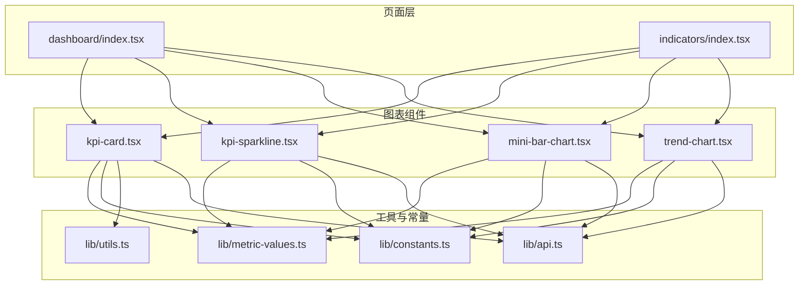
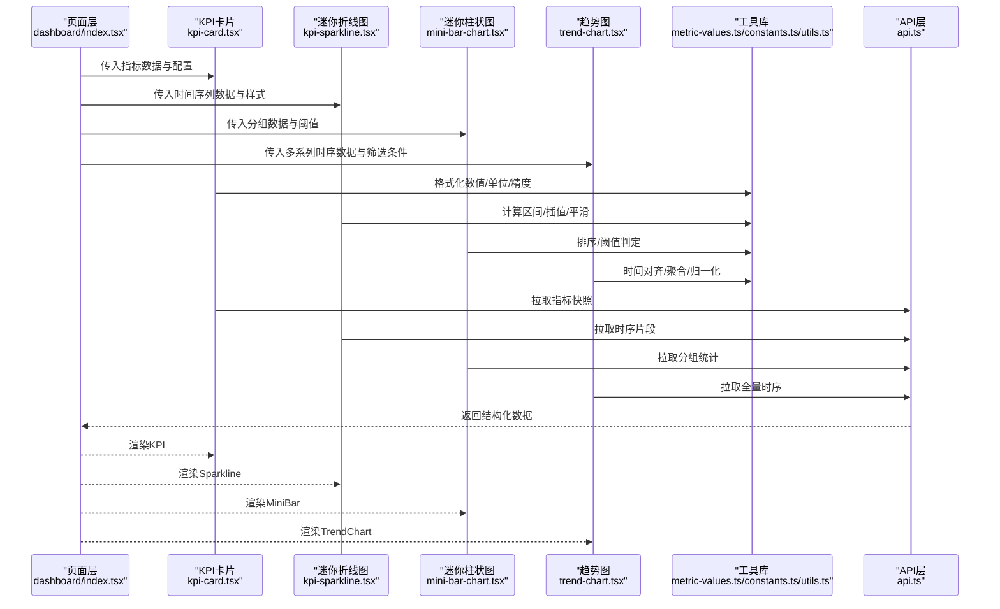
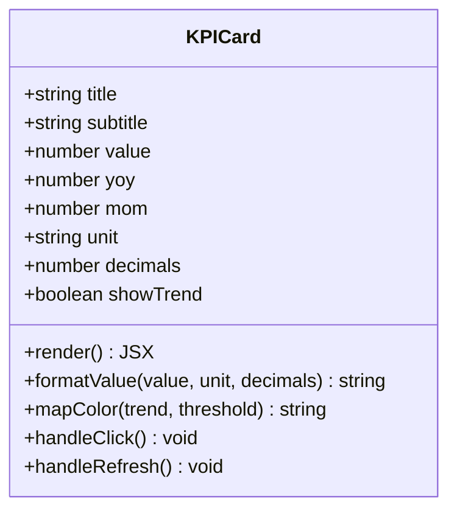
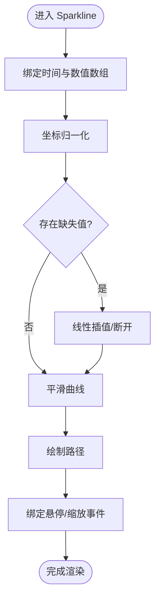
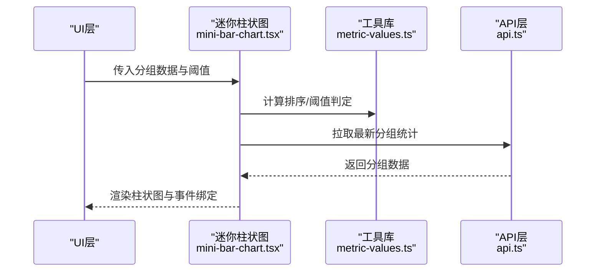
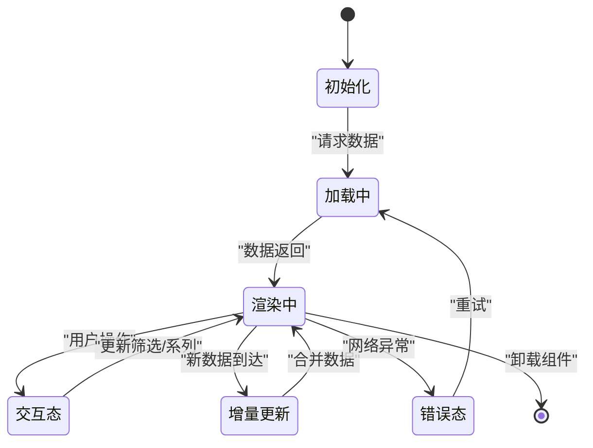
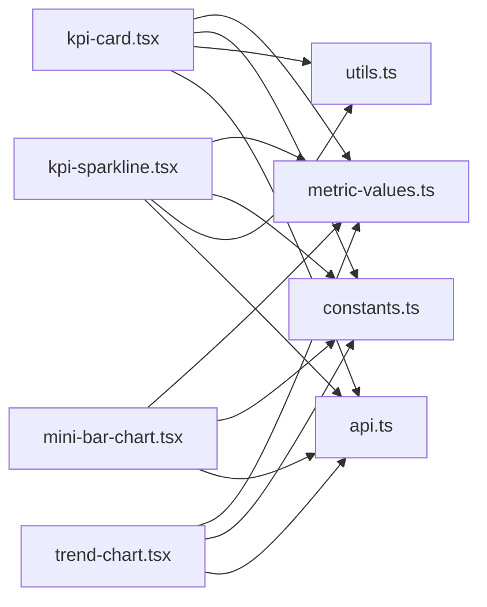

# 图表组件

<cite>
**本文引用的文件**   
- [kpi-card.tsx](file://web/src/components/charts/kpi-card.tsx)
- [kpi-sparkline.tsx](file://web/src/components/charts/kpi-sparkline.tsx)
- [mini-bar-chart.tsx](file://web/src/components/charts/mini-bar-chart.tsx)
- [trend-chart.tsx](file://web/src/components/charts/trend-chart.tsx)
- [dashboard/index.tsx](file://web/src/pages/dashboard/index.tsx)
- [indicators/index.tsx](file://web/src/pages/indicators/index.tsx)
- [api.ts](file://web/src/lib/api.ts)
- [metric-values.ts](file://web/src/lib/metric-values.ts)
- [constants.ts](file://web/src/lib/constants.ts)
- [utils.ts](file://web/src/lib/utils.ts)
</cite>

## 目录
1. [简介](#简介)
2. [项目结构](#项目结构)
3. [核心组件](#核心组件)
4. [架构总览](#架构总览)
5. [详细组件分析](#详细组件分析)
6. [依赖关系分析](#依赖关系分析)
7. [性能考量](#性能考量)
8. [故障排查指南](#故障排查指南)
9. [结论](#结论)
10. [附录](#附录)

## 简介
本文件为 FY200 项目“图表组件”的权威技术文档，聚焦以下目标：
- KPI 卡片组件的数据展示与状态管理（数值格式化、趋势指示、颜色主题）
- 迷你折线图（Sparkline）的实现原理与数据绑定机制
- 迷你柱状图的可视化效果与交互逻辑
- 趋势图组件的时间序列数据处理与动态更新机制
- 配置项、事件处理、响应式适配与性能优化策略
- 业务集成示例与自定义扩展指南

FY200 是浙江壹品慧财年经营数据分析平台，定位“Excel进、看板/报表出”，单位统一为万元/人民币。前端基于 React + TypeScript，图表组件位于 web/src/components/charts 下，通过统一的 API 层与后端服务交互。

## 项目结构
图表相关代码集中在 web/src/components/charts 目录，包含四个核心组件：KPI 卡片、迷你折线图、迷你柱状图、趋势图。页面级使用入口在 dashboard 与 indicators 页面中引入并组合这些组件。

图示来源
- [dashboard/index.tsx](file://web/src/pages/dashboard/index.tsx)
- [indicators/index.tsx](file://web/src/pages/indicators/index.tsx)
- [kpi-card.tsx](file://web/src/components/charts/kpi-card.tsx)
- [kpi-sparkline.tsx](file://web/src/components/charts/kpi-sparkline.tsx)
- [mini-bar-chart.tsx](file://web/src/components/charts/mini-bar-chart.tsx)
- [trend-chart.tsx](file://web/src/components/charts/trend-chart.tsx)
- [metric-values.ts](file://web/src/lib/metric-values.ts)
- [constants.ts](file://web/src/lib/constants.ts)
- [utils.ts](file://web/src/lib/utils.ts)
- [api.ts](file://web/src/lib/api.ts)

章节来源
- [dashboard/index.tsx](file://web/src/pages/dashboard/index.tsx)
- [indicators/index.tsx](file://web/src/pages/indicators/index.tsx)
- [kpi-card.tsx](file://web/src/components/charts/kpi-card.tsx)
- [kpi-sparkline.tsx](file://web/src/components/charts/kpi-sparkline.tsx)
- [mini-bar-chart.tsx](file://web/src/components/charts/mini-bar-chart.tsx)
- [trend-chart.tsx](file://web/src/components/charts/trend-chart.tsx)
- [metric-values.ts](file://web/src/lib/metric-values.ts)
- [constants.ts](file://web/src/lib/constants.ts)
- [utils.ts](file://web/src/lib/utils.ts)
- [api.ts](file://web/src/lib/api.ts)

## 核心组件
- KPI 卡片：负责关键指标的单值展示、同比/环比趋势、单位与精度格式化、主题色映射与状态（加载中/错误/空值）。
- 迷你折线图（Sparkline）：轻量时间序列折线，支持平滑曲线、断点处理、区间缩放与悬停提示。
- 迷你柱状图：短周期或分组数据的柱状展示，支持排序、高亮、点击事件与阈值标记。
- 趋势图：完整时间序列分析，支持多系列叠加、动态更新、轴自适应、交互筛选与导出。

章节来源
- [kpi-card.tsx](file://web/src/components/charts/kpi-card.tsx)
- [kpi-sparkline.tsx](file://web/src/components/charts/kpi-sparkline.tsx)
- [mini-bar-chart.tsx](file://web/src/components/charts/mini-bar-chart.tsx)
- [trend-chart.tsx](file://web/src/components/charts/trend-chart.tsx)

## 架构总览
图表组件采用“页面调用 → 组件渲染 → 工具库格式化 → API 请求”的分层架构。页面层聚合多个图表组件，组件内部通过工具库进行数值格式化与主题映射，并通过 API 层获取时序与指标数据。

图示来源
- [dashboard/index.tsx](file://web/src/pages/dashboard/index.tsx)
- [kpi-card.tsx](file://web/src/components/charts/kpi-card.tsx)
- [kpi-sparkline.tsx](file://web/src/components/charts/kpi-sparkline.tsx)
- [mini-bar-chart.tsx](file://web/src/components/charts/mini-bar-chart.tsx)
- [trend-chart.tsx](file://web/src/components/charts/trend-chart.tsx)
- [metric-values.ts](file://web/src/lib/metric-values.ts)
- [constants.ts](file://web/src/lib/constants.ts)
- [utils.ts](file://web/src/lib/utils.ts)
- [api.ts](file://web/src/lib/api.ts)

## 详细组件分析

### KPI 卡片组件
- 数据展示
  - 主数值：支持万元/元切换、小数位控制、千分位分隔
  - 辅助信息：标题、副标题、更新时间、数据来源说明
  - 趋势指示：同比/环比百分比、方向箭头、涨跌颜色映射
- 状态管理
  - 加载态：骨架屏或占位符
  - 错误态：网络异常、数据缺失、格式错误提示
  - 空值态：显示“暂无数据”或默认占位
- 颜色主题
  - 涨跌色板：上涨绿色、下跌红色、中性灰色
  - 主题模式：浅色/深色自动适配
- 配置选项
  - 数值格式化：单位、精度、是否显示符号
  - 趋势字段：同比/环比字段名、阈值触发颜色
  - 交互：点击跳转、Tooltip 内容模板
- 事件处理
  - onClick：打开详情面板或跳转
  - onRefresh：手动刷新数据
  - onThreshold：超过阈值时回调告警

图示来源
- [kpi-card.tsx](file://web/src/components/charts/kpi-card.tsx)
- [metric-values.ts](file://web/src/lib/metric-values.ts)
- [constants.ts](file://web/src/lib/constants.ts)
- [utils.ts](file://web/src/lib/utils.ts)

章节来源
- [kpi-card.tsx](file://web/src/components/charts/kpi-card.tsx)
- [metric-values.ts](file://web/src/lib/metric-values.ts)
- [constants.ts](file://web/src/lib/constants.ts)
- [utils.ts](file://web/src/lib/utils.ts)

### 迷你折线图（Sparkline）
- 实现原理
  - 基于轻量 SVG/Canvas 绘制，避免重型图表库开销
  - 数据绑定：将时间戳数组与数值数组映射到坐标空间
  - 平滑算法：贝塞尔曲线或 Catmull-Rom 插值
  - 断点处理：缺失值以连线断开或线性插值补齐
- 交互逻辑
  - 悬停提示：显示时间点与对应数值
  - 区间缩放：鼠标拖拽选择时间段
  - 阈值线：可配置上下限参考线
- 性能优化
  - 按需渲染：仅绘制可见区域
  - 数据降采样：大数据集使用 LTTB 或平均采样
  - 防抖重绘：窗口尺寸变化时延迟重算

图示来源
- [kpi-sparkline.tsx](file://web/src/components/charts/kpi-sparkline.tsx)
- [metric-values.ts](file://web/src/lib/metric-values.ts)
- [utils.ts](file://web/src/lib/utils.ts)

章节来源
- [kpi-sparkline.tsx](file://web/src/components/charts/kpi-sparkline.tsx)
- [metric-values.ts](file://web/src/lib/metric-values.ts)
- [utils.ts](file://web/src/lib/utils.ts)

### 迷你柱状图
- 可视化效果
  - 分组柱状：按类别或时间分组展示
  - 阈值标记：高于/低于阈值的柱子高亮
  - 排序：按数值大小升/降序排列
- 交互逻辑
  - 点击柱子：触发详情弹窗或过滤
  - 悬停提示：显示具体数值与占比
  - 多选：按住 Ctrl/Cmd 多选柱子进行对比
- 数据绑定
  - 输入：类别标签数组、数值数组、阈值配置
  - 输出：渲染后的柱状图与交互事件回调

图示来源
- [mini-bar-chart.tsx](file://web/src/components/charts/mini-bar-chart.tsx)
- [metric-values.ts](file://web/src/lib/metric-values.ts)
- [api.ts](file://web/src/lib/api.ts)

章节来源
- [mini-bar-chart.tsx](file://web/src/components/charts/mini-bar-chart.tsx)
- [metric-values.ts](file://web/src/lib/metric-values.ts)
- [api.ts](file://web/src/lib/api.ts)

### 趋势图组件
- 时间序列数据处理
  - 时间对齐：按日/周/月粒度对齐时间戳
  - 聚合策略：求和、平均、最大值、最小值
  - 多系列叠加：不同指标在同一坐标系展示
- 动态更新机制
  - 增量更新：新增数据追加到末尾，保持历史连续性
  - 定时刷新：轮询或 SSE 流式更新
  - 缓存策略：本地缓存最近 N 条记录
- 交互功能
  - 时间范围选择：起止日期筛选
  - 系列切换：显示/隐藏特定指标
  - 导出：PNG/PDF/CSV 导出

图示来源
- [trend-chart.tsx](file://web/src/components/charts/trend-chart.tsx)
- [metric-values.ts](file://web/src/lib/metric-values.ts)
- [api.ts](file://web/src/lib/api.ts)

章节来源
- [trend-chart.tsx](file://web/src/components/charts/trend-chart.tsx)
- [metric-values.ts](file://web/src/lib/metric-values.ts)
- [api.ts](file://web/src/lib/api.ts)

## 依赖关系分析
图表组件依赖工具库进行数值格式化、常量定义与通用工具函数，同时通过 API 层与后端服务通信。页面层作为编排者，将数据与配置注入各组件。

图示来源
- [kpi-card.tsx](file://web/src/components/charts/kpi-card.tsx)
- [kpi-sparkline.tsx](file://web/src/components/charts/kpi-sparkline.tsx)
- [mini-bar-chart.tsx](file://web/src/components/charts/mini-bar-chart.tsx)
- [trend-chart.tsx](file://web/src/components/charts/trend-chart.tsx)
- [metric-values.ts](file://web/src/lib/metric-values.ts)
- [constants.ts](file://web/src/lib/constants.ts)
- [utils.ts](file://web/src/lib/utils.ts)
- [api.ts](file://web/src/lib/api.ts)

章节来源
- [kpi-card.tsx](file://web/src/components/charts/kpi-card.tsx)
- [kpi-sparkline.tsx](file://web/src/components/charts/kpi-sparkline.tsx)
- [mini-bar-chart.tsx](file://web/src/components/charts/mini-bar-chart.tsx)
- [trend-chart.tsx](file://web/src/components/charts/trend-chart.tsx)
- [metric-values.ts](file://web/src/lib/metric-values.ts)
- [constants.ts](file://web/src/lib/constants.ts)
- [utils.ts](file://web/src/lib/utils.ts)
- [api.ts](file://web/src/lib/api.ts)

## 性能考量
- 渲染优化
  - 虚拟滚动：长列表场景下仅渲染可视区域
  - 防抖与节流：频繁更新时限制重绘频率
  - 按需加载：懒加载非首屏图表
- 数据优化
  - 采样与聚合：大数据集预处理减少点数
  - 增量更新：避免全量重绘
  - 缓存策略：LRU 缓存最近查询结果
- 内存管理
  - 及时清理事件监听器与定时器
  - 释放大型对象引用，避免内存泄漏

[本节为通用指导，不直接分析具体文件]

## 故障排查指南
- 常见问题
  - 数值显示异常：检查单位转换与精度设置
  - 趋势颜色错误：确认涨跌阈值与颜色映射配置
  - 折线图断点：验证时间戳连续性与缺失值处理
  - 柱状图排序错乱：检查数值类型与排序键
  - 趋势图更新失败：确认 API 返回结构与时间对齐
- 调试建议
  - 启用控制台日志输出关键中间状态
  - 使用浏览器开发者工具检查网络请求与响应
  - 逐步注释组件逻辑定位问题范围

章节来源
- [kpi-card.tsx](file://web/src/components/charts/kpi-card.tsx)
- [kpi-sparkline.tsx](file://web/src/components/charts/kpi-sparkline.tsx)
- [mini-bar-chart.tsx](file://web/src/components/charts/mini-bar-chart.tsx)
- [trend-chart.tsx](file://web/src/components/charts/trend-chart.tsx)
- [api.ts](file://web/src/lib/api.ts)

## 结论
FY200 图表组件体系以轻量、高效、可扩展为核心设计原则，覆盖从单值指标到复杂时间序列的全场景需求。通过统一的工具库与 API 层，确保数据一致性与可维护性。建议在业务集成中优先复用现有组件，并根据需要扩展配置项与交互逻辑。

[本节为总结性内容，不直接分析具体文件]

## 附录
- 配置选项速查
  - KPI 卡片：单位、精度、趋势字段、颜色阈值、点击行为
  - 迷你折线图：平滑度、断点处理、阈值线、缩放模式
  - 迷你柱状图：分组方式、排序规则、阈值标记、多选模式
  - 趋势图：时间粒度、聚合策略、系列开关、导出格式
- 集成示例
  - 在 dashboard 页面中组合 KPI 卡片与趋势图，展示核心指标与趋势
  - 在 indicators 页面中使用迷你柱状图进行多维度对比分析
- 扩展指南
  - 新增指标类型：在 metric-values.ts 中添加格式化规则
  - 自定义主题：在 constants.ts 中扩展颜色映射
  - 增强交互：在组件内添加事件处理器与状态管理

[本节为补充信息，不直接分析具体文件]