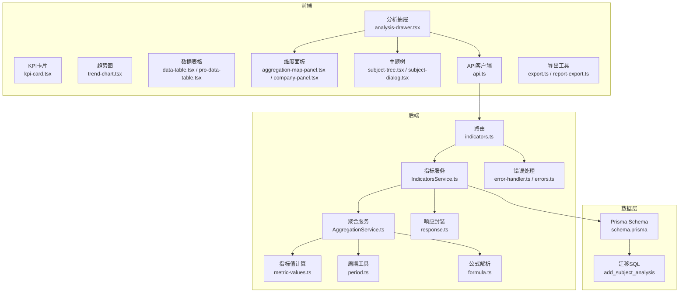
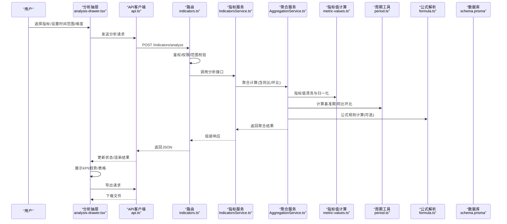
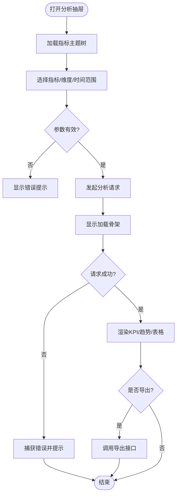
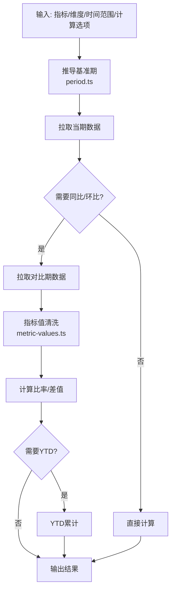
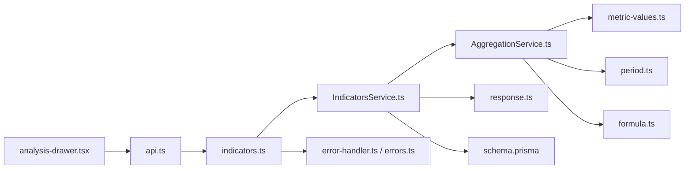

# 指标分析组件

<cite>
**本文引用的文件**   
- [analysis-drawer.tsx](file://web/src/components/indicators/analysis-drawer.tsx)
- [indicators.ts](file://server/src/routes/indicators.ts)
- [IndicatorsService.ts](file://server/src/services/IndicatorsService.ts)
- [AggregationService.ts](file://server/src/services/AggregationService.ts)
- [metric-values.ts](file://server/src/lib/metric-values.ts)
- [period.ts](file://server/src/lib/period.ts)
- [api.ts](file://web/src/lib/api.ts)
- [export.ts](file://web/src/lib/export.ts)
- [report-export.ts](file://web/src/lib/report-export.ts)
- [kpi-card.tsx](file://web/src/components/charts/kpi-card.tsx)
- [trend-chart.tsx](file://web/src/components/charts/trend-chart.tsx)
- [data-table.tsx](file://web/src/components/data-table/data-table.tsx)
- [pro-data-table.tsx](file://web/src/components/data-table/pro-data-table.tsx)
- [subject-tree.tsx](file://web/src/components/subject-tree/subject-tree.tsx)
- [subject-dialog.tsx](file://web/src/components/subject-tree/subject-dialog.tsx)
- [aggregation-map-panel.tsx](file://web/src/components/dimension/aggregation-map-panel.tsx)
- [company-panel.tsx](file://web/src/components/dimension/company-panel.tsx)
- [schema.prisma](file://server/prisma/schema.prisma)
- [20260723120000_add_subject_analysis/migration.sql](file://server/prisma/migrations/20260723120000_add_subject_analysis/migration.sql)
- [env.ts](file://server/src/config/env.ts)
- [auth.ts](file://server/src/middleware/auth.ts)
- [permission.ts](file://server/src/middleware/permission.ts)
- [scope.ts](file://server/src/middleware/scope.ts)
- [error-handler.ts](file://server/src/middleware/error-handler.ts)
- [errors.ts](file://server/src/lib/errors.ts)
- [formula.ts](file://server/src/lib/formula.ts)
- [response.ts](file://server/src/lib/response.ts)
</cite>

## 目录
1. [简介](#简介)
2. [项目结构](#项目结构)
3. [核心组件](#核心组件)
4. [架构总览](#架构总览)
5. [详细组件分析](#详细组件分析)
6. [依赖关系分析](#依赖关系分析)
7. [性能考量](#性能考量)
8. [故障排查指南](#故障排查指南)
9. [结论](#结论)
10. [附录](#附录)

## 简介
本文件面向FY200项目的“指标分析组件”，聚焦分析抽屉（Analysis Drawer）的用户界面与交互流程，覆盖指标选择、参数配置、结果展示、导出等关键能力。同时深入说明指标数据的实时计算与缓存机制，包括同比/环比算法实现；阐述可视化展示与导出方案；并给出状态管理、数据绑定、错误处理与用户反馈机制的设计要点。最后提供财务指标分析场景的使用示例与自定义扩展指南，帮助使用者快速上手与二次开发。

## 项目结构
FY200采用前后端分离架构：前端基于React/Vite，后端基于Express + Prisma + PostgreSQL。指标分析相关的前端组件集中在web/src/components/indicators与charts、data-table等模块；后端服务集中在services与routes，并通过lib中的工具库完成指标值计算、周期处理、公式解析等。数据库通过Prisma迁移定义指标与分析主题相关表结构。

图表来源 
- [analysis-drawer.tsx](file://web/src/components/indicators/analysis-drawer.tsx)
- [kpi-card.tsx](file://web/src/components/charts/kpi-card.tsx)
- [trend-chart.tsx](file://web/src/components/charts/trend-chart.tsx)
- [data-table.tsx](file://web/src/components/data-table/data-table.tsx)
- [pro-data-table.tsx](file://web/src/components/data-table/pro-data-table.tsx)
- [aggregation-map-panel.tsx](file://web/src/components/dimension/aggregation-map-panel.tsx)
- [company-panel.tsx](file://web/src/components/dimension/company-panel.tsx)
- [subject-tree.tsx](file://web/src/components/subject-tree/subject-tree.tsx)
- [subject-dialog.tsx](file://web/src/components/subject-tree/subject-dialog.tsx)
- [api.ts](file://web/src/lib/api.ts)
- [indicators.ts](file://server/src/routes/indicators.ts)
- [IndicatorsService.ts](file://server/src/services/IndicatorsService.ts)
- [AggregationService.ts](file://server/src/services/AggregationService.ts)
- [metric-values.ts](file://server/src/lib/metric-values.ts)
- [period.ts](file://server/src/lib/period.ts)
- [formula.ts](file://server/src/lib/formula.ts)
- [response.ts](file://server/src/lib/response.ts)
- [error-handler.ts](file://server/src/middleware/error-handler.ts)
- [errors.ts](file://server/src/lib/errors.ts)
- [schema.prisma](file://server/prisma/schema.prisma)
- [20260723120000_add_subject_analysis/migration.sql](file://server/prisma/migrations/20260723120000_add_subject_analysis/migration.sql)

章节来源
- [analysis-drawer.tsx](file://web/src/components/indicators/analysis-drawer.tsx)
- [indicators.ts](file://server/src/routes/indicators.ts)
- [IndicatorsService.ts](file://server/src/services/IndicatorsService.ts)
- [AggregationService.ts](file://server/src/services/AggregationService.ts)
- [metric-values.ts](file://server/src/lib/metric-values.ts)
- [period.ts](file://server/src/lib/period.ts)
- [api.ts](file://web/src/lib/api.ts)
- [export.ts](file://web/src/lib/export.ts)
- [report-export.ts](file://web/src/lib/report-export.ts)
- [schema.prisma](file://server/prisma/schema.prisma)
- [20260723120000_add_subject_analysis/migration.sql](file://server/prisma/migrations/20260723120000_add_subject_analysis/migration.sql)

## 核心组件
- 分析抽屉（Analysis Drawer）：承载指标选择、时间范围与维度筛选、计算选项（同比/环比）、结果展示与导出的主入口。
- 指标服务（IndicatorsService）：对外暴露指标查询与分析接口，协调聚合、公式计算与结果组装。
- 聚合服务（AggregationService）：负责按维度、时间粒度进行数据聚合，支持YTD、同比/环比等计算。
- 指标值计算（metric-values）：对原始指标值进行清洗、归一化、空值处理与单位换算。
- 周期工具（period）：提供日期区间、同比/环比基准期推导、时间粒度转换等能力。
- 公式解析（formula）：安全公式引擎，仅允许白名单算子，避免执行任意代码。
- 可视化组件：KPI卡片、趋势图、数据表格用于结果呈现。
- 导出工具：将分析结果导出为Excel或报告文件。

章节来源
- [analysis-drawer.tsx](file://web/src/components/indicators/analysis-drawer.tsx)
- [IndicatorsService.ts](file://server/src/services/IndicatorsService.ts)
- [AggregationService.ts](file://server/src/services/AggregationService.ts)
- [metric-values.ts](file://server/src/lib/metric-values.ts)
- [period.ts](file://server/src/lib/period.ts)
- [formula.ts](file://server/src/lib/formula.ts)
- [kpi-card.tsx](file://web/src/components/charts/kpi-card.tsx)
- [trend-chart.tsx](file://web/src/components/charts/trend-chart.tsx)
- [data-table.tsx](file://web/src/components/data-table/data-table.tsx)
- [pro-data-table.tsx](file://web/src/components/data-table/pro-data-table.tsx)
- [export.ts](file://web/src/lib/export.ts)
- [report-export.ts](file://web/src/lib/report-export.ts)

## 架构总览
分析抽屉发起请求后，后端路由校验权限与范围，调用指标服务与聚合服务完成实时计算，返回结构化结果供前端渲染与导出。

图表来源 
- [analysis-drawer.tsx](file://web/src/components/indicators/analysis-drawer.tsx)
- [api.ts](file://web/src/lib/api.ts)
- [indicators.ts](file://server/src/routes/indicators.ts)
- [IndicatorsService.ts](file://server/src/services/IndicatorsService.ts)
- [AggregationService.ts](file://server/src/services/AggregationService.ts)
- [metric-values.ts](file://server/src/lib/metric-values.ts)
- [period.ts](file://server/src/lib/period.ts)
- [formula.ts](file://server/src/lib/formula.ts)
- [schema.prisma](file://server/prisma/schema.prisma)

## 详细组件分析

### 分析抽屉（Analysis Drawer）
- 功能要点
  - 指标选择：从主题树中选取指标，支持多选与分组。
  - 参数配置：时间范围、维度（公司/组织）、聚合方式（求和/平均/计数等）。
  - 计算选项：开启/关闭同比、环比、YTD等。
  - 结果展示：KPI卡片、趋势折线/柱状图、明细表格。
  - 导出：导出当前视图为Excel或报告。
- 交互流程
  - 打开抽屉 → 加载指标树 → 用户选择 → 触发分析 → 显示加载态 → 渲染结果 → 支持刷新与导出。
- 状态管理
  - 使用本地状态或全局store管理选中指标、时间范围、维度、计算开关、结果数据、错误信息。
  - 数据绑定：表单字段与状态双向绑定，变更即时生效。
- 错误处理与反馈
  - 网络异常、权限不足、参数校验失败时提示用户，并提供重试按钮。
  - 加载态使用骨架屏提升体验。

图表来源 
- [analysis-drawer.tsx](file://web/src/components/indicators/analysis-drawer.tsx)
- [api.ts](file://web/src/lib/api.ts)
- [export.ts](file://web/src/lib/export.ts)
- [report-export.ts](file://web/src/lib/report-export.ts)

章节来源
- [analysis-drawer.tsx](file://web/src/components/indicators/analysis-drawer.tsx)
- [api.ts](file://web/src/lib/api.ts)
- [export.ts](file://web/src/lib/export.ts)
- [report-export.ts](file://web/src/lib/report-export.ts)

### 指标服务（IndicatorsService）
- 职责
  - 接收前端分析请求，校验输入参数。
  - 调用聚合服务进行计算，组装统一响应格式。
  - 处理权限与范围过滤（由中间件完成），返回脱敏后的结果。
- 关键点
  - 支持多指标组合分析。
  - 根据配置启用/禁用同比/环比/YTD。
  - 与公式规则服务协作，对可配置指标进行安全计算。

章节来源
- [IndicatorsService.ts](file://server/src/services/IndicatorsService.ts)
- [indicators.ts](file://server/src/routes/indicators.ts)
- [response.ts](file://server/src/lib/response.ts)

### 聚合服务（AggregationService）
- 职责
  - 按维度与时间粒度聚合数据。
  - 计算同比/环比：基于period工具推导基准期，拉取对比期数据并计算比率。
  - YTD累计：按年累计到当前期间。
- 算法要点
  - 同比：本期值 vs 去年同期值。
  - 环比：本期值 vs 上一期值。
  - 空值处理：缺失值以0或上期值填充，避免除零异常。
  - 精度控制：百分比保留两位小数，金额单位统一为万元。

图表来源 
- [AggregationService.ts](file://server/src/services/AggregationService.ts)
- [period.ts](file://server/src/lib/period.ts)
- [metric-values.ts](file://server/src/lib/metric-values.ts)

章节来源
- [AggregationService.ts](file://server/src/services/AggregationService.ts)
- [period.ts](file://server/src/lib/period.ts)
- [metric-values.ts](file://server/src/lib/metric-values.ts)

### 指标值计算（metric-values）
- 功能
  - 数值清洗：去空格、处理NaN/Infinity、单位换算。
  - 空值策略：默认0、忽略、或继承上期值。
  - 精度控制：金额保留两位小数，百分比格式化。
- 复杂度
  - 线性扫描O(n)，n为指标值数量。
  - 内存占用与数据量成正比，建议分页或流式处理大结果集。

章节来源
- [metric-values.ts](file://server/src/lib/metric-values.ts)

### 周期工具（period）
- 功能
  - 日期区间标准化：起止日期、季度/月度对齐。
  - 基准期推导：同比去年同月、环比上月。
  - 时间粒度转换：日→周→月→季→年。
- 边界处理
  - 非法日期回退到最近有效区间。
  - 跨年/跨闰年计算考虑。

章节来源
- [period.ts](file://server/src/lib/period.ts)

### 公式解析（formula）
- 安全策略
  - 白名单算子：+ - * / ( )，禁止eval与函数调用。
  - 变量替换：仅允许预定义指标名与常量。
- 适用场景
  - 自定义复合指标：如毛利率=（收入-成本）/收入。
- 错误处理
  - 语法错误、未定义变量、除零异常均抛出明确错误。

章节来源
- [formula.ts](file://server/src/lib/formula.ts)

### 可视化组件
- KPI卡片：展示单指标关键值、同比/环比变化、阈值告警。
- 趋势图：折线/柱状图展示时间序列，支持多指标叠加。
- 数据表格：排序、筛选、分页、导出行数据。

章节来源
- [kpi-card.tsx](file://web/src/components/charts/kpi-card.tsx)
- [trend-chart.tsx](file://web/src/components/charts/trend-chart.tsx)
- [data-table.tsx](file://web/src/components/data-table/data-table.tsx)
- [pro-data-table.tsx](file://web/src/components/data-table/pro-data-table.tsx)

### 维度与主题
- 维度面板：公司/组织维度筛选，支持多选与层级展开。
- 主题树：指标分类与层级，支持搜索与快捷选择。

章节来源
- [aggregation-map-panel.tsx](file://web/src/components/dimension/aggregation-map-panel.tsx)
- [company-panel.tsx](file://web/src/components/dimension/company-panel.tsx)
- [subject-tree.tsx](file://web/src/components/subject-tree/subject-tree.tsx)
- [subject-dialog.tsx](file://web/src/components/subject-tree/subject-dialog.tsx)

## 依赖关系分析
- 前端依赖
  - analysis-drawer依赖api、导出工具、可视化组件与维度/主题面板。
- 后端依赖
  - indicators路由依赖IndicatorsService，后者依赖AggregationService、metric-values、period、formula。
  - 中间件链：helmet → cors → express.json → rate-limit → auth → permission → scope → softDelete → audit → Service → Prisma → PostgreSQL。
- 数据依赖
  - schema.prisma定义指标与分析主题表结构，迁移脚本确保一致性。

图表来源 
- [analysis-drawer.tsx](file://web/src/components/indicators/analysis-drawer.tsx)
- [api.ts](file://web/src/lib/api.ts)
- [indicators.ts](file://server/src/routes/indicators.ts)
- [IndicatorsService.ts](file://server/src/services/IndicatorsService.ts)
- [AggregationService.ts](file://server/src/services/AggregationService.ts)
- [metric-values.ts](file://server/src/lib/metric-values.ts)
- [period.ts](file://server/src/lib/period.ts)
- [formula.ts](file://server/src/lib/formula.ts)
- [response.ts](file://server/src/lib/response.ts)
- [error-handler.ts](file://server/src/middleware/error-handler.ts)
- [errors.ts](file://server/src/lib/errors.ts)
- [schema.prisma](file://server/prisma/schema.prisma)

章节来源
- [indicators.ts](file://server/src/routes/indicators.ts)
- [IndicatorsService.ts](file://server/src/services/IndicatorsService.ts)
- [AggregationService.ts](file://server/src/services/AggregationService.ts)
- [schema.prisma](file://server/prisma/schema.prisma)

## 性能考量
- 实时计算
  - 同比/环比不存库，按需计算，减少存储压力但增加CPU开销。
  - 建议在热点指标上引入短期缓存（如Redis），TTL按业务设定。
- 聚合优化
  - 按维度与时间粒度建立索引，减少全表扫描。
  - 大数据集下使用分页与增量加载。
- 前端渲染
  - 大量数据表格使用虚拟滚动。
  - 图表按需渲染，避免重复绘制。
- 导出性能
  - 异步生成文件，返回下载链接而非阻塞响应。

[本节为通用指导，无需特定文件引用]

## 故障排查指南
- 常见错误
  - 权限不足：检查JWT与权限中间件配置。
  - 范围过滤失败：确认scope扩展是否正确注入。
  - 公式解析错误：检查白名单算子与变量命名。
  - 除零异常：在指标值计算中增加保护逻辑。
- 定位步骤
  - 查看错误日志与trace-id。
  - 复现请求参数，验证时间范围与维度。
  - 逐步断点：路由 → 服务 → 聚合 → 指标值计算。
- 恢复措施
  - 修正参数或权限配置。
  - 重启服务或清理缓存。

章节来源
- [error-handler.ts](file://server/src/middleware/error-handler.ts)
- [errors.ts](file://server/src/lib/errors.ts)
- [auth.ts](file://server/src/middleware/auth.ts)
- [permission.ts](file://server/src/middleware/permission.ts)
- [scope.ts](file://server/src/middleware/scope.ts)

## 结论
FY200指标分析组件以分析抽屉为核心入口，结合后端实时计算与可视化展示，满足财务指标分析的灵活性与准确性需求。通过安全的公式解析、严格的权限与范围控制、以及完善的错误处理与用户反馈，提供了稳定可靠的分析体验。建议在生产环境引入缓存与索引优化，进一步提升性能与可扩展性。

[本节为总结，无需特定文件引用]

## 附录

### 使用示例（财务指标分析）
- 场景：利润表分析
  - 选择指标：营业收入、营业成本、净利润。
  - 时间范围：近12个月。
  - 维度：公司/事业部。
  - 计算选项：开启同比、环比、YTD。
  - 结果：KPI卡片展示关键值与变化率，趋势图展示月度走势，表格提供明细。
  - 导出：导出Excel包含所有图表与表格数据。

[本节为概念性示例，无需特定文件引用]

### 自定义扩展指南
- 新增指标
  - 在schema.prisma中添加指标定义与关联表。
  - 在IndicatorsService中注册新指标的计算逻辑。
  - 在前端主题树中补充指标分类与选择项。
- 新增维度
  - 在维度面板中扩展筛选器，支持新的组织或产品维度。
  - 在后端scope中注入新的范围过滤条件。
- 自定义公式
  - 在formula中扩展白名单算子与变量映射。
  - 在AggregationService中集成公式计算步骤。

章节来源
- [schema.prisma](file://server/prisma/schema.prisma)
- [20260723120000_add_subject_analysis/migration.sql](file://server/prisma/migrations/20260723120000_add_subject_analysis/migration.sql)
- [IndicatorsService.ts](file://server/src/services/IndicatorsService.ts)
- [AggregationService.ts](file://server/src/services/AggregationService.ts)
- [formula.ts](file://server/src/lib/formula.ts)
- [scope.ts](file://server/src/middleware/scope.ts)