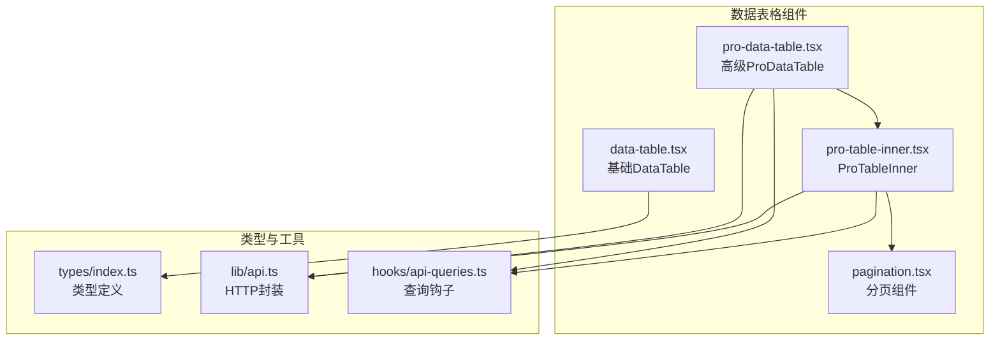
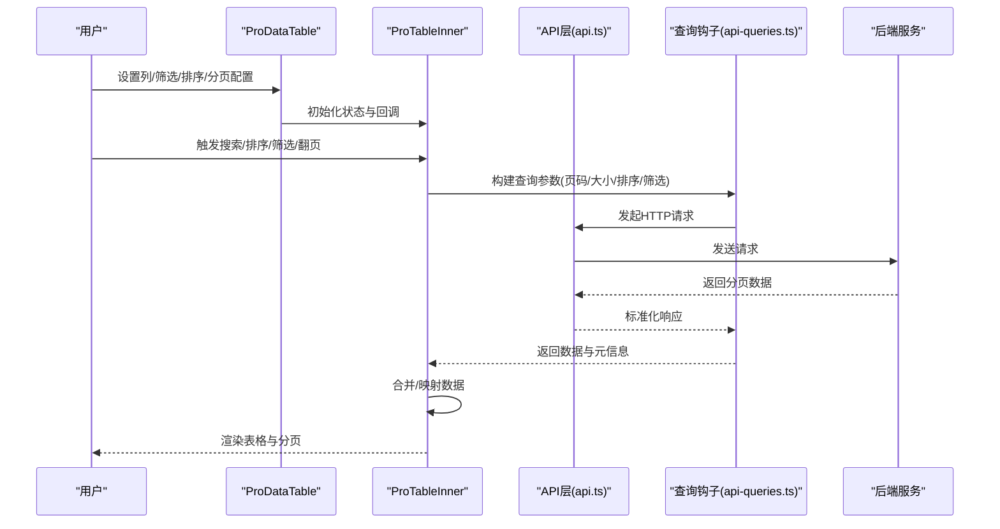
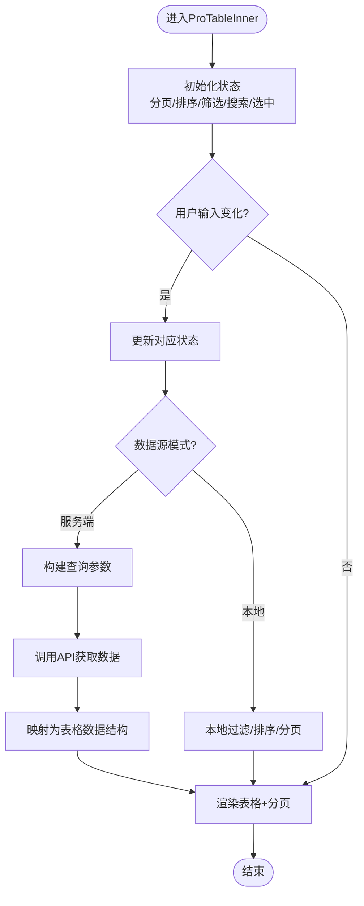
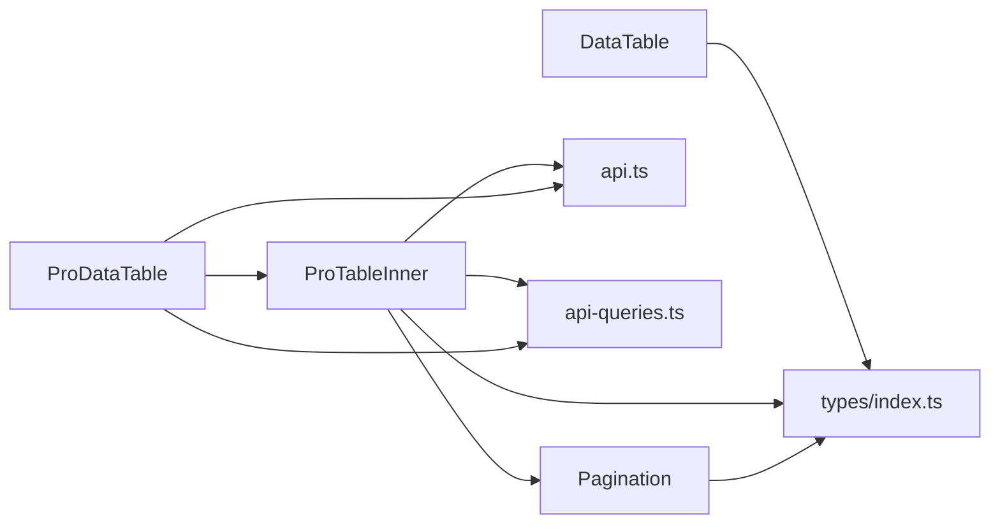

# 数据表格组件

<cite>
**本文引用的文件**   
- [data-table.tsx](file://web/src/components/data-table/data-table.tsx)
- [pro-data-table.tsx](file://web/src/components/data-table/pro-data-table.tsx)
- [pro-table-inner.tsx](file://web/src/components/data-table/pro-table-inner.tsx)
- [pagination.tsx](file://web/src/components/data-table/pagination.tsx)
- [api.ts](file://web/src/lib/api.ts)
- [api-queries.ts](file://web/src/hooks/api-queries.ts)
- [index.ts](file://web/src/types/index.ts)
- [data-table.test.tsx](file://web/src/components/data-table/__tests__/data-table.test.tsx)
</cite>

## 目录
1. [简介](#简介)
2. [项目结构](#项目结构)
3. [核心组件](#核心组件)
4. [架构总览](#架构总览)
5. [详细组件分析](#详细组件分析)
6. [依赖关系分析](#依赖关系分析)
7. [性能考量](#性能考量)
8. [故障排查指南](#故障排查指南)
9. [结论](#结论)
10. [附录](#附录)

## 简介
本文件面向FY200项目的数据表格组件，系统性阐述基础DataTable与高级ProDataTable的实现原理与使用方式，重点覆盖分页、排序、筛选、批量操作等能力；深入解析ProTableInner的内部机制与数据流；给出分页组件的自定义配置与性能优化策略；提供列定义、单元格渲染、行选择、搜索过滤等API说明与示例；并总结与后端API集成的最佳实践和错误处理模式。

## 项目结构
数据表格相关代码位于前端模块 web/src/components/data-table 下，包含基础表格、高级表格、内部实现与分页组件，以及测试用例。类型定义与API调用分别位于 types 与 hooks/lib 中。

图表来源
- [data-table.tsx](file://web/src/components/data-table/data-table.tsx)
- [pro-data-table.tsx](file://web/src/components/data-table/pro-data-table.tsx)
- [pro-table-inner.tsx](file://web/src/components/data-table/pro-table-inner.tsx)
- [pagination.tsx](file://web/src/components/data-table/pagination.tsx)
- [api.ts](file://web/src/lib/api.ts)
- [api-queries.ts](file://web/src/hooks/api-queries.ts)
- [index.ts](file://web/src/types/index.ts)

章节来源
- [data-table.tsx](file://web/src/components/data-table/data-table.tsx)
- [pro-data-table.tsx](file://web/src/components/data-table/pro-data-table.tsx)
- [pro-table-inner.tsx](file://web/src/components/data-table/pro-table-inner.tsx)
- [pagination.tsx](file://web/src/components/data-table/pagination.tsx)
- [api.ts](file://web/src/lib/api.ts)
- [api-queries.ts](file://web/src/hooks/api-queries.ts)
- [index.ts](file://web/src/types/index.ts)

## 核心组件
- DataTable：轻量级表格，支持列渲染、基本交互（如点击、展开），适合静态或简单列表场景。
- ProDataTable：高级表格，内置分页、排序、筛选、搜索、批量选择、导出等能力，通过组合ProTableInner与分页组件完成复杂数据展示。
- ProTableInner：核心数据处理与渲染引擎，负责状态管理（页码、排序、筛选、搜索）、数据拉取、本地/服务端混合处理、事件派发。
- Pagination：可配置的分页控件，支持页大小切换、跳转、受控与非受控模式。

章节来源
- [data-table.tsx](file://web/src/components/data-table/data-table.tsx)
- [pro-data-table.tsx](file://web/src/components/data-table/pro-data-table.tsx)
- [pro-table-inner.tsx](file://web/src/components/data-table/pro-table-inner.tsx)
- [pagination.tsx](file://web/src/components/data-table/pagination.tsx)

## 架构总览
ProDataTable作为门面组件，将用户输入（搜索、排序、筛选、分页）转化为查询参数，交由ProTableInner统一处理。ProTableInner根据配置决定数据源（本地数组或服务端接口），在需要时调用API获取数据，并将结果映射为表格所需的数据结构。Pagination提供分页UI并与ProTableInner双向绑定。

图表来源
- [pro-data-table.tsx](file://web/src/components/data-table/pro-data-table.tsx)
- [pro-table-inner.tsx](file://web/src/components/data-table/pro-table-inner.tsx)
- [api.ts](file://web/src/lib/api.ts)
- [api-queries.ts](file://web/src/hooks/api-queries.ts)

## 详细组件分析

### DataTable（基础表格）
- 职责：渲染列与行，支持单元格自定义渲染、行点击、选中态扩展。
- 关键能力：
  - 列定义：字段名、标题、宽度、对齐、格式化函数、是否可排序。
  - 行渲染：支持插槽式单元格渲染，便于嵌入按钮、标签、进度条等。
  - 事件回调：行点击、双击、右键菜单等。
- 适用场景：静态数据、小规模列表、无需分页/筛选的场景。

章节来源
- [data-table.tsx](file://web/src/components/data-table/data-table.tsx)

### ProDataTable（高级表格）
- 职责：聚合ProTableInner与Pagination，暴露统一的API用于复杂数据展示。
- 关键能力：
  - 分页：服务端分页优先，支持页大小切换、跳转、受控/非受控。
  - 排序：单列/多列排序，支持升序/降序/重置。
  - 筛选：按列条件筛选，支持文本模糊、数值范围、枚举多选。
  - 搜索：全局关键词搜索，命中高亮可选。
  - 批量操作：选择行后执行批量删除、导出、状态变更等。
  - 导出：基于当前筛选/排序导出数据（CSV/Excel）。
- 与后端集成：默认通过api-queries封装的请求钩子拉取数据，支持自定义数据源。

章节来源
- [pro-data-table.tsx](file://web/src/components/data-table/pro-data-table.tsx)

### ProTableInner（内部实现机制与数据流）
- 状态管理：
  - 分页：current、pageSize、total。
  - 排序：sortField、sortOrder、multiSort。
  - 筛选：filters（按列键值对存储）。
  - 搜索：keyword。
  - 选中：selectedRowKeys。
  - 加载：loading、error。
- 数据流：
  - 输入变化（搜索/排序/筛选/翻页）→ 更新状态 → 触发数据拉取。
  - 若启用服务端模式：组装查询参数 → 调用API → 接收分页数据 → 映射为表格数据。
  - 若启用本地模式：对内存数据进行过滤、排序、分页。
- 事件派发：
  - onRowClick/onRowDoubleClick：行交互。
  - onSelectChange：选中行变化。
  - onFilterChange/onSortChange/onSearchChange：查询条件变化。
  - onExport：导出回调。
- 性能优化：
  - 防抖搜索与筛选变更。
  - 虚拟滚动（大数据量可选）。
  - 增量更新与选择性重渲染。
  - 缓存最近一次查询结果，避免重复请求。

图表来源
- [pro-table-inner.tsx](file://web/src/components/data-table/pro-table-inner.tsx)

章节来源
- [pro-table-inner.tsx](file://web/src/components/data-table/pro-table-inner.tsx)

### Pagination（分页组件）
- 配置项：
  - total：总记录数。
  - current/page：当前页（受控/非受控）。
  - pageSize：每页条数。
  - showSizeChanger：是否显示页大小切换。
  - showQuickJumper：是否显示快速跳转。
  - onChange/onPageSizeChange：分页变化回调。
- 行为：
  - 与ProTableInner双向绑定，确保页码与数据同步。
  - 支持边界校验与自动修正。
  - 无障碍支持与键盘导航。

章节来源
- [pagination.tsx](file://web/src/components/data-table/pagination.tsx)

## 依赖关系分析
- ProDataTable依赖ProTableInner与Pagination。
- ProTableInner依赖API层与查询钩子进行数据获取，同时依赖类型定义保证数据结构一致性。
- DataTable独立性强，主要依赖类型定义与通用UI组件。

图表来源
- [pro-data-table.tsx](file://web/src/components/data-table/pro-data-table.tsx)
- [pro-table-inner.tsx](file://web/src/components/data-table/pro-table-inner.tsx)
- [pagination.tsx](file://web/src/components/data-table/pagination.tsx)
- [api.ts](file://web/src/lib/api.ts)
- [api-queries.ts](file://web/src/hooks/api-queries.ts)
- [index.ts](file://web/src/types/index.ts)

章节来源
- [pro-data-table.tsx](file://web/src/components/data-table/pro-data-table.tsx)
- [pro-table-inner.tsx](file://web/src/components/data-table/pro-table-inner.tsx)
- [pagination.tsx](file://web/src/components/data-table/pagination.tsx)
- [api.ts](file://web/src/lib/api.ts)
- [api-queries.ts](file://web/src/hooks/api-queries.ts)
- [index.ts](file://web/src/types/index.ts)

## 性能考量
- 服务端分页优先：大数据量务必开启服务端分页，减少首屏渲染压力。
- 防抖与节流：搜索与筛选变更使用防抖，避免频繁请求。
- 选择性渲染：仅渲染可见区域，必要时启用虚拟滚动。
- 缓存策略：缓存最近查询结果，相同参数直接复用。
- 增量更新：只更新变化的列或行，降低重渲染成本。
- 导出优化：大表导出采用流式或后台任务，避免阻塞主线程。

[本节为通用指导，不直接分析具体文件]

## 故障排查指南
- 数据为空：检查API响应结构与类型定义是否一致；确认分页参数是否正确传递。
- 排序异常：确认后端排序字段映射；检查多列排序优先级。
- 筛选无效：核对筛选条件格式；确认服务端是否支持该筛选类型。
- 分页不同步：检查受控/非受控模式混用；确认onChange回调是否更新状态。
- 批量操作失败：检查选中行keys有效性；确认权限与后端接口支持。
- 导出失败：检查数据量与浏览器限制；必要时改用服务端导出。

章节来源
- [data-table.test.tsx](file://web/src/components/data-table/__tests__/data-table.test.tsx)

## 结论
ProDataTable与ProTableInner共同构成了FY200项目中强大而灵活的数据表格解决方案。通过清晰的状态管理与数据流设计，实现了分页、排序、筛选、搜索、批量操作与导出的完整能力。结合合理的性能优化策略与后端API集成模式，可在大规模数据场景下保持流畅体验。建议在实际使用中遵循本文的最佳实践，确保稳定性与可维护性。

[本节为总结性内容，不直接分析具体文件]

## 附录

### API与使用示例（概念性）
- 列定义：包含字段名、标题、宽度、对齐、格式化函数、是否可排序、是否可筛选等。
- 单元格渲染：通过插槽或渲染函数自定义单元格内容，支持富文本、图标、按钮等。
- 行选择：启用rowSelection，支持单选/多选、全选、禁用特定行。
- 搜索过滤：支持全局搜索与列级筛选，可配置匹配规则与高亮。
- 分页配置：设置total、pageSize、current，监听onChange与onPageSizeChange。
- 批量操作：在选中行变化时触发回调，执行删除、导出、状态变更等操作。
- 与后端集成：通过api-queries封装请求钩子，统一处理错误与加载状态。

[本节为概念性说明，不直接分析具体文件]