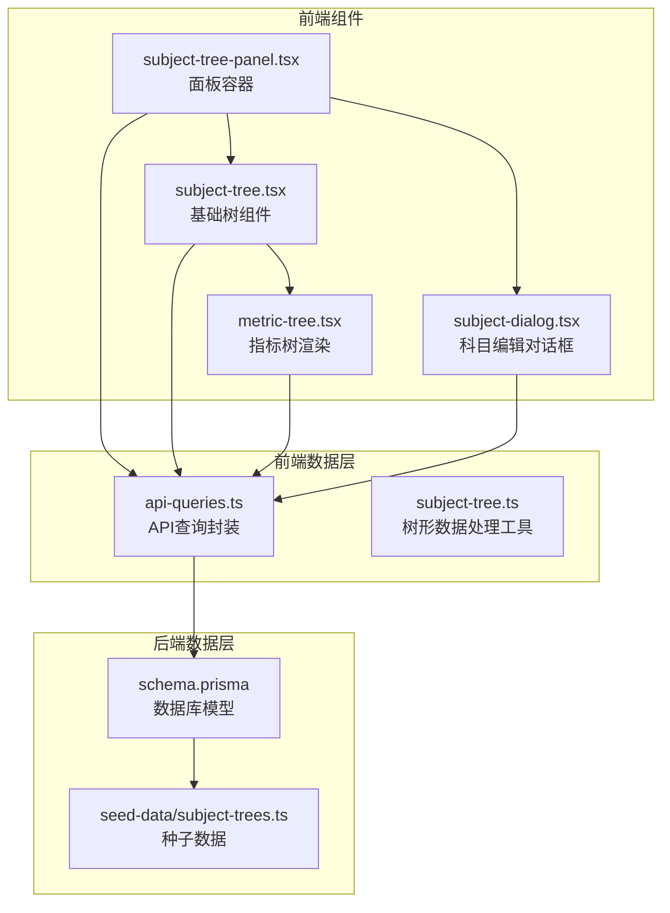
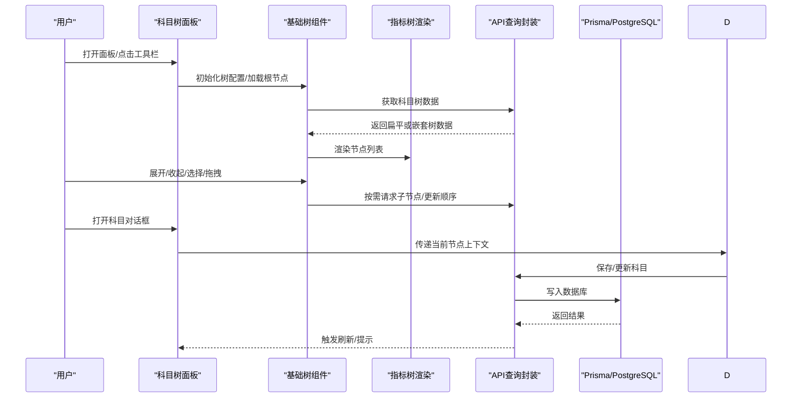
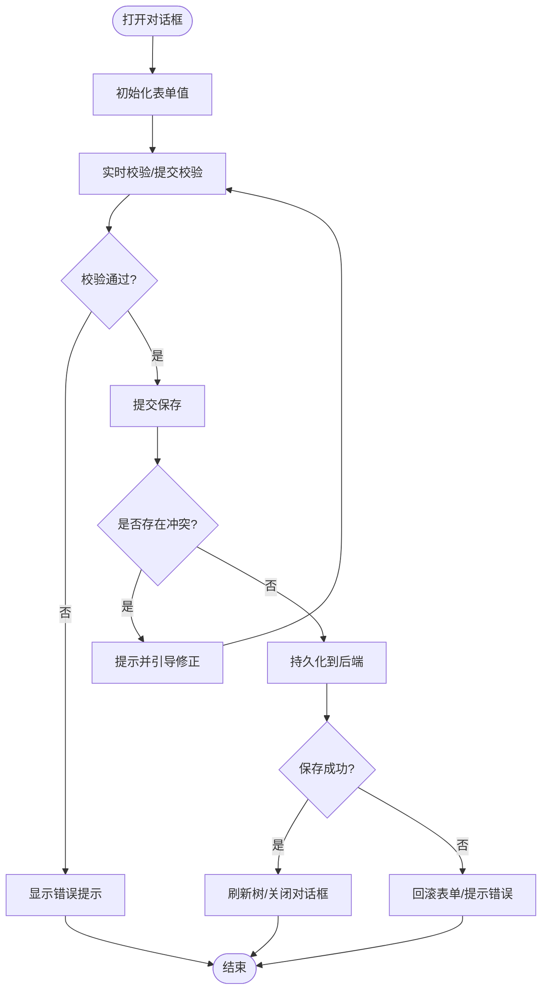
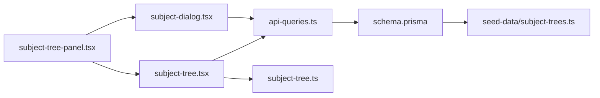

# 科目树组件

<cite>
**本文引用的文件**   
- [subject-tree.tsx](file://web/src/components/subject-tree/subject-tree.tsx)
- [metric-tree.tsx](file://web/src/components/subject-tree/metric-tree.tsx)
- [subject-dialog.tsx](file://web/src/components/subject-tree/subject-dialog.tsx)
- [subject-tree-panel.tsx](file://web/src/components/subject-tree/subject-tree-panel.tsx)
- [api-queries.ts](file://web/src/hooks/api-queries.ts)
- [subject-tree.ts](file://web/src/lib/subject-tree.ts)
- [schema.prisma](file://server/prisma/schema.prisma)
- [seed-data/subject-trees.ts](file://server/prisma/seed-data/subject-trees.ts)
</cite>

## 目录
1. [简介](#简介)
2. [项目结构](#项目结构)
3. [核心组件](#核心组件)
4. [架构总览](#架构总览)
5. [详细组件分析](#详细组件分析)
6. [依赖关系分析](#依赖关系分析)
7. [性能与内存优化](#性能与内存优化)
8. [故障排查指南](#故障排查指南)
9. [结论](#结论)
10. [附录：使用示例与定制指南](#附录使用示例与定制指南)

## 简介
本文件面向FY200项目的“科目树”功能，聚焦前端科目树组件的层级展示、交互逻辑（展开收起、拖拽排序、批量操作）、科目对话框的数据编辑与验证机制、面板布局与状态管理，以及基础树组件的核心能力与扩展点。同时覆盖树形数据的加载策略、性能优化与内存管理，并提供财务科目管理场景下的使用示例与定制开发指南。

## 项目结构
科目树相关的前端代码集中在 web/src/components/subject-tree 目录下，包含树渲染、指标树、对话框与面板等模块；数据访问通过 hooks 层封装 API 调用；领域工具函数在 lib/subject-tree.ts 中实现；后端数据模型与种子数据位于 server/prisma 下。

图表来源
- [subject-tree-panel.tsx](file://web/src/components/subject-tree/subject-tree-panel.tsx)
- [subject-tree.tsx](file://web/src/components/subject-tree/subject-tree.tsx)
- [metric-tree.tsx](file://web/src/components/subject-tree/metric-tree.tsx)
- [subject-dialog.tsx](file://web/src/components/subject-tree/subject-dialog.tsx)
- [api-queries.ts](file://web/src/hooks/api-queries.ts)
- [subject-tree.ts](file://web/src/lib/subject-tree.ts)
- [schema.prisma](file://server/prisma/schema.prisma)
- [seed-data/subject-trees.ts](file://server/prisma/seed-data/subject-trees.ts)

章节来源
- [subject-tree-panel.tsx](file://web/src/components/subject-tree/subject-tree-panel.tsx)
- [subject-tree.tsx](file://web/src/components/subject-tree/subject-tree.tsx)
- [metric-tree.tsx](file://web/src/components/subject-tree/metric-tree.tsx)
- [subject-dialog.tsx](file://web/src/components/subject-tree/subject-dialog.tsx)
- [api-queries.ts](file://web/src/hooks/api-queries.ts)
- [subject-tree.ts](file://web/src/lib/subject-tree.ts)
- [schema.prisma](file://server/prisma/schema.prisma)
- [seed-data/subject-trees.ts](file://server/prisma/seed-data/subject-trees.ts)

## 核心组件
- 科目树面板（subject-tree-panel.tsx）：负责整体布局、状态管理、工具栏与批量操作入口，协调树组件与对话框。
- 基础树组件（subject-tree.tsx）：提供节点展开/收起、选择、拖拽排序、懒加载、虚拟滚动等通用能力。
- 指标树渲染（metric-tree.tsx）：将树节点映射为可交互的指标项，支持图标、标签、状态指示与右键菜单。
- 科目对话框（subject-dialog.tsx）：新增/编辑科目表单，内置字段校验、冲突检测、提交与回滚。

章节来源
- [subject-tree-panel.tsx](file://web/src/components/subject-tree/subject-tree-panel.tsx)
- [subject-tree.tsx](file://web/src/components/subject-tree/subject-tree.tsx)
- [metric-tree.tsx](file://web/src/components/subject-tree/metric-tree.tsx)
- [subject-dialog.tsx](file://web/src/components/subject-tree/subject-dialog.tsx)

## 架构总览
下图展示了从用户交互到数据持久化的完整链路，包括树面板、树组件、对话框、API 查询与后端 Prisma 模型的协作。

图表来源
- [subject-tree-panel.tsx](file://web/src/components/subject-tree/subject-tree-panel.tsx)
- [subject-tree.tsx](file://web/src/components/subject-tree/subject-tree.tsx)
- [metric-tree.tsx](file://web/src/components/subject-tree/metric-tree.tsx)
- [subject-dialog.tsx](file://web/src/components/subject-tree/subject-dialog.tsx)
- [api-queries.ts](file://web/src/hooks/api-queries.ts)
- [schema.prisma](file://server/prisma/schema.prisma)

## 详细组件分析

### 科目树面板（subject-tree-panel.tsx）
职责
- 面板布局：左侧树区域、右侧详情/操作区、顶部工具栏（新建、导入、导出、批量删除）。
- 状态管理：选中节点、展开集合、搜索过滤、批量选择集、加载态与错误态。
- 事件编排：转发树的展开/收起、拖拽完成、选择变化到上层处理逻辑。
- 对话框集成：打开新增/编辑对话框，传入父节点与权限信息。

关键交互
- 展开/收起：维护展开集合，避免重复请求。
- 拖拽排序：监听 onDrop，计算目标位置与深度，调用排序接口。
- 批量操作：多选后统一执行删除/移动/复制等操作。

章节来源
- [subject-tree-panel.tsx](file://web/src/components/subject-tree/subject-tree-panel.tsx)

### 基础树组件（subject-tree.tsx）
职责
- 节点渲染：递归渲染父子层级，支持自定义节点内容插槽。
- 交互行为：展开/收起、选择、拖拽排序、键盘导航、右键菜单。
- 数据适配：扁平转树、去重、合并增量更新、缓存命中。
- 性能优化：虚拟滚动、懒加载、防抖搜索、分页/分页式加载。

数据结构与算法
- 扁平转树：O(n log n) 构建索引，按 parent_id 组装层级。
- 拖拽排序：基于插入位置与深度计算，最小化 DOM 重排。
- 懒加载：首次仅加载根节点，展开时按需拉取子节点。

章节来源
- [subject-tree.tsx](file://web/src/components/subject-tree/subject-tree.tsx)
- [subject-tree.ts](file://web/src/lib/subject-tree.ts)

### 指标树渲染（metric-tree.tsx）
职责
- 将树节点映射为指标项，显示名称、编码、类型、状态等元信息。
- 支持图标、颜色标记、状态指示器与快捷操作（编辑、复制、删除）。
- 与基础树组件解耦，专注 UI 表现与局部交互。

章节来源
- [metric-tree.tsx](file://web/src/components/subject-tree/metric-tree.tsx)

### 科目对话框（subject-dialog.tsx）
职责
- 表单编辑：科目名称、编码、上级节点、类型、备注等字段。
- 表单验证：必填、唯一性、格式校验、业务规则（如编码前缀）。
- 冲突处理：同层级编码冲突提示、循环引用检测、软删除恢复确认。
- 数据持久化：提交前本地快照，失败回滚，成功刷新树与选中态。

交互流程

图表来源
- [subject-dialog.tsx](file://web/src/components/subject-tree/subject-dialog.tsx)

章节来源
- [subject-dialog.tsx](file://web/src/components/subject-tree/subject-dialog.tsx)

## 依赖关系分析
- 组件耦合：面板依赖树组件与对话框；树组件依赖 API 查询与工具函数；对话框依赖 API 查询与校验工具。
- 数据流：面板发起加载 → 树组件缓存与渲染 → 对话框编辑 → API 查询 → 后端模型 → 返回结果 → 刷新视图。
- 外部依赖：Prisma 模型定义科目树结构；种子数据用于本地演示。

图表来源
- [subject-tree-panel.tsx](file://web/src/components/subject-tree/subject-tree-panel.tsx)
- [subject-tree.tsx](file://web/src/components/subject-tree/subject-tree.tsx)
- [subject-dialog.tsx](file://web/src/components/subject-tree/subject-dialog.tsx)
- [api-queries.ts](file://web/src/hooks/api-queries.ts)
- [subject-tree.ts](file://web/src/lib/subject-tree.ts)
- [schema.prisma](file://server/prisma/schema.prisma)
- [seed-data/subject-trees.ts](file://server/prisma/seed-data/subject-trees.ts)

章节来源
- [subject-tree-panel.tsx](file://web/src/components/subject-tree/subject-tree-panel.tsx)
- [subject-tree.tsx](file://web/src/components/subject-tree/subject-tree.tsx)
- [subject-dialog.tsx](file://web/src/components/subject-tree/subject-dialog.tsx)
- [api-queries.ts](file://web/src/hooks/api-queries.ts)
- [subject-tree.ts](file://web/src/lib/subject/tree.ts)
- [schema.prisma](file://server/prisma/schema.prisma)
- [seed-data/subject-trees.ts](file://server/prisma/seed-data/subject-trees.ts)

## 性能与内存优化
- 懒加载与分页：仅加载可见与展开节点，减少首屏压力。
- 虚拟滚动：长列表渲染采用虚拟滚动，降低 DOM 节点数量。
- 缓存策略：节点数据按 id 缓存，避免重复请求；合并增量更新。
- 防抖与节流：搜索与拖拽释放事件进行防抖/节流。
- 内存管理：及时清理未使用节点的缓存与订阅；对话框关闭时释放临时状态。

[本节为通用指导，不直接分析具体文件]

## 故障排查指南
常见问题与定位
- 树节点无法展开：检查懒加载接口是否返回子节点；查看缓存键是否正确。
- 拖拽排序无效：确认 onDrop 回调参数与目标节点深度计算；检查后端排序接口权限。
- 对话框校验失败：核对字段校验规则与后端约束；查看冲突检测逻辑。
- 数据不同步：确认提交成功后是否触发刷新；检查缓存失效策略。

排查步骤
- 打开浏览器开发者工具，观察网络请求与响应。
- 在树组件与对话框中添加日志，追踪状态变化。
- 使用种子数据验证基本流程，逐步缩小问题范围。

章节来源
- [subject-tree.tsx](file://web/src/components/subject-tree/subject-tree.tsx)
- [subject-dialog.tsx](file://web/src/components/subject-tree/subject-dialog.tsx)
- [api-queries.ts](file://web/src/hooks/api-queries.ts)

## 结论
科目树组件以面板为核心，结合基础树组件与指标树渲染，提供完整的层级展示与交互能力；对话框负责数据编辑与校验；API 查询与工具函数支撑数据加载与处理。通过懒加载、虚拟滚动与缓存策略，确保在大体量科目树场景下的性能与用户体验。

[本节为总结，不直接分析具体文件]

## 附录：使用示例与定制指南

### 使用示例
- 在页面中引入科目树面板，配置权限与默认展开节点。
- 绑定工具栏事件，实现新建、导入、导出与批量删除。
- 在树组件上监听展开/收起与拖拽完成事件，同步后端状态。
- 打开科目对话框时传入父节点与当前选中节点，完成新增/编辑。

章节来源
- [subject-tree-panel.tsx](file://web/src/components/subject-tree/subject-tree-panel.tsx)
- [subject-tree.tsx](file://web/src/components/subject-tree/subject-tree.tsx)
- [subject-dialog.tsx](file://web/src/components/subject-tree/subject-dialog.tsx)

### 定制开发指南
- 扩展节点内容：在指标树渲染中增加自定义字段与样式。
- 自定义校验规则：在对话框中扩展表单校验与冲突检测。
- 接入新数据源：在 API 查询层封装新的接口调用与缓存策略。
- 性能调优：调整虚拟滚动阈值、缓存大小与懒加载策略。

章节来源
- [metric-tree.tsx](file://web/src/components/subject-tree/metric-tree.tsx)
- [subject-dialog.tsx](file://web/src/components/subject-tree/subject-dialog.tsx)
- [api-queries.ts](file://web/src/hooks/api-queries.ts)
- [subject-tree.ts](file://web/src/lib/subject-tree.ts)