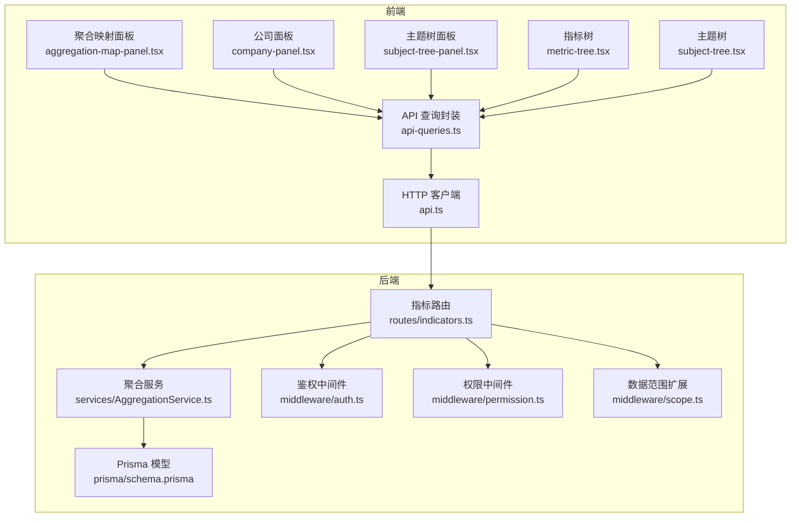
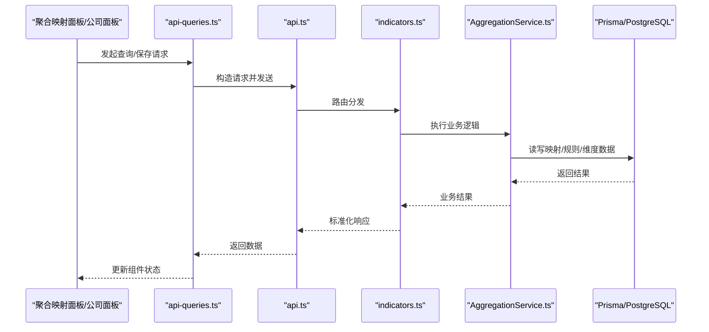
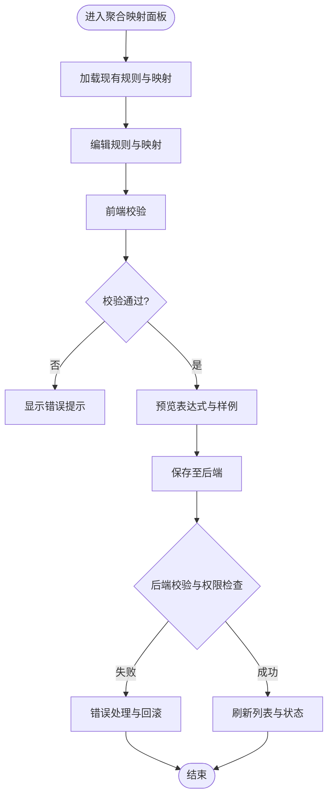
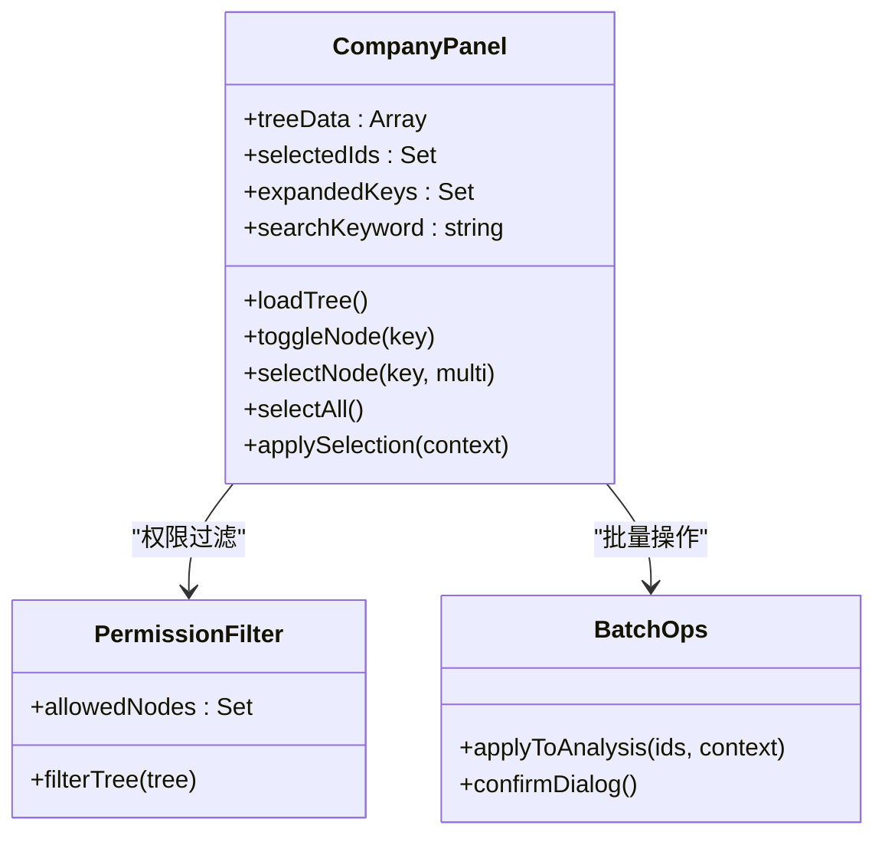
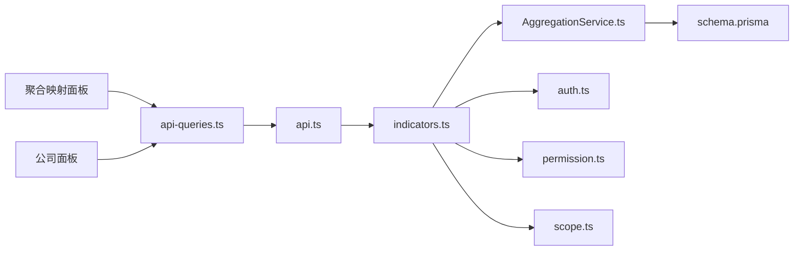

# 维度选择组件

<cite>
**本文引用的文件**   
- [aggregation-map-panel.tsx](file://web/src/components/dimension/aggregation-map-panel.tsx)
- [company-panel.tsx](file://web/src/components/dimension/company-panel.tsx)
- [api-queries.ts](file://web/src/hooks/api-queries.ts)
- [api.ts](file://web/src/lib/api.ts)
- [constants.ts](file://web/src/lib/constants.ts)
- [subject-tree-panel.tsx](file://web/src/components/subject-tree/subject-tree-panel.tsx)
- [metric-tree.tsx](file://web/src/components/subject-tree/metric-tree.tsx)
- [subject-tree.tsx](file://web/src/components/subject-tree/subject-tree.tsx)
- [AggregationService.ts](file://server/src/services/AggregationService.ts)
- [indicators.ts](file://server/src/routes/indicators.ts)
- [schema.prisma](file://server/prisma/schema.prisma)
- [auth.ts](file://server/src/middleware/auth.ts)
- [permission.ts](file://server/src/middleware/permission.ts)
- [scope.ts](file://server/src/middleware/scope.ts)
</cite>

## 目录
1. [简介](#简介)
2. [项目结构](#项目结构)
3. [核心组件](#核心组件)
4. [架构总览](#架构总览)
5. [详细组件分析](#详细组件分析)
6. [依赖关系分析](#依赖关系分析)
7. [性能考量](#性能考量)
8. [故障排查指南](#故障排查指南)
9. [结论](#结论)
10. [附录](#附录)

## 简介
本文件聚焦 FY200 项目的“维度选择组件”，围绕以下目标展开：
- 聚合映射面板的业务逻辑与配置界面：指标聚合规则定义、映射关系维护、验证规则设置。
- 公司面板的组织架构展示与选择逻辑：层级结构、权限控制、批量操作。
- 维度数据的缓存策略与实时更新机制。
- 组件间的数据传递、状态同步与错误处理模式。
- 财务分析场景下的使用示例与最佳实践。

FY200 定位为“Excel进、看板/报表出”的财年经营数据分析平台，单位统一为万元/人民币。后端采用 Express + Prisma + PostgreSQL，中间件执行链顺序严格，计算类指标通过安全公式解析与后端实时计算，确保口径一致性与安全性。

## 项目结构
维度选择相关的前端组件位于 web/src/components/dimension 目录，包含聚合映射面板与公司面板；与之配合的指标树与主题树在 subject-tree 目录中提供指标维度支持。后端服务 AggregationService 与路由 indicators.ts 负责聚合规则与映射的持久化与查询。

图表来源
- [aggregation-map-panel.tsx](file://web/src/components/dimension/aggregation-map-panel.tsx)
- [company-panel.tsx](file://web/src/components/dimension/company-panel.tsx)
- [subject-tree-panel.tsx](file://web/src/components/subject-tree/subject-tree-panel.tsx)
- [metric-tree.tsx](file://web/src/components/subject-tree/metric-tree.tsx)
- [subject-tree.tsx](file://web/src/components/subject-tree/subject-tree.tsx)
- [api-queries.ts](file://web/src/hooks/api-queries.ts)
- [api.ts](file://web/src/lib/api.ts)
- [indicators.ts](file://server/src/routes/indicators.ts)
- [AggregationService.ts](file://server/src/services/AggregationService.ts)
- [auth.ts](file://server/src/middleware/auth.ts)
- [permission.ts](file://server/src/middleware/permission.ts)
- [scope.ts](file://server/src/middleware/scope.ts)
- [schema.prisma](file://server/prisma/schema.prisma)

章节来源
- [aggregation-map-panel.tsx](file://web/src/components/dimension/aggregation-map-panel.tsx)
- [company-panel.tsx](file://web/src/components/dimension/company-panel.tsx)
- [api-queries.ts](file://web/src/hooks/api-queries.ts)
- [api.ts](file://web/src/lib/api.ts)
- [constants.ts](file://web/src/lib/constants.ts)
- [subject-tree-panel.tsx](file://web/src/components/subject-tree/subject-tree-panel.tsx)
- [metric-tree.tsx](file://web/src/components/subject-tree/metric-tree.tsx)
- [subject-tree.tsx](file://web/src/components/subject-tree/subject-tree.tsx)
- [AggregationService.ts](file://server/src/services/AggregationService.ts)
- [indicators.ts](file://server/src/routes/indicators.ts)
- [schema.prisma](file://server/prisma/schema.prisma)
- [auth.ts](file://server/src/middleware/auth.ts)
- [permission.ts](file://server/src/middleware/permission.ts)
- [scope.ts](file://server/src/middleware/scope.ts)

## 核心组件
- 聚合映射面板（aggregation-map-panel.tsx）
  - 功能：定义指标聚合规则、维护指标到维度/主题的映射关系、校验规则配置与即时反馈。
  - 交互：表单输入、规则预览、批量导入/导出、冲突检测与提示。
  - 数据流：通过 api-queries.ts 调用后端指标路由，读取/保存映射与规则，结合本地状态进行校验与预览。
- 公司面板（company-panel.tsx）
  - 功能：以组织架构树形式展示公司层级，支持按权限过滤、多选/全选、批量应用至当前分析上下文。
  - 交互：节点展开/折叠、勾选、搜索、批量操作确认。
  - 数据流：从后端获取组织树与权限信息，前端维护选中集合，提交时携带所选公司 ID 列表。

章节来源
- [aggregation-map-panel.tsx](file://web/src/components/dimension/aggregation-map-panel.tsx)
- [company-panel.tsx](file://web/src/components/dimension/company-panel.tsx)

## 架构总览
维度选择组件遵循前后端分离与分层职责清晰的设计：
- 前端：组件层（聚合映射面板、公司面板、指标/主题树）→ 查询封装层（api-queries.ts）→ HTTP 客户端（api.ts）。
- 后端：路由层（indicators.ts）→ 服务层（AggregationService.ts）→ 数据访问（Prisma schema.prisma）。
- 安全与权限：鉴权（auth.ts）、权限（permission.ts）、数据范围（scope.ts）贯穿请求链路。

图表来源
- [aggregation-map-panel.tsx](file://web/src/components/dimension/aggregation-map-panel.tsx)
- [company-panel.tsx](file://web/src/components/dimension/company-panel.tsx)
- [api-queries.ts](file://web/src/hooks/api-queries.ts)
- [api.ts](file://web/src/lib/api.ts)
- [indicators.ts](file://server/src/routes/indicators.ts)
- [AggregationService.ts](file://server/src/services/AggregationService.ts)
- [schema.prisma](file://server/prisma/schema.prisma)

## 详细组件分析

### 聚合映射面板（aggregation-map-panel.tsx）
- 业务逻辑
  - 指标聚合规则：支持加减乘除等安全算子组合，禁止 eval，由后端公式引擎校验与计算。
  - 映射关系维护：将指标映射到维度（如公司、科目、期间），支持多对多映射与优先级。
  - 验证规则：字段必填、类型校验、范围限制、冲突检测（重复映射、循环依赖）。
- 界面交互
  - 表单区域：规则编辑、映射配置、校验开关。
  - 预览区：规则解析后的表达式与样例输出。
  - 操作区：保存、撤销、导入/导出、批量启用/禁用。
- 数据流与状态
  - 本地状态：规则草稿、校验结果、选中映射项。
  - 远端同步：通过 api-queries.ts 调用 /indicators 接口，实现 CRUD。
  - 错误处理：网络异常、校验失败、权限不足时的用户提示与回滚。

图表来源
- [aggregation-map-panel.tsx](file://web/src/components/dimension/aggregation-map-panel.tsx)
- [api-queries.ts](file://web/src/hooks/api-queries.ts)
- [indicators.ts](file://server/src/routes/indicators.ts)
- [AggregationService.ts](file://server/src/services/AggregationService.ts)

章节来源
- [aggregation-map-panel.tsx](file://web/src/components/dimension/aggregation-map-panel.tsx)
- [api-queries.ts](file://web/src/hooks/api-queries.ts)
- [indicators.ts](file://server/src/routes/indicators.ts)
- [AggregationService.ts](file://server/src/services/AggregationService.ts)

### 公司面板（company-panel.tsx）
- 组织架构展示
  - 树形结构：公司-分公司-部门等多级展示，支持展开/折叠。
  - 权限控制：基于角色与数据范围，仅展示可访问节点。
  - 搜索与过滤：按名称、编码快速定位。
- 选择逻辑
  - 单选/多选：支持全选、反选、按层级联动选择。
  - 批量操作：批量应用到当前分析上下文（如筛选、分组、汇总）。
- 数据流与状态
  - 初始加载：拉取组织树与权限标记。
  - 本地状态：选中集合、展开状态、搜索关键词。
  - 提交：将选中公司 ID 列表传递给上层分析组件或后端查询。

图表来源
- [company-panel.tsx](file://web/src/components/dimension/company-panel.tsx)
- [api-queries.ts](file://web/src/hooks/api-queries.ts)
- [permission.ts](file://server/src/middleware/permission.ts)

章节来源
- [company-panel.tsx](file://web/src/components/dimension/company-panel.tsx)
- [api-queries.ts](file://web/src/hooks/api-queries.ts)
- [permission.ts](file://server/src/middleware/permission.ts)

### 指标树与主题树（metric-tree.tsx、subject-tree.tsx、subject-tree-panel.tsx）
- 指标树：展示指标分类与属性，支持选择指标作为聚合目标。
- 主题树：展示科目/主题维度，用于构建维度映射与分组。
- 与聚合映射面板协作：选择指标后自动填充映射表单，支持一键生成默认规则。

章节来源
- [metric-tree.tsx](file://web/src/components/subject-tree/metric-tree.tsx)
- [subject-tree.tsx](file://web/src/components/subject-tree/subject-tree.tsx)
- [subject-tree-panel.tsx](file://web/src/components/subject-tree/subject-tree-panel.tsx)

## 依赖关系分析
- 前端依赖
  - 组件依赖 api-queries.ts 进行数据请求与缓存管理。
  - api.ts 统一封装 HTTP 请求、拦截器、错误处理。
  - constants.ts 提供常量（如单位、分页大小、缓存键前缀）。
- 后端依赖
  - indicators.ts 路由接收请求，调用 AggregationService 执行业务。
  - AggregationService 使用 Prisma 访问数据库，执行指标规则与映射的增删改查。
  - 中间件 auth.ts、permission.ts、scope.ts 保障鉴权、权限与数据范围。

图表来源
- [aggregation-map-panel.tsx](file://web/src/components/dimension/aggregation-map-panel.tsx)
- [company-panel.tsx](file://web/src/components/dimension/company-panel.tsx)
- [api-queries.ts](file://web/src/hooks/api-queries.ts)
- [api.ts](file://web/src/lib/api.ts)
- [indicators.ts](file://server/src/routes/indicators.ts)
- [AggregationService.ts](file://server/src/services/AggregationService.ts)
- [schema.prisma](file://server/prisma/schema.prisma)
- [auth.ts](file://server/src/middleware/auth.ts)
- [permission.ts](file://server/src/middleware/permission.ts)
- [scope.ts](file://server/src/middleware/scope.ts)

章节来源
- [api-queries.ts](file://web/src/hooks/api-queries.ts)
- [api.ts](file://web/src/lib/api.ts)
- [constants.ts](file://web/src/lib/constants.ts)
- [indicators.ts](file://server/src/routes/indicators.ts)
- [AggregationService.ts](file://server/src/services/AggregationService.ts)
- [schema.prisma](file://server/prisma/schema.prisma)
- [auth.ts](file://server/src/middleware/auth.ts)
- [permission.ts](file://server/src/middleware/permission.ts)
- [scope.ts](file://server/src/middleware/scope.ts)

## 性能考量
- 缓存策略
  - 前端：对组织树、指标树、规则列表实施短期缓存（内存+可选 localStorage），减少重复请求。
  - 后端：对热点查询（如公司树、常用指标）启用内存缓存或 Redis 缓存，避免频繁数据库访问。
- 实时更新
  - 增量更新：规则变更仅刷新受影响节点，避免全量重绘。
  - 事件驱动：通过订阅/发布机制通知组件状态变化，保持数据一致性。
- 计算优化
  - 指标计算在后端集中执行，前端仅展示结果，降低前端负载。
  - 公式解析采用白名单算子，避免复杂表达式带来的性能问题。

[本节为通用指导，不直接分析具体文件]

## 故障排查指南
- 常见错误
  - 权限不足：检查 JWT 令牌有效性、角色权限配置、数据范围扩展是否正确。
  - 校验失败：核对规则表达式、字段类型与范围限制，查看前端校验日志与后端返回的错误码。
  - 网络异常：检查 api.ts 拦截器配置、后端路由是否可达、数据库连接是否正常。
- 调试建议
  - 前端：打开浏览器开发者工具，查看 Network 与 Console 日志，确认请求参数与响应体。
  - 后端：启用审计与日志中间件，记录请求链路、权限判断与数据范围过滤结果。
  - 数据库：检查 Prisma 迁移与 schema 一致性，确认表结构与索引是否满足查询需求。

章节来源
- [auth.ts](file://server/src/middleware/auth.ts)
- [permission.ts](file://server/src/middleware/permission.ts)
- [scope.ts](file://server/src/middleware/scope.ts)
- [api.ts](file://web/src/lib/api.ts)
- [api-queries.ts](file://web/src/hooks/api-queries.ts)

## 结论
维度选择组件通过清晰的组件分层、严格的权限控制与安全的公式解析，实现了灵活的指标聚合与维度映射能力。公司面板提供了直观的组织架构选择与批量操作，满足财务分析中的多维度筛选与汇总需求。合理的缓存与实时更新机制保障了用户体验与系统性能。建议在后续迭代中进一步优化缓存策略与错误提示，提升易用性与稳定性。

[本节为总结性内容，不直接分析具体文件]

## 附录
- 使用示例（财务分析场景）
  - 创建聚合规则：在聚合映射面板中定义收入=主营业务收入+其他业务收入，保存并预览结果。
  - 选择公司维度：在公司面板中选择集团及下属分公司，批量应用到利润表分析。
  - 指标与主题映射：将“净利润”指标映射到“利润表”主题，生成分组汇总。
- 最佳实践
  - 规则命名规范：采用“指标名_聚合方式_维度”格式，便于检索与维护。
  - 权限最小化：仅授予必要的查看与编辑权限，定期审计权限分配。
  - 缓存命中率监控：关注缓存命中率与延迟，必要时调整缓存策略。

[本节为概念性内容，不直接分析具体文件]