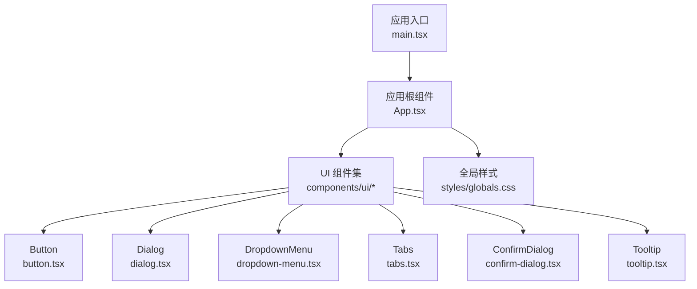
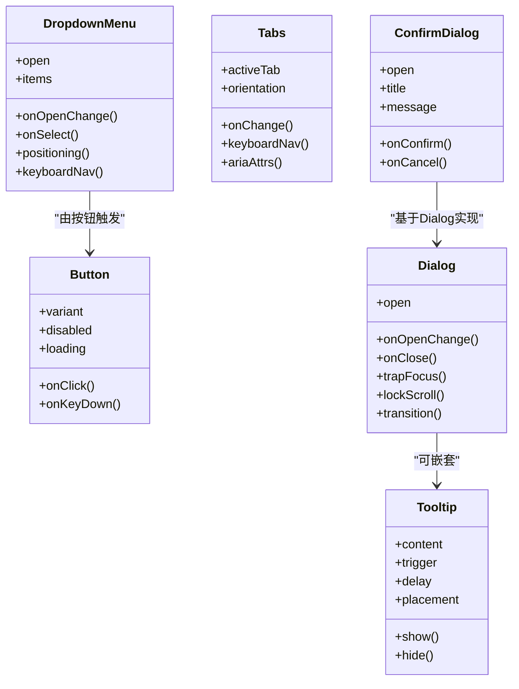
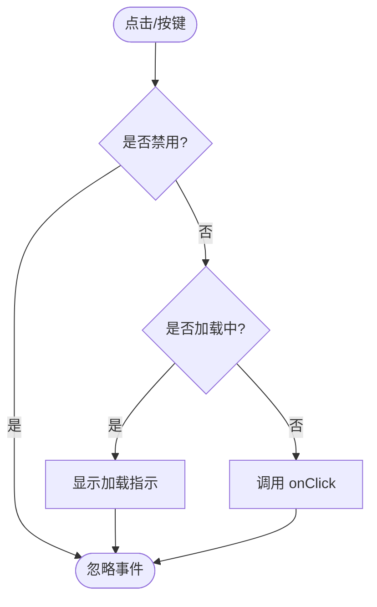
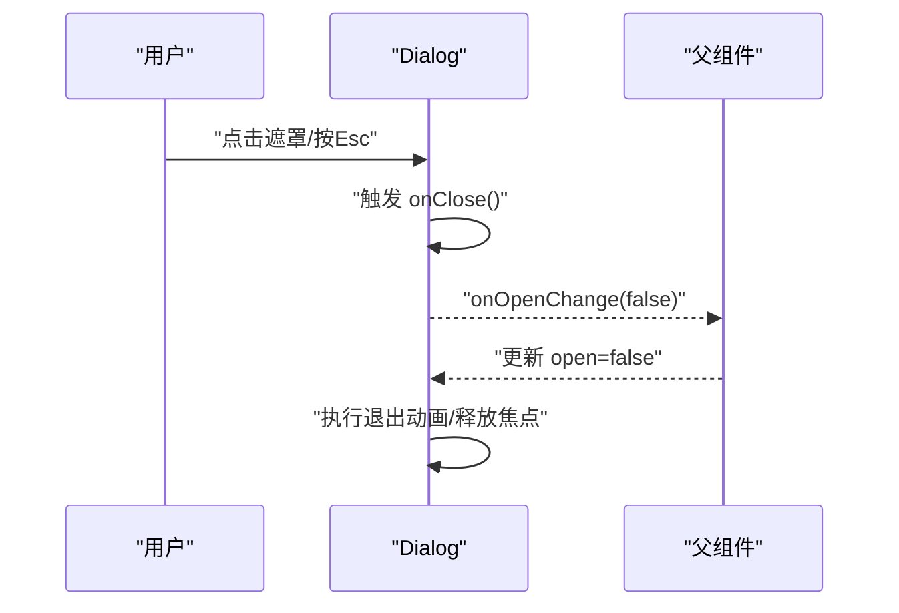
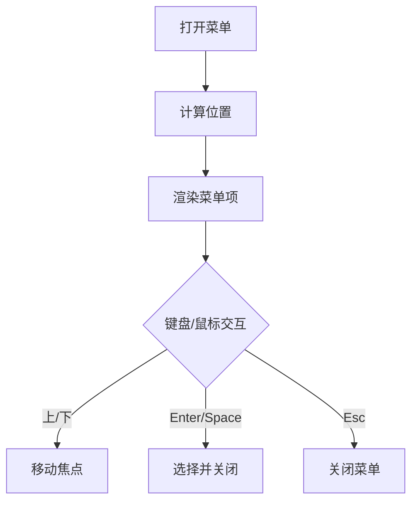
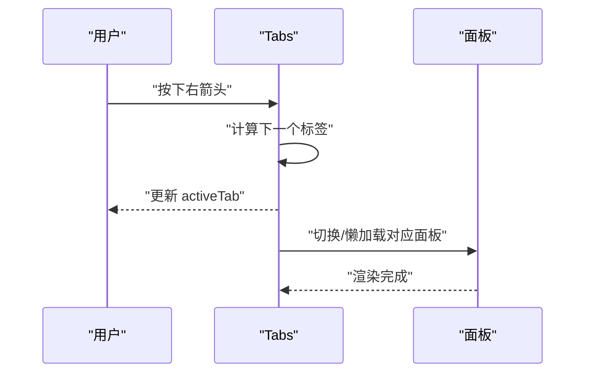
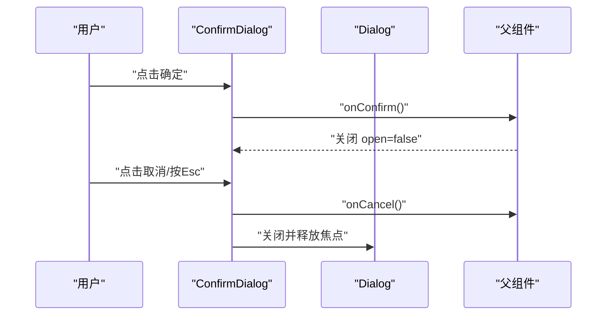
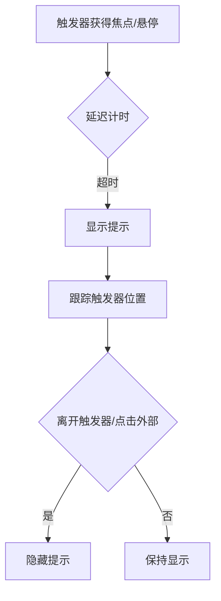
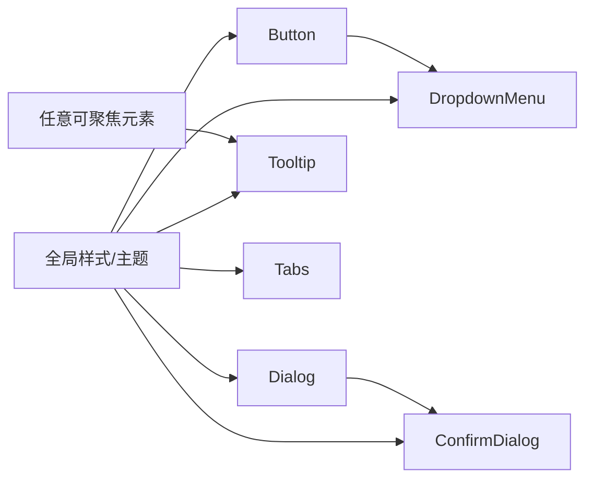

# 交互组件

<cite>
**本文引用的文件**   
- [button.tsx](file://web/src/components/ui/button.tsx)
- [dialog.tsx](file://web/src/components/ui/dialog.tsx)
- [dropdown-menu.tsx](file://web/src/components/ui/dropdown-menu.tsx)
- [tabs.tsx](file://web/src/components/ui/tabs.tsx)
- [confirm-dialog.tsx](file://web/src/components/ui/confirm-dialog.tsx)
- [tooltip.tsx](file://web/src/components/ui/tooltip.tsx)
- [App.tsx](file://web/src/App.tsx)
- [main.tsx](file://web/src/main.tsx)
- [globals.css](file://web/src/styles/globals.css)
</cite>

## 目录
1. [简介](#简介)
2. [项目结构](#项目结构)
3. [核心组件](#核心组件)
4. [架构总览](#架构总览)
5. [详细组件分析](#详细组件分析)
6. [依赖关系分析](#依赖关系分析)
7. [性能考虑](#性能考虑)
8. [故障排查指南](#故障排查指南)
9. [结论](#结论)
10. [附录](#附录)

## 简介
本文件聚焦 FY200 前端交互组件库，系统性梳理 Button、Dialog、DropdownMenu、Tabs、ConfirmDialog、Tooltip 等组件的实现细节与事件处理机制。文档覆盖用户交互模式、状态管理、动画过渡、键盘导航、焦点管理、模态框行为控制、无障碍访问（a11y）以及移动端适配要点，并提供使用示例、事件处理模式与最佳实践，帮助开发者快速、正确地集成与扩展这些基础交互能力。

## 项目结构
FY200 前端采用 React + TypeScript 技术栈，UI 组件集中于 web/src/components/ui 目录，页面与应用入口位于 web/src/pages 与 web/src 根目录。交互组件通过统一的样式与主题变量在 globals.css 中定义，确保一致的视觉与动效体验。

图表来源
- [main.tsx:1-40](file://web/src/main.tsx#L1-L40)
- [App.tsx:1-60](file://web/src/App.tsx#L1-L60)
- [globals.css:1-120](file://web/src/styles/globals.css#L1-L120)

章节来源
- [main.tsx:1-40](file://web/src/main.tsx#L1-L40)
- [App.tsx:1-60](file://web/src/App.tsx#L1-L60)
- [globals.css:1-120](file://web/src/styles/globals.css#L1-L120)

## 核心组件
本节概述各交互组件的职责边界与共性设计：
- Button：触发操作的基础控件，支持多种变体、禁用态、加载态与键盘交互。
- Dialog：模态对话框容器，负责遮罩、焦点捕获、Esc 关闭、滚动锁定与动画过渡。
- DropdownMenu：弹出式菜单，提供定位、键盘导航、选择回调与可组合的子项。
- Tabs：标签页切换，维护激活态、键盘方向键导航、ARIA 属性与内容懒渲染策略。
- ConfirmDialog：确认型对话框，封装“确定/取消”语义，统一二次确认流程。
- Tooltip：提示气泡，延迟显示、位置计算、鼠标/焦点触发与屏幕阅读器友好。

章节来源
- [button.tsx:1-120](file://web/src/components/ui/button.tsx#L1-L120)
- [dialog.tsx:1-200](file://web/src/components/ui/dialog.tsx#L1-L200)
- [dropdown-menu.tsx:1-220](file://web/src/components/ui/dropdown-menu.tsx#L1-L220)
- [tabs.tsx:1-180](file://web/src/components/ui/tabs.tsx#L1-L180)
- [confirm-dialog.tsx:1-150](file://web/src/components/ui/confirm-dialog.tsx#L1-L150)
- [tooltip.tsx:1-160](file://web/src/components/ui/tooltip.tsx#L1-L160)

## 架构总览
交互组件遵循“受控/非受控混合”的状态管理模式：对外暴露 props 控制可见性、选中态等；内部维护本地状态用于动画、焦点与键盘交互。组件之间通过事件回调与上下文进行解耦通信，避免强耦合。

图表来源
- [button.tsx:1-120](file://web/src/components/ui/button.tsx#L1-L120)
- [dialog.tsx:1-200](file://web/src/components/ui/dialog.tsx#L1-L200)
- [dropdown-menu.tsx:1-220](file://web/src/components/ui/dropdown-menu.tsx#L1-L220)
- [tabs.tsx:1-180](file://web/src/components/ui/tabs.tsx#L1-L180)
- [confirm-dialog.tsx:1-150](file://web/src/components/ui/confirm-dialog.tsx#L1-L150)
- [tooltip.tsx:1-160](file://web/src/components/ui/tooltip.tsx#L1-L160)

## 详细组件分析

### Button 组件
- 用户交互模式：点击触发 onClick；支持 Enter/Space 激活；禁用态不可交互；加载态显示旋转指示并阻止默认点击。
- 状态管理：外部通过 props 控制 disabled/loading；内部维护 focus/active 的瞬时状态以驱动样式。
- 动画过渡：通过 CSS 类名切换实现 hover/focus/active/loading 的过渡效果。
- 键盘导航：支持 Tab 进入焦点，Enter/Space 触发；与表单元素保持一致的行为。
- 无障碍：role="button"（必要时）、aria-disabled、aria-busy（加载时）。
- 移动端适配：增大触控区域，避免误触；长按不触发默认行为。

图表来源
- [button.tsx:1-120](file://web/src/components/ui/button.tsx#L1-L120)

章节来源
- [button.tsx:1-120](file://web/src/components/ui/button.tsx#L1-L120)

### Dialog 组件
- 用户交互模式：打开/关闭由 open 控制；点击遮罩或按 Esc 关闭；支持自定义关闭回调。
- 状态管理：open 为受控状态；内部维护焦点捕获、滚动锁定与动画阶段。
- 动画过渡：进入/离开动画通过 CSS transition 或 keyframes 实现，保证平滑过渡。
- 键盘导航：焦点陷阱（Trap Focus），Tab/Shift+Tab 在对话框内循环；Esc 关闭。
- 模态框行为：阻止背景滚动，层级 z-index 管理，多实例堆叠时的焦点顺序。
- 无障碍：role="dialog"、aria-modal="true"、aria-labelledby/aria-describedby。

图表来源
- [dialog.tsx:1-200](file://web/src/components/ui/dialog.tsx#L1-L200)

章节来源
- [dialog.tsx:1-200](file://web/src/components/ui/dialog.tsx#L1-L200)

### DropdownMenu 组件
- 用户交互模式：由触发器（如 Button）打开；点击选项后自动关闭；支持多选/单选场景。
- 状态管理：open 受控；内部维护 activeItemIndex 用于键盘导航。
- 定位策略：根据视口与触发器位置计算 placement，避免溢出；支持偏移与对齐。
- 键盘导航：上下箭头移动焦点，Enter/Space 选择，Esc 关闭。
- 无障碍：role="menu"/"menuitem"，aria-activedescendant，aria-expanded。

图表来源
- [dropdown-menu.tsx:1-220](file://web/src/components/ui/dropdown-menu.tsx#L1-L220)

章节来源
- [dropdown-menu.tsx:1-220](file://web/src/components/ui/dropdown-menu.tsx#L1-L220)

### Tabs 组件
- 用户交互模式：点击切换标签；支持水平/垂直方向；可配置是否允许关闭标签。
- 状态管理：activeTab 受控；内部维护面板渲染策略（全量/懒渲染）。
- 键盘导航：左右箭头切换；Home/End 跳转首尾；Enter/Space 激活。
- 无障碍：role="tablist"/"tab"/"tabpanel"，aria-selected，aria-controls。
- 动画过渡：切换时内容淡入/滑出，提升感知流畅度。

图表来源
- [tabs.tsx:1-180](file://web/src/components/ui/tabs.tsx#L1-L180)

章节来源
- [tabs.tsx:1-180](file://web/src/components/ui/tabs.tsx#L1-L180)

### ConfirmDialog 组件
- 用户交互模式：展示标题与消息；提供“确定/取消”两个动作；支持自定义回调。
- 状态管理：open 受控；内部仅维护 UI 状态（如按钮 loading）。
- 模态行为：继承 Dialog 的焦点捕获、Esc 关闭、滚动锁定。
- 无障碍：语义化标题与描述，按钮 aria-label 明确。

图表来源
- [confirm-dialog.tsx:1-150](file://web/src/components/ui/confirm-dialog.tsx#L1-L150)
- [dialog.tsx:1-200](file://web/src/components/ui/dialog.tsx#L1-L200)

章节来源
- [confirm-dialog.tsx:1-150](file://web/src/components/ui/confirm-dialog.tsx#L1-L150)
- [dialog.tsx:1-200](file://web/src/components/ui/dialog.tsx#L1-L200)

### Tooltip 组件
- 用户交互模式：鼠标悬停或聚焦触发器显示；支持延迟显示与隐藏；点击外部关闭。
- 状态管理：visible 受控；内部维护定时器与定位计算。
- 定位策略：根据触发器与视口动态计算 placement，避免遮挡。
- 无障碍：aria-tooltip 或 role="tooltip"，与触发器关联。
- 移动端适配：触摸触发需考虑长按与点击差异，避免误显。

图表来源
- [tooltip.tsx:1-160](file://web/src/components/ui/tooltip.tsx#L1-L160)

章节来源
- [tooltip.tsx:1-160](file://web/src/components/ui/tooltip.tsx#L1-L160)

## 依赖关系分析
交互组件之间的依赖主要体现在组合与复用：
- ConfirmDialog 基于 Dialog 实现，复用焦点捕获与模态行为。
- DropdownMenu 常由 Button 触发，形成“触发器-菜单”的组合模式。
- Tooltip 可与任意可聚焦元素组合，提供轻量提示。
- 所有组件共享全局样式与主题变量，确保一致性。

图表来源
- [button.tsx:1-120](file://web/src/components/ui/button.tsx#L1-L120)
- [dialog.tsx:1-200](file://web/src/components/ui/dialog.tsx#L1-L200)
- [dropdown-menu.tsx:1-220](file://web/src/components/ui/dropdown-menu.tsx#L1-L220)
- [tabs.tsx:1-180](file://web/src/components/ui/tabs.tsx#L1-L180)
- [confirm-dialog.tsx:1-150](file://web/src/components/ui/confirm-dialog.tsx#L1-L150)
- [tooltip.tsx:1-160](file://web/src/components/ui/tooltip.tsx#L1-L160)
- [globals.css:1-120](file://web/src/styles/globals.css#L1-L120)

章节来源
- [globals.css:1-120](file://web/src/styles/globals.css#L1-L120)

## 性能考虑
- 避免不必要的重渲染：将 open、activeTab 等状态提升到父组件，减少子组件重复计算。
- 懒渲染：Tabs 面板按需渲染，DropdownMenu 内容仅在打开时构建。
- 防抖与节流：Tooltip 的显示/隐藏使用定时器，避免频繁触发。
- 动画优化：优先使用 CSS transform/opacity 实现过渡，减少布局抖动。
- 事件委托：列表项或菜单项使用事件委托降低监听器数量。

[本节为通用指导，无需特定文件引用]

## 故障排查指南
常见问题与解决思路：
- 焦点丢失：检查 Dialog 的焦点陷阱是否正确实现，确保关闭时恢复原焦点。
- 键盘导航异常：验证 Tabs/DropdownMenu 的方向键逻辑与边界处理。
- 动画卡顿：确认未阻塞主线程的重排/重绘，尽量使用 GPU 加速属性。
- 移动端误触：增大触控目标，区分点击与滑动，避免与原生手势冲突。
- 无障碍问题：确保 ARIA 属性完整，屏幕阅读器能正确朗读。

章节来源
- [dialog.tsx:1-200](file://web/src/components/ui/dialog.tsx#L1-L200)
- [tabs.tsx:1-180](file://web/src/components/ui/tabs.tsx#L1-L180)
- [dropdown-menu.tsx:1-220](file://web/src/components/ui/dropdown-menu.tsx#L1-L220)
- [tooltip.tsx:1-160](file://web/src/components/ui/tooltip.tsx#L1-L160)

## 结论
FY200 交互组件以清晰的状态管理与事件模型为基础，结合完善的键盘导航与无障碍支持，提供了稳定、易用的基础 UI 能力。通过统一的样式与主题，组件在不同平台与设备上保持一致体验。建议在实际使用中遵循受控模式、合理拆分状态、充分利用组合能力，以获得更好的可维护性与扩展性。

[本节为总结性内容，无需特定文件引用]

## 附录
- 使用示例与最佳实践
  - Button：始终提供明确的 aria-label；在异步操作中启用 loading 态并禁用再次点击。
  - Dialog：将 open 作为受控状态；在 onOpenChange 中集中处理打开/关闭逻辑。
  - DropdownMenu：为每个菜单项提供唯一 key；对敏感操作增加 ConfirmDialog 二次确认。
  - Tabs：为每个面板设置唯一的 id 并与 tab 的 aria-controls 对应。
  - ConfirmDialog：明确标题与消息文案，避免歧义；在 onConfirm 中处理副作用。
  - Tooltip：为复杂内容提供简洁摘要；避免过长文本影响可读性。
- 无障碍清单
  - 所有可交互元素具备合适的 role 与 aria-* 属性。
  - 键盘可达性与顺序符合预期。
  - 颜色对比度满足 WCAG 标准。
- 移动端适配清单
  - 触控目标尺寸不小于 44x44px。
  - 避免与系统手势冲突。
  - 在小屏下调整弹窗尺寸与定位策略。

[本节为通用指导，无需特定文件引用]