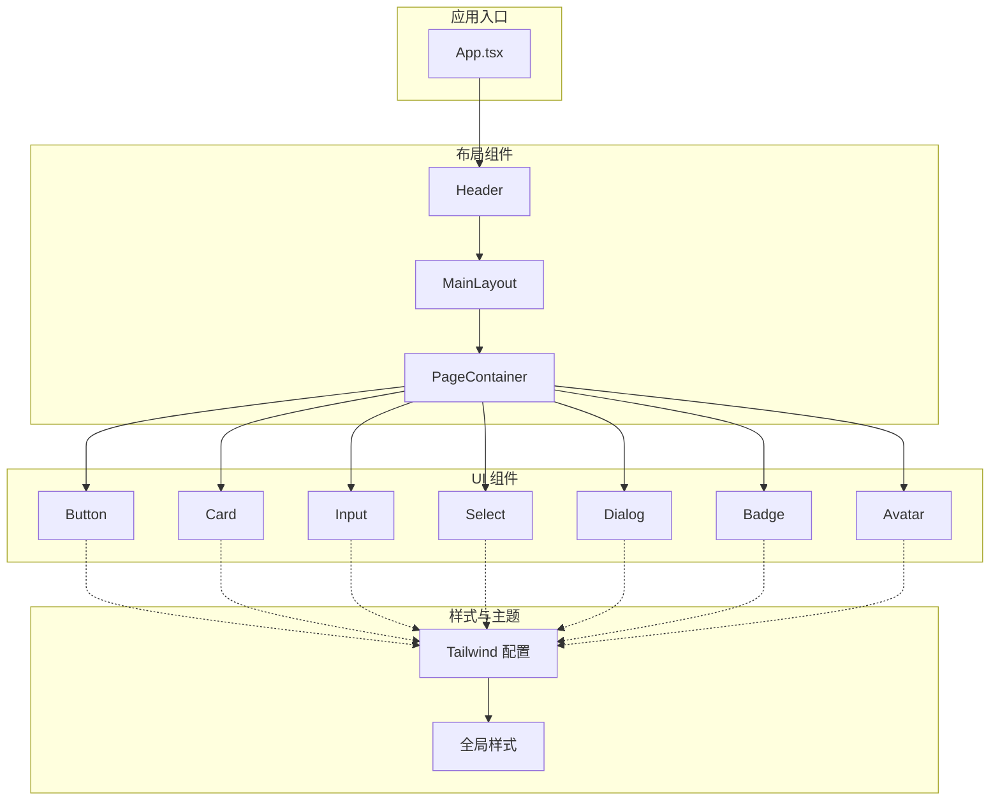
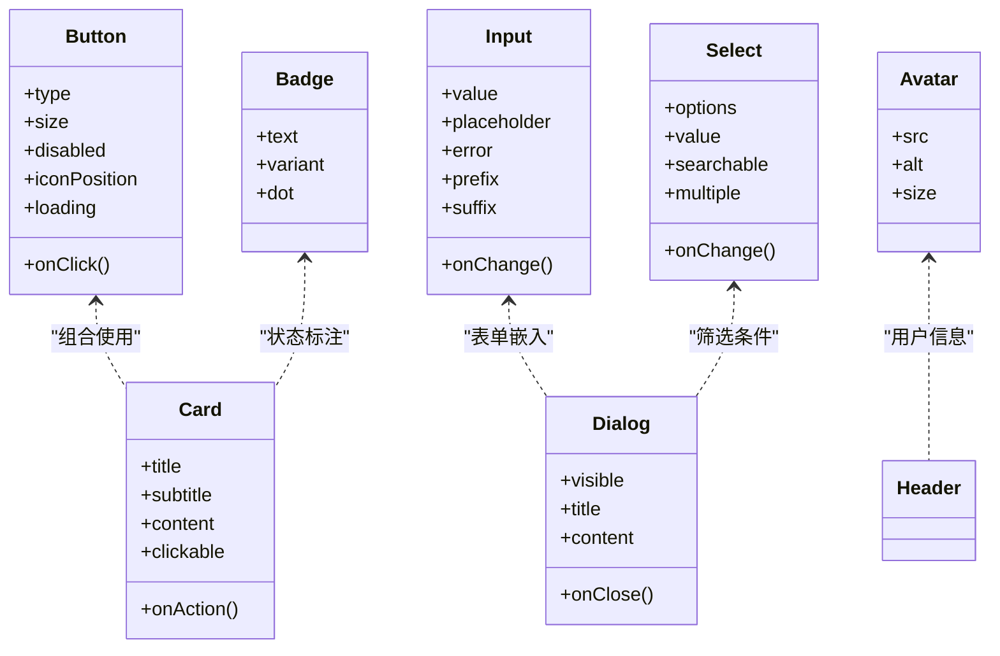
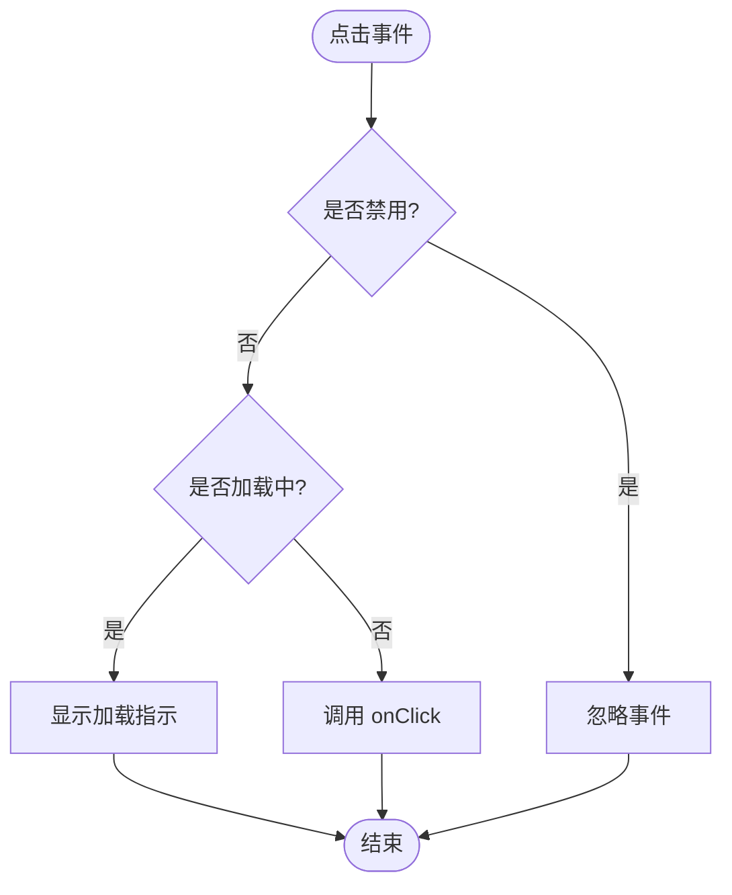
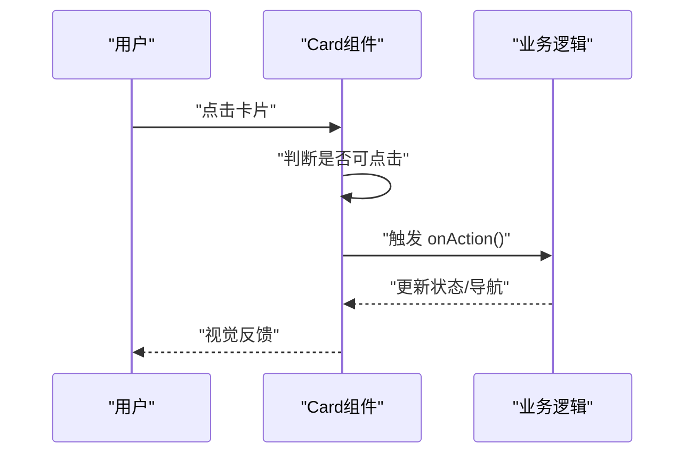
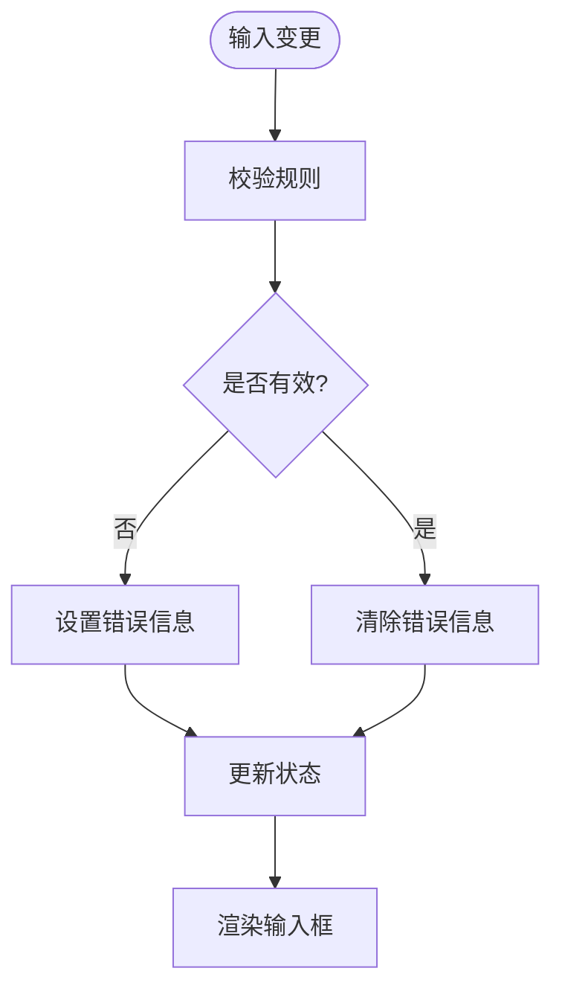
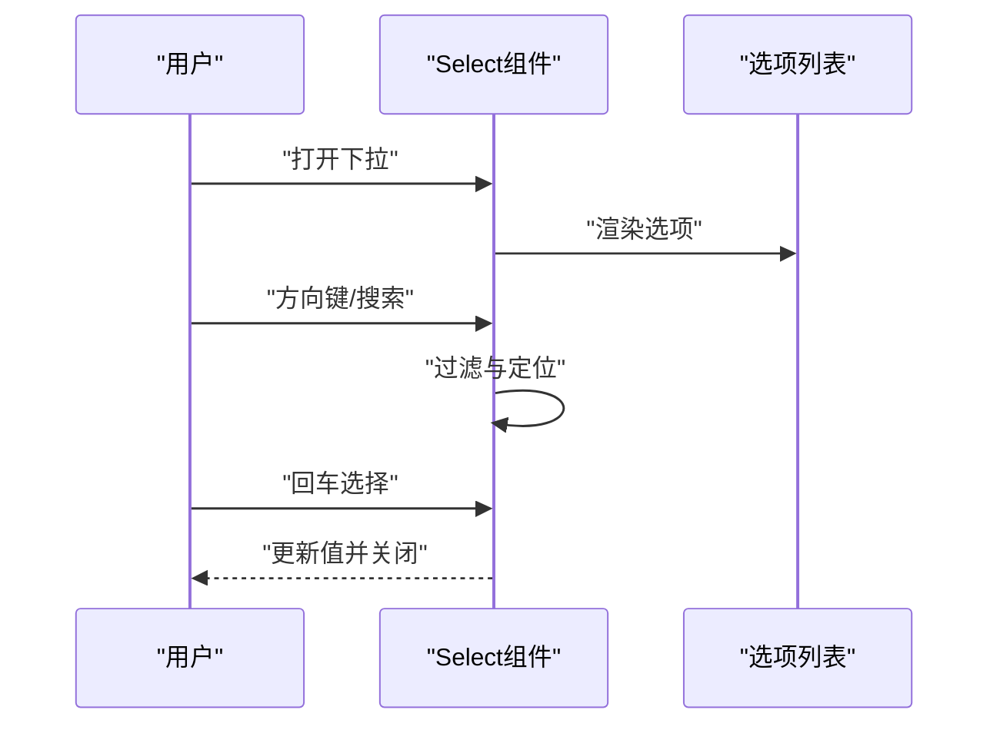
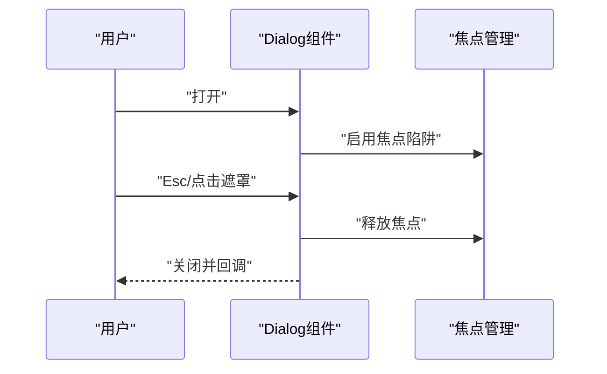
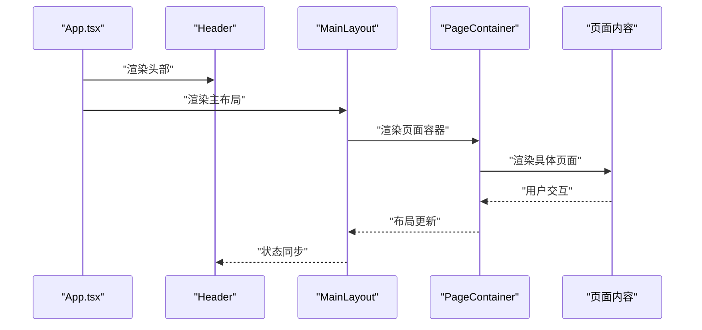
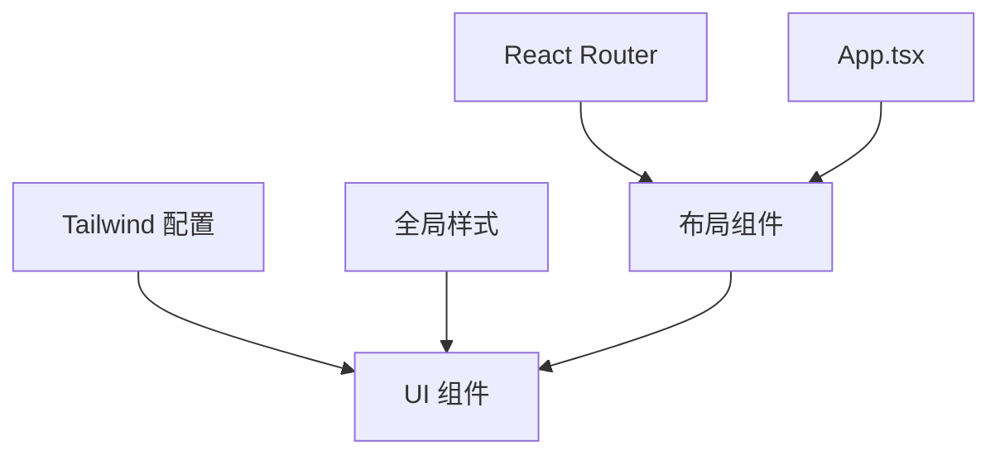

# 基础UI组件库

<cite>
**本文引用的文件**   
- [button.tsx](file://web/src/components/ui/button.tsx)
- [card.tsx](file://web/src/components/ui/card.tsx)
- [input.tsx](file://web/src/components/ui/input.tsx)
- [select.tsx](file://web/src/components/ui/select.tsx)
- [dialog.tsx](file://web/src/components/ui/dialog.tsx)
- [badge.tsx](file://web/src/components/ui/badge.tsx)
- [avatar.tsx](file://web/src/components/ui/avatar.tsx)
- [header.tsx](file://web/src/components/layout/header.tsx)
- [main-layout.tsx](file://web/src/components/layout/main-layout.tsx)
- [page-container.tsx](file://web/src/components/layout/page-container.tsx)
- [globals.css](file://web/src/styles/globals.css)
- [tailwind.config.js](file://web/tailwind.config.js)
- [App.tsx](file://web/src/App.tsx)
- [index.tsx](file://web/src/index.css)
</cite>

## 目录
1. [简介](#简介)
2. [项目结构](#项目结构)
3. [核心组件](#核心组件)
4. [架构总览](#架构总览)
5. [详细组件分析](#详细组件分析)
6. [依赖关系分析](#依赖关系分析)
7. [性能考量](#性能考量)
8. [故障排查指南](#故障排查指南)
9. [结论](#结论)
10. [附录](#附录)

## 简介
本文件为FY200项目基础UI组件库的技术文档，聚焦于Button、Card、Input、Select、Dialog、Badge、Avatar等核心组件的设计与使用，并覆盖布局组件Header、MainLayout、PageContainer的组合模式。文档从系统架构、组件职责、数据流、样式定制、主题支持、响应式实现、可访问性与键盘导航、屏幕阅读器兼容性等方面展开，同时提供最佳实践与性能优化建议，帮助开发者快速、正确地集成与扩展组件。

## 项目结构
前端采用React + TypeScript + Tailwind CSS技术栈，UI组件集中于web/src/components/ui目录，布局组件位于web/src/components/layout目录，全局样式与主题配置在web/src/styles和web/tailwind.config.js中。页面级应用入口与路由组织在web/src/App.tsx与pages目录下。

图表来源
- [App.tsx:1-200](file://web/src/App.tsx#L1-L200)
- [header.tsx:1-200](file://web/src/components/layout/header.tsx#L1-L200)
- [main-layout.tsx:1-200](file://web/src/components/layout/main-layout.tsx#L1-L200)
- [page-container.tsx:1-200](file://web/src/components/layout/page-container.tsx#L1-L200)
- [button.tsx:1-200](file://web/src/components/ui/button.tsx#L1-L200)
- [card.tsx:1-200](file://web/src/components/ui/card.tsx#L1-L200)
- [input.tsx:1-200](file://web/src/components/ui/input.tsx#L1-L200)
- [select.tsx:1-200](file://web/src/components/ui/select.tsx#L1-L200)
- [dialog.tsx:1-200](file://web/src/components/ui/dialog.tsx#L1-L200)
- [badge.tsx:1-200](file://web/src/components/ui/badge.tsx#L1-L200)
- [avatar.tsx:1-200](file://web/src/components/ui/avatar.tsx#L1-L200)
- [tailwind.config.js:1-200](file://web/tailwind.config.js#L1-L200)
- [globals.css:1-200](file://web/src/styles/globals.css#L1-L200)

章节来源
- [App.tsx:1-200](file://web/src/App.tsx#L1-L200)
- [tailwind.config.js:1-200](file://web/tailwind.config.js#L1-L200)
- [globals.css:1-200](file://web/src/styles/globals.css#L1-L200)

## 核心组件
本节概述各基础组件的职责、Props接口规范、样式定制选项、主题支持与响应式设计要点。

- Button（按钮）
  - 职责：触发操作、提交表单、跳转或打开弹窗等交互入口。
  - Props要点：类型（primary/secondary/outline/danger等）、尺寸（sm/md/lg）、是否禁用、图标位置、加载状态、无障碍标签。
  - 样式定制：通过Tailwind类名覆盖颜色、圆角、阴影；支持暗色主题变量映射。
  - 响应式：在小屏下自动调整内边距与字号，确保触控友好。
  - 可访问性：语义化button元素，aria-disabled、aria-label、焦点可见样式。

- Card（卡片）
  - 职责：内容分组展示，承载标题、描述、操作区。
  - Props要点：标题、副标题、内容插槽、是否可点击、点击回调、阴影等级、边框。
  - 样式定制：背景色、圆角、间距、悬停态；主题色注入。
  - 响应式：栅格布局下自适应宽度，移动端堆叠显示。
  - 可访问性：role="article"，必要时添加tabIndex与键盘激活。

- Input（输入框）
  - 职责：文本输入、校验提示、前缀/后缀图标、只读/禁用态。
  - Props要点：值、占位符、类型、错误信息、辅助说明、前/后缀、大小、对齐方式。
  - 样式定制：边框、聚焦环、错误态颜色、主题适配。
  - 响应式：全宽输入，移动端增大触控区域。
  - 可访问性：关联label、aria-invalid、aria-describedby、键盘导航。

- Select（选择器）
  - 职责：下拉选择、搜索过滤、多选、受控/非受控模式。
  - Props要点：选项数组、受控值、onChange、placeholder、搜索、多选、禁用、尺寸。
  - 样式定制：下拉面板样式、选中高亮、空态提示。
  - 响应式：小屏全屏弹出，避免遮挡。
  - 可访问性：ARIA组合（combobox/listbox）、方向键导航、Esc关闭。

- Dialog（对话框）
  - 职责：模态确认、表单录入、详情查看。
  - Props要点：标题、内容、是否可见、关闭回调、尺寸、遮罩、滚动行为。
  - 样式定制：圆角、阴影、动画、主题色。
  - 响应式：移动端全屏或底部抽屉。
  - 可访问性：焦点陷阱、Esc关闭、aria-modal、初始焦点管理。

- Badge（徽标）
  - 职责：状态标记、计数、标签。
  - Props要点：文本、颜色变体、是否点状、尺寸。
  - 样式定制：颜色、圆角、外边距。
  - 可访问性：aria-label描述含义，避免仅靠颜色传达信息。

- Avatar（头像）
  - 职责：用户头像、品牌标识。
  - Props要点：图片源、备用文本、尺寸、形状、加载失败回退。
  - 样式定制：边框、阴影、主题适配。
  - 可访问性：alt文本、loading懒加载。

章节来源
- [button.tsx:1-200](file://web/src/components/ui/button.tsx#L1-L200)
- [card.tsx:1-200](file://web/src/components/ui/card.tsx#L1-L200)
- [input.tsx:1-200](file://web/src/components/ui/input.tsx#L1-L200)
- [select.tsx:1-200](file://web/src/components/ui/select.tsx#L1-L200)
- [dialog.tsx:1-200](file://web/src/components/ui/dialog.tsx#L1-L200)
- [badge.tsx:1-200](file://web/src/components/ui/badge.tsx#L1-L200)
- [avatar.tsx:1-200](file://web/src/components/ui/avatar.tsx#L1-L200)

## 架构总览
组件库以“原子化UI + 布局容器”的模式组织，所有UI组件基于Tailwind进行样式构建，并通过CSS变量与主题配置统一色彩与尺寸体系。布局组件负责页面骨架与导航，页面容器负责内容与边距控制。

图表来源
- [button.tsx:1-200](file://web/src/components/ui/button.tsx#L1-L200)
- [card.tsx:1-200](file://web/src/components/ui/card.tsx#L1-L200)
- [input.tsx:1-200](file://web/src/components/ui/input.tsx#L1-L200)
- [select.tsx:1-200](file://web/src/components/ui/select.tsx#L1-L200)
- [dialog.tsx:1-200](file://web/src/components/ui/dialog.tsx#L1-L200)
- [badge.tsx:1-200](file://web/src/components/ui/badge.tsx#L1-L200)
- [avatar.tsx:1-200](file://web/src/components/ui/avatar.tsx#L1-L200)

## 详细组件分析

### Button（按钮）
- 设计要点：统一的视觉语言与交互反馈，支持多种变体与尺寸，适配加载与禁用态。
- 关键实现：语义化button元素，事件处理封装，样式通过Tailwind类名组合，主题变量映射颜色。
- 可访问性：aria-disabled、aria-label、焦点样式、键盘Enter/Space触发。
- 响应式：移动端增大点击区域，字号与间距自适应。
- 主题支持：通过CSS变量与Tailwind配置定义主色、强调色、危险色。

图表来源
- [button.tsx:1-200](file://web/src/components/ui/button.tsx#L1-L200)

章节来源
- [button.tsx:1-200](file://web/src/components/ui/button.tsx#L1-L200)

### Card（卡片）
- 设计要点：内容分块、清晰层级、可点击交互。
- 关键实现：外层容器包裹标题、描述、操作区，支持阴影与边框等级。
- 可访问性：role="article"，必要时tabIndex与键盘激活。
- 响应式：栅格布局下宽度自适应，移动端堆叠。
- 主题支持：背景色、边框色、悬停态跟随主题。

图表来源
- [card.tsx:1-200](file://web/src/components/ui/card.tsx#L1-L200)

章节来源
- [card.tsx:1-200](file://web/src/components/ui/card.tsx#L1-L200)

### Input（输入框）
- 设计要点：受控与非受控模式、校验提示、前/后缀图标、对齐方式。
- 关键实现：绑定value与onChange，错误态样式切换，辅助说明与label关联。
- 可访问性：aria-invalid、aria-describedby、键盘导航、焦点环。
- 响应式：全宽输入，移动端增大触控区域。
- 主题支持：边框、聚焦、错误色随主题变化。

图表来源
- [input.tsx:1-200](file://web/src/components/ui/input.tsx#L1-L200)

章节来源
- [input.tsx:1-200](file://web/src/components/ui/input.tsx#L1-L200)

### Select（选择器）
- 设计要点：下拉面板、搜索过滤、多选、键盘导航。
- 关键实现：选项渲染、选中态管理、搜索过滤、ESC关闭、方向键移动。
- 可访问性：ARIA组合（combobox/listbox）、焦点管理、屏幕阅读器兼容。
- 响应式：小屏全屏弹出，避免遮挡。
- 主题支持：下拉面板背景、选中高亮、禁用态。

图表来源
- [select.tsx:1-200](file://web/src/components/ui/select.tsx#L1-L200)

章节来源
- [select.tsx:1-200](file://web/src/components/ui/select.tsx#L1-L200)

### Dialog（对话框）
- 设计要点：模态遮罩、焦点陷阱、滚动锁定、尺寸与动画。
- 关键实现：可见性控制、内容插槽、关闭回调、键盘Esc关闭。
- 可访问性：aria-modal、焦点管理、初始焦点设置、屏幕阅读器提示。
- 响应式：移动端全屏或底部抽屉。
- 主题支持：遮罩透明度、面板背景、按钮风格。

图表来源
- [dialog.tsx:1-200](file://web/src/components/ui/dialog.tsx#L1-L200)

章节来源
- [dialog.tsx:1-200](file://web/src/components/ui/dialog.tsx#L1-L200)

### Badge（徽标）
- 设计要点：状态标记、计数、标签，颜色与尺寸变体。
- 关键实现：文本渲染、颜色映射、点状模式。
- 可访问性：aria-label描述含义，避免仅靠颜色传达信息。
- 主题支持：颜色变量映射。

章节来源
- [badge.tsx:1-200](file://web/src/components/ui/badge.tsx#L1-L200)

### Avatar（头像）
- 设计要点：图片源、备用文本、尺寸、形状、加载失败回退。
- 关键实现：img渲染、onError回退、懒加载。
- 可访问性：alt文本、loading属性。
- 主题支持：边框、阴影、尺寸变量。

章节来源
- [avatar.tsx:1-200](file://web/src/components/ui/avatar.tsx#L1-L200)

### 布局组件：Header、MainLayout、PageContainer
- Header（头部）
  - 职责：导航、用户信息、操作入口。
  - 组合方式：Logo、菜单、用户头像与下拉、通知与设置。
  - 响应式：折叠菜单、移动端顶部固定。
  - 可访问性：导航语义、键盘导航、焦点顺序。

- MainLayout（主布局）
  - 职责：侧边栏+主内容区，路由切换与状态保持。
  - 组合方式：Header + 侧边栏 + 内容区 + 页脚（可选）。
  - 响应式：侧边栏折叠、内容区自适应。
  - 可访问性：区域语义、焦点管理。

- PageContainer（页面容器）
  - 职责：页面内容包装、边距与对齐、标题与操作区。
  - 组合方式：标题、副标题、工具栏、内容插槽。
  - 响应式：移动端堆叠、操作区换行。
  - 可访问性：标题层级、操作按钮顺序。

图表来源
- [header.tsx:1-200](file://web/src/components/layout/header.tsx#L1-L200)
- [main-layout.tsx:1-200](file://web/src/components/layout/main-layout.tsx#L1-L200)
- [page-container.tsx:1-200](file://web/src/components/layout/page-container.tsx#L1-L200)
- [App.tsx:1-200](file://web/src/App.tsx#L1-L200)

章节来源
- [header.tsx:1-200](file://web/src/components/layout/header.tsx#L1-L200)
- [main-layout.tsx:1-200](file://web/src/components/layout/main-layout.tsx#L1-L200)
- [page-container.tsx:1-200](file://web/src/components/layout/page-container.tsx#L1-L200)
- [App.tsx:1-200](file://web/src/App.tsx#L1-L200)

## 依赖关系分析
- UI组件依赖Tailwind CSS进行样式构建，主题变量与颜色映射通过tailwind.config.js集中管理。
- 布局组件依赖React Router进行页面导航与状态管理。
- 全局样式与重置在globals.css与index.css中定义，确保跨浏览器一致性。
- 组件间通过Props传递数据与回调，避免深层耦合。

图表来源
- [tailwind.config.js:1-200](file://web/tailwind.config.js#L1-L200)
- [globals.css:1-200](file://web/src/styles/globals.css#L1-L200)
- [index.tsx:1-200](file://web/src/index.css#L1-L200)
- [App.tsx:1-200](file://web/src/App.tsx#L1-L200)

章节来源
- [tailwind.config.js:1-200](file://web/tailwind.config.js#L1-L200)
- [globals.css:1-200](file://web/src/styles/globals.css#L1-L200)
- [index.tsx:1-200](file://web/src/index.css#L1-L200)
- [App.tsx:1-200](file://web/src/App.tsx#L1-L200)

## 性能考量
- 组件渲染优化：合理使用React.memo与useMemo/useCallback减少重渲染。
- 列表与大数据：虚拟滚动与分页加载，避免一次性渲染过多节点。
- 资源加载：图片懒加载、按需引入组件与样式。
- 主题切换：通过CSS变量与Tailwind配置动态切换，避免全量重建。
- 事件处理：防抖与节流优化高频事件（如输入、滚动）。

[本节为通用指导，不直接分析具体文件]

## 故障排查指南
- 样式未生效
  - 检查Tailwind配置是否正确导入，全局样式是否加载。
  - 确认组件类名未被覆盖或冲突。
- 可访问性问题
  - 验证ARIA属性与语义化标签是否正确设置。
  - 测试键盘导航与屏幕阅读器朗读。
- 响应式异常
  - 检查断点配置与媒体查询是否合理。
  - 移动端触控区域与字号是否符合预期。
- 主题不一致
  - 核对CSS变量与Tailwind颜色映射是否一致。
  - 确认组件是否使用了正确的主题变量。

章节来源
- [globals.css:1-200](file://web/src/styles/globals.css#L1-L200)
- [tailwind.config.js:1-200](file://web/tailwind.config.js#L1-L200)

## 结论
本基础UI组件库以原子化设计与Tailwind样式为核心，提供了Button、Card、Input、Select、Dialog、Badge、Avatar等常用组件，以及Header、MainLayout、PageContainer等布局组件。通过统一的Props接口、主题支持与响应式实现，确保了良好的用户体验与可维护性。结合可访问性与性能优化建议，开发者可以快速构建高质量的前端界面。

[本节为总结，不直接分析具体文件]

## 附录
- 使用示例与最佳实践
  - 表单组合：Input + Label + Error提示，遵循可访问性规范。
  - 列表与筛选：Select + Searchable + Pagination，提升交互效率。
  - 弹窗与确认：Dialog + Confirm按钮，明确用户意图。
  - 状态标注：Badge + Color映射，直观表达状态。
  - 用户信息：Avatar + Alt文本，增强可读性。
- 主题扩展
  - 新增颜色：在Tailwind配置中扩展颜色变量，并在组件中引用。
  - 尺寸系统：统一尺寸变量，确保组件一致性。
- 测试建议
  - 单元测试：组件渲染与交互逻辑。
  - 可访问性测试：键盘导航与屏幕阅读器。
  - 响应式测试：不同屏幕尺寸下的表现。

[本节为补充信息，不直接分析具体文件]