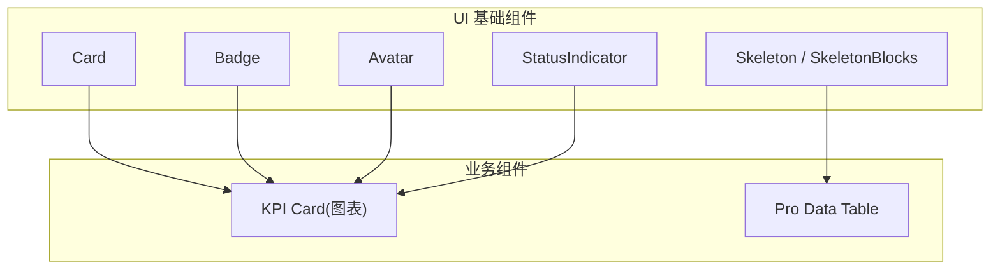
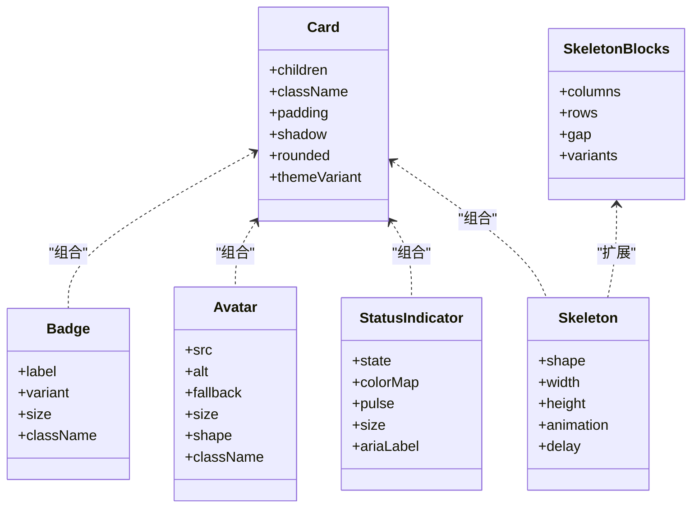
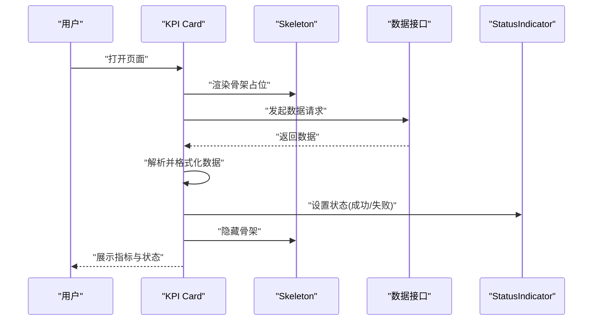
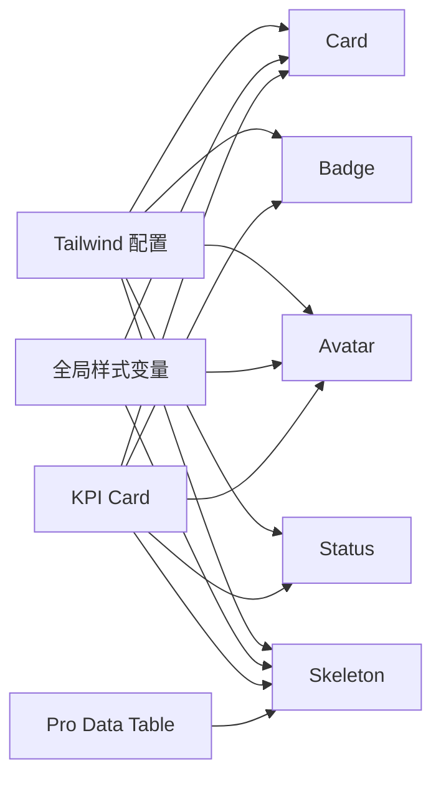

# 展示组件

<cite>
**本文引用的文件**   
- [web/src/components/ui/card.tsx](file://web/src/components/ui/card.tsx)
- [web/src/components/ui/badge.tsx](file://web/src/components/ui/badge.tsx)
- [web/src/components/ui/avatar.tsx](file://web/src/components/ui/avatar.tsx)
- [web/src/components/ui/status-indicator.tsx](file://web/src/components/ui/status-indicator.tsx)
- [web/src/components/ui/skeleton.tsx](file://web/src/components/ui/skeleton.tsx)
- [web/src/components/ui/skeleton-blocks.tsx](file://web/src/components/ui/skeleton-blocks.tsx)
- [web/src/styles/globals.css](file://web/src/styles/globals.css)
- [web/tailwind.config.js](file://web/tailwind.config.js)
- [web/src/components/charts/kpi-card.tsx](file://web/src/components/charts/kpi-card.tsx)
- [web/src/components/data-table/pro-data-table.tsx](file://web/src/components/data-table/pro-data-table.tsx)
</cite>

## 目录
1. [简介](#简介)
2. [项目结构](#项目结构)
3. [核心组件](#核心组件)
4. [架构总览](#架构总览)
5. [详细组件分析](#详细组件分析)
6. [依赖关系分析](#依赖关系分析)
7. [性能考量](#性能考量)
8. [故障排查指南](#故障排查指南)
9. [结论](#结论)
10. [附录](#附录) 

## 简介
本文件聚焦 FY200 前端展示层中的基础 UI 组件：Card、Badge、Avatar、StatusIndicator、Skeleton。文档从设计模式、样式定制、主题支持、响应式实现、状态与动画、加载态处理、可访问性与跨浏览器兼容性等维度进行系统化说明，并提供使用示例、组合模式与最佳实践，帮助开发者在数据看板与报表场景中高效复用这些组件。

## 项目结构
FY200 的前端采用 React + TypeScript + Vite + Tailwind CSS 的技术栈。展示组件统一位于 web/src/components/ui 目录下，图表与表格等业务组件通过组合这些基础组件构建更丰富的界面。Tailwind 负责原子化样式与主题变量，全局样式集中在 styles/globals.css 中。

**图示来源** 
- [web/src/components/ui/card.tsx](file://web/src/components/ui/card.tsx)
- [web/src/components/ui/badge.tsx](file://web/src/components/ui/badge.tsx)
- [web/src/components/ui/avatar.tsx](file://web/src/components/ui/avatar.tsx)
- [web/src/components/ui/status-indicator.tsx](file://web/src/components/ui/status-indicator.tsx)
- [web/src/components/ui/skeleton.tsx](file://web/src/components/ui/skeleton.tsx)
- [web/src/components/ui/skeleton-blocks.tsx](file://web/src/components/ui/skeleton-blocks.tsx)
- [web/src/components/charts/kpi-card.tsx](file://web/src/components/charts/kpi-card.tsx)
- [web/src/components/data-table/pro-data-table.tsx](file://web/src/components/data-table/pro-data-table.tsx)

**章节来源**
- [web/src/styles/globals.css](file://web/src/styles/globals.css)
- [web/tailwind.config.js](file://web/tailwind.config.js)

## 核心组件
本节对五个展示组件进行概览性说明，涵盖职责边界、常用属性、样式与主题扩展点、响应式策略、状态与动画、可访问性要点。

- Card（卡片容器）
  - 职责：为内容提供统一的视觉容器、阴影、圆角、内边距与布局槽位。
  - 样式定制：通过 Tailwind 类名或自定义 CSS 变量控制背景、边框、阴影、间距；支持暗色主题切换。
  - 响应式：基于栅格与断点适配不同屏幕尺寸，内部子元素可采用弹性布局自动换行。
  - 状态与动画：hover/active 态过渡、展开收起的过渡动画。
  - 可访问性：语义化标签、ARIA 描述、键盘可达。

- Badge（徽标）
  - 职责：用于标签、计数、状态提示等轻量标识。
  - 样式定制：颜色变体（成功、警告、错误、信息）、尺寸变体、是否带边框/填充。
  - 响应式：在小屏下自动调整字号与间距。
  - 状态与动画：新增时的入场动画、数量变化时的缩放反馈。
  - 可访问性：role="status"、aria-label、对比度达标。

- Avatar（头像）
  - 职责：展示用户或实体头像，支持占位符、首字母缩写、加载失败回退。
  - 样式定制：尺寸、形状（圆形/方形）、边框、阴影、主题色。
  - 响应式：根据容器宽度自适应尺寸。
  - 状态与动画：加载骨架、错误回退、悬停放大。
  - 可访问性：alt 文本、焦点可见性。

- StatusIndicator（状态指示器）
  - 职责：以点/线/图标等形式表达系统或数据状态（在线、离线、异常、处理中等）。
  - 样式定制：颜色映射、脉冲动画、大小与位置。
  - 响应式：在不同密度布局下保持可读性。
  - 状态与动画：脉冲、闪烁、渐变过渡。
  - 可访问性：语义化状态、辅助文本、高对比度。

- Skeleton（骨架屏）
  - 职责：在数据加载期间提供占位骨架，提升感知性能。
  - 样式定制：形状、尺寸、动画方向、颜色与透明度。
  - 响应式：按列数与间距动态生成骨架块。
  - 状态与动画：shimmer 动画、延迟显示避免闪烁。
  - 可访问性：aria-busy、aria-live 配合真实内容替换。

**章节来源**
- [web/src/components/ui/card.tsx](file://web/src/components/ui/card.tsx)
- [web/src/components/ui/badge.tsx](file://web/src/components/ui/badge.tsx)
- [web/src/components/ui/avatar.tsx](file://web/src/components/ui/avatar.tsx)
- [web/src/components/ui/status-indicator.tsx](file://web/src/components/ui/status-indicator.tsx)
- [web/src/components/ui/skeleton.tsx](file://web/src/components/ui/skeleton.tsx)
- [web/src/components/ui/skeleton-blocks.tsx](file://web/src/components/ui/skeleton-blocks.tsx)

## 架构总览
展示组件遵循“原子化样式 + 语义化结构”的设计原则，通过 Tailwind 配置与全局样式变量实现主题化。业务组件（如 KPI Card、Pro Data Table）组合基础组件形成复杂界面，保证一致性与可维护性。

**图示来源** 
- [web/src/components/ui/card.tsx](file://web/src/components/ui/card.tsx)
- [web/src/components/ui/badge.tsx](file://web/src/components/ui/badge.tsx)
- [web/src/components/ui/avatar.tsx](file://web/src/components/ui/avatar.tsx)
- [web/src/components/ui/status-indicator.tsx](file://web/src/components/ui/status-indicator.tsx)
- [web/src/components/ui/skeleton.tsx](file://web/src/components/ui/skeleton.tsx)
- [web/src/components/ui/skeleton-blocks.tsx](file://web/src/components/ui/skeleton-blocks.tsx)

## 详细组件分析

### Card（卡片容器）
- 设计模式
  - 容器型组件，提供一致的视觉基线与布局槽位（头部、主体、底部）。
  - 通过 props 暴露主题变体（如浅色/深色、强调色），并允许 className 覆盖默认样式。
- 样式定制选项
  - 背景与边框：通过 Tailwind 类名或 CSS 变量控制。
  - 阴影与圆角：支持多档阴影强度与圆角半径。
  - 内边距：紧凑/舒适/宽松三档。
- 主题支持
  - 基于 Tailwind 的 color palette 与 dark mode 媒体查询，结合全局变量实现一键换肤。
- 响应式设计
  - 使用 flex/grid 布局，配合断点控制列数与间距；在小屏下自动堆叠。
- 状态管理与动画
  - hover/active 过渡；展开区域使用 transform/opacity 过渡。
- 可访问性
  - 语义化 div/section，必要时添加 role 与 aria-*；确保焦点顺序合理。
- 使用示例与组合模式
  - 与 Badge、Avatar、StatusIndicator 组合呈现指标卡；与 Skeleton 组合实现加载骨架。
- 最佳实践
  - 避免过度嵌套；将主题与尺寸作为 props 传入，减少重复样式。

**章节来源**
- [web/src/components/ui/card.tsx](file://web/src/components/ui/card.tsx)
- [web/src/styles/globals.css](file://web/src/styles/globals.css)
- [web/tailwind.config.js](file://web/tailwind.config.js)

### Badge（徽标）
- 设计模式
  - 轻量级标签组件，支持多种变体（成功、警告、错误、信息）与尺寸。
- 样式定制选项
  - 颜色、填充/描边、圆角、字号、内外边距均可通过 props 或 className 覆盖。
- 主题支持
  - 使用主题色板，支持暗色模式下的对比度优化。
- 响应式设计
  - 小屏下字号与间距缩小，避免溢出。
- 状态管理与动画
  - 新增时入场动画；数值变化时轻微缩放反馈。
- 可访问性
  - 使用 role="status" 与 aria-label 描述状态；确保色彩对比度符合 WCAG。
- 使用示例与组合模式
  - 与按钮组合表示操作状态；与列表项组合表示分类标签。
- 最佳实践
  - 避免在同一行堆叠过多 Badge；优先使用语义化文案而非纯颜色传达含义。

**章节来源**
- [web/src/components/ui/badge.tsx](file://web/src/components/ui/badge.tsx)
- [web/tailwind.config.js](file://web/tailwind.config.js)

### Avatar（头像）
- 设计模式
  - 头像展示组件，支持图片、首字母缩写、占位图与错误回退。
- 样式定制选项
  - 尺寸、形状（圆形/方形）、边框、阴影、主题色均可配置。
- 主题支持
  - 通过主题变量控制背景与边框色，适配暗色模式。
- 响应式设计
  - 根据容器宽度自适应尺寸；在小屏下保持可读性。
- 状态管理与动画
  - 加载骨架、错误回退、悬停放大效果。
- 可访问性
  - alt 文本描述；焦点可见性；错误状态提供辅助说明。
- 使用示例与组合模式
  - 与用户名、角色标签并列展示；与状态指示器组合表示在线状态。
- 最佳实践
  - 始终提供 fallback；避免过大图片导致重排；懒加载大图。

**章节来源**
- [web/src/components/ui/avatar.tsx](file://web/src/components/ui/avatar.tsx)
- [web/src/styles/globals.css](file://web/src/styles/globals.css)

### StatusIndicator（状态指示器）
- 设计模式
  - 以点/线/图标表达状态，支持颜色映射与动画（脉冲、闪烁）。
- 样式定制选项
  - 颜色、大小、位置、动画类型可通过 props 配置。
- 主题支持
  - 使用主题色板定义状态色，暗色模式下自动调整亮度。
- 响应式设计
  - 在不同密度布局下保持清晰可见。
- 状态管理与动画
  - 脉冲动画用于在线/处理中；闪烁用于告警；平滑过渡用于状态切换。
- 可访问性
  - 语义化状态描述；aria-live 更新状态；高对比度模式兼容。
- 使用示例与组合模式
  - 与列表项、表格行、卡片头部组合，快速传达状态。
- 最佳实践
  - 避免滥用动画影响性能；为关键状态提供文本说明。

**章节来源**
- [web/src/components/ui/status-indicator.tsx](file://web/src/components/ui/status-indicator.tsx)
- [web/tailwind.config.js](file://web/tailwind.config.js)

### Skeleton（骨架屏）
- 设计模式
  - 占位骨架组件，模拟真实内容的形状与布局，提升加载感知。
- 样式定制选项
  - 形状（矩形、圆形、椭圆）、尺寸、动画方向、颜色与透明度。
- 主题支持
  - 使用主题灰阶与明暗对比，适配暗色模式。
- 响应式设计
  - 根据列数与间距动态生成骨架块，适配不同屏幕。
- 状态管理与动画
  - shimmer 动画；延迟显示避免首次渲染闪烁；与真实数据替换时平滑过渡。
- 可访问性
  - aria-busy="true" 表示加载中；替换后移除；配合 aria-live 播报新内容。
- 使用示例与组合模式
  - 与列表、表格、卡片组合，在数据请求期间显示骨架。
- 最佳实践
  - 骨架结构与真实内容保持一致；避免过度动画；按需渲染。

**章节来源**
- [web/src/components/ui/skeleton.tsx](file://web/src/components/ui/skeleton.tsx)
- [web/src/components/ui/skeleton-blocks.tsx](file://web/src/components/ui/skeleton-blocks.tsx)
- [web/src/styles/globals.css](file://web/src/styles/globals.css)

### 组合模式与典型流程
以下序列图展示 KPI 卡片在数据加载期间的交互流程：先显示骨架，再逐步替换为真实内容与状态指示。

**图示来源** 
- [web/src/components/charts/kpi-card.tsx](file://web/src/components/charts/kpi-card.tsx)
- [web/src/components/ui/skeleton.tsx](file://web/src/components/ui/skeleton.tsx)
- [web/src/components/ui/status-indicator.tsx](file://web/src/components/ui/status-indicator.tsx)

## 依赖关系分析
展示组件主要依赖 Tailwind 原子化样式与全局主题变量。业务组件通过组合基础组件构建复杂界面，降低耦合度并提高复用性。

**图示来源** 
- [web/tailwind.config.js](file://web/tailwind.config.js)
- [web/src/styles/globals.css](file://web/src/styles/globals.css)
- [web/src/components/charts/kpi-card.tsx](file://web/src/components/charts/kpi-card.tsx)
- [web/src/components/data-table/pro-data-table.tsx](file://web/src/components/data-table/pro-data-table.tsx)

**章节来源**
- [web/tailwind.config.js](file://web/tailwind.config.js)
- [web/src/styles/globals.css](file://web/src/styles/globals.css)

## 性能考量
- 骨架屏按需渲染：仅在需要加载的区域启用 skeleton，避免全页骨架造成重绘。
- 动画节流：对频繁状态切换的组件（如 StatusIndicator）限制动画频率，减少重排。
- 图片懒加载：Avatar 的图片使用懒加载与占位图，降低初始负载。
- 主题切换：通过 CSS 变量与 Tailwind 的 dark mode 实现无刷新换肤，避免重新计算样式。
- 组件拆分：将大组件拆分为小组件，利用 React.memo 与 useMemo 减少不必要的重渲染。

[本节为通用指导，不直接分析具体文件]

## 故障排查指南
- 主题未生效
  - 检查 Tailwind 的 dark mode 配置与全局变量是否正确引入。
  - 确认组件的 className 未被外部样式覆盖。
- 骨架屏闪烁
  - 增加延迟显示时间；确保骨架结构与真实内容一致。
  - 检查数据请求失败分支是否正确隐藏骨架。
- 状态指示器不可见
  - 检查颜色对比度是否符合 WCAG；在暗色模式下调整亮度。
  - 确认 aria-label 与辅助文本正确设置。
- 头像加载失败
  - 提供可靠的 fallback 图像；检查网络与 CORS 配置。
  - 为错误状态提供用户提示。

**章节来源**
- [web/src/components/ui/skeleton.tsx](file://web/src/components/ui/skeleton.tsx)
- [web/src/components/ui/avatar.tsx](file://web/src/components/ui/avatar.tsx)
- [web/src/components/ui/status-indicator.tsx](file://web/src/components/ui/status-indicator.tsx)
- [web/tailwind.config.js](file://web/tailwind.config.js)
- [web/src/styles/globals.css](file://web/src/styles/globals.css)

## 结论
FY200 的展示组件体系以原子化样式与语义化结构为核心，通过 Card、Badge、Avatar、StatusIndicator、Skeleton 的组合与扩展，构建了灵活、可主题化、响应式的界面基础。遵循本文的最佳实践与可访问性规范，可在数据看板与报表场景中快速搭建高质量的用户体验。

[本节为总结性内容，不直接分析具体文件]

## 附录
- 使用示例与组合模式
  - KPI 卡片：组合 Card、Badge、Avatar、StatusIndicator、Skeleton，实现指标展示与加载态。
  - 数据表格：在表格行中使用 Skeleton 占位，数据就绪后替换为真实内容。
- 最佳实践清单
  - 始终提供语义化标签与 ARIA 描述。
  - 使用主题变量与 Tailwind 类名统一管理样式。
  - 对小屏设备进行充分测试，确保布局与可读性。
  - 对动画与骨架屏进行性能监控，避免卡顿。

[本节为补充信息，不直接分析具体文件]