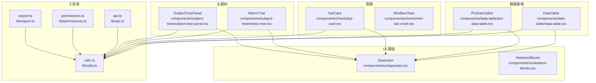
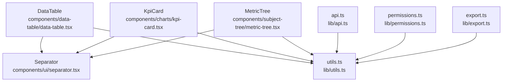
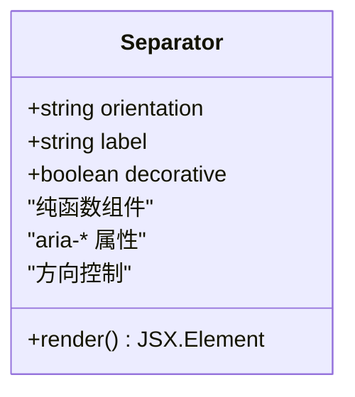
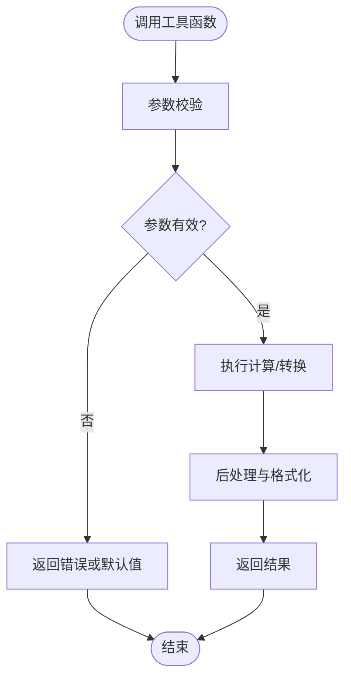
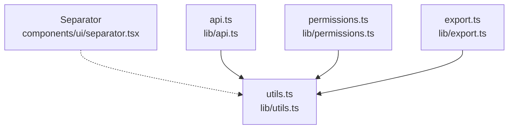

# 工具组件

<cite>
**本文引用的文件**   
- [separator.tsx](file://web/src/components/ui/separator.tsx)
- [utils.ts](file://web/src/lib/utils.ts)
- [data-table.tsx](file://web/src/components/data-table/data-table.tsx)
- [pro-data-table.tsx](file://web/src/components/data-table/pro-data-table.tsx)
- [metric-tree.tsx](file://web/src/components/subject-tree/metric-tree.tsx)
- [subject-tree-panel.tsx](file://web/src/components/subject-tree/subject-tree-panel.tsx)
- [kpi-card.tsx](file://web/src/components/charts/kpi-card.tsx)
- [mini-bar-chart.tsx](file://web/src/components/charts/mini-bar-chart.tsx)
- [skeleton-blocks.tsx](file://web/src/components/ui/skeleton-blocks.tsx)
- [api.ts](file://web/src/lib/api.ts)
- [permissions.ts](file://web/src/lib/permissions.ts)
- [export.ts](file://web/src/lib/export.ts)
</cite>

## 目录
1. [简介](#简介)
2. [项目结构](#项目结构)
3. [核心组件](#核心组件)
4. [架构总览](#架构总览)
5. [详细组件分析](#详细组件分析)
6. [依赖关系分析](#依赖关系分析)
7. [性能考量](#性能考量)
8. [故障排查指南](#故障排查指南)
9. [结论](#结论)
10. [附录](#附录)

## 简介
本文件聚焦 FY200 前端工具与辅助组件，重点解析 Separator 等 UI 辅助组件的职责、使用场景与最佳实践；同时梳理通用工具函数的实现思路、类型定义、错误处理机制。文档强调纯函数设计、副作用管理与性能优化策略，并提供组合模式与扩展方法示例，以及单元测试覆盖与类型安全保证的实践要点。

## 项目结构
FY200 前端采用按功能域组织的方式：UI 基础组件位于 components/ui，业务图表在 components/charts，数据表格在 components/data-table，主题树在 components/subject-tree，通用工具函数集中在 lib 目录。Separator 作为基础 UI 组件，被多处布局与展示组件复用，用于视觉分隔与可访问性语义。

**图示来源** 
- [separator.tsx](file://web/src/components/ui/separator.tsx)
- [data-table.tsx](file://web/src/components/data-table/data-table.tsx)
- [pro-data-table.tsx](file://web/src/components/data-table/pro-data-table.tsx)
- [metric-tree.tsx](file://web/src/components/subject-tree/metric-tree.tsx)
- [subject-tree-panel.tsx](file://web/src/components/subject-tree/subject-tree-panel.tsx)
- [kpi-card.tsx](file://web/src/components/charts/kpi-card.tsx)
- [mini-bar-chart.tsx](file://web/src/components/charts/mini-bar-chart.tsx)
- [skeleton-blocks.tsx](file://web/src/components/ui/skeleton-blocks.tsx)
- [utils.ts](file://web/src/lib/utils.ts)
- [api.ts](file://web/src/lib/api.ts)
- [permissions.ts](file://web/src/lib/permissions.ts)
- [export.ts](file://web/src/lib/export.ts)

**章节来源**
- [separator.tsx](file://web/src/components/ui/separator.tsx)
- [utils.ts](file://web/src/lib/utils.ts)

## 核心组件
- Separator（分隔线）
  - 职责：提供水平或垂直分隔线，承载 aria 语义，提升可访问性与可读性。
  - 典型用法：在面板标题与内容之间、列表项之间、卡片区块之间进行视觉分割。
  - 设计要点：无状态纯组件，仅渲染最小 DOM，避免不必要的样式计算。
- SkeletonBlocks（骨架屏块）
  - 职责：占位加载效果，减少首屏感知延迟。
  - 设计要点：通过 CSS 动画与最小化重排，配合懒加载策略。
- 工具函数 utils.ts
  - 职责：通用字符串、数值、日期、数组等纯函数工具。
  - 设计要点：纯函数、不可变输入输出、明确类型签名、边界条件处理。

**章节来源**
- [separator.tsx](file://web/src/components/ui/separator.tsx)
- [skeleton-blocks.tsx](file://web/src/components/ui/skeleton-blocks.tsx)
- [utils.ts](file://web/src/lib/utils.ts)

## 架构总览
Separator 作为原子级 UI 组件，被上层数据表格、图表与主题树等复合组件组合使用。工具函数 utils.ts 为各组件提供纯函数能力，API、权限与导出模块则封装业务侧的副作用逻辑，遵循“视图层尽量纯”的原则。

**图示来源** 
- [separator.tsx](file://web/src/components/ui/separator.tsx)
- [data-table.tsx](file://web/src/components/data-table/data-table.tsx)
- [kpi-card.tsx](file://web/src/components/charts/kpi-card.tsx)
- [metric-tree.tsx](file://web/src/components/subject-tree/metric-tree.tsx)
- [utils.ts](file://web/src/lib/utils.ts)
- [api.ts](file://web/src/lib/api.ts)
- [permissions.ts](file://web/src/lib/permissions.ts)
- [export.ts](file://web/src/lib/export.ts)

## 详细组件分析

### Separator 组件分析
- 设计目标：提供轻量、可访问的分隔线，支持方向控制与可选标签。
- 关键特性：
  - 纯函数式渲染：无内部状态，props 驱动。
  - 可访问性：设置合适的 role 与 aria 属性，便于屏幕阅读器识别。
  - 方向控制：水平/垂直两种布局，适配不同排版需求。
  - 样式隔离：通过 Tailwind 类名组合，避免全局污染。
- 使用场景：
  - 数据表格头部与内容区之间的分割。
  - 指标卡片的区块划分。
  - 主题树节点间的层次区分。
- 组合模式：
  - 与标题、描述文本组合，形成清晰的信息层级。
  - 与按钮组、表单控件组合，提升交互清晰度。

**图示来源** 
- [separator.tsx](file://web/src/components/ui/separator.tsx)

**章节来源**
- [separator.tsx](file://web/src/components/ui/separator.tsx)

### 工具函数 utils.ts 分析
- 设计原则：
  - 纯函数：相同输入产生相同输出，无外部副作用。
  - 类型安全：严格 TypeScript 类型定义，避免运行时错误。
  - 边界处理：对空值、NaN、越界索引等进行防御性编程。
- 常见能力：
  - 字符串处理：格式化、清洗、大小写转换。
  - 数值处理：四舍五入、单位换算、范围校验。
  - 日期处理：格式化、时区转换、周期计算。
  - 数组处理：去重、分组、排序、过滤。
- 错误处理：
  - 返回明确的错误码或抛出结构化异常。
  - 提供默认值与降级策略，确保健壮性。

**图示来源** 
- [utils.ts](file://web/src/lib/utils.ts)

**章节来源**
- [utils.ts](file://web/src/lib/utils.ts)

### 数据表格中的 Separator 使用
- 作用：在表头、分页器、筛选栏等区域之间提供视觉分隔。
- 优势：保持界面一致性，提升信息层次清晰度。
- 注意事项：避免过度使用导致界面碎片化。

**章节来源**
- [data-table.tsx](file://web/src/components/data-table/data-table.tsx)
- [pro-data-table.tsx](file://web/src/components/data-table/pro-data-table.tsx)

### 图表组件中的 Separator 使用
- KpiCard：在指标值与趋势说明之间插入分隔线，增强可读性。
- MiniBarChart：在图例与图表主体之间添加分隔，提升布局整洁度。

**章节来源**
- [kpi-card.tsx](file://web/src/components/charts/kpi-card.tsx)
- [mini-bar-chart.tsx](file://web/src/components/charts/mini-bar-chart.tsx)

### 主题树中的 Separator 使用
- MetricTree：在节点展开/收起区域之间使用分隔线，强化层级结构。
- SubjectTreePanel：在面板标题与内容之间添加分隔，提升视觉层次。

**章节来源**
- [metric-tree.tsx](file://web/src/components/subject-tree/metric-tree.tsx)
- [subject-tree-panel.tsx](file://web/src/components/subject-tree/subject-tree-panel.tsx)

## 依赖关系分析
Separator 与工具函数 utils.ts 之间存在松耦合关系：Separator 主要依赖样式系统，而 utils.ts 提供跨组件的纯函数能力。API、权限与导出模块则封装业务副作用，与视图层解耦。

**图示来源** 
- [separator.tsx](file://web/src/components/ui/separator.tsx)
- [utils.ts](file://web/src/lib/utils.ts)
- [api.ts](file://web/src/lib/api.ts)
- [permissions.ts](file://web/src/lib/permissions.ts)
- [export.ts](file://web/src/lib/export.ts)

**章节来源**
- [separator.tsx](file://web/src/components/ui/separator.tsx)
- [utils.ts](file://web/src/lib/utils.ts)
- [api.ts](file://web/src/lib/api.ts)
- [permissions.ts](file://web/src/lib/permissions.ts)
- [export.ts](file://web/src/lib/export.ts)

## 性能考量
- 纯函数优先：工具函数保持无副作用，便于缓存与测试。
- 最小化重绘：Separator 仅渲染必要 DOM，避免复杂样式计算。
- 懒加载与虚拟滚动：大数据表格中结合虚拟滚动减少渲染压力。
- 防抖与节流：高频操作（如搜索、滚动）使用防抖/节流优化。
- 内存管理：及时释放事件监听与定时器，避免内存泄漏。

## 故障排查指南
- Separator 不显示：检查 props 是否正确传递，确认样式类名未被覆盖。
- 工具函数报错：验证输入参数类型与格式，查看边界条件处理逻辑。
- 性能问题：使用浏览器性能面板分析重排重绘，定位瓶颈组件。
- 可访问性问题：使用屏幕阅读器测试，确保 aria 属性正确设置。

## 结论
Separator 作为基础 UI 组件，通过纯函数设计与可访问性支持，为 FY200 前端提供了稳定可靠的视觉分隔能力。工具函数 utils.ts 以纯函数为核心，保障类型安全与健壮性。通过合理的组合模式与性能优化策略，整体架构实现了高内聚、低耦合的目标。

## 附录
- 单元测试建议：
  - Separator：渲染快照测试、ARIA 属性验证、方向切换测试。
  - utils.ts：边界值测试、异常输入测试、输出格式验证。
- 类型安全保证：
  - 使用 TypeScript 严格模式，定义明确的接口与类型别名。
  - 利用泛型与联合类型提升代码表达力与安全性。
- 扩展方法：
  - 为 Separator 添加自定义样式变体，支持主题切换。
  - 扩展 utils.ts 工具函数，满足特定业务场景需求。