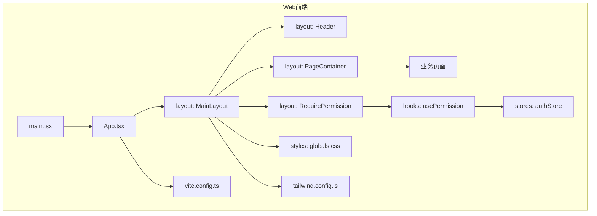
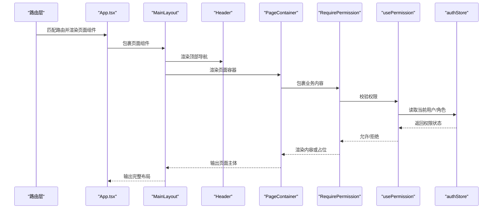
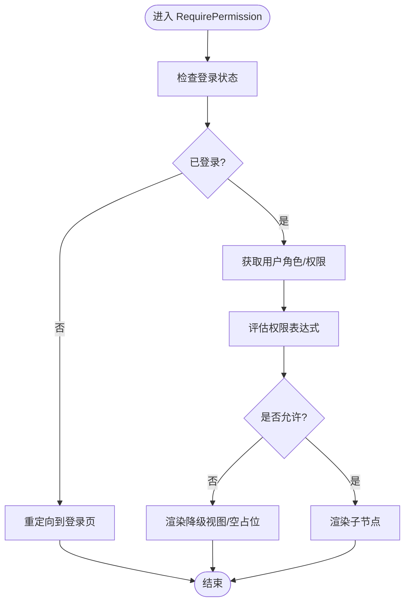
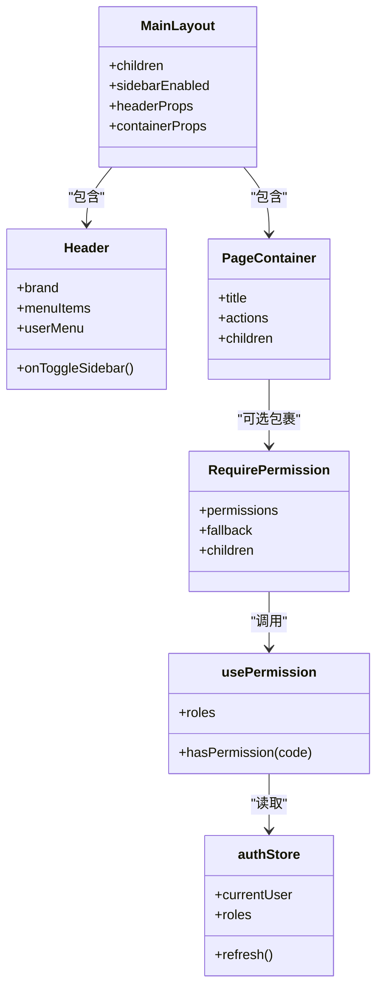

# 布局组件

<cite>
**本文引用的文件**   
- [header.tsx](file://web/src/components/layout/header.tsx)
- [main-layout.tsx](file://web/src/components/layout/main-layout.tsx)
- [page-container.tsx](file://web/src/components/layout/page-container.tsx)
- [require-permission.tsx](file://web/src/components/layout/require-permission.tsx)
- [usePermission.ts](file://web/src/hooks/usePermission.ts)
- [authStore.ts](file://web/src/stores/authStore.ts)
- [App.tsx](file://web/src/App.tsx)
- [main.tsx](file://web/src/main.tsx)
- [globals.css](file://web/src/styles/globals.css)
- [tailwind.config.js](file://web/tailwind.config.js)
- [vite.config.ts](file://web/vite.config.ts)
</cite>

## 目录
1. [简介](#简介)
2. [项目结构](#项目结构)
3. [核心组件](#核心组件)
4. [架构总览](#架构总览)
5. [详细组件分析](#详细组件分析)
6. [依赖关系分析](#依赖关系分析)
7. [性能考量](#性能考量)
8. [故障排查指南](#故障排查指南)
9. [结论](#结论)
10. [附录](#附录)

## 简介
本文件面向FY200项目的布局子系统，系统性阐述Header、MainLayout、PageContainer、RequirePermission等布局组件的设计模式与组合方式。重点覆盖：
- 页面布局结构与嵌套布局实现
- 响应式适配与移动端体验
- 权限控制集成（路由守卫与组件级守卫）
- 插槽机制与内容分发
- 与路由集成的最佳实践
- 可访问性（a11y）实现要点

## 项目结构
布局相关代码位于 web/src/components/layout 目录，配合 hooks、stores、样式与构建配置共同构成完整的布局体系。

图表来源
- [main.tsx](file://web/src/main.tsx)
- [App.tsx](file://web/src/App.tsx)
- [main-layout.tsx](file://web/src/components/layout/main-layout.tsx)
- [header.tsx](file://web/src/components/layout/header.tsx)
- [page-container.tsx](file://web/src/components/layout/page-container.tsx)
- [require-permission.tsx](file://web/src/components/layout/require-permission.tsx)
- [usePermission.ts](file://web/src/hooks/usePermission.ts)
- [authStore.ts](file://web/src/stores/authStore.ts)
- [globals.css](file://web/src/styles/globals.css)
- [tailwind.config.js](file://web/tailwind.config.js)
- [vite.config.ts](file://web/vite/config.ts)

章节来源
- [main.tsx](file://web/src/main.tsx)
- [App.tsx](file://web/src/App.tsx)
- [main-layout.tsx](file://web/src/components/layout/main-layout.tsx)
- [header.tsx](file://web/src/components/layout/header.tsx)
- [page-container.tsx](file://web/src/components/layout/page-container.tsx)
- [require-permission.tsx](file://web/src/components/layout/require-permission.tsx)
- [usePermission.ts](file://web/src/hooks/usePermission.ts)
- [authStore.ts](file://web/src/stores/authStore.ts)
- [globals.css](file://web/src/styles/globals.css)
- [tailwind.config.js](file://web/tailwind.config.js)
- [vite.config.ts](file://web/vite/config.ts)

## 核心组件
- Header：顶部导航与全局操作区，承载品牌、用户信息、主题切换、通知入口等。
- MainLayout：应用主框架，组织侧边栏（可选）、头部、主体区域与页脚，提供统一的栅格与间距。
- PageContainer：页面容器，负责页面内边距、卡片化背景、标题区与工具栏槽位，统一页面视觉基线。
- RequirePermission：权限守卫组件，基于角色/权限码进行渲染控制，支持“无权限占位”或“降级展示”。

章节来源
- [header.tsx](file://web/src/components/layout/header.tsx)
- [main-layout.tsx](file://web/src/components/layout/main-layout.tsx)
- [page-container.tsx](file://web/src/components/layout/page-container.tsx)
- [require-permission.tsx](file://web/src/components/layout/require-permission.tsx)

## 架构总览
布局子系统采用“组合优先”的React模式：通过父子组件组合、插槽分发与高阶守卫，将通用UI能力与业务页面解耦。

图表来源
- [App.tsx](file://web/src/App.tsx)
- [main-layout.tsx](file://web/src/components/layout/main-layout.tsx)
- [header.tsx](file://web/src/components/layout/header.tsx)
- [page-container.tsx](file://web/src/components/layout/page-container.tsx)
- [require-permission.tsx](file://web/src/components/layout/require-permission.tsx)
- [usePermission.ts](file://web/src/hooks/usePermission.ts)
- [authStore.ts](file://web/src/stores/authStore.ts)

## 详细组件分析

### Header 组件
职责与特性
- 顶部导航结构：Logo/品牌、主导航、搜索、通知、用户菜单
- 响应式行为：移动端折叠为抽屉或汉堡菜单
- 主题与国际化入口（如启用）
- 无障碍：键盘可达、ARIA标签、焦点管理

设计模式
- 受控/非受控混合：根据外部状态控制展开/收起
- 事件委托：统一处理点击、键盘事件
- 插槽：预留“左侧/右侧”插槽以扩展按钮或菜单

响应式与可访问性
- 使用Tailwind断点实现移动端适配
- 关键交互元素具备aria-*属性与role语义
- 焦点可见性与顺序符合WCAG建议

章节来源
- [header.tsx](file://web/src/components/layout/header.tsx)
- [globals.css](file://web/src/styles/globals.css)
- [tailwind.config.js](file://web/tailwind.config.js)

### MainLayout 组件
职责与特性
- 整体骨架：固定头部+可滚动主体+可选页脚
- 侧边栏集成（若启用）：可折叠、宽度自适应
- 栅格与间距：统一padding/margin，保证页面一致性
- 路由联动：高亮当前路由、面包屑（可选）

设计模式
- 复合组件：通过children插槽注入页面内容
- 状态提升：与路由库协作，保持导航状态同步
- 主题适配：依据根节点class切换明暗主题

响应式与可访问性
- 小屏隐藏侧边栏，提供抽屉入口
- 主体区域设置tabindex与skip-link，提升键盘导航体验

章节来源
- [main-layout.tsx](file://web/src/components/layout/main-layout.tsx)
- [globals.css](file://web/src/styles/globals.css)
- [tailwind.config.js](file://web/tailwind.config.js)

### PageContainer 组件
职责与特性
- 页面内边距与背景：统一卡片化容器
- 标题区与工具栏：支持标题、副标题、操作按钮插槽
- 内容区：承载业务页面内容，支持分页/加载态

设计模式
- 插槽分发：title、actions、content三个插槽，便于复用
- 条件渲染：根据权限或数据状态显示不同区块
- 错误边界：捕获子树异常并展示友好提示

响应式与可访问性
- 标题与操作在小屏自动换行
- 标题层级h1/h2语义正确，操作按钮具备aria-label

章节来源
- [page-container.tsx](file://web/src/components/layout/page-container.tsx)
- [globals.css](file://web/src/styles/globals.css)
- [tailwind.config.js](file://web/tailwind.config.js)

### RequirePermission 组件
职责与特性
- 权限守卫：根据角色/权限码决定是否渲染子节点
- 无权限策略：默认隐藏；可配置降级视图或跳转
- 细粒度控制：支持多个权限码“与/或”逻辑

设计模式
- 高阶组件/渲染回调：避免重复判断逻辑
- 与usePermission钩子协同：集中权限计算
- 与路由守卫互补：组件级快速拦截

权限流程示意

图表来源
- [require-permission.tsx](file://web/src/components/layout/require-permission.tsx)
- [usePermission.ts](file://web/src/hooks/usePermission.ts)
- [authStore.ts](file://web/src/stores/authStore.ts)

章节来源
- [require-permission.tsx](file://web/src/components/layout/require-permission.tsx)
- [usePermission.ts](file://web/src/hooks/usePermission.ts)
- [authStore.ts](file://web/src/stores/authStore.ts)

### 插槽机制与内容分发
- 插槽定义：在PageContainer中声明title/actions/content插槽，父组件按需传入
- 条件渲染：结合权限守卫，对特定插槽内容进行过滤
- 嵌套布局：MainLayout作为外层容器，PageContainer作为页面容器，二者通过children组合

示例说明（路径引用）
- 插槽使用位置参考：[page-container.tsx](file://web/src/components/layout/page-container.tsx)
- 组合示例参考：[main-layout.tsx](file://web/src/components/layout/main-layout.tsx)

章节来源
- [page-container.tsx](file://web/src/components/layout/page-container.tsx)
- [main-layout.tsx](file://web/src/components/layout/main-layout.tsx)

### 路由集成与权限守卫使用模式
- 路由层：在App.tsx中按模块划分路由，敏感路由可加路由级守卫
- 组件层：在页面内部用RequirePermission包裹需要权限的内容块
- 状态源：usePermission从authStore读取当前用户与角色，计算权限结果

推荐模式
- 路由级：仅做登录态与粗粒度角色检查
- 组件级：做细粒度权限码检查与降级展示
- 数据级：接口请求前再次校验，失败时回退

章节来源
- [App.tsx](file://web/src/App.tsx)
- [require-permission.tsx](file://web/src/components/layout/require-permission.tsx)
- [usePermission.ts](file://web/src/hooks/usePermission.ts)
- [authStore.ts](file://web/src/stores/authStore.ts)

## 依赖关系分析
布局组件之间的依赖与协作如下：

图表来源
- [main-layout.tsx](file://web/src/components/layout/main-layout.tsx)
- [header.tsx](file://web/src/components/layout/header.tsx)
- [page-container.tsx](file://web/src/components/layout/page-container.tsx)
- [require-permission.tsx](file://web/src/components/layout/require-permission.tsx)
- [usePermission.ts](file://web/src/hooks/usePermission.ts)
- [authStore.ts](file://web/src/stores/authStore.ts)

章节来源
- [main-layout.tsx](file://web/src/components/layout/main-layout.tsx)
- [header.tsx](file://web/src/components/layout/header.tsx)
- [page-container.tsx](file://web/src/components/layout/page-container.tsx)
- [require-permission.tsx](file://web/src/components/layout/require-permission.tsx)
- [usePermission.ts](file://web/src/hooks/usePermission.ts)
- [authStore.ts](file://web/src/stores/authStore.ts)

## 性能考量
- 懒加载与代码分割：页面路由级懒加载，减少首屏体积
- 状态最小化：Header/MainLayout尽量无状态，复杂状态下沉至store
- 防抖节流：搜索、窗口resize等高频事件需节流
- 列表虚拟化：大数据表格使用虚拟滚动
- 缓存策略：静态资源与API响应合理缓存

章节来源
- [vite.config.ts](file://web/vite/config.ts)
- [globals.css](file://web/src/styles/globals.css)

## 故障排查指南
常见问题与定位步骤
- 权限不生效
  - 检查authStore是否正确初始化与刷新
  - 确认usePermission返回值与权限码一致
  - 查看RequirePermission的fallback分支是否被触发
- 布局错乱
  - 检查PageContainer的插槽是否遗漏
  - 确认Tailwind断点与自定义样式冲突
- 移动端交互异常
  - 验证Header的抽屉开关状态与事件绑定
  - 检查focus-trap与键盘导航

章节来源
- [require-permission.tsx](file://web/src/components/layout/require-permission.tsx)
- [usePermission.ts](file://web/src/hooks/usePermission.ts)
- [authStore.ts](file://web/src/stores/authStore.ts)
- [header.tsx](file://web/src/components/layout/header.tsx)
- [page-container.tsx](file://web/src/components/layout/page-container.tsx)
- [globals.css](file://web/src/styles/globals.css)

## 结论
FY200布局组件以组合为核心，通过Header、MainLayout、PageContainer与RequirePermission形成清晰的分层与职责边界。配合usePermission与authStore实现灵活的权限控制，借助Tailwind与CSS变量完成响应式与主题适配。建议在新增页面时遵循“路由级粗守卫 + 组件级细守卫 + 插槽化内容”的模式，确保可维护性与可扩展性。

## 附录
- 响应式断点与主题配置参考：[tailwind.config.js](file://web/tailwind.config.js)、[globals.css](file://web/src/styles/globals.css)
- 构建与打包优化参考：[vite.config.ts](file://web/vite/config.ts)
- 入口与路由挂载参考：[main.tsx](file://web/src/main.tsx)、[App.tsx](file://web/src/App.tsx)