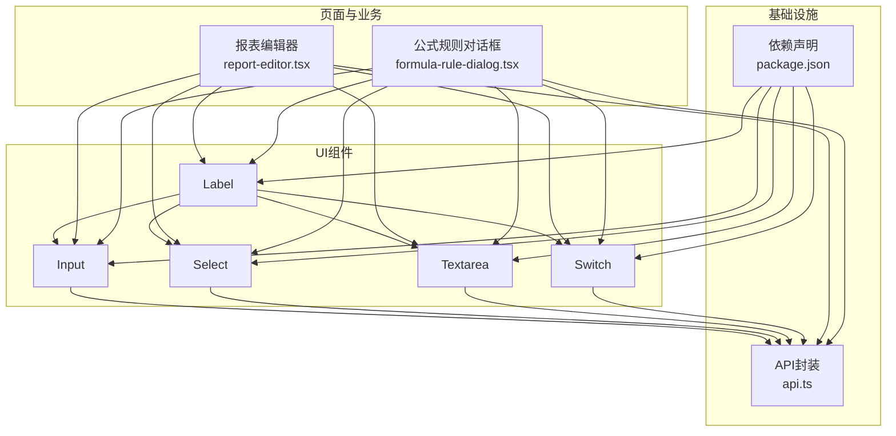
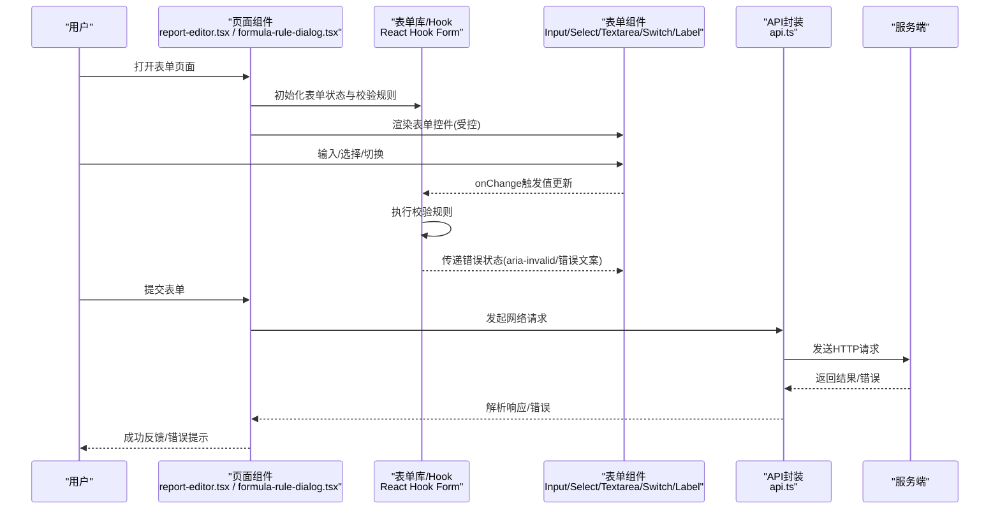
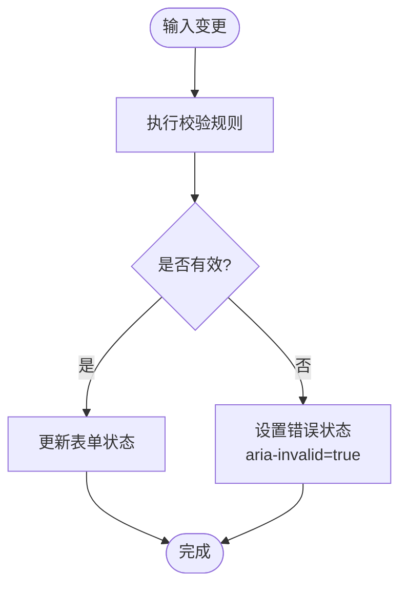
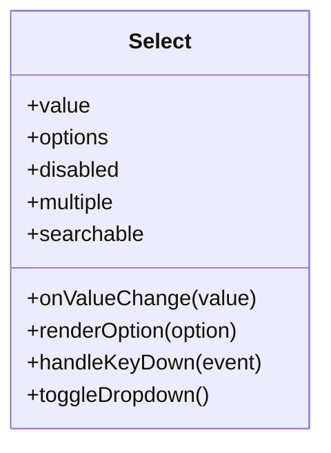
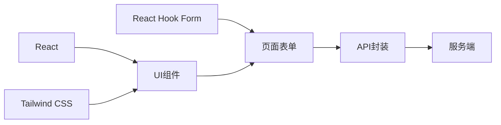

# 表单组件

<cite>
**本文引用的文件**   
- [web/src/components/ui/input.tsx](file://web/src/components/ui/input.tsx)
- [web/src/components/ui/select.tsx](file://web/src/components/ui/select.tsx)
- [web/src/components/ui/textarea.tsx](file://web/src/components/ui/textarea.tsx)
- [web/src/components/ui/switch.tsx](file://web/src/components/ui/switch.tsx)
- [web/src/components/ui/label.tsx](file://web/src/components/ui/label.tsx)
- [web/src/pages/reports/report-editor.tsx](file://web/src/pages/reports/report-editor.tsx)
- [web/src/pages/data/formula-rule-dialog.tsx](file://web/src/pages/data/formula-rule-dialog.tsx)
- [web/src/lib/api.ts](file://web/src/lib/api.ts)
- [web/package.json](file://web/package.json)
</cite>

## 目录
1. [简介](#简介)
2. [项目结构](#项目结构)
3. [核心组件](#核心组件)
4. [架构总览](#架构总览)
5. [详细组件分析](#详细组件分析)
6. [依赖分析](#依赖分析)
7. [性能考虑](#性能考虑)
8. [故障排查指南](#故障排查指南)
9. [结论](#结论)
10. [附录](#附录)

## 简介
本文件面向FY200项目的表单组件体系，聚焦Input、Select、Textarea、Switch、Label等基础UI组件的实现细节与使用规范。文档从组件Props接口、验证规则、错误处理、禁用状态、样式定制、可访问性（键盘导航、屏幕阅读器、焦点管理）等方面展开，并提供组合使用示例、最佳实践、性能优化建议以及与React Hook Form等表单库的集成方式。

## 项目结构
本项目前端位于 web 目录，表单相关的基础UI组件集中在 components/ui 下，页面级表单场景在 pages 中通过组合这些组件实现。API 调用封装在 lib/api.ts，包依赖定义在 package.json。

图表来源
- [web/src/components/ui/input.tsx](file://web/src/components/ui/input.tsx)
- [web/src/components/ui/select.tsx](file://web/src/components/ui/select.tsx)
- [web/src/components/ui/textarea.tsx](file://web/src/components/ui/textarea.tsx)
- [web/src/components/ui/switch.tsx](file://web/src/components/ui/switch.tsx)
- [web/src/components/ui/label.tsx](file://web/src/components/ui/label.tsx)
- [web/src/pages/reports/report-editor.tsx](file://web/src/pages/reports/report-editor.tsx)
- [web/src/pages/data/formula-rule-dialog.tsx](file://web/src/pages/data/formula-rule-dialog.tsx)
- [web/src/lib/api.ts](file://web/src/lib/api.ts)
- [web/package.json](file://web/package.json)

章节来源
- [web/src/components/ui/input.tsx](file://web/src/components/ui/input.tsx)
- [web/src/components/ui/select.tsx](file://web/src/components/ui/select.tsx)
- [web/src/components/ui/textarea.tsx](file://web/src/components/ui/textarea.tsx)
- [web/src/components/ui/switch.tsx](file://web/src/components/ui/switch.tsx)
- [web/src/components/ui/label.tsx](file://web/src/components/ui/label.tsx)
- [web/src/pages/reports/report-editor.tsx](file://web/src/pages/reports/report-editor.tsx)
- [web/src/pages/data/formula-rule-dialog.tsx](file://web/src/pages/data/formula-rule-dialog.tsx)
- [web/src/lib/api.ts](file://web/src/lib/api.ts)
- [web/package.json](file://web/package.json)

## 核心组件
本节对五个基础表单组件进行统一说明，涵盖职责、常用能力与可访问性要点。

- Input
  - 职责：单行文本输入，支持占位符、只读、禁用、大小写控制、自动完成等常见属性。
  - 验证：通常配合上层表单库或自定义校验逻辑；组件本身不强制内置复杂规则。
  - 错误处理：通过外部状态驱动显示错误信息，组件暴露受控值与onChange以接入校验。
  - 禁用状态：disabled 属性控制交互与视觉样式。
  - 样式：可通过className、主题变量或CSS类名覆盖。
  - 可访问性：提供aria-invalid、aria-describedby、role="textbox"等语义化属性，确保屏幕阅读器正确播报。

- Select
  - 职责：下拉选择框，支持单选/多选、搜索过滤、选项分组、禁用项等。
  - 验证：由上层表单库或自定义校验器驱动；组件暴露value/options/onValueChange。
  - 错误处理：通过外层容器渲染错误提示，组件内部通过aria-invalid关联错误描述。
  - 禁用状态：disabled 控制不可选，并更新键盘行为。
  - 样式：支持主题色、尺寸、边框圆角等样式扩展。
  - 可访问性：遵循ARIA Combobox模式，提供aria-expanded、aria-controls、aria-activedescendant等。

- Textarea
  - 职责：多行文本输入，支持自适应高度、最大长度限制、只读、禁用等。
  - 验证：结合表单库或自定义校验；支持maxLength、pattern等原生约束。
  - 错误处理：同Input，通过外部状态驱动错误展示。
  - 禁用状态：disabled 控制交互与样式。
  - 样式：支持行数、宽度、字体等样式定制。
  - 可访问性：aria-multiline、aria-invalid、aria-describedby等。

- Switch
  - 职责：布尔开关控件，用于开启/关闭某项功能或配置。
  - 验证：一般无需复杂校验，但可与表单库联动提交布尔值。
  - 错误处理：通常不涉及错误态，但可结合外层表单状态统一处理。
  - 禁用状态：disabled 控制点击与键盘操作。
  - 样式：支持主题色、尺寸、动画过渡等。
  - 可访问性：role="switch"、aria-checked、aria-label/aria-labelledby等。

- Label
  - 职责：为表单控件提供可读标签，提升可访问性与用户体验。
  - 关联：通过htmlFor与控件id建立关联，使屏幕阅读器正确绑定。
  - 样式：支持字号、颜色、间距等样式定制。
  - 可访问性：作为表单控件的可见标签，避免仅依赖aria-label。

章节来源
- [web/src/components/ui/input.tsx](file://web/src/components/ui/input.tsx)
- [web/src/components/ui/select.tsx](file://web/src/components/ui/select.tsx)
- [web/src/components/ui/textarea.tsx](file://web/src/components/ui/textarea.tsx)
- [web/src/components/ui/switch.tsx](file://web/src/components/ui/switch.tsx)
- [web/src/components/ui/label.tsx](file://web/src/components/ui/label.tsx)

## 架构总览
表单组件采用“基础UI + 页面组合”的分层架构。基础UI组件负责呈现与基本交互，页面层通过表单库（如React Hook Form）或自定义Hook管理状态、校验与提交流程。API封装统一处理请求、响应与错误映射。

图表来源
- [web/src/pages/reports/report-editor.tsx](file://web/src/pages/reports/report-editor.tsx)
- [web/src/pages/data/formula-rule-dialog.tsx](file://web/src/pages/data/formula-rule-dialog.tsx)
- [web/src/lib/api.ts](file://web/src/lib/api.ts)

## 详细组件分析

### Input 组件
- 设计要点
  - 受控与非受控模式：优先使用受控模式，便于与表单库集成。
  - 事件模型：onChange、onFocus、onBlur、onKeyDown等事件透传，便于上层监听。
  - 属性集：type、placeholder、value、defaultValue、disabled、readOnly、required、maxLength、minLength、pattern、autocomplete等。
  - 可访问性：aria-invalid、aria-describedby、role="textbox"、tabIndex等。
- 验证与错误
  - 推荐与React Hook Form集成，使用register/controller管理字段。
  - 错误信息通过aria-describedby关联到错误提示节点。
- 禁用与只读
  - disabled时禁用所有交互，视觉上降低对比度。
  - readOnly允许查看但不允许编辑。
- 样式定制
  - 通过className、CSS变量、Tailwind类名覆盖默认样式。
- 性能
  - 避免在onChange中进行重计算，必要时使用防抖。
  - 大表单场景建议使用useMemo/useCallback优化回调引用。

图表来源
- [web/src/components/ui/input.tsx](file://web/src/components/ui/input.tsx)

章节来源
- [web/src/components/ui/input.tsx](file://web/src/components/ui/input.tsx)

### Select 组件
- 设计要点
  - 数据结构：options数组包含label/value，支持分组与禁用项。
  - 交互：支持键盘上下导航、回车确认、Esc关闭、搜索过滤。
  - 属性集：value、options、onValueChange、disabled、multiple、searchable、placeholder等。
  - 可访问性：aria-expanded、aria-controls、aria-activedescendant、role="combobox"。
- 验证与错误
  - 必填校验、唯一性校验等由上层表单库处理。
  - 错误提示通过外层容器渲染，组件内通过aria-invalid关联。
- 禁用与只读
  - disabled时禁止选择与键盘操作。
- 样式定制
  - 支持主题色、尺寸、边框、阴影等样式扩展。
- 性能
  - 大数据量时使用虚拟滚动或分页加载。
  - 搜索过滤使用防抖减少重渲染。

图表来源
- [web/src/components/ui/select.tsx](file://web/src/components/ui/select.tsx)

章节来源
- [web/src/components/ui/select.tsx](file://web/src/components/ui/select.tsx)

### Textarea 组件
- 设计要点
  - 多行输入：支持rows、autoResize、maxLength等。
  - 事件：onChange、onFocus、onBlur、onKeyDown等。
  - 可访问性：aria-multiline、aria-invalid、aria-describedby。
- 验证与错误
  - 长度限制、格式校验由上层表单库处理。
  - 错误提示通过aria-describedby关联。
- 禁用与只读
  - disabled时禁用编辑，readOnly仅允许查看。
- 样式定制
  - 支持字体、行高、边框、圆角等样式。
- 性能
  - 大文本输入时使用防抖保存草稿。
  - 避免在每次输入时触发昂贵计算。

章节来源
- [web/src/components/ui/textarea.tsx](file://web/src/components/ui/textarea.tsx)

### Switch 组件
- 设计要点
  - 布尔值：checked表示选中状态，onChange切换值。
  - 可访问性：role="switch"、aria-checked、aria-label/aria-labelledby。
- 验证与错误
  - 通常无需校验，但可与表单库联动提交布尔值。
- 禁用与只读
  - disabled时禁止切换。
- 样式定制
  - 支持主题色、尺寸、动画过渡。
- 性能
  - 切换操作轻量，注意避免不必要的重渲染。

章节来源
- [web/src/components/ui/switch.tsx](file://web/src/components/ui/switch.tsx)

### Label 组件
- 设计要点
  - 关联控件：htmlFor与控件id对应，提升可访问性。
  - 样式：支持字号、颜色、间距等。
- 可访问性
  - 作为可见标签优于仅依赖aria-label。
  - 与表单控件形成语义关联，便于屏幕阅读器播报。

章节来源
- [web/src/components/ui/label.tsx](file://web/src/components/ui/label.tsx)

## 依赖分析
表单组件依赖前端框架（React）、样式系统（Tailwind CSS）、可选表单库（React Hook Form）。API封装统一处理网络请求与错误映射。

图表来源
- [web/package.json](file://web/package.json)
- [web/src/lib/api.ts](file://web/src/lib/api.ts)

章节来源
- [web/package.json](file://web/package.json)
- [web/src/lib/api.ts](file://web/src/lib/api.ts)

## 性能考虑
- 受控组件优化
  - 使用useMemo缓存选项列表，useCallback稳定回调引用。
  - 避免在onChange中进行同步重计算，必要时使用防抖。
- 表单验证优化
  - 延迟校验：用户输入后延迟触发校验，减少频繁校验开销。
  - 增量校验：仅校验当前字段，避免全表单重校验。
- 渲染优化
  - 大列表Select使用虚拟滚动或分页加载。
  - 使用React.memo包裹纯展示组件。
- 网络请求优化
  - 合并请求、去重请求、缓存响应数据。
  - 错误重试与超时处理。

## 故障排查指南
- 常见问题
  - 表单无法提交：检查字段是否必填、校验规则是否正确、API响应是否正常。
  - 键盘导航失效：确认组件是否正确设置tabIndex、aria-*属性。
  - 屏幕阅读器无播报：检查htmlFor与id是否匹配、aria-label是否缺失。
  - 禁用状态异常：确认disabled属性是否正确传递至底层元素。
- 调试技巧
  - 使用浏览器开发者工具检查DOM结构与ARIA属性。
  - 启用屏幕阅读器测试可访问性。
  - 打印表单状态与校验结果定位问题。

## 结论
FY200项目的表单组件体系以基础UI组件为核心，通过页面层组合与表单库集成实现完整的表单功能。组件注重可访问性、样式定制与性能优化，适用于复杂的内部管理场景。建议在实际项目中结合React Hook Form等表单库统一管理状态与校验，提升开发效率与维护性。

## 附录
- 组合使用示例
  - 报表编辑器：使用Input、Select、Textarea、Switch、Label组合实现复杂表单。
  - 公式规则对话框：使用表单组件实现规则配置与校验。
- 最佳实践
  - 始终提供清晰的标签与错误提示。
  - 合理使用禁用状态与只读模式。
  - 遵循可访问性标准，确保键盘与屏幕阅读器支持。
- 与React Hook Form集成
  - 使用register或controller注册表单字段。
  - 通过formState获取校验状态与错误信息。
  - 使用handleSubmit处理提交逻辑。

章节来源
- [web/src/pages/reports/report-editor.tsx](file://web/src/pages/reports/report-editor.tsx)
- [web/src/pages/data/formula-rule-dialog.tsx](file://web/src/pages/data/formula-rule-dialog.tsx)
- [web/src/lib/api.ts](file://web/src/lib/api.ts)