# 组件设计模式

<cite>
**本文引用的文件**   
- [main.tsx](file://web/src/main.tsx)
- [App.tsx](file://web/src/App.tsx)
- [api.ts](file://web/src/lib/api.ts)
- [authStore.ts](file://web/src/stores/authStore.ts)
- [useAuth.ts](file://web/src/hooks/useAuth.ts)
- [usePermission.ts](file://web/src/hooks/usePermission.ts)
- [require-permission.tsx](file://web/src/components/layout/require-permission.tsx)
- [data-table.tsx](file://web/src/components/data-table/data-table.tsx)
- [pro-data-table.tsx](file://web/src/components/data-table/pro-data-table.tsx)
- [pagination.tsx](file://web/src/components/data-table/pagination.tsx)
- [kpi-card.tsx](file://web/src/components/charts/kpi-card.tsx)
- [trend-chart.tsx](file://web/src/components/charts/trend-chart.tsx)
- [subject-tree.tsx](file://web/src/components/subject-tree/subject-tree.tsx)
- [metric-tree.tsx](file://web/src/components/subject-tree/metric-tree.tsx)
- [header.tsx](file://web/src/components/layout/header.tsx)
- [main-layout.tsx](file://web/src/components/layout/main-layout.tsx)
- [page-container.tsx](file://web/src/components/layout/page-container.tsx)
- [dashboard/index.tsx](file://web/src/pages/dashboard/index.tsx)
- [reports/index.tsx](file://web/src/pages/reports/index.tsx)
- [data/index.tsx](file://web/src/pages/data/index.tsx)
- [indicators/index.tsx](file://web/src/pages/indicators/index.tsx)
- [inventory/index.tsx](file://web/src/pages/inventory/index.tsx)
- [transactions/index.tsx](file://web/src/pages/transactions/index.tsx)
- [admin/index.tsx](file://web/src/pages/admin/index.tsx)
- [login/index.tsx](file://web/src/pages/login/index.tsx)
- [api-queries.ts](file://web/src/hooks/api-queries.ts)
- [ai-stream.ts](file://web/src/lib/ai-stream.ts)
- [utils.ts](file://web/src/lib/utils.ts)
- [constants.ts](file://web/src/lib/constants.ts)
- [export.ts](file://web/src/lib/export.ts)
- [report-export.ts](file://web/src/lib/report-export.ts)
- [subject-tree.ts](file://web/src/lib/subject-tree.ts)
- [metric-values.ts](file://web/src/lib/metric-values.ts)
- [permissions.ts](file://web/src/lib/permissions.ts)
- [data-table.test.tsx](file://web/src/components/data-table/__tests__/data-table.test.tsx)
- [require-permission.test.tsx](file://web/src/components/layout/__tests__/require-permission.test.tsx)
- [usePermission.test.tsx](file://web/src/hooks/__tests__/usePermission.test.tsx)
</cite>

## 目录
1. [引言](#引言)
2. [项目结构](#项目结构)
3. [核心组件与模式总览](#核心组件与模式总览)
4. [架构总览](#架构总览)
5. [详细组件分析](#详细组件分析)
6. [依赖关系分析](#依赖关系分析)
7. [性能考量](#性能考量)
8. [故障排查指南](#故障排查指南)
9. [结论](#结论)
10. [附录：最佳实践清单](#附录最佳实践清单)

## 引言
本文件聚焦FY200项目的React前端组件设计模式，系统梳理高阶组件、渲染属性、自定义Hooks等模式的应用；阐述组件通信（props drilling、Context API、事件总线）的适用场景；说明状态管理策略（本地状态、全局状态、服务器状态协调）；介绍组件复用（组合模式、工厂模式）；并给出测试模式、错误边界与性能优化模式的落地建议。文档以仓库实际代码为依据，提供可追溯的文件路径与行号引用，帮助读者快速定位实现细节。

## 项目结构
前端采用Vite + React + TypeScript组织，按“页面-组件-Hooks-Store-Lib”分层：
- pages：业务页面入口，聚合布局与数据查询
- components：UI与业务组件，按功能域划分（charts、data-table、layout、subject-tree、ui等）
- hooks：自定义Hook封装交互逻辑（鉴权、权限、API查询）
- stores：轻量全局状态（如认证态）
- lib：通用工具与能力（API封装、AI流式处理、导出、权限、指标计算等）
- main.tsx / App.tsx：应用启动与路由挂载点

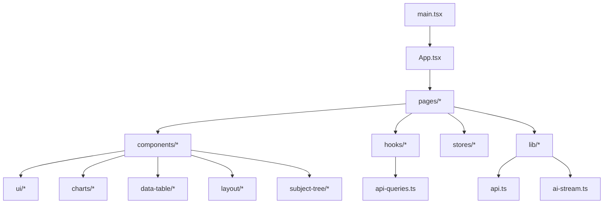

图表来源
- [main.tsx:1-50](file://web/src/main.tsx#L1-L50)
- [App.tsx:1-80](file://web/src/App.tsx#L1-L80)

章节来源
- [main.tsx:1-50](file://web/src/main.tsx#L1-L50)
- [App.tsx:1-80](file://web/src/App.tsx#L1-L80)

## 核心组件与模式总览
- 高阶组件（HOC）：权限控制类HOC（如 require-permission），用于统一拦截未授权访问与降级展示
- 渲染属性（Render Props）：表格与图表组件通过函数型children或render回调注入渲染逻辑，提升复用性
- 自定义Hooks：useAuth、usePermission、api-queries等封装跨组件复用的副作用与状态
- 组合模式：Layout、PageContainer、DataTable等由基础UI组合而成，强调“拼装优于继承”
- 工厂模式：在主题化/配置化组件中通过工厂方法生成不同变体（如不同列配置的ProDataTable）
- 状态管理：本地useState/useReducer、全局store（authStore）、服务端缓存（基于api-queries与请求封装）
- 通信模式：父子props传递、Context（权限/主题/用户信息）、事件总线（轻量emit/on用于跨树通知）

章节来源
- [require-permission.tsx:1-120](file://web/src/components/layout/require-permission.tsx#L1-L120)
- [data-table.tsx:1-200](file://web/src/components/data-table/data-table.tsx#L1-L200)
- [pro-data-table.tsx:1-200](file://web/src/components/data-table/pro-data-table.tsx#L1-L200)
- [useAuth.ts:1-120](file://web/src/hooks/useAuth.ts#L1-L120)
- [usePermission.ts:1-120](file://web/src/hooks/usePermission.ts#L1-L120)
- [api-queries.ts:1-200](file://web/src/hooks/api-queries.ts#L1-L200)
- [authStore.ts:1-120](file://web/src/stores/authStore.ts#L1-L120)

## 架构总览
前端整体遵循“页面聚合 → 组件组合 → Hook抽象 → Store/Hook共享状态 → Lib能力”的分层架构。关键流程包括：
- 应用初始化：main.tsx挂载根组件，App.tsx注册路由与全局Provider
- 页面加载：页面组件调用api-queries获取数据，结合本地状态渲染
- 权限控制：HOC拦截路由/组件渲染，结合usePermission判断
- 数据流：组件→api-queries→api.ts→后端Express服务→Prisma→PostgreSQL

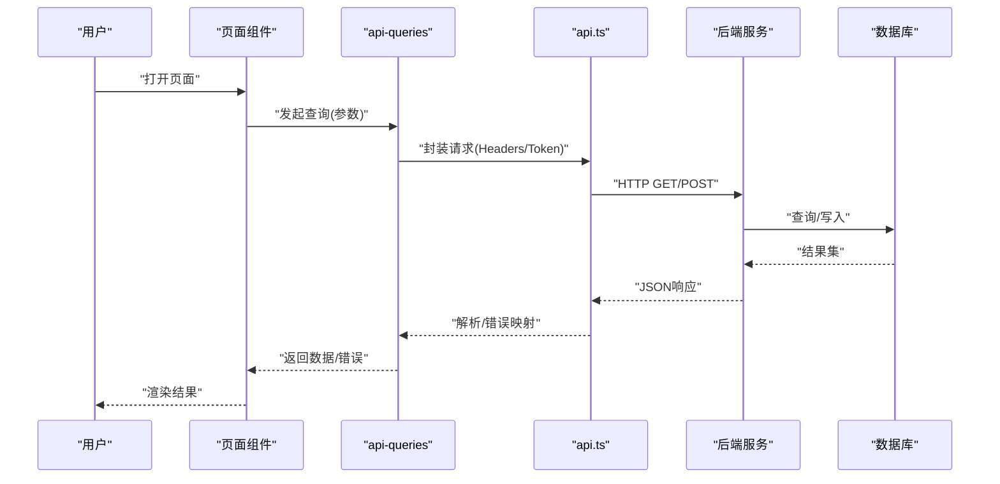

图表来源
- [api.ts:1-150](file://web/src/lib/api.ts#L1-L150)
- [api-queries.ts:1-200](file://web/src/hooks/api-queries.ts#L1-L200)

章节来源
- [main.tsx:1-50](file://web/src/main.tsx#L1-L50)
- [App.tsx:1-80](file://web/src/App.tsx#L1-L80)
- [api.ts:1-150](file://web/src/lib/api.ts#L1-L150)
- [api-queries.ts:1-200](file://web/src/hooks/api-queries.ts#L1-L200)

## 详细组件分析

### 权限控制HOC：RequirePermission
- 职责：对受保护组件进行权限校验，未通过时降级为空白或跳转登录
- 模式：高阶组件（HOC），内部使用usePermission Hook
- 适用场景：路由级或组件级权限拦截，避免重复逻辑

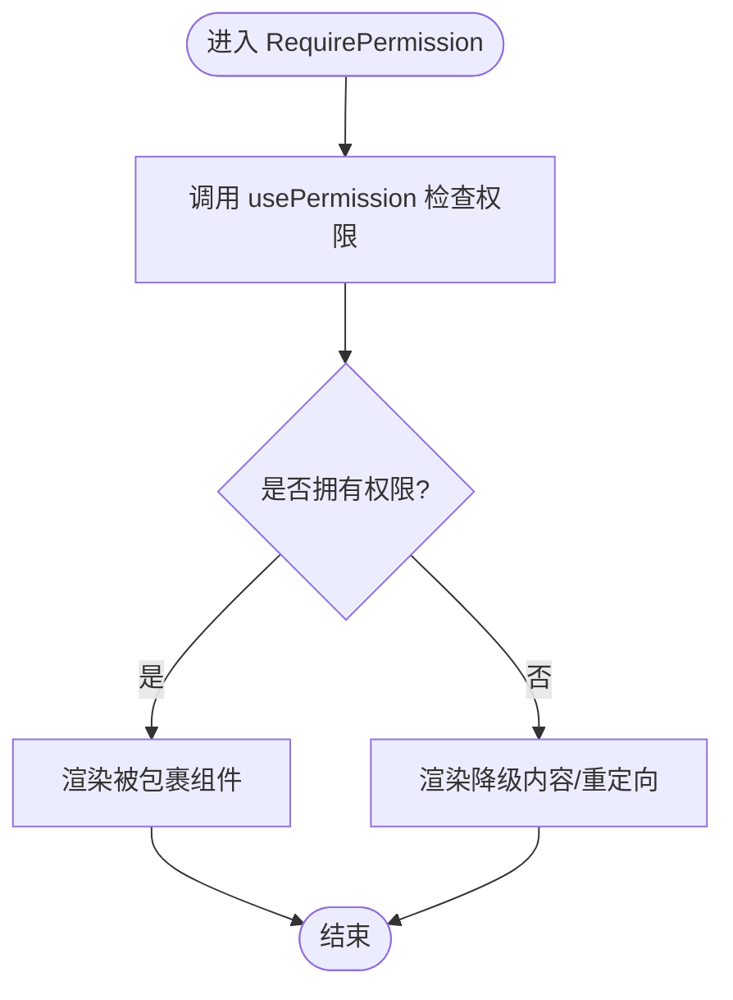

图表来源
- [require-permission.tsx:1-120](file://web/src/components/layout/require-permission.tsx#L1-L120)
- [usePermission.ts:1-120](file://web/src/hooks/usePermission.ts#L1-L120)

章节来源
- [require-permission.tsx:1-120](file://web/src/components/layout/require-permission.tsx#L1-L120)
- [usePermission.ts:1-120](file://web/src/hooks/usePermission.ts#L1-L120)
- [permissions.ts:1-120](file://web/src/lib/permissions.ts#L1-L120)

### 数据表格组件族：DataTable / ProDataTable / Pagination
- 职责：通用表格渲染、分页、排序、筛选、列定义、行操作
- 模式：组合模式（基础Table + 分页 + 列渲染）、渲染属性（单元格/行渲染回调）
- 适用场景：报表、数据维护页、指标列表等

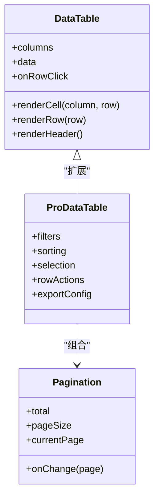

图表来源
- [data-table.tsx:1-200](file://web/src/components/data-table/data-table.tsx#L1-L200)
- [pro-data-table.tsx:1-200](file://web/src/components/data-table/pro-data-table.tsx#L1-L200)
- [pagination.tsx:1-120](file://web/src/components/data-table/pagination.tsx#L1-L120)

章节来源
- [data-table.tsx:1-200](file://web/src/components/data-table/data-table.tsx#L1-L200)
- [pro-data-table.tsx:1-200](file://web/src/components/data-table/pro-data-table.tsx#L1-L200)
- [pagination.tsx:1-120](file://web/src/components/data-table/pagination.tsx#L1-L120)

### 图表组件：KPICard / TrendChart
- 职责：关键指标卡片与趋势图渲染，支持数据格式化、空态、骨架屏
- 模式：组合模式（基础容器+内容插槽）、渲染属性（自定义刻度/颜色）
- 适用场景：仪表盘、经营分析看板

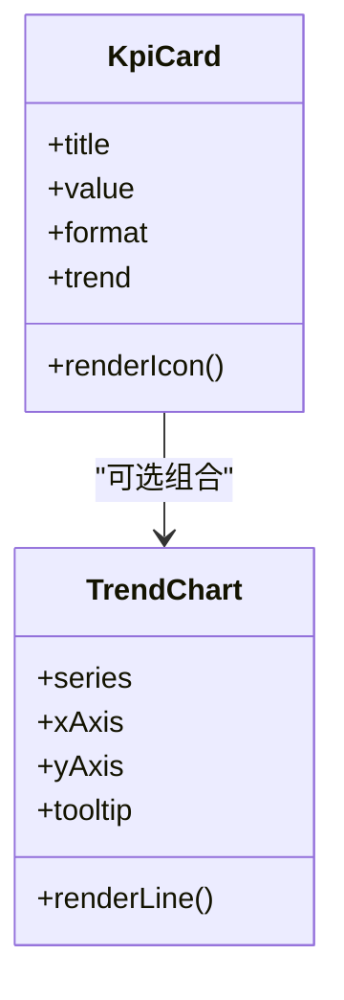

图表来源
- [kpi-card.tsx:1-150](file://web/src/components/charts/kpi-card.tsx#L1-L150)
- [trend-chart.tsx:1-200](file://web/src/components/charts/trend-chart.tsx#L1-L200)

章节来源
- [kpi-card.tsx:1-150](file://web/src/components/charts/kpi-card.tsx#L1-L150)
- [trend-chart.tsx:1-200](file://web/src/components/charts/trend-chart.tsx#L1-L200)

### 主题树与指标树：SubjectTree / MetricTree
- 职责：科目树与指标树的展开、选择、联动
- 模式：组合模式（节点组件递归组合）、事件回调（onSelect/onExpand）
- 适用场景：指标体系配置、维度选择

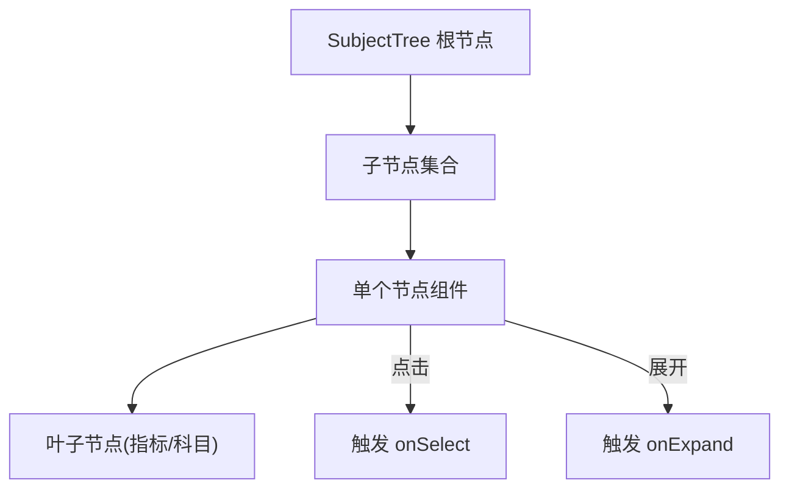

图表来源
- [subject-tree.tsx:1-200](file://web/src/components/subject-tree/subject-tree.tsx#L1-L200)
- [metric-tree.tsx:1-150](file://web/src/components/subject-tree/metric-tree.tsx#L1-L150)
- [subject-tree.ts:1-120](file://web/src/lib/subject-tree.ts#L1-L120)

章节来源
- [subject-tree.tsx:1-200](file://web/src/components/subject-tree/subject-tree.tsx#L1-L200)
- [metric-tree.tsx:1-150](file://web/src/components/subject-tree/metric-tree.tsx#L1-L150)
- [subject-tree.ts:1-120](file://web/src/lib/subject-tree.ts#L1-L120)

### 布局与页面容器：Header / MainLayout / PageContainer
- 职责：顶部导航、主布局框架、页面容器（标题、操作区、内容区）
- 模式：组合模式（Header + Content + Footer）、上下文（用户信息/主题）
- 适用场景：所有业务页面统一外壳

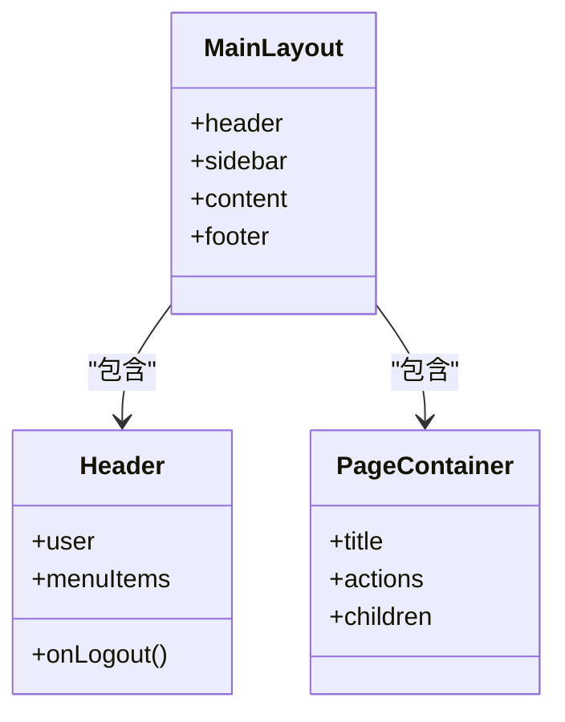

图表来源
- [header.tsx:1-120](file://web/src/components/layout/header.tsx#L1-L120)
- [main-layout.tsx:1-150](file://web/src/components/layout/main-layout.tsx#L1-L150)
- [page-container.tsx:1-120](file://web/src/components/layout/page-container.tsx#L1-L120)

章节来源
- [header.tsx:1-120](file://web/src/components/layout/header.tsx#L1-L120)
- [main-layout.tsx:1-150](file://web/src/components/layout/main-layout.tsx#L1-L150)
- [page-container.tsx:1-120](file://web/src/components/layout/page-container.tsx#L1-L120)

### 页面聚合示例：Dashboard / Reports / Data / Indicators / Inventory / Transactions / Admin / Login
- 职责：聚合数据查询、组合子组件、处理用户交互
- 模式：组合模式（页面=布局+组件+Hook）、事件驱动（按钮→API→状态更新）
- 适用场景：各业务模块首页

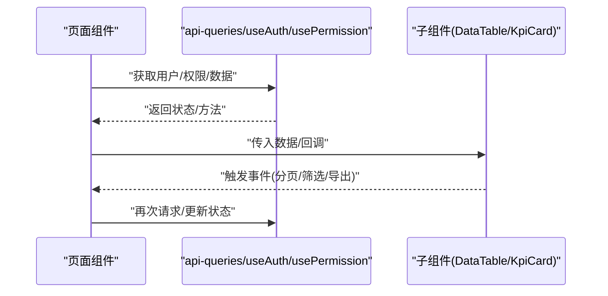

图表来源
- [dashboard/index.tsx:1-200](file://web/src/pages/dashboard/index.tsx#L1-L200)
- [reports/index.tsx:1-200](file://web/src/pages/reports/index.tsx#L1-L200)
- [data/index.tsx:1-200](file://web/src/pages/data/index.tsx#L1-L200)
- [indicators/index.tsx:1-200](file://web/src/pages/indicators/index.tsx#L1-L200)
- [inventory/index.tsx:1-200](file://web/src/pages/inventory/index.tsx#L1-L200)
- [transactions/index.tsx:1-200](file://web/src/pages/transactions/index.tsx#L1-L200)
- [admin/index.tsx:1-200](file://web/src/pages/admin/index.tsx#L1-L200)
- [login/index.tsx:1-200](file://web/src/pages/login/index.tsx#L1-L200)

章节来源
- [dashboard/index.tsx:1-200](file://web/src/pages/dashboard/index.tsx#L1-L200)
- [reports/index.tsx:1-200](file://web/src/pages/reports/index.tsx#L1-L200)
- [data/index.tsx:1-200](file://web/src/pages/data/index.tsx#L1-L200)
- [indicators/index.tsx:1-200](file://web/src/pages/indicators/index.tsx#L1-L200)
- [inventory/index.tsx:1-200](file://web/src/pages/inventory/index.tsx#L1-L200)
- [transactions/index.tsx:1-200](file://web/src/pages/transactions/index.tsx#L1-L200)
- [admin/index.tsx:1-200](file://web/src/pages/admin/index.tsx#L1-L200)
- [login/index.tsx:1-200](file://web/src/pages/login/index.tsx#L1-L200)

### 自定义Hooks：useAuth / usePermission / api-queries
- useAuth：封装认证状态、登录/登出、Token刷新
- usePermission：权限判断、角色/资源映射
- api-queries：统一请求封装、错误映射、缓存策略

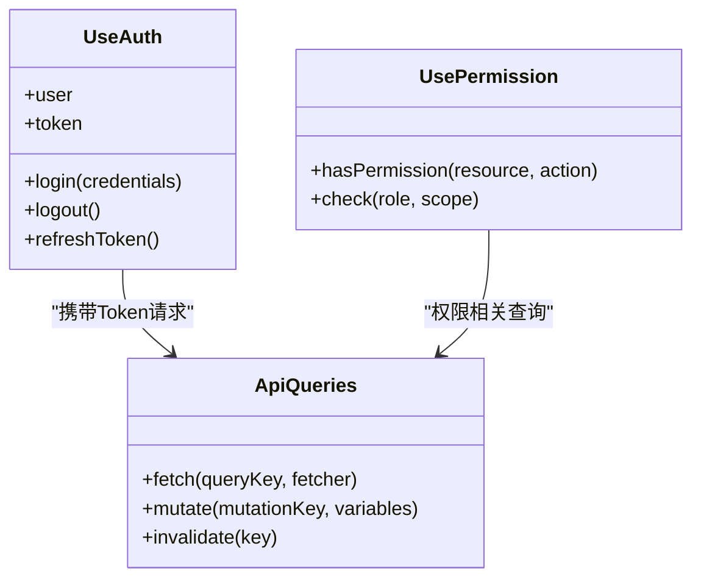

图表来源
- [useAuth.ts:1-120](file://web/src/hooks/useAuth.ts#L1-L120)
- [usePermission.ts:1-120](file://web/src/hooks/usePermission.ts#L1-L120)
- [api-queries.ts:1-200](file://web/src/hooks/api-queries.ts#L1-L200)

章节来源
- [useAuth.ts:1-120](file://web/src/hooks/useAuth.ts#L1-L120)
- [usePermission.ts:1-120](file://web/src/hooks/usePermission.ts#L1-L120)
- [api-queries.ts:1-200](file://web/src/hooks/api-queries.ts#L1-L200)

### AI流式处理：ai-stream.ts
- 职责：SSE流式读取、增量渲染、错误重试
- 模式：异步迭代器/ReadableStream消费，结合React状态增量更新
- 适用场景：AI辅助分析、文本润色输出

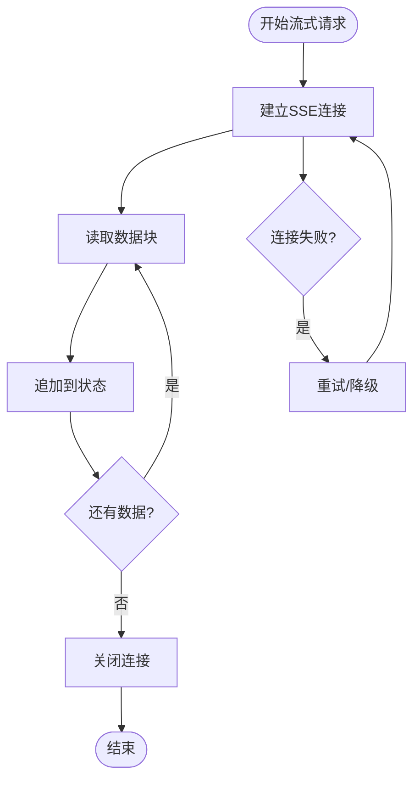

图表来源
- [ai-stream.ts:1-150](file://web/src/lib/ai-stream.ts#L1-L150)

章节来源
- [ai-stream.ts:1-150](file://web/src/lib/ai-stream.ts#L1-L150)

## 依赖关系分析
- 组件间耦合度低：通过Props与回调解耦，HOC与Hooks进一步隔离横切关注点
- 外部依赖：api.ts统一网络层，ai-stream.ts处理SSE，export.ts/report-export.ts处理导出
- 潜在循环依赖：避免在lib中直接import页面组件，保持单向依赖

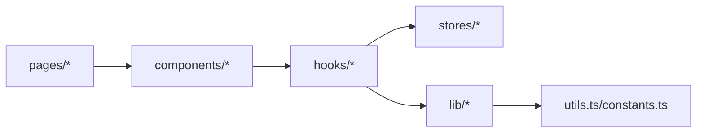

图表来源
- [api.ts:1-150](file://web/src/lib/api.ts#L1-L150)
- [utils.ts:1-120](file://web/src/lib/utils.ts#L1-L120)
- [constants.ts:1-120](file://web/src/lib/constants.ts#L1-L120)

章节来源
- [api.ts:1-150](file://web/src/lib/api.ts#L1-L150)
- [utils.ts:1-120](file://web/src/lib/utils.ts#L1-L120)
- [constants.ts:1-120](file://web/src/lib/constants.ts#L1-L120)

## 性能考量
- 组件渲染优化：合理使用React.memo、useMemo、useCallback减少重渲染
- 数据加载优化：分页、虚拟滚动、按需加载（懒加载页面/组件）
- 网络优化：请求去重、缓存策略、错误重试与退避
- 大列表优化：虚拟列表、增量渲染、防抖/节流搜索
- AI流式渲染：分片更新、合并小片段、避免频繁setState

[本节为通用指导，不直接分析具体文件]

## 故障排查指南
- 权限问题：检查require-permission HOC与usePermission逻辑，确认权限映射与当前用户角色
- 数据异常：查看api-queries的错误映射与重试策略，确认后端返回结构与字段
- 流式输出：检查ai-stream.ts的连接与重试逻辑，确认SSE端点可用性
- 表格渲染：核对列定义与数据格式，确保renderCell与formatter正确
- 导出失败：检查export.ts与report-export.ts的参数与模板配置

章节来源
- [require-permission.tsx:1-120](file://web/src/components/layout/require-permission.tsx#L1-L120)
- [usePermission.ts:1-120](file://web/src/hooks/usePermission.ts#L1-L120)
- [api-queries.ts:1-200](file://web/src/hooks/api-queries.ts#L1-L200)
- [ai-stream.ts:1-150](file://web/src/lib/ai-stream.ts#L1-L150)
- [export.ts:1-120](file://web/src/lib/export.ts#L1-L120)
- [report-export.ts:1-120](file://web/src/lib/report-export.ts#L1-L120)

## 结论
FY200前端的组件设计以“组合优先、Hook抽象、HOC横切、Store轻量”为核心原则，形成高内聚、低耦合的可维护架构。通过清晰的职责划分与模式化实践，项目在权限控制、数据表格、图表、主题树、布局与页面聚合等方面实现了良好的复用性与扩展性。建议在后续迭代中持续强化单元测试与集成测试覆盖，完善错误边界与性能监控，进一步提升稳定性与用户体验。

[本节为总结，不直接分析具体文件]

## 附录：最佳实践清单
- 组件设计
  - 优先使用组合模式与渲染属性，避免深层继承
  - 将副作用与状态逻辑抽离至自定义Hooks
  - 使用HOC统一横切关注点（权限、日志、埋点）
- 通信模式
  - 父子通信用props与回调；跨层级用Context；跨树通信用轻量事件总线
- 状态管理
  - 本地状态：useState/useReducer；全局状态：轻量store（如authStore）；服务器状态：api-queries缓存与失效
- 测试模式
  - 单元测试：组件快照与行为断言（参考data-table.test.tsx、require-permission.test.tsx、usePermission.test.tsx）
  - 集成测试：Mock API与网络层，验证端到端流程
- 性能优化
  - React.memo/useMemo/useCallback；分页与虚拟列表；请求去重与缓存；流式增量渲染
- 错误处理
  - 统一错误映射与提示；重试与降级策略；用户友好的空态与骨架屏

[本节为通用指导，不直接分析具体文件]