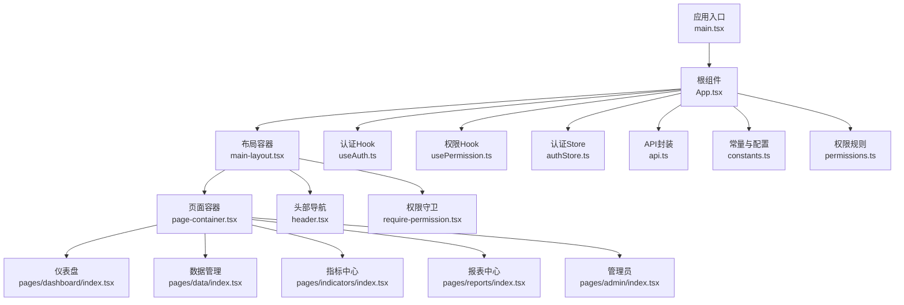
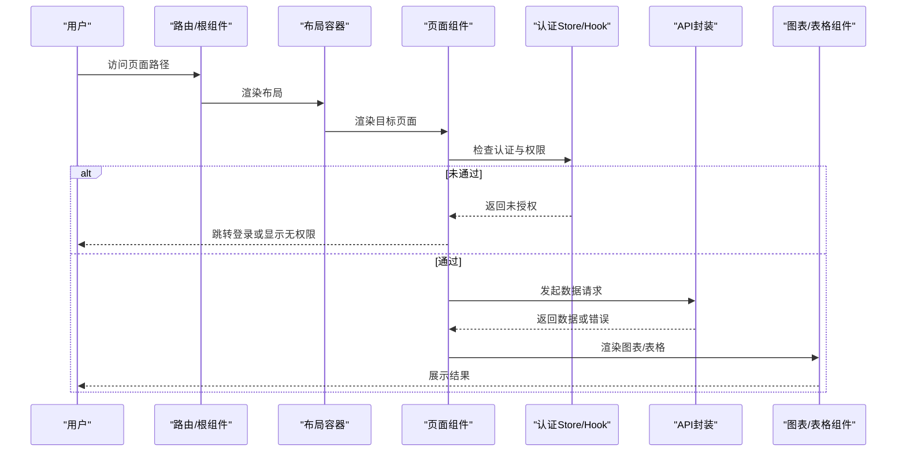
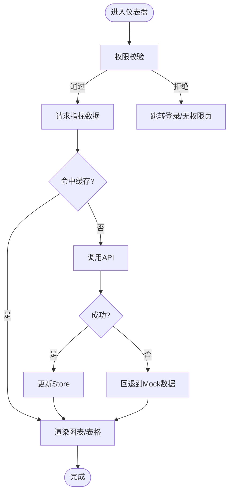
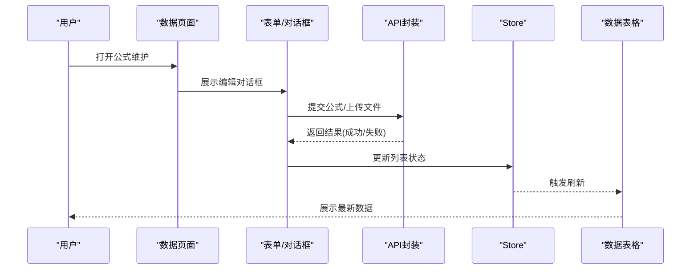
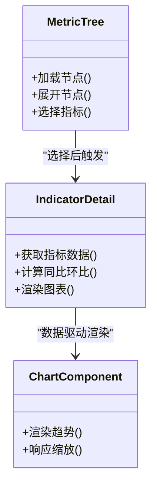
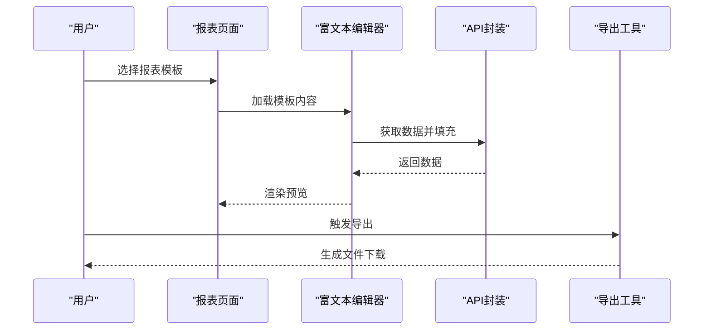
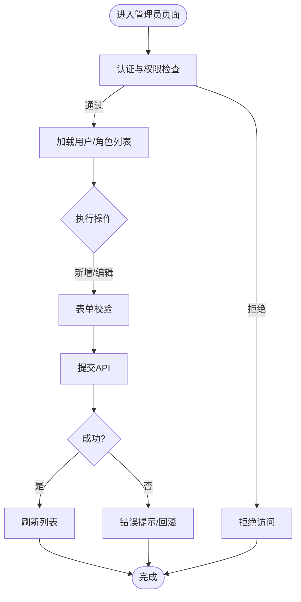
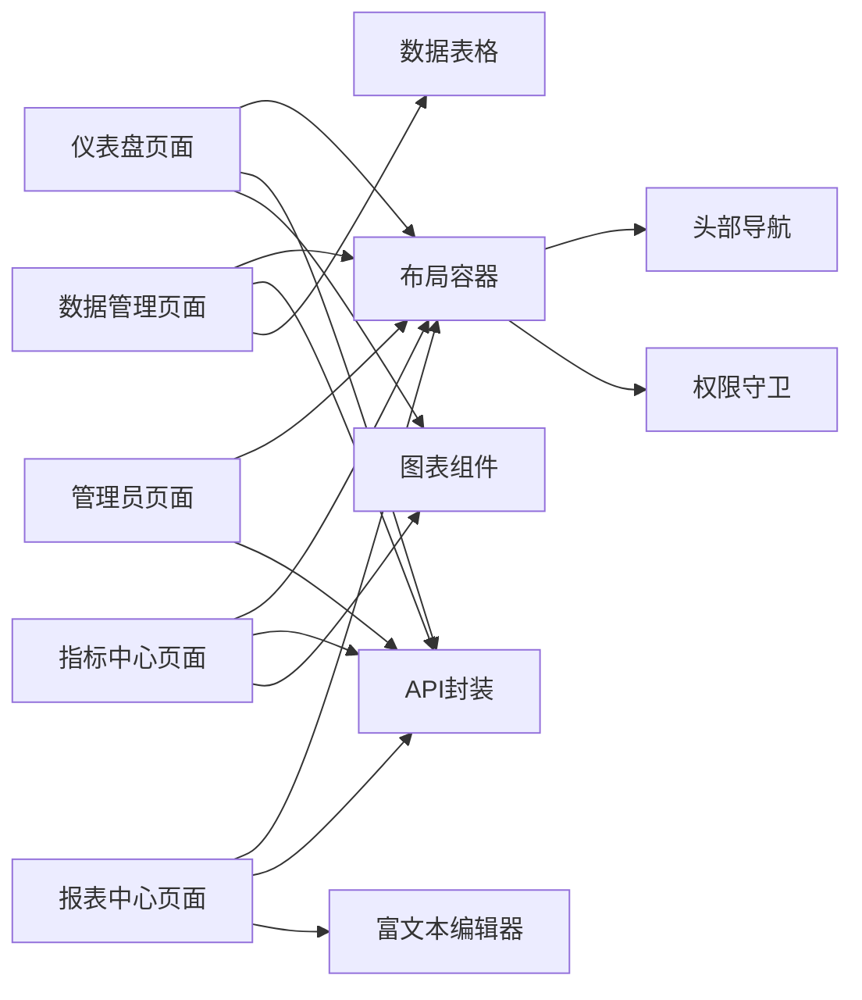

# 页面组件架构

<cite>
**本文引用的文件**   
- [web/src/main.tsx](file://web/src/main.tsx)
- [web/src/App.tsx](file://web/src/App.tsx)
- [web/src/pages/dashboard/index.tsx](file://web/src/pages/dashboard/index.tsx)
- [web/src/pages/data/index.tsx](file://web/src/pages/data/index.tsx)
- [web/src/pages/indicators/index.tsx](file://web/src/pages/indicators/index.tsx)
- [web/src/pages/reports/index.tsx](file://web/src/pages/reports/index.tsx)
- [web/src/pages/admin/index.tsx](file://web/src/pages/admin/index.tsx)
- [web/src/components/layout/main-layout.tsx](file://web/src/components/layout/main-layout.tsx)
- [web/src/components/layout/page-container.tsx](file://web/src/components/layout/page-container.tsx)
- [web/src/components/layout/header.tsx](file://web/src/components/layout/header.tsx)
- [web/src/components/layout/require-permission.tsx](file://web/src/components/layout/require-permission.tsx)
- [web/src/hooks/useAuth.ts](file://web/src/hooks/useAuth.ts)
- [web/src/hooks/usePermission.ts](file://web/src/hooks/usePermission.ts)
- [web/src/stores/authStore.ts](file://web/src/stores/authStore.ts)
- [web/src/lib/api.ts](file://web/src/lib/api.ts)
- [web/src/lib/constants.ts](file://web/src/lib/constants.ts)
- [web/src/lib/permissions.ts](file://web/src/lib/permissions.ts)
- [web/src/lib/export.ts](file://web/src/lib/export.ts)
- [web/src/lib/report-export.ts](file://web/src/lib/report-export.ts)
- [web/src/components/ui/skeleton.tsx](file://web/src/components/ui/skeleton.tsx)
- [web/src/components/ui/status-indicator.tsx](file://web/src/components/ui/status-indicator.tsx)
- [web/src/components/charts/kpi-card.tsx](file://web/src/components/charts/kpi-card.tsx)
- [web/src/components/charts/trend-chart.tsx](file://web/src/components/charts/trend-chart.tsx)
- [web/src/components/data-table/pro-data-table.tsx](file://web/src/components/data-table/pro-data-table.tsx)
- [web/src/components/dimension/company-panel.tsx](file://web/src/components/dimension/company-panel.tsx)
- [web/src/components/subject-tree/metric-tree.tsx](file://web/src/components/subject-tree/metric-tree.tsx)
- [web/src/components/editor/rich-text-editor.tsx](file://web/src/components/editor/rich-text-editor.tsx)
- [web/src/mock/static-analysis.ts](file://web/src/mock/static-analysis.ts)
</cite>

## 目录
1. [简介](#简介)
2. [项目结构](#项目结构)
3. [核心组件](#核心组件)
4. [架构总览](#架构总览)
5. [详细组件分析](#详细组件分析)
6. [依赖关系分析](#依赖关系分析)
7. [性能考量](#性能考量)
8. [故障排查指南](#故障排查指南)
9. [结论](#结论)
10. [附录](#附录)

## 简介
本文件面向FY200项目的页面组件架构，聚焦前端Web端（React + Vite）的页面组织、路由与状态管理、权限控制、加载与错误边界、懒加载与缓存策略、生命周期与副作用处理，以及性能优化与最佳实践。文档以Dashboard、Data、Indicators、Reports、Admin等核心页面为主线，结合全局store与API层交互，给出清晰的架构图与流程图，帮助开发者快速理解并高效扩展。

## 项目结构
前端采用按“功能域+页面”的组织方式：
- pages：页面级入口，每个业务模块一个目录，包含index.tsx作为页面主组件
- components：可复用UI与业务组件，按charts、data-table、dimension、editor、layout、ui等划分
- hooks：页面与组件共享的状态与逻辑封装
- stores：全局状态（如认证信息）
- lib：工具库、API封装、常量、权限规则、导出能力等
- mock：本地模拟数据，用于开发联调

图表来源 
- [web/src/main.tsx](file://web/src/main.tsx)
- [web/src/App.tsx](file://web/src/App.tsx)
- [web/src/components/layout/main-layout.tsx](file://web/src/components/layout/main-layout.tsx)
- [web/src/components/layout/page-container.tsx](file://web/src/components/layout/page-container.tsx)
- [web/src/components/layout/header.tsx](file://web/src/components/layout/header.tsx)
- [web/src/components/layout/require-permission.tsx](file://web/src/components/layout/require-permission.tsx)
- [web/src/hooks/useAuth.ts](file://web/src/hooks/useAuth.ts)
- [web/src/hooks/usePermission.ts](file://web/src/hooks/usePermission.ts)
- [web/src/stores/authStore.ts](file://web/src/stores/authStore.ts)
- [web/src/lib/api.ts](file://web/src/lib/api.ts)
- [web/src/lib/constants.ts](file://web/src/lib/constants.ts)
- [web/src/lib/permissions.ts](file://web/src/lib/permissions.ts)

章节来源
- [web/src/main.tsx](file://web/src/main.tsx)
- [web/src/App.tsx](file://web/src/App.tsx)
- [web/src/components/layout/main-layout.tsx](file://web/src/components/layout/main-layout.tsx)
- [web/src/components/layout/page-container.tsx](file://web/src/components/layout/page-container.tsx)
- [web/src/components/layout/header.tsx](file://web/src/components/layout/header.tsx)
- [web/src/components/layout/require-permission.tsx](file://web/src/components/layout/require-permission.tsx)
- [web/src/hooks/useAuth.ts](file://web/src/hooks/useAuth.ts)
- [web/src/hooks/usePermission.ts](file://web/src/hooks/usePermission.ts)
- [web/src/stores/authStore.ts](file://web/src/stores/authStore.ts)
- [web/src/lib/api.ts](file://web/src/lib/api.ts)
- [web/src/lib/constants.ts](file://web/src/lib/constants.ts)
- [web/src/lib/permissions.ts](file://web/src/lib/permissions.ts)

## 核心组件
- 应用入口与根组件：负责初始化全局上下文、注册路由、挂载布局与错误边界
- 布局容器：统一侧边栏、顶部导航、面包屑、页脚与页面内容区
- 页面容器：提供统一的页面标题、操作区、筛选区、表格/图表区域与加载骨架屏
- 权限守卫：基于角色/权限码拦截未授权访问，支持降级展示或跳转登录
- 认证Hook与Store：集中管理用户身份、Token轮转、会话过期与刷新
- API封装：统一请求拦截、错误处理、重试与缓存策略
- 通用UI与图表：KPI卡片、趋势图、专业数据表格、维度面板、富文本编辑器等

章节来源
- [web/src/App.tsx](file://web/src/App.tsx)
- [web/src/components/layout/main-layout.tsx](file://web/src/components/layout/main-layout.tsx)
- [web/src/components/layout/page-container.tsx](file://web/src/components/layout/page-container.tsx)
- [web/src/components/layout/require-permission.tsx](file://web/src/components/layout/require-permission.tsx)
- [web/src/hooks/useAuth.ts](file://web/src/hooks/useAuth.ts)
- [web/src/stores/authStore.ts](file://web/src/stores/authStore.ts)
- [web/src/lib/api.ts](file://web/src/lib/api.ts)

## 架构总览
页面组件通过路由进入对应页面，页面在渲染前执行权限校验与数据预取；页面内部使用Hooks与Store进行状态管理，调用API获取数据并通过图表与表格组件呈现。整体遵循“低耦合、高内聚”的模块化设计，便于独立开发与测试。

图表来源 
- [web/src/App.tsx](file://web/src/App.tsx)
- [web/src/components/layout/main-layout.tsx](file://web/src/components/layout/main-layout.tsx)
- [web/src/components/layout/page-container.tsx](file://web/src/components/layout/page-container.tsx)
- [web/src/hooks/useAuth.ts](file://web/src/hooks/useAuth.ts)
- [web/src/stores/authStore.ts](file://web/src/stores/authStore.ts)
- [web/src/lib/api.ts](file://web/src/lib/api.ts)

## 详细组件分析

### Dashboard（仪表盘）
- 职责：聚合关键经营指标、趋势概览、公司维度切片
- 数据流：页面Hook触发查询 → API层带缓存与错误重试 → Store更新 → 图表组件渲染
- 权限：默认开放或按角色限制敏感指标
- 加载与错误：骨架屏占位，错误时降级为静态示例数据
- 性能：图表按需渲染、防抖筛选、分页与虚拟滚动

图表来源 
- [web/src/pages/dashboard/index.tsx](file://web/src/pages/dashboard/index.tsx)
- [web/src/lib/api.ts](file://web/src/lib/api.ts)
- [web/src/stores/authStore.ts](file://web/src/stores/authStore.ts)
- [web/src/components/charts/kpi-card.tsx](file://web/src/components/charts/kpi-card.tsx)
- [web/src/components/charts/trend-chart.tsx](file://web/src/components/charts/trend-chart.tsx)
- [web/src/components/dimension/company-panel.tsx](file://web/src/components/dimension/company-panel.tsx)
- [web/src/mock/static-analysis.ts](file://web/src/mock/static-analysis.ts)

章节来源
- [web/src/pages/dashboard/index.tsx](file://web/src/pages/dashboard/index.tsx)
- [web/src/components/charts/kpi-card.tsx](file://web/src/components/charts/kpi-card.tsx)
- [web/src/components/charts/trend-chart.tsx](file://web/src/components/charts/trend-chart.tsx)
- [web/src/components/dimension/company-panel.tsx](file://web/src/components/dimension/company-panel.tsx)
- [web/src/mock/static-analysis.ts](file://web/src/mock/static-analysis.ts)

### Data（数据管理）
- 职责：公式维护、历史版本查看、导入模板与校验
- 数据流：表单提交 → 校验 → API上传/保存 → 列表刷新
- 权限：仅管理员或特定角色可编辑公式
- 加载与错误：上传进度条、失败重试、错误提示
- 性能：大文件分片上传、增量更新、去重校验

图表来源 
- [web/src/pages/data/index.tsx](file://web/src/pages/data/index.tsx)
- [web/src/lib/api.ts](file://web/src/lib/api.ts)
- [web/src/stores/authStore.ts](file://web/src/stores/authStore.ts)
- [web/src/components/data-table/pro-data-table.tsx](file://web/src/components/data-table/pro-data-table.tsx)

章节来源
- [web/src/pages/data/index.tsx](file://web/src/pages/data/index.tsx)
- [web/src/components/data-table/pro-data-table.tsx](file://web/src/components/data-table/pro-data-table.tsx)

### Indicators（指标中心）
- 职责：指标树、度量维度、计算规则与可视化
- 数据流：选择指标 → 拉取明细 → 计算同比/环比 → 渲染趋势
- 权限：按指标级别控制可见性
- 加载与错误：骨架屏、错误降级、空态提示
- 性能：指标树懒加载、图表按需渲染、缓存热点指标

图表来源 
- [web/src/pages/indicators/index.tsx](file://web/src/pages/indicators/index.tsx)
- [web/src/components/subject-tree/metric-tree.tsx](file://web/src/components/subject-tree/metric-tree.tsx)
- [web/src/components/charts/trend-chart.tsx](file://web/src/components/charts/trend-chart.tsx)
- [web/src/lib/api.ts](file://web/src/lib/api.ts)

章节来源
- [web/src/pages/indicators/index.tsx](file://web/src/pages/indicators/index.tsx)
- [web/src/components/subject-tree/metric-tree.tsx](file://web/src/components/subject-tree/metric-tree.tsx)
- [web/src/components/charts/trend-chart.tsx](file://web/src/components/charts/trend-chart.tsx)

### Reports（报表中心）
- 职责：报表模板、编辑与导出（PDF/Excel）
- 数据流：选择模板 → 填充数据 → 预览 → 导出
- 权限：按报表类型与角色控制编辑与导出
- 加载与错误：预览骨架屏、导出进度、失败重试
- 性能：分页预览、流式导出、内存优化

图表来源 
- [web/src/pages/reports/index.tsx](file://web/src/pages/reports/index.tsx)
- [web/src/components/editor/rich-text-editor.tsx](file://web/src/components/editor/rich-text-editor.tsx)
- [web/src/lib/export.ts](file://web/src/lib/export.ts)
- [web/src/lib/report-export.ts](file://web/src/lib/report-export.ts)
- [web/src/lib/api.ts](file://web/src/lib/api.ts)

章节来源
- [web/src/pages/reports/index.tsx](file://web/src/pages/reports/index.tsx)
- [web/src/components/editor/rich-text-editor.tsx](file://web/src/components/editor/rich-text-editor.tsx)
- [web/src/lib/export.ts](file://web/src/lib/export.ts)
- [web/src/lib/report-export.ts](file://web/src/lib/report-export.ts)

### Admin（管理员）
- 职责：用户与角色管理、权限分配、系统配置
- 数据流：CRUD操作 → 权限校验 → 列表刷新
- 权限：严格管控，仅管理员可用
- 加载与错误：批量操作反馈、错误回滚
- 性能：分页与搜索、批量操作异步化

图表来源 
- [web/src/pages/admin/index.tsx](file://web/src/pages/admin/index.tsx)
- [web/src/components/layout/require-permission.tsx](file://web/src/components/layout/require-permission.tsx)
- [web/src/lib/api.ts](file://web/src/lib/api.ts)

章节来源
- [web/src/pages/admin/index.tsx](file://web/src/pages/admin/index.tsx)
- [web/src/components/layout/require-permission.tsx](file://web/src/components/layout/require-permission.tsx)

## 依赖关系分析
页面组件依赖关系清晰，主要依赖如下：
- 页面组件依赖布局与页面容器，保证一致的视觉与交互
- 页面组件依赖认证Hook与Store，确保权限与身份一致
- 页面组件依赖API封装，统一网络请求与错误处理
- 页面组件依赖图表与表格组件，实现数据可视化与交互

图表来源 
- [web/src/pages/dashboard/index.tsx](file://web/src/pages/dashboard/index.tsx)
- [web/src/pages/data/index.tsx](file://web/src/pages/data/index.tsx)
- [web/src/pages/indicators/index.tsx](file://web/src/pages/indicators/index.tsx)
- [web/src/pages/reports/index.tsx](file://web/src/pages/reports/index.tsx)
- [web/src/pages/admin/index.tsx](file://web/src/pages/admin/index.tsx)
- [web/src/components/layout/main-layout.tsx](file://web/src/components/layout/main-layout.tsx)
- [web/src/components/layout/header.tsx](file://web/src/components/layout/header.tsx)
- [web/src/components/layout/require-permission.tsx](file://web/src/components/layout/require-permission.tsx)
- [web/src/lib/api.ts](file://web/src/lib/api.ts)
- [web/src/components/charts/kpi-card.tsx](file://web/src/components/charts/kpi-card.tsx)
- [web/src/components/charts/trend-chart.tsx](file://web/src/components/charts/trend-chart.tsx)
- [web/src/components/data-table/pro-data-table.tsx](file://web/src/components/data-table/pro-data-table.tsx)
- [web/src/components/editor/rich-text-editor.tsx](file://web/src/components/editor/rich-text-editor.tsx)

章节来源
- [web/src/pages/dashboard/index.tsx](file://web/src/pages/dashboard/index.tsx)
- [web/src/pages/data/index.tsx](file://web/src/pages/data/index.tsx)
- [web/src/pages/indicators/index.tsx](file://web/src/pages/indicators/index.tsx)
- [web/src/pages/reports/index.tsx](file://web/src/pages/reports/index.tsx)
- [web/src/pages/admin/index.tsx](file://web/src/pages/admin/index.tsx)
- [web/src/components/layout/main-layout.tsx](file://web/src/components/layout/main-layout.tsx)
- [web/src/components/layout/header.tsx](file://web/src/components/layout/header.tsx)
- [web/src/components/layout/require-permission.tsx](file://web/src/components/layout/require-permission.tsx)
- [web/src/lib/api.ts](file://web/src/lib/api.ts)
- [web/src/components/charts/kpi-card.tsx](file://web/src/components/charts/kpi-card.tsx)
- [web/src/components/charts/trend-chart.tsx](file://web/src/components/charts/trend-chart.tsx)
- [web/src/components/data-table/pro-data-table.tsx](file://web/src/components/data-table/pro-data-table.tsx)
- [web/src/components/editor/rich-text-editor.tsx](file://web/src/components/editor/rich-text-editor.tsx)

## 性能考量
- 懒加载：页面与路由级懒加载，减少首屏体积
- 缓存策略：API层对热点数据做短期缓存，避免重复请求
- 虚拟化：大数据表格使用虚拟滚动，提升渲染性能
- 防抖节流：输入框与筛选器使用防抖，降低频繁请求
- 图表优化：按需渲染、增量更新、取消无效请求
- 骨架屏：提升感知性能，减少白屏时间

[本节为通用指导，不直接分析具体文件]

## 故障排查指南
- 认证失败：检查Token有效期与刷新机制，确认黑名单与中间件顺序
- 权限不足：核对角色与权限码映射，确认守卫组件生效
- 数据加载失败：查看API错误码与重试策略，启用Mock数据定位问题
- 图表渲染异常：检查数据结构与字段映射，确认尺寸与样式
- 导出失败：检查文件大小与内存占用，启用分块导出

章节来源
- [web/src/hooks/useAuth.ts](file://web/src/hooks/useAuth.ts)
- [web/src/stores/authStore.ts](file://web/src/stores/authStore.ts)
- [web/src/components/layout/require-permission.tsx](file://web/src/components/layout/require-permission.tsx)
- [web/src/lib/api.ts](file://web/src/lib/api.ts)
- [web/src/components/ui/skeleton.tsx](file://web/src/components/ui/skeleton.tsx)
- [web/src/components/ui/status-indicator.tsx](file://web/src/components/ui/status-indicator.tsx)

## 结论
FY200页面组件架构以模块化、低耦合为核心，通过清晰的职责划分与统一的数据流控制，实现了可扩展、易维护的前端体系。Dashboard、Data、Indicators、Reports、Admin等页面在权限、加载、错误处理与性能优化方面保持一致的最佳实践，有助于团队协作与长期演进。

[本节为总结，不直接分析具体文件]

## 附录
- 页面开发最佳实践
  - 使用页面容器统一结构与交互
  - 通过Hook封装复杂逻辑，保持组件简洁
  - 使用权限守卫确保访问安全
  - 利用API封装统一错误与重试
  - 引入骨架屏与状态指示器提升用户体验
- 常见问题解决方案
  - 权限冲突：集中管理权限规则，避免分散判断
  - 数据不一致：使用Store集中状态，避免多源更新
  - 性能瓶颈：懒加载、缓存、虚拟化与防抖节流组合使用

[本节为补充说明，不直接分析具体文件]